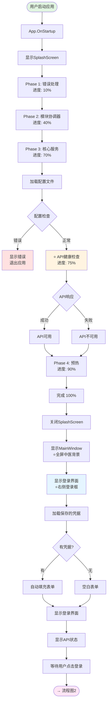
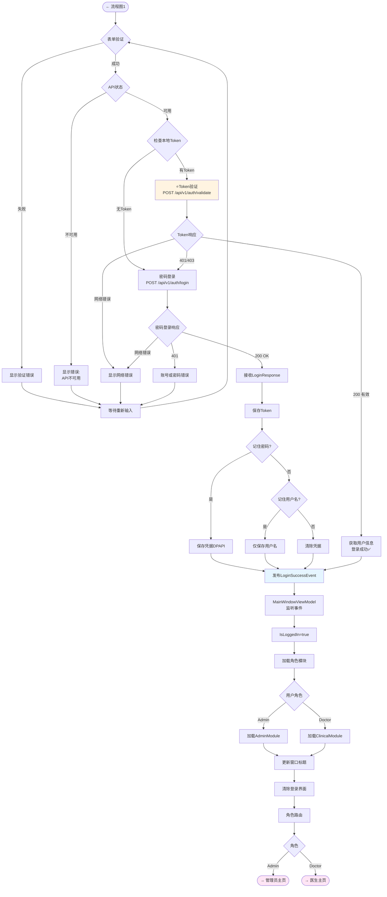

# LYBTZYZS 完整启动流程重构方案（启动→登录→角色主页）

**文档版本**: 1.0
**创建日期**: 2025-11-04
**整合文档**:
- `02-startup-login-optimized.md` - 启动与登录优化
- `03-clinical-home-dashboard.md` - 医生主页设计
- 现有管理员主页实现
**用途**: 端到端流程重构的完整设计与实施计划

---

## 📋 重构范围

本次重构覆盖从应用启动到角色工作台主页显示的完整流程：

```
应用启动 → SplashScreen(4 Phases) → 主窗口显示 → 登录界面
→ Token验证/密码登录 → 角色路由 → 工作台主页显示
  ├─ Admin → 管理员主页(6个卡片)
  └─ Doctor → 医生主页(主卡片+辅助卡片)
```

---

## 🎯 核心优化点总览

### 1. 应用启动优化
- ✅ API健康检查前置到Phase 3（不在LoginViewModel）
- ✅ SplashScreen进度可视化（4个Phase，0%→100%）
- ✅ 创建IApplicationStateService保存全局状态

### 2. 登录界面优化
- ✅ 全屏中医主题背景图
- ✅ 右侧登录框（420x580px）
- ✅ Token验证策略（方案C：优先验证Token，失败后密码登录）
- ✅ 取消自动登录（必须手动点击"登录"按钮）
- ✅ API不可用时降级处理（提示本地模式v2.x）

### 3. 管理员主页（已实现）
- ✅ 3×2卡片网格（6个功能）
- ✅ 图标48px + 标题18px
- ✅ Hover效果（淡蓝色背景+蓝色边框）

### 4. 医生主页优化（重点）
- 🆕 主卡片设计（开始接诊）- 500x220px，淡蓝渐变
- 🆕 统计卡片（今日接诊/待办）- 240x220px，占位显示
- 🆕 4个辅助功能卡片（患者/病历/药材/验方）- 160x160px
- 🆕 上下两部分布局（主功能区 + 辅助功能区）

### 5. 角色路由优化
- ✅ 基于事件驱动（LoginSuccessEvent）
- ✅ RoleNavigationService统一管理
- ✅ Doctor → ClinicalHomeView
- ✅ Admin → AdminHomeView

---

## 🗺️ 完整流程图（分3段）

> **说明**：由于完整流程过于复杂（100+节点），拆分为3个独立流程图便于阅读。

---

### 流程图1：应用启动与登录



---

### 流程图2：登录验证与角色路由



---

### 流程图3：角色工作台主页

```mermaid
flowchart TD
    AdminHome([管理员主页]) --> AdminLayout[3×2卡片网格]
    AdminLayout --> AdminCard1[👤 用户管理]
    AdminLayout --> AdminCard2[🌿 药材管理]
    AdminLayout --> AdminCard3[🏥 患者管理]
    AdminLayout --> AdminCard4[📋 验方管理]
    AdminLayout --> AdminCard5[📁 病历管理]
    AdminLayout --> AdminCard6[⚙️ 系统设置]

    AdminCard1 --> AdminReady([管理员工作台就绪])
    AdminCard2 --> AdminReady
    AdminCard3 --> AdminReady
    AdminCard4 --> AdminReady
    AdminCard5 --> AdminReady
    AdminCard6 --> AdminReady

    ClinicalHome([医生主页]) --> ClinicalLayout[上下两部分布局]

    ClinicalLayout --> MainCardArea[上: 主功能区]
    MainCardArea --> MainCard[🩺 开始接诊<br/>500x220 主卡片<br/>淡蓝渐变]
    MainCardArea --> StatsCard[📊 统计卡片<br/>240x220<br/>接诊:-- 待办:--]

    ClinicalLayout --> AuxArea[下: 辅助功能区]
    AuxArea --> AuxCard1[👤 患者管理<br/>160x160]
    AuxArea --> AuxCard2[📁 病历查询<br/>160x160]
    AuxArea --> AuxCard3[🌿 药材查询<br/>160x160]
    AuxArea --> AuxCard4[📋 验方库<br/>160x160]

    MainCard --> ClinicalReady([医生工作台就绪])
    StatsCard --> ClinicalReady
    AuxCard1 --> ClinicalReady
    AuxCard2 --> ClinicalReady
    AuxCard3 --> ClinicalReady
    AuxCard4 --> ClinicalReady

    AdminReady --> AdminActions{管理员操作}
    AdminActions -->|用户管理| UserMgmt[UserManagementView]
    AdminActions -->|药材管理| HerbMgmt[HerbManagementView]
    AdminActions -->|患者管理| PatientMgmt[PatientManagementView]
    AdminActions -->|验方管理| FormulaMgmt[FormulaManagementView]
    AdminActions -->|病历管理| MedicalCaseMgmt[MedicalCaseManagementView]
    AdminActions -->|系统设置| SystemSettings[SystemSettingsView]

    ClinicalReady --> ClinicalActions{医生操作}
    ClinicalActions -->|开始接诊| StartConsultation[⭐PatientSelectionView]
    ClinicalActions -->|患者管理| PatientMgmt
    ClinicalActions -->|病历查询| MedicalCaseMgmt
    ClinicalActions -->|药材查询| HerbQuery[HerbManagementView]
    ClinicalActions -->|验方库| FormulaLib[FormulaManagementView]

    StartConsultation --> ConsultationFlow[MedicalCaseFlowView<br/>3步诊疗流程]
    ConsultationFlow --> Step1[Step 1: 辨证分析]
    Step1 --> Step2[Step 2: 开方标记]
    Step2 --> Step3[Step 3: 处方调整]
    Step3 --> SaveCase[保存病历]
    SaveCase --> BackToHome{返回主页?}
    BackToHome -->|是| ClinicalReady

    style AdminHome fill:#ffe5f5
    style ClinicalHome fill:#ffe5f5
    style MainCard fill:#e8f4f8
    style StartConsultation fill:#fff4e1
    style AdminReady fill:#e1f5e1
    style ClinicalReady fill:#e1f5e1
```



---

## 📐 各阶段详细设计

### 1. 应用启动阶段（Phase 1-4）

**时间线**：
```
0%   → Phase 1 (10%)  : 错误处理初始化
10%  → Phase 2 (40%)  : 模块协调器初始化
40%  → Phase 3 (70%)  : 核心服务初始化
70%  → Phase 3a (75%) : ⭐ API健康检查（新增）
75%  → Phase 4 (90%)  : 应用预热
90%  → 完成 (100%)    : 显示MainWindow
```

**优化点**：
- ✅ API健康检查从LoginViewModel前置到Phase 3
- ✅ 创建IApplicationStateService保存API状态
- ✅ 进度条可视化，用户了解启动进度

**代码位置**：`src/Client/Desktop/Shell/App.xaml.cs`

---

### 2. 登录界面阶段

**UI设计**：
```
┌─────────────────────────────────────────────────────────┐
│                                                         │
│                                       ┌──────────────┐  │
│   中医主题背景图                        │  登录框      │  │
│   (竹子/山水/古典)                      │              │  │
│   全屏显示                              │  用户名      │  │
│                                       │  密码        │  │
│                                       │  □记住用户名  │  │
│                                       │  □记住密码    │  │
│                                       │  [登录按钮]  │  │
│                                       └──────────────┘  │
│  状态栏: ⚫ API连接失败 | 2025-11-04 14:30            │
└─────────────────────────────────────────────────────────┘
```

**优化点**：
- ✅ 全屏中医主题背景（MainWindow背景）
- ✅ 登录框右侧显示（Margin="0,0,100,0"）
- ✅ 底部状态栏显示API状态（绿色/红色）
- ✅ 取消自动登录，必须手动点击

**Token验证策略（方案C）**：
```
用户点击"登录"
  ↓
检查本地Token（%LOCALAPPDATA%\LYBT\Desktop\auth.json）
  ↓
【有Token】→ 调用 POST /api/v1/auth/validate
  ├─ Token有效(200 OK) → 直接登录成功 ✅
  ├─ Token无效(401/403) → 回退到密码登录 🔄
  └─ 网络错误 → 显示错误提示 ❌

【无Token】→ 调用 POST /api/v1/auth/login（密码登录）
```

**代码位置**：
- `src/Client/Desktop/Shell/Views/MainWindow.xaml`
- `src/Client/Desktop/Modules/LYBT.Desktop.Auth/ViewModels/LoginViewModel.cs`

---

### 3. 角色路由阶段

**事件驱动流程**：
```
LoginViewModel.ExecuteLoginAsync()
  ↓ 登录成功（Token验证或密码登录）
发布 LoginSuccessEvent(UserDto)
  ↓
MainWindowViewModel.OnLoginSuccess(UserDto)
  ↓ 提取 User.Role
LoadMainContent() → RoleNavigationService
  ↓
NavigateToRoleHome(role)
  ├─ Admin → AdminHomeView
  └─ Doctor → ClinicalHomeView
```

**代码位置**：
- `src/Client/Desktop/Shell/ViewModels/MainWindowViewModel.cs`
- `src/Client/Desktop/Core/LYBT.Desktop.Infrastructure/Services/RoleNavigationService.cs`

---

### 4. 管理员主页（已实现）✅

**布局**：
```
┌─────────────────────────────────────────┐
│      凌隐宝堂中医诊所 - 系统管理工作台    │
├─────────────────────────────────────────┤
│  ┌────────┐  ┌────────┐  ┌────────┐    │
│  │ 👤     │  │ 🌿     │  │ 🏥     │    │
│  │ 用户    │  │ 药材    │  │ 患者    │    │
│  └────────┘  └────────┘  └────────┘    │
│                                         │
│  ┌────────┐  ┌────────┐  ┌────────┐    │
│  │ 📋     │  │ 📁     │  │ ⚙️     │    │
│  │ 验方    │  │ 病历    │  │ 设置    │    │
│  └────────┘  └────────┘  └────────┘    │
└─────────────────────────────────────────┘
```

**特点**：
- 3×2卡片网格（6个功能）
- 图标48px + 标题18px
- Hover效果：白色→淡蓝色背景 + 蓝色边框

**代码位置**：
- `src/Client/Desktop/Roles/LYBT.Desktop.Admin/Views/AdminHomeView.xaml`
- `src/Client/Desktop/Roles/LYBT.Desktop.Admin/ViewModels/AdminHomeViewModel.cs`

---

### 5. 医生主页（重点优化）🆕

**布局**：
```
┌──────────────────────────────────────────────┐
│    凌隐宝堂中医诊所 - 临床工作站              │
├──────────────────────────────────────────────┤
│  上半部分：主功能区                           │
│  ┌────────────────────┐  ┌────────────┐     │
│  │ 🩺 开始接诊         │  │📊 今日统计  │     │
│  │ (主卡片 500x220)    │  │(240x220)   │     │
│  │ 选择患者开始诊疗    │  │接诊：-- 人  │     │
│  │                    │  │待办：-- 个  │     │
│  │ [开始接诊] 大按钮   │  │(开发中)     │     │
│  └────────────────────┘  └────────────┘     │
│                                              │
│  下半部分：辅助功能区                         │
│  ┌────┐  ┌────┐  ┌────┐  ┌────┐           │
│  │👤  │  │📁  │  │🌿  │  │📋  │           │
│  │患者│  │病历│  │药材│  │验方│           │
│  │管理│  │查询│  │查询│  │库  │           │
│  └────┘  └────┘  └────┘  └────┘           │
│                                              │
│  提示：点击【开始接诊】选择患者后进入3步诊疗流程│
└──────────────────────────────────────────────┘
```

**优化点**：
- 🆕 **主卡片**：500x220px，淡蓝色渐变，突出"开始接诊"
- 🆕 **统计卡片**：240x220px，显示"--"占位符
- 🆕 **4个辅助卡片**：160x160px，快速导航
- 🆕 **上下布局**：主功能区（上）+ 辅助功能区（下）

**导航目标**：
1. **开始接诊** → PatientSelectionView → MedicalCaseFlowView（3步流程）
2. **患者管理** → PatientSelectionView
3. **病历查询** → MedicalCaseManagementView
4. **药材查询** → HerbManagementView
5. **验方库** → FormulaManagementView

**代码位置**：
- `src/Client/Desktop/Roles/LYBT.Desktop.Clinical/Views/ClinicalHomeView.xaml`（需重构）
- `src/Client/Desktop/Roles/LYBT.Desktop.Clinical/ViewModels/ClinicalHomeViewModel.cs`（需新增命令）

---

## 🔄 优化前后对比

### 启动流程
| 对比项 | 优化前 | 优化后 |
|-------|-------|-------|
| **API检查时机** | LoginViewModel构造时 | Phase 3（提前） |
| **进度反馈** | 无明确进度 | 4个Phase + 百分比 |
| **全局状态** | 无 | IApplicationStateService |

### 登录界面
| 对比项 | 优化前 | 优化后 |
|-------|-------|-------|
| **背景** | 单色背景 | 全屏中医主题背景图 |
| **登录框位置** | 居中（420x580） | 右侧（Margin="0,0,100,0"） |
| **Token策略** | 无 | 方案C：优先验证，失败回退 |
| **自动登录** | 可能有 | 取消，必须手动点击 |

### 医生主页
| 对比项 | 优化前 | 优化后 |
|-------|-------|-------|
| **开始接诊** | 150x50普通按钮 | 500x220主卡片+大按钮 |
| **统计信息** | 占位文字 | 专门卡片（240x220） |
| **其他功能** | 无快捷入口 | 4个辅助卡片 |
| **视觉效果** | 单调 | 卡片式，层次分明 |

---

## 📋 完整实施清单

### Phase 1: 启动与登录优化（核心基础）

**1.1 应用启动**
- [ ] App.xaml.cs - Phase 3新增API健康检查
  ```csharp
  private async Task InitializePhase3_CoreServicesAsync()
  {
      _splashScreen?.UpdateProgress(70);
      await _bootstrapper.InitializeCoreServicesAsync();

      // ⭐ 新增：API健康检查
      _splashScreen?.UpdateStatus("正在检查API连接...");
      _splashScreen?.UpdateProgress(75);
      var apiHealthCheck = Container.Resolve<IApiHealthCheckService>();
      var apiStatus = await apiHealthCheck.CheckHealthAsync();

      // 保存到全局状态
      var appState = Container.Resolve<IApplicationStateService>();
      appState.ApiStatus = apiStatus;

      _splashScreen?.UpdateProgress(80);
  }
  ```

- [ ] 创建IApplicationStateService接口
  ```csharp
  public interface IApplicationStateService
  {
      bool ApiStatus { get; set; }
      // 其他全局状态...
  }
  ```

**1.2 登录界面UI**
- [ ] MainWindow.xaml - 全屏中医背景
  ```xaml
  <Grid.Background>
      <ImageBrush ImageSource="/Assets/Images/login-background.jpg"
                  Stretch="UniformToFill" />
  </Grid.Background>
  ```

- [ ] MainWindow.xaml - 登录框右侧
  ```xaml
  <Border Background="White"
          Width="420" Height="580"
          HorizontalAlignment="Right"
          VerticalAlignment="Center"
          Margin="0,0,100,0">
      <ContentControl prism:RegionManager.RegionName="LoginRegion" />
  </Border>
  ```

- [ ] 添加中医主题背景图到Assets/Images/

**1.3 Token验证策略（方案C）**

**Server端（API）**：
- [ ] 创建ValidateTokenResponse DTO
  ```csharp
  public class ValidateTokenResponse
  {
      public bool IsValid { get; set; }
      public UserDto User { get; set; }
      public DateTime ExpiresAt { get; set; }
  }
  ```

- [ ] 实现POST /api/v1/auth/validate端点
  ```csharp
  [HttpPost("validate")]
  public async Task<IActionResult> ValidateToken([FromBody] ValidateTokenRequest request)
  {
      // 验证Token签名和过期时间
      // 返回用户信息（含Role）
  }
  ```

**Client端（Desktop）**：
- [ ] IAuthService新增ValidateTokenAsync方法
- [ ] AuthService实现ValidateTokenAsync
- [ ] LoginViewModel.ExecuteLoginAsync重构
  ```csharp
  private async Task ExecuteLoginAsync()
  {
      // Step 1: 检查本地Token
      var localToken = await _tokenStorage.GetTokenAsync();

      if (!string.IsNullOrEmpty(localToken))
      {
          // Step 2: 有Token，先验证
          var validateResult = await _authService.ValidateTokenAsync(localToken);

          if (validateResult.IsSuccess)
          {
              // Token有效，直接登录
              EventAggregator.GetEvent<LoginSuccessEvent>().Publish(validateResult.Data.User);
              return;
          }
          // Token无效，继续密码登录
      }

      // Step 3: 无Token或Token无效，密码登录
      var response = await _authService.LoginAsync(loginRequest);
      // ...
  }
  ```

---

### Phase 2: 医生主页重构（重点）

**2.1 样式资源**
- [ ] 创建MainCardStyle（主卡片）
  ```xaml
  <Style x:Key="MainCardStyle" TargetType="Border">
      <Setter Property="Background">
          <Setter.Value>
              <LinearGradientBrush StartPoint="0,0" EndPoint="0,1">
                  <GradientStop Color="#E8F4F8" Offset="0"/>
                  <GradientStop Color="#FFFFFF" Offset="1"/>
              </LinearGradientBrush>
          </Setter.Value>
      </Setter>
      <Setter Property="BorderBrush" Value="#2E86AB"/>
      <Setter Property="BorderThickness" Value="1"/>
      <Setter Property="CornerRadius" Value="8"/>
      <Setter Property="Width" Value="500"/>
      <Setter Property="Height" Value="220"/>
      <Setter Property="Padding" Value="30"/>
      <Setter Property="Cursor" Value="Hand"/>
  </Style>
  ```

- [ ] 创建StatsCardStyle（统计卡片）
- [ ] 复用FunctionCardStyle（辅助卡片，与AdminHomeView一致）

**2.2 ClinicalHomeView.xaml重构**
- [ ] 上半部分：主功能区（Grid 2列）
  - 左：主卡片（开始接诊）
  - 右：统计卡片
- [ ] 下半部分：辅助功能区（Grid 4列）
  - 4个辅助卡片

**2.3 ClinicalHomeViewModel.cs新增**
- [ ] 属性绑定
  ```csharp
  public string TodayConsultationCountDisplay =>
      TodayConsultationCount > 0
          ? $"接诊：{TodayConsultationCount} 人"
          : "接诊：-- 人";

  public string PendingCaseCountDisplay =>
      PendingCaseCount > 0
          ? $"待办：{PendingCaseCount} 个"
          : "待办：-- 个";
  ```

- [ ] 4个导航命令
  ```csharp
  NavigateToPatientManagementCommand = new DelegateCommand(() => NavigateTo("PatientSelectionView"));
  NavigateToMedicalCaseQueryCommand = new DelegateCommand(() => NavigateTo("MedicalCaseManagementView"));
  NavigateToHerbQueryCommand = new DelegateCommand(() => NavigateTo("HerbManagementView"));
  NavigateToFormulaLibraryCommand = new DelegateCommand(() => NavigateTo("FormulaManagementView"));
  ```

---

### Phase 3: 统计功能（后续实现）

- [ ] 创建IStatisticsService接口
- [ ] 实现今日接诊数统计（API端点）
- [ ] 实现待办事项数统计
- [ ] ClinicalHomeViewModel对接统计服务
- [ ] 去除占位提示"(统计功能开发中)"

---

### Phase 4: 测试与验证

**4.1 启动流程测试**
- [ ] 验证SplashScreen进度显示
- [ ] 验证API健康检查在Phase 3执行
- [ ] 验证配置错误时退出应用

**4.2 登录流程测试**
- [ ] 验证全屏背景和右侧登录框
- [ ] 测试Token验证策略（有效/无效/无Token）
- [ ] 测试记住凭据功能
- [ ] 测试API不可用降级

**4.3 角色路由测试**
- [ ] Admin登录 → AdminHomeView
- [ ] Doctor登录 → ClinicalHomeView

**4.4 主页功能测试**
- [ ] 管理员主页：6个卡片导航
- [ ] 医生主页：主卡片+统计+4个辅助卡片
- [ ] 开始接诊 → 患者选择 → 3步流程

**4.5 返回流程测试**
- [ ] 从功能模块返回主页
- [ ] 主页刷新统计数据

---

## 📊 依赖关系与顺序

```
Phase 1.1 (启动优化)
  ↓ 需要IApplicationStateService
Phase 1.2 (登录UI)
  ↓ 依赖Phase 1.1的API状态
Phase 1.3 (Token验证)
  ↓ Server端API先行，Client端对接
Phase 2 (医生主页)
  ↓ 独立实施，可与Phase 1并行
Phase 3 (统计功能)
  ↓ 依赖Phase 2完成
Phase 4 (测试验证)
  ↓ 全部完成后进行
```

**建议实施顺序**：
1. Phase 1.1 + 1.2（1-2天）- 启动和登录UI
2. Phase 1.3 Server端（0.5天）- API端点
3. Phase 1.3 Client端（0.5天）- Token验证逻辑
4. Phase 2（1天）- 医生主页重构
5. Phase 4（0.5天）- 集成测试
6. Phase 3（后续）- 统计功能

**总工时估算**：3-4天（不含Phase 3统计功能）

---

## 📝 相关文档

- **详细设计文档**：
  - `02-startup-login-optimized.md` - 启动与登录优化详细设计
  - `03-clinical-home-dashboard.md` - 医生主页详细设计

- **架构文档**：
  - `docs/explanation/architecture/client/README.md` - Client端架构指南
  - `.spec-workflow/steering/structure.md` - 项目结构

- **代码规范**：
  - `.claude/reference/coding-standards.md` - 编码标准
  - `.claude/guides/testing.md` - 测试指南

---

**文档状态**: 完整设计完成，待用户确认后实施
**下一步**: 用户确认后，按Phase顺序逐步实施
