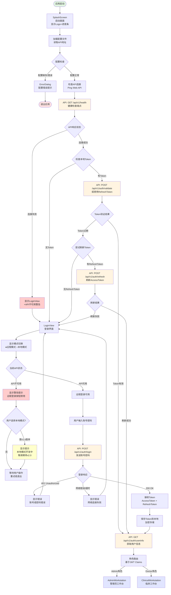
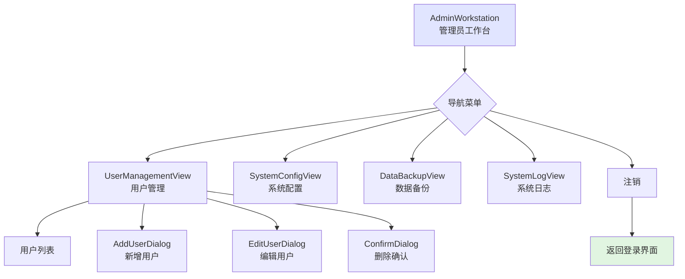
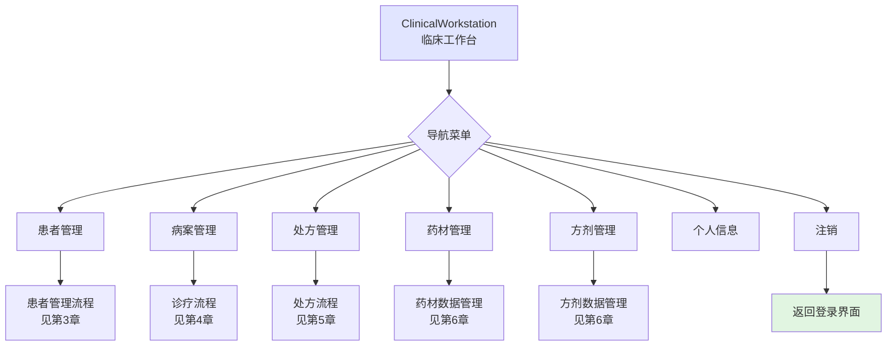
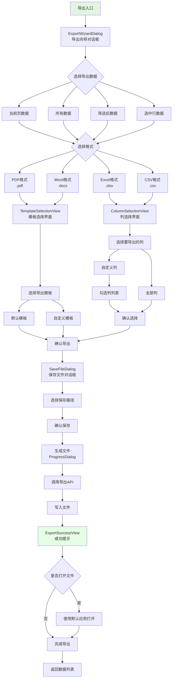

# LYBTZYZS 完整UI流程图

**文档版本**: 1.0  
**创建日期**: 2025-11-04  
**用途**: 完整呈现UI端所有界面和交互流程，作为UX优化讨论基础和后期开发清单

---

## 目录

1. [应用启动与登录流程](#1-应用启动与登录流程)
2. [角色路由与主界面](#2-角色路由与主界面)
3. [患者管理流程](#3-患者管理流程)
4. [完整诊疗流程](#4-完整诊疗流程-核心业务)
5. [处方管理流程](#5-处方管理流程)
6. [数据管理流程](#6-数据管理流程)
7. [导入导出流程](#7-导入导出流程)
8. [界面清单索引](#8-界面清单索引)

---

## 1. 应用启动与登录流程

### 1.1 应用启动主流程（WebAPI + Desktop 双模式架构）



**设计说明**:
- ✅ **v1.x 当前版本**: 仅支持远程模式，本地模式显示"开发中"提示
- 🚀 **v2.x 后期扩展**: 本地模式启用，支持无API单机运行（使用本地数据库）
- 🎯 **前瞻性设计**: LoginView 预留模式切换UI，保证架构扩展性

### 1.2 涉及界面清单

| 界面名称 | 类型 | 路径 | 说明 |
|---------|------|------|------|
| SplashScreen | Window | Shell/Views/SplashScreen.xaml | 启动画面，显示Logo和加载进度 |
| LoginView | Window | Shell/Views/LoginView.xaml | 登录界面（账号密码输入） |
| ConfigDialog | Dialog | Shell/Views/ConfigDialog.xaml | API地址配置对话框 |
| ErrorDialog | Dialog | Core_New/Views/ErrorDialog.xaml | 通用错误提示对话框 |
| AdminWorkstation | Window | Workstations/AdminWorkstation/MainWindow.xaml | 管理员主界面 |
| ClinicalWorkstation | Window | Workstations/ClinicalWorkstation/MainWindow.xaml | 医生主界面 |

### 1.3 Web API 端点（认证相关）

| API端点 | 方法 | 说明 |
|---------|------|------|
| /api/v1/health | GET | 健康检查端点，验证API可达性 |
| /api/v1/auth/login | POST | 用户登录，请求体：{username, password}，返回：{accessToken, refreshToken, expiresIn} |
| /api/v1/auth/validate | POST | 验证Token有效性（可选实现） |
| /api/v1/auth/refresh | POST | 刷新AccessToken，请求体：{refreshToken}，返回：{accessToken, expiresIn} |
| /api/v1/auth/userinfo | GET | 获取当前用户信息，需要Bearer Token，返回：{userId, username, role, displayName} |
| /api/v1/auth/logout | POST | 用户登出，撤销RefreshToken |

---

## 2. 角色路由与主界面

### 2.1 管理员工作台布局



### 2.2 临床工作台布局



### 2.3 涉及界面清单

| 界面名称 | 类型 | 路径 | 说明 |
|---------|------|------|------|
| AdminWorkstation | Window | Workstations/AdminWorkstation/MainWindow.xaml | 管理员主窗口（包含导航菜单） |
| ClinicalWorkstation | Window | Workstations/ClinicalWorkstation/MainWindow.xaml | 医生主窗口（包含导航菜单） |
| UserManagementView | UserControl | Modules/LYBT.Desktop.Users/Views/ | 用户管理视图 |
| AddUserDialog | Dialog | Modules/LYBT.Desktop.Users/Views/ | 新增用户对话框 |
| EditUserDialog | Dialog | Modules/LYBT.Desktop.Users/Views/ | 编辑用户对话框 |

---

## 3. 患者管理流程

### 3.1 患者管理主流程

```mermaid
flowchart TD
    Entry[患者管理入口] --> PatientMgmt[PatientManagementView<br/>患者管理主界面]
    
    PatientMgmt --> ActionMenu{操作菜单}
    
    ActionMenu --> Query[查询患者]
    ActionMenu --> Create[新增患者]
    ActionMenu --> Import[批量导入]
    ActionMenu --> Export[导出数据]
    
    Query --> SearchForm[搜索条件输入<br/>姓名/身份证/手机号]
    SearchForm --> SearchAPI[API: GET /api/v1/patients/search]
    SearchAPI --> ResultList[PatientListView<br/>患者列表]
    
    ResultList --> DetailAction{选择操作}
    DetailAction --> ViewDetail[查看详情]
    DetailAction --> Edit[编辑患者]
    DetailAction --> Delete[删除患者]
    DetailAction --> StartConsultation[开始看诊]
    
    ViewDetail --> PatientDetailView[PatientDetailView<br/>患者详情界面]
    
    Edit --> EditForm[PatientEditDialog<br/>编辑患者对话框]
    EditForm --> SaveEdit[保存修改]
    SaveEdit --> UpdateAPI[API: PUT /api/v1/patients/{id}]
    UpdateAPI --> RefreshList[刷新列表]
    
    Delete --> ConfirmDelete[ConfirmDialog<br/>删除确认对话框]
    ConfirmDelete -->|确认| DeleteAPI[API: DELETE /api/v1/patients/{id}]
    ConfirmDelete -->|取消| ResultList
    DeleteAPI --> RefreshList
    
    Create --> CreateForm[PatientCreateDialog<br/>新增患者对话框]
    CreateForm --> Validate{表单验证}
    Validate -->|验证失败| ValidationError[显示验证错误]
    Validate -->|验证成功| CreateAPI[API: POST /api/v1/patients]
    ValidationError --> CreateForm
    CreateAPI --> RefreshList
    
    StartConsultation --> ConsultationEntry[进入诊疗流程<br/>见第4章]
    
    Import --> ImportFlow[批量导入流程<br/>见第7章]
    Export --> ExportFlow[导出流程<br/>见第7章]
    
    RefreshList --> ResultList
    
    style Entry fill:#e1f5e1
    style ConsultationEntry fill:#ffe5e1
```

### 3.2 涉及界面清单

| 界面名称 | 类型 | 路径 | 说明 |
|---------|------|------|------|
| PatientManagementView | UserControl | Modules/LYBT.Desktop.Patients/Views/PatientManagementView.xaml | 患者管理主界面（包含搜索和列表） |
| PatientListView | UserControl | Modules/LYBT.Desktop.Patients/Views/PatientListView.xaml | 患者列表视图 |
| PatientDetailView | Dialog | Modules/LYBT.Desktop.Patients/Views/PatientDetailView.xaml | 患者详情对话框 |
| PatientCreateDialog | Dialog | Modules/LYBT.Desktop.Patients/Views/PatientCreateDialog.xaml | 新增患者对话框 |
| PatientEditDialog | Dialog | Modules/LYBT.Desktop.Patients/Views/PatientEditDialog.xaml | 编辑患者对话框 |

---

## 4. 完整诊疗流程（核心业务）

### 4.1 诊疗流程总览

**核心架构约束**:
- **患者选择独立于看诊流程**
- **看诊 = 诊断 + 处方 + 总结**

```mermaid
flowchart TD
    Entry[诊疗入口] --> PatientSelect[Step 0: 患者选择<br/>独立步骤]
    
    PatientSelect --> SelectPatient[PatientSelectionView<br/>患者选择界面]
    SelectPatient --> SearchPatient[搜索/选择患者]
    SearchPatient --> CheckActive{检测未完成医案<br/>BF-003规则}
    
    CheckActive -->|无未完成医案| CreateNewCase[创建新医案]
    CheckActive -->|有未完成医案| UnfinishedDialog[UnfinishedCaseDialog<br/>4选项对话框]
    
    UnfinishedDialog -->|1. 继续看诊| LoadOldCase[加载旧医案]
    UnfinishedDialog -->|2. 新建医案| CloseOldAndCreate[关闭旧医案<br/>创建新医案]
    UnfinishedDialog -->|3. 仅关闭| CloseOld[关闭旧医案<br/>返回患者选择]
    UnfinishedDialog -->|4. 取消| SelectPatient
    
    CloseOld --> SelectPatient
    
    CreateNewCase --> CreateAPI[API: POST /api/v1/medicalcases<br/>创建MedicalCase]
    CloseOldAndCreate --> CloseAPI[API: PUT /api/v1/medicalcases/{id}/close]
    CloseAPI --> CreateAPI
    
    CreateAPI --> ConsultationFlow[看诊流程开始]
    LoadOldCase --> ConsultationFlow
    
    ConsultationFlow --> Step1[Step 1: 辨证诊断]
    Step1 --> ConsultationView[ConsultationView<br/>诊断界面]
    
    ConsultationView --> FourExam[四诊合参输入]
    FourExam --> Inspection[望诊<br/>Inspection]
    FourExam --> Auscultation[闻诊<br/>Auscultation]
    FourExam --> Inquiry[问诊<br/>Inquiry - 必填]
    FourExam --> Palpation[切诊<br/>Palpation]
    
    Inquiry --> ChiefComplaint[主诉<br/>ChiefComplaint - 必填]
    Inquiry --> PresentIllness[现病史<br/>PresentIllness]
    Inquiry --> PastHistory[既往史<br/>PastHistory]
    
    ConsultationView --> Diagnosis[中医诊断<br/>TcmDiagnosis - 必填]
    ConsultationView --> Treatment[治疗原则<br/>TreatmentPrinciple]
    
    ConsultationView --> SaveConsultation[保存诊断]
    SaveConsultation --> ValidateConsult{验证必填项}
    ValidateConsult -->|验证失败| ShowError1[显示错误提示]
    ValidateConsult -->|验证成功| SaveConsultAPI[API: PUT /api/v1/medicalcases/{id}/consultation]
    
    ShowError1 --> ConsultationView
    
    SaveConsultAPI --> Step2[Step 2: 处方标记]
    Step2 --> PrescriptionFlagView[PrescriptionFlagView<br/>处方需求选择界面]
    
    PrescriptionFlagView --> FlagChoice{是否需要开处方?}
    FlagChoice -->|是| SetFlagTrue[设置NeedsPrescription=true]
    FlagChoice -->|否| SetFlagFalse[设置NeedsPrescription=false]
    
    SetFlagTrue --> SaveFlagAPI1[API: PUT /api/v1/medicalcases/{id}/prescription-flag]
    SetFlagFalse --> SaveFlagAPI2[API: PUT /api/v1/medicalcases/{id}/prescription-flag]
    
    SaveFlagAPI1 --> Step3Branch{Step 3: 分支}
    SaveFlagAPI2 --> Step3Branch
    
    Step3Branch -->|需要处方| PrescriptionEditor[PrescriptionEditorView<br/>处方编辑界面]
    Step3Branch -->|不需要处方| DirectComplete[直接完成]
    
    PrescriptionEditor --> InputMethod{选择录入方式}
    InputMethod --> Method1[方式1: 手动录入]
    InputMethod --> Method2[方式2: 方剂模板]
    InputMethod --> Method3[方式3: 智能推荐]
    InputMethod --> Method4[方式4: 历史复用]
    
    Method1 --> HerbSelection[HerbSelectionDialog<br/>药材选择对话框]
    Method2 --> FormulaTemplate[FormulaTemplateDialog<br/>方剂模板选择]
    Method3 --> AIRecommend[AIRecommendDialog<br/>智能推荐对话框]
    Method4 --> HistorySelect[HistoryPrescriptionDialog<br/>历史处方选择]
    
    HerbSelection --> EditPrescription[编辑处方详情]
    FormulaTemplate --> EditPrescription
    AIRecommend --> EditPrescription
    HistorySelect --> EditPrescription
    
    EditPrescription --> HerbList[药材列表<br/>DataGrid]
    EditPrescription --> Dosage[剂量计算<br/>自动计算总量]
    EditPrescription --> Usage[用法<br/>Usage说明]
    
    EditPrescription --> SavePrescription[保存处方]
    SavePrescription --> ValidatePresc{验证处方}
    ValidatePresc -->|验证失败| ShowError2[显示错误提示]
    ValidatePresc -->|验证成功| SavePrescAPI[API: POST /api/v1/medicalcases/{id}/prescriptions]
    
    ShowError2 --> EditPrescription
    
    SavePrescAPI --> CompletionFlow[完成流程]
    DirectComplete --> CompletionFlow
    
    CompletionFlow --> CompletionView[CompletionView<br/>完成总结界面]
    CompletionView --> ReviewInfo[显示病案摘要<br/>患者+诊断+处方]
    CompletionView --> AddNotes[添加备注<br/>Notes - 可选]
    
    CompletionView --> ConfirmComplete[确认完成]
    ConfirmComplete --> CompleteAPI[API: PUT /api/v1/medicalcases/{id}/complete]
    CompleteAPI --> SuccessMsg[显示成功提示]
    SuccessMsg --> ReturnPatient[返回患者选择]
    
    ReturnPatient --> SelectPatient
    
    style Entry fill:#e1f5e1
    style PatientSelect fill:#ffe5cc
    style ConsultationFlow fill:#e5f5ff
    style Step1 fill:#e5f5ff
    style Step2 fill:#e5f5ff
    style Step3Branch fill:#e5f5ff
    style CompletionFlow fill:#e5ffe5
```

### 4.2 未完成医案处理流程（BF-003规则）

```mermaid
flowchart TD
    DetectActive[检测到未完成医案<br/>Status=Active] --> ShowDialog[UnfinishedCaseDialog<br/>未完成医案对话框]
    
    ShowDialog --> Display[显示医案信息<br/>创建时间/诊断内容/状态]
    Display --> Options{用户选择}
    
    Options -->|1. 继续看诊| LoadCase[加载医案数据]
    Options -->|2. 新建医案| CloseAndCreate[关闭旧医案流程]
    Options -->|3. 仅关闭| CloseOnly[关闭旧医案流程]
    Options -->|4. 取消| Cancel[取消操作]
    
    LoadCase --> CheckStep{检查医案进度}
    CheckStep -->|无诊断| GoStep1[跳转到Step 1<br/>诊断界面]
    CheckStep -->|有诊断无处方标记| GoStep2[跳转到Step 2<br/>处方标记界面]
    CheckStep -->|已标记需要处方| GoStep3[跳转到Step 3<br/>处方编辑界面]
    
    CloseAndCreate --> CloseAPI1[API: PUT /api/v1/medicalcases/{id}/close]
    CloseAPI1 --> CreateNew[创建新医案]
    CreateNew --> GoStep1
    
    CloseOnly --> CloseAPI2[API: PUT /api/v1/medicalcases/{id}/close]
    CloseAPI2 --> ReturnSelect[返回患者选择]
    
    Cancel --> ReturnSelect
    
    GoStep1 --> ConsultationView[ConsultationView]
    GoStep2 --> PrescriptionFlagView[PrescriptionFlagView]
    GoStep3 --> PrescriptionEditorView[PrescriptionEditorView]
    
    style ShowDialog fill:#ffcccc
    style ReturnSelect fill:#e1f5e1
```

### 4.3 涉及界面清单

| 界面名称 | 类型 | 路径 | 说明 |
|---------|------|------|------|
| PatientSelectionView | UserControl | Modules/LYBT.Desktop.MedicalCase/Views/PatientSelectionView.xaml | Step 0: 患者选择界面（独立） |
| UnfinishedCaseDialog | Dialog | Modules/LYBT.Desktop.MedicalCase/Views/UnfinishedCaseDialog.xaml | 未完成医案处理对话框（BF-003） |
| ConsultationView | UserControl | Modules/LYBT.Desktop.MedicalCase/Views/ConsultationView.xaml | Step 1: 诊断界面（四诊合参） |
| PrescriptionFlagView | UserControl | Modules/LYBT.Desktop.MedicalCase/Views/PrescriptionFlagView.xaml | Step 2: 处方标记界面 |
| PrescriptionEditorView | UserControl | Modules/LYBT.Desktop.MedicalCase/Views/PrescriptionEditorView.xaml | Step 3: 处方编辑界面 |
| CompletionView | UserControl | Modules/LYBT.Desktop.MedicalCase/Views/CompletionView.xaml | 完成总结界面 |
| HerbSelectionDialog | Dialog | Modules/LYBT.Desktop.MedicalCase/Views/HerbSelectionDialog.xaml | 药材选择对话框（方式1） |
| FormulaTemplateDialog | Dialog | Modules/LYBT.Desktop.MedicalCase/Views/FormulaTemplateDialog.xaml | 方剂模板选择对话框（方式2） |
| AIRecommendDialog | Dialog | Modules/LYBT.Desktop.MedicalCase/Views/AIRecommendDialog.xaml | 智能推荐对话框（方式3） |
| HistoryPrescriptionDialog | Dialog | Modules/LYBT.Desktop.MedicalCase/Views/HistoryPrescriptionDialog.xaml | 历史处方选择对话框（方式4） |
| MedicalCaseManagementView | UserControl | Modules/LYBT.Desktop.MedicalCase/Views/MedicalCaseManagementView.xaml | 病案管理总入口 |

---

## 5. 处方管理流程

### 5.1 处方管理主流程

```mermaid
flowchart TD
    Entry[处方管理入口] --> PrescMgmt[PrescriptionManagementView<br/>处方管理主界面]
    
    PrescMgmt --> ActionMenu{操作菜单}
    
    ActionMenu --> Query[查询处方]
    ActionMenu --> Print[打印处方]
    ActionMenu --> Export[导出处方]
    
    Query --> SearchForm[搜索条件输入]
    SearchForm --> Filters{筛选条件}
    Filters --> ByPatient[按患者姓名]
    Filters --> ByDate[按日期范围]
    Filters --> ByDoctor[按医生]
    Filters --> ByStatus[按状态]
    
    SearchForm --> SearchAPI[API: GET /api/v1/prescriptions/search]
    SearchAPI --> ResultList[PrescriptionListView<br/>处方列表]
    
    ResultList --> DetailAction{选择操作}
    DetailAction --> ViewDetail[查看详情]
    DetailAction --> PrintOne[打印单个]
    DetailAction --> EditPresc[编辑处方]
    DetailAction --> DeletePresc[删除处方]
    
    ViewDetail --> DetailView[PrescriptionDetailView<br/>处方详情界面]
    DetailView --> DisplayInfo[显示处方信息]
    DisplayInfo --> PatientInfo[患者信息]
    DisplayInfo --> HerbList[药材清单]
    DisplayInfo --> DosageInfo[剂量信息]
    DisplayInfo --> UsageInfo[用法说明]
    
    PrintOne --> PrintDialog[PrintSettingsDialog<br/>打印设置对话框]
    Print --> BatchPrint[批量打印]
    BatchPrint --> SelectMultiple[选择多个处方]
    SelectMultiple --> PrintDialog
    
    PrintDialog --> PreviewPage[PrintPreviewView<br/>打印预览界面]
    PreviewPage --> ConfirmPrint{确认打印}
    ConfirmPrint -->|确认| SendToPrinter[发送到打印机]
    ConfirmPrint -->|取消| ResultList
    SendToPrinter --> PrintSuccess[显示打印成功]
    PrintSuccess --> ResultList
    
    EditPresc --> EditForm[PrescriptionEditDialog<br/>编辑处方对话框]
    EditForm --> ModifyHerbs[修改药材]
    EditForm --> ModifyDosage[修改剂量]
    EditForm --> ModifyUsage[修改用法]
    EditForm --> SaveEdit[保存修改]
    SaveEdit --> UpdateAPI[API: PUT /api/v1/prescriptions/{id}]
    UpdateAPI --> RefreshList[刷新列表]
    
    DeletePresc --> ConfirmDelete[ConfirmDialog<br/>删除确认]
    ConfirmDelete -->|确认| DeleteAPI[API: DELETE /api/v1/prescriptions/{id}]
    ConfirmDelete -->|取消| ResultList
    DeleteAPI --> RefreshList
    
    Export --> ExportDialog[ExportSettingsDialog<br/>导出设置对话框]
    ExportDialog --> SelectFormat{选择格式}
    SelectFormat --> ExportPDF[导出为PDF]
    SelectFormat --> ExportExcel[导出为Excel]
    SelectFormat --> ExportWord[导出为Word]
    
    ExportPDF --> ExportAPI1[生成PDF文件]
    ExportExcel --> ExportAPI2[生成Excel文件]
    ExportWord --> ExportAPI3[生成Word文件]
    
    ExportAPI1 --> SaveFile[保存文件对话框]
    ExportAPI2 --> SaveFile
    ExportAPI3 --> SaveFile
    
    SaveFile --> ExportSuccess[显示导出成功]
    ExportSuccess --> ResultList
    
    RefreshList --> ResultList
    
    style Entry fill:#e1f5e1
```

### 5.2 涉及界面清单

| 界面名称 | 类型 | 路径 | 说明 |
|---------|------|------|------|
| PrescriptionManagementView | UserControl | Modules/LYBT.Desktop.Prescriptions/Views/PrescriptionManagementView.xaml | 处方管理主界面 |
| PrescriptionListView | UserControl | Modules/LYBT.Desktop.Prescriptions/Views/PrescriptionListView.xaml | 处方列表视图 |
| PrescriptionDetailView | Dialog | Modules/LYBT.Desktop.Prescriptions/Views/PrescriptionDetailView.xaml | 处方详情对话框 |
| PrescriptionEditDialog | Dialog | Modules/LYBT.Desktop.Prescriptions/Views/PrescriptionEditDialog.xaml | 编辑处方对话框 |
| PrintSettingsDialog | Dialog | Modules/LYBT.Desktop.Prescriptions/Views/PrintSettingsDialog.xaml | 打印设置对话框 |
| PrintPreviewView | Window | Modules/LYBT.Desktop.Prescriptions/Views/PrintPreviewView.xaml | 打印预览窗口 |
| ExportSettingsDialog | Dialog | Modules/LYBT.Desktop.Prescriptions/Views/ExportSettingsDialog.xaml | 导出设置对话框 |

---

## 6. 数据管理流程

### 6.1 药材管理流程

```mermaid
flowchart TD
    Entry[药材管理入口] --> HerbMgmt[HerbManagementView<br/>药材管理主界面]
    
    HerbMgmt --> ActionMenu{操作菜单}
    
    ActionMenu --> Query[查询药材]
    ActionMenu --> Create[新增药材]
    ActionMenu --> Import[批量导入]
    ActionMenu --> Export[导出数据]
    
    Query --> SearchForm[搜索条件输入]
    SearchForm --> Filters{筛选条件}
    Filters --> ByName[按名称]
    Filters --> ByCategory[按分类]
    Filters --> ByProperty[按性味]
    
    SearchForm --> SearchAPI[API: GET /api/v1/herbs/search]
    SearchAPI --> ResultList[HerbListView<br/>药材列表]
    
    ResultList --> DetailAction{选择操作}
    DetailAction --> ViewDetail[查看详情]
    DetailAction --> Edit[编辑药材]
    DetailAction --> Delete[删除药材]
    
    ViewDetail --> DetailView[HerbDetailView<br/>药材详情界面]
    
    Edit --> EditForm[HerbEditDialog<br/>编辑药材对话框]
    EditForm --> SaveEdit[保存修改]
    SaveEdit --> UpdateAPI[API: PUT /api/v1/herbs/{id}]
    UpdateAPI --> RefreshList[刷新列表]
    
    Delete --> ConfirmDelete[ConfirmDialog<br/>删除确认]
    ConfirmDelete -->|确认| DeleteAPI[API: DELETE /api/v1/herbs/{id}]
    ConfirmDelete -->|取消| ResultList
    DeleteAPI --> RefreshList
    
    Create --> CreateForm[HerbCreateDialog<br/>新增药材对话框]
    CreateForm --> InputData[录入药材信息]
    InputData --> BasicInfo[基本信息<br/>名称/拼音/分类]
    InputData --> Properties[性味归经<br/>性质/味道/归经]
    InputData --> Effects[功效主治<br/>功效/主治/用法]
    
    CreateForm --> ValidateCreate{验证数据}
    ValidateCreate -->|验证失败| ShowError[显示错误提示]
    ValidateCreate -->|验证成功| CreateAPI[API: POST /api/v1/herbs]
    ShowError --> CreateForm
    CreateAPI --> RefreshList
    
    Import --> ImportFlow[批量导入流程<br/>见第7章]
    Export --> ExportFlow[导出流程<br/>见第7章]
    
    RefreshList --> ResultList
    
    style Entry fill:#e1f5e1
```

### 6.2 方剂管理流程

```mermaid
flowchart TD
    Entry[方剂管理入口] --> FormulaMgmt[FormulaManagementView<br/>方剂管理主界面]
    
    FormulaMgmt --> ActionMenu{操作菜单}
    
    ActionMenu --> Query[查询方剂]
    ActionMenu --> Create[新增方剂]
    ActionMenu --> Import[批量导入]
    ActionMenu --> Export[导出数据]
    
    Query --> SearchForm[搜索条件输入]
    SearchForm --> Filters{筛选条件}
    Filters --> ByName[按名称]
    Filters --> ByCategory[按分类]
    Filters --> BySource[按来源]
    
    SearchForm --> SearchAPI[API: GET /api/v1/formulas/search]
    SearchAPI --> ResultList[FormulaListView<br/>方剂列表]
    
    ResultList --> DetailAction{选择操作}
    DetailAction --> ViewDetail[查看详情]
    DetailAction --> Edit[编辑方剂]
    DetailAction --> Delete[删除方剂]
    
    ViewDetail --> DetailView[FormulaDetailView<br/>方剂详情界面]
    DetailView --> ShowInfo[显示方剂信息]
    ShowInfo --> BasicInfo[基本信息<br/>名称/分类/来源]
    ShowInfo --> Composition[组成<br/>药材列表+剂量]
    ShowInfo --> Effects[功效主治]
    ShowInfo --> Usage[用法用量]
    
    Edit --> EditForm[FormulaEditDialog<br/>编辑方剂对话框]
    EditForm --> ModifyBasic[修改基本信息]
    EditForm --> ModifyComposition[修改组成]
    ModifyComposition --> AddHerb[添加药材]
    ModifyComposition --> RemoveHerb[删除药材]
    ModifyComposition --> ModifyDosage[修改剂量]
    
    EditForm --> SaveEdit[保存修改]
    SaveEdit --> ValidateEdit{验证数据}
    ValidateEdit -->|验证失败| ShowError1[显示错误提示]
    ValidateEdit -->|验证成功| UpdateAPI[API: PUT /api/v1/formulas/{id}]
    ShowError1 --> EditForm
    UpdateAPI --> RefreshList[刷新列表]
    
    Delete --> ConfirmDelete[ConfirmDialog<br/>删除确认]
    ConfirmDelete -->|确认| DeleteAPI[API: DELETE /api/v1/formulas/{id}]
    ConfirmDelete -->|取消| ResultList
    DeleteAPI --> RefreshList
    
    Create --> CreateForm[FormulaCreateDialog<br/>新增方剂对话框]
    CreateForm --> InputBasic[录入基本信息]
    CreateForm --> SelectHerbs[选择药材]
    SelectHerbs --> HerbSelectDialog[HerbSelectionDialog<br/>药材选择对话框]
    HerbSelectDialog --> AddToList[添加到方剂组成]
    AddToList --> SetDosage[设置剂量]
    
    CreateForm --> ValidateCreate{验证数据}
    ValidateCreate -->|验证失败| ShowError2[显示错误提示]
    ValidateCreate -->|验证成功| CreateAPI[API: POST /api/v1/formulas]
    ShowError2 --> CreateForm
    CreateAPI --> RefreshList
    
    Import --> ImportFlow[批量导入流程<br/>见第7章]
    Export --> ExportFlow[导出流程<br/>见第7章]
    
    RefreshList --> ResultList
    
    style Entry fill:#e1f5e1
```

### 6.3 涉及界面清单

| 界面名称 | 类型 | 路径 | 说明 |
|---------|------|------|------|
| HerbManagementView | UserControl | Modules/LYBT.Desktop.Herbs/Views/HerbManagementView.xaml | 药材管理主界面 |
| HerbListView | UserControl | Modules/LYBT.Desktop.Herbs/Views/HerbListView.xaml | 药材列表视图 |
| HerbDetailView | Dialog | Modules/LYBT.Desktop.Herbs/Views/HerbDetailView.xaml | 药材详情对话框 |
| HerbCreateDialog | Dialog | Modules/LYBT.Desktop.Herbs/Views/HerbCreateDialog.xaml | 新增药材对话框 |
| HerbEditDialog | Dialog | Modules/LYBT.Desktop.Herbs/Views/HerbEditDialog.xaml | 编辑药材对话框 |
| FormulaManagementView | UserControl | Modules/LYBT.Desktop.Formula/Views/FormulaManagementView.xaml | 方剂管理主界面 |
| FormulaListView | UserControl | Modules/LYBT.Desktop.Formula/Views/FormulaListView.xaml | 方剂列表视图 |
| FormulaDetailView | Dialog | Modules/LYBT.Desktop.Formula/Views/FormulaDetailView.xaml | 方剂详情对话框 |
| FormulaCreateDialog | Dialog | Modules/LYBT.Desktop.Formula/Views/FormulaCreateDialog.xaml | 新增方剂对话框 |
| FormulaEditDialog | Dialog | Modules/LYBT.Desktop.Formula/Views/FormulaEditDialog.xaml | 编辑方剂对话框 |

---

## 7. 导入导出流程

### 7.1 Excel批量导入流程（通用）

```mermaid
flowchart TD
    Entry[导入入口] --> ImportDialog[ImportWizardDialog<br/>导入向导对话框]
    
    ImportDialog --> SelectFile[选择Excel文件]
    SelectFile --> FileDialog[OpenFileDialog<br/>文件选择对话框]
    FileDialog --> ValidateFile{验证文件}
    
    ValidateFile -->|格式错误| FileError[显示错误提示<br/>仅支持.xlsx格式]
    ValidateFile -->|文件有效| PreviewData[DataPreviewView<br/>数据预览界面]
    
    FileError --> SelectFile
    
    PreviewData --> ShowPreview[显示Excel数据<br/>前10行预览]
    PreviewData --> ColumnMapping[ColumnMappingView<br/>列映射设置]
    
    ColumnMapping --> MapFields[映射Excel列<br/>到数据字段]
    MapFields --> RequiredFields[标注必填字段]
    MapFields --> OptionalFields[标注可选字段]
    
    ColumnMapping --> ValidateMapping{验证映射}
    ValidateMapping -->|缺少必填字段| MappingError[显示映射错误]
    ValidateMapping -->|映射有效| ConfirmImport[确认导入]
    
    MappingError --> ColumnMapping
    
    ConfirmImport --> ProcessData[数据处理<br/>ProgressDialog]
    ProcessData --> ParseRows[逐行解析数据]
    ParseRows --> ValidateRow{验证每行数据}
    
    ValidateRow -->|数据有效| AddToValid[添加到有效列表]
    ValidateRow -->|数据无效| AddToInvalid[添加到错误列表<br/>记录错误原因]
    
    AddToValid --> CheckMoreRows{是否还有行}
    AddToInvalid --> CheckMoreRows
    
    CheckMoreRows -->|是| ParseRows
    CheckMoreRows -->|否| ShowResults[ImportResultView<br/>导入结果界面]
    
    ShowResults --> DisplayStats[显示统计信息]
    DisplayStats --> TotalRows[总行数]
    DisplayStats --> ValidRows[有效行数]
    DisplayStats --> InvalidRows[无效行数]
    DisplayStats --> SuccessRows[导入成功数]
    DisplayStats --> FailedRows[导入失败数]
    
    ShowResults --> ErrorList{是否有错误}
    ErrorList -->|有错误| ShowErrorList[ErrorListView<br/>错误详情列表]
    ErrorList -->|无错误| ImportAPI[API: POST /api/v1/{entity}/batch-import]
    
    ShowErrorList --> ErrorActions{用户选择}
    ErrorActions -->|导出错误| ExportErrors[导出错误Excel]
    ErrorActions -->|仅导入有效行| ImportValid[导入有效数据]
    ErrorActions -->|取消导入| CancelImport[取消操作]
    
    ImportValid --> ImportAPI
    ExportErrors --> SaveErrorFile[保存错误文件]
    SaveErrorFile --> ShowErrorList
    
    ImportAPI --> ImportProgress[显示导入进度]
    ImportProgress --> ImportSuccess[ImportSuccessView<br/>成功提示界面]
    ImportSuccess --> RefreshList[刷新数据列表]
    
    CancelImport --> RefreshList
    
    style Entry fill:#e1f5e1
    style ImportSuccess fill:#e5ffe5
```

### 7.2 数据导出流程（通用）



### 7.3 涉及界面清单

| 界面名称 | 类型 | 路径 | 说明 |
|---------|------|------|------|
| ImportWizardDialog | Dialog | Core_New/Views/Import/ImportWizardDialog.xaml | 导入向导对话框（通用） |
| DataPreviewView | UserControl | Core_New/Views/Import/DataPreviewView.xaml | 数据预览视图 |
| ColumnMappingView | UserControl | Core_New/Views/Import/ColumnMappingView.xaml | 列映射设置视图 |
| ImportResultView | Dialog | Core_New/Views/Import/ImportResultView.xaml | 导入结果对话框 |
| ErrorListView | UserControl | Core_New/Views/Import/ErrorListView.xaml | 错误详情列表视图 |
| ImportSuccessView | Dialog | Core_New/Views/Import/ImportSuccessView.xaml | 导入成功提示对话框 |
| ExportWizardDialog | Dialog | Core_New/Views/Export/ExportWizardDialog.xaml | 导出向导对话框（通用） |
| ColumnSelectionView | UserControl | Core_New/Views/Export/ColumnSelectionView.xaml | 列选择视图 |
| TemplateSelectionView | UserControl | Core_New/Views/Export/TemplateSelectionView.xaml | 模板选择视图 |
| ExportSuccessView | Dialog | Core_New/Views/Export/ExportSuccessView.xaml | 导出成功提示对话框 |
| ProgressDialog | Dialog | Core_New/Views/ProgressDialog.xaml | 进度对话框（通用） |

---

## 8. 界面清单索引

### 8.1 按模块分类

#### Shell模块
1. SplashScreen - 启动画面
2. LoginView - 登录界面

#### Workstations模块
3. AdminWorkstation - 管理员工作台
4. ClinicalWorkstation - 临床工作台

#### Patients模块（患者管理）
5. PatientManagementView - 患者管理主界面
6. PatientListView - 患者列表
7. PatientDetailView - 患者详情
8. PatientCreateDialog - 新增患者
9. PatientEditDialog - 编辑患者

#### MedicalCase模块（病案管理）
10. MedicalCaseManagementView - 病案管理总入口
11. PatientSelectionView - 患者选择界面（Step 0）
12. UnfinishedCaseDialog - 未完成医案对话框
13. ConsultationView - 诊断界面（Step 1）
14. PrescriptionFlagView - 处方标记界面（Step 2）
15. PrescriptionEditorView - 处方编辑界面（Step 3）
16. CompletionView - 完成总结界面
17. HerbSelectionDialog - 药材选择对话框
18. FormulaTemplateDialog - 方剂模板选择对话框
19. AIRecommendDialog - 智能推荐对话框
20. HistoryPrescriptionDialog - 历史处方选择对话框

#### Prescriptions模块（处方管理）
21. PrescriptionManagementView - 处方管理主界面
22. PrescriptionListView - 处方列表
23. PrescriptionDetailView - 处方详情
24. PrescriptionEditDialog - 编辑处方
25. PrintSettingsDialog - 打印设置
26. PrintPreviewView - 打印预览
27. ExportSettingsDialog - 导出设置

#### Herbs模块（药材管理）
28. HerbManagementView - 药材管理主界面
29. HerbListView - 药材列表
30. HerbDetailView - 药材详情
31. HerbCreateDialog - 新增药材
32. HerbEditDialog - 编辑药材

#### Formula模块（方剂管理）
33. FormulaManagementView - 方剂管理主界面
34. FormulaListView - 方剂列表
35. FormulaDetailView - 方剂详情
36. FormulaCreateDialog - 新增方剂
37. FormulaEditDialog - 编辑方剂

#### Users模块（用户管理）
38. UserManagementView - 用户管理视图
39. AddUserDialog - 新增用户
40. EditUserDialog - 编辑用户

#### Core_New模块（通用组件）
41. ErrorDialog - 通用错误对话框
42. ConfirmDialog - 确认对话框
43. ProgressDialog - 进度对话框
44. ImportWizardDialog - 导入向导
45. DataPreviewView - 数据预览
46. ColumnMappingView - 列映射设置
47. ImportResultView - 导入结果
48. ErrorListView - 错误详情列表
49. ImportSuccessView - 导入成功提示
50. ExportWizardDialog - 导出向导
51. ColumnSelectionView - 列选择
52. TemplateSelectionView - 模板选择
53. ExportSuccessView - 导出成功提示

### 8.2 按类型分类

#### 主窗口（Window）- 3个
- SplashScreen
- AdminWorkstation
- ClinicalWorkstation

#### 登录窗口（Window）- 1个
- LoginView

#### 打印预览窗口（Window）- 1个
- PrintPreviewView

#### 用户控件（UserControl）- 27个
- PatientManagementView, PatientListView
- MedicalCaseManagementView, PatientSelectionView, ConsultationView, PrescriptionFlagView, PrescriptionEditorView, CompletionView
- PrescriptionManagementView, PrescriptionListView
- HerbManagementView, HerbListView
- FormulaManagementView, FormulaListView
- UserManagementView
- DataPreviewView, ColumnMappingView, ErrorListView
- ColumnSelectionView, TemplateSelectionView

#### 对话框（Dialog）- 22个
- ErrorDialog, ConfirmDialog, ProgressDialog
- PatientDetailView, PatientCreateDialog, PatientEditDialog
- UnfinishedCaseDialog, HerbSelectionDialog, FormulaTemplateDialog, AIRecommendDialog, HistoryPrescriptionDialog
- PrescriptionDetailView, PrescriptionEditDialog, PrintSettingsDialog, ExportSettingsDialog
- HerbDetailView, HerbCreateDialog, HerbEditDialog
- FormulaDetailView, FormulaCreateDialog, FormulaEditDialog
- AddUserDialog, EditUserDialog
- ImportWizardDialog, ImportResultView, ImportSuccessView
- ExportWizardDialog, ExportSuccessView

### 8.3 按业务流程分类

#### 启动与登录流程（2个界面）
- SplashScreen → LoginView

#### 主工作台（2个界面）
- AdminWorkstation
- ClinicalWorkstation

#### 患者管理流程（5个界面）
- PatientManagementView
- PatientListView
- PatientDetailView
- PatientCreateDialog
- PatientEditDialog

#### 诊疗流程（11个界面）⭐核心业务
- MedicalCaseManagementView（总入口）
- PatientSelectionView（Step 0 - 独立）
- UnfinishedCaseDialog（BF-003规则）
- ConsultationView（Step 1 - 诊断）
- PrescriptionFlagView（Step 2 - 处方标记）
- PrescriptionEditorView（Step 3 - 处方编辑）
- CompletionView（完成总结）
- HerbSelectionDialog（药材选择）
- FormulaTemplateDialog（方剂模板）
- AIRecommendDialog（智能推荐）
- HistoryPrescriptionDialog（历史处方）

#### 处方管理流程（7个界面）
- PrescriptionManagementView
- PrescriptionListView
- PrescriptionDetailView
- PrescriptionEditDialog
- PrintSettingsDialog
- PrintPreviewView
- ExportSettingsDialog

#### 数据管理流程（10个界面）
- HerbManagementView（药材）
- HerbListView, HerbDetailView, HerbCreateDialog, HerbEditDialog
- FormulaManagementView（方剂）
- FormulaListView, FormulaDetailView, FormulaCreateDialog, FormulaEditDialog

#### 导入导出流程（10个界面）
- ImportWizardDialog
- DataPreviewView
- ColumnMappingView
- ImportResultView
- ErrorListView
- ImportSuccessView
- ExportWizardDialog
- ColumnSelectionView
- TemplateSelectionView
- ExportSuccessView

#### 通用组件（3个界面）
- ErrorDialog
- ConfirmDialog
- ProgressDialog

---

## 9. 核心架构约束总结

### 9.1 业务规则约束

1. **BF-002: 三步看诊流程**
   - **患者选择独立于看诊流程**
   - **看诊 = 诊断 + 处方 + 总结**
   - Step 1: 辨证诊断（ConsultationView）- 必填主诉和中医诊断
   - Step 2: 处方标记（PrescriptionFlagView）- 用户选择是否需要处方
   - Step 3: 处方编辑/完成（PrescriptionEditorView或CompletionView）- 根据标记分支

2. **BF-003: 未完成医案检测**
   - 患者选择后自动检测Status=Active的医案
   - 弹出UnfinishedCaseDialog提供4个选项：
     1. 继续看诊 - 加载旧医案
     2. 新建医案 - 关闭旧医案创建新医案
     3. 仅关闭 - 关闭旧医案返回患者选择
     4. 取消 - 取消操作返回患者选择

3. **AR-001: MedicalCase聚合根约束**
   - MedicalCase是聚合根
   - Consultation和Prescription是聚合内实体
   - 写操作必须通过聚合根
   - 读操作可绕过聚合根

### 9.2 技术架构约束

1. **Prism 8.x + WPF MVVM**
   - 视图与ViewModel严格分离
   - 依赖注入（DI）管理组件生命周期
   - 区域导航（Region Navigation）管理视图切换
   - 事件聚合器（EventAggregator）管理跨组件通信

2. **组件化设计原则（ADR-009）**
   - Manager组件：业务流程编排
   - Handler组件：生命周期管理
   - Loader组件：数据加载
   - Validator组件：数据验证
   - Calculator组件：业务计算

3. **MVP原则**
   - 够用即好，拒绝过度设计
   - 简单CRUD模块使用UnifiedListViewModelBase
   - 只有复杂流程模块需要组件化

---

## 10. 后续优化讨论方向

基于此流程图，可以讨论以下UX优化方向：

### 10.1 导航与交互优化
- 是否需要面包屑导航？
- 是否需要快捷键支持？
- 是否需要操作撤销/重做？

### 10.2 数据加载优化
- 是否需要分页加载？
- 是否需要虚拟化滚动？
- 是否需要缓存机制？

### 10.3 错误处理优化
- 统一错误提示样式？
- 是否需要错误日志记录？
- 是否需要自动重试机制？

### 10.4 诊疗流程优化
- 未完成医案对话框的4个选项是否合理？
- 处方录入的4种方式是否需要调整？
- 诊断界面的必填项是否合理？

### 10.5 批量操作优化
- 是否需要批量删除？
- 是否需要批量打印？
- 是否需要批量导出？

---

**文档说明**:
- 本文档详细到每个界面，共计**53个界面**
- 流程图使用Mermaid格式，支持GitHub原生渲染
- 可作为后期开发清单和需求追踪基础
- 严格遵循业务规则约束（BF-002, BF-003, AR-001）

**下一步**: 基于此流程图讨论UX优化方案
