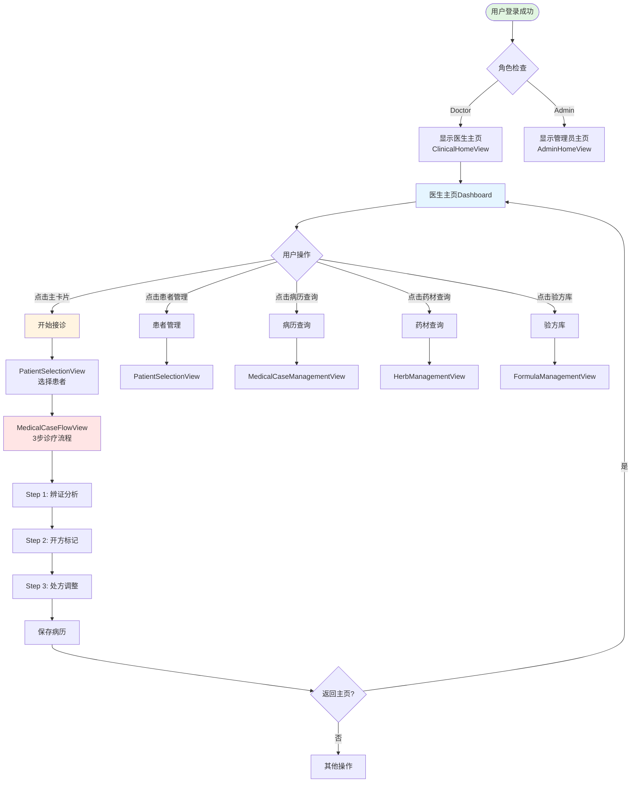

# 医生主页（Dashboard）优化设计

**文档版本**: 1.0
**创建日期**: 2025-11-04
**基于**: 用户需求 + 现有代码分析
**用途**: 医生工作台主页UI/UX优化设计

---

## 设计背景

### 当前问题
**现有医生主页（ClinicalHomeView）**：
```
┌─────────────────────────────────┐
│  凌隐宝堂中医诊所                │
│  临床工作站                      │
│                                 │
│  [开始接诊] (150x50 普通按钮)   │
│                                 │
│  📊 统计功能占位                 │
│  (统计功能开发中...)            │
└─────────────────────────────────┘
```

**问题**：
1. ❌ "开始接诊"按钮不够突出（最重要功能）
2. ❌ 缺少其他功能快捷入口
3. ❌ 视觉单调，不符合主页Dashboard定位
4. ❌ 没有卡片式布局

### 设计目标
1. ✅ **突出主要功能**："开始接诊"占据视觉焦点
2. ✅ **快速导航**：常用功能卡片式布局
3. ✅ **信息可见**：统计数据一目了然
4. ✅ **视觉美观**：卡片式设计，符合现代UI规范

---

## 优化设计方案

### 整体布局

```
┌──────────────────────────────────────────────────────────────┐
│            凌隐宝堂中医诊所 - 临床工作站                       │
├──────────────────────────────────────────────────────────────┤
│  上半部分（主功能区）                                         │
│  ┌────────────────────────────────────┐  ┌─────────────────┐ │
│  │  🩺  开始接诊 (主卡片)              │  │ 📊 今日统计      │ │
│  │                                    │  │                 │ │
│  │  选择患者开始诊疗流程              │  │ 接诊：--        │ │
│  │                                    │  │ 待办：--        │ │
│  │  [开始接诊] (180x60 大按钮)        │  │ (功能开发中)     │ │
│  └────────────────────────────────────┘  └─────────────────┘ │
│                                                              │
│  下半部分（辅助功能区）                                       │
│  ┌──────────────┐  ┌──────────────┐  ┌──────────────┐  ┌──────────────┐ │
│  │ 👤           │  │ 📁           │  │ 🌿           │  │ 📋           │ │
│  │              │  │              │  │              │  │              │ │
│  │ 患者管理      │  │ 病历查询      │  │ 药材查询      │  │ 验方库        │ │
│  └──────────────┘  └──────────────┘  └──────────────┘  └──────────────┘ │
│                                                              │
│  提示：点击【开始接诊】选择患者后进入3步诊疗流程              │
└──────────────────────────────────────────────────────────────┘
```

### 布局说明

**上半部分（主功能区）**：
- **左侧主卡片**（2/3宽度）：开始接诊
- **右侧统计卡片**（1/3宽度）：今日统计

**下半部分（辅助功能区）**：
- **4个辅助卡片**：等宽等高，1行4列

---

## UI规格

### 1. 主卡片（开始接诊）

**尺寸**：
- 宽度：500px
- 高度：220px
- 圆角：8px

**样式**：
- 背景：淡蓝色渐变（#E8F4F8 → #FFFFFF）
- 边框：1px 蓝色（#2E86AB）
- 内边距：30px

**内容**：
- **图标**：🩺 64px
- **标题**："开始接诊" - 24px Bold, #2E86AB
- **副标题**："选择患者开始诊疗流程" - 14px, #666
- **按钮**：180x60px, 蓝色渐变, 白色文字 18px

**交互**：
- 整个卡片可点击
- Hover：边框加粗到2px
- 点击：导航到 PatientSelectionView

### 2. 统计卡片（今日统计）

**尺寸**：
- 宽度：240px
- 高度：220px
- 圆角：8px

**样式**：
- 背景：白色
- 边框：1px 灰色（#E0E0E0）
- 内边距：20px

**内容**：
- **标题**：📊 今日统计 - 18px SemiBold, #2E86AB
- **统计项1**："接诊：-- 人" - 14px, #666
- **统计项2**："待办：-- 个" - 14px, #666
- **占位提示**："(统计功能开发中)" - 12px, #999

**状态**：
- MVP阶段：显示占位符 "--"
- 后续实现：显示真实数据

### 3. 辅助功能卡片（4个）

**尺寸**（每个）：
- 宽度：160px
- 高度：160px
- 圆角：8px
- 间距：15px

**样式**：
- 背景：白色
- 边框：1px 灰色（#E0E0E0）
- 内边距：20px
- 鼠标指针：Hand

**内容**：
- **图标**：48px, 居中
- **标题**：16px SemiBold, #2E86AB, 居中

**4个卡片**：

| 卡片 | 图标 | 标题 | 导航目标 |
|-----|-----|-----|---------|
| 1 | 👤 | 患者管理 | PatientSelectionView |
| 2 | 📁 | 病历查询 | MedicalCaseManagementView |
| 3 | 🌿 | 药材查询 | HerbManagementView |
| 4 | 📋 | 验方库 | FormulaManagementView |

**交互**：
- Hover：背景变淡蓝色（#F0F8FF），边框变蓝色（#2E86AB）
- 点击：导航到对应视图

---

## 导航流程图



---

## 技术实现要点

### 1. XAML布局结构

```xaml
<Grid Background="{StaticResource BackgroundBrush}">
    <ScrollViewer VerticalScrollBarVisibility="Auto">
        <StackPanel MaxWidth="900" Margin="40">

            <!-- 标题区域 -->
            <TextBlock Text="凌隐宝堂中医诊所 - 临床工作站" ... />

            <!-- 上半部分：主功能区 -->
            <Grid Margin="0,40,0,30">
                <Grid.ColumnDefinitions>
                    <ColumnDefinition Width="500" />
                    <ColumnDefinition Width="20" /> <!-- 间距 -->
                    <ColumnDefinition Width="240" />
                </Grid.ColumnDefinitions>

                <!-- 主卡片：开始接诊 -->
                <Border Grid.Column="0" Style="{StaticResource MainCardStyle}">
                    <StackPanel>
                        <TextBlock Text="🩺" FontSize="64" ... />
                        <TextBlock Text="开始接诊" FontSize="24" ... />
                        <TextBlock Text="选择患者开始诊疗流程" ... />
                        <Button Command="{Binding StartConsultationCommand}"
                                Content="开始接诊"
                                Width="180" Height="60" ... />
                    </StackPanel>
                </Border>

                <!-- 统计卡片 -->
                <Border Grid.Column="2" Style="{StaticResource StatsCardStyle}">
                    <StackPanel>
                        <TextBlock Text="📊 今日统计" ... />
                        <TextBlock Text="{Binding TodayConsultationCountDisplay}" ... />
                        <TextBlock Text="{Binding PendingCaseCountDisplay}" ... />
                        <TextBlock Text="(统计功能开发中)" ... />
                    </StackPanel>
                </Border>
            </Grid>

            <!-- 下半部分：辅助功能卡片 -->
            <Grid>
                <Grid.ColumnDefinitions>
                    <ColumnDefinition Width="*" />
                    <ColumnDefinition Width="*" />
                    <ColumnDefinition Width="*" />
                    <ColumnDefinition Width="*" />
                </Grid.ColumnDefinitions>

                <!-- 4个辅助卡片 -->
                <Border Grid.Column="0" Style="{StaticResource FunctionCardStyle}">
                    <Border.InputBindings>
                        <MouseBinding Gesture="LeftClick"
                                     Command="{Binding NavigateToPatientManagementCommand}" />
                    </Border.InputBindings>
                    <StackPanel>
                        <TextBlock Text="👤" FontSize="48" ... />
                        <TextBlock Text="患者管理" ... />
                    </StackPanel>
                </Border>

                <!-- 其他3个卡片类似... -->
            </Grid>

            <!-- 底部提示 -->
            <TextBlock Text="提示：点击【开始接诊】选择患者后进入3步诊疗流程" ... />
        </StackPanel>
    </ScrollViewer>
</Grid>
```

### 2. ViewModel属性和命令

```csharp
// ClinicalHomeViewModel.cs
public class ClinicalHomeViewModel : UnifiedViewModelBase
{
    #region 属性

    /// <summary>
    /// 今日接诊数量显示文本（占位）
    /// </summary>
    public string TodayConsultationCountDisplay =>
        TodayConsultationCount > 0
            ? $"接诊：{TodayConsultationCount} 人"
            : "接诊：-- 人";

    /// <summary>
    /// 待办事项数量显示文本（占位）
    /// </summary>
    public string PendingCaseCountDisplay =>
        PendingCaseCount > 0
            ? $"待办：{PendingCaseCount} 个"
            : "待办：-- 个";

    #endregion

    #region 命令

    /// <summary>
    /// 开始接诊命令（已有）
    /// </summary>
    public DelegateCommand StartConsultationCommand { get; }

    /// <summary>
    /// 导航到患者管理
    /// </summary>
    public DelegateCommand NavigateToPatientManagementCommand { get; }

    /// <summary>
    /// 导航到病历查询
    /// </summary>
    public DelegateCommand NavigateToMedicalCaseQueryCommand { get; }

    /// <summary>
    /// 导航到药材查询
    /// </summary>
    public DelegateCommand NavigateToHerbQueryCommand { get; }

    /// <summary>
    /// 导航到验方库
    /// </summary>
    public DelegateCommand NavigateToFormulaLibraryCommand { get; }

    #endregion

    #region 构造函数

    public ClinicalHomeViewModel(...)
    {
        // 初始化命令
        StartConsultationCommand = new DelegateCommand(ExecuteStartConsultation);
        NavigateToPatientManagementCommand = new DelegateCommand(() => NavigateTo("PatientSelectionView"));
        NavigateToMedicalCaseQueryCommand = new DelegateCommand(() => NavigateTo("MedicalCaseManagementView"));
        NavigateToHerbQueryCommand = new DelegateCommand(() => NavigateTo("HerbManagementView"));
        NavigateToFormulaLibraryCommand = new DelegateCommand(() => NavigateTo("FormulaManagementView"));
    }

    #endregion

    #region 辅助方法

    private void NavigateTo(string viewName)
    {
        Logger.LogInformation("导航到 {ViewName}", viewName);
        _regionManager.RequestNavigate("ContentRegion", viewName);
    }

    #endregion
}
```

### 3. 样式资源定义

```xaml
<!-- 主卡片样式 -->
<Style x:Key="MainCardStyle" TargetType="Border">
    <Setter Property="Background">
        <Setter.Value>
            <LinearGradientBrush StartPoint="0,0" EndPoint="0,1">
                <GradientStop Color="#E8F4F8" Offset="0"/>
                <GradientStop Color="#FFFFFF" Offset="1"/>
            </LinearGradientBrush>
        </Setter.Value>
    </Setter>
    <Setter Property="BorderBrush" Value="#2E86AB"/>
    <Setter Property="BorderThickness" Value="1"/>
    <Setter Property="CornerRadius" Value="8"/>
    <Setter Property="Padding" Value="30"/>
    <Setter Property="Cursor" Value="Hand"/>
    <Style.Triggers>
        <Trigger Property="IsMouseOver" Value="True">
            <Setter Property="BorderThickness" Value="2"/>
        </Trigger>
    </Style.Triggers>
</Style>

<!-- 统计卡片样式 -->
<Style x:Key="StatsCardStyle" TargetType="Border">
    <Setter Property="Background" Value="White"/>
    <Setter Property="BorderBrush" Value="#E0E0E0"/>
    <Setter Property="BorderThickness" Value="1"/>
    <Setter Property="CornerRadius" Value="8"/>
    <Setter Property="Padding" Value="20"/>
</Style>

<!-- 功能卡片样式（与AdminHomeView一致） -->
<Style x:Key="FunctionCardStyle" TargetType="Border">
    <Setter Property="Background" Value="White"/>
    <Setter Property="BorderBrush" Value="#E0E0E0"/>
    <Setter Property="BorderThickness" Value="1"/>
    <Setter Property="CornerRadius" Value="8"/>
    <Setter Property="Margin" Value="7.5"/>
    <Setter Property="Padding" Value="20"/>
    <Setter Property="Cursor" Value="Hand"/>
    <Style.Triggers>
        <Trigger Property="IsMouseOver" Value="True">
            <Setter Property="Background" Value="#F0F8FF"/>
            <Setter Property="BorderBrush" Value="#2E86AB"/>
        </Trigger>
    </Style.Triggers>
</Style>

<!-- 主按钮样式（开始接诊） -->
<Style x:Key="PrimaryLargeButton" TargetType="Button"
       BasedOn="{StaticResource PrimaryButton}">
    <Setter Property="Width" Value="180"/>
    <Setter Property="Height" Value="60"/>
    <Setter Property="FontSize" Value="18"/>
    <Setter Property="FontWeight" Value="Bold"/>
</Style>
```

---

## 待实现清单

### Phase 1: UI改造（核心）
- [ ] 创建主卡片样式（MainCardStyle）
- [ ] 创建统计卡片样式（StatsCardStyle）
- [ ] 重构ClinicalHomeView.xaml：
  - [ ] 上半部分：主卡片 + 统计卡片（2列布局）
  - [ ] 下半部分：4个辅助卡片（4列布局）
  - [ ] 底部提示文字
- [ ] ClinicalHomeViewModel新增4个导航命令
- [ ] 更新属性绑定：TodayConsultationCountDisplay, PendingCaseCountDisplay

### Phase 2: 统计功能（后续）
- [ ] 创建统计服务接口（IStatisticsService）
- [ ] 实现今日接诊数统计
- [ ] 实现待办事项数统计
- [ ] API端点：GET /api/v1/statistics/doctor/today

### Phase 3: 导航验证
- [ ] 验证4个辅助卡片导航是否正常
- [ ] 确认目标视图已注册到Prism Region
- [ ] 测试返回主页流程

---

## 与管理员主页对比

| 对比项 | 管理员主页 | 医生主页 |
|-------|-----------|---------|
| **布局** | 3×2卡片网格（6个等大卡片） | 主卡片+统计卡片（上） + 4个辅助卡片（下） |
| **核心功能** | 无明显主次 | **开始接诊**突出显示 |
| **统计信息** | 无 | 今日接诊数、待办事项数 |
| **卡片数量** | 6个 | 1主卡片 + 1统计卡片 + 4辅助卡片 |
| **交互方式** | 所有卡片点击 | 主卡片可整体点击，辅助卡片点击 |

**设计理念**：
- **管理员**：所有功能平等重要，网格布局
- **医生**：核心业务突出（开始接诊），其他功能辅助

---

## 用户体验改进总结

### 优化前的问题
1. ❌ "开始接诊"按钮太小，不够突出
2. ❌ 没有其他功能入口，需要通过菜单导航
3. ❌ 视觉单调，不符合Dashboard定位
4. ❌ 缺少统计信息展示

### 优化后的体验
1. ✅ **主卡片设计**：开始接诊占据视觉中心，淡蓝色渐变背景
2. ✅ **快速导航**：4个常用功能卡片，一键直达
3. ✅ **信息可见**：今日统计右侧显示（占位，后续实现）
4. ✅ **视觉美观**：卡片式布局，与管理员主页风格一致

---

**文档状态**: 设计完成，待实施
**下一步**:
1. 实施ClinicalHomeView UI改造（Phase 1）
2. 更新流程图文档（02-startup-login-optimized.md）
3. 后续实现统计功能（Phase 2）
