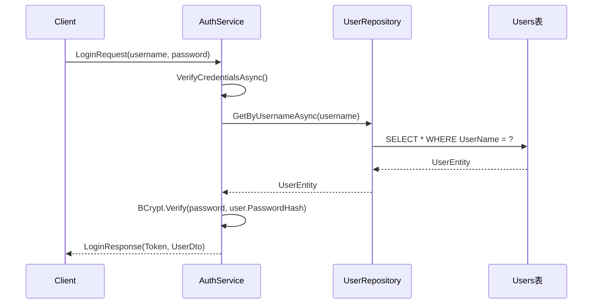
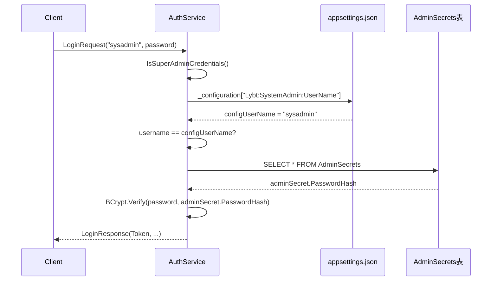

# 认证与用户自我维护统一方案 - 深度分析

**文档类型**: 技术分析 + 重构方案
**创建日期**: 2025-11-08
**问题来源**: Issue #1908 - SysAdmin登录问题深度分析
**业务目标**: 统一认证架构 + 简化配置 + 完善用户自我维护

---

## 📋 执行摘要

### 问题概述
在排查Issue #1908（sysadmin无法登录）过程中，发现了更深层的架构问题：

1. **表面问题**: appsettings.Development.json配置键名错误（"Username" vs "UserName"）
2. **深层问题**: SysAdmin双轨认证架构的配置依赖设计缺陷
3. **衍生问题**: 配置文件冗余，用户自我维护功能不完整

### 核心发现

✅ **User账户认证和自我维护功能完整且工作正常**：
- 登录认证：Users表 → UserRepository → BCrypt验证
- 修改密码：UserService.ChangePasswordAsync() ✅ 已实现
- 修改资料：设计文档已完成，待实施

❌ **SysAdmin账户存在架构缺陷**：
- 登录认证：依赖配置文件提供用户名 → AdminSecrets表查询密码
- 修改密码：AuthService.ChangeSysAdminPasswordAsync() ✅ 已实现
- 修改资料：❌ 不支持（AdminSecrets表设计过于简化）
- **关键缺陷**: 配置键名错误导致用户名读取为空 → 认证失败

### 推荐方案

**方案B**（推荐）: 扩展AdminSecrets表，移除配置依赖

- **影响范围**: 数据库迁移 + AuthService调整 + 配置简化
- **实施难度**: 中等
- **预期收益**: 移除配置依赖，降低出错概率，支持sysadmin自我维护
- **兼容性**: 需要数据迁移，但不影响现有用户

---

## 🔍 深度问题分析

### 1. SysAdmin登录失败的完整根因链

#### 1.1 表象问题：配置键名错误

**问题代码** (appsettings.Development.json:85):
```json
"SystemAdmin": {
    "Username": "sysadmin",  // ❌ 小写u
    ...
}
```

**读取代码** (AuthService.cs:65):
```csharp
var configUserName = _configuration["Lybt:SystemAdmin:UserName"];  // 期望大写U
```

**失败路径**:
```
1. appsettings.Development.json覆盖appsettings.json
2. 配置键名不匹配（"Username" != "UserName"）
3. configUserName读取为null
4. IsSuperAdminCredentials()返回false（Line 68-71）
5. 认证失败
```

**已修复**: ✅ 统一键名为"UserName"

#### 1.2 深层问题：配置依赖的设计缺陷

**问题根源**: AdminSecrets表缺少UserName列

```sql
-- 当前设计（问题根源）
CREATE TABLE AdminSecrets (
    Id UNIQUEIDENTIFIER PRIMARY KEY,
    PasswordHash NVARCHAR(500) NOT NULL
    -- ❌ 缺少UserName列
);
```

**连锁后果**:
1. ❌ 用户名必须从配置文件读取（硬编码依赖）
2. ❌ 配置文件分散在多个环境（json文件冗余）
3. ❌ 键名不一致导致配置读取失败（Issue #1908）
4. ❌ sysadmin无法修改用户名（存储在配置文件中）
5. ❌ 部署复杂度增加（需同步配置文件和数据库）

**对比User账户**:
```sql
-- Users表设计（正确）
CREATE TABLE Users (
    Id UNIQUEIDENTIFIER PRIMARY KEY,
    UserName NVARCHAR(50) NOT NULL UNIQUE,  // ✅ 用户名存储在数据库
    PasswordHash NVARCHAR(500) NOT NULL,
    RealName NVARCHAR(50) NOT NULL,
    PhoneNumber NVARCHAR(20),
    Email NVARCHAR(100),
    ...
);
```

✅ 用户名直接从数据库查询，无配置依赖
✅ 用户可以自我维护所有字段
✅ 部署简单（仅数据库Migration）

---

### 2. 双轨认证架构对比分析

#### 2.1 User账户认证流程



**特点**:
- ✅ 简单直接：用户名和密码都在数据库
- ✅ 无配置依赖
- ✅ 支持自我维护

#### 2.2 SysAdmin账户认证流程（当前）



**缺陷**:
- ❌ 配置依赖：用户名来自配置文件
- ❌ 配置键名错误导致认证失败
- ❌ 配置文件分散（7个文件）
- ❌ 部署复杂：需同步配置和数据库

---

### 3. 用户自我维护功能对比

#### 3.1 User账户（Admin/Doctor）

**修改密码** - ✅ 已实现
```csharp
// UserService.cs:497-518
public async Task<ServiceResult> ChangePasswordAsync(
    Guid id, string oldPassword, string newPassword)
{
    // 1. 验证用户存在
    // 2. BCrypt验证旧密码
    // 3. BCrypt哈希新密码
    // 4. 更新Users表
}
```

**修改资料** - ⚠️ 设计完成，待实施
- 可修改字段：RealName, PhoneNumber, Email
- 自动更新：PinYinCode（基于RealName）
- UI设计：UserProfileDialog + 角色差异化

#### 3.2 SysAdmin账户

**修改密码** - ✅ 已实现
```csharp
// AuthService.cs:157-243
public async Task<ServiceResult<bool>> ChangeSysAdminPasswordAsync(
    ChangeSysAdminPassword request)
{
    // 1. 验证输入
    // 2. 查询AdminSecrets表
    // 3. BCrypt验证旧密码
    // 4. BCrypt哈希新密码
    // 5. 更新AdminSecrets表
    // 6. 审计日志
}
```

**修改资料** - ❌ 不支持
- AdminSecrets表仅有Id和PasswordHash两列
- 用户名存储在配置文件（不可修改）
- 无Email、RealName等个人信息字段

**设计文档已明确**:
> "sysadmin不在Users表中，使用单独的AuthService.ChangeSysAdminPasswordAsync API"
> "sysadmin仅能修改登录密码（sysadmin不在Users表中，存储在AdminSecrets表，没有RealName等个人信息字段）"

**问题**: 设计文档已接受这种局限性，但从系统维护角度看，这是一个架构缺陷

---

### 4. 配置文件冗余分析

#### 4.1 配置文件清单

发现7个appsettings文件：

| 文件名 | 用途 | 问题 |
|--------|------|------|
| appsettings.json | 基础配置 | SystemAdmin配置（UserName: "sysadmin"） |
| appsettings.Development.json | 开发环境覆盖 | ❌ SystemAdmin配置键名错误（Username） |
| appsettings.Production.json | 生产环境覆盖 | 重复配置 |
| appsettings.Security.json | 安全配置 | 没有SystemAdmin配置 |
| appsettings.Test.json | 测试环境配置 | 重复配置 |
| appsettings.Example.json | 配置模板示例 | 文档用途 |
| appsettings.ClinicOptimized.json | 诊所优化配置 | 特殊场景 |

#### 4.2 配置冗余问题

**SystemAdmin配置重复** (3处):
```json
// appsettings.json (Line 115-121)
"SystemAdmin": {
  "UserName": "sysadmin",  // ✅ 正确
  "Email": "admin@lybt.com",
  ...
}

// appsettings.Development.json (Line 84-90)
"SystemAdmin": {
    "Username": "sysadmin",  // ❌ 错误（小写u）
    "Email": "admin@lybt.com",
    ...
}

// appsettings.Production.json (可能存在)
...
```

**JWT配置重复** (至少3处):
- appsettings.json
- appsettings.Development.json
- appsettings.Security.json

**DefaultPasswords配置分散**:
- appsettings.json: DefaultPasswords section
- appsettings.Development.json: 重复定义
- appsettings.Security.json: 使用环境变量

**问题总结**:
1. ❌ 配置重复导致维护成本高
2. ❌ 键名不一致导致运行时错误
3. ❌ 配置分散导致难以理解全局配置
4. ❌ 环境特定配置过多

---

## 🎯 统一方案设计

### 方案A：将SysAdmin迁移到Users表

#### A.1 方案概述
将sysadmin作为Users表的特殊用户，使用新增的UserRole.SuperAdmin角色标识。

#### A.2 实施方案

**数据库变更**:
```sql
-- 1. 修改UserRole枚举（代码层）
public enum UserRole
{
    Staff = 0,
    Doctor = 1,
    Admin = 2,
    SuperAdmin = 3  // ⬅️ 新增
}

-- 2. Users表插入sysadmin记录
INSERT INTO Users (Id, UserName, PasswordHash, RealName, Role, ...)
VALUES (
    '00000000-0000-0000-0000-000000000001',
    'sysadmin',
    '<从AdminSecrets迁移>',
    '系统超级管理员',
    3,  -- SuperAdmin
    ...
);

-- 3. 删除AdminSecrets表
DROP TABLE AdminSecrets;
```

**代码调整**:
```csharp
// AuthService.cs - 移除IsSuperAdminCredentials()方法
// 统一使用UserRepository查询
public async Task<ServiceResult<string>> VerifyCredentialsAsync(...)
{
    var userEntity = await _userRepository.GetByUsernameAsync(request.UserName);
    if (userEntity == null)
        return ServiceResult<string>.Failure("用户名或密码错误");

    if (!BCrypt.Net.BCrypt.Verify(request.Password, userEntity.PasswordHash))
        return ServiceResult<string>.Failure("用户名或密码错误");

    return ServiceResult<string>.Success(userEntity.Id.ToString());
}

// 移除配置依赖
// 移除 _configuration["Lybt:SystemAdmin:UserName"]
```

#### A.3 优缺点分析

**优点**:
- ✅ 完全统一认证逻辑（单一代码路径）
- ✅ 移除配置文件依赖
- ✅ 支持sysadmin完整的用户自我维护
- ✅ 简化AuthService代码

**缺点**:
- ❌ 打破语义边界：sysadmin不是业务用户
- ❌ Users表混入非业务数据
- ❌ RealName、PhoneNumber等字段对sysadmin无意义
- ❌ 违反DDD原则：不同概念不应共用同一实体

**风险**:
- ⚠️ 业务逻辑污染：用户管理模块需特殊处理sysadmin
- ⚠️ 权限混乱：SuperAdmin和Admin的权限边界不清晰

**结论**: ❌ **不推荐** - 违反DDD原则，语义混乱

---

### 方案B：扩展AdminSecrets表，移除配置依赖（推荐）

#### B.1 方案概述
保持双轨架构，扩展AdminSecrets表结构，将用户名从配置文件迁移到数据库。

#### B.2 实施方案

**Phase 1: 数据库迁移**

```sql
-- Migration: 扩展AdminSecrets表
ALTER TABLE AdminSecrets
ADD UserName NVARCHAR(50) NOT NULL DEFAULT 'sysadmin',
    Email NVARCHAR(100) NULL,
    DisplayName NVARCHAR(100) NULL DEFAULT '系统超级管理员',
    CreatedAt DATETIME2 NOT NULL DEFAULT GETUTCDATE(),
    UpdatedAt DATETIME2 NOT NULL DEFAULT GETUTCDATE();

-- 添加唯一约束
ALTER TABLE AdminSecrets
ADD CONSTRAINT UQ_AdminSecrets_UserName UNIQUE (UserName);

-- 更新种子数据（如果使用EF Core Migration）
-- AdminSecretConfiguration.cs
entity.HasData(new AdminSecretModel
{
    Id = Guid.Parse("00000000-0000-0000-0000-000000000001"),
    UserName = "sysadmin",  // ⬅️ 新增
    Email = "admin@lybt.com",  // ⬅️ 新增
    DisplayName = "系统超级管理员",  // ⬅️ 新增
    PasswordHash = "$2a$11$va/3K149qeu9cOv09oy6I.HPnpyDBJtYOf4o7pGZiJwRVe.EEky3C",
    CreatedAt = DateTime.UtcNow,
    UpdatedAt = DateTime.UtcNow
});
```

**Phase 2: 调整AdminSecretModel实体**

```csharp
// AdminSecretModel.cs
namespace LYBT.Entities.Auth;

/// <summary>
/// 系统管理员凭证实体（AdminSecrets表）
/// Issue #XXXX: 扩展字段，移除配置文件依赖
/// </summary>
public class AdminSecretModel
{
    /// <summary>固定ID: 00000000-0000-0000-0000-000000000001</summary>
    public Guid Id { get; set; }

    /// <summary>
    /// 用户名（唯一）
    /// Issue #XXXX: 从配置文件迁移到数据库，支持自我维护
    /// </summary>
    [Required]
    [StringLength(50)]
    public string UserName { get; set; } = string.Empty;

    /// <summary>密码哈希（BCrypt）</summary>
    [Required]
    [StringLength(500)]
    public string PasswordHash { get; set; } = string.Empty;

    /// <summary>
    /// 邮箱地址
    /// Issue #XXXX: 新增，支持sysadmin自我维护
    /// </summary>
    [StringLength(100)]
    public string? Email { get; set; }

    /// <summary>
    /// 显示名称
    /// Issue #XXXX: 新增，替代配置文件的DisplayName
    /// </summary>
    [StringLength(100)]
    public string? DisplayName { get; set; }

    /// <summary>创建时间</summary>
    public DateTime CreatedAt { get; set; } = DateTime.UtcNow;

    /// <summary>最后更新时间</summary>
    public DateTime UpdatedAt { get; set; } = DateTime.UtcNow;
}
```

**Phase 3: 调整AuthService认证逻辑**

```csharp
// AuthService.cs - 修改IsSuperAdminCredentials方法
private async Task<bool> IsSuperAdminCredentials(
    string username,
    string password,
    CancellationToken cancellationToken = default)
{
    try
    {
        // ❌ 移除配置依赖
        // var configUserName = _configuration["Lybt:SystemAdmin:UserName"];

        // ✅ 直接查询AdminSecrets表
        var adminSecret = await _dbContext.AdminSecrets
            .FirstOrDefaultAsync(a => a.UserName == username, cancellationToken);

        if (adminSecret == null)
        {
            // 用户名不匹配或不存在
            return false;
        }

        // 验证密码
        bool isValid = BCrypt.Net.BCrypt.Verify(password, adminSecret.PasswordHash);

        if (isValid)
        {
            _logger.LogInformation("超级管理员登录成功 [用户名: {UserName}]", username);
        }
        else
        {
            _logger.LogWarning("超级管理员认证失败：密码错误");
        }

        return isValid;
    }
    catch (Exception ex)
    {
        _logger.LogError(ex, "验证超级管理员凭证时发生错误");
        return false;
    }
}
```

**Phase 4: 新增sysadmin资料修改API**

```csharp
// AuthService.cs - 新增方法
/// <summary>
/// 修改系统管理员资料
/// Issue #XXXX: 支持sysadmin修改UserName、Email、DisplayName
/// </summary>
public async Task<ServiceResult> ChangeSysAdminProfileAsync(
    ChangeSysAdminProfileRequest request)
{
    try
    {
        var adminSecret = await _dbContext.AdminSecrets.FirstOrDefaultAsync();
        if (adminSecret == null)
        {
            return ServiceResult.Failure("系统管理员未初始化");
        }

        // 验证UserName唯一性（如果修改了）
        if (request.UserName != adminSecret.UserName)
        {
            var existingAdmin = await _dbContext.AdminSecrets
                .FirstOrDefaultAsync(a => a.UserName == request.UserName);
            if (existingAdmin != null)
            {
                return ServiceResult.Failure("用户名已被使用");
            }
        }

        // 更新字段
        adminSecret.UserName = request.UserName;
        adminSecret.Email = request.Email;
        adminSecret.DisplayName = request.DisplayName;
        adminSecret.UpdatedAt = DateTime.UtcNow;

        await _dbContext.SaveChangesAsync();

        _logger.LogInformation("系统管理员资料修改成功");
        return ServiceResult.Success("资料修改成功");
    }
    catch (Exception ex)
    {
        _logger.LogError(ex, "修改系统管理员资料失败");
        return ServiceResult.Failure("修改失败");
    }
}
```

**Phase 5: 移除配置文件依赖**

```json
// appsettings.json - 移除SystemAdmin配置
// ❌ 移除以下内容
"SystemAdmin": {
  "UserName": "sysadmin",        // ⬅️ 移除（迁移到数据库）
  "Email": "admin@lybt.com",      // ⬅️ 移除（迁移到数据库）
  "DisplayName": "系统管理员",     // ⬅️ 移除（迁移到数据库）
  "AutoCreateOnStartup": true,
  "SessionTimeoutMinutes": 240
}

// ✅ 简化后（仅保留运行时配置）
"SystemAdmin": {
  "SessionTimeoutMinutes": 240,
  "EnableAccountLockout": true
}
```

```json
// appsettings.Development.json - 移除SystemAdmin配置
// ❌ 完全移除
"SystemAdmin": { ... }  // ⬅️ 移除整个section
```

#### B.3 优缺点分析

**优点**:
- ✅ 保持双轨架构的语义清晰度
- ✅ 移除配置文件依赖，降低出错概率
- ✅ 支持sysadmin自我维护（用户名、邮箱、显示名称）
- ✅ 简化配置文件（移除SystemAdmin.UserName等）
- ✅ 统一认证模式（都从数据库查询用户名）
- ✅ 向后兼容（通过EF Migration平滑升级）

**缺点**:
- ⚠️ 需要数据库迁移（增加部署复杂度）
- ⚠️ AdminSecrets表不再是"纯凭证表"（包含用户信息）

**风险**:
- 中等：数据迁移需要测试
- 低：代码调整范围可控（仅AuthService）

**结论**: ✅ **推荐** - 平衡语义清晰度和功能完整性

---

### 方案C：完全移除SysAdmin（仅方案B的极端情况）

#### C.1 方案概述
完全移除SysAdmin特殊账户，使用Users表的Admin角色管理系统。

#### C.2 优缺点分析

**优点**:
- ✅ 最大程度简化架构
- ✅ 完全统一认证和用户维护

**缺点**:
- ❌ 违反系统安全原则（需要至少一个超级管理员账户）
- ❌ 无法区分"系统管理员"和"业务管理员"

**结论**: ❌ **不推荐** - 安全风险过高

---

## 📊 方案对比总结

| 维度 | 方案A：迁移到Users表 | 方案B：扩展AdminSecrets表 | 方案C：完全移除SysAdmin |
|-----|---------------------|-------------------------|----------------------|
| **语义清晰度** | ❌ 低（混淆概念） | ✅ 高（保持双轨） | ❌ 无（不区分） |
| **配置依赖** | ✅ 移除 | ✅ 移除 | ✅ 移除 |
| **自我维护** | ✅ 完整支持 | ✅ 部分支持（UserName、Email） | ✅ 完整支持 |
| **代码复杂度** | ✅ 低（单一路径） | ⚠️ 中（双轨路径） | ✅ 低 |
| **数据库变更** | ⚠️ 中（迁移+删表） | ⚠️ 中（扩展表） | ⚠️ 中（迁移+删表） |
| **DDD原则** | ❌ 违反 | ✅ 符合 | ❌ 违反 |
| **安全性** | ✅ 高 | ✅ 高 | ❌ 低 |
| **推荐程度** | ❌ 不推荐 | ✅ **强烈推荐** | ❌ 不推荐 |

---

## 🔧 配置简化方案

### 简化目标
1. 移除SystemAdmin配置依赖（方案B已覆盖）
2. 统一JWT配置位置
3. 合并DefaultPasswords配置
4. 移除重复配置

### 简化策略

#### 策略1：配置分层原则

**基础配置** (appsettings.json):
- 通用配置：Kestrel、ConnectionStrings、Serilog
- 默认值：JWT、PasswordPolicy、Database
- ❌ 不包含：环境特定的值

**环境覆盖** (appsettings.{Environment}.json):
- **仅覆盖差异值**
- 示例：Development环境的JWT.ExpireMinutes = 30分钟（vs Production的15分钟）

**安全配置** (appsettings.Security.json):
- 敏感配置：使用环境变量占位符
- 示例：`"SecretKey": "${JWT_SECRET}"`

#### 策略2：SystemAdmin配置简化

**简化前**:
```json
// appsettings.json
"SystemAdmin": {
  "UserName": "sysadmin",          // ⬅️ 移除（迁移到数据库）
  "Email": "admin@lybt.com",        // ⬅️ 移除
  "DisplayName": "系统管理员",       // ⬅️ 移除
  "AutoCreateOnStartup": true,
  "SessionTimeoutMinutes": 240
}

// appsettings.Development.json
"SystemAdmin": {
    "Username": "sysadmin",          // ⬅️ 移除（键名错误）
    "Email": "admin@lybt.com",
    ...
}
```

**简化后** (仅保留运行时配置):
```json
// appsettings.json
"SystemAdmin": {
  "SessionTimeoutMinutes": 240,
  "EnableAccountLockout": true,
  "RequirePasswordChangeOnFirstLogin": true
}

// appsettings.Development.json
"SystemAdmin": {
  "SessionTimeoutMinutes": 480,      // 开发环境更长
  "EnableAccountLockout": false      // 开发环境禁用锁定
}
```

#### 策略3：JWT配置统一

**简化前** (重复定义):
```json
// appsettings.json
"Lybt": {
  "Jwt": {
    "SecretKey": "...",
    "Issuer": "LYBT.WebAPI",
    ...
  }
}

// appsettings.Security.json
"JwtOptions": {
  "Secret": "${JWT_SECRET}",  // ⬅️ 不同的键名
  "Issuer": "LYBT.WebAPI",
  ...
}
```

**简化后** (统一使用Lybt:Jwt):
```json
// appsettings.json（默认值）
"Lybt": {
  "Jwt": {
    "SecretKey": "development-secret-key-32-chars-min",
    "Issuer": "LYBT.WebAPI",
    "Audience": "LYBT.Client",
    "ExpireMinutes": 15,
    ...
  }
}

// appsettings.Security.json（生产环境使用环境变量）
"Lybt": {
  "Jwt": {
    "SecretKey": "${JWT_SECRET}",  // ⬅️ 环境变量
    "ExpireMinutes": 15
  }
}

// ❌ 移除JwtOptions section（统一使用Lybt:Jwt）
```

#### 策略4：DefaultPasswords配置合并

**简化前**:
```json
// appsettings.json
"Lybt": {
  "DefaultPasswords": {
    "SysAdminPassword": "LybtAdmin2025@SecurePass!",
    "NewUserPassword": "Lybt2025@TempPass!",
    ...
  }
}

// appsettings.Security.json
"DefaultPasswords": {
  "SystemAdmin": "${ADMIN_DEFAULT_PASSWORD}",
  "NewUser": "${USER_DEFAULT_PASSWORD}",
  ...
}
```

**简化后**（统一键名，移除SysAdmin密码配置）:
```json
// appsettings.json（开发环境默认值）
"Lybt": {
  "DefaultPasswords": {
    "NewUser": "Lybt2025@TempPass!",
    "EnableInDevelopment": true,
    "AllowInProduction": false
  }
}

// appsettings.Security.json（生产环境）
"Lybt": {
  "DefaultPasswords": {
    "NewUser": "${USER_DEFAULT_PASSWORD}",
    "EnableInDevelopment": false,
    "AllowInProduction": false
  }
}

// ❌ 移除SysAdminPassword配置（密码存储在数据库种子数据中）
```

### 简化结果

**移除的配置项**:
1. ❌ `Lybt:SystemAdmin:UserName` - 迁移到AdminSecrets表
2. ❌ `Lybt:SystemAdmin:Email` - 迁移到AdminSecrets表
3. ❌ `Lybt:SystemAdmin:DisplayName` - 迁移到AdminSecrets表
4. ❌ `JwtOptions` section - 统一使用`Lybt:Jwt`
5. ❌ `DefaultPasswords:SystemAdmin` - 使用数据库种子数据

**保留的配置文件** (建议):
1. ✅ appsettings.json - 基础配置和默认值
2. ✅ appsettings.Development.json - 开发环境覆盖
3. ✅ appsettings.Production.json - 生产环境覆盖
4. ✅ appsettings.Security.json - 安全配置（环境变量）
5. ⚠️ appsettings.Test.json - 测试环境（可选）
6. ⚠️ appsettings.Example.json - 文档用途（可选）
7. ❓ appsettings.ClinicOptimized.json - 特殊场景（评估是否必需）

---

## 📋 实施计划

### Phase 1: 数据库迁移（1-2天）

**任务清单**:
- [ ] 创建EF Core Migration（扩展AdminSecrets表）
- [ ] 更新AdminSecretModel实体
- [ ] 更新AdminSecretConfiguration种子数据
- [ ] 本地测试Migration（Up和Down）
- [ ] 编写数据迁移脚本（从配置文件迁移到数据库）

**验收标准**:
- AdminSecrets表包含UserName、Email、DisplayName列
- 种子数据正确插入
- Migration可回滚

### Phase 2: AuthService调整（1天）

**任务清单**:
- [ ] 修改IsSuperAdminCredentials方法（移除配置依赖）
- [ ] 新增ChangeSysAdminProfileAsync方法
- [ ] 更新LoginAsync方法（适配新的AdminSecret结构）
- [ ] 移除配置读取代码
- [ ] 单元测试更新

**验收标准**:
- sysadmin认证成功（无配置依赖）
- 修改密码功能正常
- 单元测试全部通过

### Phase 3: 配置文件简化（0.5天）

**任务清单**:
- [ ] 移除SystemAdmin.UserName等配置
- [ ] 统一JWT配置（移除JwtOptions）
- [ ] 合并DefaultPasswords配置
- [ ] 更新配置文档

**验收标准**:
- 配置文件无冗余
- 键名统一
- 应用启动正常

### Phase 4: Client端调整（1天）

**任务清单**:
- [ ] 新增sysadmin资料修改UI（UserProfileDialog）
- [ ] 新增IAuthService.ChangeSysAdminProfileAsync接口
- [ ] 实现Client端调用逻辑
- [ ] 单元测试

**验收标准**:
- sysadmin可以修改UserName、Email、DisplayName
- UI角色差异化正确
- 表单验证正常

### Phase 5: 测试与验证（1天）

**任务清单**:
- [ ] 集成测试：sysadmin登录
- [ ] 集成测试：sysadmin修改密码
- [ ] 集成测试：sysadmin修改资料
- [ ] 集成测试：普通用户登录（回归测试）
- [ ] 配置文件简化验证
- [ ] 文档更新

**验收标准**:
- 所有测试通过
- 配置文件无错误
- 文档同步更新

**总计**: 4.5-5.5天

---

## 🚨 风险评估

### 风险1：数据迁移失败

**风险等级**: 中
**影响**: sysadmin无法登录，系统不可用
**缓解措施**:
- 在测试环境充分测试Migration
- 编写回滚脚本
- 生产部署前备份数据库

### 风险2：配置简化导致功能缺失

**风险等级**: 低
**影响**: 部分配置读取失败
**缓解措施**:
- 配置简化前审查所有引用
- 使用配置验证（Startup时检查）
- 保留配置注释

### 风险3：双轨架构复杂度

**风险等级**: 低
**影响**: 维护成本略高
**缓解措施**:
- 文档清晰说明双轨设计原因
- 代码注释标注架构边界

---

## 📚 参考文档

- [用户信息修改功能 - 需求讨论](./client/user-profile-modification-discussion.md)
- [用户信息修改功能 - 技术设计](./client/user-profile-modification-design.md)
- [Issue #1908 - SysAdmin登录问题诊断](../../../.verification/issue-1908-sysadmin-login-fix.md)
- [Issue #1907 - Token内存存储迁移](../../../.verification/issue-1907-implementation-summary.md)

---

**文档版本**: v1.0
**状态**: 待用户批准
**下一步**: 创建GitHub Issue跟踪重构任务
