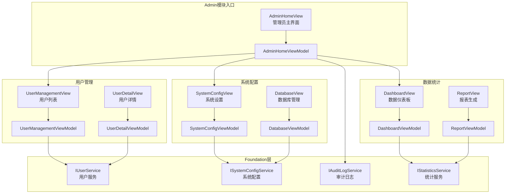

# Client端管理员模块架构设计

> **文档类型**: Explanation（架构设计）
> **目标读者**: 架构师、前端开发工程师
> **最后更新**: 2025-10-30
> **关联文档**: [用户管理架构](users-design.md) | [角色路由规则](../../../explanation/business-rules.md#ac-002-角色路由规则)

---

## 📋 文档概览

本文档详细阐述凌隐宝堂中医诊所诊疗系统（LYBTZYZS）Client端管理员（Admin）角色模块的架构设计，包括管理员主界面、用户管理、系统配置、数据统计等核心实现方案。

**核心特性**：
- ✅ **MVVM架构**：完全分离View与业务逻辑
- ✅ **角色路由**：基于AC-002规则的角色驱动导航
- ✅ **权限控制**：Admin角色独享的管理功能
- ✅ **模块化设计**：Tab布局管理多个子功能
- ✅ **实时统计**：Dashboard展示系统运行数据
- ✅ **审计日志**：记录管理员操作轨迹

---

## 1. 架构概览

### 1.1 Admin模块功能全景图



### 1.2 模块分层结构

```
LYBT.Desktop.Admin/                   # 管理员模块（Client端）
├── ViewModels/
│   ├── AdminHomeViewModel.cs         # 管理员主界面ViewModel
│   │   ├── 属性（8个）
│   │   │   ├── CurrentView            # 当前显示的子视图
│   │   │   ├── SelectedTab            # 选中的Tab索引
│   │   │   ├── UserCount              # 用户总数
│   │   │   ├── TodayMedicalCaseCount  # 今日病案数
│   │   │   ├── ActiveDoctorCount      # 在线医生数
│   │   │   ├── SystemStatus           # 系统状态
│   │   │   ├── LastUpdateTime         # 最后更新时间
│   │   │   └── RefreshCommand         # 刷新命令
│   │   └── 方法（6个）
│   │       ├── 构造函数                # 初始化依赖、加载统计数据
│   │       ├── LoadStatisticsAsync    # 加载统计数据
│   │       ├── NavigateToUserManagement # 导航到用户管理
│   │       ├── NavigateToSystemConfig   # 导航到系统配置
│   │       ├── NavigateToDashboard      # 导航到数据仪表板
│   │       └── ExecuteRefreshAsync      # 刷新数据
│   │
│   ├── UserManagementViewModel.cs    # 用户管理ViewModel
│   │   ├── 属性（7个）
│   │   │   ├── Users                  # 用户列表
│   │   │   ├── SelectedUser           # 选中的用户
│   │   │   ├── SearchText             # 搜索关键字
│   │   │   ├── FilterRole             # 角色筛选
│   │   │   ├── AddUserCommand         # 添加用户命令
│   │   │   ├── EditUserCommand        # 编辑用户命令
│   │   │   └── DeleteUserCommand      # 删除用户命令
│   │   └── 方法（8个）
│   │       ├── 构造函数                # 初始化依赖
│   │       ├── LoadUsersAsync         # 加载用户列表
│   │       ├── SearchUsersAsync       # 搜索用户
│   │       ├── FilterByRoleAsync      # 按角色筛选
│   │       ├── ExecuteAddUserAsync    # 添加用户
│   │       ├── ExecuteEditUserAsync   # 编辑用户
│   │       ├── ExecuteDeleteUserAsync # 删除用户
│   │       └── RecordAuditLog         # 记录审计日志
│   │
│   ├── SystemConfigViewModel.cs      # 系统配置ViewModel
│   │   ├── 属性（5个）
│   │   │   ├── ServerUrl              # API服务器地址
│   │   │   ├── DatabaseStatus         # 数据库状态
│   │   │   ├── BackupSchedule         # 备份计划
│   │   │   ├── SaveConfigCommand      # 保存配置命令
│   │   │   └── TestConnectionCommand  # 测试连接命令
│   │   └── 方法（5个）
│   │       ├── 构造函数                # 初始化依赖
│   │       ├── LoadConfigAsync        # 加载配置
│   │       ├── ExecuteSaveConfigAsync # 保存配置
│   │       ├── ExecuteTestConnectionAsync # 测试连接
│   │       └── RecordConfigChange     # 记录配置变更
│   │
│   └── DashboardViewModel.cs         # 数据仪表板ViewModel
│       ├── 属性（6个）
│       │   ├── TotalPatients          # 患者总数
│       │   ├── TotalMedicalCases      # 病案总数
│       │   ├── TodayRevenue           # 今日收入
│       │   ├── MonthlyRevenue         # 月度收入
│       │   ├── ChartData              # 图表数据
│       │   └── ExportReportCommand    # 导出报表命令
│       └── 方法（5个）
│           ├── 构造函数                # 初始化依赖
│           ├── LoadDashboardDataAsync # 加载仪表板数据
│           ├── RefreshChartDataAsync  # 刷新图表数据
│           ├── ExecuteExportReportAsync # 导出报表
│           └── ScheduleAutoRefresh    # 定时自动刷新
│
├── Views/
│   ├── AdminHomeView.xaml            # 管理员主界面（Tab布局）
│   ├── AdminHomeView.xaml.cs         # AdminHomeView代码后置
│   ├── UserManagementView.xaml       # 用户管理界面（DataGrid）
│   ├── UserManagementView.xaml.cs    # UserManagementView代码后置
│   ├── SystemConfigView.xaml         # 系统配置界面（Form）
│   ├── SystemConfigView.xaml.cs      # SystemConfigView代码后置
│   ├── DashboardView.xaml            # 数据仪表板（Chart）
│   └── DashboardView.xaml.cs         # DashboardView代码后置
│
└── AdminModule.cs                    # Prism模块定义
    ├── OnInitialized()               # 模块初始化
    └── RegisterTypes()               # 注册Views和ViewModels
```

**依赖的Foundation层服务**：

```
LYBT.Desktop.Foundation/Services/    # 基础设施服务（Infrastructure Service）
├── IUserService                      # 用户管理服务接口
│   ├── GetUsersAsync()               # 获取用户列表
│   ├── CreateUserAsync()             # 创建用户
│   ├── UpdateUserAsync()             # 更新用户
│   ├── DeleteUserAsync()             # 删除用户
│   └── SearchUsersAsync()            # 搜索用户
│
├── ISystemConfigService              # 系统配置服务
│   ├── GetConfigAsync()              # 获取配置
│   ├── SaveConfigAsync()             # 保存配置
│   ├── TestDatabaseConnectionAsync() # 测试数据库连接
│   └── GetDatabaseStatusAsync()      # 获取数据库状态
│
├── IAuditLogService                  # 审计日志服务
│   ├── LogOperationAsync()           # 记录操作日志
│   ├── GetAuditLogsAsync()           # 获取审计日志
│   └── ExportAuditLogsAsync()        # 导出审计日志
│
└── IStatisticsService                # 统计服务
    ├── GetDashboardDataAsync()       # 获取仪表板数据
    ├── GetRevenueStatisticsAsync()   # 获取收入统计
    ├── GetPatientStatisticsAsync()   # 获取患者统计
    └── ExportReportAsync()           # 导出报表
```

---

## 2. AdminHomeViewModel设计

### 2.1 完整接口表

| 成员类型 | 名称 | 功能描述 | 访问级别 |
|---------|------|---------|---------|
| **绑定属性（7个）** | | | |
| Property | `CurrentView` | 当前显示的子视图（TabControl Content） | public |
| Property | `SelectedTab` | 选中的Tab索引 | public |
| Property | `UserCount` | 用户总数（实时更新） | public |
| Property | `TodayMedicalCaseCount` | 今日病案数 | public |
| Property | `ActiveDoctorCount` | 在线医生数 | public |
| Property | `SystemStatus` | 系统状态（Normal/Warning/Error） | public |
| Property | `LastUpdateTime` | 最后更新时间 | public |
| **命令（1个）** | | | |
| Command | `RefreshCommand` | 刷新统计数据命令 | public |
| **方法（6个）** | | | |
| Method | `构造函数` | 初始化依赖、加载统计数据 | public |
| Method | `LoadStatisticsAsync` | 加载统计数据（启动时） | private |
| Method | `NavigateToUserManagement` | 导航到用户管理Tab | private |
| Method | `NavigateToSystemConfig` | 导航到系统配置Tab | private |
| Method | `NavigateToDashboard` | 导航到数据仪表板Tab | private |
| Method | `ExecuteRefreshAsync` | 刷新统计数据（手动触发） | private |

### 2.2 核心属性设计

#### 2.2.1 CurrentView和SelectedTab属性

```csharp
public class AdminHomeViewModel : UnifiedViewModelBase
{
    private object? _currentView;
    private int _selectedTab;

    /// <summary>
    /// 当前显示的子视图（TabControl Content绑定）
    /// </summary>
    public object? CurrentView
    {
        get => _currentView;
        set => SetProperty(ref _currentView, value);
    }

    /// <summary>
    /// 选中的Tab索引（TabControl SelectedIndex绑定）
    /// 变化时触发子视图切换
    /// </summary>
    public int SelectedTab
    {
        get => _selectedTab;
        set
        {
            SetProperty(ref _selectedTab, value);
            NavigateToSubView(value);
        }
    }

    private void NavigateToSubView(int tabIndex)
    {
        CurrentView = tabIndex switch
        {
            0 => _container.Resolve<DashboardView>(),
            1 => _container.Resolve<UserManagementView>(),
            2 => _container.Resolve<SystemConfigView>(),
            _ => null
        };
    }
}
```

**设计说明**：
- ✅ **CurrentView**：使用object类型适配不同的子视图
- ✅ **SelectedTab**：TabIndex驱动View切换（Region导航替代方案）
- ✅ **NavigateToSubView**：使用Unity容器解析View实例

#### 2.2.2 统计数据属性

```csharp
private int _userCount;
private int _todayMedicalCaseCount;
private int _activeDoctorCount;
private string _systemStatus = "Normal";
private DateTime _lastUpdateTime;

/// <summary>
/// 用户总数（实时更新）
/// </summary>
public int UserCount
{
    get => _userCount;
    set => SetProperty(ref _userCount, value);
}

/// <summary>
/// 今日病案数
/// </summary>
public int TodayMedicalCaseCount
{
    get => _todayMedicalCaseCount;
    set => SetProperty(ref _todayMedicalCaseCount, value);
}

/// <summary>
/// 在线医生数
/// </summary>
public int ActiveDoctorCount
{
    get => _activeDoctorCount;
    set => SetProperty(ref _activeDoctorCount, value);
}

/// <summary>
/// 系统状态（Normal/Warning/Error）
/// </summary>
public string SystemStatus
{
    get => _systemStatus;
    set => SetProperty(ref _systemStatus, value);
}

/// <summary>
/// 最后更新时间
/// </summary>
public DateTime LastUpdateTime
{
    get => _lastUpdateTime;
    set => SetProperty(ref _lastUpdateTime, value);
}
```

**设计说明**：
- ✅ **实时更新**：统计数据每5分钟自动刷新
- ✅ **状态指示**：SystemStatus用于显示系统健康状态
- ✅ **时间戳**：LastUpdateTime显示数据新鲜度

### 2.3 核心方法设计

#### 2.3.1 构造函数和依赖注入

```csharp
public class AdminHomeViewModel : UnifiedViewModelBase
{
    private readonly IUserService _userService;
    private readonly IStatisticsService _statisticsService;
    private readonly IAuditLogService _auditLogService;
    private readonly IUnityContainer _container;
    private readonly IEventAggregator _eventAggregator;

    public AdminHomeViewModel(
        IUserService userService,
        IStatisticsService statisticsService,
        IAuditLogService auditLogService,
        IUnityContainer container,
        IEventAggregator eventAggregator)
    {
        _userService = userService ?? throw new ArgumentNullException(nameof(userService));
        _statisticsService = statisticsService ?? throw new ArgumentNullException(nameof(statisticsService));
        _auditLogService = auditLogService ?? throw new ArgumentNullException(nameof(auditLogService));
        _container = container ?? throw new ArgumentNullException(nameof(container));
        _eventAggregator = eventAggregator ?? throw new ArgumentNullException(nameof(eventAggregator));

        // 注册命令
        RefreshCommand = new DelegateCommand(async () => await ExecuteRefreshAsync());

        // 加载初始数据
        _ = LoadStatisticsAsync();

        // 订阅事件
        _eventAggregator.GetEvent<UserChangedEvent>().Subscribe(OnUserChanged);
        _eventAggregator.GetEvent<MedicalCaseCreatedEvent>().Subscribe(OnMedicalCaseCreated);
    }
}
```

**设计说明**：
- ✅ **5个依赖注入**：User/Statistics/AuditLog服务 + Container + EventAggregator
- ✅ **Null检查**：所有依赖必须非空
- ✅ **事件订阅**：监听UserChanged和MedicalCaseCreated事件
- ✅ **异步加载**：构造函数中触发LoadStatisticsAsync

#### 2.3.2 LoadStatisticsAsync方法

```csharp
/// <summary>
/// 加载统计数据（启动时和定时刷新）
/// </summary>
private async Task LoadStatisticsAsync()
{
    try
    {
        SetLoading(true);

        // 并行加载多个统计数据
        var dashboardDataTask = _statisticsService.GetDashboardDataAsync();
        var userCountTask = _userService.GetUsersAsync(new PaginationQuery { PageSize = 1 });

        await Task.WhenAll(dashboardDataTask, userCountTask);

        var dashboardData = await dashboardDataTask;
        var userPagedResult = await userCountTask;

        // 更新属性
        UserCount = userPagedResult.TotalCount;
        TodayMedicalCaseCount = dashboardData.TodayMedicalCaseCount;
        ActiveDoctorCount = dashboardData.ActiveDoctorCount;
        SystemStatus = dashboardData.SystemStatus;
        LastUpdateTime = DateTime.Now;

        // 记录管理员查看统计数据
        await _auditLogService.LogOperationAsync(new AuditLogDto
        {
            UserId = SessionManager?.CurrentUser?.Id ?? Guid.Empty,
            Action = "ViewDashboard",
            Description = "管理员查看统计数据",
            Timestamp = DateTime.Now
        });
    }
    catch (Exception ex)
    {
        Logger.Error(ex, "加载统计数据失败");
        MessageBoxHelper.ShowError("加载统计数据失败，请检查网络连接");
    }
    finally
    {
        SetLoading(false);
    }
}
```

**设计说明**：
- ✅ **并行加载**：使用Task.WhenAll并行请求多个API
- ✅ **审计日志**：记录管理员查看统计数据操作
- ✅ **异常处理**：捕获异常并显示友好错误消息

---

## 3. 角色路由集成

### 3.1 AC-002规则实现

**业务规则引用**：
```
AC-002: 角色路由规则
- 管理员角色（Admin）：登录后导航到 AdminHomeView
- 医生角色（Doctor）：登录后导航到 ClinicalHomeView
```

### 3.2 RoleNavigationService实现

```csharp
public class RoleNavigationService : IRoleNavigationService
{
    private readonly IRegionManager _regionManager;

    public RoleNavigationService(IRegionManager regionManager)
    {
        _regionManager = regionManager ?? throw new ArgumentNullException(nameof(regionManager));
    }

    /// <summary>
    /// 基于用户角色导航到对应主界面
    /// </summary>
    public void NavigateByRole(UserDto user)
    {
        if (user == null)
            throw new ArgumentNullException(nameof(user));

        string targetView = user.Role switch
        {
            UserRole.Admin => "AdminHomeView",      // 管理员 → AdminHomeView
            UserRole.Doctor => "ClinicalHomeView",  // 医生 → ClinicalHomeView
            _ => throw new InvalidOperationException($"未知角色: {user.Role}")
        };

        _regionManager.RequestNavigate("MainRegion", targetView);
    }
}
```

**设计说明**：
- ✅ **规则遵循**：严格按照AC-002规则实现
- ✅ **类型安全**：使用UserRole枚举而非字符串
- ✅ **异常安全**：未知角色抛出异常

### 3.3 LoginViewModel调用

```csharp
// LoginViewModel.cs:ExecuteLoginAsync()
private async Task ExecuteLoginAsync()
{
    try
    {
        // ... 登录逻辑 ...

        // 发布登录成功事件（MainWindowViewModel订阅）
        _eventAggregator.GetEvent<LoginSuccessEvent>().Publish(new LoginSuccessPayload
        {
            User = response.User,
            Token = response.AccessToken
        });

        // MainWindowViewModel收到事件后调用RoleNavigationService
    }
    catch (Exception ex)
    {
        Logger.Error(ex, "登录失败");
        MessageBoxHelper.ShowError("登录失败，请检查用户名和密码");
    }
}
```

---

## 4. 权限控制设计

### 4.1 Admin独享功能

| 功能 | 权限要求 | 实现位置 |
|------|---------|---------|
| **用户管理** | Admin Only | UserManagementViewModel |
| **系统配置** | Admin Only | SystemConfigViewModel |
| **数据库管理** | Admin Only | DatabaseViewModel |
| **审计日志查看** | Admin Only | AuditLogViewModel |
| **全局数据统计** | Admin Only | DashboardViewModel |

### 4.2 权限验证装饰器

```csharp
public class RequireAdminAttribute : Attribute
{
    // 标记需要Admin权限的ViewModel方法
}

// AOP拦截器（Unity Interception）
public class AdminAuthorizationInterceptor : IInterceptionBehavior
{
    public IMethodReturn Invoke(IMethodInvocation input, GetNextInterceptionBehaviorDelegate getNext)
    {
        var requireAdmin = input.MethodBase.GetCustomAttribute<RequireAdminAttribute>();
        if (requireAdmin != null)
        {
            var currentUser = SessionManager.Instance.CurrentUser;
            if (currentUser?.Role != UserRole.Admin)
            {
                throw new UnauthorizedAccessException("此功能仅管理员可用");
            }
        }

        return getNext()(input, getNext);
    }
}

// 使用示例
public class UserManagementViewModel
{
    [RequireAdmin]
    public async Task ExecuteDeleteUserAsync()
    {
        // 删除用户逻辑（仅Admin可调用）
    }
}
```

---

## 5. UI设计规范

### 5.1 AdminHomeView布局

```xml
<UserControl x:Class="LYBT.Desktop.Admin.Views.AdminHomeView">
    <Grid>
        <!-- 顶部统计卡片 -->
        <StackPanel Orientation="Horizontal" Margin="20,10">
            <Border Style="{StaticResource StatCard}">
                <StackPanel>
                    <TextBlock Text="用户总数" Style="{StaticResource StatLabel}"/>
                    <TextBlock Text="{Binding UserCount}" Style="{StaticResource StatValue}"/>
                </StackPanel>
            </Border>
            <Border Style="{StaticResource StatCard}">
                <StackPanel>
                    <TextBlock Text="今日病案" Style="{StaticResource StatLabel}"/>
                    <TextBlock Text="{Binding TodayMedicalCaseCount}" Style="{StaticResource StatValue}"/>
                </StackPanel>
            </Border>
            <Border Style="{StaticResource StatCard}">
                <StackPanel>
                    <TextBlock Text="在线医生" Style="{StaticResource StatLabel}"/>
                    <TextBlock Text="{Binding ActiveDoctorCount}" Style="{StaticResource StatValue}"/>
                </StackPanel>
            </Border>
        </StackPanel>

        <!-- Tab导航 -->
        <TabControl Grid.Row="1" SelectedIndex="{Binding SelectedTab}">
            <TabItem Header="数据仪表板">
                <ContentPresenter Content="{Binding CurrentView}"/>
            </TabItem>
            <TabItem Header="用户管理">
                <ContentPresenter Content="{Binding CurrentView}"/>
            </TabItem>
            <TabItem Header="系统配置">
                <ContentPresenter Content="{Binding CurrentView}"/>
            </TabItem>
        </TabControl>
    </Grid>
</UserControl>
```

### 5.2 UserManagementView布局

```xml
<UserControl x:Class="LYBT.Desktop.Admin.Views.UserManagementView">
    <Grid>
        <!-- 工具栏 -->
        <StackPanel Orientation="Horizontal">
            <TextBox PlaceholderText="搜索用户..." Text="{Binding SearchText, UpdateSourceTrigger=PropertyChanged}"/>
            <ComboBox SelectedItem="{Binding FilterRole}" ItemsSource="{Binding Roles}"/>
            <Button Content="添加用户" Command="{Binding AddUserCommand}"/>
        </StackPanel>

        <!-- 用户列表 -->
        <DataGrid ItemsSource="{Binding Users}" SelectedItem="{Binding SelectedUser}">
            <DataGrid.Columns>
                <DataGridTextColumn Header="用户名" Binding="{Binding Username}"/>
                <DataGridTextColumn Header="真实姓名" Binding="{Binding RealName}"/>
                <DataGridTextColumn Header="角色" Binding="{Binding Role}"/>
                <DataGridTextColumn Header="创建时间" Binding="{Binding CreatedAt}"/>
                <DataGridTemplateColumn Header="操作">
                    <DataGridTemplateColumn.CellTemplate>
                        <DataTemplate>
                            <StackPanel Orientation="Horizontal">
                                <Button Content="编辑" Command="{Binding DataContext.EditUserCommand, RelativeSource={RelativeSource AncestorType=DataGrid}}"/>
                                <Button Content="删除" Command="{Binding DataContext.DeleteUserCommand, RelativeSource={RelativeSource AncestorType=DataGrid}}"/>
                            </StackPanel>
                        </DataTemplate>
                    </DataGridTemplateColumn.CellTemplate>
                </DataGridTemplateColumn>
            </DataGrid.Columns>
        </DataGrid>
    </Grid>
</UserControl>
```

---

## 6. 审计日志设计

### 6.1 管理员操作记录

| 操作类型 | Action | 记录时机 |
|---------|--------|---------|
| 查看统计数据 | ViewDashboard | LoadStatisticsAsync执行时 |
| 创建用户 | CreateUser | ExecuteAddUserAsync完成后 |
| 编辑用户 | UpdateUser | ExecuteEditUserAsync完成后 |
| 删除用户 | DeleteUser | ExecuteDeleteUserAsync完成后 |
| 修改系统配置 | UpdateSystemConfig | ExecuteSaveConfigAsync完成后 |
| 导出报表 | ExportReport | ExecuteExportReportAsync完成后 |

### 6.2 AuditLogDto结构

```csharp
public class AuditLogDto
{
    public Guid Id { get; set; }
    public Guid UserId { get; set; }
    public string Username { get; set; } = string.Empty;
    public string Action { get; set; } = string.Empty;
    public string Description { get; set; } = string.Empty;
    public string IpAddress { get; set; } = string.Empty;
    public DateTime Timestamp { get; set; }
}
```

---

## 7. 性能优化

### 7.1 统计数据缓存

```csharp
private static readonly TimeSpan CacheExpiration = TimeSpan.FromMinutes(5);
private DateTime _lastCacheTime = DateTime.MinValue;
private DashboardData? _cachedDashboardData;

private async Task<DashboardData> GetDashboardDataWithCacheAsync()
{
    if (_cachedDashboardData != null && DateTime.Now - _lastCacheTime < CacheExpiration)
    {
        return _cachedDashboardData;
    }

    _cachedDashboardData = await _statisticsService.GetDashboardDataAsync();
    _lastCacheTime = DateTime.Now;
    return _cachedDashboardData;
}
```

### 7.2 分页加载用户列表

```csharp
private const int PageSize = 50;
private int _currentPage = 1;

private async Task LoadUsersAsync()
{
    var query = new PaginationQuery
    {
        Page = _currentPage,
        PageSize = PageSize,
        SearchText = SearchText,
        Role = FilterRole
    };

    var result = await _userService.GetUsersAsync(query);
    Users = new ObservableCollection<UserDto>(result.Items);
    TotalPages = result.TotalPages;
}
```

---

## 8. 测试策略

### 8.1 单元测试覆盖

| 测试类型 | 覆盖范围 | 测试重点 |
|---------|---------|---------|
| **ViewModel单元测试** | AdminHomeViewModel | LoadStatisticsAsync逻辑、事件订阅 |
| **ViewModel单元测试** | UserManagementViewModel | CRUD操作、搜索筛选 |
| **权限测试** | RequireAdminAttribute | 权限验证拦截器 |
| **集成测试** | 角色路由 | RoleNavigationService.NavigateByRole |

### 8.2 测试示例

```csharp
[Fact]
public async Task LoadStatisticsAsync_ShouldUpdateProperties()
{
    // Arrange
    var mockStatisticsService = new Mock<IStatisticsService>();
    mockStatisticsService.Setup(s => s.GetDashboardDataAsync())
        .ReturnsAsync(new DashboardData
        {
            TodayMedicalCaseCount = 10,
            ActiveDoctorCount = 5,
            SystemStatus = "Normal"
        });

    var viewModel = new AdminHomeViewModel(
        Mock.Of<IUserService>(),
        mockStatisticsService.Object,
        Mock.Of<IAuditLogService>(),
        Mock.Of<IUnityContainer>(),
        Mock.Of<IEventAggregator>()
    );

    // Act
    await viewModel.LoadStatisticsAsync();

    // Assert
    Assert.Equal(10, viewModel.TodayMedicalCaseCount);
    Assert.Equal(5, viewModel.ActiveDoctorCount);
    Assert.Equal("Normal", viewModel.SystemStatus);
}
```

---

## 9. 演进路线图

### v1.0 (MVP) - 核心功能
- ✅ AdminHomeView主界面
- ✅ 基础统计数据展示
- ✅ 用户管理（CRUD）
- ✅ 角色路由（AC-002）
- ✅ 审计日志记录

### v1.1 - 增强功能
- ⏸️ 数据仪表板（图表展示）
- ⏸️ 系统配置管理
- ⏸️ 数据库备份恢复
- ⏸️ 报表导出功能

### v1.2 - 高级功能
- ⏸️ 实时监控大屏
- ⏸️ 权限细粒度控制
- ⏸️ 操作日志回放
- ⏸️ 系统性能诊断

---

## 10. 参考资料

### 内部文档
- [Client端架构指南](../client/README.md)
- [用户管理架构设计](users-design.md)
- [业务规则文档](../../../explanation/business-rules.md)
- [角色路由实现](shell-layer-design.md)

### 外部资源
- [WPF MVVM模式](https://learn.microsoft.com/en-us/dotnet/desktop/wpf/advanced/mvvm-pattern)
- [Prism模块化开发](https://prismlibrary.com/docs/modularity.html)
- [Unity依赖注入](https://github.com/unitycontainer/unity)
- [DataGrid最佳实践](https://learn.microsoft.com/en-us/dotnet/desktop/wpf/controls/datagrid)

---

**最后更新**: 2025-10-30
**文档维护**: Client端架构组
**版本**: v1.0
