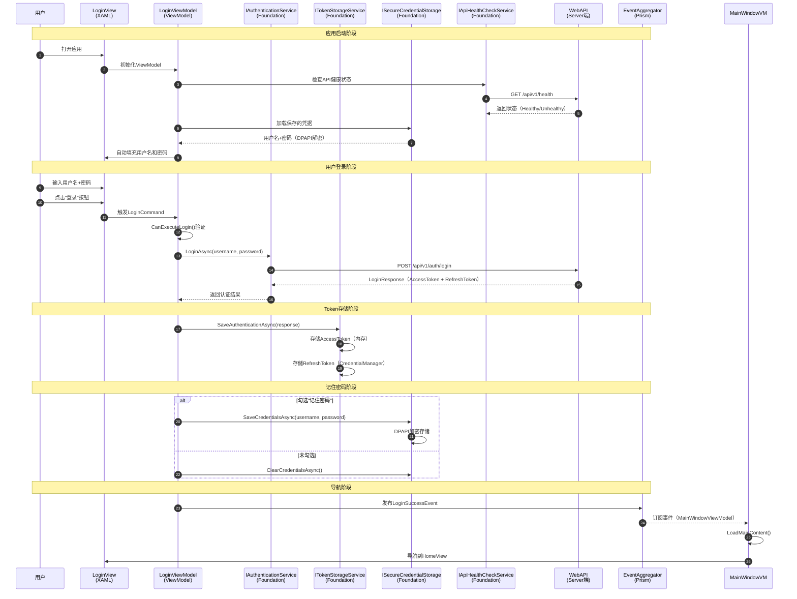

# Client端认证架构设计

> **文档类型**: Explanation（架构设计）
> **目标读者**: 架构师、前端开发工程师
> **最后更新**: 2025-10-30
> **关联文档**: [Server端认证架构](../server/auth-design.md) | [认证模块README](../../../../src/Client/Desktop/Modules/LYBT.Desktop.Auth/README.md)

---

## 📋 文档概览

本文档详细阐述凌隐宝堂中医诊所诊疗系统（LYBTZYZS）Client端的认证架构设计，包括MVVM登录界面、Token存储、API健康检查、记住密码、事件驱动导航等核心实现方案。

**核心特性**：
- ✅ **MVVM架构**：完全分离View与业务逻辑
- ✅ **依赖Foundation层**：使用Infrastructure Service（IAuthenticationService）
- ✅ **DPAPI加密存储**：记住密码功能使用Windows DPAPI
- ✅ **API健康检查**：启动时自动检测Server连接状态
- ✅ **事件驱动导航**：LoginSuccessEvent解耦模块通信
- ✅ **多设备支持**：RefreshToken实现7天免登录

---

## 1. 架构概览

### 1.1 Client端认证流程全景图



### 1.2 模块分层结构

```
LYBT.Desktop.Auth/                   # 认证模块（Client端）
├── ViewModels/
│   └── LoginViewModel.cs            # 登录视图模型（9属性+7方法）
│       ├── 属性（9个）
│       │   ├── Username              # 用户名（双向绑定）
│       │   ├── Password              # 密码（安全字段）
│       │   ├── RememberMe            # 记住用户名
│       │   ├── RememberPassword      # 记住密码
│       │   ├── HasSavedPassword      # 是否有保存的密码
│       │   ├── ApiStatus             # API连接状态
│       │   ├── ApiStatusMessage      # API状态消息
│       │   ├── HasMessage            # 是否有错误消息
│       │   └── LoginCommand          # 登录命令
│       └── 方法（7个）
│           ├── 构造函数              # 初始化依赖、触发健康检查
│           ├── CheckApiHealthAsyncSafe  # 安全健康检查（防异常阻塞）
│           ├── LoadSavedCredentialsAsync # 加载保存的凭据
│           ├── CheckApiHealthAsync      # 完整健康检查
│           ├── CanExecuteLogin          # 登录命令可执行条件
│           ├── ExecuteLoginAsync        # 执行登录逻辑
│           └── NavigateBasedOnRole      # 基于角色导航（已弃用）
│
├── Views/
│   ├── LoginView.xaml               # 登录视图（UserControl）
│   ├── LoginView.xaml.cs            # LoginView代码后置
│   ├── LoginWindow.xaml             # 登录窗口（独立Window）
│   └── LoginWindow.xaml.cs          # LoginWindow代码后置
│
└── AuthenticationModule.cs          # Prism模块定义
    ├── OnInitialized()              # 模块初始化
    └── RegisterTypes()              # 注册Views和ViewModels
```

**依赖的Foundation层服务**：

```
LYBT.Desktop.Foundation/Services/    # 基础设施服务（Infrastructure Service）
├── IAuthenticationService           # 认证服务接口
│   ├── LoginAsync()                 # 登录（调用WebAPI）
│   ├── LogoutAsync()                # 登出（撤销RefreshToken）
│   ├── RefreshTokenAsync()          # 刷新AccessToken
│   └── ValidateTokenAsync()         # 验证Token有效性
│
├── ITokenStorageService             # Token存储服务
│   ├── SaveAuthenticationAsync()    # 保存AccessToken + RefreshToken
│   ├── GetAccessTokenAsync()        # 获取AccessToken
│   ├── GetRefreshTokenAsync()       # 获取RefreshToken
│   └── ClearTokensAsync()           # 清除所有Token
│
├── ISecureCredentialStorage         # 凭据加密存储（DPAPI）
│   ├── SaveCredentialsAsync()       # 保存用户名+密码（加密）
│   ├── LoadCredentialsAsync()       # 加载凭据（解密）
│   ├── ClearCredentialsAsync()      # 清除凭据
│   └── IsRememberPasswordEnabledAsync() # 是否启用记住密码
│
├── IUsernameStorageService          # 用户名存储
│   ├── SaveUsernameAsync()          # 保存用户名
│   ├── GetSavedUsernameAsync()      # 获取保存的用户名
│   └── IsRememberMeEnabledAsync()   # 是否启用记住用户名
│
└── IApiHealthCheckService           # API健康检查
    ├── CheckHealthAsync()           # 执行健康检查
    └── LastErrorMessage { get; }    # 最后错误消息
```

---

## 2. LoginViewModel设计

### 2.1 完整接口表

| 成员类型 | 名称 | 功能描述 | 访问级别 |
|---------|------|---------|---------|
| **绑定属性（6个）** | | | |
| Property | `Username` | 用户名（双向绑定TextBox） | public |
| Property | `Password` | 密码（双向绑定PasswordBox） | public |
| Property | `RememberMe` | 记住用户名（绑定CheckBox） | public |
| Property | `RememberPassword` | 记住密码（绑定CheckBox） | public |
| Property | `ApiStatus` | API连接状态（Healthy/Unhealthy） | public |
| Property | `ApiStatusMessage` | API状态消息（显示在UI） | public |
| **只读属性（2个）** | | | |
| Property | `HasSavedPassword` | 是否存在保存的密码（控制UI显示） | public |
| Property | `HasMessage` | 是否有错误消息（控制MessageBar可见性） | public |
| **命令（1个）** | | | |
| Command | `LoginCommand` | 登录命令（绑定到登录按钮） | public |
| **方法（7个）** | | | |
| Method | `构造函数` | 初始化依赖、注册命令、触发健康检查 | public |
| Method | `CheckApiHealthAsyncSafe` | 安全的健康检查（吞掉异常） | private |
| Method | `LoadSavedCredentialsAsync` | 加载保存的凭据（自动填充） | private |
| Method | `CheckApiHealthAsync` | 完整的健康检查（更新状态） | private |
| Method | `CanExecuteLogin` | 登录命令可执行条件（非空验证） | private |
| Method | `ExecuteLoginAsync` | 执行登录逻辑（核心方法） | private |
| Method | `NavigateBasedOnRole` | 基于角色导航（Bug #1524已弃用） | private |

### 2.2 核心属性设计

#### 2.2.1 Username和Password属性

```csharp
public class LoginViewModel : UnifiedViewModelBase
{
    private string _username = string.Empty;
    private string _password = string.Empty;

    /// <summary>
    /// 用户名属性（双向绑定）
    /// 变化时触发CanExecuteLogin重新评估
    /// </summary>
    public string Username
    {
        get => _username;
        set
        {
            SetProperty(ref _username, value);
            (LoginCommand as DelegateCommand)?.RaiseCanExecuteChanged();
        }
    }

    /// <summary>
    /// 密码属性（安全字段）
    /// WPF原生PasswordBox不支持双向绑定，需通过PasswordBoxHelper
    /// </summary>
    public string Password
    {
        get => _password;
        set
        {
            SetProperty(ref _password, value);
            (LoginCommand as DelegateCommand)?.RaiseCanExecuteChanged();
        }
    }
}
```

**设计要点**：
- **Username**：标准双向绑定，支持自动填充保存的用户名
- **Password**：通过PasswordBoxHelper实现绑定（解决WPF原生限制）
- **CanExecute联动**：用户名或密码变化时自动更新登录按钮可用性

#### 2.2.2 RememberMe和RememberPassword属性

```csharp
/// <summary>
/// 记住用户名（Issue #861）
/// 勾选时保存用户名到本地
/// </summary>
public bool RememberMe
{
    get => _rememberMe;
    set => SetProperty(ref _rememberMe, value);
}

/// <summary>
/// 记住密码（Issue #1246）
/// 勾选时自动勾选"记住用户名"（级联逻辑）
/// </summary>
public bool RememberPassword
{
    get => _rememberPassword;
    set
    {
        if (SetProperty(ref _rememberPassword, value))
        {
            // 勾选"记住密码"时，强制勾选"记住用户名"
            if (value && !RememberMe)
            {
                RememberMe = true;
            }
        }
    }
}
```

**级联逻辑**：
- ✅ 勾选"记住密码" → 自动勾选"记住用户名"
- ✅ 取消"记住用户名" → 自动取消"记住密码"
- ✅ UI反馈：密码CheckBox依赖用户名CheckBox

#### 2.2.3 ApiStatus和ApiStatusMessage属性

```csharp
/// <summary>
/// API连接状态枚举
/// </summary>
public enum ApiHealthStatus
{
    Checking,    // 正在检查
    Healthy,     // 连接正常
    Degraded,    // 连接不稳定
    Unhealthy    // 连接失败
}

/// <summary>
/// API连接状态（控制状态栏颜色）
/// </summary>
public ApiHealthStatus ApiStatus
{
    get => _apiStatus;
    set => SetProperty(ref _apiStatus, value);
}

/// <summary>
/// API状态消息（显示在状态栏）
/// </summary>
public string ApiStatusMessage
{
    get => _apiStatusMessage;
    set => SetProperty(ref _apiStatusMessage, value);
}
```

**状态映射**：
- **Checking** → 蓝色 + "正在检查连接..."
- **Healthy** → 绿色 + "✅ WebAPI 已连接"
- **Degraded** → 黄色 + "⚠️ WebAPI 连接不稳定"
- **Unhealthy** → 红色 + "❌ WebAPI 连接失败: [错误信息]"

### 2.3 核心方法设计

#### 2.3.1 构造函数 - 初始化流程

```csharp
public LoginViewModel(
    IAuthenticationService authService,
    ITokenStorageService tokenStorage,
    IEventAggregator eventAggregator,
    ILoggerFactory loggerFactory,
    IRegionManager regionManager,
    IApiHealthCheckService? apiHealthCheckService = null,
    IUsernameStorageService? usernameStorage = null,
    ISecureCredentialStorage? credentialStorage = null)
    : base(eventAggregator, loggerFactory, regionManager, null, null)
{
    _authService = authService;
    _tokenStorage = tokenStorage;
    _apiHealthCheckService = apiHealthCheckService;
    _usernameStorage = usernameStorage;
    _credentialStorage = credentialStorage;

    // 注册登录命令（带CanExecute检查）
    LoginCommand = new DelegateCommand(async () => await ExecuteLoginAsync(), CanExecuteLogin);

    // Issue #861 & #1246: 在后台线程加载凭据和检查健康
    _ = Task.Run(async () =>
    {
        await Task.Delay(100);  // 短暂延迟，让UI先初始化完成
        await LoadSavedCredentialsAsync();
        await CheckApiHealthAsyncSafe();
    });
}
```

**设计要点**：
- **依赖注入**：所有服务通过构造函数注入（符合DI原则）
- **可选服务**：`apiHealthCheckService`等服务可为null（向后兼容）
- **异步初始化**：`Task.Run`启动后台任务，不阻塞UI线程
- **延迟加载**：100ms延迟确保XAML完全加载后再填充数据

#### 2.3.2 LoadSavedCredentialsAsync - 自动填充凭据

```csharp
/// <summary>
/// 加载保存的凭据 - Issue #861 & #1246
/// 优先级：记住密码（用户名+密码） > 记住用户名（仅用户名）
/// </summary>
private async Task LoadSavedCredentialsAsync()
{
    try
    {
        // Priority 1: 尝试加载"记住密码"的完整凭据（Issue #1246）
        if (_credentialStorage != null)
        {
            var credentials = await _credentialStorage.LoadCredentialsAsync();
            var isRememberPasswordEnabled = await _credentialStorage.IsRememberPasswordEnabledAsync();

            if (credentials.HasValue && !string.IsNullOrEmpty(credentials.Value.Username))
            {
                await Application.Current.Dispatcher.InvokeAsync(() =>
                {
                    Username = credentials.Value.Username;
                    Password = credentials.Value.Password;  // DPAPI解密后的明文
                    RememberMe = true;
                    RememberPassword = isRememberPasswordEnabled;
                    Logger.LogInformation("已自动填充用户名和密码（DPAPI解密）: {UserName}", credentials.Value.Username);
                });
                return;  // 成功加载密码后直接返回
            }
        }

        // Priority 2: 降级到仅加载"记住用户名"（Issue #861）
        if (_usernameStorage != null)
        {
            var savedUsername = await _usernameStorage.GetSavedUsernameAsync();
            var isRememberMeEnabled = await _usernameStorage.IsRememberMeEnabledAsync();

            if (!string.IsNullOrEmpty(savedUsername))
            {
                await Application.Current.Dispatcher.InvokeAsync(() =>
                {
                    Username = savedUsername;
                    RememberMe = isRememberMeEnabled;
                    Logger.LogInformation("已自动填充用户名: {UserName}", savedUsername);
                });
            }
        }
    }
    catch (Exception ex)
    {
        Logger.LogError(ex, "加载保存的凭据失败");
    }
}
```

**优先级逻辑**：
1. **第一优先**：加载完整凭据（用户名+密码），DPAPI解密
2. **第二优先**：仅加载用户名（降级方案）
3. **异常处理**：加载失败不影响UI显示（吞掉异常）

#### 2.3.3 CheckApiHealthAsync - API健康检查

```csharp
/// <summary>
/// 执行API健康检查
/// 更新ApiStatus和ApiStatusMessage属性
/// </summary>
private async Task CheckApiHealthAsync()
{
    if (_apiHealthCheckService == null)
    {
        await Application.Current.Dispatcher.InvokeAsync(() =>
        {
            ApiStatus = ApiHealthStatus.Unhealthy;
            ApiStatusMessage = "健康检查服务未配置";
        });
        return;
    }

    try
    {
        var status = await _apiHealthCheckService.CheckHealthAsync();

        await Application.Current.Dispatcher.InvokeAsync(() =>
        {
            ApiStatus = status;
            ApiStatusMessage = status switch
            {
                ApiHealthStatus.Healthy => "WebAPI 已连接",
                ApiHealthStatus.Unhealthy => $"WebAPI 连接失败: {_apiHealthCheckService.LastErrorMessage}",
                _ => "正在检查连接..."
            };
        });
    }
    catch (Exception ex)
    {
        Logger.LogError(ex, "健康检查失败");
        await Application.Current.Dispatcher.InvokeAsync(() =>
        {
            ApiStatus = ApiHealthStatus.Unhealthy;
            ApiStatusMessage = $"健康检查异常: {ex.Message}";
        });
    }
}

/// <summary>
/// 安全的健康检查（fire-and-forget）
/// 吞掉异常，避免阻塞UI初始化
/// </summary>
private async Task CheckApiHealthAsyncSafe()
{
    try
    {
        await CheckApiHealthAsync();
    }
    catch (Exception ex)
    {
        Logger.LogError(ex, "健康检查过程中发生错误");
        // 吞掉异常，不影响UI初始化
    }
}
```

**设计要点**：
- **异步调用**：通过HttpClient调用 `GET /api/v1/health`
- **Dispatcher调度**：UI更新必须在UI线程执行
- **异常隔离**：CheckApiHealthAsyncSafe吞掉异常，防止启动失败

#### 2.3.4 ExecuteLoginAsync - 核心登录逻辑

```csharp
/// <summary>
/// 执行登录逻辑（核心方法）
/// 流程：验证输入 → 调用API → 保存Token → 保存凭据 → 发布事件
/// </summary>
private async Task ExecuteLoginAsync()
{
    try
    {
        IsLoading = true;
        ErrorMessage = string.Empty;
        StatusMessage = "正在登录...";

        // Step 1: 构造登录请求
        var loginRequest = new LoginRequest
        {
            UserName = Username,
            Password = Password,
            RememberMe = RememberMe
        };

        // Step 2: 调用认证服务（Foundation层）
        var response = await _authService.LoginAsync(loginRequest);

        if (response.IsSuccess && response.Data != null)
        {
            StatusMessage = "登录成功，正在跳转...";

            // Step 3: 保存Token和用户信息（内存 + CredentialManager）
            await _tokenStorage.SaveAuthenticationAsync(response.Data, RememberMe);

            // Step 4: 保存凭据（用户名 + 密码）如果勾选了"记住密码"
            if (_credentialStorage != null && RememberPassword)
            {
                await _credentialStorage.SaveCredentialsAsync(Username, Password, RememberPassword);
                Logger.LogInformation("凭据已保存（DPAPI加密）");
            }
            else
            {
                // Issue #861: 仅保存用户名（如果勾选了"记住用户名"但未勾选"记住密码"）
                if (_usernameStorage != null && RememberMe && !RememberPassword)
                {
                    await _usernameStorage.SaveUsernameAsync(Username, RememberMe);
                }

                // 如果取消勾选"记住密码"，清除已保存的密码
                if (_credentialStorage != null && !RememberPassword)
                {
                    await _credentialStorage.ClearCredentialsAsync();
                }
            }

            // Step 5: 基于角色导航（Bug #1524已弃用，交给MainWindowViewModel处理）
            // NavigateBasedOnRole(response.Data.User.Role, response.Data.User, response.Data.Token);

            // Step 6: 发布登录成功事件（Issue #877）
            Logger.LogInformation($"用户 {response.Data.User.UserName}（角色: {response.Data.User.Role}）登录成功");
            Logger.LogInformation("📢 发布 LoginSuccessEvent，触发 MainWindowViewModel 处理后续导航");
            EventAggregator.GetEvent<LoginSuccessEvent>().Publish(response.Data.User);

            // 导航逻辑由 MainWindowViewModel.OnLoginSuccess() 和 LoadMainContent() 处理
        }
        else
        {
            ErrorMessage = response.Message ?? "登录失败，请检查用户名和密码";
            Password = string.Empty;  // 清空密码
        }
    }
    catch (Exception ex)
    {
        Logger.LogError(ex, "登录过程中发生错误");
        ErrorMessage = "登录失败：" + ex.Message;
        Password = string.Empty;
    }
    finally
    {
        IsLoading = false;
        StatusMessage = string.Empty;
    }
}
```

**6步登录流程**：
1. **构造请求**：LoginRequest（用户名+密码+RememberMe）
2. **调用API**：通过IAuthenticationService.LoginAsync()
3. **保存Token**：AccessToken（内存）+ RefreshToken（CredentialManager）
4. **保存凭据**：DPAPI加密存储用户名+密码（可选）
5. **发布事件**：LoginSuccessEvent通知其他模块
6. **导航处理**：由MainWindowViewModel接管（Bug #1524修复）

---

## 3. Token存储机制

### 3.1 ITokenStorageService接口

```csharp
/// <summary>
/// Token存储服务接口（Foundation层）
/// 职责：管理AccessToken和RefreshToken的存储与检索
/// </summary>
public interface ITokenStorageService
{
    /// <summary>
    /// 保存认证信息
    /// AccessToken存储在内存（应用关闭后丢失）
    /// RefreshToken存储在Windows CredentialManager（持久化）
    /// </summary>
    Task SaveAuthenticationAsync(LoginResponse response, bool rememberMe);

    /// <summary>
    /// 获取AccessToken
    /// 优先返回内存中的Token（避免频繁读取CredentialManager）
    /// </summary>
    Task<string?> GetAccessTokenAsync();

    /// <summary>
    /// 获取RefreshToken
    /// 从CredentialManager读取（仅在需要刷新时调用）
    /// </summary>
    Task<string?> GetRefreshTokenAsync();

    /// <summary>
    /// 清除所有Token（登出时调用）
    /// 清空内存Token + 删除CredentialManager中的RefreshToken
    /// </summary>
    Task ClearTokensAsync();

    /// <summary>
    /// 验证Token是否有效
    /// 检查AccessToken是否过期（JWT解析exp claim）
    /// </summary>
    Task<bool> IsTokenValidAsync();
}
```

### 3.2 存储策略

#### 3.2.1 AccessToken存储（内存）

```csharp
public class TokenStorageService : ITokenStorageService
{
    private string? _accessToken;  // 内存中的AccessToken
    private readonly ILogger<TokenStorageService> _logger;

    public async Task SaveAuthenticationAsync(LoginResponse response, bool rememberMe)
    {
        // 存储AccessToken到内存（应用关闭后丢失）
        _accessToken = response.AccessToken;
        _logger.LogInformation("AccessToken已保存到内存（2小时有效）");

        // 存储RefreshToken到CredentialManager（持久化）
        if (rememberMe && !string.IsNullOrEmpty(response.RefreshToken))
        {
            await SaveRefreshTokenToCredentialManager(response.RefreshToken);
            _logger.LogInformation("RefreshToken已保存到CredentialManager（7天有效）");
        }
    }

    public Task<string?> GetAccessTokenAsync()
    {
        return Task.FromResult(_accessToken);
    }
}
```

**存储位置**：
- **内存变量**：`private string? _accessToken;`
- **生命周期**：应用启动 → 应用关闭（2小时内有效）
- **安全性**：不持久化，进程隔离

#### 3.2.2 RefreshToken存储（Windows CredentialManager）

```csharp
/// <summary>
/// 保存RefreshToken到Windows CredentialManager
/// 使用Windows原生凭据管理器（控制面板 → 凭据管理器可见）
/// </summary>
private async Task SaveRefreshTokenToCredentialManager(string refreshToken)
{
    using var cred = new Credential
    {
        Target = "LYBT.Desktop.RefreshToken",  // 凭据名称
        Username = "RefreshToken",
        Password = refreshToken,
        Type = CredentialType.Generic,
        PersistanceType = PersistanceType.LocalComputer  // 存储在本地计算机
    };

    cred.Save();
}

/// <summary>
/// 从CredentialManager读取RefreshToken
/// </summary>
public Task<string?> GetRefreshTokenAsync()
{
    try
    {
        var cred = new Credential { Target = "LYBT.Desktop.RefreshToken" };
        cred.Load();
        return Task.FromResult<string?>(cred.Password);
    }
    catch (Exception ex)
    {
        _logger.LogWarning(ex, "读取RefreshToken失败");
        return Task.FromResult<string?>(null);
    }
}
```

**存储位置**：
- **Windows CredentialManager**：`控制面板 → 凭据管理器 → Windows凭据`
- **凭据名称**：`LYBT.Desktop.RefreshToken`
- **生命周期**：持久化存储，直到用户主动删除或登出
- **安全性**：Windows系统级加密，进程隔离

**用户可见位置**：
```
控制面板 → 凭据管理器 → Windows凭据

普通凭据
名称: LYBT.Desktop.RefreshToken
用户名: RefreshToken
密码: [隐藏]（32位Guid令牌）
持久性: 本地计算机
```

### 3.3 Token刷新流程

```csharp
/// <summary>
/// 自动刷新AccessToken（HttpClient拦截器触发）
/// 流程：检测401 → 尝试刷新 → 重试请求 → 失败则登出
/// </summary>
public async Task<string?> RefreshAccessTokenAsync()
{
    try
    {
        // Step 1: 获取RefreshToken
        var refreshToken = await GetRefreshTokenAsync();
        if (string.IsNullOrEmpty(refreshToken))
        {
            _logger.LogWarning("RefreshToken不存在，需要重新登录");
            return null;
        }

        // Step 2: 调用RefreshToken API
        var request = new RefreshTokenRequest { RefreshToken = refreshToken };
        var response = await _httpClient.PostAsJsonAsync("/api/v1/auth/refresh-token", request);

        if (!response.IsSuccessStatusCode)
        {
            _logger.LogWarning("RefreshToken已过期或无效，需要重新登录");
            await ClearTokensAsync();  // 清除失效Token
            return null;
        }

        // Step 3: 解析新的AccessToken
        var loginResponse = await response.Content.ReadFromJsonAsync<LoginResponse>();
        if (loginResponse == null)
        {
            _logger.LogError("RefreshToken响应解析失败");
            return null;
        }

        // Step 4: 更新内存中的AccessToken
        _accessToken = loginResponse.AccessToken;
        _logger.LogInformation("AccessToken刷新成功");

        return _accessToken;
    }
    catch (Exception ex)
    {
        _logger.LogError(ex, "刷新Token失败");
        return null;
    }
}
```

**刷新触发场景**：
1. **API请求返回401**：HttpClient拦截器自动触发刷新
2. **AccessToken即将过期**：提前5分钟主动刷新（可选）
3. **应用恢复前台**：应用从后台恢复时检查Token有效性

---

## 4. 凭据加密存储（DPAPI）

### 4.1 ISecureCredentialStorage接口

```csharp
/// <summary>
/// 凭据加密存储接口（Foundation层）
/// 使用Windows DPAPI加密用户名和密码
/// </summary>
public interface ISecureCredentialStorage
{
    /// <summary>
    /// 保存凭据（用户名+密码）
    /// 使用DPAPI加密后存储到本地文件（%APPDATA%\LYBT\credentials.dat）
    /// </summary>
    Task SaveCredentialsAsync(string username, string password, bool rememberPassword);

    /// <summary>
    /// 加载凭据
    /// DPAPI解密后返回明文用户名和密码
    /// </summary>
    Task<(string Username, string Password)?> LoadCredentialsAsync();

    /// <summary>
    /// 清除凭据（取消勾选"记住密码"时调用）
    /// </summary>
    Task ClearCredentialsAsync();

    /// <summary>
    /// 是否启用记住密码
    /// </summary>
    Task<bool> IsRememberPasswordEnabledAsync();
}
```

### 4.2 DPAPI加密实现

```csharp
public class SecureCredentialStorage : ISecureCredentialStorage
{
    private readonly string _credentialFilePath;
    private readonly ILogger<SecureCredentialStorage> _logger;

    public SecureCredentialStorage(ILogger<SecureCredentialStorage> logger)
    {
        _logger = logger;
        // 存储路径：%APPDATA%\LYBT\credentials.dat
        var appDataPath = Environment.GetFolderPath(Environment.SpecialFolder.ApplicationData);
        var lbytFolder = Path.Combine(appDataPath, "LYBT");
        Directory.CreateDirectory(lbytFolder);
        _credentialFilePath = Path.Combine(lbytFolder, "credentials.dat");
    }

    /// <summary>
    /// 使用DPAPI加密并保存凭据
    /// </summary>
    public async Task SaveCredentialsAsync(string username, string password, bool rememberPassword)
    {
        try
        {
            // Step 1: 构造JSON数据
            var data = new
            {
                Username = username,
                Password = password,
                RememberPassword = rememberPassword,
                SavedAt = DateTime.UtcNow
            };

            var json = JsonSerializer.Serialize(data);
            var plainBytes = Encoding.UTF8.GetBytes(json);

            // Step 2: DPAPI加密
            var encryptedBytes = ProtectedData.Protect(
                plainBytes,
                optionalEntropy: null,  // 可选：额外的熵值（增强安全性）
                scope: DataProtectionScope.CurrentUser  // 当前用户作用域
            );

            // Step 3: 写入文件
            await File.WriteAllBytesAsync(_credentialFilePath, encryptedBytes);

            _logger.LogInformation("凭据已保存（DPAPI加密），用户: {Username}", username);
        }
        catch (Exception ex)
        {
            _logger.LogError(ex, "保存凭据失败");
            throw;
        }
    }

    /// <summary>
    /// DPAPI解密并加载凭据
    /// </summary>
    public async Task<(string Username, string Password)?> LoadCredentialsAsync()
    {
        try
        {
            if (!File.Exists(_credentialFilePath))
            {
                _logger.LogInformation("凭据文件不存在");
                return null;
            }

            // Step 1: 读取加密文件
            var encryptedBytes = await File.ReadAllBytesAsync(_credentialFilePath);

            // Step 2: DPAPI解密
            var plainBytes = ProtectedData.Unprotect(
                encryptedBytes,
                optionalEntropy: null,
                scope: DataProtectionScope.CurrentUser
            );

            var json = Encoding.UTF8.GetString(plainBytes);

            // Step 3: 反序列化JSON
            var data = JsonSerializer.Deserialize<CredentialData>(json);
            if (data == null)
            {
                _logger.LogWarning("凭据文件解析失败");
                return null;
            }

            _logger.LogInformation("凭据加载成功，用户: {Username}", data.Username);
            return (data.Username, data.Password);
        }
        catch (CryptographicException ex)
        {
            _logger.LogError(ex, "DPAPI解密失败（可能用户账户切换）");
            return null;
        }
        catch (Exception ex)
        {
            _logger.LogError(ex, "加载凭据失败");
            return null;
        }
    }

    /// <summary>
    /// 清除凭据文件
    /// </summary>
    public Task ClearCredentialsAsync()
    {
        try
        {
            if (File.Exists(_credentialFilePath))
            {
                File.Delete(_credentialFilePath);
                _logger.LogInformation("凭据文件已删除");
            }
        }
        catch (Exception ex)
        {
            _logger.LogError(ex, "删除凭据文件失败");
        }

        return Task.CompletedTask;
    }
}
```

**DPAPI安全特性**：
- ✅ **用户级加密**：DataProtectionScope.CurrentUser（仅当前用户可解密）
- ✅ **Windows集成**：基于用户密码和机器密钥（无需管理密钥）
- ✅ **跨会话持久化**：存储在%APPDATA%（用户注销后仍可用）
- ✅ **防导出**：切换用户账户后无法解密（CryptographicException）

**存储文件位置**：
```
C:\Users\{用户名}\AppData\Roaming\LYBT\credentials.dat
```

---

## 5. API健康检查

### 5.1 IApiHealthCheckService接口

```csharp
/// <summary>
/// API健康检查服务接口（Foundation层）
/// 职责：启动时检测Server端连接状态
/// </summary>
public interface IApiHealthCheckService
{
    /// <summary>
    /// 执行健康检查
    /// 调用 GET /api/v1/health 端点
    /// </summary>
    Task<ApiHealthStatus> CheckHealthAsync();

    /// <summary>
    /// 最后一次健康检查的错误消息
    /// </summary>
    string LastErrorMessage { get; }
}

/// <summary>
/// API健康状态枚举
/// </summary>
public enum ApiHealthStatus
{
    Checking,    // 正在检查
    Healthy,     // 连接正常（200 OK）
    Degraded,    // 连接不稳定（200 OK但响应慢 >2秒）
    Unhealthy    // 连接失败（超时/网络错误/500）
}
```

### 5.2 健康检查实现

```csharp
public class ApiHealthCheckService : IApiHealthCheckService
{
    private readonly HttpClient _httpClient;
    private readonly ILogger<ApiHealthCheckService> _logger;
    private string _lastErrorMessage = string.Empty;

    public string LastErrorMessage => _lastErrorMessage;

    public async Task<ApiHealthStatus> CheckHealthAsync()
    {
        try
        {
            _logger.LogInformation("开始API健康检查...");

            var stopwatch = Stopwatch.StartNew();

            // 调用健康检查端点（5秒超时）
            var response = await _httpClient.GetAsync("/api/v1/health",
                new CancellationTokenSource(TimeSpan.FromSeconds(5)).Token);

            stopwatch.Stop();

            if (response.IsSuccessStatusCode)
            {
                // 响应时间超过2秒 → Degraded
                if (stopwatch.ElapsedMilliseconds > 2000)
                {
                    _logger.LogWarning("API响应时间过长: {ElapsedMs}ms", stopwatch.ElapsedMilliseconds);
                    _lastErrorMessage = $"响应时间过长: {stopwatch.ElapsedMilliseconds}ms";
                    return ApiHealthStatus.Degraded;
                }

                _logger.LogInformation("API健康检查成功，响应时间: {ElapsedMs}ms", stopwatch.ElapsedMilliseconds);
                _lastErrorMessage = string.Empty;
                return ApiHealthStatus.Healthy;
            }
            else
            {
                _logger.LogError("API健康检查失败: {StatusCode}", response.StatusCode);
                _lastErrorMessage = $"HTTP {(int)response.StatusCode} {response.ReasonPhrase}";
                return ApiHealthStatus.Unhealthy;
            }
        }
        catch (TaskCanceledException)
        {
            _logger.LogError("API健康检查超时（5秒）");
            _lastErrorMessage = "连接超时（5秒）";
            return ApiHealthStatus.Unhealthy;
        }
        catch (HttpRequestException ex)
        {
            _logger.LogError(ex, "API健康检查网络错误");
            _lastErrorMessage = $"网络错误: {ex.Message}";
            return ApiHealthStatus.Unhealthy;
        }
        catch (Exception ex)
        {
            _logger.LogError(ex, "API健康检查异常");
            _lastErrorMessage = $"未知错误: {ex.Message}";
            return ApiHealthStatus.Unhealthy;
        }
    }
}
```

**健康判断标准**：
- **Healthy**：200 OK + 响应时间 <2秒
- **Degraded**：200 OK + 响应时间 ≥2秒
- **Unhealthy**：超时/网络错误/非200状态码

### 5.3 UI状态栏展示

```xml
<!-- LoginView.xaml -->
<!-- API连接状态栏（根据ApiStatus变色） -->
<Border Background="{Binding ApiStatus, Converter={StaticResource ApiStatusToBrushConverter}}"
        Padding="10" Visibility="{Binding ApiStatus, Converter={StaticResource ApiStatusToVisibilityConverter}}">
    <StackPanel Orientation="Horizontal">
        <!-- 状态图标 -->
        <materialDesign:PackIcon Kind="{Binding ApiStatus, Converter={StaticResource ApiStatusToIconConverter}}"
                                 Width="20" Height="20" Foreground="White" Margin="0,0,8,0"/>
        <!-- 状态消息 -->
        <TextBlock Text="{Binding ApiStatusMessage}" Foreground="White" FontWeight="Medium"/>
    </StackPanel>
</Border>
```

**Converter实现**：

```csharp
// ApiStatusToBrushConverter（状态 → 颜色）
public class ApiStatusToBrushConverter : IValueConverter
{
    public object Convert(object value, Type targetType, object parameter, CultureInfo culture)
    {
        if (value is ApiHealthStatus status)
        {
            return status switch
            {
                ApiHealthStatus.Checking => Brushes.LightBlue,  // 蓝色
                ApiHealthStatus.Healthy => Brushes.Green,       // 绿色
                ApiHealthStatus.Degraded => Brushes.Orange,     // 橙色
                ApiHealthStatus.Unhealthy => Brushes.Red,       // 红色
                _ => Brushes.Gray
            };
        }
        return Brushes.Gray;
    }
}

// ApiStatusToIconConverter（状态 → 图标）
public class ApiStatusToIconConverter : IValueConverter
{
    public object Convert(object value, Type targetType, object parameter, CultureInfo culture)
    {
        if (value is ApiHealthStatus status)
        {
            return status switch
            {
                ApiHealthStatus.Checking => PackIconKind.Loading,      // 加载中图标
                ApiHealthStatus.Healthy => PackIconKind.CheckCircle,   // 对勾图标
                ApiHealthStatus.Degraded => PackIconKind.Alert,        // 警告图标
                ApiHealthStatus.Unhealthy => PackIconKind.CloseCircle, // 错误图标
                _ => PackIconKind.HelpCircle
            };
        }
        return PackIconKind.HelpCircle;
    }
}
```

---

## 6. 事件驱动导航

### 6.1 LoginSuccessEvent定义

```csharp
/// <summary>
/// 登录成功事件（Infrastructure层）
/// 发布者：LoginViewModel
/// 订阅者：MainWindowViewModel、其他业务模块
/// </summary>
public class LoginSuccessEvent : PubSubEvent<UserDto>
{
    // Prism EventAggregator事件定义
}
```

### 6.2 发布事件（LoginViewModel）

```csharp
// LoginViewModel.ExecuteLoginAsync() - 登录成功后发布事件
private async Task ExecuteLoginAsync()
{
    // ... 登录逻辑 ...

    if (response.IsSuccess && response.Data != null)
    {
        // 发布登录成功事件
        Logger.LogInformation($"用户 {response.Data.User.UserName}（角色: {response.Data.User.Role}）登录成功");
        Logger.LogInformation("📢 发布 LoginSuccessEvent，触发 MainWindowViewModel 处理后续导航");

        EventAggregator.GetEvent<LoginSuccessEvent>().Publish(response.Data.User);

        // ⚠️ 注意：不在LoginViewModel中导航（Bug #1524修复）
        // 原因：与MainWindowViewModel.LoadMainContent()冲突
        // 导航由MainWindowViewModel统一处理
    }
}
```

### 6.3 订阅事件（MainWindowViewModel）

```csharp
/// <summary>
/// 主窗口ViewModel（Shell层）
/// 订阅LoginSuccessEvent，处理登录后导航
/// </summary>
public class MainWindowViewModel : ViewModelBase
{
    private readonly IRegionManager _regionManager;
    private readonly IEventAggregator _eventAggregator;

    public MainWindowViewModel(
        IRegionManager regionManager,
        IEventAggregator eventAggregator)
    {
        _regionManager = regionManager;
        _eventAggregator = eventAggregator;

        // 订阅登录成功事件
        _eventAggregator.GetEvent<LoginSuccessEvent>().Subscribe(OnLoginSuccess);
    }

    /// <summary>
    /// 处理登录成功事件
    /// Epic #1494设计：登录后始终显示HomeView（统一医生主页）
    /// </summary>
    private void OnLoginSuccess(UserDto user)
    {
        Logger.LogInformation("📩 接收到 LoginSuccessEvent，用户: {UserName}，角色: {Role}",
            user.UserName, user.Role);

        // Step 1: 加载主内容区域
        LoadMainContent();

        // Step 2: 导航到HomeView（统一主页）
        _regionManager.RequestNavigate("ContentRegion", "HomeView");

        Logger.LogInformation("已导航到HomeView");
    }

    /// <summary>
    /// 加载主内容（根据角色加载对应模块）
    /// </summary>
    private void LoadMainContent()
    {
        // 根据角色加载模块（如ClinicalWorkstationModule）
        // 用户通过HomeView上的"开始看诊"按钮进入业务流程
    }
}
```

**事件驱动优势**：
- ✅ **解耦模块**：Auth模块不需要依赖Shell模块
- ✅ **多订阅者**：多个模块可同时订阅LoginSuccessEvent
- ✅ **统一导航**：Shell层统一处理导航逻辑（Bug #1524修复）
- ✅ **易测试**：Mock EventAggregator即可测试LoginViewModel

---

## 7. 未来演进方向

### 7.1 短期优化（Epic #1343 Phase 3）

- 🔜 **自动刷新Token**：AccessToken即将过期时提前5分钟刷新
- 🔜 **生物识别登录**：支持Windows Hello（指纹/面部识别）
- 🔜 **离线模式**：本地缓存用户信息，离线状态下部分功能可用
- 🔜 **多语言支持**：登录界面支持中文/英文切换

### 7.2 中期增强（Epic #1718 Phase 4）

- 🔜 **双因子认证（2FA）**：短信验证码、TOTP（Google Authenticator）
- 🔜 **第三方登录**：微信扫码登录、企业SSO对接
- 🔜 **Session管理UI**：显示所有活跃设备，支持远程登出
- 🔜 **异常登录告警**：IP变化、设备变化桌面通知

### 7.3 长期规划（3-5年）

- 🔜 **Web版Client**：Blazor WebAssembly登录界面
- 🔜 **移动端统一认证**：iOS/Android App使用相同认证流程
- 🔜 **无密码认证**：FIDO2/WebAuthn标准（硬件密钥）
- 🔜 **AI行为分析**：机器学习检测异常登录模式

---

## 8. 参考资料

### 8.1 内部文档

- **[Server端认证架构](../server/auth-design.md)** - JWT生成与验证逻辑
- **[认证模块README](../../../../src/Client/Desktop/Modules/LYBT.Desktop.Auth/README.md)** - 代码结构与API说明
- **[Foundation层设计](foundation-design.md)** - IAuthenticationService接口定义

### 8.2 Prism框架

- **[Prism Documentation](https://prismlibrary.com/docs/)** - 官方文档
- **[Prism EventAggregator](https://prismlibrary.com/docs/event-aggregator.html)** - 事件聚合器
- **[Prism Regions](https://prismlibrary.com/docs/regions.html)** - 区域导航

### 8.3 WPF安全

- **[DPAPI (Data Protection API)](https://learn.microsoft.com/en-us/dotnet/standard/security/how-to-use-data-protection)** - 数据保护API
- **[Windows Credential Manager](https://learn.microsoft.com/en-us/windows/win32/secauthn/credential-manager)** - 凭据管理器
- **[PasswordBox MVVM Binding](https://stackoverflow.com/questions/1483892/how-to-bind-to-a-passwordbox-in-mvvm)** - 密码框绑定

---

**文档维护者**: Client端开发组
**最后审查**: 2025-10-30
**下次审查**: 2026-01-30（每季度）
