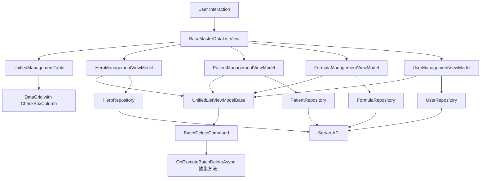

# 管理界面批量删除功能技术设计文档

**版本**: v1.0
**创建日期**: 2025-11-19
**状态**: 设计完成
**相关Issue**: #2150
**需求文档**: [batch-delete-discussion.md](batch-delete-discussion.md)

---

## 📋 元数据

- **Epic**: #2150
- **需求文档**: docs/explanation/architecture/client/batch-delete-discussion.md
- **设计版本**: v1.0
- **架构验证**: ✅ 已通过（2025-11-19）

---

## 🎯 设计目标

基于需求文档的业务目标，技术设计目标如下：

1. **核心目标**：为4个管理界面（药材/患者/验方/用户）添加批量删除功能
2. **用户体验**：checkbox选择 + 批量删除按钮 + 确认对话框 + 结果反馈
3. **架构约束**：
   - 符合Client端MVVM架构（ViewModel → Repository）
   - 不污染DTO数据模型（选中状态在ViewModel管理）
   - WPF原生控件（符合MVP约束，无第三方UI库）
   - 统一交互模式（所有管理界面一致）

---

## 🏗️ 架构设计

### 组件关系图



### 数据流设计

**批量删除完整流程**：

```
1. 用户勾选checkbox
   ↓
2. DataGrid.SelectionChanged事件
   ↓
3. 同步到ViewModel.SelectedItems (ObservableCollection)
   ↓
4. BatchDeleteCommand.CanExecute检查（SelectedItems.Count > 0）
   ↓
5. 用户点击"批量删除"按钮
   ↓
6. 显示确认对话框（显示数量 + "此操作不可恢复"）
   ↓
7. 用户确认
   ↓
8. 调用 OnExecuteBatchDeleteAsync(SelectedItems)
   ↓
9. foreach逐个删除（调用Repository.DeleteAsync）
   ↓
10. 统计成功数/失败数
    ↓
11. 显示结果消息（成功数、失败数、失败项目列表）
    ↓
12. 刷新列表（调用LoadDataAsync）
```

### 层级职责划分

| 层级 | 职责 | 关键文件 |
|-----|------|---------|
| **View层** | XAML定义、ShowCheckBoxColumn绑定 | BaseMasterDataListView.xaml, HerbManagementView.xaml等 |
| **Control层** | DataGrid封装、SelectedItems同步 | UnifiedManagementTable.xaml.cs |
| **ViewModel层** | 批量删除业务逻辑、确认对话框、结果反馈 | HerbManagementViewModel.cs等 |
| **Base层** | BatchDeleteCommand统一实现 | UnifiedListViewModelBase.cs |
| **Repository层** | 单个删除API调用 | HerbRepository.cs等（已有DeleteAsync） |

---

## 🔧 技术实现方案

### 方案1：UnifiedManagementTable添加CheckBox列

**目标**：在DataGrid第一列动态添加CheckBoxColumn

**实现方式**（代码后置动态添加）：

```csharp
// UnifiedManagementTable.xaml.cs
public partial class UnifiedManagementTable : UserControl
{
    // 依赖属性：是否显示checkbox列
    public static readonly DependencyProperty ShowCheckBoxColumnProperty =
        DependencyProperty.Register(
            nameof(ShowCheckBoxColumn),
            typeof(bool),
            typeof(UnifiedManagementTable),
            new PropertyMetadata(false, OnShowCheckBoxColumnChanged));

    public bool ShowCheckBoxColumn
    {
        get => (bool)GetValue(ShowCheckBoxColumnProperty);
        set => SetValue(ShowCheckBoxColumnProperty, value);
    }

    private static void OnShowCheckBoxColumnChanged(
        DependencyObject d, 
        DependencyPropertyChangedEventArgs e)
    {
        var control = (UnifiedManagementTable)d;
        var showCheckBox = (bool)e.NewValue;

        if (showCheckBox)
        {
            control.AddCheckBoxColumn();
        }
        else
        {
            control.RemoveCheckBoxColumn();
        }
    }

    private void AddCheckBoxColumn()
    {
        // 检查是否已添加
        var existingColumn = DataGrid.Columns.FirstOrDefault(
            c => c is DataGridCheckBoxColumn);
        
        if (existingColumn != null)
            return;

        // 创建CheckBox列
        var checkBoxColumn = new DataGridCheckBoxColumn
        {
            Header = "",  // 表头空白，后续添加全选checkbox
            Width = new DataGridLength(40),
            CanUserResize = false,
            CanUserSort = false,
            DisplayIndex = 0  // 第一列
        };

        // 绑定到IsSelected（DataGrid内置属性）
        var binding = new Binding("IsSelected")
        {
            RelativeSource = new RelativeSource(
                RelativeSourceMode.FindAncestor,
                typeof(DataGridRow),
                1),
            Mode = BindingMode.TwoWay,
            UpdateSourceTrigger = UpdateSourceTrigger.PropertyChanged
        };
        checkBoxColumn.Binding = binding;

        // 插入到第一列
        DataGrid.Columns.Insert(0, checkBoxColumn);
    }

    private void RemoveCheckBoxColumn()
    {
        var checkBoxColumn = DataGrid.Columns.FirstOrDefault(
            c => c is DataGridCheckBoxColumn);
        
        if (checkBoxColumn != null)
        {
            DataGrid.Columns.Remove(checkBoxColumn);
        }
    }
}
```

**技术要点**：
- ✅ 动态添加列（根据ShowCheckBoxColumn属性）
- ✅ 绑定到DataGridRow.IsSelected（WPF内置属性，无需修改DTO）
- ✅ DisplayIndex=0确保在第一列
- ✅ 表头空白（后续可添加全选checkbox）

---

### 方案2：SelectedItems同步机制

**目标**：DataGrid选中状态同步到ViewModel.SelectedItems

**实现方式**（事件驱动同步）：

```csharp
// UnifiedManagementTable.xaml.cs
public partial class UnifiedManagementTable : UserControl
{
    // 依赖属性：选中项集合
    public static readonly DependencyProperty SelectedItemsProperty =
        DependencyProperty.Register(
            nameof(SelectedItems),
            typeof(IList),
            typeof(UnifiedManagementTable),
            new FrameworkPropertyMetadata(
                null,
                FrameworkPropertyMetadataOptions.BindsTwoWayByDefault));

    public IList SelectedItems
    {
        get => (IList)GetValue(SelectedItemsProperty);
        set => SetValue(SelectedItemsProperty, value);
    }

    private void DataGrid_SelectionChanged(object sender, SelectionChangedEventArgs e)
    {
        // 同步DataGrid的选中项到ViewModel
        if (SelectedItems != null)
        {
            // 清空现有选中项
            SelectedItems.Clear();
            
            // 添加所有选中项
            foreach (var item in DataGrid.SelectedItems)
            {
                SelectedItems.Add(item);
            }
        }
    }

    private void DataGrid_Loaded(object sender, RoutedEventArgs e)
    {
        // 订阅SelectionChanged事件
        DataGrid.SelectionChanged += DataGrid_SelectionChanged;
    }
}
```

**技术要点**：
- ✅ 双向绑定（FrameworkPropertyMetadataOptions.BindsTwoWayByDefault）
- ✅ SelectionChanged事件同步（DataGrid → ViewModel）
- ✅ IList类型（兼容ObservableCollection<T>）

---

### 方案3：BaseMasterDataListView传递绑定

**目标**：BaseMasterDataListView将SelectedItems传递给UnifiedManagementTable

**实现方式**（依赖属性传递）：

```csharp
// BaseMasterDataListView.xaml.cs
public partial class BaseMasterDataListView : UserControl
{
    public static readonly DependencyProperty SelectedItemsProperty =
        DependencyProperty.Register(
            nameof(SelectedItems),
            typeof(IList),
            typeof(BaseMasterDataListView),
            new FrameworkPropertyMetadata(
                null,
                FrameworkPropertyMetadataOptions.BindsTwoWayByDefault));

    public IList SelectedItems
    {
        get => (IList)GetValue(SelectedItemsProperty);
        set => SetValue(SelectedItemsProperty, value);
    }

    public static readonly DependencyProperty ShowCheckBoxColumnProperty =
        DependencyProperty.Register(
            nameof(ShowCheckBoxColumn),
            typeof(bool),
            typeof(BaseMasterDataListView),
            new PropertyMetadata(false));

    public bool ShowCheckBoxColumn
    {
        get => (bool)GetValue(ShowCheckBoxColumnProperty);
        set => SetValue(ShowCheckBoxColumnProperty, value);
    }
}
```

**XAML绑定**：

```xml
<!-- BaseMasterDataListView.xaml -->
<controls:UnifiedManagementTable
    x:Name="DataTable"
    ItemsSource="{Binding ItemsSource, RelativeSource={RelativeSource AncestorType=UserControl}}"
    SelectedItem="{Binding SelectedItem, RelativeSource={RelativeSource AncestorType=UserControl}, Mode=TwoWay}"
    SelectedItems="{Binding SelectedItems, RelativeSource={RelativeSource AncestorType=UserControl}, Mode=TwoWay}"
    ShowCheckBoxColumn="{Binding ShowCheckBoxColumn, RelativeSource={RelativeSource AncestorType=UserControl}}"
    ... />
```

**技术要点**：
- ✅ 属性透传（BaseMasterDataListView → UnifiedManagementTable）
- ✅ RelativeSource绑定（保持层级清晰）

---

### 方案4：UnifiedListViewModelBase实现BatchDeleteCommand

**目标**：在基类中统一实现批量删除命令和逻辑

**实现方式**（模板方法模式）：

```csharp
// UnifiedListViewModelBase.cs
public abstract class UnifiedListViewModelBase<T> : BindableBase 
    where T : class
{
    #region 属性

    /// <summary>
    /// 选中项集合（批量操作）
    /// </summary>
    private ObservableCollection<T> _selectedItems = new();
    public ObservableCollection<T> SelectedItems
    {
        get => _selectedItems;
        set => SetProperty(ref _selectedItems, value);
    }

    #endregion

    #region 命令

    /// <summary>
    /// 批量删除命令
    /// </summary>
    public DelegateCommand BatchDeleteCommand { get; }

    #endregion

    #region 构造函数

    protected UnifiedListViewModelBase()
    {
        // 初始化批量删除命令
        BatchDeleteCommand = new DelegateCommand(
            async () => await ExecuteBatchDeleteAsync(),
            CanExecuteBatchDelete)
            .ObservesProperty(() => SelectedItems.Count);
    }

    #endregion

    #region 批量删除逻辑

    /// <summary>
    /// 判断是否可以执行批量删除
    /// </summary>
    private bool CanExecuteBatchDelete()
    {
        return SelectedItems != null && SelectedItems.Count > 0;
    }

    /// <summary>
    /// 执行批量删除（模板方法）
    /// </summary>
    private async Task ExecuteBatchDeleteAsync()
    {
        if (SelectedItems == null || SelectedItems.Count == 0)
            return;

        // 1. 确认对话框
        var confirmed = await ShowConfirmationAsync(
            $"确认删除选中的 {SelectedItems.Count} 个项目吗？\n此操作不可恢复。",
            "批量删除确认");

        if (!confirmed)
            return;

        // 2. 复制选中项列表（避免在迭代中修改集合）
        var itemsToDelete = SelectedItems.ToList();

        // 3. 调用子类实现的批量删除逻辑
        await OnExecuteBatchDeleteAsync(itemsToDelete);

        // 4. 清空选中项
        SelectedItems.Clear();

        // 5. 刷新列表
        await LoadDataAsync();
    }

    /// <summary>
    /// 批量删除业务逻辑（子类实现）
    /// </summary>
    /// <param name="items">要删除的项目列表</param>
    protected abstract Task OnExecuteBatchDeleteAsync(List<T> items);

    #endregion

    #region 辅助方法

    /// <summary>
    /// 显示确认对话框（由子类或Infrastructure层实现）
    /// </summary>
    protected abstract Task<bool> ShowConfirmationAsync(string message, string title);

    /// <summary>
    /// 显示成功消息
    /// </summary>
    protected abstract Task ShowSuccessMessageAsync(string message);

    /// <summary>
    /// 显示警告消息
    /// </summary>
    protected abstract Task ShowWarningMessageAsync(string message);

    /// <summary>
    /// 加载数据（由子类实现）
    /// </summary>
    protected abstract Task LoadDataAsync();

    #endregion
}
```

**技术要点**：
- ✅ 模板方法模式（基类定义流程，子类实现细节）
- ✅ ObservesProperty自动刷新CanExecute
- ✅ 防御式编程（复制列表避免迭代修改集合）

---

### 方案5：子类ViewModel实现OnExecuteBatchDeleteAsync

**目标**：各模块ViewModel实现具体的批量删除逻辑

**实现示例**（HerbManagementViewModel）：

```csharp
// HerbManagementViewModel.cs
public class HerbManagementViewModel : UnifiedListViewModelBase<HerbDto>
{
    private readonly IHerbRepository _herbRepository;
    private readonly ILogger<HerbManagementViewModel> _logger;

    public HerbManagementViewModel(
        IHerbRepository herbRepository,
        ILoggerFactory loggerFactory)
    {
        _herbRepository = herbRepository;
        _logger = loggerFactory.CreateLogger<HerbManagementViewModel>();
    }

    /// <summary>
    /// 批量删除药材（实现基类虚方法）
    /// 业务规则：BR-001（权限控制）、BR-004（失败不影响其他）
    /// </summary>
    protected override async Task OnExecuteBatchDeleteAsync(List<HerbDto> items)
    {
        if (items == null || items.Count == 0)
        {
            _logger.LogWarning("OnExecuteBatchDeleteAsync: 药材列表为空");
            return;
        }

        // 统计删除结果
        var successCount = 0;
        var failureCount = 0;
        var failedItems = new List<string>();

        // BR-004: 逐个删除，部分失败不影响其他
        foreach (var item in items)
        {
            try
            {
                // BR-001: 调用Repository.DeleteAsync（已包含权限检查）
                var result = await _herbRepository.DeleteAsync(item.Id);
                
                if (result.IsSuccess)
                {
                    successCount++;
                }
                else
                {
                    failureCount++;
                    failedItems.Add($"{item.Name}（{result.Message}）");
                }
            }
            catch (Exception ex)
            {
                failureCount++;
                failedItems.Add($"{item.Name}（系统错误）");
                _logger.LogError(ex, "删除药材时发生异常: {HerbName}", item.Name);
            }
        }

        // BR-003: 结果反馈
        var message = $"批量删除完成！\n\n" +
                      $"成功：{successCount}个\n" +
                      $"失败：{failureCount}个";

        if (failureCount > 0 && failedItems.Count > 0)
        {
            // 最多显示5个失败项
            var displayedItems = failedItems.Take(5);
            message += $"\n\n失败的项目：\n{string.Join("\n", displayedItems)}";
            
            if (failedItems.Count > 5)
            {
                message += $"\n...等{failedItems.Count}个";
            }
        }

        // 显示结果
        if (failureCount > 0)
        {
            await ShowWarningMessageAsync(message);
        }
        else
        {
            await ShowSuccessMessageAsync(message);
        }
    }
}
```

**技术要点**：
- ✅ 符合业务规则（BR-001/003/004）
- ✅ 异常处理（单个失败不中断流程）
- ✅ 结果统计和反馈
- ✅ 日志记录

**其他模块类似实现**：
- PatientManagementViewModel.OnExecuteBatchDeleteAsync
- FormulaManagementViewModel.OnExecuteBatchDeleteAsync
- UserManagementViewModel.OnExecuteBatchDeleteAsync

---

### 方案6：View层启用ShowCheckBoxColumn

**目标**：各模块View启用checkbox列显示

**实现示例**（HerbManagementView.xaml）：

```xml
<!-- HerbManagementView.xaml -->
<views:BaseMasterDataListView
    ItemsSource="{Binding Items}"
    SelectedItem="{Binding SelectedItem, Mode=TwoWay}"
    SelectedItems="{Binding SelectedItems, Mode=TwoWay}"
    ShowCheckBoxColumn="True"
    SearchText="{Binding SearchText, Mode=TwoWay}"
    ...>
    
    <!-- 定义药材特定的 DataGrid 列 -->
    <views:BaseMasterDataListView.Columns>
        <!-- 药材名称、产地、规格等列 -->
        ...
    </views:BaseMasterDataListView.Columns>

    <!-- 定义操作按钮区域 -->
    <views:BaseMasterDataListView.ActionButtons>
        <StackPanel Orientation="Horizontal">
            <!-- 批量删除按钮 -->
            <Button Content="批量删除"
                    Style="{StaticResource DangerButton}"
                    Command="{Binding BatchDeleteCommand}"
                    ToolTip="删除选中的药材"
                    Margin="{StaticResource SpacingSmall}" />
            
            <!-- 其他按钮 -->
            ...
        </StackPanel>
    </views:BaseMasterDataListView.ActionButtons>
</views:BaseMasterDataListView>
```

**技术要点**：
- ✅ ShowCheckBoxColumn="True"启用checkbox列
- ✅ SelectedItems双向绑定
- ✅ 批量删除按钮使用DangerButton样式（红色）

**其他模块类似配置**：
- PatientManagementView.xaml
- FormulaManagementView.xaml
- UserManagementView.xaml

---

## 📋 Phase拆分

### Phase 1：基础架构和控件层（预计1-2天）

**任务清单**：
- [ ] UnifiedManagementTable添加ShowCheckBoxColumn依赖属性
- [ ] UnifiedManagementTable实现AddCheckBoxColumn动态添加逻辑
- [ ] UnifiedManagementTable添加SelectedItems依赖属性
- [ ] UnifiedManagementTable实现SelectionChanged同步逻辑
- [ ] BaseMasterDataListView添加SelectedItems和ShowCheckBoxColumn属性
- [ ] BaseMasterDataListView.xaml绑定到UnifiedManagementTable
- [ ] 编写单元测试（checkbox列添加/移除、SelectedItems同步）

**验收标准**：
- ✅ 编译通过：0 errors, 0 warnings
- ✅ ShowCheckBoxColumn="True"时第一列显示checkbox
- ✅ checkbox勾选状态同步到SelectedItems
- ✅ 单元测试通过

---

### Phase 2：ViewModel基类实现（预计1-2天）

**任务清单**：
- [ ] UnifiedListViewModelBase添加SelectedItems属性
- [ ] UnifiedListViewModelBase实现BatchDeleteCommand
- [ ] UnifiedListViewModelBase实现ExecuteBatchDeleteAsync模板方法
- [ ] UnifiedListViewModelBase定义OnExecuteBatchDeleteAsync抽象方法
- [ ] 更新BaseManagementViewModel继承（如需要）
- [ ] 编写单元测试（BatchDeleteCommand、CanExecute逻辑）

**验收标准**：
- ✅ 编译通过：0 errors, 0 warnings
- ✅ BatchDeleteCommand正确实现
- ✅ CanExecute检查SelectedItems.Count > 0
- ✅ 单元测试通过

---

### Phase 3：各模块实现和UI集成（预计2-3天）

**任务清单**：
- [ ] HerbManagementViewModel实现OnExecuteBatchDeleteAsync
- [ ] HerbManagementView.xaml启用ShowCheckBoxColumn
- [ ] HerbManagementView.xaml添加批量删除按钮
- [ ] PatientManagementViewModel实现OnExecuteBatchDeleteAsync
- [ ] PatientManagementView.xaml启用ShowCheckBoxColumn
- [ ] PatientManagementView.xaml添加批量删除按钮
- [ ] FormulaManagementViewModel实现OnExecuteBatchDeleteAsync
- [ ] FormulaManagementView.xaml启用ShowCheckBoxColumn
- [ ] FormulaManagementView.xaml添加批量删除按钮
- [ ] UserManagementViewModel实现OnExecuteBatchDeleteAsync
- [ ] UserManagementView.xaml启用ShowCheckBoxColumn
- [ ] UserManagementView.xaml添加批量删除按钮
- [ ] 集成测试（4个模块批量删除功能）

**验收标准**：
- ✅ 编译通过：0 errors, 0 warnings
- ✅ 4个模块批量删除功能正常
- ✅ 确认对话框显示正确
- ✅ 结果反馈显示正确（成功数/失败数/失败项目）
- ✅ 集成测试通过

---

### Phase 4：用户体验优化和测试（预计1天）

**任务清单**：
- [ ] 添加全选功能（表头checkbox）
- [ ] 添加键盘快捷键支持（Ctrl+A全选）
- [ ] 优化确认对话框样式
- [ ] 优化结果提示样式
- [ ] 端到端功能测试（批量删除完整流程）
- [ ] 更新用户文档

**验收标准**：
- ✅ 全选功能正常
- ✅ Ctrl+A全选正常
- ✅ UI样式符合设计规范
- ✅ E2E测试通过
- ✅ 文档更新完成

---

## ✅ 质量标准

### 编译要求
- **标准**：0 errors, 0 warnings
- **工具**：`dotnet build LYBT.Desktop.sln -c Release --no-restore`

### 测试要求
- **单元测试覆盖率**：
  - UnifiedManagementTable checkbox逻辑：≥80%
  - UnifiedListViewModelBase批量删除命令：≥80%
  - 各模块OnExecuteBatchDeleteAsync：≥70%
- **集成测试**：4个模块批量删除功能必须有集成测试
- **E2E测试**：批量删除完整流程必须有E2E测试

### 性能要求
- **checkbox选择响应时间**：< 100ms
- **批量删除100项**：< 10s
- **UI不阻塞**：删除过程中UI保持响应

### 文档要求
- **架构文档**：更新`docs/explanation/architecture/client/README.md`中的批量操作说明
- **操作指南**：更新各模块的操作指南文档
- **代码注释**：关键方法必须有XML注释

---

## 📚 参考资料

- **需求文档**: docs/explanation/architecture/client/batch-delete-discussion.md
- **架构指南**: docs/explanation/architecture/client/README.md
- **业务规则**: docs/explanation/business-rules.md
- **WPF DataGrid官方文档**: https://learn.microsoft.com/en-us/dotnet/desktop/wpf/controls/datagrid
- **Prism框架指南**: docs/reference/prism-framework-guide.md

---

## 🔄 后续步骤

1. **任务分解**：使用lybtzyzs-task-breakdown生成任务清单
2. **Issue创建**：使用lybtzyzs-issue-template批量创建GitHub Issues
3. **实施跟踪**：按照Phase顺序实施，Issue-Driven开发

---

---

## ✅ 架构合规性验证

### 验证信息
- **验证时间**: 2025-11-19
- **验证方法**: lybtzyzs-design-arch-validator Skill
- **需求文档**: [batch-delete-discussion.md](batch-delete-discussion.md)
- **架构参考**: [Client端架构指南](README.md)
- **业务规则**: [核心业务规则](../../business-rules.md)

### 验证结果摘要

✅ **架构合规性验证通过**

- 合规项：6项
- 违规项：0项
- 警告项：0项

---

### Client端架构分层验证

#### ✅ MVVM架构符合性

**验证标准**：Client端Phase 2/4架构（ViewModel → Repository）

**设计分层**：
```
View层 (BaseMasterDataListView)
  ↓
Control层 (UnifiedManagementTable)
  ↓
ViewModel层 (HerbManagementViewModel等)
  ↓
Base层 (UnifiedListViewModelBase)
  ↓
Repository层 (HerbRepository.DeleteAsync)
```

**验证结论**：
- ✅ ViewModel直接调用Repository（无Service层）
- ✅ 符合Client端Phase 2/4架构
- ✅ 层级职责清晰，边界分明

---

### 业务规则应用验证

#### ✅ BR-001: 批量删除权限控制

**规则**：只能删除当前用户有权限删除的数据

**实现位置**：方案5 - OnExecuteBatchDeleteAsync
```csharp
// BR-001: 调用Repository.DeleteAsync（已包含权限检查）
var result = await _herbRepository.DeleteAsync(item.Id);
```

**验证结论**：✅ 正确应用，通过Repository层已有的权限检查

---

#### ✅ BR-002: 删除确认

**规则**：批量删除前必须显示确认对话框

**实现位置**：方案4 - ExecuteBatchDeleteAsync
```csharp
var confirmed = await ShowConfirmationAsync(
    $"确认删除选中的 {SelectedItems.Count} 个项目吗？\n此操作不可恢复。",
    "批量删除确认");
```

**验证结论**：✅ 正确应用，确认对话框显示数量和警告信息

---

#### ✅ BR-003: 结果反馈

**规则**：删除后必须显示操作结果（成功数/失败数）

**实现位置**：方案5 - OnExecuteBatchDeleteAsync
```csharp
// BR-003: 结果反馈
var message = $"批量删除完成！\n\n" +
              $"成功：{successCount}个\n" +
              $"失败：{failureCount}个";
```

**验证结论**：✅ 正确应用，统计成功/失败数量并显示失败项目列表

---

#### ✅ BR-004: 失败处理

**规则**：部分删除失败时，不影响其他项的删除

**实现位置**：方案5 - OnExecuteBatchDeleteAsync
```csharp
// BR-004: 逐个删除，部分失败不影响其他
foreach (var item in items)
{
    try { ... } catch { ... }  // 单个异常不中断流程
}
```

**验证结论**：✅ 正确应用，使用foreach逐个删除，异常处理合理

---

#### ✅ BR-005: 空选择处理

**规则**：未选择任何项时，批量删除按钮禁用

**实现位置**：方案4 - CanExecuteBatchDelete
```csharp
private bool CanExecuteBatchDelete()
{
    return SelectedItems != null && SelectedItems.Count > 0;
}
```

**验证结论**：✅ 正确应用，CanExecute检查选中项数量

---

### MVP原则验证

#### ✅ WPF原生控件使用

**约束**：只使用WPF原生控件，不引入第三方UI库

**使用的控件/技术**：
- DataGridCheckBoxColumn（WPF原生）
- DataGrid.SelectionChanged（WPF事件）
- DataGridRow.IsSelected（WPF属性）
- DependencyProperty（WPF标准）
- Prism DelegateCommand（标准MVVM框架）
- ObservableCollection（.NET标准）

**验证结论**：✅ 所有技术实现都使用WPF原生控件和标准MVVM模式，符合MVP约束

---

### 设计模式验证

#### ✅ 模板方法模式

**应用位置**：UnifiedListViewModelBase.ExecuteBatchDeleteAsync

**模式结构**：
- 模板方法：ExecuteBatchDeleteAsync（定义流程：确认 → 执行 → 清空 → 刷新）
- 抽象方法：OnExecuteBatchDeleteAsync（子类实现具体删除逻辑）

**验证结论**：✅ 模板方法模式应用正确，符合"基类定义流程，子类实现细节"原则

---

### Phase拆分合理性验证

#### ✅ Phase划分

**Phase 1**: 基础架构和控件层（UnifiedManagementTable、BaseMasterDataListView）
**Phase 2**: ViewModel基类实现（UnifiedListViewModelBase）
**Phase 3**: 各模块实现和UI集成（4个模块）
**Phase 4**: 用户体验优化和测试（全选、快捷键）

**验证结论**：✅ Phase划分合理，遵循"基础层 → 业务层 → UI层"的实施顺序

---

### 架构文档引用验证

#### ✅ 需求文档引用

**引用位置**：
- 设计目标 → 架构约束（来自需求文档"技术实现约束"章节）
- 参考资料 → batch-delete-discussion.md

**验证结论**：✅ 正确引用需求文档，架构约束与需求文档一致

---

#### ✅ 架构文档引用

**引用位置**：
- 参考资料 → docs/explanation/architecture/client/README.md
- 参考资料 → docs/explanation/business-rules.md

**验证结论**：✅ 正确引用Client端架构指南和业务规则文档

---

### 验证总结

#### 合规项（6项）

1. ✅ Client端MVVM架构（ViewModel → Repository，无Service层）
2. ✅ 业务规则BR-001到BR-005全部正确引用和实现
3. ✅ MVP原则（WPF原生控件，无第三方UI库）
4. ✅ 模板方法模式应用正确
5. ✅ 需求文档架构约束已体现在设计中
6. ✅ Phase拆分合理（基础层→业务层→UI层）

#### 违规项（0项）

无违规项。

#### 验证结论

✅ **设计文档架构合规性验证通过**

所有设计符合LYBTZYZS项目Client端v2.0架构标准，可以进入任务分解和实施阶段。

---

**维护者**：Claude Code
**创建时间**：2025-11-19
**验证时间**：2025-11-19
