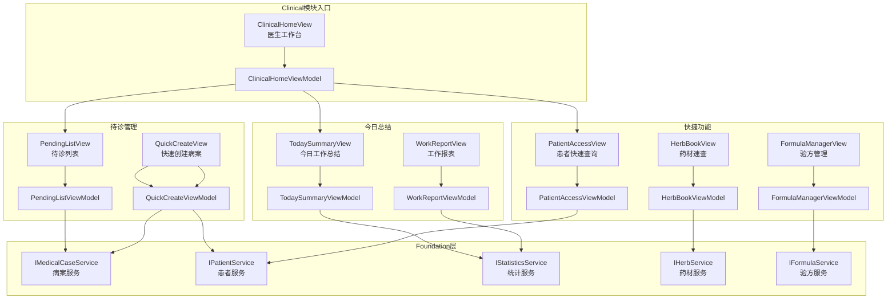

# Client端医生工作台模块架构设计

> **文档类型**: Explanation（架构设计）
> **目标读者**: 架构师、前端开发工程师
> **最后更新**: 2025-10-30
> **关联文档**: [病案管理架构](medical-case-design.md) | [角色路由规则](../../../explanation/business-rules.md#ac-002-角色路由规则)

---

## 📋 文档概览

本文档详细阐述凌隐宝堂中医诊所诊疗系统（LYBTZYZS）Client端医生（Clinical）角色工作台模块的架构设计，包括医生主界面、待诊列表、快速创建病案、今日工作总结等核心实现方案。

**核心特性**：
- ✅ **MVVM架构**：完全分离View与业务逻辑
- ✅ **角色路由**：基于AC-002规则的角色驱动导航
- ✅ **待诊管理**：实时更新的待诊患者列表
- ✅ **快速创建**：一键创建新病案并进入诊疗流程
- ✅ **工作总结**：今日诊疗数据统计和展示
- ✅ **快捷入口**：常用功能的快速访问导航

---

## 1. 架构概览

### 1.1 Clinical模块功能全景图



### 1.2 模块分层结构

```
LYBT.Desktop.Clinical/                # 医生工作台模块（Client端）
├── ViewModels/
│   ├── ClinicalHomeViewModel.cs      # 医生工作台ViewModel
│   │   ├── 属性（9个）
│   │   │   ├── PendingMedicalCases    # 待诊病案列表
│   │   │   ├── SelectedMedicalCase    # 选中的病案
│   │   │   ├── TodayPatientCount      # 今日患者数
│   │   │   ├── TodayMedicalCaseCount  # 今日病案数
│   │   │   ├── TodayRevenue           # 今日收入
│   │   │   ├── QuickSearchText        # 快速搜索关键字
│   │   │   ├── QuickCreateCommand     # 快速创建病案命令
│   │   │   ├── OpenMedicalCaseCommand # 打开病案命令
│   │   │   └── RefreshCommand         # 刷新命令
│   │   └── 方法（8个）
│   │       ├── 构造函数                # 初始化依赖、加载待诊列表
│   │       ├── LoadPendingListAsync   # 加载待诊列表
│   │       ├── LoadTodaySummaryAsync  # 加载今日总结
│   │       ├── ExecuteQuickCreateAsync # 快速创建病案
│   │       ├── ExecuteOpenMedicalCaseAsync # 打开选中病案
│   │       ├── QuickSearchPatientAsync # 快速搜索患者
│   │       ├── ExecuteRefreshAsync    # 刷新数据
│   │       └── SubscribeEvents        # 订阅事件
│   │
│   ├── PendingListViewModel.cs       # 待诊列表ViewModel
│   │   ├── 属性（6个）
│   │   │   ├── PendingItems           # 待诊项列表
│   │   │   ├── SelectedItem           # 选中的待诊项
│   │   │   ├── FilterStatus           # 状态筛选
│   │   │   ├── SortBy                 # 排序方式
│   │   │   ├── OpenCommand            # 打开病案命令
│   │   │   └── CancelCommand          # 取消病案命令
│   │   └── 方法（6个）
│   │       ├── 构造函数                # 初始化依赖
│   │       ├── LoadPendingItemsAsync  # 加载待诊列表
│   │       ├── FilterByStatusAsync    # 按状态筛选
│   │       ├── SortItemsAsync         # 排序列表
│   │       ├── ExecuteOpenAsync       # 打开病案
│   │       └── ExecuteCancelAsync     # 取消病案
│   │
│   ├── QuickCreateViewModel.cs       # 快速创建ViewModel
│   │   ├── 属性（6个）
│   │   │   ├── PatientSearchText      # 患者搜索关键字
│   │   │   ├── Patients               # 患者列表
│   │   │   ├── SelectedPatient        # 选中的患者
│   │   │   ├── ChiefComplaint         # 主诉
│   │   │   ├── CreateCommand          # 创建命令
│   │   │   └── CancelCommand          # 取消命令
│   │   └── 方法（5个）
│   │       ├── 构造函数                # 初始化依赖
│   │       ├── SearchPatientsAsync    # 搜索患者
│   │       ├── SelectPatientAsync     # 选择患者
│   │       ├── ExecuteCreateAsync     # 创建病案并导航
│   │       └── ExecuteCancelAsync     # 取消创建
│   │
│   └── TodaySummaryViewModel.cs      # 今日总结ViewModel
│       ├── 属性（7个）
│       │   ├── TodayPatientCount      # 今日患者数
│       │   ├── TodayMedicalCaseCount  # 今日病案数
│       │   ├── CompletedCount         # 已完成数
│       │   ├── PendingCount           # 待诊数
│       │   ├── TodayRevenue           # 今日收入
│       │   ├── ChartData              # 图表数据
│       │   └── ExportReportCommand    # 导出报表命令
│       └── 方法（4个）
│           ├── 构造函数                # 初始化依赖
│           ├── LoadSummaryDataAsync   # 加载总结数据
│           ├── RefreshChartDataAsync  # 刷新图表数据
│           └── ExecuteExportReportAsync # 导出报表
│
├── Views/
│   ├── ClinicalHomeView.xaml         # 医生工作台主界面
│   ├── ClinicalHomeView.xaml.cs      # ClinicalHomeView代码后置
│   ├── PendingListView.xaml          # 待诊列表（DataGrid）
│   ├── PendingListView.xaml.cs       # PendingListView代码后置
│   ├── QuickCreateView.xaml          # 快速创建病案对话框
│   ├── QuickCreateView.xaml.cs       # QuickCreateView代码后置
│   ├── TodaySummaryView.xaml         # 今日总结（Card布局）
│   └── TodaySummaryView.xaml.cs      # TodaySummaryView代码后置
│
└── ClinicalModule.cs                 # Prism模块定义
    ├── OnInitialized()               # 模块初始化
    └── RegisterTypes()               # 注册Views和ViewModels
```

**依赖的Foundation层服务**：

```
LYBT.Desktop.Foundation/Services/    # 基础设施服务（Infrastructure Service）
├── IMedicalCaseService               # 病案管理服务接口
│   ├── GetPendingMedicalCasesAsync() # 获取待诊病案列表
│   ├── CreateMedicalCaseAsync()      # 创建病案
│   ├── GetByIdAsync()                # 获取病案详情
│   ├── UpdateStatusAsync()           # 更新病案状态
│   └── CancelMedicalCaseAsync()      # 取消病案
│
├── IPatientService                   # 患者管理服务
│   ├── SearchPatientsAsync()         # 搜索患者
│   ├── GetByIdAsync()                # 获取患者详情
│   └── QuickSearchAsync()            # 快速搜索（姓名/手机号）
│
├── IStatisticsService                # 统计服务
│   ├── GetDoctorTodayStatisticsAsync() # 获取医生今日统计
│   ├── GetDoctorWorkReportAsync()    # 获取医生工作报表
│   └── ExportDoctorReportAsync()     # 导出医生报表
│
├── IHerbService                      # 药材服务
│   ├── SearchHerbsAsync()            # 搜索药材
│   └── GetFrequentlyUsedAsync()      # 获取常用药材
│
└── IFormulaService                   # 验方服务
    ├── GetMyFormulasAsync()          # 获取我的验方
    └── GetFrequentlyUsedAsync()      # 获取常用验方
```

---

## 2. ClinicalHomeViewModel设计

### 2.1 完整接口表

| 成员类型 | 名称 | 功能描述 | 访问级别 |
|---------|------|---------|---------|
| **绑定属性（8个）** | | | |
| Property | `PendingMedicalCases` | 待诊病案列表（DataGrid绑定） | public |
| Property | `SelectedMedicalCase` | 选中的病案 | public |
| Property | `TodayPatientCount` | 今日患者数（实时更新） | public |
| Property | `TodayMedicalCaseCount` | 今日病案数 | public |
| Property | `TodayRevenue` | 今日收入 | public |
| Property | `QuickSearchText` | 快速搜索关键字 | public |
| Property | `QuickCreateCommand` | 快速创建病案命令 | public |
| Property | `OpenMedicalCaseCommand` | 打开病案命令 | public |
| **命令（1个）** | | | |
| Command | `RefreshCommand` | 刷新数据命令 | public |
| **方法（8个）** | | | |
| Method | `构造函数` | 初始化依赖、加载待诊列表 | public |
| Method | `LoadPendingListAsync` | 加载待诊病案列表 | private |
| Method | `LoadTodaySummaryAsync` | 加载今日工作总结 | private |
| Method | `ExecuteQuickCreateAsync` | 快速创建病案 | private |
| Method | `ExecuteOpenMedicalCaseAsync` | 打开选中病案 | private |
| Method | `QuickSearchPatientAsync` | 快速搜索患者 | private |
| Method | `ExecuteRefreshAsync` | 刷新数据 | private |
| Method | `SubscribeEvents` | 订阅事件（MedicalCaseCreated等） | private |

### 2.2 核心属性设计

#### 2.2.1 PendingMedicalCases和SelectedMedicalCase属性

```csharp
public class ClinicalHomeViewModel : UnifiedViewModelBase
{
    private ObservableCollection<MedicalCaseDto> _pendingMedicalCases = new();
    private MedicalCaseDto? _selectedMedicalCase;

    /// <summary>
    /// 待诊病案列表（DataGrid绑定）
    /// 实时更新，按创建时间倒序排列
    /// </summary>
    public ObservableCollection<MedicalCaseDto> PendingMedicalCases
    {
        get => _pendingMedicalCases;
        set => SetProperty(ref _pendingMedicalCases, value);
    }

    /// <summary>
    /// 选中的病案（SelectedItem绑定）
    /// 变化时触发OpenMedicalCaseCommand重新评估
    /// </summary>
    public MedicalCaseDto? SelectedMedicalCase
    {
        get => _selectedMedicalCase;
        set
        {
            SetProperty(ref _selectedMedicalCase, value);
            (OpenMedicalCaseCommand as DelegateCommand)?.RaiseCanExecuteChanged();
        }
    }
}
```

**设计说明**：
- ✅ **ObservableCollection**：自动通知UI更新
- ✅ **倒序排列**：最新创建的病案排在最前
- ✅ **SelectedItem绑定**：双击或点击按钮打开病案

#### 2.2.2 今日统计属性

```csharp
private int _todayPatientCount;
private int _todayMedicalCaseCount;
private decimal _todayRevenue;

/// <summary>
/// 今日患者数（去重统计）
/// </summary>
public int TodayPatientCount
{
    get => _todayPatientCount;
    set => SetProperty(ref _todayPatientCount, value);
}

/// <summary>
/// 今日病案数（包含已完成和进行中）
/// </summary>
public int TodayMedicalCaseCount
{
    get => _todayMedicalCaseCount;
    set => SetProperty(ref _todayMedicalCaseCount, value);
}

/// <summary>
/// 今日收入（已完成病案的处方总价）
/// </summary>
public decimal TodayRevenue
{
    get => _todayRevenue;
    set => SetProperty(ref _todayRevenue, value);
}
```

**设计说明**：
- ✅ **实时统计**：每次刷新时重新计算
- ✅ **医生维度**：仅统计当前登录医生的数据（AC-001规则）
- ✅ **收入计算**：基于CR-001规则计算处方总价

### 2.3 核心方法设计

#### 2.3.1 构造函数和依赖注入

```csharp
public class ClinicalHomeViewModel : UnifiedViewModelBase
{
    private readonly IMedicalCaseService _medicalCaseService;
    private readonly IPatientService _patientService;
    private readonly IStatisticsService _statisticsService;
    private readonly IRegionManager _regionManager;
    private readonly IEventAggregator _eventAggregator;

    public ClinicalHomeViewModel(
        IMedicalCaseService medicalCaseService,
        IPatientService patientService,
        IStatisticsService statisticsService,
        IRegionManager regionManager,
        IEventAggregator eventAggregator)
    {
        _medicalCaseService = medicalCaseService ?? throw new ArgumentNullException(nameof(medicalCaseService));
        _patientService = patientService ?? throw new ArgumentNullException(nameof(patientService));
        _statisticsService = statisticsService ?? throw new ArgumentNullException(nameof(statisticsService));
        _regionManager = regionManager ?? throw new ArgumentNullException(nameof(regionManager));
        _eventAggregator = eventAggregator ?? throw new ArgumentNullException(nameof(eventAggregator));

        // 注册命令
        QuickCreateCommand = new DelegateCommand(async () => await ExecuteQuickCreateAsync());
        OpenMedicalCaseCommand = new DelegateCommand(
            async () => await ExecuteOpenMedicalCaseAsync(),
            () => SelectedMedicalCase != null
        );
        RefreshCommand = new DelegateCommand(async () => await ExecuteRefreshAsync());

        // 订阅事件
        SubscribeEvents();

        // 加载初始数据
        _ = Task.Run(async () =>
        {
            await LoadPendingListAsync();
            await LoadTodaySummaryAsync();
        });
    }
}
```

**设计说明**：
- ✅ **5个依赖注入**：MedicalCase/Patient/Statistics服务 + RegionManager + EventAggregator
- ✅ **Null检查**：所有依赖必须非空
- ✅ **命令注册**：OpenMedicalCaseCommand有CanExecute条件
- ✅ **事件订阅**：监听MedicalCaseCreated、MedicalCaseCompleted事件
- ✅ **异步加载**：Task.Run避免阻塞UI线程

#### 2.3.2 LoadPendingListAsync方法

```csharp
/// <summary>
/// 加载待诊病案列表
/// 实现AC-001规则：医生只能查看自己的病案
/// </summary>
private async Task LoadPendingListAsync()
{
    try
    {
        SetLoading(true);

        var currentUserId = SessionManager?.CurrentUser?.Id ?? Guid.Empty;
        if (currentUserId == Guid.Empty)
        {
            Logger.Warn("当前用户未登录，无法加载待诊列表");
            return;
        }

        // 调用IMedicalCaseService获取待诊列表
        // AC-001: 仅查询当前医生的病案
        var pendingCases = await _medicalCaseService.GetPendingMedicalCasesAsync(currentUserId);

        // 按创建时间倒序排列
        var sortedCases = pendingCases.OrderByDescending(c => c.CreatedAt).ToList();

        // 更新UI绑定的集合
        PendingMedicalCases = new ObservableCollection<MedicalCaseDto>(sortedCases);

        Logger.Info($"成功加载 {PendingMedicalCases.Count} 个待诊病案");
    }
    catch (Exception ex)
    {
        Logger.Error(ex, "加载待诊列表失败");
        MessageBoxHelper.ShowError("加载待诊列表失败，请检查网络连接");
    }
    finally
    {
        SetLoading(false);
    }
}
```

**设计说明**：
- ✅ **AC-001规则**：仅查询当前医生的病案（GetPendingMedicalCasesAsync传入userId）
- ✅ **倒序排列**：最新创建的病案在最前
- ✅ **异常处理**：捕获异常并显示友好错误消息

#### 2.3.3 ExecuteQuickCreateAsync方法

```csharp
/// <summary>
/// 快速创建病案
/// 打开QuickCreateDialog选择患者并创建病案
/// </summary>
private async Task ExecuteQuickCreateAsync()
{
    try
    {
        // 打开快速创建对话框
        var dialog = new QuickCreateDialog();
        var dialogResult = dialog.ShowDialog();

        if (dialogResult == true)
        {
            var selectedPatient = dialog.SelectedPatient;
            var chiefComplaint = dialog.ChiefComplaint;

            // 创建病案DTO
            var createDto = new MedicalCaseCreateDto
            {
                PatientId = selectedPatient.Id,
                PatientName = selectedPatient.Name,
                DoctorId = SessionManager?.CurrentUser?.Id ?? Guid.Empty,
                DoctorName = SessionManager?.CurrentUser?.RealName ?? "未知医生",
                ChiefComplaint = chiefComplaint,
                Status = MedicalCaseStatus.Active
            };

            // 调用API创建病案
            var createdCase = await _medicalCaseService.CreateMedicalCaseAsync(createDto);

            // 导航到病案详情页（进入诊疗流程）
            var parameters = new NavigationParameters
            {
                { "MedicalCaseId", createdCase.Id }
            };
            _regionManager.RequestNavigate("MainRegion", "MedicalCaseFlowView", parameters);

            Logger.Info($"快速创建病案成功: {createdCase.Id}");
        }
    }
    catch (Exception ex)
    {
        Logger.Error(ex, "快速创建病案失败");
        MessageBoxHelper.ShowError("创建病案失败，请稍后重试");
    }
}
```

**设计说明**：
- ✅ **对话框模式**：QuickCreateDialog选择患者和输入主诉
- ✅ **自动填充**：DoctorId和DoctorName从SessionManager获取
- ✅ **导航集成**：创建成功后自动导航到MedicalCaseFlowView

---

## 3. 角色路由集成

### 3.1 AC-002规则实现

**业务规则引用**：
```
AC-002: 角色路由规则
- 医生角色（Doctor）：登录后导航到 ClinicalHomeView
- 管理员角色（Admin）：登录后导航到 AdminHomeView
```

### 3.2 RoleNavigationService实现

```csharp
public class RoleNavigationService : IRoleNavigationService
{
    private readonly IRegionManager _regionManager;

    public RoleNavigationService(IRegionManager regionManager)
    {
        _regionManager = regionManager ?? throw new ArgumentNullException(nameof(regionManager));
    }

    /// <summary>
    /// 基于用户角色导航到对应主界面
    /// </summary>
    public void NavigateByRole(UserDto user)
    {
        if (user == null)
            throw new ArgumentNullException(nameof(user));

        string targetView = user.Role switch
        {
            UserRole.Doctor => "ClinicalHomeView",  // 医生 → ClinicalHomeView
            UserRole.Admin => "AdminHomeView",      // 管理员 → AdminHomeView
            _ => throw new InvalidOperationException($"未知角色: {user.Role}")
        };

        _regionManager.RequestNavigate("MainRegion", targetView);
    }
}
```

**设计说明**：
- ✅ **规则遵循**：严格按照AC-002规则实现
- ✅ **类型安全**：使用UserRole枚举而非字符串
- ✅ **异常安全**：未知角色抛出异常

---

## 4. 待诊列表设计

### 4.1 MedicalCaseDto结构

```csharp
public class MedicalCaseDto
{
    public Guid Id { get; set; }
    public string CaseNumber { get; set; } = string.Empty;
    public Guid PatientId { get; set; }
    public string PatientName { get; set; } = string.Empty;
    public string PatientPhone { get; set; } = string.Empty;
    public Guid DoctorId { get; set; }
    public string DoctorName { get; set; } = string.Empty;
    public string ChiefComplaint { get; set; } = string.Empty;
    public MedicalCaseStatus Status { get; set; }
    public DateTime CreatedAt { get; set; }
    public DateTime? UpdatedAt { get; set; }
}
```

### 4.2 状态筛选

```csharp
public enum MedicalCaseStatus
{
    Active,      // 进行中（待诊）
    Closed       // 已完成
}

// 筛选逻辑
private async Task FilterByStatusAsync(MedicalCaseStatus? status)
{
    var allCases = await _medicalCaseService.GetPendingMedicalCasesAsync(SessionManager.CurrentUser.Id);

    if (status.HasValue)
    {
        allCases = allCases.Where(c => c.Status == status.Value).ToList();
    }

    PendingMedicalCases = new ObservableCollection<MedicalCaseDto>(allCases.OrderByDescending(c => c.CreatedAt));
}
```

---

## 5. 今日工作总结设计

### 5.1 统计数据计算

```csharp
private async Task LoadTodaySummaryAsync()
{
    try
    {
        var currentUserId = SessionManager?.CurrentUser?.Id ?? Guid.Empty;
        var today = DateTime.Today;

        // 调用IStatisticsService获取今日统计
        var summary = await _statisticsService.GetDoctorTodayStatisticsAsync(currentUserId, today);

        // 更新属性
        TodayPatientCount = summary.PatientCount;
        TodayMedicalCaseCount = summary.MedicalCaseCount;
        TodayRevenue = summary.TotalRevenue;

        Logger.Info($"今日工作总结: 患者{TodayPatientCount}人, 病案{TodayMedicalCaseCount}个, 收入{TodayRevenue:C}");
    }
    catch (Exception ex)
    {
        Logger.Error(ex, "加载今日总结失败");
    }
}
```

### 5.2 DoctorTodayStatisticsDto结构

```csharp
public class DoctorTodayStatisticsDto
{
    public int PatientCount { get; set; }           // 今日患者数（去重）
    public int MedicalCaseCount { get; set; }       // 今日病案数
    public int CompletedCount { get; set; }         // 已完成数
    public int PendingCount { get; set; }           // 待诊数
    public decimal TotalRevenue { get; set; }       // 今日收入
}
```

---

## 6. 事件驱动更新

### 6.1 订阅事件

```csharp
private void SubscribeEvents()
{
    // 订阅病案创建事件（其他模块创建病案时通知）
    _eventAggregator.GetEvent<MedicalCaseCreatedEvent>().Subscribe(OnMedicalCaseCreated);

    // 订阅病案完成事件（病案从Active→Closed）
    _eventAggregator.GetEvent<MedicalCaseCompletedEvent>().Subscribe(OnMedicalCaseCompleted);

    // 订阅病案取消事件
    _eventAggregator.GetEvent<MedicalCaseCanceledEvent>().Subscribe(OnMedicalCaseCanceled);
}
```

### 6.2 事件处理

```csharp
private async void OnMedicalCaseCreated(MedicalCaseDto createdCase)
{
    // 如果是当前医生的病案，添加到待诊列表
    if (createdCase.DoctorId == SessionManager?.CurrentUser?.Id)
    {
        PendingMedicalCases.Insert(0, createdCase);
        TodayMedicalCaseCount++;

        Logger.Info($"新增待诊病案: {createdCase.PatientName}");
    }
}

private async void OnMedicalCaseCompleted(Guid medicalCaseId)
{
    // 从待诊列表移除已完成病案
    var completedCase = PendingMedicalCases.FirstOrDefault(c => c.Id == medicalCaseId);
    if (completedCase != null)
    {
        PendingMedicalCases.Remove(completedCase);

        // 刷新今日总结（收入可能变化）
        await LoadTodaySummaryAsync();

        Logger.Info($"病案已完成: {completedCase.PatientName}");
    }
}

private async void OnMedicalCaseCanceled(Guid medicalCaseId)
{
    // 从待诊列表移除取消的病案
    var canceledCase = PendingMedicalCases.FirstOrDefault(c => c.Id == medicalCaseId);
    if (canceledCase != null)
    {
        PendingMedicalCases.Remove(canceledCase);
        TodayMedicalCaseCount--;

        Logger.Info($"病案已取消: {canceledCase.PatientName}");
    }
}
```

**设计说明**：
- ✅ **实时更新**：无需手动刷新，事件自动触发UI更新
- ✅ **权限过滤**：仅处理当前医生的病案
- ✅ **统计同步**：完成病案时同步刷新收入统计

---

## 7. UI设计规范

### 7.1 ClinicalHomeView布局

```xml
<UserControl x:Class="LYBT.Desktop.Clinical.Views.ClinicalHomeView">
    <Grid>
        <Grid.RowDefinitions>
            <RowDefinition Height="Auto"/>  <!-- 今日总结卡片 -->
            <RowDefinition Height="Auto"/>  <!-- 快捷功能栏 -->
            <RowDefinition Height="*"/>     <!-- 待诊列表 -->
        </Grid.RowDefinitions>

        <!-- 今日总结卡片 -->
        <StackPanel Grid.Row="0" Orientation="Horizontal" Margin="20,10">
            <Border Style="{StaticResource StatCard}">
                <StackPanel>
                    <TextBlock Text="今日患者" Style="{StaticResource StatLabel}"/>
                    <TextBlock Text="{Binding TodayPatientCount}" Style="{StaticResource StatValue}"/>
                </StackPanel>
            </Border>
            <Border Style="{StaticResource StatCard}">
                <StackPanel>
                    <TextBlock Text="今日病案" Style="{StaticResource StatLabel}"/>
                    <TextBlock Text="{Binding TodayMedicalCaseCount}" Style="{StaticResource StatValue}"/>
                </StackPanel>
            </Border>
            <Border Style="{StaticResource StatCard}">
                <StackPanel>
                    <TextBlock Text="今日收入" Style="{StaticResource StatLabel}"/>
                    <TextBlock Text="{Binding TodayRevenue, StringFormat=C}" Style="{StaticResource StatValue}"/>
                </StackPanel>
            </Border>
        </StackPanel>

        <!-- 快捷功能栏 -->
        <StackPanel Grid.Row="1" Orientation="Horizontal" Margin="20,10">
            <Button Content="快速创建病案" Command="{Binding QuickCreateCommand}" Style="{StaticResource PrimaryButton}"/>
            <Button Content="刷新" Command="{Binding RefreshCommand}" Style="{StaticResource SecondaryButton}"/>
            <TextBox PlaceholderText="快速搜索患者..." Text="{Binding QuickSearchText, UpdateSourceTrigger=PropertyChanged}" Width="200"/>
        </StackPanel>

        <!-- 待诊列表 -->
        <DataGrid Grid.Row="2" ItemsSource="{Binding PendingMedicalCases}" SelectedItem="{Binding SelectedMedicalCase}">
            <DataGrid.Columns>
                <DataGridTextColumn Header="病案号" Binding="{Binding CaseNumber}" Width="150"/>
                <DataGridTextColumn Header="患者姓名" Binding="{Binding PatientName}" Width="100"/>
                <DataGridTextColumn Header="手机号" Binding="{Binding PatientPhone}" Width="120"/>
                <DataGridTextColumn Header="主诉" Binding="{Binding ChiefComplaint}" Width="*"/>
                <DataGridTextColumn Header="创建时间" Binding="{Binding CreatedAt, StringFormat='yyyy-MM-dd HH:mm'}" Width="150"/>
                <DataGridTemplateColumn Header="操作" Width="120">
                    <DataGridTemplateColumn.CellTemplate>
                        <DataTemplate>
                            <Button Content="打开" Command="{Binding DataContext.OpenMedicalCaseCommand, RelativeSource={RelativeSource AncestorType=DataGrid}}"/>
                        </DataTemplate>
                    </DataGridTemplateColumn.CellTemplate>
                </DataGridTemplateColumn>
            </DataGrid.Columns>
        </DataGrid>
    </Grid>
</UserControl>
```

### 7.2 QuickCreateDialog布局

```xml
<Window x:Class="LYBT.Desktop.Clinical.Views.QuickCreateDialog" Width="600" Height="400">
    <Grid Margin="20">
        <Grid.RowDefinitions>
            <RowDefinition Height="Auto"/>
            <RowDefinition Height="*"/>
            <RowDefinition Height="Auto"/>
            <RowDefinition Height="Auto"/>
        </Grid.RowDefinitions>

        <!-- 患者搜索 -->
        <TextBox Grid.Row="0" PlaceholderText="搜索患者（姓名/手机号）..." Text="{Binding PatientSearchText, UpdateSourceTrigger=PropertyChanged}"/>

        <!-- 患者列表 -->
        <ListBox Grid.Row="1" ItemsSource="{Binding Patients}" SelectedItem="{Binding SelectedPatient}">
            <ListBox.ItemTemplate>
                <DataTemplate>
                    <StackPanel Orientation="Horizontal">
                        <TextBlock Text="{Binding Name}" FontWeight="Bold" Margin="0,0,10,0"/>
                        <TextBlock Text="{Binding Phone}" Foreground="Gray"/>
                    </StackPanel>
                </DataTemplate>
            </ListBox.ItemTemplate>
        </ListBox>

        <!-- 主诉输入 -->
        <TextBox Grid.Row="2" PlaceholderText="主诉（必填）..." Text="{Binding ChiefComplaint}" AcceptsReturn="True" Height="60"/>

        <!-- 按钮栏 -->
        <StackPanel Grid.Row="3" Orientation="Horizontal" HorizontalAlignment="Right" Margin="0,10,0,0">
            <Button Content="创建并打开" Command="{Binding CreateCommand}" IsDefault="True"/>
            <Button Content="取消" Command="{Binding CancelCommand}" IsCancel="True"/>
        </StackPanel>
    </Grid>
</Window>
```

---

## 8. 性能优化

### 8.1 虚拟化DataGrid

```xml
<DataGrid VirtualizingPanel.IsVirtualizing="True"
          VirtualizingPanel.VirtualizationMode="Recycling"
          VirtualizingPanel.CacheLength="20,20"
          VirtualizingPanel.CacheLengthUnit="Item">
```

### 8.2 防抖搜索

```csharp
private CancellationTokenSource? _searchCts;
private const int SearchDebounceMs = 300;

private async Task OnSearchTextChanged(string searchText)
{
    _searchCts?.Cancel();
    _searchCts = new CancellationTokenSource();

    try
    {
        await Task.Delay(SearchDebounceMs, _searchCts.Token);
        await QuickSearchPatientAsync(searchText);
    }
    catch (TaskCanceledException)
    {
        // 用户继续输入，忽略本次搜索
    }
}
```

---

## 9. 测试策略

### 9.1 单元测试覆盖

| 测试类型 | 覆盖范围 | 测试重点 |
|---------|---------|---------|
| **ViewModel单元测试** | ClinicalHomeViewModel | LoadPendingListAsync逻辑、事件订阅 |
| **ViewModel单元测试** | QuickCreateViewModel | 患者搜索、病案创建 |
| **事件测试** | 事件订阅 | OnMedicalCaseCreated、OnMedicalCaseCompleted |
| **集成测试** | 角色路由 | RoleNavigationService.NavigateByRole |

### 9.2 测试示例

```csharp
[Fact]
public async Task LoadPendingListAsync_ShouldOnlyLoadCurrentDoctorCases()
{
    // Arrange
    var currentUserId = Guid.NewGuid();
    var mockSessionManager = new Mock<ISessionManager>();
    mockSessionManager.Setup(s => s.CurrentUser).Returns(new UserDto { Id = currentUserId, Role = UserRole.Doctor });

    var mockMedicalCaseService = new Mock<IMedicalCaseService>();
    mockMedicalCaseService.Setup(s => s.GetPendingMedicalCasesAsync(currentUserId))
        .ReturnsAsync(new List<MedicalCaseDto>
        {
            new MedicalCaseDto { Id = Guid.NewGuid(), DoctorId = currentUserId, PatientName = "张三" },
            new MedicalCaseDto { Id = Guid.NewGuid(), DoctorId = currentUserId, PatientName = "李四" }
        });

    var viewModel = new ClinicalHomeViewModel(
        mockMedicalCaseService.Object,
        Mock.Of<IPatientService>(),
        Mock.Of<IStatisticsService>(),
        Mock.Of<IRegionManager>(),
        Mock.Of<IEventAggregator>()
    );

    // Act
    await viewModel.LoadPendingListAsync();

    // Assert
    Assert.Equal(2, viewModel.PendingMedicalCases.Count);
    Assert.All(viewModel.PendingMedicalCases, c => Assert.Equal(currentUserId, c.DoctorId));
}
```

---

## 10. 演进路线图

### v1.0 (MVP) - 核心功能
- ✅ ClinicalHomeView主界面
- ✅ 待诊病案列表
- ✅ 快速创建病案
- ✅ 今日工作总结
- ✅ 角色路由（AC-002）
- ✅ 权限过滤（AC-001）

### v1.1 - 增强功能
- ⏸️ 患者快速查询（快捷入口）
- ⏸️ 药材速查（常用药材）
- ⏸️ 验方快速应用
- ⏸️ 工作报表导出

### v1.2 - 高级功能
- ⏸️ 实时提醒（待诊超时、预约提醒）
- ⏸️ 语音输入（主诉、诊断）
- ⏸️ AI辅助诊断建议
- ⏸️ 历史病案快速调阅

---

## 11. 参考资料

### 内部文档
- [Client端架构指南](../client/README.md)
- [病案管理架构设计](medical-case-design.md)
- [业务规则文档](../../../explanation/business-rules.md)
- [角色路由实现](shell-layer-design.md)

### 外部资源
- [WPF DataGrid最佳实践](https://learn.microsoft.com/en-us/dotnet/desktop/wpf/controls/datagrid)
- [Prism事件聚合器](https://prismlibrary.com/docs/event-aggregator.html)
- [ObservableCollection性能优化](https://learn.microsoft.com/en-us/dotnet/api/system.collections.objectmodel.observablecollection-1)

---

**最后更新**: 2025-10-30
**文档维护**: Client端架构组
**版本**: v1.0
