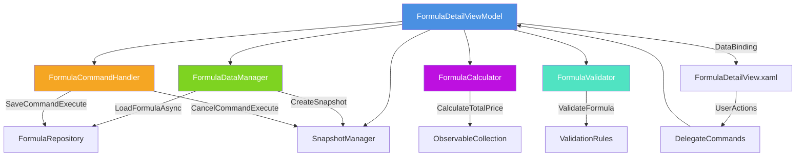
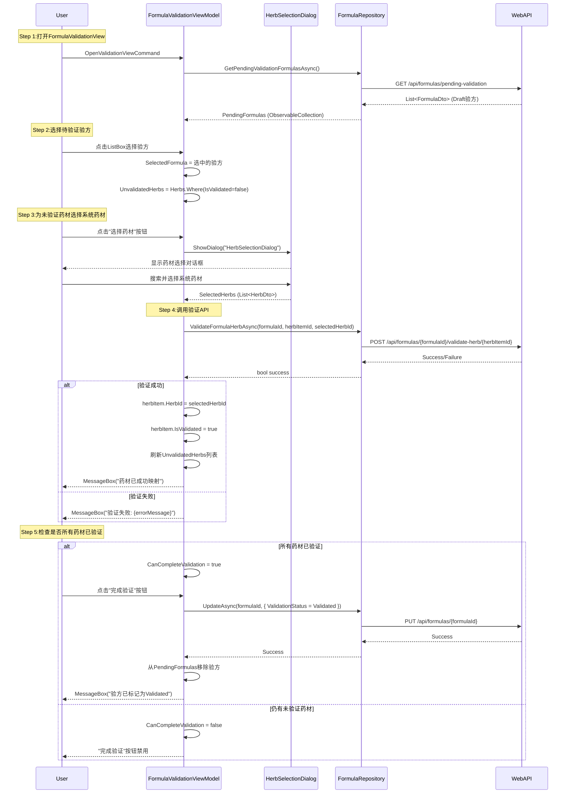
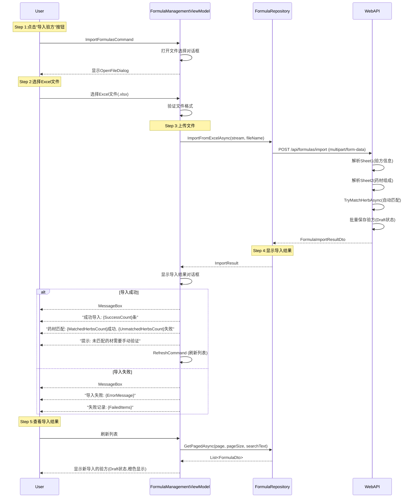

# LYBT.Desktop.Formula - Client端验方管理模块架构设计

## 文档元信息

| 属性 | 值 |
|------|-----|
| 文档类型 | 架构设计文档 |
| 目标读者 | Client端开发人员、架构师、UI/UX设计师 |
| 层级范围 | Client端 - LYBT.Desktop.Formula模块 |
| 最后更新 | 2025-10-30 |
| 文档版本 | v1.0 |
| 对齐文档 | [Server端验方管理设计](../server/formula-design.md) |

---

## 第1章：Formula模块定位与职责

### 1.1 核心定位

**LYBT.Desktop.Formula** 是Client端的**验方模板管理模块**,在MVVM架构中扮演以下角色:

```
核心定位:
┌─────────────────────────────────────────────────────────┐
│ Desktop.Formula (验方管理桌面端)                         │
│ ┌─────────────────────────────────────────────────────┐ │
│ │ 📋 验方管理界面                                      │ │
│ │   - 验方列表(FormulaManagementViewModel)             │ │
│ │   - 验方详情(FormulaDetailViewModel)                 │ │
│ │   - 验证工作流(FormulaValidationViewModel)           │ │
│ │   - Excel导入导出UI                                  │ │
│ └─────────────────────────────────────────────────────┘ │
│                                                          │
│ 🏗️ 组件化架构                                            │
│   - FormulaDataManager:数据加载与管理                    │
│   - FormulaCommandHandler:命令逻辑封装                   │
│   - FormulaCalculator:价格与数量计算                     │
│   - FormulaValidator:客户端验证逻辑                      │
│   - SnapshotManager:编辑取消回滚                         │
│                                                          │
│ 🔗 延迟绑定UI支持                                         │
│   - 导入验方时HerbId可空                                 │
│   - 人工校验界面(药材选择Dialog)                         │
│   - Draft→Validated状态可视化                           │
│   - 药材匹配进度提示(MatchedCount/UnmatchedCount)       │
└─────────────────────────────────────────────────────────┘
```

**五层架构定位**:
```
Presentation层(Views):
  ├── FormulaManagementView.xaml - 验方列表界面
  ├── FormulaDetailView.xaml - 验方详情界面
  ├── FormulaValidationView.xaml - 药材验证界面
  └── HerbSelectionDialog.xaml - 药材选择对话框

ViewModel层(ViewModels):
  ├── FormulaManagementViewModel - 列表管理
  ├── FormulaDetailViewModel - 详情编辑
  ├── FormulaValidationViewModel - 验证工作流
  └── Components/ - 组件化子模块
      ├── FormulaDataManager - 数据管理
      ├── FormulaCommandHandler - 命令处理
      ├── FormulaCalculator - 计算逻辑
      └── FormulaValidator - 验证逻辑

Service Adapter层(Repositories):
  └── FormulaRepository - WebAPI适配器

Contract层(DTOs):
  └── LYBT.Shared.Models.Contracts.Formula.* - 共享DTO

Domain层(Entities):
  └── LYBT.Entities.Formula.* - 实体定义(Client端引用Server端实体)
```

### 1.2 核心职责

| 职责类别 | 具体职责 | 实现位置 |
|---------|---------|---------|
| **验方列表管理** | 分页查询、搜索、删除验方 | FormulaManagementViewModel |
| **验方详情编辑** | 新增、修改验方（Issue #1733 已删除克隆功能） | FormulaDetailViewModel |
| **药材组成管理** | 添加、删除、修改药材明细 | FormulaDetailViewModel.HerbItems |
| **延迟绑定验证** | 显示未验证药材、打开药材选择对话框 | FormulaValidationViewModel |
| **Excel导入** | 打开文件选择、上传文件、显示导入结果 | FormulaManagementViewModel.ImportCommand |
| **Excel导出** | 导出验方到Excel、下载保存 | FormulaManagementViewModel.ExportCommand |
| **计算逻辑** | 药材数量、总价计算 | FormulaCalculator |
| **客户端验证** | 表单验证、业务规则验证 | FormulaValidator |
| **状态管理** | Draft/Validated状态显示、编辑回滚 | SnapshotManager |

### 1.3 设计原则

**组件化原则**:
1. **关注点分离**:DataManager负责数据、CommandHandler负责命令、Calculator负责计算
2. **可复用组件**:Calculator、Validator可被其他ViewModel复用
3. **松耦合设计**:组件通过接口依赖,便于单元测试
4. **单一职责**:每个组件只负责一个核心功能

**代码示例**:
```csharp
// ❌ 错误:所有逻辑堆砌在ViewModel中(600+行)
public class FormulaDetailViewModel : UnifiedViewModelBase
{
    // 数据加载、命令处理、计算、验证全部混在一起
    private async Task LoadFormulaAsync(Guid formulaId)
    {
        // 100行代码...
    }

    private async Task SaveCommandExecuteAsync()
    {
        // 150行代码...
    }

    private decimal CalculateTotalPrice()
    {
        // 50行代码...
    }

    private bool ValidateFormula()
    {
        // 80行代码...
    }
}

// ✅ 正确:组件化拆分(每个组件200-400行)
public class FormulaDetailViewModel : UnifiedViewModelBase
{
    private readonly FormulaDataManager _dataManager;
    private readonly FormulaCommandHandler _commandHandler;
    private readonly FormulaCalculator _calculator;
    private readonly FormulaValidator _validator;

    public FormulaDetailViewModel(
        FormulaDataManager dataManager,
        FormulaCommandHandler commandHandler,
        FormulaCalculator calculator,
        FormulaValidator validator)
    {
        _dataManager = dataManager;
        _commandHandler = commandHandler;
        _calculator = calculator;
        _validator = validator;
    }

    // ViewModel只负责协调组件
    private async Task LoadFormulaAsync(Guid formulaId)
    {
        var result = await _dataManager.LoadFormulaAsync(formulaId);
        if (result.success)
        {
            CurrentFormula = result.formula;
            _dataManager.LoadHerbItems(HerbItems, result.formula.Herbs);
        }
    }

    public decimal TotalPrice => _calculator.CalculateTotalPrice(HerbItems);
}
```

---

## 第2章:核心架构设计(MVVM+组件化)

### 2.1 架构层次图

```
┌─────────────────────────────────────────────────────────────────┐
│ Presentation层 - Views (XAML)                                   │
│ ┌─────────────────────────────────────────────────────────────┐ │
│ │ FormulaManagementView.xaml (验方列表)                        │ │
│ │ ├── DataGrid (验方列表,支持搜索、分页)                        │ │
│ │ ├── ToolBar (新增、导入、导出、删除按钮)                      │ │
│ │ └── StatusBar (总数、Draft数、Validated数)                  │ │
│ │                                                               │ │
│ │ FormulaDetailView.xaml (验方详情)                            │ │
│ │ ├── TextBox (Name, Effect, Usage, Property绑定)             │ │
│ │ ├── ComboBox (Category选择)                                  │ │
│ │ ├── DataGrid (药材明细列表HerbItems)                          │ │
│ │ ├── ToolBar (添加药材、删除药材、计算总价)                    │ │
│ │ └── StatusBar (药材数量、总价显示)                            │ │
│ │                                                               │ │
│ │ FormulaValidationView.xaml (药材验证界面)                    │ │
│ │ ├── ListBox (待验证验方列表Draft)                            │ │
│ │ ├── DataGrid (未验证药材,IsValidated=false高亮)             │ │
│ │ ├── Button (选择系统药材,打开HerbSelectionDialog)            │ │
│ │ └── ProgressBar (验证进度:已验证数/总数)                     │ │
│ └─────────────────────────────────────────────────────────────┘ │
└─────────────────────────────────────────────────────────────────┘
                               ↓ DataBinding
┌─────────────────────────────────────────────────────────────────┐
│ ViewModel层 - ViewModels (C#)                                   │
│ ┌─────────────────────────────────────────────────────────────┐ │
│ │ FormulaManagementViewModel : UnifiedListViewModelBase       │ │
│ │ ├── ObservableCollection<FormulaDto> Items                  │ │
│ │ ├── DelegateCommand AddCommand (导航到FormulaDetailView)    │ │
│ │ ├── DelegateCommand DeleteCommand (调用FormulaRepository)   │ │
│ │ ├── DelegateCommand ImportCommand (Excel导入)                │ │
│ │ ├── DelegateCommand ExportCommand (Excel导出)                │ │
│ │ └── DelegateCommand ExportTemplateCommand (下载模板)        │ │
│ │                                                               │ │
│ │ FormulaDetailViewModel : UnifiedViewModelBase                │ │
│ │ ├── FormulaDto CurrentFormula (当前编辑验方)                 │ │
│ │ ├── ObservableCollection<FormulaHerbItemDto> HerbItems      │ │
│ │ ├── Component: FormulaDataManager                            │ │
│ │ ├── Component: FormulaCommandHandler                         │ │
│ │ ├── Component: FormulaCalculator                             │ │
│ │ ├── Component: FormulaValidator                              │ │
│ │ ├── DelegateCommand SaveCommand                              │ │
│ │ ├── DelegateCommand AddHerbCommand (打开HerbSelectionDialog)│ │
│ │ └── DelegateCommand RemoveHerbCommand                        │ │
│ │                                                               │ │
│ │ FormulaValidationViewModel : UnifiedViewModelBase            │ │
│ │ ├── ObservableCollection<FormulaDto> PendingFormulas        │ │
│ │ ├── FormulaDto SelectedFormula                               │ │
│ │ ├── List<FormulaHerbItemDto> UnvalidatedHerbs               │ │
│ │ ├── DelegateCommand SelectHerbCommand (绑定HerbItemDto)     │ │
│ │ └── DelegateCommand RefreshCommand                           │ │
│ └─────────────────────────────────────────────────────────────┘ │
└─────────────────────────────────────────────────────────────────┘
                               ↓ 调用
┌─────────────────────────────────────────────────────────────────┐
│ Service Adapter层 - FormulaRepository                           │
│ ┌─────────────────────────────────────────────────────────────┐ │
│ │ IFormulaRepository                                            │ │
│ │ ├── GetPagedAsync(page, pageSize, keyword)                  │ │
│ │ ├── GetByIdAsync(id)                                         │ │
│ │ ├── CreateAsync(createDto)                                   │ │
│ │ ├── UpdateAsync(id, updateDto)                               │ │
│ │ ├── DeleteAsync(id)                                          │ │
│ │ ├── ImportFromExcelAsync(stream, fileName)                   │ │
│ │ ├── ExportAsync(formulaIds)                                  │ │
│ │ ├── ValidateFormulaHerbAsync(formulaId, herbItemId, herbId) │ │
│ │ └── GetPendingValidationFormulasAsync()                      │ │
│ └─────────────────────────────────────────────────────────────┘ │
└─────────────────────────────────────────────────────────────────┘
                               ↓ HTTP
┌─────────────────────────────────────────────────────────────────┐
│ WebAPI层 - FormulaController (Server端)                         │
│ ┌─────────────────────────────────────────────────────────────┐ │
│ │ POST /api/formulas                                            │ │
│ │ GET /api/formulas/{id}                                        │ │
│ │ PUT /api/formulas/{id}                                        │ │
│ │ DELETE /api/formulas/{id}                                     │ │
│ │ POST /api/formulas/import                                     │ │
│ │ GET /api/formulas/export                                      │ │
│ │ POST /api/formulas/{id}/validate-herb/{herbItemId}          │ │
│ │ GET /api/formulas/pending-validation                          │ │
│ └─────────────────────────────────────────────────────────────┘ │
└─────────────────────────────────────────────────────────────────┘
```

### 2.2 组件化架构图(FormulaDetailViewModel)



---

## 第3章:ViewModel层设计

### 3.1 FormulaManagementViewModel(列表管理)

**继承层次**:
```csharp
FormulaManagementViewModel : UnifiedListViewModelBase<FormulaDto>
```

**核心属性**:
```csharp
public class FormulaManagementViewModel : UnifiedListViewModelBase<FormulaDto>
{
    private readonly IFormulaRepository _formulaRepository;
    private readonly IDialogService _dialogService;
    private readonly IRegionManager _regionManager;

    /// <summary>验方列表(继承自UnifiedListViewModelBase)</summary>
    public ObservableCollection<FormulaDto> Items { get; set; }

    /// <summary>选中的验方</summary>
    public FormulaDto? SelectedItem { get; set; }

    /// <summary>搜索关键词</summary>
    public string? SearchText { get; set; }

    /// <summary>总数统计</summary>
    public int TotalCount { get; set; }

    /// <summary>Draft验方数量</summary>
    public int DraftCount => Items?.Count(f => f.ValidationStatus == FormulaValidationStatus.Draft) ?? 0;

    /// <summary>Validated验方数量</summary>
    public int ValidatedCount => Items?.Count(f => f.ValidationStatus == FormulaValidationStatus.Validated) ?? 0;
}
```

**核心Commands**:
```csharp
// ========== CRUD Commands ==========
public DelegateCommand AddCommand { get; }
public DelegateCommand EditCommand { get; }
public DelegateCommand<FormulaDto> DeleteCommand { get; }

// ========== Excel导入导出Commands ==========
public DelegateCommand ImportFormulasCommand { get; }
public DelegateCommand ExportFormulasCommand { get; }
public DelegateCommand ExportTemplateCommand { get; }

// ========== 搜索与刷新 ==========
public DelegateCommand SearchCommand { get; }
public DelegateCommand RefreshCommand { get; }

// ========== 导航Commands ==========
public DelegateCommand OpenValidationViewCommand { get; } // 打开FormulaValidationView
```

**查询数据逻辑**:
```csharp
protected override async Task<IEnumerable<FormulaDto>> GetItemsAsync(int page, int pageSize, string? searchText)
{
    var result = await ExecuteSafelyAsync(async () =>
    {
        var pagedData = await _formulaRepository.GetPagedAsync(page, pageSize, searchText);
        TotalCount = pagedData.TotalCount;
        return pagedData.Items;
    });

    return result ?? Enumerable.Empty<FormulaDto>();
}
```

### 3.2 FormulaDetailViewModel(详情编辑,组件化架构)

**组件依赖**:
```csharp
public class FormulaDetailViewModel : UnifiedViewModelBase
{
    private readonly FormulaDataManager _dataManager;
    private readonly FormulaCommandHandler _commandHandler;
    private readonly FormulaCalculator _calculator;
    private readonly FormulaValidator _validator;
    private readonly IFormulaRepository _formulaRepository;
    private readonly IDialogService _dialogService;

    public FormulaDetailViewModel(
        FormulaDataManager dataManager,
        FormulaCommandHandler commandHandler,
        FormulaCalculator calculator,
        FormulaValidator validator,
        IFormulaRepository formulaRepository,
        IDialogService dialogService)
    {
        _dataManager = dataManager;
        _commandHandler = commandHandler;
        _calculator = calculator;
        _validator = validator;
        _formulaRepository = formulaRepository;
        _dialogService = dialogService;
    }
}
```

**核心属性**:
```csharp
/// <summary>当前编辑的验方</summary>
public FormulaDto CurrentFormula { get; set; }

/// <summary>药材明细列表</summary>
public ObservableCollection<FormulaHerbItemDto> HerbItems { get; set; } = new();

/// <summary>编辑模式(New/Edit)</summary>
public bool IsEditMode { get; set; }

/// <summary>验方ID(从导航参数获取)</summary>
public Guid FormulaId { get; set; }

/// <summary>药材数量(计算属性)</summary>
public int HerbCount => _dataManager.GetHerbItemCount(HerbItems);

/// <summary>总价(计算属性)</summary>
public decimal TotalPrice => _calculator.CalculateTotalPrice(HerbItems);
```

**核心Commands**:
```csharp
/// <summary>保存命令(新增或更新)</summary>
public DelegateCommand SaveCommand { get; }

/// <summary>取消命令(回滚到快照)</summary>
public DelegateCommand CancelCommand { get; }

/// <summary>添加药材命令(打开HerbSelectionDialog)</summary>
public DelegateCommand AddHerbCommand { get; }

/// <summary>删除药材命令</summary>
public DelegateCommand<FormulaHerbItemDto> RemoveHerbCommand { get; }
```

**导航参数接收**:
```csharp
public async void OnNavigatedTo(NavigationContext navigationContext)
{
    var formulaIdStr = navigationContext.Parameters.GetValue<string>("FormulaId");
    if (Guid.TryParse(formulaIdStr, out var formulaId))
    {
        FormulaId = formulaId;
        IsEditMode = true;
        await LoadFormulaAsync(formulaId);
    }
    else
    {
        IsEditMode = false;
        InitializeNewFormula();
    }
}

private async Task LoadFormulaAsync(Guid formulaId)
{
    var result = await _dataManager.LoadFormulaAsync(formulaId);
    if (result.success)
    {
        CurrentFormula = result.formula;
        _dataManager.LoadHerbItems(HerbItems, result.formula.Herbs);

        // 创建快照用于取消编辑
        _dataManager.CreateSnapshot(CurrentFormula);
    }
}
```

### 3.3 FormulaValidationViewModel(药材验证工作流)

**核心属性**:
```csharp
public class FormulaValidationViewModel : UnifiedViewModelBase
{
    /// <summary>待验证验方列表(Draft状态)</summary>
    public ObservableCollection<FormulaDto> PendingFormulas { get; set; } = new();

    /// <summary>选中的验方</summary>
    public FormulaDto? SelectedFormula { get; set; }

    /// <summary>未验证的药材列表(IsValidated=false)</summary>
    public List<FormulaHerbItemDto> UnvalidatedHerbs
    {
        get
        {
            return SelectedFormula?.Herbs
                .Where(h => !h.IsValidated)
                .ToList() ?? new List<FormulaHerbItemDto>();
        }
    }

    /// <summary>验证进度(已验证/总数)</summary>
    public string ValidationProgress
    {
        get
        {
            if (SelectedFormula?.Herbs == null || !SelectedFormula.Herbs.Any())
                return "0/0";

            var total = SelectedFormula.Herbs.Count;
            var validated = SelectedFormula.Herbs.Count(h => h.IsValidated);
            return $"{validated}/{total}";
        }
    }

    /// <summary>是否可完成验证(所有药材已验证)</summary>
    public bool CanCompleteValidation
    {
        get
        {
            return SelectedFormula?.Herbs != null &&
                   SelectedFormula.Herbs.Any() &&
                   SelectedFormula.Herbs.All(h => h.IsValidated);
        }
    }
}
```

**核心Commands**:
```csharp
/// <summary>选择系统药材命令(打开HerbSelectionDialog)</summary>
public DelegateCommand<FormulaHerbItemDto> SelectHerbCommand { get; }

/// <summary>刷新待验证列表</summary>
public DelegateCommand RefreshCommand { get; }

/// <summary>完成验证命令(将验方从Draft→Validated)</summary>
public DelegateCommand CompleteValidationCommand { get; }
```

**选择药材流程**:
```csharp
private async Task SelectHerbAsync(FormulaHerbItemDto? herbItem)
{
    if (herbItem == null || SelectedFormula == null)
        return;

    // 打开药材选择对话框
    var parameters = new DialogParameters
    {
        { "SelectionMode", "Single" },
        { "Title", $"为药材'{herbItem.OriginalHerbName}'选择系统药材" }
    };

    _dialogService.ShowDialog("HerbSelectionDialog", parameters, async result =>
    {
        if (result.Result != ButtonResult.OK)
            return;

        var selectedHerbs = result.Parameters.GetValue<List<HerbDto>>("SelectedHerbs");
        if (selectedHerbs == null || !selectedHerbs.Any())
            return;

        var selectedHerbId = selectedHerbs.First().Id;

        // 调用WebAPI验证药材绑定
        bool success = await _formulaRepository.ValidateFormulaHerbAsync(
            SelectedFormula.Id,
            herbItem.Id,
            selectedHerbId);

        if (success)
        {
            // 更新UI
            herbItem.HerbId = selectedHerbId;
            herbItem.HerbName = selectedHerbs.First().Name;
            herbItem.IsValidated = true;

            // 刷新列表
            await LoadPendingFormulasAsync();
            MessageBox.Show("药材已成功映射到系统药材库", "提示");
        }
    });
}
```

### 3.4 组件设计(Components)

#### FormulaDataManager(数据管理组件)

**职责**:数据加载、HerbItems加载、快照创建

```csharp
public class FormulaDataManager
{
    private readonly IFormulaRepository _formulaRepository;
    private FormulaDataSnapshot? _snapshot;

    /// <summary>
    /// 加载验方数据
    /// </summary>
    public async Task<(bool success, FormulaDto? formula, string? errorMessage)> LoadFormulaAsync(Guid formulaId)
    {
        try
        {
            var result = await _formulaRepository.GetByIdAsync(formulaId);
            if (result.Succeeded && result.Data != null)
            {
                return (true, result.Data, null);
            }
            return (false, null, result.Message);
        }
        catch (Exception ex)
        {
            return (false, null, ex.Message);
        }
    }

    /// <summary>
    /// 加载药材明细到ObservableCollection
    /// </summary>
    public void LoadHerbItems(ObservableCollection<FormulaHerbItemDto> targetCollection, IEnumerable<FormulaHerbItemDto>? sourceItems)
    {
        targetCollection.Clear();
        if (sourceItems != null)
        {
            foreach (var item in sourceItems)
            {
                targetCollection.Add(item);
            }
        }
    }

    /// <summary>
    /// 创建数据快照(用于取消编辑)
    /// </summary>
    public FormulaDataSnapshot CreateSnapshot(FormulaDto formula)
    {
        _snapshot = new FormulaDataSnapshot
        {
            Name = formula.Name,
            Effect = formula.Effect,
            Usage = formula.Usage,
            Property = formula.Property,
            Remark = formula.Remark,
            Category = formula.Category,
            IsShared = formula.IsShared,
            Herbs = formula.Herbs.Select(h => new FormulaHerbItemDto
            {
                HerbId = h.HerbId,
                HerbName = h.HerbName,
                Quantity = h.Quantity,
                Unit = h.Unit
            }).ToList()
        };
        return _snapshot;
    }

    /// <summary>
    /// 从快照恢复数据
    /// </summary>
    public void RestoreFromSnapshot(FormulaDto formula, ObservableCollection<FormulaHerbItemDto> herbItems)
    {
        if (_snapshot == null)
            return;

        formula.Name = _snapshot.Name;
        formula.Effect = _snapshot.Effect;
        formula.Usage = _snapshot.Usage;
        formula.Property = _snapshot.Property;
        formula.Remark = _snapshot.Remark;
        formula.Category = _snapshot.Category;
        formula.IsShared = _snapshot.IsShared;

        LoadHerbItems(herbItems, _snapshot.Herbs);
    }

    /// <summary>
    /// 获取药材数量
    /// </summary>
    public int GetHerbItemCount(ObservableCollection<FormulaHerbItemDto> herbItems)
    {
        return herbItems?.Count ?? 0;
    }
}

/// <summary>
/// 数据快照(用于取消编辑)
/// </summary>
public class FormulaDataSnapshot
{
    public string Name { get; set; } = string.Empty;
    public string? Effect { get; set; }
    public string? Usage { get; set; }
    public string? Property { get; set; }
    public string? Remark { get; set; }
    public string? Category { get; set; }
    public bool IsShared { get; set; }
    public List<FormulaHerbItemDto> Herbs { get; set; } = new();
}
```

#### FormulaCalculator(计算组件)

**职责**:总价计算、药材数量统计

```csharp
public class FormulaCalculator
{
    /// <summary>
    /// 计算验方总价(药材单价×剂量求和)
    /// </summary>
    public decimal CalculateTotalPrice(IEnumerable<FormulaHerbItemDto>? herbItems)
    {
        if (herbItems == null || !herbItems.Any())
            return 0m;

        return herbItems
            .Where(h => h.Herb != null) // 只统计已绑定的药材
            .Sum(h => (h.Herb!.Price ?? 0m) * h.Quantity);
    }

    /// <summary>
    /// 计算未验证药材数量
    /// </summary>
    public int CountUnvalidatedHerbs(IEnumerable<FormulaHerbItemDto>? herbItems)
    {
        if (herbItems == null || !herbItems.Any())
            return 0;

        return herbItems.Count(h => !h.IsValidated);
    }

    /// <summary>
    /// 计算验证进度百分比
    /// </summary>
    public double CalculateValidationProgress(IEnumerable<FormulaHerbItemDto>? herbItems)
    {
        if (herbItems == null || !herbItems.Any())
            return 0;

        var total = herbItems.Count();
        var validated = herbItems.Count(h => h.IsValidated);
        return (double)validated / total * 100;
    }
}
```

#### FormulaValidator(验证组件)

**职责**:客户端表单验证、业务规则验证

```csharp
public class FormulaValidator
{
    /// <summary>
    /// 验证验方基本信息
    /// </summary>
    public ValidationResult ValidateFormula(FormulaDto formula)
    {
        var errors = new List<string>();

        // 必填字段验证
        if (string.IsNullOrWhiteSpace(formula.Name))
            errors.Add("验方名称不能为空");

        if (formula.Name?.Length > 100)
            errors.Add("验方名称不能超过100个字符");

        if (formula.Effect?.Length > 500)
            errors.Add("功效说明不能超过500个字符");

        return new ValidationResult
        {
            IsValid = !errors.Any(),
            ErrorMessages = errors
        };
    }

    /// <summary>
    /// 验证药材明细
    /// </summary>
    public ValidationResult ValidateHerbItems(IEnumerable<FormulaHerbItemDto> herbItems)
    {
        var errors = new List<string>();

        if (!herbItems.Any())
            errors.Add("至少需要添加一味药材");

        foreach (var item in herbItems)
        {
            if (string.IsNullOrWhiteSpace(item.HerbName))
                errors.Add($"药材名称不能为空");

            if (item.Quantity <= 0)
                errors.Add($"药材'{item.HerbName}'的剂量必须大于0");
        }

        return new ValidationResult
        {
            IsValid = !errors.Any(),
            ErrorMessages = errors
        };
    }

    /// <summary>
    /// 验证是否可以保存
    /// </summary>
    public ValidationResult CanSave(FormulaDto formula, IEnumerable<FormulaHerbItemDto> herbItems)
    {
        var formulaResult = ValidateFormula(formula);
        if (!formulaResult.IsValid)
            return formulaResult;

        var herbResult = ValidateHerbItems(herbItems);
        return herbResult;
    }
}

/// <summary>
/// 验证结果
/// </summary>
public class ValidationResult
{
    public bool IsValid { get; set; }
    public List<string> ErrorMessages { get; set; } = new();
}
```

---

## 第4章:View层设计(XAML结构)

### 4.1 FormulaManagementView.xaml(列表界面)

**布局结构**:
```xml
<UserControl x:Class="LYBT.Desktop.Formula.Views.FormulaManagementView">
    <Grid>
        <Grid.RowDefinitions>
            <RowDefinition Height="Auto"/> <!-- ToolBar -->
            <RowDefinition Height="Auto"/> <!-- SearchBar -->
            <RowDefinition Height="*"/>    <!-- DataGrid -->
            <RowDefinition Height="Auto"/> <!-- Pagination -->
            <RowDefinition Height="Auto"/> <!-- StatusBar -->
        </Grid.RowDefinitions>

        <!-- ToolBar -->
        <ToolBar Grid.Row="0">
            <Button Command="{Binding AddCommand}" Content="新增验方"/>
            <Separator/>
            <Button Command="{Binding ImportFormulasCommand}" Content="导入验方"/>
            <Button Command="{Binding ExportFormulasCommand}" Content="导出验方"/>
            <Button Command="{Binding ExportTemplateCommand}" Content="下载模板"/>
            <Separator/>
            <Button Command="{Binding DeleteCommand}"
                    CommandParameter="{Binding SelectedItem}"
                    Content="删除"/>
            <Separator/>
            <Button Command="{Binding OpenValidationViewCommand}" Content="药材验证"/>
        </ToolBar>

        <!-- SearchBar -->
        <StackPanel Grid.Row="1" Orientation="Horizontal" Margin="5">
            <TextBox Width="300" Text="{Binding SearchText, UpdateSourceTrigger=PropertyChanged}"/>
            <Button Command="{Binding SearchCommand}" Content="搜索" Margin="5,0"/>
            <Button Command="{Binding RefreshCommand}" Content="刷新"/>
        </StackPanel>

        <!-- DataGrid -->
        <DataGrid Grid.Row="2"
                  ItemsSource="{Binding Items}"
                  SelectedItem="{Binding SelectedItem}"
                  AutoGenerateColumns="False"
                  IsReadOnly="True">
            <DataGrid.Columns>
                <DataGridTextColumn Header="验方名称" Binding="{Binding Name}" Width="200"/>
                <DataGridTextColumn Header="功效" Binding="{Binding Effect}" Width="250"/>
                <DataGridTextColumn Header="用法" Binding="{Binding Usage}" Width="150"/>
                <DataGridTextColumn Header="药材组成" Binding="{Binding HerbNames}" Width="300"/>
                <DataGridTextColumn Header="药材数量" Binding="{Binding HerbCount}" Width="80"/>
                <DataGridTextColumn Header="总价" Binding="{Binding TotalPrice, StringFormat={}{0:F2}}" Width="80"/>
                <DataGridTemplateColumn Header="验证状态" Width="100">
                    <DataGridTemplateColumn.CellTemplate>
                        <DataTemplate>
                            <TextBlock Text="{Binding ValidationStatus, Converter={StaticResource ValidationStatusConverter}}"
                                       Foreground="{Binding ValidationStatus, Converter={StaticResource ValidationStatusColorConverter}}"/>
                        </DataTemplate>
                    </DataGridTemplateColumn.CellTemplate>
                </DataGridTemplateColumn>
                <DataGridTextColumn Header="分类" Binding="{Binding Category}" Width="100"/>
                <DataGridCheckBoxColumn Header="共享" Binding="{Binding IsShared}" Width="60"/>
            </DataGrid.Columns>
        </DataGrid>

        <!-- Pagination (继承自UnifiedListViewModelBase) -->
        <StackPanel Grid.Row="3" Orientation="Horizontal" HorizontalAlignment="Center" Margin="5">
            <Button Command="{Binding FirstPageCommand}" Content="首页"/>
            <Button Command="{Binding PreviousPageCommand}" Content="上一页"/>
            <TextBlock Text="{Binding CurrentPage}" Margin="10,0"/>
            <TextBlock Text="/" Margin="0"/>
            <TextBlock Text="{Binding TotalPages}" Margin="10,0"/>
            <Button Command="{Binding NextPageCommand}" Content="下一页"/>
            <Button Command="{Binding LastPageCommand}" Content="末页"/>
        </StackPanel>

        <!-- StatusBar -->
        <StatusBar Grid.Row="4">
            <StatusBarItem>
                <TextBlock Text="{Binding TotalCount, StringFormat='总数: {0}'}"/>
            </StatusBarItem>
            <Separator/>
            <StatusBarItem>
                <TextBlock Text="{Binding DraftCount, StringFormat='待验证: {0}'}" Foreground="Orange"/>
            </StatusBarItem>
            <Separator/>
            <StatusBarItem>
                <TextBlock Text="{Binding ValidatedCount, StringFormat='已验证: {0}'}" Foreground="Green"/>
            </StatusBarItem>
        </StatusBar>
    </Grid>
</UserControl>
```

### 4.2 FormulaDetailView.xaml(详情编辑界面)

**布局结构**:
```xml
<UserControl x:Class="LYBT.Desktop.Formula.Views.FormulaDetailView">
    <Grid>
        <Grid.RowDefinitions>
            <RowDefinition Height="Auto"/> <!-- ToolBar -->
            <RowDefinition Height="Auto"/> <!-- BasicInfo -->
            <RowDefinition Height="*"/>    <!-- HerbItems -->
            <RowDefinition Height="Auto"/> <!-- StatusBar -->
        </Grid.RowDefinitions>

        <!-- ToolBar -->
        <ToolBar Grid.Row="0">
            <Button Command="{Binding SaveCommand}" Content="保存"/>
            <Button Command="{Binding CancelCommand}" Content="取消"/>
        </ToolBar>

        <!-- BasicInfo -->
        <GroupBox Grid.Row="1" Header="基本信息" Margin="5">
            <Grid>
                <Grid.ColumnDefinitions>
                    <ColumnDefinition Width="Auto"/>
                    <ColumnDefinition Width="*"/>
                    <ColumnDefinition Width="Auto"/>
                    <ColumnDefinition Width="*"/>
                </Grid.ColumnDefinitions>
                <Grid.RowDefinitions>
                    <RowDefinition Height="Auto"/>
                    <RowDefinition Height="Auto"/>
                    <RowDefinition Height="Auto"/>
                    <RowDefinition Height="Auto"/>
                </Grid.RowDefinitions>

                <!-- Row 0 -->
                <Label Grid.Row="0" Grid.Column="0" Content="验方名称:"/>
                <TextBox Grid.Row="0" Grid.Column="1" Text="{Binding CurrentFormula.Name}" Width="200"/>
                <Label Grid.Row="0" Grid.Column="2" Content="分类:"/>
                <ComboBox Grid.Row="0" Grid.Column="3"
                          SelectedValue="{Binding CurrentFormula.Category}"
                          ItemsSource="{Binding CategoryList}" Width="150"/>

                <!-- Row 1 -->
                <Label Grid.Row="1" Grid.Column="0" Content="功效:"/>
                <TextBox Grid.Row="1" Grid.Column="1" Grid.ColumnSpan="3"
                         Text="{Binding CurrentFormula.Effect}"
                         AcceptsReturn="True" Height="60"/>

                <!-- Row 2 -->
                <Label Grid.Row="2" Grid.Column="0" Content="用法:"/>
                <TextBox Grid.Row="2" Grid.Column="1" Grid.ColumnSpan="3"
                         Text="{Binding CurrentFormula.Usage}"
                         AcceptsReturn="True" Height="60"/>

                <!-- Row 3 -->
                <Label Grid.Row="3" Grid.Column="0" Content="性味归经:"/>
                <TextBox Grid.Row="3" Grid.Column="1" Text="{Binding CurrentFormula.Property}"/>
                <CheckBox Grid.Row="3" Grid.Column="2" Grid.ColumnSpan="2"
                          Content="共享给所有用户"
                          IsChecked="{Binding CurrentFormula.IsShared}"/>
            </Grid>
        </GroupBox>

        <!-- HerbItems -->
        <GroupBox Grid.Row="2" Header="药材组成" Margin="5">
            <Grid>
                <Grid.RowDefinitions>
                    <RowDefinition Height="Auto"/>
                    <RowDefinition Height="*"/>
                </Grid.RowDefinitions>

                <!-- HerbToolBar -->
                <ToolBar Grid.Row="0">
                    <Button Command="{Binding AddHerbCommand}" Content="添加药材"/>
                    <Button Command="{Binding RemoveHerbCommand}"
                            CommandParameter="{Binding SelectedHerbItem}"
                            Content="删除药材"/>
                </ToolBar>

                <!-- HerbDataGrid -->
                <DataGrid Grid.Row="1"
                          ItemsSource="{Binding HerbItems}"
                          SelectedItem="{Binding SelectedHerbItem}"
                          AutoGenerateColumns="False">
                    <DataGrid.Columns>
                        <DataGridTextColumn Header="药材名称" Binding="{Binding HerbName}" Width="150"/>
                        <DataGridTextColumn Header="剂量" Binding="{Binding Quantity}" Width="80"/>
                        <DataGridTextColumn Header="单位" Binding="{Binding Unit}" Width="60"/>
                        <DataGridTextColumn Header="单价" Binding="{Binding Herb.Price, StringFormat={}{0:F2}}" Width="80"/>
                        <DataGridTextColumn Header="小计" Binding="{Binding SubTotal, StringFormat={}{0:F2}}" Width="80"/>
                        <DataGridTextColumn Header="炮制方法" Binding="{Binding ProcessingMethod}" Width="120"/>
                        <DataGridTextColumn Header="用法说明" Binding="{Binding Usage}" Width="150"/>
                        <DataGridTemplateColumn Header="验证状态" Width="100">
                            <DataGridTemplateColumn.CellTemplate>
                                <DataTemplate>
                                    <TextBlock Text="{Binding IsValidated, Converter={StaticResource IsValidatedConverter}}"
                                               Foreground="{Binding IsValidated, Converter={StaticResource IsValidatedColorConverter}}"/>
                                </DataTemplate>
                            </DataGridTemplateColumn.CellTemplate>
                        </DataGridTemplateColumn>
                    </DataGrid.Columns>
                </DataGrid>
            </Grid>
        </GroupBox>

        <!-- StatusBar -->
        <StatusBar Grid.Row="3">
            <StatusBarItem>
                <TextBlock Text="{Binding HerbCount, StringFormat='药材数量: {0}'}"/>
            </StatusBarItem>
            <Separator/>
            <StatusBarItem>
                <TextBlock Text="{Binding TotalPrice, StringFormat='总价: {0:F2}元'}"/>
            </StatusBarItem>
        </StatusBar>
    </Grid>
</UserControl>
```

### 4.3 FormulaValidationView.xaml(药材验证界面)

**布局结构**:
```xml
<UserControl x:Class="LYBT.Desktop.Formula.Views.FormulaValidationView">
    <Grid>
        <Grid.ColumnDefinitions>
            <ColumnDefinition Width="300"/> <!-- 待验证验方列表 -->
            <ColumnDefinition Width="5"/>
            <ColumnDefinition Width="*"/>   <!-- 未验证药材列表 -->
        </Grid.ColumnDefinitions>

        <!-- 左侧:待验证验方列表 -->
        <GroupBox Grid.Column="0" Header="待验证验方(Draft状态)">
            <Grid>
                <Grid.RowDefinitions>
                    <RowDefinition Height="Auto"/>
                    <RowDefinition Height="*"/>
                </Grid.RowDefinitions>

                <Button Grid.Row="0" Command="{Binding RefreshCommand}" Content="刷新列表" Margin="5"/>

                <ListBox Grid.Row="1"
                         ItemsSource="{Binding PendingFormulas}"
                         SelectedItem="{Binding SelectedFormula}">
                    <ListBox.ItemTemplate>
                        <DataTemplate>
                            <StackPanel>
                                <TextBlock Text="{Binding Name}" FontWeight="Bold"/>
                                <TextBlock Text="{Binding HerbNames}" Foreground="Gray" FontSize="10"/>
                                <TextBlock>
                                    <Run Text="验证进度:"/>
                                    <Run Text="{Binding ValidationProgress}" Foreground="Orange"/>
                                </TextBlock>
                            </StackPanel>
                        </DataTemplate>
                    </ListBox.ItemTemplate>
                </ListBox>
            </Grid>
        </GroupBox>

        <GridSplitter Grid.Column="1" Width="5" HorizontalAlignment="Stretch"/>

        <!-- 右侧:未验证药材列表 -->
        <GroupBox Grid.Column="2" Header="未验证药材列表">
            <Grid>
                <Grid.RowDefinitions>
                    <RowDefinition Height="Auto"/>
                    <RowDefinition Height="*"/>
                    <RowDefinition Height="Auto"/>
                </Grid.RowDefinitions>

                <!-- 提示信息 -->
                <TextBlock Grid.Row="0" Margin="5" TextWrapping="Wrap" Foreground="Orange">
                    <Run Text="以下药材未验证绑定,请为每个药材选择对应的系统药材:"/>
                </TextBlock>

                <!-- 药材列表 -->
                <DataGrid Grid.Row="1"
                          ItemsSource="{Binding UnvalidatedHerbs}"
                          AutoGenerateColumns="False"
                          IsReadOnly="True">
                    <DataGrid.Columns>
                        <DataGridTextColumn Header="原始药材名称" Binding="{Binding OriginalHerbName}" Width="150"/>
                        <DataGridTextColumn Header="当前名称" Binding="{Binding HerbName}" Width="150"/>
                        <DataGridTextColumn Header="剂量" Binding="{Binding Quantity}" Width="80"/>
                        <DataGridTextColumn Header="单位" Binding="{Binding Unit}" Width="60"/>
                        <DataGridTemplateColumn Header="操作" Width="120">
                            <DataGridTemplateColumn.CellTemplate>
                                <DataTemplate>
                                    <Button Command="{Binding DataContext.SelectHerbCommand, RelativeSource={RelativeSource AncestorType=DataGrid}}"
                                            CommandParameter="{Binding}"
                                            Content="选择药材"/>
                                </DataTemplate>
                            </DataGridTemplateColumn.CellTemplate>
                        </DataGridTemplateColumn>
                    </DataGrid.Columns>
                </DataGrid>

                <!-- 完成验证按钮 -->
                <StackPanel Grid.Row="2" Orientation="Horizontal" HorizontalAlignment="Right" Margin="5">
                    <TextBlock Text="{Binding ValidationProgress, StringFormat='验证进度: {0}'}"
                               VerticalAlignment="Center" Margin="10,0"/>
                    <Button Command="{Binding CompleteValidationCommand}"
                            Content="完成验证(标记为Validated)"
                            IsEnabled="{Binding CanCompleteValidation}"/>
                </StackPanel>
            </Grid>
        </GroupBox>
    </Grid>
</UserControl>
```

---

## 第5章:数据绑定与Commands设计

### 5.1 数据绑定模式

**双向绑定**:
```xml
<!-- TextBox双向绑定 -->
<TextBox Text="{Binding CurrentFormula.Name, Mode=TwoWay, UpdateSourceTrigger=PropertyChanged}"/>

<!-- CheckBox双向绑定 -->
<CheckBox IsChecked="{Binding CurrentFormula.IsShared, Mode=TwoWay}"/>

<!-- ComboBox双向绑定 -->
<ComboBox SelectedValue="{Binding CurrentFormula.Category, Mode=TwoWay}"
          ItemsSource="{Binding CategoryList}"/>
```

**单向绑定(只读)**:
```xml
<!-- 计算属性(只读) -->
<TextBlock Text="{Binding HerbCount, StringFormat='药材数量: {0}'}"/>
<TextBlock Text="{Binding TotalPrice, StringFormat='总价: {0:F2}元'}"/>
<TextBlock Text="{Binding ValidationProgress}"/>
```

**集合绑定**:
```xml
<!-- ObservableCollection绑定 -->
<DataGrid ItemsSource="{Binding Items}"/>
<ListBox ItemsSource="{Binding PendingFormulas}"/>
<DataGrid ItemsSource="{Binding HerbItems}"/>
```

### 5.2 命令绑定(DelegateCommand)

**无参数Commands**:
```csharp
// ViewModel定义
public DelegateCommand SaveCommand { get; }
public DelegateCommand CancelCommand { get; }
public DelegateCommand RefreshCommand { get; }

// XAML绑定
<Button Command="{Binding SaveCommand}" Content="保存"/>
<Button Command="{Binding CancelCommand}" Content="取消"/>
<Button Command="{Binding RefreshCommand}" Content="刷新"/>
```

**带参数Commands**:
```csharp
// ViewModel定义
public DelegateCommand<FormulaDto> DeleteCommand { get; }
public DelegateCommand<FormulaHerbItemDto> RemoveHerbCommand { get; }
public DelegateCommand<FormulaHerbItemDto> SelectHerbCommand { get; }

// XAML绑定
<Button Command="{Binding DeleteCommand}"
        CommandParameter="{Binding SelectedItem}"/>

<Button Command="{Binding RemoveHerbCommand}"
        CommandParameter="{Binding SelectedHerbItem}"/>

<!-- DataGrid中的按钮 -->
<Button Command="{Binding DataContext.SelectHerbCommand, RelativeSource={RelativeSource AncestorType=DataGrid}}"
        CommandParameter="{Binding}"/>
```

**CanExecute逻辑**:
```csharp
// ViewModel定义
public DelegateCommand SaveCommand { get; }

private bool CanSaveCommand()
{
    // 验证基本信息
    if (string.IsNullOrWhiteSpace(CurrentFormula?.Name))
        return false;

    // 验证药材列表
    if (!HerbItems.Any())
        return false;

    return true;
}

public FormulaDetailViewModel()
{
    SaveCommand = new DelegateCommand(SaveCommandExecute, CanSaveCommand);

    // 属性变更时重新评估CanExecute
    PropertyChanged += (s, e) =>
    {
        if (e.PropertyName == nameof(CurrentFormula) || e.PropertyName == nameof(HerbItems))
        {
            SaveCommand.RaiseCanExecuteChanged();
        }
    };
}
```

### 5.3 值转换器(IValueConverter)

**ValidationStatusConverter**:
```csharp
public class ValidationStatusConverter : IValueConverter
{
    public object Convert(object value, Type targetType, object parameter, CultureInfo culture)
    {
        if (value is FormulaValidationStatus status)
        {
            return status switch
            {
                FormulaValidationStatus.Draft => "草稿",
                FormulaValidationStatus.Validated => "已验证",
                _ => "未知"
            };
        }
        return "未知";
    }

    public object ConvertBack(object value, Type targetType, object parameter, CultureInfo culture)
    {
        throw new NotImplementedException();
    }
}
```

**ValidationStatusColorConverter**:
```csharp
public class ValidationStatusColorConverter : IValueConverter
{
    public object Convert(object value, Type targetType, object parameter, CultureInfo culture)
    {
        if (value is FormulaValidationStatus status)
        {
            return status switch
            {
                FormulaValidationStatus.Draft => Brushes.Orange,
                FormulaValidationStatus.Validated => Brushes.Green,
                _ => Brushes.Gray
            };
        }
        return Brushes.Gray;
    }

    public object ConvertBack(object value, Type targetType, object parameter, CultureInfo culture)
    {
        throw new NotImplementedException();
    }
}
```

**IsValidatedConverter**:
```csharp
public class IsValidatedConverter : IValueConverter
{
    public object Convert(object value, Type targetType, object parameter, CultureInfo culture)
    {
        if (value is bool isValidated)
        {
            return isValidated ? "已验证" : "未验证";
        }
        return "未验证";
    }
}
```

---

## 第6章:验证工作流UI设计

### 6.1 药材验证流程图



### 6.2 导入Excel流程图



---

## 第7章:FormulaRepository设计(WebAPI适配器)

### 7.1 IFormulaRepository接口定义

```csharp
public interface IFormulaRepository
{
    // ========== CRUD ==========
    Task<ServiceResult<FormulaDto>> CreateAsync(FormulaCreateDto dto);
    Task<ServiceResult<FormulaDto>> GetByIdAsync(Guid id);
    Task<ServiceResult<FormulaDto>> UpdateAsync(Guid id, FormulaUpdateDto dto);
    Task<ServiceResult> DeleteAsync(Guid id);
    Task<ServiceResult<BatchOperationResultDto>> BatchDeleteAsync(List<Guid> ids);

    // ========== 查询 ==========
    Task<ServiceResult<PagedResult<FormulaDto>>> GetPagedAsync(int pageNumber, int pageSize, string? keyword = null);
    Task<ServiceResult<List<FormulaDto>>> GetTemplatesAsync();
    Task<ServiceResult<List<FormulaDto>>> SearchAsync(string keyword);
    Task<ServiceResult<List<FormulaDto>>> GetPendingValidationFormulasAsync();

    // ========== Excel导入导出 ==========
    Task<ServiceResult<FormulaImportResultDto>> ImportFromExcelAsync(Stream stream, string? fileName = null);
    Task<ServiceResult<byte[]>> ExportAsync(List<Guid>? formulaIds = null);
    ServiceResult<byte[]> GenerateImportTemplate();

    // ========== 验证 ==========
    Task<ServiceResult> ValidateFormulaHerbAsync(Guid formulaId, Guid herbItemId, Guid selectedHerbId);
}
```

### 7.2 HttpClient实现(FormulaRepository)

```csharp
public class FormulaRepository : IFormulaRepository
{
    private readonly HttpClient _httpClient;
    private readonly string _baseUrl = "/api/formulas";

    public FormulaRepository(HttpClient httpClient)
    {
        _httpClient = httpClient;
    }

    /// <summary>
    /// 分页查询验方
    /// </summary>
    public async Task<ServiceResult<PagedResult<FormulaDto>>> GetPagedAsync(
        int pageNumber,
        int pageSize,
        string? keyword = null)
    {
        try
        {
            var queryString = $"?pageNumber={pageNumber}&pageSize={pageSize}";
            if (!string.IsNullOrWhiteSpace(keyword))
                queryString += $"&keyword={Uri.EscapeDataString(keyword)}";

            var response = await _httpClient.GetAsync($"{_baseUrl}{queryString}");
            response.EnsureSuccessStatusCode();

            var result = await response.Content.ReadFromJsonAsync<ServiceResult<PagedResult<FormulaDto>>>();
            return result ?? ServiceResult<PagedResult<FormulaDto>>.Failure("解析响应失败");
        }
        catch (Exception ex)
        {
            return ServiceResult<PagedResult<FormulaDto>>.Failure($"查询失败: {ex.Message}");
        }
    }

    /// <summary>
    /// Excel导入验方
    /// </summary>
    public async Task<ServiceResult<FormulaImportResultDto>> ImportFromExcelAsync(Stream stream, string? fileName = null)
    {
        try
        {
            using var content = new MultipartFormDataContent();
            var streamContent = new StreamContent(stream);
            streamContent.Headers.ContentType = new MediaTypeHeaderValue("application/vnd.openxmlformats-officedocument.spreadsheetml.sheet");
            content.Add(streamContent, "file", fileName ?? "formula.xlsx");

            var response = await _httpClient.PostAsync($"{_baseUrl}/import", content);
            response.EnsureSuccessStatusCode();

            var result = await response.Content.ReadFromJsonAsync<ServiceResult<FormulaImportResultDto>>();
            return result ?? ServiceResult<FormulaImportResultDto>.Failure("导入失败");
        }
        catch (Exception ex)
        {
            return ServiceResult<FormulaImportResultDto>.Failure($"导入失败: {ex.Message}");
        }
    }

    /// <summary>
    /// 验证药材绑定
    /// </summary>
    public async Task<ServiceResult> ValidateFormulaHerbAsync(Guid formulaId, Guid herbItemId, Guid selectedHerbId)
    {
        try
        {
            var request = new ValidateFormulaHerbRequest { SelectedHerbId = selectedHerbId };
            var response = await _httpClient.PostAsJsonAsync($"{_baseUrl}/{formulaId}/validate-herb/{herbItemId}", request);
            response.EnsureSuccessStatusCode();

            return ServiceResult.Success();
        }
        catch (Exception ex)
        {
            return ServiceResult.Failure($"验证失败: {ex.Message}");
        }
    }

    /// <summary>
    /// 获取待验证验方列表
    /// </summary>
    public async Task<ServiceResult<List<FormulaDto>>> GetPendingValidationFormulasAsync()
    {
        try
        {
            var response = await _httpClient.GetAsync($"{_baseUrl}/pending-validation");
            response.EnsureSuccessStatusCode();

            var result = await response.Content.ReadFromJsonAsync<ServiceResult<List<FormulaDto>>>();
            return result ?? ServiceResult<List<FormulaDto>>.Failure("查询失败");
        }
        catch (Exception ex)
        {
            return ServiceResult<List<FormulaDto>>.Failure($"查询失败: {ex.Message}");
        }
    }
}
```

---

## 第8章:Prism导航与对话框

### 8.1 Prism导航(IRegionManager)

**从列表导航到详情**:
```csharp
// FormulaManagementViewModel.cs
private void EditCommandExecute(FormulaDto? formula)
{
    if (formula == null)
        return;

    var parameters = new NavigationParameters
    {
        { "FormulaId", formula.Id.ToString() }
    };

    _regionManager.RequestNavigate("ContentRegion", "FormulaDetailView", parameters);
}

private void AddCommandExecute()
{
    _regionManager.RequestNavigate("ContentRegion", "FormulaDetailView");
}
```

**详情页面接收参数**:
```csharp
// FormulaDetailViewModel.cs
public void OnNavigatedTo(NavigationContext navigationContext)
{
    var formulaIdStr = navigationContext.Parameters.GetValue<string>("FormulaId");
    if (Guid.TryParse(formulaIdStr, out var formulaId))
    {
        FormulaId = formulaId;
        IsEditMode = true;
        await LoadFormulaAsync(formulaId);
    }
    else
    {
        IsEditMode = false;
        InitializeNewFormula();
    }
}

public bool IsNavigationTarget(NavigationContext navigationContext)
{
    return true; // 允许复用ViewModel
}

public void OnNavigatedFrom(NavigationContext navigationContext)
{
    // 清理资源
}
```

### 8.2 Prism对话框(IDialogService)

**药材选择对话框**:
```csharp
// FormulaDetailViewModel.cs
private async Task AddHerbCommandExecute()
{
    var parameters = new DialogParameters
    {
        { "SelectionMode", "Multiple" },
        { "Title", "选择药材" }
    };

    _dialogService.ShowDialog("HerbSelectionDialog", parameters, result =>
    {
        if (result.Result != ButtonResult.OK)
            return;

        var selectedHerbs = result.Parameters.GetValue<List<HerbDto>>("SelectedHerbs");
        if (selectedHerbs == null || !selectedHerbs.Any())
            return;

        foreach (var herb in selectedHerbs)
        {
            HerbItems.Add(new FormulaHerbItemDto
            {
                HerbId = herb.Id,
                HerbName = herb.Name,
                Quantity = 10, // 默认剂量
                Unit = herb.Unit ?? "g",
                Herb = herb,
                IsValidated = true
            });
        }
    });
}
```

**验证药材对话框**:
```csharp
// FormulaValidationViewModel.cs
private async Task SelectHerbAsync(FormulaHerbItemDto? herbItem)
{
    if (herbItem == null)
        return;

    var parameters = new DialogParameters
    {
        { "SelectionMode", "Single" },
        { "Title", $"为药材'{herbItem.OriginalHerbName}'选择系统药材" },
        { "SearchText", herbItem.OriginalHerbName } // 预填搜索关键词
    };

    _dialogService.ShowDialog("HerbSelectionDialog", parameters, async result =>
    {
        if (result.Result != ButtonResult.OK)
            return;

        var selectedHerbs = result.Parameters.GetValue<List<HerbDto>>("SelectedHerbs");
        if (selectedHerbs == null || !selectedHerbs.Any())
            return;

        var selectedHerbId = selectedHerbs.First().Id;

        // 调用WebAPI验证药材绑定
        var success = await _formulaRepository.ValidateFormulaHerbAsync(
            SelectedFormula!.Id,
            herbItem.Id,
            selectedHerbId);

        if (success.Succeeded)
        {
            herbItem.HerbId = selectedHerbId;
            herbItem.HerbName = selectedHerbs.First().Name;
            herbItem.IsValidated = true;
            await LoadPendingFormulasAsync();
            MessageBox.Show("药材已成功映射到系统药材库", "提示");
        }
    });
}
```

---

## 第9章:技术约束与最佳实践

### 9.1 UnifiedViewModelBase模式

**ExecuteSafelyAsync包装**:
```csharp
// ❌ 错误:未处理异常
private async Task LoadFormulaAsync(Guid formulaId)
{
    var result = await _formulaRepository.GetByIdAsync(formulaId); // 可能抛异常
    CurrentFormula = result.Data;
}

// ✅ 正确:使用ExecuteSafelyAsync
private async Task LoadFormulaAsync(Guid formulaId)
{
    var result = await ExecuteSafelyAsync(async () =>
    {
        var result = await _formulaRepository.GetByIdAsync(formulaId);
        if (result.Succeeded && result.Data != null)
        {
            CurrentFormula = result.Data;
            _dataManager.LoadHerbItems(HerbItems, result.Data.Herbs);
        }
        return result.Data;
    });
}
```

### 9.2 ObservableCollection最佳实践

**避免频繁Clear+Add**:
```csharp
// ❌ 错误:每次刷新都Clear+Add(触发多次CollectionChanged)
private void RefreshHerbItems()
{
    HerbItems.Clear();
    foreach (var herb in newHerbs)
    {
        HerbItems.Add(herb); // 每次Add触发一次CollectionChanged
    }
}

// ✅ 正确:使用FormulaDataManager.LoadHerbItems(批量操作)
private void RefreshHerbItems()
{
    _dataManager.LoadHerbItems(HerbItems, newHerbs);
}
```

**计算属性避免LINQ在UI线程**:
```csharp
// ❌ 错误:计算属性中使用复杂LINQ(UI线程卡顿)
public decimal TotalPrice => HerbItems.Where(h => h.Herb != null).Sum(h => h.Herb.Price * h.Quantity);

// ✅ 正确:委托给FormulaCalculator组件
public decimal TotalPrice => _calculator.CalculateTotalPrice(HerbItems);
```

### 9.3 内存泄漏防护

**取消订阅事件**:
```csharp
// FormulaDetailViewModel.cs
public override void OnNavigatedFrom(NavigationContext navigationContext)
{
    // 取消PropertyChanged订阅
    if (CurrentFormula != null)
        CurrentFormula.PropertyChanged -= OnFormulaPropertyChanged;

    // 清理ObservableCollection
    HerbItems.Clear();

    base.OnNavigatedFrom(navigationContext);
}
```

**WeakEventManager使用**:
```csharp
// ❌ 错误:直接订阅(可能导致内存泄漏)
CurrentFormula.PropertyChanged += OnFormulaPropertyChanged;

// ✅ 正确:使用WeakEventManager
WeakEventManager<FormulaDto, PropertyChangedEventArgs>
    .AddHandler(CurrentFormula, nameof(PropertyChanged), OnFormulaPropertyChanged);
```

### 9.4 UI响应性优化

**长操作显示进度**:
```csharp
private async Task ImportFormulasAsync()
{
    IsBusy = true; // 显示ProgressBar
    BusyMessage = "正在导入验方,请稍候...";

    try
    {
        var result = await _formulaRepository.ImportFromExcelAsync(stream, fileName);
        // 处理结果
    }
    finally
    {
        IsBusy = false; // 隐藏ProgressBar
    }
}
```

**异步加载避免界面冻结**:
```csharp
// ❌ 错误:同步加载(界面冻结)
public FormulaDetailViewModel()
{
    var formula = _formulaRepository.GetByIdAsync(formulaId).Result; // 阻塞UI线程
}

// ✅ 正确:异步加载
public async void OnNavigatedTo(NavigationContext navigationContext)
{
    await LoadFormulaAsync(formulaId); // 异步加载,界面响应
}
```

---

## 第10章:未来扩展点

### 10.1 离线模式支持

**扩展方向**:
- 本地SQLite数据库缓存
- 离线编辑队列(待网络恢复后同步)
- 冲突解决策略(Last-Write-Wins或合并)

**实现示例**:
```csharp
public class FormulaOfflineManager
{
    private readonly SQLiteConnection _db;
    private readonly IFormulaRepository _remoteRepository;

    public async Task<FormulaDto> GetByIdAsync(Guid id)
    {
        // 优先从本地缓存读取
        var local = _db.Table<FormulaEntity>().FirstOrDefault(f => f.Id == id);
        if (local != null && !_networkService.IsOnline)
            return _mapper.Map<FormulaDto>(local);

        // 在线时从WebAPI获取
        var result = await _remoteRepository.GetByIdAsync(id);
        if (result.Succeeded)
        {
            // 更新本地缓存
            _db.InsertOrReplace(_mapper.Map<FormulaEntity>(result.Data));
        }
        return result.Data;
    }

    public async Task SyncPendingChangesAsync()
    {
        var pendingChanges = _db.Table<FormulaChangeLog>().Where(c => !c.Synced).ToList();
        foreach (var change in pendingChanges)
        {
            // 上传到WebAPI
            await _remoteRepository.UpdateAsync(change.FormulaId, change.Dto);
            change.Synced = true;
            _db.Update(change);
        }
    }
}
```

### 10.2 验方版本对比

**扩展方向**:
- 验方历史版本管理
- 版本对比界面(药材组成Diff)
- 回滚到历史版本

**UI设计**:
```xml
<ListView ItemsSource="{Binding FormulaVersions}">
    <ListView.ItemTemplate>
        <DataTemplate>
            <StackPanel>
                <TextBlock Text="{Binding Version, StringFormat='版本 {0}'}"/>
                <TextBlock Text="{Binding CreatedAt, StringFormat='创建时间: {0}'}"/>
                <TextBlock Text="{Binding CreatedBy}"/>
                <Button Command="{Binding CompareCommand}" Content="与当前版本对比"/>
                <Button Command="{Binding RestoreCommand}" Content="恢复此版本"/>
            </StackPanel>
        </DataTemplate>
    </ListView.ItemTemplate>
</ListView>
```

### 10.3 智能推荐UI

**扩展方向**:
- 基于症状推荐验方
- 药材智能推荐(基于当前验方组成)
- 相似验方推荐

**UI设计**:
```xml
<!-- 智能推荐面板 -->
<Expander Header="智能推荐" Margin="5">
    <StackPanel>
        <TextBlock Text="基于当前症状推荐的验方:"/>
        <ListBox ItemsSource="{Binding RecommendedFormulas}">
            <ListBox.ItemTemplate>
                <DataTemplate>
                    <StackPanel Orientation="Horizontal">
                        <TextBlock Text="{Binding Name}"/>
                        <TextBlock Text="{Binding Similarity, StringFormat='相似度: {0}%'}" Margin="10,0"/>
                        <Button Command="{Binding DataContext.ApplyFormulaCommand, RelativeSource={RelativeSource AncestorType=ListBox}}"
                                CommandParameter="{Binding}"
                                Content="应用"/>
                    </StackPanel>
                </DataTemplate>
            </ListBox.ItemTemplate>
        </ListBox>
    </StackPanel>
</Expander>
```

---

## 附录A:相关文档链接

- [Server端验方管理设计](../server/formula-design.md) - Server端架构设计
- [Client端五层架构指南](../README.md) - Client端架构总览
- [MVVM模式最佳实践](../../../quick-reference/code-patterns.md#mvvm模式) - MVVM代码模式
- [Prism框架指南](../../../quick-reference/prism-reference.md) - Prism导航与DI
- [药材管理设计](herbs-design.md) - Herbs模块架构(Formula依赖)
- [处方管理设计](prescriptions-design.md) - Prescription模块(引用Formula)
- [Issue #1347](https://github.com/shouqitao/LYBTZYZS/issues/1347) - Excel导入功能
- [Issue #1348](https://github.com/shouqitao/LYBTZYZS/issues/1348) - 药材验证功能
- [Issue #1349](https://github.com/shouqitao/LYBTZYZS/issues/1349) - 待验证验方查询

---

**文档结束** | 最后更新: 2025-10-30 | v1.0
