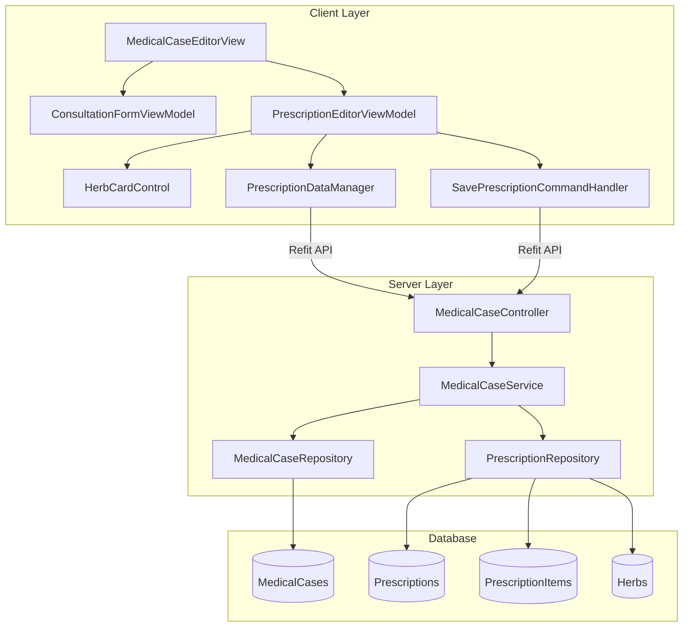

# 医案模块-处方功能增强技术设计文档

## 📋 元数据

- **Epic**: 医案模块完善
- **需求文档**: `docs/explanation/architecture/client/medicalcase-prescription-enhancement-requirements.md` (v1.1)
- **设计版本**: v1.0
- **创建日期**: 2025-11-20
- **架构验证**: 待验证
- **关键设计决策**: BF-002策略C混合方案（一体化界面 + 自动化流程 + UI状态管理）

## 🎯 设计目标

### 主要目标

1. **移植Formula模块的药材编辑体验** → Prescription模块
   - 7级智能拼音过滤算法(100/90/80/70/50/40/30分)
   - HerbCardControl卡片式UI组件
   - 键盘自动焦点管理(TextBox → Dosage → Next Card)

2. **集成价格计算功能**
   - 实时计算药材小计: `ItemAmount = UnitPrice × Dosage`
   - 实时计算处方总价: `TotalAmount = Σ(ItemAmount) × DosageCount × (1 - Discount)`
   - 价格快照机制,历史处方价格不受Herbs表变动影响

3. **支持经验方/历史处方导入**
   - 经验方导入: 从Formula列表选择模板
   - 历史处方导入: 从当前患者历史记录选择
   - 重复药材检测与一次性聚合提醒

4. **实现诊断+处方一体化界面** (BF-002兼容设计)
   - 左40%诊断区 + 右60%处方区
   - 通过UI状态管理实现BF-002三步流程
   - 保留时间戳审计 + 自动化流程推进

### 设计原则

**用户强调** (需求文档1.3):
> "医案模块的设计有一个重点是: **方便医生看诊**。(新建阶段的UI交互要简单明了)"

具体体现:
- 键盘操作优先,减少鼠标使用
- 拼音码输入,支持首字母快速匹配
- 自动焦点管理,无需手动切换
- 实时反馈,所见即所得

---

## 🏗️ 架构设计

### 核心架构约束

**三层架构参考** (需求文档AC-001):
- **前端(Client层)**: WPF + Prism 8.x + MVVM模式
- **后端(Server层)**: ASP.NET Core Web API + 三层架构
- **共享层(Shared层)**: DTO + Validators + Interfaces

**聚合根约束** (BR-001, AC-003):
- MedicalCase是聚合根
- Prescription和Consultation是聚合根子实体
- 所有Prescription CRUD操作必须通过 `/api/v1/medicalcases/{caseId}/...`

### 组件关系图



### 数据流设计

**典型流程: 新建处方**

```
1. 用户操作
   患者选择 → 医案录入页面(一体化界面) → 填写诊断 → 保存草稿

2. BF-002自动化流程触发 (策略C)
   SaveDraftCommand.Execute()
     ├─ await UpdateConsultationAsync()  // 保存诊断数据
     ├─ if (IsConsultationDataValid && !Step1Completed)
     │    await CompleteConsultationStep1Async()  // 自动设置Step1CompletedAt
     ├─ if (NeedsPrescription && !Step2Completed)
     │    await SetPrescriptionFlagAsync()  // 自动设置Step2CompletedAt
     └─ RefreshMedicalCase()  // 触发CanEditPrescription属性变化

3. UI状态自动响应
   CanEditPrescription = Step1Completed && Step2Completed && NeedsPrescription
     ├─ true  → 处方区解锁 (IsEnabled=true, Overlay消失)
     └─ false → 处方区禁用 (IsEnabled=false, 显示提示"请先完成辨证并保存")

4. 处方编辑
   添加药材 → 查询Herbs.Price → 计算ItemAmount → 更新TotalAmount

5. 保存处方
   SavePrescriptionCommand.Execute()
     ├─ Validate (至少1个药材, 剂量范围, 剂数范围)
     ├─ POST /api/v1/medicalcases/{caseId}/prescription
     ├─ 后端查询Herbs表重新计算价格
     ├─ 保存价格快照到PrescriptionItem.UnitPrice
     └─ 返回MedicalCaseDetailResponse

6. 完成病案
   CompleteCommand.Execute()
     ├─ Server端验证: Step1CompletedAt && Step2CompletedAt
     ├─ 如果NeedsPrescription=true, 验证Prescription存在
     └─ 更新MedicalCase.Status = Completed
```

### BF-002三步看诊流程 - 策略C设计方案

**设计理念**: 保留业务规则约束,废弃UI步骤界面,通过自动化流程实现

#### 1. 时间戳保留 (完全兼容BF-002)

```csharp
// Consultation实体 (不变)
public class Consultation
{
    public Guid Id { get; set; }
    public Guid MedicalCaseId { get; set; }

    // BF-002时间戳
    public DateTime? Step1CompletedAt { get; set; }  // 辨证完成时间
    public DateTime? Step2CompletedAt { get; set; }  // 标记处方需求时间

    // 诊断数据
    public string ChiefComplaint { get; set; }
    public string TCMDiagnosis { get; set; }
    // ...
}

// MedicalCase实体 (新增字段)
public class MedicalCase
{
    public Guid Id { get; set; }

    // BF-002新增字段
    public bool? NeedsPrescription { get; set; }  // 是否需要开处方

    // 关联
    public Consultation Consultation { get; set; }
    public Prescription Prescription { get; set; }
    // ...
}
```

#### 2. UI布局设计 (一体化界面)

```
┌─────────────────────────────────────────────────────────────┐
│ 医案录入页面 (患者: 张三, 病案ID: xxx)                      │
├──────────────────────┬──────────────────────────────────────┤
│ 诊断区 (左40%)       │ 处方区 (右60%)                       │
├──────────────────────┼──────────────────────────────────────┤
│ [主诉]               │ ⚠️ 提示Overlay (初始状态)            │
│ [现病史]             │ "请先完成辨证并保存"                  │
│ [中医诊断] *必填     │                                      │
│ [治疗原则]           │ (处方区IsEnabled=false)               │
│ [望闻问切]           │                                      │
│ [备注]               │                                      │
│                      │                                      │
│ ☑ 开处方 (RadioBox) │                                      │
│ ☐ 不开处方          │                                      │
└──────────────────────┴──────────────────────────────────────┘
│ [保存草稿] [保存并完成]                                      │
└─────────────────────────────────────────────────────────────┘

用户点击"保存草稿" → 自动完成Step1+Step2 → 处方区解锁

┌─────────────────────────────────────────────────────────────┐
│ 医案录入页面 (患者: 张三, 病案ID: xxx)                      │
├──────────────────────┬──────────────────────────────────────┤
│ 诊断区 (左40%)       │ 处方区 (右60%) ✅ 已解锁              │
├──────────────────────┼──────────────────────────────────────┤
│ [主诉] 已填写        │ [导入经验方] [导入历史处方] [添加药材]│
│ [中医诊断] 已填写    │ ┌─────────┬─────────┬─────────┬──────┐│
│                      │ │药材卡片1│药材卡片2│药材卡片3│...  ││
│ ☑ 开处方            │ └─────────┴─────────┴─────────┴──────┘│
│                      │ 剂数: [7] 折扣: [0%]                 │
│                      │ 药材总价: ¥450.00                    │
│                      │ 最终总价: ¥3,150.00                  │
└──────────────────────┴──────────────────────────────────────┘
│ [保存草稿] [保存并完成]                                      │
└─────────────────────────────────────────────────────────────┘
```

#### 3. ViewModel状态管理

```csharp
public class MedicalCaseFormViewModel : UnifiedViewModelBase
{
    // 数据绑定
    private MedicalCaseDetailDto? _medicalCase;
    private bool? _needsPrescription;

    // 状态属性 (基于BF-002时间戳)
    public bool IsConsultationCompleted =>
        _medicalCase?.Consultation?.Step1CompletedAt != null;

    public bool IsPrescriptionFlagSet =>
        _medicalCase?.Consultation?.Step2CompletedAt != null;

    public bool CanEditPrescription =>
        IsConsultationCompleted &&
        IsPrescriptionFlagSet &&
        _needsPrescription == true;

    // 命令
    public DelegateCommand SaveDraftCommand { get; }
    public DelegateCommand SaveAndCompleteCommand { get; }

    // 处方选择RadioBox绑定
    public bool? NeedsPrescription
    {
        get => _needsPrescription;
        set
        {
            if (SetProperty(ref _needsPrescription, value))
            {
                // 用户选择后,如果已完成Step1,立即触发Step2
                if (IsConsultationCompleted && value.HasValue && !IsPrescriptionFlagSet)
                {
                    _ = SetPrescriptionFlagAsync(value.Value);
                }
            }
        }
    }
}
```

#### 4. 自动化流程实现

```csharp
private async Task SaveDraftAsync()
{
    try
    {
        // 1. 保存诊断数据
        var consultationDto = new UpdateConsultationRequest
        {
            ChiefComplaint = this.ChiefComplaint,
            TCMDiagnosis = this.TCMDiagnosis,
            // ... 其他字段
        };

        await _apiClient.UpdateConsultationAsync(_medicalCaseId, consultationDto);

        // 2. 自动完成Step 1 (如果满足条件)
        if (!IsConsultationCompleted && IsConsultationDataValid())
        {
            await _apiClient.CompleteConsultationStep1Async(_medicalCaseId);
            _logger.LogInformation("自动完成Step 1: 辨证");
        }

        // 3. 自动完成Step 2 (如果已勾选处方选择)
        if (NeedsPrescription.HasValue && !IsPrescriptionFlagSet)
        {
            await _apiClient.SetPrescriptionFlagAsync(_medicalCaseId, NeedsPrescription.Value);
            _logger.LogInformation("自动完成Step 2: 标记处方需求 = {NeedsPrescription}", NeedsPrescription.Value);
        }

        // 4. 刷新医案状态
        await RefreshMedicalCaseAsync();

        // 此时CanEditPrescription属性自动更新,触发UI响应
        // 如果NeedsPrescription=true,处方区自动解锁

        _notificationService.ShowSuccess("草稿已保存");
    }
    catch (Exception ex)
    {
        _logger.LogError(ex, "保存草稿失败");
        _notificationService.ShowError($"保存失败: {ex.Message}");
    }
}

private bool IsConsultationDataValid()
{
    // Step1CompletedAt设置条件: 主诉 + 中医诊断必填
    return !string.IsNullOrWhiteSpace(ChiefComplaint) &&
           !string.IsNullOrWhiteSpace(TCMDiagnosis);
}

private async Task SetPrescriptionFlagAsync(bool needsPrescription)
{
    try
    {
        var request = new SetPrescriptionFlagRequest
        {
            NeedsPrescription = needsPrescription
        };

        await _apiClient.SetPrescriptionFlagAsync(_medicalCaseId, request);
        await RefreshMedicalCaseAsync();
    }
    catch (Exception ex)
    {
        _logger.LogError(ex, "设置处方标志失败");
    }
}
```

#### 5. XAML UI层实现

```xaml
<!-- 处方区 (右60%) -->
<Grid Grid.Column="1">
    <!-- 处方内容区 -->
    <StackPanel IsEnabled="{Binding CanEditPrescription}">
        <!-- 工具栏 -->
        <StackPanel Orientation="Horizontal" Margin="0,10">
            <Button Content="导入经验方" Command="{Binding ImportFormulaCommand}"/>
            <Button Content="导入历史处方" Command="{Binding ImportHistoryCommand}"/>
            <Button Content="添加药材" Command="{Binding AddHerbCommand}"/>
        </StackPanel>

        <!-- 药材卡片列表 -->
        <ItemsControl ItemsSource="{Binding PrescriptionItems}">
            <!-- ... -->
        </ItemsControl>

        <!-- 价格明细 -->
        <StackPanel Margin="0,10">
            <TextBlock Text="{Binding SubTotal, StringFormat='药材总价: ¥{0:N2}'}"/>
            <TextBlock Text="{Binding TotalAmount, StringFormat='最终总价: ¥{0:N2}'}"/>
        </StackPanel>
    </StackPanel>

    <!-- 未启用时的提示Overlay -->
    <Border Visibility="{Binding CanEditPrescription,
                         Converter={StaticResource InverseBoolToVisibility}}"
            Background="#F5F5F5" Opacity="0.95"
            VerticalAlignment="Center" HorizontalAlignment="Center"
            Padding="20" CornerRadius="8">
        <StackPanel>
            <TextBlock Text="💡 请先完成辨证并保存"
                       FontSize="16" Foreground="#666"
                       HorizontalAlignment="Center" Margin="0,0,0,8"/>
            <TextBlock Text="填写主诉和中医诊断后,点击'保存草稿'即可开处方"
                       FontSize="12" Foreground="#999"
                       HorizontalAlignment="Center" TextWrapping="Wrap"/>
        </StackPanel>
    </Border>
</Grid>
```

#### 6. Server端验证保留

```csharp
// MedicalCaseService.CompleteAsync()
public async Task<MedicalCase> CompleteAsync(Guid medicalCaseId)
{
    var medicalCase = await _repository.GetByIdAsync(medicalCaseId);

    if (medicalCase == null)
        throw new NotFoundException($"医案 {medicalCaseId} 不存在");

    // BF-002验证逻辑 (保持不变)
    if (medicalCase.Consultation?.Step1CompletedAt == null)
        throw new BusinessRuleException("未完成辨证 (Step 1)");

    if (medicalCase.Consultation?.Step2CompletedAt == null)
        throw new BusinessRuleException("未标记处方需求 (Step 2)");

    if (medicalCase.NeedsPrescription == true && medicalCase.Prescription == null)
        throw new BusinessRuleException("已标记需要处方,但未开具处方");

    medicalCase.Status = MedicalCaseStatus.Completed;
    medicalCase.UpdatedAt = DateTime.UtcNow;

    await _repository.UpdateAsync(medicalCase);

    return medicalCase;
}
```

### 聚合根边界

**聚合根**: MedicalCase

**聚合成员**:
- Consultation (辨证信息)
- Prescription (处方信息)
  - PrescriptionItems (处方药材项)

**Write操作约束**:
- 所有Consultation和Prescription的创建/更新/删除必须通过MedicalCase聚合根API
- 直接访问 `/api/v1/consultations` 或 `/api/v1/prescriptions` 返回 `410 Gone`

**Read操作独立性**:
- 查询操作可独立进行,无需通过聚合根
- `GET /api/v1/consultations/{id}` 允许
- `GET /api/v1/prescriptions/{id}` 允许

### 层级职责划分

**Presentation Layer (Controller)**:
- 处理HTTP请求和响应
- 参数验证和模型绑定
- 错误处理和状态码返回

**Application Layer (Service)**:
- 实现业务规则和流程控制
- 事务管理
- 调用Repository进行数据操作
- 业务异常抛出

**Data Access Layer (Repository)**:
- 管理聚合根持久化
- EF Core查询和更新
- Include预加载优化
- 内部可见性约束 (internal)

---

## 🔧 API端点设计

### Write Layer (写操作,通过聚合根)

#### 1. 更新病案辨证信息

- **端点**: `PUT /api/v1/medicalcases/{id}/consultation`
- **业务规则**: AR-001 (MedicalCase聚合根约束), BF-002 (三步看诊流程)
- **请求DTO**:
  ```csharp
  public class UpdateConsultationRequest
  {
      [Required(ErrorMessage = "主诉不能为空")]
      [MaxLength(500)]
      public string ChiefComplaint { get; set; }  // 主诉

      [MaxLength(2000)]
      public string? PresentIllness { get; set; }  // 现病史

      [Required(ErrorMessage = "中医诊断不能为空")]
      [MaxLength(500)]
      public string TCMDiagnosis { get; set; }  // 中医诊断

      [MaxLength(500)]
      public string? TreatmentPrinciple { get; set; }  // 治疗原则

      public string? Inspection { get; set; }  // 望诊
      public string? Auscultation { get; set; }  // 闻诊
      public string? Inquiry { get; set; }  // 问诊
      public string? Palpation { get; set; }  // 切诊

      [MaxLength(1000)]
      public string? Notes { get; set; }  // 备注
  }
  ```
- **响应DTO**: `MedicalCaseDetailResponse`
- **错误处理**:
  - 404: 医案不存在
  - 400: 医案状态不允许修改 (已完成的医案)
  - 422: 业务规则验证失败

#### 2. 自动完成辨证步骤 (Step 1)

- **端点**: `PUT /api/v1/medicalcases/{id}/consultation/complete-step1`
- **业务规则**: BF-002 (自动化流程,设置Step1CompletedAt)
- **请求体**: 无
- **响应DTO**: `MedicalCaseDetailResponse`
- **前置条件**:
  - Consultation.ChiefComplaint不为空
  - Consultation.TCMDiagnosis不为空
- **错误处理**:
  - 404: 医案不存在
  - 400: 辨证信息不完整

#### 3. 标记是否开处方 (Step 2)

- **端点**: `PUT /api/v1/medicalcases/{id}/prescription-flag`
- **业务规则**: BF-002 (开处方决策点,设置Step2CompletedAt), AR-003 (一诊断一处方)
- **请求DTO**:
  ```csharp
  public class SetPrescriptionFlagRequest
  {
      [Required]
      public bool NeedsPrescription { get; set; }
  }
  ```
- **响应DTO**: `MedicalCaseDetailResponse`
- **前置条件**:
  - Step1CompletedAt不为null
- **错误处理**:
  - 404: 医案不存在
  - 400: 未完成辨证 (Step 1)
  - 422: 已有处方,不能重复标记

#### 4. 创建处方 (Step 3)

- **端点**: `POST /api/v1/medicalcases/{caseId}/prescription`
- **业务规则**: AR-001 (聚合根约束), BR-003 (价格来源与快照), BR-005 (数据完整性)
- **请求DTO**: `PrescriptionInputDto` (详见DTO设计章节)
- **响应DTO**: `PrescriptionDetailResponse`
- **前置条件**:
  - Step1CompletedAt不为null
  - Step2CompletedAt不为null
  - NeedsPrescription = true
- **后端处理**:
  1. 验证所有药材项的HerbId存在于Herbs表
  2. 查询Herbs表获取UnitPrice
  3. 计算ItemAmount和TotalAmount
  4. 保存价格快照到PrescriptionItem
- **错误处理**:
  - 404: 医案不存在
  - 400: 未完成Step 1或Step 2
  - 422: 药材不存在或价格为null
  - 422: 剂量/剂数/折扣超出范围

#### 5. 更新处方

- **端点**: `PUT /api/v1/medicalcases/{caseId}/prescription`
- **业务规则**: AR-001 (聚合根约束), BR-003 (价格快照), BR-005 (数据完整性)
- **请求DTO**: `PrescriptionInputDto`
- **响应DTO**: `PrescriptionDetailResponse`
- **错误处理**: 同创建处方

#### 6. 完成医案 (Step 3)

- **端点**: `PUT /api/v1/medicalcases/{id}/complete`
- **业务规则**: BF-002 (三步验证)
- **请求体**: 无
- **响应DTO**: `MedicalCaseDetailResponse`
- **验证逻辑**:
  ```csharp
  if (medicalCase.Consultation?.Step1CompletedAt == null)
      throw new BusinessRuleException("未完成辨证 (Step 1)");

  if (medicalCase.Consultation?.Step2CompletedAt == null)
      throw new BusinessRuleException("未标记处方需求 (Step 2)");

  if (medicalCase.NeedsPrescription == true && medicalCase.Prescription == null)
      throw new BusinessRuleException("已标记需要处方,但未开具处方");
  ```

### Read Layer (读操作,独立查询)

#### 1. 获取医案详情

- **端点**: `GET /api/v1/medicalcases/{id}`
- **响应DTO**: `MedicalCaseDetailResponse` (包含Consultation和Prescription)
- **缓存策略**: 无 (实时数据)

#### 2. 查询辨证记录

- **端点**: `GET /api/v1/consultations/{id}`
- **响应DTO**: `ConsultationDto`

#### 3. 查询处方详情

- **端点**: `GET /api/v1/prescriptions/{id}`
- **响应DTO**: `PrescriptionDetailResponse`

#### 4. 查询经验方列表 (用于导入)

- **端点**: `GET /api/v1/formulas?search={keyword}&page={page}&pageSize={size}`
- **查询参数**:
  - `search`: 搜索关键词 (名称/主治)
  - `page`: 页码 (默认1)
  - `pageSize`: 每页数量 (默认20)
- **响应DTO**: `PagedResult<FormulaDto>`

#### 5. 查询患者历史处方列表 (用于导入)

- **端点**: `GET /api/v1/patients/{patientId}/prescriptions?diagnosisFilter={filter}`
- **查询参数**:
  - `diagnosisFilter`: 诊断关键词筛选 (可选)
- **响应DTO**: `List<PrescriptionHistoryDto>`
- **返回字段**:
  ```csharp
  public class PrescriptionHistoryDto
  {
      public Guid Id { get; set; }
      public DateTime ConsultationDate { get; set; }  // 看诊时间
      public string PatientName { get; set; }
      public string TCMDiagnosis { get; set; }  // 诊断
      public List<PrescriptionItemDto> Items { get; set; }  // 药材组成
  }
  ```

### Helper Layer (辅助功能)

#### 1. 验证医案是否可编辑

- **端点**: `GET /api/v1/medicalcases/{id}/can-edit`
- **响应DTO**:
  ```csharp
  public class CanEditResponse
  {
      public bool CanEdit { get; set; }
      public string? Reason { get; set; }  // 不允许时的原因
  }
  ```

#### 2. 查询药材列表 (用于拼音过滤)

- **端点**: `GET /api/v1/herbs?includePrice=true`
- **响应DTO**: `List<HerbDto>`
- **字段**:
  ```csharp
  public class HerbDto
  {
      public Guid Id { get; set; }
      public string Name { get; set; }
      public string PinYinCode { get; set; }  // 拼音码
      public string Unit { get; set; }  // 默认单位
      public decimal? Price { get; set; }  // 单价 (可选)
  }
  ```

---

## 📦 DTO设计

### 请求DTO

#### UpdateConsultationRequest

```csharp
namespace LYBT.Shared.Models.Contracts.MedicalCases;

/// <summary>
/// 更新辨证信息请求DTO
/// </summary>
public class UpdateConsultationRequest
{
    /// <summary>主诉 (必填)</summary>
    [Required(ErrorMessage = "主诉不能为空")]
    [MaxLength(500, ErrorMessage = "主诉长度不能超过500字符")]
    public string ChiefComplaint { get; set; } = string.Empty;

    /// <summary>现病史</summary>
    [MaxLength(2000)]
    public string? PresentIllness { get; set; }

    /// <summary>中医诊断 (必填)</summary>
    [Required(ErrorMessage = "中医诊断不能为空")]
    [MaxLength(500)]
    public string TCMDiagnosis { get; set; } = string.Empty;

    /// <summary>治疗原则</summary>
    [MaxLength(500)]
    public string? TreatmentPrinciple { get; set; }

    /// <summary>望诊</summary>
    public string? Inspection { get; set; }

    /// <summary>闻诊</summary>
    public string? Auscultation { get; set; }

    /// <summary>问诊</summary>
    public string? Inquiry { get; set; }

    /// <summary>切诊</summary>
    public string? Palpation { get; set; }

    /// <summary>备注</summary>
    [MaxLength(1000)]
    public string? Notes { get; set; }
}
```

#### SetPrescriptionFlagRequest

```csharp
namespace LYBT.Shared.Models.Contracts.MedicalCases;

/// <summary>
/// 标记处方需求请求DTO
/// </summary>
public class SetPrescriptionFlagRequest
{
    /// <summary>是否需要开处方</summary>
    [Required(ErrorMessage = "必须明确是否开处方")]
    public bool NeedsPrescription { get; set; }
}
```

#### PrescriptionInputDto

```csharp
namespace LYBT.Shared.Models.Contracts.Prescriptions;

/// <summary>
/// 处方输入DTO - 统一创建和更新
/// Epic #1736: InputDto Pattern
/// </summary>
public class PrescriptionInputDto
{
    /// <summary>处方ID (更新时必填,创建时为null)</summary>
    public Guid? Id { get; set; }

    /// <summary>剂数 (1-30)</summary>
    [Required]
    [Range(1, 30, ErrorMessage = "剂数必须在1-30之间")]
    public int DosageCount { get; set; } = 7;

    /// <summary>折扣 (0-1, 0表示无折扣)</summary>
    [Range(0, 1, ErrorMessage = "折扣必须在0-1之间")]
    public decimal Discount { get; set; } = 0;

    /// <summary>药材项列表</summary>
    [Required]
    [MinLength(1, ErrorMessage = "至少需要1个药材项")]
    public List<PrescriptionItemInputDto> Items { get; set; } = new();
}
```

#### PrescriptionItemInputDto

```csharp
namespace LYBT.Shared.Models.Contracts.Prescriptions;

/// <summary>
/// 处方药材项输入DTO
/// </summary>
public class PrescriptionItemInputDto
{
    /// <summary>药材ID</summary>
    [Required(ErrorMessage = "药材不能为空")]
    public Guid HerbId { get; set; }

    /// <summary>药材名称 (冗余,方便前端显示)</summary>
    [Required]
    [MaxLength(100)]
    public string HerbName { get; set; } = string.Empty;

    /// <summary>单剂用量</summary>
    [Required]
    [Range(0.1, 500, ErrorMessage = "用量必须在0.1-500之间")]
    public decimal Dosage { get; set; }

    /// <summary>单位</summary>
    [Required]
    [MaxLength(10)]
    public string Unit { get; set; } = "g";

    /// <summary>备注 (例如: 酒炒、后下)</summary>
    [MaxLength(500)]
    public string? Notes { get; set; }
}
```

**注意**: UnitPrice和ItemAmount不在InputDto中,由后端查询Herbs表并计算。

### 响应DTO

#### MedicalCaseDetailResponse

```csharp
namespace LYBT.Shared.Models.Contracts.MedicalCases;

/// <summary>
/// 医案详情响应DTO
/// </summary>
public class MedicalCaseDetailResponse
{
    public Guid Id { get; set; }
    public Guid PatientId { get; set; }

    // 患者信息
    public PatientDto Patient { get; set; } = null!;

    // 辨证信息
    public ConsultationDto? Consultation { get; set; }

    // 处方信息
    public PrescriptionDetailDto? Prescription { get; set; }

    // 医案状态
    public string Status { get; set; } = string.Empty;

    // BF-002字段
    public bool? NeedsPrescription { get; set; }

    // 时间戳
    public DateTime CreatedAt { get; set; }
    public DateTime? UpdatedAt { get; set; }
}
```

#### ConsultationDto

```csharp
namespace LYBT.Shared.Models.Contracts.Consultations;

/// <summary>
/// 辨证信息DTO
/// </summary>
public class ConsultationDto
{
    public Guid Id { get; set; }
    public Guid MedicalCaseId { get; set; }

    // 诊断数据
    public string ChiefComplaint { get; set; } = string.Empty;
    public string? PresentIllness { get; set; }
    public string TCMDiagnosis { get; set; } = string.Empty;
    public string? TreatmentPrinciple { get; set; }
    public string? Inspection { get; set; }
    public string? Auscultation { get; set; }
    public string? Inquiry { get; set; }
    public string? Palpation { get; set; }
    public string? Notes { get; set; }

    // BF-002时间戳
    public DateTime? Step1CompletedAt { get; set; }
    public DateTime? Step2CompletedAt { get; set; }
}
```

#### PrescriptionDetailResponse

```csharp
namespace LYBT.Shared.Models.Contracts.Prescriptions;

/// <summary>
/// 处方详情响应DTO
/// </summary>
public class PrescriptionDetailResponse
{
    public Guid Id { get; set; }
    public Guid MedicalCaseId { get; set; }

    // 处方参数
    public int DosageCount { get; set; }
    public decimal Discount { get; set; }

    // 价格信息
    public decimal SubTotal { get; set; }  // 药材总价 (单剂)
    public decimal TotalAmount { get; set; }  // 最终总价

    // 药材项
    public List<PrescriptionItemDto> Items { get; set; } = new();

    // 状态
    public bool IsConfirmed { get; set; }

    // 时间戳
    public DateTime CreatedAt { get; set; }
    public DateTime UpdatedAt { get; set; }
}
```

#### PrescriptionItemDto

```csharp
namespace LYBT.Shared.Models.Contracts.Prescriptions;

/// <summary>
/// 处方药材项DTO
/// </summary>
public class PrescriptionItemDto
{
    public Guid Id { get; set; }
    public Guid HerbId { get; set; }
    public string HerbName { get; set; } = string.Empty;
    public decimal Dosage { get; set; }
    public string Unit { get; set; } = string.Empty;

    // 价格快照
    public decimal UnitPrice { get; set; }
    public decimal ItemAmount { get; set; }  // UnitPrice × Dosage

    public string? Notes { get; set; }
}
```

### Entity到DTO映射关系

#### AutoMapper配置

```csharp
namespace LYBT.Shared.Models.Mappings;

public class MedicalCaseMappingProfile : Profile
{
    public MedicalCaseMappingProfile()
    {
        // Entity → Response DTO
        CreateMap<MedicalCase, MedicalCaseDetailResponse>()
            .ForMember(dest => dest.Patient, opt => opt.MapFrom(src => src.Patient))
            .ForMember(dest => dest.Consultation, opt => opt.MapFrom(src => src.Consultation))
            .ForMember(dest => dest.Prescription, opt => opt.MapFrom(src => src.Prescription))
            .ForMember(dest => dest.Status, opt => opt.MapFrom(src => src.Status.ToString()));

        CreateMap<Consultation, ConsultationDto>();

        CreateMap<Prescription, PrescriptionDetailResponse>()
            .ForMember(dest => dest.SubTotal,
                opt => opt.MapFrom(src => src.PrescriptionItems.Sum(i => i.ItemAmount)))
            .ForMember(dest => dest.Items, opt => opt.MapFrom(src => src.PrescriptionItems));

        CreateMap<PrescriptionItem, PrescriptionItemDto>();

        // Request DTO → Entity (用于更新)
        CreateMap<UpdateConsultationRequest, Consultation>()
            .ForMember(dest => dest.Id, opt => opt.Ignore())
            .ForMember(dest => dest.MedicalCaseId, opt => opt.Ignore())
            .ForMember(dest => dest.Step1CompletedAt, opt => opt.Ignore())
            .ForMember(dest => dest.Step2CompletedAt, opt => opt.Ignore());

        CreateMap<PrescriptionItemInputDto, PrescriptionItem>()
            .ForMember(dest => dest.Id, opt => opt.Ignore())
            .ForMember(dest => dest.PrescriptionId, opt => opt.Ignore())
            .ForMember(dest => dest.UnitPrice, opt => opt.Ignore())  // 后端查询
            .ForMember(dest => dest.ItemAmount, opt => opt.Ignore());  // 后端计算
    }
}
```

---

## 🗄️ 数据库Schema

### 表结构调整

#### MedicalCases表 (新增字段)

```sql
-- 新增BF-002相关字段
ALTER TABLE MedicalCases
ADD NeedsPrescription BIT NULL;  -- 是否需要开处方 (NULL表示未标记)

-- 索引优化
CREATE INDEX IX_MedicalCases_NeedsPrescription
ON MedicalCases(NeedsPrescription)
WHERE NeedsPrescription IS NOT NULL;
```

#### Consultations表 (新增字段)

```sql
-- 新增BF-002时间戳字段
ALTER TABLE Consultations
ADD Step1CompletedAt DATETIME2 NULL,  -- 辨证完成时间
    Step2CompletedAt DATETIME2 NULL;  -- 标记处方需求时间

-- 索引优化
CREATE INDEX IX_Consultations_Step1CompletedAt
ON Consultations(Step1CompletedAt);

CREATE INDEX IX_Consultations_Step2CompletedAt
ON Consultations(Step2CompletedAt);
```

#### Prescriptions表 (已存在,无需调整)

```sql
-- 验证现有字段
SELECT
    COLUMN_NAME,
    DATA_TYPE,
    CHARACTER_MAXIMUM_LENGTH,
    IS_NULLABLE
FROM INFORMATION_SCHEMA.COLUMNS
WHERE TABLE_NAME = 'Prescriptions';

-- 预期字段:
-- Id (uniqueidentifier)
-- MedicalCaseId (uniqueidentifier)
-- DosageCount (int)
-- Discount (decimal(18,2))
-- TotalAmount (decimal(18,2))
-- IsConfirmed (bit)
-- CreatedAt (datetime2)
-- UpdatedAt (datetime2)
```

#### PrescriptionItems表 (已存在,无需调整)

```sql
-- 验证现有字段
SELECT
    COLUMN_NAME,
    DATA_TYPE,
    CHARACTER_MAXIMUM_LENGTH,
    IS_NULLABLE
FROM INFORMATION_SCHEMA.COLUMNS
WHERE TABLE_NAME = 'PrescriptionItems';

-- 预期字段:
-- Id (uniqueidentifier)
-- PrescriptionId (uniqueidentifier)
-- HerbId (uniqueidentifier)
-- HerbName (nvarchar(100))
-- Dosage (decimal(18,2))
-- Unit (nvarchar(10))
-- UnitPrice (decimal(18,2))  -- 价格快照
-- ItemAmount (decimal(18,2))  -- UnitPrice × Dosage
-- Notes (nvarchar(500))
```

### 数据迁移脚本

#### Migration: AddBF002Fields

```csharp
namespace LYBT.Infrastructure.Migrations;

public partial class AddBF002Fields : Migration
{
    protected override void Up(MigrationBuilder migrationBuilder)
    {
        // MedicalCases表新增NeedsPrescription字段
        migrationBuilder.AddColumn<bool>(
            name: "NeedsPrescription",
            table: "MedicalCases",
            type: "bit",
            nullable: true);

        // Consultations表新增BF-002时间戳字段
        migrationBuilder.AddColumn<DateTime>(
            name: "Step1CompletedAt",
            table: "Consultations",
            type: "datetime2",
            nullable: true);

        migrationBuilder.AddColumn<DateTime>(
            name: "Step2CompletedAt",
            table: "Consultations",
            type: "datetime2",
            nullable: true);

        // 索引创建
        migrationBuilder.CreateIndex(
            name: "IX_MedicalCases_NeedsPrescription",
            table: "MedicalCases",
            column: "NeedsPrescription",
            filter: "[NeedsPrescription] IS NOT NULL");

        migrationBuilder.CreateIndex(
            name: "IX_Consultations_Step1CompletedAt",
            table: "Consultations",
            column: "Step1CompletedAt");

        migrationBuilder.CreateIndex(
            name: "IX_Consultations_Step2CompletedAt",
            table: "Consultations",
            column: "Step2CompletedAt");
    }

    protected override void Down(MigrationBuilder migrationBuilder)
    {
        // 删除索引
        migrationBuilder.DropIndex(
            name: "IX_Consultations_Step2CompletedAt",
            table: "Consultations");

        migrationBuilder.DropIndex(
            name: "IX_Consultations_Step1CompletedAt",
            table: "Consultations");

        migrationBuilder.DropIndex(
            name: "IX_MedicalCases_NeedsPrescription",
            table: "MedicalCases");

        // 删除列
        migrationBuilder.DropColumn(
            name: "Step2CompletedAt",
            table: "Consultations");

        migrationBuilder.DropColumn(
            name: "Step1CompletedAt",
            table: "Consultations");

        migrationBuilder.DropColumn(
            name: "NeedsPrescription",
            table: "MedicalCases");
    }
}
```

---

## 💻 代码示例

### Controller代码示例

```csharp
namespace LYBT.Server.Presentation.Controllers;

/// <summary>
/// 医案聚合根Controller
/// </summary>
[ApiController]
[Route("api/v1/medicalcases")]
[Authorize(Roles = "Doctor,Admin")]
public class MedicalCaseController : ControllerBase
{
    private readonly IMedicalCaseService _medicalCaseService;
    private readonly IMapper _mapper;
    private readonly ILogger<MedicalCaseController> _logger;

    public MedicalCaseController(
        IMedicalCaseService medicalCaseService,
        IMapper mapper,
        ILogger<MedicalCaseController> logger)
    {
        _medicalCaseService = medicalCaseService;
        _mapper = mapper;
        _logger = logger;
    }

    /// <summary>
    /// 更新病案辨证信息
    /// </summary>
    /// <param name="id">病案ID</param>
    /// <param name="request">辨证信息</param>
    /// <returns>更新后的病案详情</returns>
    [HttpPut("{id}/consultation")]
    [ProducesResponseType(typeof(MedicalCaseDetailResponse), StatusCodes.Status200OK)]
    [ProducesResponseType(StatusCodes.Status404NotFound)]
    [ProducesResponseType(StatusCodes.Status422UnprocessableEntity)]
    public async Task<ActionResult<MedicalCaseDetailResponse>> UpdateConsultation(
        Guid id,
        [FromBody] UpdateConsultationRequest request)
    {
        try
        {
            // 业务规则引用: AR-001 (通过聚合根操作)
            var medicalCase = await _medicalCaseService.UpdateConsultationAsync(id, request);

            if (medicalCase == null)
            {
                return NotFound(new { Message = $"医案 {id} 不存在" });
            }

            var response = _mapper.Map<MedicalCaseDetailResponse>(medicalCase);
            return Ok(response);
        }
        catch (BusinessRuleException ex)
        {
            _logger.LogWarning(ex, "业务规则验证失败: {Message}", ex.Message);
            return UnprocessableEntity(new { Message = ex.Message });
        }
        catch (Exception ex)
        {
            _logger.LogError(ex, "更新辨证信息失败: MedicalCaseId={MedicalCaseId}", id);
            return StatusCode(500, new { Message = "服务器内部错误" });
        }
    }

    /// <summary>
    /// 自动完成辨证步骤 (Step 1)
    /// </summary>
    [HttpPut("{id}/consultation/complete-step1")]
    [ProducesResponseType(typeof(MedicalCaseDetailResponse), StatusCodes.Status200OK)]
    public async Task<ActionResult<MedicalCaseDetailResponse>> CompleteConsultationStep1(Guid id)
    {
        try
        {
            // 业务规则引用: BF-002 (自动化流程)
            var medicalCase = await _medicalCaseService.CompleteConsultationStep1Async(id);

            if (medicalCase == null)
            {
                return NotFound(new { Message = $"医案 {id} 不存在" });
            }

            var response = _mapper.Map<MedicalCaseDetailResponse>(medicalCase);
            return Ok(response);
        }
        catch (BusinessRuleException ex)
        {
            _logger.LogWarning(ex, "完成Step 1失败: {Message}", ex.Message);
            return UnprocessableEntity(new { Message = ex.Message });
        }
    }

    /// <summary>
    /// 标记是否开处方 (Step 2)
    /// </summary>
    [HttpPut("{id}/prescription-flag")]
    [ProducesResponseType(typeof(MedicalCaseDetailResponse), StatusCodes.Status200OK)]
    public async Task<ActionResult<MedicalCaseDetailResponse>> SetPrescriptionFlag(
        Guid id,
        [FromBody] SetPrescriptionFlagRequest request)
    {
        try
        {
            // 业务规则引用: BF-002 (开处方决策点)
            var medicalCase = await _medicalCaseService.SetPrescriptionFlagAsync(id, request.NeedsPrescription);

            if (medicalCase == null)
            {
                return NotFound(new { Message = $"医案 {id} 不存在" });
            }

            var response = _mapper.Map<MedicalCaseDetailResponse>(medicalCase);
            return Ok(response);
        }
        catch (BusinessRuleException ex)
        {
            _logger.LogWarning(ex, "设置处方标志失败: {Message}", ex.Message);
            return UnprocessableEntity(new { Message = ex.Message });
        }
    }

    /// <summary>
    /// 创建处方 (Step 3)
    /// </summary>
    [HttpPost("{caseId}/prescription")]
    [ProducesResponseType(typeof(PrescriptionDetailResponse), StatusCodes.Status201Created)]
    public async Task<ActionResult<PrescriptionDetailResponse>> CreatePrescription(
        Guid caseId,
        [FromBody] PrescriptionInputDto dto)
    {
        try
        {
            // 业务规则引用: AR-001 (聚合根约束), BR-003 (价格来源), BR-005 (数据完整性)
            var prescription = await _medicalCaseService.CreatePrescriptionAsync(caseId, dto);

            var response = _mapper.Map<PrescriptionDetailResponse>(prescription);
            return CreatedAtAction(
                nameof(GetPrescription),
                new { caseId, prescriptionId = prescription.Id },
                response);
        }
        catch (BusinessRuleException ex)
        {
            _logger.LogWarning(ex, "创建处方失败: {Message}", ex.Message);
            return UnprocessableEntity(new { Message = ex.Message });
        }
    }

    /// <summary>
    /// 更新处方
    /// </summary>
    [HttpPut("{caseId}/prescription")]
    [ProducesResponseType(typeof(PrescriptionDetailResponse), StatusCodes.Status200OK)]
    public async Task<ActionResult<PrescriptionDetailResponse>> UpdatePrescription(
        Guid caseId,
        [FromBody] PrescriptionInputDto dto)
    {
        try
        {
            var prescription = await _medicalCaseService.UpdatePrescriptionAsync(caseId, dto);

            var response = _mapper.Map<PrescriptionDetailResponse>(prescription);
            return Ok(response);
        }
        catch (BusinessRuleException ex)
        {
            _logger.LogWarning(ex, "更新处方失败: {Message}", ex.Message);
            return UnprocessableEntity(new { Message = ex.Message });
        }
    }

    /// <summary>
    /// 完成医案 (Step 3)
    /// </summary>
    [HttpPut("{id}/complete")]
    [ProducesResponseType(typeof(MedicalCaseDetailResponse), StatusCodes.Status200OK)]
    public async Task<ActionResult<MedicalCaseDetailResponse>> CompleteMedicalCase(Guid id)
    {
        try
        {
            // 业务规则引用: BF-002 (三步验证)
            var medicalCase = await _medicalCaseService.CompleteAsync(id);

            var response = _mapper.Map<MedicalCaseDetailResponse>(medicalCase);
            return Ok(response);
        }
        catch (BusinessRuleException ex)
        {
            _logger.LogWarning(ex, "完成医案失败: {Message}", ex.Message);
            return UnprocessableEntity(new { Message = ex.Message });
        }
    }

    /// <summary>
    /// 获取医案详情
    /// </summary>
    [HttpGet("{id}")]
    [ProducesResponseType(typeof(MedicalCaseDetailResponse), StatusCodes.Status200OK)]
    public async Task<ActionResult<MedicalCaseDetailResponse>> GetMedicalCase(Guid id)
    {
        var medicalCase = await _medicalCaseService.GetByIdAsync(id);

        if (medicalCase == null)
        {
            return NotFound(new { Message = $"医案 {id} 不存在" });
        }

        var response = _mapper.Map<MedicalCaseDetailResponse>(medicalCase);
        return Ok(response);
    }

    /// <summary>
    /// 获取处方详情
    /// </summary>
    [HttpGet("{caseId}/prescription")]
    [ProducesResponseType(typeof(PrescriptionDetailResponse), StatusCodes.Status200OK)]
    public async Task<ActionResult<PrescriptionDetailResponse>> GetPrescription(Guid caseId)
    {
        var prescription = await _medicalCaseService.GetPrescriptionAsync(caseId);

        if (prescription == null)
        {
            return NotFound(new { Message = $"医案 {caseId} 没有处方" });
        }

        var response = _mapper.Map<PrescriptionDetailResponse>(prescription);
        return Ok(response);
    }
}
```

### Service代码示例

```csharp
namespace LYBT.Server.Application.Services;

/// <summary>
/// 医案聚合根Service
/// </summary>
public class MedicalCaseService : IMedicalCaseService
{
    private readonly IMedicalCaseRepository _medicalCaseRepository;
    private readonly IHerbRepository _herbRepository;
    private readonly IMapper _mapper;
    private readonly ILogger<MedicalCaseService> _logger;

    public MedicalCaseService(
        IMedicalCaseRepository medicalCaseRepository,
        IHerbRepository herbRepository,
        IMapper mapper,
        ILogger<MedicalCaseService> logger)
    {
        _medicalCaseRepository = medicalCaseRepository;
        _herbRepository = herbRepository;
        _mapper = mapper;
        _logger = logger;
    }

    public async Task<MedicalCase?> UpdateConsultationAsync(
        Guid medicalCaseId,
        UpdateConsultationRequest request)
    {
        // 1. 获取聚合根
        var medicalCase = await _medicalCaseRepository.GetByIdAsync(medicalCaseId);
        if (medicalCase == null)
        {
            return null;
        }

        // 2. 业务规则验证: 只有进行中或暂存的医案可以修改
        if (medicalCase.Status != MedicalCaseStatus.InProgress &&
            medicalCase.Status != MedicalCaseStatus.Saved)
        {
            throw new BusinessRuleException("只有进行中或暂存的医案可以修改辨证信息");
        }

        // 3. 通过聚合根方法修改 (遵循AR-001)
        if (medicalCase.Consultation == null)
        {
            medicalCase.Consultation = new Consultation
            {
                Id = Guid.NewGuid(),
                MedicalCaseId = medicalCaseId
            };
        }

        _mapper.Map(request, medicalCase.Consultation);
        medicalCase.UpdatedAt = DateTime.UtcNow;

        // 4. 持久化
        await _medicalCaseRepository.UpdateAsync(medicalCase);

        _logger.LogInformation("更新辨证信息成功: MedicalCaseId={MedicalCaseId}", medicalCaseId);

        return medicalCase;
    }

    public async Task<MedicalCase?> CompleteConsultationStep1Async(Guid medicalCaseId)
    {
        var medicalCase = await _medicalCaseRepository.GetByIdAsync(medicalCaseId);
        if (medicalCase == null)
        {
            return null;
        }

        // 业务规则验证: 主诉和中医诊断必填
        if (medicalCase.Consultation == null ||
            string.IsNullOrWhiteSpace(medicalCase.Consultation.ChiefComplaint) ||
            string.IsNullOrWhiteSpace(medicalCase.Consultation.TCMDiagnosis))
        {
            throw new BusinessRuleException("主诉和中医诊断不能为空");
        }

        // 设置Step1CompletedAt
        medicalCase.Consultation.Step1CompletedAt = DateTime.UtcNow;
        medicalCase.UpdatedAt = DateTime.UtcNow;

        await _medicalCaseRepository.UpdateAsync(medicalCase);

        _logger.LogInformation("完成Step 1: MedicalCaseId={MedicalCaseId}", medicalCaseId);

        return medicalCase;
    }

    public async Task<MedicalCase?> SetPrescriptionFlagAsync(
        Guid medicalCaseId,
        bool needsPrescription)
    {
        var medicalCase = await _medicalCaseRepository.GetByIdAsync(medicalCaseId);
        if (medicalCase == null)
        {
            return null;
        }

        // 业务规则验证: 必须先完成Step 1
        if (medicalCase.Consultation?.Step1CompletedAt == null)
        {
            throw new BusinessRuleException("必须先完成辨证 (Step 1)");
        }

        // 业务规则验证: AR-003 (一诊断一处方)
        if (needsPrescription && medicalCase.Prescription != null)
        {
            throw new BusinessRuleException("该医案已有处方,不能重复标记");
        }

        medicalCase.NeedsPrescription = needsPrescription;
        medicalCase.Consultation.Step2CompletedAt = DateTime.UtcNow;
        medicalCase.UpdatedAt = DateTime.UtcNow;

        await _medicalCaseRepository.UpdateAsync(medicalCase);

        _logger.LogInformation("完成Step 2: MedicalCaseId={MedicalCaseId}, NeedsPrescription={NeedsPrescription}",
            medicalCaseId, needsPrescription);

        return medicalCase;
    }

    public async Task<Prescription> CreatePrescriptionAsync(
        Guid medicalCaseId,
        PrescriptionInputDto dto)
    {
        var medicalCase = await _medicalCaseRepository.GetByIdAsync(medicalCaseId);
        if (medicalCase == null)
        {
            throw new NotFoundException($"医案 {medicalCaseId} 不存在");
        }

        // 业务规则验证: BF-002 (必须完成Step 1和Step 2)
        if (medicalCase.Consultation?.Step1CompletedAt == null)
        {
            throw new BusinessRuleException("未完成辨证 (Step 1)");
        }

        if (medicalCase.Consultation?.Step2CompletedAt == null)
        {
            throw new BusinessRuleException("未标记处方需求 (Step 2)");
        }

        if (medicalCase.NeedsPrescription != true)
        {
            throw new BusinessRuleException("该医案未标记需要开处方");
        }

        // 业务规则验证: AR-003 (一诊断一处方)
        if (medicalCase.Prescription != null)
        {
            throw new BusinessRuleException("该医案已有处方,不能重复创建");
        }

        // 创建处方实体
        var prescription = new Prescription
        {
            Id = Guid.NewGuid(),
            MedicalCaseId = medicalCaseId,
            DosageCount = dto.DosageCount,
            Discount = dto.Discount,
            IsConfirmed = false,  // 初始为草稿
            CreatedAt = DateTime.UtcNow,
            UpdatedAt = DateTime.UtcNow,
            PrescriptionItems = new List<PrescriptionItem>()
        };

        // 处理药材项
        foreach (var itemDto in dto.Items)
        {
            // 查询Herbs表获取单价 (BR-003: 价格来源)
            var herb = await _herbRepository.GetByIdAsync(itemDto.HerbId);
            if (herb == null)
            {
                throw new BusinessRuleException($"药材 {itemDto.HerbName} 不存在");
            }

            if (herb.Price == null || herb.Price <= 0)
            {
                throw new BusinessRuleException($"药材 {itemDto.HerbName} 没有设置价格");
            }

            // 创建药材项 (保存价格快照)
            var item = new PrescriptionItem
            {
                Id = Guid.NewGuid(),
                PrescriptionId = prescription.Id,
                HerbId = itemDto.HerbId,
                HerbName = itemDto.HerbName,
                Dosage = itemDto.Dosage,
                Unit = itemDto.Unit,
                UnitPrice = herb.Price.Value,  // 价格快照
                ItemAmount = herb.Price.Value * itemDto.Dosage,  // 计算小计
                Notes = itemDto.Notes
            };

            prescription.PrescriptionItems.Add(item);
        }

        // 计算总价 (BR-005: 后端验证)
        var subTotal = prescription.PrescriptionItems.Sum(i => i.ItemAmount);
        prescription.TotalAmount = subTotal * prescription.DosageCount * (1 - prescription.Discount);

        // 通过聚合根保存
        medicalCase.Prescription = prescription;
        await _medicalCaseRepository.UpdateAsync(medicalCase);

        _logger.LogInformation("创建处方成功: MedicalCaseId={MedicalCaseId}, PrescriptionId={PrescriptionId}, TotalAmount={TotalAmount}",
            medicalCaseId, prescription.Id, prescription.TotalAmount);

        return prescription;
    }

    public async Task<Prescription> UpdatePrescriptionAsync(
        Guid medicalCaseId,
        PrescriptionInputDto dto)
    {
        var medicalCase = await _medicalCaseRepository.GetByIdAsync(medicalCaseId);
        if (medicalCase == null)
        {
            throw new NotFoundException($"医案 {medicalCaseId} 不存在");
        }

        if (medicalCase.Prescription == null)
        {
            throw new NotFoundException($"医案 {medicalCaseId} 没有处方");
        }

        var prescription = medicalCase.Prescription;

        // 更新处方参数
        prescription.DosageCount = dto.DosageCount;
        prescription.Discount = dto.Discount;
        prescription.UpdatedAt = DateTime.UtcNow;

        // 清空旧药材项
        prescription.PrescriptionItems.Clear();

        // 重新添加药材项 (逻辑同CreatePrescriptionAsync)
        foreach (var itemDto in dto.Items)
        {
            var herb = await _herbRepository.GetByIdAsync(itemDto.HerbId);
            if (herb == null)
            {
                throw new BusinessRuleException($"药材 {itemDto.HerbName} 不存在");
            }

            if (herb.Price == null || herb.Price <= 0)
            {
                throw new BusinessRuleException($"药材 {itemDto.HerbName} 没有设置价格");
            }

            var item = new PrescriptionItem
            {
                Id = Guid.NewGuid(),
                PrescriptionId = prescription.Id,
                HerbId = itemDto.HerbId,
                HerbName = itemDto.HerbName,
                Dosage = itemDto.Dosage,
                Unit = itemDto.Unit,
                UnitPrice = herb.Price.Value,
                ItemAmount = herb.Price.Value * itemDto.Dosage,
                Notes = itemDto.Notes
            };

            prescription.PrescriptionItems.Add(item);
        }

        // 重新计算总价
        var subTotal = prescription.PrescriptionItems.Sum(i => i.ItemAmount);
        prescription.TotalAmount = subTotal * prescription.DosageCount * (1 - prescription.Discount);

        await _medicalCaseRepository.UpdateAsync(medicalCase);

        _logger.LogInformation("更新处方成功: PrescriptionId={PrescriptionId}, TotalAmount={TotalAmount}",
            prescription.Id, prescription.TotalAmount);

        return prescription;
    }

    public async Task<MedicalCase> CompleteAsync(Guid medicalCaseId)
    {
        var medicalCase = await _medicalCaseRepository.GetByIdAsync(medicalCaseId);

        if (medicalCase == null)
        {
            throw new NotFoundException($"医案 {medicalCaseId} 不存在");
        }

        // BF-002验证逻辑 (保持不变)
        if (medicalCase.Consultation?.Step1CompletedAt == null)
        {
            throw new BusinessRuleException("未完成辨证 (Step 1)");
        }

        if (medicalCase.Consultation?.Step2CompletedAt == null)
        {
            throw new BusinessRuleException("未标记处方需求 (Step 2)");
        }

        if (medicalCase.NeedsPrescription == true && medicalCase.Prescription == null)
        {
            throw new BusinessRuleException("已标记需要处方,但未开具处方");
        }

        // 完成医案
        medicalCase.Status = MedicalCaseStatus.Completed;
        medicalCase.UpdatedAt = DateTime.UtcNow;

        // 如果有处方,标记为正式保存
        if (medicalCase.Prescription != null)
        {
            medicalCase.Prescription.IsConfirmed = true;
        }

        await _medicalCaseRepository.UpdateAsync(medicalCase);

        _logger.LogInformation("完成医案成功: MedicalCaseId={MedicalCaseId}", medicalCaseId);

        return medicalCase;
    }

    public async Task<MedicalCase?> GetByIdAsync(Guid id)
    {
        return await _medicalCaseRepository.GetByIdAsync(id);
    }

    public async Task<Prescription?> GetPrescriptionAsync(Guid medicalCaseId)
    {
        var medicalCase = await _medicalCaseRepository.GetByIdAsync(medicalCaseId);
        return medicalCase?.Prescription;
    }
}
```

### Repository代码示例

```csharp
namespace LYBT.Server.Infrastructure.Repositories;

/// <summary>
/// 医案聚合根Repository (internal可见性)
/// Epic #1600: Repository Visibility Constraint
/// </summary>
internal class MedicalCaseRepository : IMedicalCaseRepository
{
    private readonly ApplicationDbContext _context;
    private readonly ILogger<MedicalCaseRepository> _logger;

    public MedicalCaseRepository(
        ApplicationDbContext context,
        ILogger<MedicalCaseRepository> logger)
    {
        _context = context;
        _logger = logger;
    }

    public async Task<MedicalCase?> GetByIdAsync(Guid id)
    {
        // 加载聚合根及其成员 (Include预加载优化)
        return await _context.MedicalCases
            .Include(m => m.Patient)
            .Include(m => m.Consultation)
            .Include(m => m.Prescription)
                .ThenInclude(p => p.PrescriptionItems)
            .FirstOrDefaultAsync(m => m.Id == id);
    }

    public async Task<MedicalCase> CreateAsync(MedicalCase medicalCase)
    {
        _context.MedicalCases.Add(medicalCase);
        await _context.SaveChangesAsync();

        _logger.LogInformation("创建医案成功: MedicalCaseId={MedicalCaseId}", medicalCase.Id);

        return medicalCase;
    }

    public async Task UpdateAsync(MedicalCase medicalCase)
    {
        _context.MedicalCases.Update(medicalCase);
        await _context.SaveChangesAsync();

        _logger.LogDebug("更新医案成功: MedicalCaseId={MedicalCaseId}", medicalCase.Id);
    }

    public async Task DeleteAsync(Guid id)
    {
        var medicalCase = await _context.MedicalCases.FindAsync(id);
        if (medicalCase != null)
        {
            _context.MedicalCases.Remove(medicalCase);
            await _context.SaveChangesAsync();

            _logger.LogInformation("删除医案成功: MedicalCaseId={MedicalCaseId}", id);
        }
    }
}
```

### ViewModel代码示例 (Client端)

```csharp
namespace LYBT.Desktop.MedicalCase.ViewModels;

/// <summary>
/// 医案表单ViewModel - 一体化界面 (诊断+处方)
/// </summary>
public class MedicalCaseFormViewModel : UnifiedViewModelBase
{
    private readonly IMedicalCaseApiClient _apiClient;
    private readonly IHerbRepository _herbRepository;
    private readonly ILogger<MedicalCaseFormViewModel> _logger;
    private readonly INotificationService _notificationService;

    private MedicalCaseDetailDto? _medicalCase;
    private Guid _medicalCaseId;

    // 诊断区数据绑定
    private string? _chiefComplaint;
    private string? _tcmDiagnosis;
    private bool? _needsPrescription;

    // 处方区数据绑定
    private ObservableCollection<PrescriptionItemViewModel> _prescriptionItems = new();
    private int _dosageCount = 7;
    private decimal _discount = 0;

    public MedicalCaseFormViewModel(
        IMedicalCaseApiClient apiClient,
        IHerbRepository herbRepository,
        ILogger<MedicalCaseFormViewModel> logger,
        INotificationService notificationService)
    {
        _apiClient = apiClient;
        _herbRepository = herbRepository;
        _logger = logger;
        _notificationService = notificationService;

        // 命令初始化
        SaveDraftCommand = new DelegateCommand(async () => await SaveDraftAsync(), CanSaveDraft);
        SaveAndCompleteCommand = new DelegateCommand(async () => await SaveAndCompleteAsync(), CanSaveAndComplete);
        AddHerbCommand = new DelegateCommand(AddHerb, () => CanEditPrescription);
        ImportFormulaCommand = new DelegateCommand(async () => await ImportFormulaAsync(), () => CanEditPrescription);
        ImportHistoryCommand = new DelegateCommand(async () => await ImportHistoryPrescriptionAsync(), () => CanEditPrescription);
    }

    #region 状态属性 (基于BF-002时间戳)

    /// <summary>
    /// 辨证是否完成 (Step 1)
    /// </summary>
    public bool IsConsultationCompleted =>
        _medicalCase?.Consultation?.Step1CompletedAt != null;

    /// <summary>
    /// 处方标志是否设置 (Step 2)
    /// </summary>
    public bool IsPrescriptionFlagSet =>
        _medicalCase?.Consultation?.Step2CompletedAt != null;

    /// <summary>
    /// 是否可编辑处方 (策略C核心属性)
    /// </summary>
    public bool CanEditPrescription =>
        IsConsultationCompleted &&
        IsPrescriptionFlagSet &&
        _needsPrescription == true;

    #endregion

    #region 诊断区属性

    public string? ChiefComplaint
    {
        get => _chiefComplaint;
        set => SetProperty(ref _chiefComplaint, value);
    }

    public string? TCMDiagnosis
    {
        get => _tcmDiagnosis;
        set => SetProperty(ref _tcmDiagnosis, value);
    }

    /// <summary>
    /// 处方选择RadioBox绑定
    /// </summary>
    public bool? NeedsPrescription
    {
        get => _needsPrescription;
        set
        {
            if (SetProperty(ref _needsPrescription, value))
            {
                // 用户选择后,如果已完成Step1,立即触发Step2
                if (IsConsultationCompleted && value.HasValue && !IsPrescriptionFlagSet)
                {
                    _ = SetPrescriptionFlagAsync(value.Value);
                }

                // 更新命令可用性
                AddHerbCommand.RaiseCanExecuteChanged();
                ImportFormulaCommand.RaiseCanExecuteChanged();
                ImportHistoryCommand.RaiseCanExecuteChanged();
            }
        }
    }

    #endregion

    #region 处方区属性

    public ObservableCollection<PrescriptionItemViewModel> PrescriptionItems
    {
        get => _prescriptionItems;
        set => SetProperty(ref _prescriptionItems, value);
    }

    public int DosageCount
    {
        get => _dosageCount;
        set
        {
            if (SetProperty(ref _dosageCount, value))
            {
                RaisePropertyChanged(nameof(TotalAmount));
            }
        }
    }

    public decimal Discount
    {
        get => _discount;
        set
        {
            if (SetProperty(ref _discount, value))
            {
                RaisePropertyChanged(nameof(TotalAmount));
            }
        }
    }

    /// <summary>
    /// 药材总价 (单剂)
    /// </summary>
    public decimal SubTotal =>
        PrescriptionItems.Sum(i => i.ItemAmount);

    /// <summary>
    /// 最终总价 (计算属性)
    /// </summary>
    public decimal TotalAmount =>
        SubTotal * DosageCount * (1 - Discount);

    #endregion

    #region 命令

    public DelegateCommand SaveDraftCommand { get; }
    public DelegateCommand SaveAndCompleteCommand { get; }
    public DelegateCommand AddHerbCommand { get; }
    public DelegateCommand ImportFormulaCommand { get; }
    public DelegateCommand ImportHistoryCommand { get; }

    #endregion

    #region 命令实现

    private async Task SaveDraftAsync()
    {
        try
        {
            IsBusy = true;

            // 1. 保存诊断数据
            var consultationDto = new UpdateConsultationRequest
            {
                ChiefComplaint = this.ChiefComplaint ?? string.Empty,
                TCMDiagnosis = this.TCMDiagnosis ?? string.Empty,
                // ... 其他字段
            };

            await _apiClient.UpdateConsultationAsync(_medicalCaseId, consultationDto);

            // 2. 自动完成Step 1 (如果满足条件)
            if (!IsConsultationCompleted && IsConsultationDataValid())
            {
                await _apiClient.CompleteConsultationStep1Async(_medicalCaseId);
                _logger.LogInformation("自动完成Step 1: 辨证");
            }

            // 3. 自动完成Step 2 (如果已勾选处方选择)
            if (NeedsPrescription.HasValue && !IsPrescriptionFlagSet)
            {
                await _apiClient.SetPrescriptionFlagAsync(_medicalCaseId, NeedsPrescription.Value);
                _logger.LogInformation("自动完成Step 2: 标记处方需求 = {NeedsPrescription}", NeedsPrescription.Value);
            }

            // 4. 刷新医案状态
            await RefreshMedicalCaseAsync();

            // 此时CanEditPrescription属性自动更新,触发UI响应
            RaisePropertyChanged(nameof(IsConsultationCompleted));
            RaisePropertyChanged(nameof(IsPrescriptionFlagSet));
            RaisePropertyChanged(nameof(CanEditPrescription));

            // 5. 如果有处方数据,保存处方草稿
            if (CanEditPrescription && PrescriptionItems.Any())
            {
                await SavePrescriptionDraftAsync();
            }

            _notificationService.ShowSuccess("草稿已保存");
        }
        catch (Exception ex)
        {
            _logger.LogError(ex, "保存草稿失败");
            _notificationService.ShowError($"保存失败: {ex.Message}");
        }
        finally
        {
            IsBusy = false;
        }
    }

    private async Task SaveAndCompleteAsync()
    {
        try
        {
            IsBusy = true;

            // 1. 保存草稿
            await SaveDraftAsync();

            // 2. 如果需要处方,保存正式处方
            if (NeedsPrescription == true)
            {
                if (!PrescriptionItems.Any())
                {
                    _notificationService.ShowWarning("请至少添加1个药材");
                    return;
                }

                await SavePrescriptionAsync();
            }

            // 3. 完成医案
            await _apiClient.CompleteMedicalCaseAsync(_medicalCaseId);

            _notificationService.ShowSuccess("医案已完成");

            // 4. 导航回列表
            NavigateToMedicalCaseList();
        }
        catch (Exception ex)
        {
            _logger.LogError(ex, "保存并完成失败");
            _notificationService.ShowError($"保存失败: {ex.Message}");
        }
        finally
        {
            IsBusy = false;
        }
    }

    private void AddHerb()
    {
        var newItem = new PrescriptionItemViewModel(_herbRepository, _logger);
        newItem.PropertyChanged += (s, e) =>
        {
            if (e.PropertyName == nameof(PrescriptionItemViewModel.ItemAmount))
            {
                RaisePropertyChanged(nameof(SubTotal));
                RaisePropertyChanged(nameof(TotalAmount));
            }
        };

        PrescriptionItems.Add(newItem);

        _logger.LogDebug("添加药材卡片: Total={Total}", PrescriptionItems.Count);
    }

    private async Task ImportFormulaAsync()
    {
        // 打开经验方导入对话框
        var dialog = new FormulaImportDialog();
        var result = await dialog.ShowAsync();

        if (result == null) return;

        // 导入经验方药材
        foreach (var herbItem in result.HerbItems)
        {
            // 查询当前价格 (BR-006: 使用当前Herbs表价格)
            var herb = await _herbRepository.GetByIdAsync(herbItem.HerbId);
            if (herb == null)
            {
                _logger.LogWarning("导入经验方时药材不存在: HerbId={HerbId}", herbItem.HerbId);
                continue;
            }

            // 检测重复药材
            var existingItem = PrescriptionItems.FirstOrDefault(i => i.HerbId == herbItem.HerbId);
            if (existingItem != null)
            {
                // 取最大剂量 (FR-013: 重复药材合并规则)
                if (herbItem.Dosage > existingItem.Dosage)
                {
                    existingItem.Dosage = herbItem.Dosage;
                }
            }
            else
            {
                // 新增药材项
                var newItem = new PrescriptionItemViewModel(_herbRepository, _logger)
                {
                    HerbId = herbItem.HerbId,
                    HerbName = herbItem.HerbName,
                    Dosage = herbItem.Dosage,
                    Unit = herbItem.Unit,
                    UnitPrice = herb.Price ?? 0
                };

                newItem.PropertyChanged += (s, e) =>
                {
                    if (e.PropertyName == nameof(PrescriptionItemViewModel.ItemAmount))
                    {
                        RaisePropertyChanged(nameof(SubTotal));
                        RaisePropertyChanged(nameof(TotalAmount));
                    }
                };

                PrescriptionItems.Add(newItem);
            }
        }

        // 显示一次性聚合提醒 (如果有重复)
        // TODO: 实现聚合提醒对话框

        _notificationService.ShowSuccess($"已导入经验方: {result.FormulaName}");
    }

    private async Task ImportHistoryPrescriptionAsync()
    {
        // 打开历史处方导入对话框
        var dialog = new HistoryPrescriptionImportDialog(_medicalCase!.PatientId);
        var result = await dialog.ShowAsync();

        if (result == null) return;

        // 导入历史处方药材 (逻辑同ImportFormulaAsync)
        // BR-006: 使用当前Herbs表价格,不使用历史快照
        // FR-013: 重复药材取最大剂量

        _notificationService.ShowSuccess($"已导入历史处方: {result.ConsultationDate:yyyy-MM-dd}");
    }

    #endregion

    #region 辅助方法

    private bool IsConsultationDataValid()
    {
        // Step1CompletedAt设置条件: 主诉 + 中医诊断必填
        return !string.IsNullOrWhiteSpace(ChiefComplaint) &&
               !string.IsNullOrWhiteSpace(TCMDiagnosis);
    }

    private async Task SetPrescriptionFlagAsync(bool needsPrescription)
    {
        try
        {
            var request = new SetPrescriptionFlagRequest
            {
                NeedsPrescription = needsPrescription
            };

            await _apiClient.SetPrescriptionFlagAsync(_medicalCaseId, request);
            await RefreshMedicalCaseAsync();

            _logger.LogInformation("设置处方标志成功: NeedsPrescription={NeedsPrescription}", needsPrescription);
        }
        catch (Exception ex)
        {
            _logger.LogError(ex, "设置处方标志失败");
        }
    }

    private async Task RefreshMedicalCaseAsync()
    {
        _medicalCase = await _apiClient.GetMedicalCaseByIdAsync(_medicalCaseId);
    }

    private async Task SavePrescriptionDraftAsync()
    {
        var dto = new PrescriptionInputDto
        {
            Id = _medicalCase?.Prescription?.Id,  // 更新时传递ID,创建时为null
            DosageCount = this.DosageCount,
            Discount = this.Discount,
            Items = PrescriptionItems.Select(i => new PrescriptionItemInputDto
            {
                HerbId = i.HerbId,
                HerbName = i.HerbName,
                Dosage = i.Dosage,
                Unit = i.Unit,
                Notes = i.Notes
            }).ToList()
        };

        if (dto.Id == null)
        {
            await _apiClient.CreatePrescriptionAsync(_medicalCaseId, dto);
        }
        else
        {
            await _apiClient.UpdatePrescriptionAsync(_medicalCaseId, dto);
        }
    }

    private async Task SavePrescriptionAsync()
    {
        // 保存正式处方 (IsConfirmed=true在CompleteAsync时设置)
        await SavePrescriptionDraftAsync();
    }

    private bool CanSaveDraft()
    {
        return !IsBusy && !string.IsNullOrWhiteSpace(ChiefComplaint);
    }

    private bool CanSaveAndComplete()
    {
        return !IsBusy && IsConsultationDataValid();
    }

    private void NavigateToMedicalCaseList()
    {
        // TODO: 导航逻辑
    }

    #endregion
}
```

### 7级拼音过滤算法实现

```csharp
namespace LYBT.Desktop.Prescriptions.Services;

/// <summary>
/// 处方药材拼音过滤管理器
/// 参考实现: FormulaHerbItemViewModel.GetMatchScore()
/// </summary>
public class PrescriptionHerbFilterManager
{
    private readonly ILogger<PrescriptionHerbFilterManager> _logger;

    public PrescriptionHerbFilterManager(ILogger<PrescriptionHerbFilterManager> logger)
    {
        _logger = logger;
    }

    /// <summary>
    /// 7级智能拼音过滤
    /// </summary>
    /// <param name="allHerbs">所有药材列表</param>
    /// <param name="searchText">搜索文本</param>
    /// <returns>前5个匹配结果,按分数排序</returns>
    public List<HerbDto> FilterHerbs(List<HerbDto> allHerbs, string searchText)
    {
        if (string.IsNullOrWhiteSpace(searchText))
        {
            return new List<HerbDto>();
        }

        var lowerSearch = searchText.ToLower().Trim();

        // 计算所有药材的匹配分数
        var scoredHerbs = allHerbs
            .Select(herb => new
            {
                Herb = herb,
                Score = GetMatchScore(herb, lowerSearch)
            })
            .Where(x => x.Score > 0)  // 只保留有分数的
            .OrderByDescending(x => x.Score)  // 按分数降序
            .ThenBy(x => x.Herb.Name)  // 同分数按名称升序
            .Take(5)  // 最多5个结果
            .Select(x => x.Herb)
            .ToList();

        _logger.LogDebug("拼音过滤: SearchText={SearchText}, Results={Count}",
            searchText, scoredHerbs.Count);

        return scoredHerbs;
    }

    /// <summary>
    /// 7级评分算法
    /// </summary>
    private int GetMatchScore(HerbDto herb, string searchText)
    {
        if (string.IsNullOrWhiteSpace(searchText))
            return 0;

        var herbName = herb.Name?.ToLower() ?? string.Empty;
        var pinyinCode = herb.PinYinCode?.ToLower() ?? string.Empty;

        // 1. Exact name match: 100 points
        if (herbName == searchText)
            return 100;

        // 2. Exact pinyin match: 90 points
        if (!string.IsNullOrEmpty(pinyinCode) && pinyinCode == searchText)
            return 90;

        // 3. Name prefix match: 80 points
        if (herbName.StartsWith(searchText))
            return 80;

        // 4. Pinyin prefix match: 70 points
        if (!string.IsNullOrEmpty(pinyinCode) && pinyinCode.StartsWith(searchText))
            return 70;

        // 5. Name contains match: 50 points
        if (herbName.Contains(searchText))
            return 50;

        // 6. Pinyin contains match: 40 points
        if (!string.IsNullOrEmpty(pinyinCode) && pinyinCode.Contains(searchText))
            return 40;

        // 7. Pinyin fuzzy match: 30 points
        if (!string.IsNullOrEmpty(pinyinCode) && IsPinyinFuzzyMatch(pinyinCode, searchText))
            return 30;

        return 0;
    }

    /// <summary>
    /// 拼音模糊匹配 (首字母跳跃)
    /// 例如: "dg" 可以匹配 "danggui" (d_a_n_g_g_u_i)
    /// </summary>
    private bool IsPinyinFuzzyMatch(string pinyinCode, string searchText)
    {
        if (string.IsNullOrEmpty(pinyinCode) || string.IsNullOrEmpty(searchText))
            return false;

        int searchIndex = 0;
        foreach (char c in pinyinCode)
        {
            if (searchIndex < searchText.Length && c == searchText[searchIndex])
            {
                searchIndex++;
            }

            if (searchIndex == searchText.Length)
            {
                return true;
            }
        }

        return searchIndex == searchText.Length;
    }

    /// <summary>
    /// 判断是否精确匹配 (用于自动隐藏下拉列表)
    /// </summary>
    public bool IsExactMatch(HerbDto herb, string searchText)
    {
        if (string.IsNullOrWhiteSpace(searchText))
            return false;

        var lowerSearch = searchText.ToLower().Trim();
        var herbName = herb.Name?.ToLower() ?? string.Empty;

        return herbName == lowerSearch;
    }
}
```

---

## 📋 Phase拆分

### Phase 1: 数据层与BF-002基础 (预计4-5天)

**目标**: 完成数据库Schema调整、Entity更新、DTO定义、BF-002基础API

**任务清单**:
- [ ] **数据库Schema**:
  - [ ] MedicalCases表新增NeedsPrescription字段
  - [ ] Consultations表新增Step1CompletedAt、Step2CompletedAt字段
  - [ ] 创建Migration脚本: AddBF002Fields
  - [ ] 执行Migration并验证
- [ ] **Entity模型更新**:
  - [ ] MedicalCase.NeedsPrescription属性
  - [ ] Consultation.Step1CompletedAt属性
  - [ ] Consultation.Step2CompletedAt属性
- [ ] **DTO定义** (Shared层):
  - [ ] UpdateConsultationRequest
  - [ ] SetPrescriptionFlagRequest
  - [ ] PrescriptionInputDto
  - [ ] PrescriptionItemInputDto
  - [ ] ConsultationDto
  - [ ] PrescriptionDetailResponse
- [ ] **AutoMapper配置**:
  - [ ] MedicalCaseMappingProfile
  - [ ] 验证映射关系测试
- [ ] **Repository接口更新**:
  - [ ] IMedicalCaseRepository.GetByIdAsync (Include优化)
  - [ ] IMedicalCaseRepository.UpdateAsync

**验收标准**:
- ✅ Migration脚本可正常执行,数据库字段正确
- ✅ Entity和DTO映射测试通过
- ✅ 编译通过: 0 errors, 0 warnings
- ✅ Repository单元测试通过

---

### Phase 2: 业务逻辑与API实现 (预计5-6天)

**目标**: 实现MedicalCaseService业务方法、Controller端点、BF-002验证逻辑

**任务清单**:
- [ ] **Service层实现** (Server/Application):
  - [ ] MedicalCaseService.UpdateConsultationAsync
  - [ ] MedicalCaseService.CompleteConsultationStep1Async
  - [ ] MedicalCaseService.SetPrescriptionFlagAsync
  - [ ] MedicalCaseService.CreatePrescriptionAsync
  - [ ] MedicalCaseService.UpdatePrescriptionAsync
  - [ ] MedicalCaseService.CompleteAsync (BF-002验证)
- [ ] **业务规则验证实现**:
  - [ ] AR-001: 聚合根约束
  - [ ] BF-002: 三步看诊流程验证
  - [ ] AR-003: 一诊断一处方
  - [ ] BR-003: 价格来源与快照
  - [ ] BR-005: 数据完整性验证
- [ ] **Controller端点实现** (Server/Presentation):
  - [ ] PUT /api/v1/medicalcases/{id}/consultation
  - [ ] PUT /api/v1/medicalcases/{id}/consultation/complete-step1
  - [ ] PUT /api/v1/medicalcases/{id}/prescription-flag
  - [ ] POST /api/v1/medicalcases/{caseId}/prescription
  - [ ] PUT /api/v1/medicalcases/{caseId}/prescription
  - [ ] PUT /api/v1/medicalcases/{id}/complete
  - [ ] GET /api/v1/medicalcases/{id}
  - [ ] GET /api/v1/medicalcases/{caseId}/prescription
- [ ] **错误处理**:
  - [ ] BusinessRuleException统一处理
  - [ ] 400/404/422/500错误响应
- [ ] **单元测试**:
  - [ ] MedicalCaseServiceTests (业务规则验证)
  - [ ] MedicalCaseControllerTests (集成测试)
- [ ] **Postman/Swagger测试**:
  - [ ] 测试完整流程: 创建医案 → 辨证 → 标记 → 开处方 → 完成

**验收标准**:
- ✅ 编译通过: 0 errors, 0 warnings
- ✅ Service层单元测试覆盖率 ≥ 80%
- ✅ 所有API端点Postman测试通过
- ✅ BF-002验证逻辑正确 (Step1/Step2时间戳验证)

---

### Phase 3: Client端UI与交互 (预计6-7天)

**目标**: 实现一体化界面、7级拼音过滤、HerbCardControl、键盘导航

**任务清单**:
- [ ] **一体化界面XAML** (MedicalCaseEditorView):
  - [ ] 左40%诊断区布局
  - [ ] 右60%处方区布局
  - [ ] 处方区Overlay提示层 (软禁用)
  - [ ] IsEnabled绑定到CanEditPrescription
  - [ ] 底部按钮区: [保存草稿] [保存并完成]
- [ ] **ViewModel实现** (MedicalCaseFormViewModel):
  - [ ] 状态属性: IsConsultationCompleted, IsPrescriptionFlagSet, CanEditPrescription
  - [ ] 诊断区属性绑定: ChiefComplaint, TCMDiagnosis, NeedsPrescription
  - [ ] 处方区属性绑定: PrescriptionItems, DosageCount, Discount, SubTotal, TotalAmount
  - [ ] SaveDraftCommand实现 (自动化Step1+Step2)
  - [ ] SaveAndCompleteCommand实现
  - [ ] AddHerbCommand, ImportFormulaCommand, ImportHistoryCommand
- [ ] **HerbCardControl组件** (Shared/Components):
  - [ ] 复制Formula模块的HerbCardControl.xaml
  - [ ] 添加IsPriceVisible依赖属性
  - [ ] UnitPrice和ItemAmount绑定
  - [ ] 删除按钮 (编辑模式)
- [ ] **PrescriptionItemViewModel**:
  - [ ] HerbId, HerbName, Dosage, Unit, UnitPrice, ItemAmount属性
  - [ ] ItemAmount计算属性 (UnitPrice × Dosage)
  - [ ] PropertyChanged触发TotalAmount更新
- [ ] **7级拼音过滤** (PrescriptionHerbFilterManager):
  - [ ] GetMatchScore算法 (100/90/80/70/50/40/30分)
  - [ ] IsPinyinFuzzyMatch算法
  - [ ] FilterHerbs方法 (返回前5个结果)
- [ ] **键盘导航**:
  - [ ] Enter键焦点跳转: HerbName → Dosage → Next Card
  - [ ] 自动创建新卡片 (最后一个卡片Enter时)
  - [ ] Tab键切换支持
- [ ] **经验方导入对话框** (FormulaImportDialog):
  - [ ] 左右分栏布局 (40% + 60%)
  - [ ] 经验方列表 + 搜索框
  - [ ] 经验方详情显示
  - [ ] 导入操作实现
- [ ] **历史处方导入对话框** (HistoryPrescriptionImportDialog):
  - [ ] 左右分栏布局
  - [ ] 历史处方列表 + 筛选框
  - [ ] 处方详情显示
  - [ ] 导入操作实现 (使用当前价格)
- [ ] **重复药材聚合提醒** (DuplicateHerbAlertDialog):
  - [ ] 一次性聚合提醒对话框
  - [ ] 显示所有重复项: "当归: 10g → 15g"
  - [ ] 合并规则: Math.Max(currentDosage, importedDosage)

**验收标准**:
- ✅ 编译通过: 0 errors, 0 warnings
- ✅ UI功能测试通过:
  - [ ] 诊断区填写 → 保存草稿 → 处方区自动解锁
  - [ ] 全程使用键盘完成10个药材录入
  - [ ] 拼音过滤: 输入"dg"匹配到"当归"
  - [ ] 价格实时计算正确
  - [ ] 经验方导入成功
  - [ ] 历史处方导入成功 (使用当前价格)
  - [ ] 重复药材聚合提醒显示正确
- ✅ 端到端功能测试通过
- ✅ 数据库状态验证通过 (Step1CompletedAt, Step2CompletedAt)

---

### Phase 4: 测试与优化 (预计3-4天)

**目标**: 单元测试补充、性能优化、文档同步

**任务清单**:
- [ ] **单元测试补充**:
  - [ ] PrescriptionHerbFilterManagerTests (7级拼音算法)
  - [ ] MedicalCaseFormViewModelTests (状态管理)
  - [ ] PrescriptionServiceTests (价格计算)
- [ ] **性能优化**:
  - [ ] 拼音过滤响应时间 < 100ms
  - [ ] UI渲染帧率 ≥ 60fps
  - [ ] Repository Include预加载优化
  - [ ] 价格计算O(1)复杂度
- [ ] **文档同步**:
  - [ ] 更新 `docs/explanation/architecture/server/README.md` (MedicalCase模块API)
  - [ ] 更新 `docs/explanation/architecture/client/README.md` (一体化界面设计)
  - [ ] 更新 `docs/explanation/business-rules.md` (BF-002策略C说明)
  - [ ] 更新 `docs/index.md` (导航链接)
- [ ] **代码质量检查**:
  - [ ] 运行lybtzyzs-code-review skill
  - [ ] 修复所有严重问题和警告
  - [ ] XML注释补充
- [ ] **架构合规性检查**:
  - [ ] 运行lybtzyzs-arch-compliance skill
  - [ ] 验证聚合根API路径
  - [ ] 验证Repository可见性 (internal)

**验收标准**:
- ✅ 单元测试覆盖率 ≥ 80%
- ✅ 性能指标达标
- ✅ 文档同步完成
- ✅ Code Review通过
- ✅ 架构合规性检查通过

---

## ✅ 质量标准

### 编译要求

**标准**: 0 errors, 0 warnings

**验证命令**:
```bash
dotnet build LYBT.All.sln -c Release --no-restore
```

**检查点**:
- Server层: LYBT.Server.Application, LYBT.Server.Presentation, LYBT.Server.Infrastructure
- Client层: LYBT.Desktop.MedicalCase, LYBT.Desktop.Prescriptions
- Shared层: LYBT.Shared.Models

### 测试要求

**单元测试覆盖率**:
- Service层 ≥ 80%
- Repository层 ≥ 70%
- ViewModel层 ≥ 75%

**集成测试**:
- 所有API端点必须有Postman/Swagger测试
- BF-002完整流程测试 (Step1 → Step2 → Step3)

**E2E测试**:
- 诊断 → 标记 → 开处方 → 保存 → 完成 (完整用户流程)

### 性能要求

**API响应时间**:
- P95 < 200ms (单个请求)
- POST /prescription (含10个药材) < 500ms

**UI性能**:
- 拼音过滤响应时间 < 100ms
- 价格实时计算延迟 < 50ms
- UI渲染帧率 ≥ 60fps

**数据库查询**:
- 避免N+1查询,使用Include预加载
- Repository.GetByIdAsync使用ThenInclude加载完整聚合根

### 安全要求

**角色权限**:
- 处方创建: 仅Doctor角色
- 处方查看: Doctor和Admin角色

**价格数据保护**:
- UnitPrice不在前端硬编码
- 价格计算在后端验证
- 保存时后端重新计算TotalAmount,忽略前端传递的值

### 文档要求

**架构文档**:
- 更新 `docs/explanation/architecture/server/README.md` (MedicalCase API)
- 更新 `docs/explanation/architecture/client/README.md` (一体化界面)
- 更新 `docs/explanation/business-rules.md` (BF-002策略C)

**API文档**:
- Swagger注释完整 (所有端点)
- 错误响应示例 (400/404/422/500)

**导航索引**:
- 更新 `docs/index.md` (相关链接)

---

## 📚 参考资料

### 需求文档
- `docs/explanation/architecture/client/medicalcase-prescription-enhancement-requirements.md` (v1.1)

### 架构指南
- `docs/explanation/architecture/server/README.md` - 后端三层架构
- `docs/explanation/architecture/client/README.md` - 前端MVVM架构
- `docs/explanation/architecture/shared/README.md` - 共享层设计
- `docs/explanation/business-rules.md` - 14条核心业务规则

### 架构决策记录
- `docs/adr/ADR-006-aggregate-root-pattern.md` - 聚合根模式

### MVP约束
- `docs/reference/mvp-constraints.md` - 技术黑名单

### Formula模块参考
- `src/Client/Desktop/Modules/LYBT.Desktop.Formula/ViewModels/FormulaHerbItemViewModel.cs` (7级拼音算法)
- `src/Client/Desktop/Modules/LYBT.Desktop.Formula/Controls/HerbCardControl.xaml` (卡片组件)

---

## 🔄 后续步骤

1. **设计评审**: 与技术负责人评审本设计文档
2. **任务分解**: 使用lybtzyzs-task-breakdown生成详细任务清单
3. **Issue创建**: 使用lybtzyzs-issue-template批量创建GitHub Issues
4. **实施跟踪**: 按照Phase顺序实施,Issue-Driven开发
5. **Code Review**: 每个Phase完成后调用lybtzyzs-code-review
6. **架构验证**: 完成后调用lybtzyzs-arch-compliance验证

---

**文档状态**: ✅ 设计完成,待架构验证
**下一步**: 运行lybtzyzs-design-arch-validator验证架构合规性
**责任人**: Claude Code (AI Assistant)
**审核人**: TonyShou

---

## 变更记录

| 日期 | 版本 | 变更内容 | 变更人 |
|------|------|----------|--------|
| 2025-11-20 | v1.0 | 初始版本,完成完整技术设计,集成BF-002策略C方案 | Claude Code |
