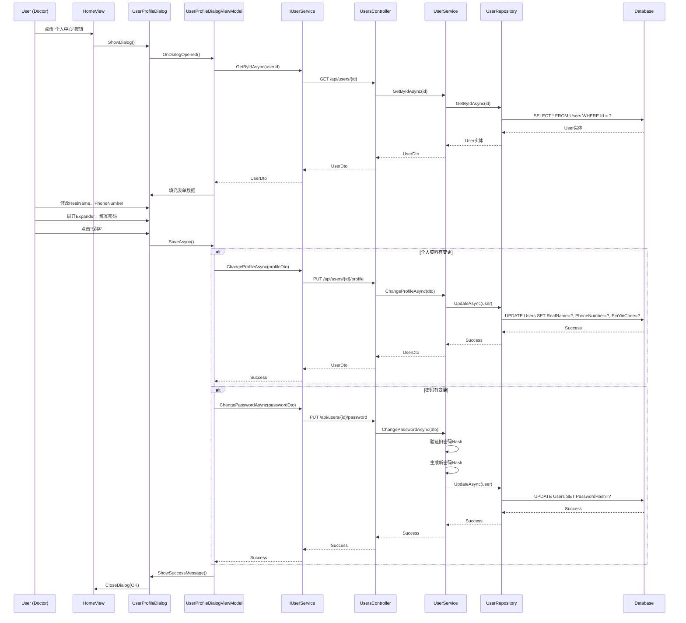
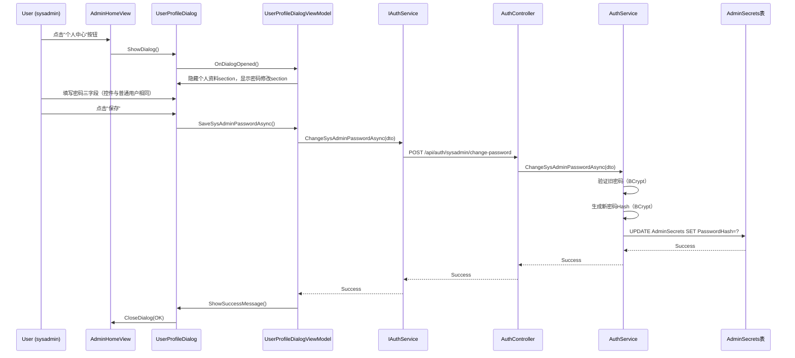

# 用户信息修改功能 - 技术设计文档

## 📐 设计概览

### 需求来源
- **需求文档**: `user-profile-modification-discussion.md`
- **功能范围**: 用户自己修改个人资料（sysadmin仅密码，Admin/Doctor资料+密码）
- **UI入口**: AdminHomeView 和 ClinicalHomeView 顶部用户信息栏
- **重要说明**: sysadmin不在Users表中，使用单独的AuthService.ChangeSysAdminPasswordAsync API

### 架构模式
- **Client端**: MVVM模式（WPF + Prism）
- **Server端**: 三层架构（Controller → Service → Repository）
- **通信**: RESTful API（JSON格式）
- **数据流**: Client ViewModel → IUserService → HttpClient → Server Controller → UserService → Repository → EF Core

---

## 🎯 设计决策

### 决策1: DTO复用策略
**问题**: 是否复用现有DTO（ChangePasswordDto、ChangeProfileDto）还是新建统一DTO？

**决策**: **复用现有DTO**（方案A）

**理由**:
1. ✅ 职责单一：密码修改和资料修改分离
2. ✅ ChangePasswordDto已验证可用（包含旧密码验证）
3. ✅ 符合Constitution：拒绝过度设计，简单直接
4. ✅ 减少Server端改动（ChangePasswordDto可能已有API）

**修改内容**:
- 简化ChangeProfileDto：移除Avatar、Bio字段（User实体中不存在）
- 保留字段：UserId、RealName、PhoneNumber、Email

### 决策2: PinYinCode自动生成策略
**问题**: 用户修改RealName时，PinYinCode是否自动更新？

**决策**: **Server端自动生成**

**理由**:
1. ✅ 保持数据一致性（拼音码应始终匹配真实姓名）
2. ✅ 简化Client端逻辑（无需手动输入）
3. ✅ 复用现有PinyinHelper工具类（如果存在）

**实现**: UserService.ChangeProfileAsync()中调用拼音码生成逻辑

### 决策3: 密码修改API复用
**问题**: 密码修改是否需要新建API？

**决策**: **假设API已存在，优先复用**

**理由**:
1. ✅ 用户管理模块可能已实现密码修改功能
2. ✅ 减少重复代码
3. ✅ 统一密码修改逻辑

**验证**: 实施前需检查 `UsersController` 中是否已有 `ChangePassword` API

### 决策4: UI控件选择
**问题**: Doctor用户的密码修改区域使用什么控件？

**决策**: **Expander控件**（可折叠面板）

**理由**:
1. ✅ WPF原生控件，无需第三方依赖
2. ✅ 默认折叠状态，减少视觉干扰
3. ✅ 符合"可选修改密码"的语义

---

## 📋 DTO设计

### 1. ChangeProfileDto（简化版）

**文件位置**: `src/Shared/LYBT.Shared.Models/Contracts/Users/UserDtos.cs`

**修改方案**: 在现有ChangeProfileDto基础上移除Avatar和Bio字段

**修改前**（Line 241-275）:
```csharp
public class ChangeProfileDto
{
    [Required]
    public Guid UserId { get; set; }
    
    [Required]
    [StringLength(50)]
    public string RealName { get; set; } = string.Empty;
    
    [Phone]
    [StringLength(20)]
    public string? PhoneNumber { get; set; }
    
    [EmailAddress]
    [StringLength(100)]
    public string? Email { get; set; }
    
    [StringLength(500)]
    public string? Avatar { get; set; }  // ❌ 需移除
    
    [StringLength(1000)]
    public string? Bio { get; set; }     // ❌ 需移除
}
```

**修改后**:
```csharp
/// <summary>
/// 修改个人资料DTO（MVP版）
/// Issue #XXXX: 移除Avatar和Bio字段，仅保留User实体中存在的字段
/// </summary>
public class ChangeProfileDto
{
    /// <summary>用户ID</summary>
    [Required(ErrorMessage = "用户ID不能为空")]
    [DisplayName("用户ID")]
    public Guid UserId { get; set; }

    /// <summary>真实姓名</summary>
    [Required(ErrorMessage = "真实姓名不能为空")]
    [StringLength(50, ErrorMessage = "真实姓名长度不能超过50个字符")]
    [DisplayName("真实姓名")]
    public string RealName { get; set; } = string.Empty;

    /// <summary>电话号码</summary>
    [Phone(ErrorMessage = "电话号码格式不正确")]
    [StringLength(20, ErrorMessage = "电话号码长度不能超过20个字符")]
    [DisplayName("电话号码")]
    public string? PhoneNumber { get; set; }

    /// <summary>邮箱</summary>
    [EmailAddress(ErrorMessage = "邮箱格式不正确")]
    [StringLength(100, ErrorMessage = "邮箱长度不能超过100个字符")]
    [DisplayName("邮箱")]
    public string? Email { get; set; }
}
```

### 2. ChangePasswordDto（复用）

**文件位置**: `src/Shared/LYBT.Shared.Models/Contracts/Users/UserDtos.cs` (Line 180-204)

**无需修改**，现有定义完全符合需求：
```csharp
public class ChangePasswordDto
{
    [Required]
    public Guid UserId { get; set; }
    
    [Required]
    [StringLength(128, MinimumLength = 6)]
    public string OldPassword { get; set; } = string.Empty;
    
    [Required]
    [StringLength(128, MinimumLength = 6)]
    public string NewPassword { get; set; } = string.Empty;
    
    [Required]
    [Compare("NewPassword")]
    public string ConfirmNewPassword { get; set; } = string.Empty;
}
```

---

## 🔌 Server端API设计

**功能分离原则**: 密码修改和个人资料修改是两个完全独立的功能模块，各自拥有独立的API端点、Service方法和业务逻辑。

### API端点1: 修改个人资料（功能模块A）

**路由**: `PUT /api/users/{id}/profile`
**职责**: 仅负责修改个人信息字段（RealName、PhoneNumber、Email），不涉及密码

**请求示例**:
```http
PUT /api/users/3fa85f64-5717-4562-b3fc-2c963f66afa6/profile HTTP/1.1
Host: localhost:5000
Content-Type: application/json
Authorization: Bearer {token}

{
  "userId": "3fa85f64-5717-4562-b3fc-2c963f66afa6",
  "realName": "张三",
  "phoneNumber": "13800138000",
  "email": "zhangsan@example.com"
}
```

**响应示例**（成功）:
```json
{
  "success": true,
  "message": "个人资料修改成功",
  "data": {
    "id": "3fa85f64-5717-4562-b3fc-2c963f66afa6",
    "userName": "zhangsan",
    "realName": "张三",
    "phoneNumber": "13800138000",
    "email": "zhangsan@example.com",
    "pinYinCode": "ZS"
  }
}
```

**响应示例**（失败）:
```json
{
  "success": false,
  "message": "电话号码格式不正确",
  "errors": [
    {
      "field": "PhoneNumber",
      "message": "电话号码必须为11位数字且以1开头"
    }
  ]
}
```

**状态码**:
- 200 OK: 修改成功
- 400 Bad Request: 验证失败
- 401 Unauthorized: 未授权
- 403 Forbidden: 权限不足（尝试修改其他用户）
- 404 Not Found: 用户不存在

### API端点2: 修改密码 - 普通用户（功能模块B）

**路由**: `PUT /api/users/{id}/password` 或 `POST /api/users/{id}/change-password`
**职责**: 仅负责修改Users表中用户的密码，不涉及个人资料
**适用角色**: Admin、Doctor（存储在Users表中的用户）

**请求示例**:
```http
PUT /api/users/3fa85f64-5717-4562-b3fc-2c963f66afa6/password HTTP/1.1
Host: localhost:5000
Content-Type: application/json
Authorization: Bearer {token}

{
  "userId": "3fa85f64-5717-4562-b3fc-2c963f66afa6",
  "oldPassword": "OldPass123",
  "newPassword": "NewPass456",
  "confirmNewPassword": "NewPass456"
}
```

**响应示例**（成功）:
```json
{
  "success": true,
  "message": "密码修改成功"
}
```

**响应示例**（失败）:
```json
{
  "success": false,
  "message": "旧密码验证失败"
}
```

**状态码**:
- 200 OK: 修改成功
- 400 Bad Request: 旧密码错误或新密码不符合要求
- 401 Unauthorized: 未授权
- 403 Forbidden: 权限不足

### API端点3: 修改密码 - sysadmin（功能模块C）

**路由**: `POST /api/auth/sysadmin/change-password`
**职责**: 仅负责修改AdminSecrets表中sysadmin的密码
**适用角色**: sysadmin（不在Users表中，存储在AdminSecrets表）
**重要说明**: 此API与普通用户密码修改完全独立，调用不同的Service方法

**请求示例**:
```http
POST /api/auth/sysadmin/change-password HTTP/1.1
Host: localhost:5000
Content-Type: application/json
Authorization: Bearer {token}

{
  "oldPassword": "OldPass123",
  "newPassword": "NewPass456"
}
```

**响应示例**（成功）:
```json
{
  "success": true,
  "message": "系统管理员密码修改成功"
}
```

**响应示例**（失败）:
```json
{
  "success": false,
  "message": "旧密码验证失败"
}
```

**状态码**:
- 200 OK: 修改成功
- 400 Bad Request: 旧密码错误或新密码不符合要求
- 401 Unauthorized: 未授权（仅sysadmin可调用此API）

**实现位置**: `AuthService.ChangeSysAdminPasswordAsync`（当前返回"暂未实现"，需实现）

---

## 🖥️ Server端实现设计

### Controller层: UsersController

**文件位置**: `src/Server/API/LYBT.Api/Controllers/UsersController.cs`

**新增方法**:
```csharp
/// <summary>
/// 修改个人资料
/// Issue #XXXX: 用户自己修改个人资料（RealName、PhoneNumber、Email）
/// </summary>
/// <param name="id">用户ID</param>
/// <param name="dto">个人资料DTO</param>
/// <returns>修改结果</returns>
[HttpPut("{id}/profile")]
[ProducesResponseType(typeof(ApiResult<UserDto>), StatusCodes.Status200OK)]
[ProducesResponseType(typeof(ApiResult), StatusCodes.Status400BadRequest)]
[ProducesResponseType(StatusCodes.Status401Unauthorized)]
[ProducesResponseType(StatusCodes.Status403Forbidden)]
public async Task<IActionResult> ChangeProfile(Guid id, [FromBody] ChangeProfileDto dto)
{
    try
    {
        // 1. 验证DTO中的UserId与路由参数id一致
        if (id != dto.UserId)
        {
            return BadRequest(ApiResult.Fail("用户ID不匹配"));
        }

        // 2. 验证当前登录用户只能修改自己的信息
        var currentUserId = GetCurrentUserId(); // 从Token中获取
        if (currentUserId != id)
        {
            return Forbid(); // 403 Forbidden
        }

        // 3. 调用Service层
        var result = await _userService.ChangeProfileAsync(dto);

        if (result.Success)
        {
            return Ok(ApiResult<UserDto>.Success(result.Data, "个人资料修改成功"));
        }
        else
        {
            return BadRequest(ApiResult.Fail(result.Message));
        }
    }
    catch (Exception ex)
    {
        _logger.LogError(ex, "修改个人资料时发生异常，UserId: {UserId}", id);
        return StatusCode(500, ApiResult.Fail("服务器内部错误"));
    }
}
```

**安全检查**:
```csharp
/// <summary>
/// 从JWT Token中获取当前用户ID
/// </summary>
private Guid GetCurrentUserId()
{
    var userIdClaim = User.FindFirst(ClaimTypes.NameIdentifier);
    if (userIdClaim == null || !Guid.TryParse(userIdClaim.Value, out var userId))
    {
        throw new UnauthorizedAccessException("无法获取当前用户ID");
    }
    return userId;
}
```

### Service层: UserService

**文件位置**: `src/Server/Application/LYBT.Application.Services/Users/UserService.cs`

**接口定义** (`IUserService.cs`):
```csharp
/// <summary>
/// 修改个人资料
/// Issue #XXXX: 支持用户修改RealName、PhoneNumber、Email，自动更新PinYinCode
/// </summary>
/// <param name="dto">个人资料DTO</param>
/// <returns>操作结果及更新后的用户信息</returns>
Task<OperationResult<UserDto>> ChangeProfileAsync(ChangeProfileDto dto);
```

**实现**:
```csharp
public async Task<OperationResult<UserDto>> ChangeProfileAsync(ChangeProfileDto dto)
{
    try
    {
        // 1. 验证用户存在
        var user = await _userRepository.GetByIdAsync(dto.UserId);
        if (user == null)
        {
            return OperationResult<UserDto>.Failure("用户不存在");
        }

        // 2. 验证字段合法性（DTO验证已通过，这里仅业务验证）
        if (!string.IsNullOrWhiteSpace(dto.PhoneNumber))
        {
            // 检查电话号码是否已被其他用户使用
            var existingUser = await _userRepository.GetByPhoneNumberAsync(dto.PhoneNumber);
            if (existingUser != null && existingUser.Id != dto.UserId)
            {
                return OperationResult<UserDto>.Failure("该电话号码已被其他用户使用");
            }
        }

        if (!string.IsNullOrWhiteSpace(dto.Email))
        {
            // 检查邮箱是否已被其他用户使用
            var existingUser = await _userRepository.GetByEmailAsync(dto.Email);
            if (existingUser != null && existingUser.Id != dto.UserId)
            {
                return OperationResult<UserDto>.Failure("该邮箱已被其他用户使用");
            }
        }

        // 3. 更新字段
        user.RealName = dto.RealName;
        user.PhoneNumber = dto.PhoneNumber;
        user.Email = dto.Email;

        // 4. 自动更新PinYinCode（基于RealName）
        user.PinYinCode = PinyinHelper.GetInitials(dto.RealName); // 假设工具类存在

        // 5. 保存修改
        await _userRepository.UpdateAsync(user);

        // 6. 返回更新后的用户信息
        var userDto = _mapper.Map<UserDto>(user);
        return OperationResult<UserDto>.Success(userDto);
    }
    catch (Exception ex)
    {
        _logger.LogError(ex, "修改个人资料时发生异常，UserId: {UserId}", dto.UserId);
        return OperationResult<UserDto>.Failure($"修改失败: {ex.Message}");
    }
}
```

**依赖服务**:
- `IUserRepository`: 用户仓储接口
- `IMapper`: AutoMapper（Entity → DTO）
- `PinyinHelper`: 拼音码生成工具类（需验证是否存在）

---

## 💻 Client端实现设计

### 1. AdminHomeViewModel

**文件位置**: `src/Client/Desktop/Roles/LYBT.Desktop.Admin/ViewModels/AdminHomeViewModel.cs`

**新增属性**:
```csharp
private string _currentUserName = string.Empty;
/// <summary>
/// 当前用户名
/// Issue #XXXX: 显示在顶部用户信息栏
/// </summary>
public string CurrentUserName
{
    get => _currentUserName;
    set => SetProperty(ref _currentUserName, value);
}
```

**新增命令**:
```csharp
/// <summary>
/// 打开个人资料对话框命令
/// Issue #XXXX: 点击"个人中心"按钮时触发
/// </summary>
public DelegateCommand OpenUserProfileCommand { get; }
```

**构造函数修改**:
```csharp
public AdminHomeViewModel(
    IEventAggregator eventAggregator,
    ILoggerFactory loggerFactory,
    IRegionManager regionManager,
    ISessionManager sessionManager,
    IDialogService dialogService, // 新增依赖
    IUserNotificationService? userNotificationService = null)
    : base(eventAggregator, loggerFactory, regionManager, sessionManager, userNotificationService)
{
    _dialogService = dialogService ?? throw new ArgumentNullException(nameof(dialogService));
    
    // 初始化当前用户名
    CurrentUserName = _sessionManager?.CurrentUser?.UserName ?? "未登录";
    
    // 初始化命令
    OpenUserProfileCommand = new DelegateCommand(OpenUserProfile);
    
    // ... 其他命令初始化
}
```

**命令实现**:
```csharp
/// <summary>
/// 打开个人资料对话框
/// </summary>
private void OpenUserProfile()
{
    try
    {
        var parameters = new DialogParameters();
        // 无需传递参数，对话框内部从SessionManager获取当前用户

        _dialogService.ShowDialog("UserProfileDialog", parameters, result =>
        {
            if (result.Result == ButtonResult.OK)
            {
                // 用户资料修改成功，刷新当前用户名（如果RealName可能变化）
                CurrentUserName = _sessionManager?.CurrentUser?.UserName ?? CurrentUserName;
                Logger.LogInformation("用户资料修改成功");
            }
        });
    }
    catch (Exception ex)
    {
        Logger.LogError(ex, "打开个人资料对话框时发生异常");
        ShowErrorMessageAsync("打开个人中心失败").Wait();
    }
}
```

### 2. AdminHomeView

**文件位置**: `src/Client/Desktop/Roles/LYBT.Desktop.Admin/Views/AdminHomeView.xaml`

**修改位置**: 在标题区域后插入（Line 55后）

**新增XAML**:
```xaml
<!-- 用户信息栏 Issue #XXXX -->
<Border Background="#F0F8FF" 
        BorderBrush="{StaticResource BorderBrush}"
        BorderThickness="0,1"
        Padding="20,12"
        Margin="0,20,0,20">
    <Grid>
        <StackPanel Orientation="Horizontal">
            <TextBlock Text="👤" 
                      FontSize="20" 
                      VerticalAlignment="Center" 
                      Margin="0,0,8,0"/>
            <TextBlock Text="当前用户: " 
                      FontSize="14" 
                      VerticalAlignment="Center"/>
            <TextBlock Text="{Binding CurrentUserName}" 
                      FontSize="14" 
                      FontWeight="SemiBold" 
                      VerticalAlignment="Center"/>
        </StackPanel>
        
        <Button Content="个人中心" 
                Command="{Binding OpenUserProfileCommand}"
                HorizontalAlignment="Right"
                Style="{StaticResource SecondaryButton}"/>
    </Grid>
</Border>
```

### 3. ClinicalHomeViewModel & ClinicalHomeView

**实现方案**: 与AdminHomeViewModel/View完全相同

**文件位置**:
- `src/Client/Desktop/Roles/LYBT.Desktop.Clinical/ViewModels/ClinicalHomeViewModel.cs`
- `src/Client/Desktop/Roles/LYBT.Desktop.Clinical/Views/ClinicalHomeView.xaml`

**修改内容**: 同上（复制AdminHomeViewModel的实现）

### 4. UserProfileDialogViewModel

**文件位置**: `src/Client/Desktop/Modules/LYBT.Desktop.Users/ViewModels/UserProfileDialogViewModel.cs`

**核心修改**: 替换SaveAsync方法的Mock实现

**修改前**（Line 370-407）:
```csharp
private async Task SaveAsync()
{
    try
    {
        if (!ValidateInput())
        {
            return;
        }

        SetIsBusy(true, "正在保存个人资料...");

        // TODO: 当前 Client 端没有 ChangeProfileAsync 服务方法，暂时 Mock 成功
        await Task.Delay(500); // 模拟网络延迟

        await ShowSuccessMessageAsync("个人资料保存成功");

        RequestClose?.Invoke(new DialogResult(ButtonResult.OK));
    }
    catch (Exception ex)
    {
        Logger.LogError(ex, "保存个人资料时发生异常");
        await ShowErrorMessageAsync($"保存失败: {ex.Message}");
    }
    finally
    {
        SetIsBusy(false);
    }
}
```

**修改后**（功能分离 + 控件复用设计）:
```csharp
/// <summary>
/// 保存个人资料和/或密码
/// Issue #XXXX: 功能分离原则
/// - 个人资料修改：仅普通用户（Admin/Doctor）
/// - 密码修改：所有用户（sysadmin和普通用户），但调用不同API
/// </summary>
private async Task SaveAsync()
{
    try
    {
        if (!ValidateInput())
        {
            return;
        }

        SetIsBusy(true, "正在保存...");

        // 通过用户名判断是否为sysadmin（不能通过Role判断）
        bool isSysAdmin = _sessionManager?.CurrentUser?.UserName?.Equals(
            SystemConstants.SuperAdminUsername,  // "sysadmin"
            StringComparison.OrdinalIgnoreCase) == true;

        bool success = true;

        // 功能模块A: 个人资料修改（仅普通用户）
        if (!isSysAdmin)
        {
            bool profileChanged = HasProfileChanges();
            if (profileChanged)
            {
                success = await SaveProfileAsync();
                if (!success) return;
            }
        }

        // 功能模块B/C: 密码修改（所有用户，但API不同）
        bool passwordChanged = !string.IsNullOrEmpty(NewPassword);
        if (passwordChanged)
        {
            if (isSysAdmin)
            {
                // sysadmin调用单独的API
                success = await SaveSysAdminPasswordAsync();
            }
            else
            {
                // 普通用户调用Users API
                success = await SaveUserPasswordAsync();
            }
        }

        if (success)
        {
            await ShowSuccessMessageAsync("保存成功");
            RequestClose?.Invoke(new DialogResult(ButtonResult.OK));
        }
    }
    catch (Exception ex)
    {
        Logger.LogError(ex, "保存时发生异常");
        await ShowErrorMessageAsync($"保存失败: {ex.Message}");
    }
    finally
    {
        SetIsBusy(false);
    }
}

/// <summary>
/// 功能模块A: 保存个人资料（仅普通用户）
/// </summary>
private async Task<bool> SaveProfileAsync()
{
    var profileDto = new ChangeProfileDto
    {
        UserId = _currentUserId,
        RealName = RealName,
        PhoneNumber = PhoneNumber,
        Email = Email
    };

    var result = await _userService.ChangeProfileAsync(profileDto);
    if (!result.Success)
    {
        SetError(result.Message ?? "个人资料保存失败");
        return false;
    }

    return true;
}

/// <summary>
/// 功能模块B: 保存密码 - 普通用户（Users表）
/// </summary>
private async Task<bool> SaveUserPasswordAsync()
{
    var passwordDto = new ChangePasswordDto
    {
        UserId = _currentUserId,
        OldPassword = OldPassword,
        NewPassword = NewPassword,
        ConfirmNewPassword = ConfirmNewPassword
    };

    var result = await _userService.ChangePasswordAsync(passwordDto);
    if (!result.Success)
    {
        SetError(result.Message ?? "密码修改失败");
        return false;
    }

    return true;
}

/// <summary>
/// 功能模块C: 保存密码 - sysadmin（AdminSecrets表）
/// </summary>
private async Task<bool> SaveSysAdminPasswordAsync()
{
    var dto = new ChangeSysAdminPassword
    {
        OldPassword = OldPassword,
        NewPassword = NewPassword
    };

    var result = await _authService.ChangeSysAdminPasswordAsync(dto);
    if (!result.Success)
    {
        SetError(result.Message ?? "系统管理员密码修改失败");
        return false;
    }

    return true;
}

/// <summary>
/// 检查个人资料是否有变更
/// </summary>
private bool HasProfileChanges()
{
    // 需要在LoadUserProfileAsync时保存原始值
    return _originalRealName != RealName
        || _originalPhoneNumber != PhoneNumber
        || _originalEmail != Email;
}
```

**新增私有字段**:
```csharp
// 用于检测变更的原始值
private string _originalRealName = string.Empty;
private string _originalPhoneNumber = string.Empty;
private string _originalEmail = string.Empty;

// 密码字段（如果尚未定义）
private string _oldPassword = string.Empty;
public string OldPassword
{
    get => _oldPassword;
    set => SetProperty(ref _oldPassword, value);
}

private string _newPassword = string.Empty;
public string NewPassword
{
    get => _newPassword;
    set => SetProperty(ref _newPassword, value);
}

private string _confirmNewPassword = string.Empty;
public string ConfirmNewPassword
{
    get => _confirmNewPassword;
    set => SetProperty(ref _confirmNewPassword, value);
}
```

**LoadUserProfileAsync修改**:
```csharp
private async Task LoadUserProfileAsync()
{
    try
    {
        SetIsBusy(true, "正在加载个人资料...");

        var result = await _commandHandler.GetByIdAsync(_currentUserId);

        if (result.success && result.user != null)
        {
            UserName = result.user.UserName;
            RealName = result.user.RealName ?? string.Empty;
            Email = result.user.Email ?? string.Empty;
            PhoneNumber = result.user.PhoneNumber ?? string.Empty;

            // 保存原始值用于检测变更
            _originalRealName = RealName;
            _originalPhoneNumber = PhoneNumber;
            _originalEmail = Email;

            HasAvatar = false;
            UpdateAvatarInitial();

            ClearError();
        }
        else
        {
            SetError(result.errorMessage ?? "加载个人资料失败");
            Logger.LogWarning("加载用户资料失败：{ErrorMessage}", result.errorMessage);
        }
    }
    catch (Exception ex)
    {
        Logger.LogError(ex, "加载用户资料时发生异常");
        SetError($"加载失败: {ex.Message}");
    }
    finally
    {
        SetIsBusy(false);
    }
}
```

### 5. UserProfileDialog.xaml

**文件位置**: `src/Client/Desktop/Modules/LYBT.Desktop.Users/Views/UserProfileDialog.xaml`

**核心修改**: 添加角色差异化UI绑定（密码修改控件复用）

**设计思想**:
- 个人资料section仅普通用户可见
- 密码修改section所有用户可见，控件完全复用
- 通过IsSysAdmin属性控制个人资料section的可见性

**新增内容**:
```xaml
<!-- 个人资料section（仅普通用户） -->
<StackPanel Visibility="{Binding IsRegularUser, Converter={StaticResource BoolToVisibilityConverter}}"
            Margin="0,16,0,0">
    <TextBlock Text="【个人资料】"
              FontSize="16"
              FontWeight="SemiBold"
              Margin="0,0,0,12"/>

    <TextBlock Text="真实姓名" Style="{StaticResource FormLabelTextBlock}"/>
    <TextBox Text="{Binding RealName, UpdateSourceTrigger=PropertyChanged}"
            Margin="0,4,0,12"/>

    <TextBlock Text="电话号码" Style="{StaticResource FormLabelTextBlock}"/>
    <TextBox Text="{Binding PhoneNumber, UpdateSourceTrigger=PropertyChanged}"
            Margin="0,4,0,12"/>

    <TextBlock Text="邮箱地址" Style="{StaticResource FormLabelTextBlock}"/>
    <TextBox Text="{Binding Email, UpdateSourceTrigger=PropertyChanged}"
            Margin="0,4,0,0"/>
</StackPanel>

<!-- 密码修改section（所有用户，控件复用） -->
<StackPanel Margin="0,24,0,0">
    <TextBlock Text="【修改密码】"
              FontSize="16"
              FontWeight="SemiBold"
              Margin="0,0,0,12"/>

    <!-- 密码修改控件（sysadmin和普通用户复用，仅API不同） -->
    <TextBlock Text="旧密码" Style="{StaticResource FormLabelTextBlock}"/>
    <PasswordBox x:Name="OldPasswordBox"
                Margin="0,4,0,12"
                PasswordChanged="OldPasswordBox_PasswordChanged"/>

    <TextBlock Text="新密码" Style="{StaticResource FormLabelTextBlock}"/>
    <PasswordBox x:Name="NewPasswordBox"
                Margin="0,4,0,12"
                PasswordChanged="NewPasswordBox_PasswordChanged"/>

    <TextBlock Text="确认新密码" Style="{StaticResource FormLabelTextBlock}"/>
    <PasswordBox x:Name="ConfirmNewPasswordBox"
                Margin="0,4,0,0"
                PasswordChanged="ConfirmNewPasswordBox_PasswordChanged"/>

    <!-- 提示文字：根据角色显示不同说明 -->
    <TextBlock Text="{Binding PasswordHintText}"
              Style="{StaticResource CaptionTextBlock}"
              Foreground="#666"
              Margin="0,8,0,0"/>
</StackPanel>
```

**ViewModel新增属性**（正确的角色判断）:
```csharp
/// <summary>
/// 是否为sysadmin（通过用户名判断，不能通过Role）
/// </summary>
public bool IsSysAdmin => _sessionManager?.CurrentUser?.UserName?.Equals(
    SystemConstants.SuperAdminUsername,  // "sysadmin"
    StringComparison.OrdinalIgnoreCase) == true;

/// <summary>
/// 是否为普通用户（Admin/Doctor，在Users表中）
/// </summary>
public bool IsRegularUser => !IsSysAdmin;

/// <summary>
/// 密码修改提示文字（根据角色显示）
/// </summary>
public string PasswordHintText => IsSysAdmin
    ? "系统管理员仅支持密码修改"
    : "密码修改为可选项，不修改时留空即可";

// 依赖注入
private readonly IAuthService _authService;  // 新增：用于sysadmin密码修改
private readonly IUserService _userService;   // 已有：用于普通用户操作
```

### 6. IUserService接口扩展

**文件位置**: `src/Client/Desktop/Infrastructure/Interfaces/IUserService.cs`

**新增方法**:
```csharp
/// <summary>
/// 修改个人资料
/// Issue #XXXX: 用户修改RealName、PhoneNumber、Email
/// </summary>
/// <param name="dto">个人资料DTO</param>
/// <returns>操作结果</returns>
Task<OperationResult<UserDto>> ChangeProfileAsync(ChangeProfileDto dto);

/// <summary>
/// 修改密码
/// Issue #XXXX: 用户修改登录密码（需验证旧密码）
/// </summary>
/// <param name="dto">密码修改DTO</param>
/// <returns>操作结果</returns>
Task<OperationResult> ChangePasswordAsync(ChangePasswordDto dto);
```

**实现类**: `UserService.cs`（假设位于 `src/Client/Desktop/Infrastructure/Services/`）

```csharp
public async Task<OperationResult<UserDto>> ChangeProfileAsync(ChangeProfileDto dto)
{
    try
    {
        var response = await _httpClient.PutAsJsonAsync(
            $"/api/users/{dto.UserId}/profile", 
            dto
        );

        if (response.IsSuccessStatusCode)
        {
            var result = await response.Content.ReadFromJsonAsync<ApiResult<UserDto>>();
            return OperationResult<UserDto>.Success(result.Data);
        }
        else
        {
            var error = await response.Content.ReadAsStringAsync();
            return OperationResult<UserDto>.Failure(error);
        }
    }
    catch (Exception ex)
    {
        _logger.LogError(ex, "调用ChangeProfileAsync API时发生异常");
        return OperationResult<UserDto>.Failure($"网络请求失败: {ex.Message}");
    }
}

public async Task<OperationResult> ChangePasswordAsync(ChangePasswordDto dto)
{
    try
    {
        var response = await _httpClient.PutAsJsonAsync(
            $"/api/users/{dto.UserId}/password", 
            dto
        );

        if (response.IsSuccessStatusCode)
        {
            return OperationResult.Success();
        }
        else
        {
            var error = await response.Content.ReadAsStringAsync();
            return OperationResult.Failure(error);
        }
    }
    catch (Exception ex)
    {
        _logger.LogError(ex, "调用ChangePasswordAsync API时发生异常");
        return OperationResult.Failure($"网络请求失败: {ex.Message}");
    }
}
```

---

## 🔄 数据流图

### 场景1: Doctor修改个人资料+密码



### 场景2: sysadmin修改密码



---

## ⚠️ 错误处理策略

### Client端错误处理

**验证错误**:
```csharp
private bool ValidateInput()
{
    ClearError();

    // 1. sysadmin必须填写密码(通过用户名判断)
    if (IsSysAdmin)
    {
        if (string.IsNullOrWhiteSpace(OldPassword) || 
            string.IsNullOrWhiteSpace(NewPassword))
        {
            SetError("系统管理员必须填写旧密码和新密码");
            return false;
        }
    }

    // 2. 普通用户(Admin/Doctor)如果修改个人资料,RealName必填
    if (IsRegularUser)
    {
        if (HasProfileChanges() && string.IsNullOrWhiteSpace(RealName))
        {
            SetError("真实姓名不能为空");
            return false;
        }
    }

    // 3. 电话号码格式验证
    if (!string.IsNullOrWhiteSpace(PhoneNumber))
    {
        if (PhoneNumber.Length != 11 || !PhoneNumber.StartsWith("1"))
        {
            SetError("请输入有效的手机号码（11位，以1开头）");
            return false;
        }
    }

    // 4. 密码确认一致性
    if (!string.IsNullOrWhiteSpace(NewPassword))
    {
        if (NewPassword != ConfirmNewPassword)
        {
            SetError("两次输入的新密码不一致");
            return false;
        }

        if (NewPassword.Length < 6)
        {
            SetError("新密码长度至少6个字符");
            return false;
        }
    }

    return true;
}
```

**网络错误处理**:
```csharp
catch (HttpRequestException ex)
{
    Logger.LogError(ex, "网络请求失败");
    SetError("网络连接失败，请检查网络设置");
}
catch (TaskCanceledException ex)
{
    Logger.LogError(ex, "请求超时");
    SetError("请求超时，请稍后重试");
}
catch (Exception ex)
{
    Logger.LogError(ex, "未知错误");
    SetError($"操作失败: {ex.Message}");
}
```

### Server端错误处理

**业务验证错误**:
```csharp
// UserService.ChangeProfileAsync
if (existingUser != null && existingUser.Id != dto.UserId)
{
    return OperationResult<UserDto>.Failure("该电话号码已被其他用户使用");
}
```

**数据库错误**:
```csharp
catch (DbUpdateException ex)
{
    _logger.LogError(ex, "数据库更新失败");
    return OperationResult<UserDto>.Failure("数据保存失败，请稍后重试");
}
```

**并发冲突**:
```csharp
catch (DbUpdateConcurrencyException ex)
{
    _logger.LogError(ex, "并发更新冲突");
    return OperationResult<UserDto>.Failure("数据已被其他用户修改，请刷新后重试");
}
```

---

## 🧪 测试策略

### 单元测试（Server端）

**测试文件**: `tests/UnitTests/Server/LYBT.Application.Services.Tests/Users/UserServiceTests.cs`

**测试用例**:
```csharp
[Fact]
public async Task ChangeProfileAsync_ValidInput_Success()
{
    // Arrange
    var dto = new ChangeProfileDto
    {
        UserId = Guid.NewGuid(),
        RealName = "张三",
        PhoneNumber = "13800138000",
        Email = "zhangsan@example.com"
    };
    var user = new User { Id = dto.UserId, UserName = "zhangsan" };
    _mockRepository.Setup(r => r.GetByIdAsync(dto.UserId)).ReturnsAsync(user);

    // Act
    var result = await _userService.ChangeProfileAsync(dto);

    // Assert
    Assert.True(result.Success);
    Assert.Equal("张三", user.RealName);
    Assert.Equal("ZS", user.PinYinCode); // 假设PinyinHelper生成"ZS"
    _mockRepository.Verify(r => r.UpdateAsync(user), Times.Once);
}

[Fact]
public async Task ChangeProfileAsync_PhoneNumberAlreadyExists_Failure()
{
    // Arrange
    var dto = new ChangeProfileDto
    {
        UserId = Guid.NewGuid(),
        PhoneNumber = "13800138000"
    };
    var existingUser = new User { Id = Guid.NewGuid(), PhoneNumber = "13800138000" };
    _mockRepository.Setup(r => r.GetByPhoneNumberAsync(dto.PhoneNumber)).ReturnsAsync(existingUser);

    // Act
    var result = await _userService.ChangeProfileAsync(dto);

    // Assert
    Assert.False(result.Success);
    Assert.Contains("已被其他用户使用", result.Message);
}
```

### 单元测试（Client端）

**测试文件**: `tests/UnitTests/Client/LYBT.Desktop.Users.Tests/ViewModels/UserProfileDialogViewModelTests.cs`

**测试用例**:
```csharp
[Fact]
public async Task SaveAsync_SysAdmin_OnlyPasswordModification()
{
    // Arrange
    var mockSessionManager = new Mock<ISessionManager>();
    mockSessionManager.Setup(s => s.CurrentUser).Returns(new UserDto 
    { 
        Id = Guid.NewGuid(), 
        UserName = SystemConstants.SuperAdminUsername  // "sysadmin"
    });
    var viewModel = new UserProfileDialogViewModel(/*依赖注入*/);
    viewModel.OldPassword = "OldPass123";
    viewModel.NewPassword = "NewPass456";
    viewModel.ConfirmNewPassword = "NewPass456";

    // Act
    await viewModel.SaveAsync();

    // Assert
    _mockAuthService.Verify(s => s.ChangeSysAdminPasswordAsync(It.IsAny<ChangeSysAdminPassword>()), Times.Once);
    _mockUserService.Verify(s => s.ChangeProfileAsync(It.IsAny<ChangeProfileDto>()), Times.Never);
    _mockUserService.Verify(s => s.ChangePasswordAsync(It.IsAny<ChangePasswordDto>()), Times.Never);
}

[Fact]
public async Task SaveAsync_Doctor_ProfileAndPasswordModification()
{
    // Arrange
    var mockSessionManager = new Mock<ISessionManager>();
    mockSessionManager.Setup(s => s.CurrentUser).Returns(new UserDto 
    { 
        Id = Guid.NewGuid(), 
        Role = UserRole.Doctor 
    });
    var viewModel = new UserProfileDialogViewModel(/*依赖注入*/);
    viewModel.RealName = "李四"; // 修改了RealName
    viewModel.NewPassword = "NewPass456"; // 修改了密码

    // Act
    await viewModel.SaveAsync();

    // Assert
    _mockUserService.Verify(s => s.ChangeProfileAsync(It.IsAny<ChangeProfileDto>()), Times.Once);
    _mockUserService.Verify(s => s.ChangePasswordAsync(It.IsAny<ChangePasswordDto>()), Times.Once);
}
```

### 集成测试

**测试文件**: `tests/IntegrationTests/UserProfileModificationTests.cs`

**测试场景**:
1. **完整流程测试**: AdminHomeView → 点击"个人中心" → 修改信息 → 保存 → 验证数据库
2. **角色切换测试**: 登录sysadmin和Doctor，验证界面差异
3. **并发测试**: 两个用户同时修改同一手机号，验证冲突处理

---

## 📁 文件变更清单

### 修改文件（9个）

| 文件路径 | 变更内容 | 行数估计 |
|---------|---------|---------|
| `src/Shared/LYBT.Shared.Models/Contracts/Users/UserDtos.cs` | 简化ChangeProfileDto（移除Avatar、Bio） | -10行 |
| `src/Server/API/LYBT.Api/Controllers/UsersController.cs` | 新增ChangeProfile API端点 | +40行 |
| `src/Server/Application/LYBT.Application.Services/Users/IUserService.cs` | 新增ChangeProfileAsync接口 | +10行 |
| `src/Server/Application/LYBT.Application.Services/Users/UserService.cs` | 实现ChangeProfileAsync方法 | +60行 |
| `src/Server/Modules/LYBT.Module.Auth/Services/AuthService.cs` | 实现ChangeSysAdminPasswordAsync方法 | +60行 |
| `src/Client/Desktop/Roles/LYBT.Desktop.Admin/Views/AdminHomeView.xaml` | 添加顶部用户信息栏 | +20行 |
| `src/Client/Desktop/Roles/LYBT.Desktop.Admin/ViewModels/AdminHomeViewModel.cs` | 添加OpenUserProfileCommand | +30行 |
| `src/Client/Desktop/Roles/LYBT.Desktop.Clinical/Views/ClinicalHomeView.xaml` | 添加顶部用户信息栏 | +20行 |
| `src/Client/Desktop/Roles/LYBT.Desktop.Clinical/ViewModels/ClinicalHomeViewModel.cs` | 添加OpenUserProfileCommand | +30行 |
| `src/Client/Desktop/Modules/LYBT.Desktop.Users/ViewModels/UserProfileDialogViewModel.cs` | 替换Mock实现，添加角色判断逻辑 | +120行 |
| `src/Client/Desktop/Modules/LYBT.Desktop.Users/Views/UserProfileDialog.xaml` | 添加Expander控件，角色差异化UI | +40行 |
| `src/Client/Desktop/Infrastructure/Interfaces/IUserService.cs` | 新增ChangeProfileAsync/ChangePasswordAsync接口 | +20行 |
| `src/Client/Desktop/Infrastructure/Services/UserService.cs` | 实现ChangeProfileAsync/ChangePasswordAsync | +60行 |
| `src/Client/Desktop/Infrastructure/Interfaces/IAuthService.cs` | 新增ChangeSysAdminPasswordAsync接口 | +10行 |
| `src/Client/Desktop/Infrastructure/Services/AuthService.cs` | 实现ChangeSysAdminPasswordAsync | +40行 |

**总计**: 约620行新增代码

### 新建文件（0个）

无需新建文件。

---

## 🚀 实施步骤

### Phase 1: DTO与Server端（优先）

1. **修改DTO**（5分钟）
   - 简化 `ChangeProfileDto`（移除Avatar、Bio字段）

2. **实现Server端Service**（30分钟）
   - `IUserService.ChangeProfileAsync` 接口
   - `UserService.ChangeProfileAsync` 实现
   - PinYinCode自动生成逻辑

3. **实现Server端Controller**（20分钟）
   - `UsersController.ChangeProfile` API端点
   - 权限校验（只能修改自己）

4. **Server端单元测试**（30分钟）
   - `UserServiceTests.ChangeProfileAsync_ValidInput_Success`
   - `UserServiceTests.ChangeProfileAsync_PhoneNumberAlreadyExists_Failure`

5. **实现AuthService.ChangeSysAdminPasswordAsync**（40分钟）
   - `AuthService.ChangeSysAdminPasswordAsync` 实现
   - 验证旧密码BCrypt Hash
   - 更新AdminSecrets表PasswordHash字段
   - 单元测试: `AuthServiceTests.ChangeSysAdminPasswordAsync_ValidPassword_Success`

### Phase 2: Client端Infrastructure（基础）

6. **扩展Client端Service接口**（10分钟）
   - `IUserService.ChangeProfileAsync`
   - `IUserService.ChangePasswordAsync`
   - `IAuthService.ChangeSysAdminPasswordAsync`

7. **实现Client端Service**(30分钟)
   - `UserService`: HttpClient调用Server端API (ChangeProfile/ChangePassword)
   - `AuthService`: HttpClient调用Server端API (ChangeSysAdminPassword)

### Phase 3: Client端UI（主页入口）

8. **修改AdminHomeView/ViewModel**（30分钟）
   - 添加顶部用户信息栏XAML
   - 添加 `OpenUserProfileCommand`
   - 测试对话框弹出

9. **修改ClinicalHomeView/ViewModel**（30分钟）
   - 复制AdminHomeView的实现
   - 测试对话框弹出

### Phase 4: Client端UI（对话框）

10. **修改UserProfileDialogViewModel**（60分钟）
   - 替换SaveAsync的Mock实现
   - 实现 `SaveProfileAsync` (功能模块A: 个人资料修改)
   - 实现 `SaveUserPasswordAsync` (功能模块B: 普通用户密码修改)
   - 实现 `SaveSysAdminPasswordAsync` (功能模块C: sysadmin密码修改)
   - 添加角色判断逻辑 (IsSysAdmin/IsRegularUser)

11. **修改UserProfileDialog.xaml**(30分钟)
    - 个人资料section: 绑定IsRegularUser控制可见性
    - 密码修改section: 所有用户可见,控件复用
    - PasswordHintText: 根据角色显示不同提示

12. **Client端单元测试**（40分钟）
    - `UserProfileDialogViewModelTests.SaveAsync_SysAdmin_OnlyPasswordModification`
    - `UserProfileDialogViewModelTests.SaveAsync_Doctor_ProfileAndPasswordModification`

### Phase 5: 集成测试与验证

13. **编译验证**（10分钟）
    - `dotnet build LYBT.All.sln -c Release`
    - 0 errors, 0 warnings

14. **运行时验证**（30分钟）
    - 启动Server + Client
    - 登录sysadmin，测试仅密码修改
    - 登录Doctor，测试资料+密码修改
    - 验证数据库变更（RealName、PinYinCode、PasswordHash）

15. **边界测试**（20分钟）
    - 电话号码重复验证
    - 邮箱格式验证
    - 旧密码错误处理

**总计**: 约6.5小时

---

## 📌 关键注意事项

### 安全性
1. ✅ **权限校验**: Controller必须验证 `currentUserId == dto.UserId`（只能修改自己）
2. ✅ **旧密码验证**: 修改密码必须验证旧密码Hash
3. ✅ **HTTPS传输**: 密码传输必须使用HTTPS
4. ⚠️ **密码强度**: MVP阶段仅限制6-128字符，未强制复杂度

### 数据一致性
1. ✅ **PinYinCode自动生成**: 修改RealName时自动更新PinYinCode
2. ✅ **唯一性校验**: PhoneNumber、Email需检查重复（排除自己）
3. ⚠️ **并发控制**: 使用EF Core的RowVersion乐观锁（User实体已包含）

### 用户体验
1. ✅ **实时验证**: 电话号码、邮箱格式前端实时验证
2. ✅ **明确提示**: sysadmin界面明确说明"仅支持密码修改"
3. ✅ **操作反馈**: 保存成功/失败明确提示

### 兼容性
1. ✅ **向后兼容**: 简化ChangeProfileDto不影响其他已有功能
2. ⚠️ **API版本**: 如果ChangePassword API已存在，需确认路径和参数一致

---

**文档版本**: v1.0  
**创建日期**: 2025-11-07  
**设计状态**: 待用户确认  
**下一步**: 用户批准后进入TaskBreakdown阶段（拆分为可执行的子任务）
