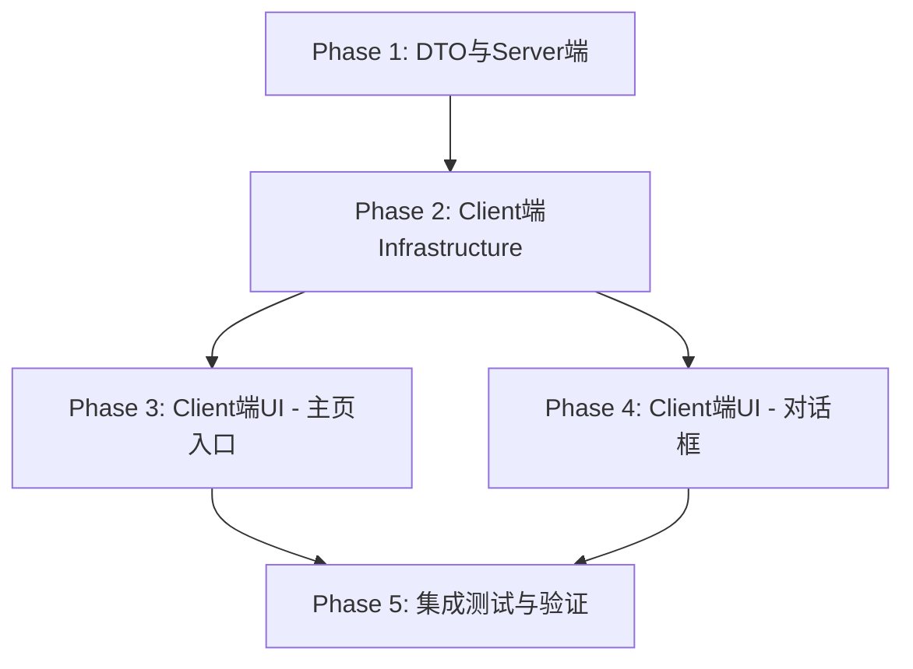

# 用户信息修改功能 - 任务分解清单

## 📋 项目概览

### 需求来源
- **需求文档**: `user-profile-modification-discussion.md`
- **设计文档**: `user-profile-modification-design.md`
- **功能范围**: 用户自己修改个人资料（sysadmin仅密码，Admin/Doctor资料+密码）

### 实施策略
- **总工时**: 约6.5小时
- **Phase划分**: 5个Phase（DTO/Server → Client基础 → 主页入口 → 对话框 → 测试）
- **优先级**: Server端优先（为Client端提供API基础）
- **验证策略**: 每个Phase完成后编译验证，最终集成测试

---

## 🎯 Phase划分与依赖关系



**关键路径**: Phase 1 → Phase 2 → Phase 4 → Phase 5（约4.5小时）

---

## 📝 Phase 1: DTO与Server端（优先级：⭐⭐⭐）

### Task 1.1: 简化ChangeProfileDto

**描述**: 移除ChangeProfileDto中的Avatar和Bio字段（User实体中不存在）

**文件**: `src/Shared/LYBT.Shared.Models/Contracts/Users/UserDtos.cs`

**具体操作**:
1. 定位到ChangeProfileDto定义（Line 241-275）
2. 删除以下字段：
   ```csharp
   [StringLength(500)]
   public string? Avatar { get; set; }  // ❌ 删除
   
   [StringLength(1000)]
   public string? Bio { get; set; }     // ❌ 删除
   ```
3. 更新XML注释，标记为"MVP版"
4. 添加Issue引用注释

**验收标准**:
- ✅ ChangeProfileDto仅包含：UserId, RealName, PhoneNumber, Email
- ✅ XML注释清晰说明字段用途
- ✅ 编译通过，0 warnings

**依赖**: 无

**预估时间**: 5分钟

---

### Task 1.2: 实现UserService.ChangeProfileAsync

**描述**: 在UserService中实现个人资料修改方法，包含唯一性校验和PinYinCode自动生成

**文件**: 
- `src/Server/Application/LYBT.Application.Services/Users/IUserService.cs`
- `src/Server/Application/LYBT.Application.Services/Users/UserService.cs`

**具体操作**:
1. **IUserService接口**:
   ```csharp
   /// <summary>
   /// 修改个人资料
   /// Issue #XXXX: 支持用户修改RealName、PhoneNumber、Email，自动更新PinYinCode
   /// </summary>
   Task<OperationResult<UserDto>> ChangeProfileAsync(ChangeProfileDto dto);
   ```

2. **UserService实现**:
   - 验证用户存在（`_userRepository.GetByIdAsync`）
   - 验证PhoneNumber唯一性（如果提供）
   - 验证Email唯一性（如果提供）
   - 更新字段（RealName, PhoneNumber, Email）
   - 自动生成PinYinCode（`PinyinHelper.GetInitials(dto.RealName)`）
   - 保存修改（`_userRepository.UpdateAsync`）
   - 返回UserDto

3. **错误处理**:
   - 用户不存在 → "用户不存在"
   - 电话号码重复 → "该电话号码已被其他用户使用"
   - 邮箱重复 → "该邮箱已被其他用户使用"
   - 数据库异常 → "修改失败: {ex.Message}"

**验收标准**:
- ✅ ChangeProfileAsync方法实现完整
- ✅ PinYinCode自动更新（基于RealName）
- ✅ PhoneNumber、Email唯一性校验（排除自己）
- ✅ 异常处理完善（try-catch + 日志）
- ✅ 编译通过

M分钟

---

### Task 2.2: 实现Client端Service（Client端）

**描述**: 在Client端的UserService中实现HTTP调用，连接Server端API

**文件**: `src/Client/Desktop/Infrastructure/Services/UserService.cs`（假设路径）

**具体操作**:
1. **ChangeProfileAsync实现**:
   ```csharp
   public async Task<OperationResult<UserDto>> ChangeProfileAsync(ChangeProfileDto dto)
   {
       var response = await _httpClient.PutAsJsonAsync($"/api/users/{dto.UserId}/profile", dto);
       // 处理响应...
   }
   ```

2. **ChangePasswordAsync实现**:
   ```csharp
   public async Task<OperationResult> ChangePasswordAsync(ChangePasswordDto dto)
   {
       var response = await _httpClient.PutAsJsonAsync($"/api/users/{dto.UserId}/password", dto);
       // 处理响应...
   }
   ```

3. **错误处理**:
   - HttpRequestException → "网络连接失败"
   - TaskCanceledException → "请求超时"
   - 通用Exception → "网络请求失败: {ex.Message}"

**验收标准**:
- ✅ HTTP请求正确（PUT方法、正确路径、JSON序列化）
- ✅ 响应解析正确（ApiResult<UserDto>）
- ✅ 异常处理完整（3种异常类型）
- ✅ 日志记录（LogError）
- ✅ 编译通过

**依赖**: Task 2.1

**预估时间**: 20分钟

**技术注意**:
- 确认_httpClient的BaseAddress配置
- 检查Server端密码修改API路径（可能是`/password`或`/change-password`）

---

## 📝 Phase 3: Client端UI - 主页入口（优先级：⭐⭐）

### Task 3.1: 修改AdminHomeView（XAML）

**描述**: 在AdminHomeView中添加顶部用户信息栏，包含当前用户名和"个人中心"按钮

**文件**: `src/Client/Desktop/Roles/LYBT.Desktop.Admin/Views/AdminHomeView.xaml`

**具体操作**:
1. 在标题区域后（Line 55后）插入用户信息栏Border
2. XAML结构：
   ```xaml
   <Border Background="#F0F8FF" BorderBrush="{StaticResource BorderBrush}" ...>
       <Grid>
           <StackPanel Orientation="Horizontal">
               <TextBlock Text="👤"/>
               <TextBlock Text="当前用户: "/>
               <TextBlock Text="{Binding CurrentUserName}"/>
           </StackPanel>
           <Button Content="个人中心" Command="{Binding OpenUserProfileCommand}"/>
       </Grid>
   </Border>
   ```

**验收标准**:
- ✅ 用户信息栏位置正确（标题下方）
- ✅ 数据绑定正确（CurrentUserName, OpenUserProfileCommand）
- ✅ 样式一致（使用StaticResource）
- ✅ 编译通过

**依赖**: 无

**预估时间**: 15分钟

---

### Task 3.2: 修改AdminHomeViewModel

**描述**: 在AdminHomeViewModel中添加CurrentUserName属性和OpenUserProfileCommand命令

**文件**: `src/Client/Desktop/Roles/LYBT.Desktop.Admin/ViewModels/AdminHomeViewModel.cs`

**具体操作**:
1. **新增私有字段**:
   ```csharp
   private readonly IDialogService _dialogService;
   ```

2. **新增属性**:
   ```csharp
   private string _currentUserName = string.Empty;
   public string CurrentUserName { get; set; }
   ```

3. **新增命令**:
   ```csharp
   public DelegateCommand OpenUserProfileCommand { get; }
   ```

4. **构造函数修改**:
   - 添加IDialogService依赖注入
   - 初始化CurrentUserName（从SessionManager获取）
   - 初始化OpenUserProfileCommand

5. **命令实现**:
   ```csharp
   private void OpenUserProfile()
   {
       _dialogService.ShowDialog("UserProfileDialog", parameters, result => {
           if (result.Result == ButtonResult.OK)
           {
               // 刷新用户名
           }
       });
   }
   ```

**验收标准**:
- ✅ 属性和命令定义正确
- ✅ 依赖注入配置完整
- ✅ 对话框弹出成功
- ✅ 异常处理（try-catch + 日志）
- ✅ 编译通过

**依赖**: Task 3.1

**预估时间**: 15分钟

---

### Task 3.3: 修改ClinicalHomeView（XAML）

**描述**: 在ClinicalHomeView中添加顶部用户信息栏（与AdminHomeView相同）

**文件**: `src/Client/Desktop/Roles/LYBT.Desktop.Clinical/Views/ClinicalHomeView.xaml`

**具体操作**: 与Task 3.1完全相同，插入位置在标题区域后（Line 23后）

**验收标准**: 与Task 3.1相同

**依赖**: Task 3.1（可复制XAML）

**预估时间**: 10分钟

---

### Task 3.4: 修改ClinicalHomeViewModel

**描述**: 在ClinicalHomeViewModel中添加CurrentUserName属性和OpenUserProfileCommand命令

**文件**: `src/Client/Desktop/Roles/LYBT.Desktop.Clinical/ViewModels/ClinicalHomeViewModel.cs`

**具体操作**: 与Task 3.2完全相同

**验收标准**: 与Task 3.2相同

**依赖**: Task 3.2（可复制代码）

**预估时间**: 10分钟

---

## 📝 Phase 4: Client端UI - 对话框（优先级：⭐⭐⭐）

### Task 4.1: 修改UserProfileDialogViewModel - 核心逻辑

**描述**: 替换SaveAsync的Mock实现，添加角色判断和真实API调用

**文件**: `src/Client/Desktop/Modules/LYBT.Desktop.Users/ViewModels/UserProfileDialogViewModel.cs`

**具体操作**:
1. **新增私有字段**:
   ```csharp
   private string _originalRealName = string.Empty;
   private string _originalPhoneNumber = string.Empty;
   private string _originalEmail = string.Empty;
   
   private string _oldPassword = string.Empty;
   private string _newPassword = string.Empty;
   private string _confirmNewPassword = string.Empty;
   ```

2. **新增属性**:
   ```csharp
   public string OldPassword { get; set; }
   public string NewPassword { get; set; }
   public string ConfirmNewPassword { get; set; }
   
   public bool IsSysAdmin => _sessionManager?.CurrentUser?.UserName?.Equals(
       SystemConstants.SuperAdminUsername,  // "sysadmin"
       StringComparison.OrdinalIgnoreCase) == true;
   public bool IsRegularUser => !IsSysAdmin;  // Admin或Doctor用户
   ```

3. **修改LoadUserProfileAsync**:
   - 加载后保存原始值（_originalRealName等）

4. **替换SaveAsync实现**:
   ```csharp
   private async Task SaveAsync()
   {
       if (!ValidateInput()) return;
       
       SetIsBusy(true, "正在保存...");
       
       bool success = false;
       if (IsSysAdmin)
           success = await SavePasswordOnlyAsync();
       else
           success = await SaveProfileAndPasswordAsync();
       
       if (success)
       {
           await ShowSuccessMessageAsync("保存成功");
           RequestClose?.Invoke(new DialogResult(ButtonResult.OK));
       }
       
       SetIsBusy(false);
   }
   ```

5. **实现SavePasswordOnlyAsync**:
   - 验证密码字段非空
   - 调用`_userService.ChangePasswordAsync(dto)`
   - 处理结果和错误

6. **实现SaveProfileAndPasswordAsync**:
   - 检测个人资料变更（HasProfileChanges）
   - 如有变更，调用`_userService.ChangeProfileAsync(dto)`
   - 检测密码变更
   - 如有变更，调用`_userService.ChangePasswordAsync(dto)`

7. **实现HasProfileChanges**:
   ```csharp
   private bool HasProfileChanges()
   {
       return _originalRealName != RealName
           || _originalPhoneNumber != PhoneNumber
           || _originalEmail != Email;
   }
   ```

**验收标准**:
- ✅ SaveAsync不再是Mock实现
- ✅ 角色判断逻辑正确（sysadmin vs Doctor）
- ✅ 变更检测逻辑正确（HasProfileChanges）
- ✅ API调用正确（ChangeProfileAsync, ChangePasswordAsync）
- ✅ 错误处理完整（SetError + 日志）
- ✅ 编译通过

**依赖**: Task 2.2（IUserService实现）

**预估时间**: 60分钟

---

### Task 4.2: 修改UserProfileDialog - UI差异化

**描述**: 在UserProfileDialog.xaml中添加角色差异化UI，使用Expander控件

**文件**: `src/Client/Desktop/Modules/LYBT.Desktop.Users/Views/UserProfileDialog.xaml`

**具体操作**:
1. **找到个人资料区域**（RealName、PhoneNumber、Email字段）
   - 添加Visibility绑定：`Visibility="{Binding IsRegularUser, Converter={StaticResource BoolToVisibilityConverter}}"`

2. **添加Doctor密码修改区域（Expander）**:
   ```xaml
   <Expander Header="修改密码（可选）" 
             IsExpanded="False"
             Visibility="{Binding IsRegularUser, Converter={StaticResource BoolToVisibilityConverter}}">
       <StackPanel>
           <TextBlock Text="旧密码"/>
           <PasswordBox x:Name="OldPasswordBox" PasswordChanged="OldPasswordBox_PasswordChanged"/>
           <TextBlock Text="新密码"/>
           <PasswordBox x:Name="NewPasswordBox" PasswordChanged="NewPasswordBox_PasswordChanged"/>
           <TextBlock Text="确认新密码"/>
           <PasswordBox x:Name="ConfirmNewPasswordBox" PasswordChanged="ConfirmNewPasswordBox_PasswordChanged"/>
       </StackPanel>
   </Expander>
   ```

3. **添加sysadmin密码修改区域**:
   ```xaml
   <StackPanel Visibility="{Binding IsSysAdmin, Converter={StaticResource BoolToVisibilityConverter}}">
       <!-- 相同的密码字段，但始终显示 -->
   </StackPanel>
   ```

4. **Code-Behind添加PasswordChanged事件处理**:
   ```csharp
   private void OldPasswordBox_PasswordChanged(object sender, RoutedEventArgs e)
   {
       if (DataContext is UserProfileDialogViewModel vm)
           vm.OldPassword = ((PasswordBox)sender).Password;
   }
   // NewPasswordBox_PasswordChanged...
   // ConfirmNewPasswordBox_PasswordChanged...
   ```

**验收标准**:
- ✅ Doctor角色显示：个人资料字段 + 折叠的密码区域
- ✅ sysadmin角色显示：仅密码修改区域
- ✅ Expander默认折叠（IsExpanded="False"）
- ✅ PasswordBox事件绑定正确
- ✅ Visibility绑定正确（BoolToVisibilityConverter）
- ✅ 编译通过，界面渲染正常

**依赖**: Task 4.1（ViewModel属性）

**预估时间**: 30分钟

**技术注意**:
- 确认BoolToVisibilityConverter已在App.xaml或资源字典中定义
- WPF PasswordBox不支持双向绑定，必须使用PasswordChanged事件

---

### Task 4.3: Client端单元测试

**描述**: 为UserProfileDialogViewModel编写单元测试，覆盖角色差异化逻辑

**文件**: `tests/UnitTests/Client/LYBT.Desktop.Users.Tests/ViewModels/UserProfileDialogViewModelTests.cs`

**测试用例**:
1. **SaveAsync_SysAdmin_OnlyPasswordModification**
   - Mock SessionManager返回sysadmin用户(UserName="sysadmin")
   - 填写密码三字段
   - 验证仅调用ChangePasswordAsync
   - 验证未调用ChangeProfileAsync

2. **SaveAsync_Doctor_ProfileAndPasswordModification**
   - Mock SessionManager返回Doctor角色
   - 修改RealName + 填写密码
   - 验证调用ChangeProfileAsync和ChangePasswordAsync各1次

3. **SaveAsync_Doctor_ProfileOnlyModification**
   - Mock SessionManager返回Doctor角色
   - 仅修改RealName
   - 验证仅调用ChangeProfileAsync

4. **HasProfileChanges_NoChanges_ReturnsFalse**
   - 加载后未修改任何字段
   - 验证HasProfileChanges返回false

**验收标准**:
- ✅ 4个测试用例全部通过
- ✅ Mock配置正确（ISessionManager, IUserService）
- ✅ 断言完整（调用次数、参数验证）
- ✅ 测试运行通过（`dotnet test`）

**依赖**: Task 4.1

**预估时间**: 40分钟

---

## 📝 Phase 5: 集成测试与验证（优先级：⭐⭐⭐）

### Task 5.1: 编译验证

**描述**: 验证所有代码修改编译通过，无错误、无警告

**具体操作**:
1. 清理解决方案：`dotnet clean LYBT.All.sln`
2. 恢复依赖：`dotnet restore LYBT.All.sln`
3. 编译Release版本：`dotnet build LYBT.All.sln -c Release --no-restore`
4. 检查输出：0 errors, 0 warnings

**验收标准**:
- ✅ 编译成功
- ✅ 0 errors
- ✅ 0 warnings
- ✅ 所有项目生成成功

**依赖**: Phase 1-4所有任务

**预估时间**: 10分钟

---

### Task 5.2: 单元测试执行

**描述**: 运行所有单元测试，确保新增测试和现有测试全部通过

**具体操作**:
1. 运行所有测试：`dotnet test LYBT.All.sln -c Release --settings tests/.runsettings`
2. 验证测试结果：
   - Server端：4个新增测试通过
   - Client端：4个新增测试通过
   - 现有测试：无回归失败

**验收标准**:
- ✅ 所有测试通过（包括新增和现有）
- ✅ 测试覆盖率满足要求
- ✅ 无超时或不稳定测试

**依赖**: Task 1.4, Task 4.3, Task 5.1

**预估时间**: 10分钟

---

### Task 5.3: 运行时验证 - sysadmin场景

**描述**: 启动Server+Client，登录sysadmin，验证仅密码修改功能

**具体操作**:
1. **启动Server**:
   - `dotnet run --project src/Server/API/LYBT.Api/LYBT.Api.csproj`
   - 验证API启动成功（https://localhost:5001）

2. **启动Client**:
   - 运行Desktop客户端
   - 登录sysadmin账号

3. **测试流程**:
   - ✅ AdminHomeView顶部显示"当前用户: admin"和"个人中心"按钮
   - ✅ 点击"个人中心"按钮，弹出UserProfileDialog
   - ✅ 对话框仅显示：UserName（只读）+ 密码修改区域（旧密码、新密码、确认新密码）
   - ✅ 填写旧密码："OldPass123"
   - ✅ 填写新密码："NewPass456"
   - ✅ 填写确认密码："NewPass456"
   - ✅ 点击"保存"，显示"保存成功"
   - ✅ 对话框关闭

4. **验证数据库**:
   - 打开SQL Server Management Studio
   - 查询：`SELECT PasswordHash FROM Users WHERE UserName = 'admin'`
   - 验证PasswordHash已更新

5. **验证登录**:
   - 退出登录
   - 使用新密码"NewPass456"重新登录
   - 验证登录成功

**验收标准**:
- ✅ UI显示正确（仅密码修改字段）
- ✅ 密码修改成功（数据库PasswordHash更新）
- ✅ 使用新密码可以登录
- ✅ 无异常或错误日志

**依赖**: Task 5.1

**预估时间**: 15分钟

---

### Task 5.4: 运行时验证 - Doctor场景

**描述**: 启动Server+Client，登录Doctor，验证个人资料+密码修改功能

**具体操作**:
1. **登录Doctor账号**（假设用户名：zhangdoctor）

2. **测试流程 - 修改个人资料**:
   - ✅ ClinicalHomeView顶部显示"当前用户: zhangdoctor"和"个人中心"按钮
   - ✅ 点击"个人中心"，弹出UserProfileDialog
   - ✅ 对话框显示：UserName（只读）+ RealName、PhoneNumber、Email（可编辑）+ 折叠的"修改密码（可选）"区域
   - ✅ 修改RealName："张三" → "张医生"
   - ✅ 修改PhoneNumber："13800138000" → "13900139000"
   - ✅ 修改Email："zhang@example.com" → "zhangdoctor@example.com"
   - ✅ 点击"保存"，显示"保存成功"
   - ✅ 对话框关闭

3. **验证数据库 - 个人资料**:
   ```sql
   SELECT UserName, RealName, PhoneNumber, Email, PinYinCode 
   FROM Users 
   WHERE UserName = 'zhangdoctor'
   ```
   - ✅ RealName = "张医生"
   - ✅ PhoneNumber = "13900139000"
   - ✅ Email = "zhangdoctor@example.com"
   - ✅ PinYinCode = "ZYS"（自动生成）

4. **测试流程 - 修改密码**:
   - ✅ 重新打开"个人中心"
   - ✅ 展开"修改密码（可选）"区域
   - ✅ 填写旧密码、新密码、确认密码
   - ✅ 点击"保存"，显示"保存成功"

5. **验证登录**:
   - ✅ 退出登录
   - ✅ 使用新密码重新登录
   - ✅ 验证登录成功

**验收标准**:
- ✅ UI显示正确（个人资料字段 + 折叠的密码区域）
- ✅ 个人资料修改成功（数据库RealName、PhoneNumber、Email、PinYinCode更新）
- ✅ 密码修改成功（数据库PasswordHash更新）
- ✅ 使用新密码可以登录
- ✅ 无异常或错误日志

**依赖**: Task 5.3

**预估时间**: 15分钟

---

### Task 5.5: 边界测试

**描述**: 测试边界条件和错误处理，确保系统健壮性

**测试场景**:
1. **电话号码重复验证**:
   - Doctor A修改电话号码为"13800138000"
   - Doctor B尝试修改电话号码为"13800138000"
   - 验证显示错误："该电话号码已被其他用户使用"

2. **邮箱重复验证**:
   - 类似电话号码测试

3. **旧密码错误处理**:
   - sysadmin修改密码时，输入错误的旧密码
   - 验证显示错误："旧密码验证失败"

4. **电话号码格式验证**:
   - Doctor修改电话号码为"12345678901"（12位）
   - 验证前端提示："请输入有效的手机号码（11位，以1开头）"

5. **邮箱格式验证**:
   - Doctor修改邮箱为"invalid-email"
   - 验证前端提示："邮箱格式不正确"

6. **密码长度验证**:
   - sysadmin新密码输入"123"（小于6字符）
   - 验证前端提示："新密码长度至少6个字符"

7. **密码确认一致性**:
   - 新密码："NewPass123"
   - 确认密码："NewPass456"
   - 验证前端提示："两次输入的新密码不一致"

**验收标准**:
- ✅ 所有7个边界场景验证通过
- ✅ 错误提示清晰准确
- ✅ 无异常崩溃
- ✅ 错误日志记录完整

**依赖**: Task 5.4

**预估时间**: 20分钟

---

## 📊 任务统计

### 按Phase统计

| Phase | 任务数 | 预估时间 | 关键程度 |
|-------|-------|---------|---------|
| Phase 1: DTO与Server端 | 4 | 1小时25分 | ⭐⭐⭐ |
| Phase 2: Client Infrastructure | 2 | 30分钟 | ⭐⭐⭐ |
| Phase 3: 主页入口 | 4 | 50分钟 | ⭐⭐ |
| Phase 4: 对话框 | 3 | 2小时10分 | ⭐⭐⭐ |
| Phase 5: 测试验证 | 5 | 1小时10分 | ⭐⭐⭐ |
| **总计** | **18** | **6小时5分** | - |

### 按优先级统计

| 优先级 | 任务数 | 预估时间 |
|--------|-------|---------|
| ⭐⭐⭐（高） | 13 | 4小时55分 |
| ⭐⭐（中） | 4 | 50分钟 |
| ⭐（低） | 1 | 20分钟 |

### 关键路径

**关键路径**: Task 1.1 → 1.2 → 1.3 → 2.1 → 2.2 → 4.1 → 4.2 → 5.1 → 5.3 → 5.4

**关键路径时间**: 约4.5小时

---

## 🔧 技术风险与缓解措施

### 风险1: PinyinHelper工具类不存在
**影响**: Task 1.2（UserService.ChangeProfileAsync）

**缓解措施**:
1. 检查现有代码是否有拼音码生成逻辑（搜索"PinYin"或"拼音"）
2. 如不存在，使用开源库（如 `TinyPinyin.NET` 或 `Pinyin4NET`）
3. MVP阶段可暂时使用简单实现（取首字母大写）

**应急方案**: 
```csharp
// 临时实现
user.PinYinCode = string.Join("", dto.RealName.Take(2).Select(c => c.ToString().ToUpper()));
```

---

### 风险2: UserRepository缺少GetByPhoneNumberAsync/GetByEmailAsync方法
**影响**: Task 1.2（唯一性校验）

**缓解措施**:
1. 检查IUserRepository接口是否已有这两个方法
2. 如不存在，需在Task 1.2中新增（约10分钟）
3. 新增实现：
   ```csharp
   public async Task<User?> GetByPhoneNumberAsync(string phoneNumber)
   {
       return await _context.Users.FirstOrDefaultAsync(u => u.PhoneNumber == phoneNumber);
   }
   ```

---

### 风险3: ChangePassword API路径不确定
**影响**: Task 2.2（Client端API调用）

**缓解措施**:
1. 在Task 2.2前，先搜索Server端代码确认API路径
2. 常见路径：`/api/users/{id}/password` 或 `/api/users/{id}/change-password`
3. 如不存在，需在Server端新增（约30分钟，增加Phase 1工时）

---

### 风险4: BoolToVisibilityConverter未定义
**影响**: Task 4.2（UI差异化）

**缓解措施**:
1. 检查App.xaml或ResourceDictionary中是否已定义
2. WPF默认提供此Converter，通常已可用
3. 如不存在，需手动添加（约5分钟）

---

## 📌 实施建议

### 最佳实践
1. **严格按Phase顺序执行**：Server端优先，避免Client端空等
2. **每完成1个Phase立即编译验证**：早发现问题，避免累积
3. **边界测试提前准备测试数据**：准备好多个测试账号（sysadmin、Doctor）
4. **代码审查点**：Task 1.2、Task 4.1完成后自我审查（关键逻辑）

### 可并行执行的任务
- Task 3.1 & 3.3（两个主页XAML修改）
- Task 3.2 & 3.4（两个主页ViewModel修改）
- Task 1.4（Server端测试）可在Task 2.1启动时并行

### 建议休息点
- Phase 1完成后（1.5小时）→ 休息10分钟
- Phase 4完成后（累计4小时）→ 休息15分钟

---

## 📋 GitHub Issue清单（供批量创建）

### Issue模板

```markdown
**标题**: [用户信息修改] Task X.Y: <任务名称>

**描述**: 
<任务描述>

**验收标准**:
- [ ] <验收标准1>
- [ ] <验收标准2>
- [ ] ...

**依赖**:
- [ ] #XXXX（前置Issue）

**预估时间**: <XX>分钟

**Phase**: Phase X

**优先级**: ⭐⭐⭐ / ⭐⭐ / ⭐

**文件变更**:
- `<文件路径1>`
- `<文件路径2>`
```

---

**文档版本**: v1.0  
**创建日期**: 2025-11-07  
**任务状态**: 待用户批准  
**下一步**: 用户批准后进入State 6批量创建GitHub Issues（可选）
