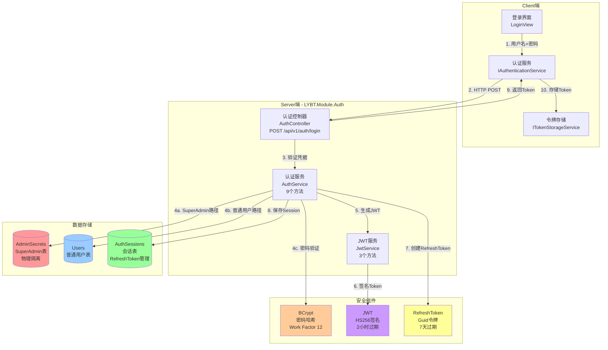

# Server端认证架构设计

> **文档类型**: Explanation（架构设计）
> **目标读者**: 架构师、后端开发工程师
> **最后更新**: 2025-10-30
> **关联文档**: [Client端认证架构](../client/auth-design.md) | [认证模块README](../../../../src/Server/Modules/LYBT.Module.Auth/README.md)

---

## 📋 文档概览

本文档详细阐述凌隐宝堂中医诊所诊疗系统（LYBTZYZS）Server端的认证授权架构设计，包括双轨认证机制、JWT令牌管理、Session会话管理、安全策略等核心设计理念与实现方案。

**核心特性**：
- ✅ **双轨认证**：SuperAdmin（物理隔离）+ 普通用户（标准认证）
- ✅ **JWT + RefreshToken**：AccessToken（2小时）+ RefreshToken（7天）
- ✅ **BCrypt密码哈希**：Work Factor 12，随机盐值
- ✅ **Session管理**：设备追踪、IP记录、过期管理
- ✅ **安全增强**：密钥强度验证、Token撤销、双因子预留

---

## 1. 架构概览

### 1.1 认证架构全景图



### 1.2 模块分层结构

```
LYBT.Module.Auth/                    # 认证模块（Server端）
├── Controllers/
│   └── AuthController.cs            # API端点（6个接口）
│       ├── POST /api/v1/auth/login           # 用户登录
│       ├── POST /api/v1/auth/logout          # 用户登出
│       ├── POST /api/v1/auth/refresh-token   # 刷新Token
│       ├── POST /api/v1/auth/revoke-token    # 撤销Token
│       ├── GET  /api/v1/auth/session         # 查询会话
│       └── PUT  /api/v1/auth/admin-password  # 修改SuperAdmin密码
│
├── Services/
│   ├── AuthService.cs               # 认证业务逻辑（9个方法）
│   │   ├── IsSuperAdminCredentials()        # SuperAdmin验证
│   │   ├── VerifyCredentialsAsync()         # 普通用户验证
│   │   ├── LoginAsync()                     # 登录流程
│   │   ├── LogoutAsync()                    # 登出流程
│   │   ├── RefreshTokenAsync()              # 刷新AccessToken
│   │   ├── ValidateTokenAsync()             # 验证Token有效性
│   │   ├── RevokeTokenAsync()               # 撤销RefreshToken
│   │   ├── GetSessionInfoAsync()            # 查询会话信息
│   │   └── ChangeSysAdminPasswordAsync()    # 修改SuperAdmin密码
│   │
│   ├── JwtService.cs                # JWT令牌服务（3个方法）
│   │   ├── GenerateToken()                  # 生成JWT（2个重载）
│   │   ├── ValidateToken()                  # 验证JWT签名和过期
│   │   └── ValidateSecretKeyStrength()      # 验证密钥强度（≥256位）
│   │
│   ├── TokenRevocationService.cs    # Token撤销服务（Issue #1870）
│   │   ├── RevokeTokenAsync()               # 撤销单个RefreshToken
│   │   ├── RevokeAllUserTokensAsync()       # 撤销用户所有Token
│   │   ├── IsTokenRevokedAsync()            # 检查Token撤销状态
│   │   └── CleanupExpiredTokensAsync()      # 清理过期Token
│   │
│   ├── SecurityAuditService.cs      # 安全审计服务（Issue #1871）
│   │   ├── LogLoginAsync()                  # 记录登录事件
│   │   ├── LogLogoutAsync()                 # 记录登出事件
│   │   ├── LogRefreshTokenAsync()           # 记录Token刷新事件
│   │   ├── LogTokenRevokedAsync()           # 记录Token撤销事件
│   │   └── GetAuditLogsAsync()              # 查询审计日志
│   │
│   └── SecurityAuditCleanupService.cs # 审计日志清理（Issue #1873）
│       └── CleanupOldLogsAsync()            # 清理30天前的日志（后台Job）
│
├── Repositories/
│   └── (由Infrastructure提供BaseRepository)
│
├── Models/
│   ├── AdminSecret.cs               # SuperAdmin模型（物理隔离）
│   ├── AuthSession.cs               # 会话模型（RefreshToken管理）
│   └── (User模型由LYBT.Module.Users提供)
│
└── AuthModule.cs                    # 依赖注入注册
```

---

## 2. 双轨认证机制

### 2.1 设计理念

**核心原则**：物理隔离SuperAdmin与普通用户，提供最高级别的安全保护。

**业务背景**：
- **SuperAdmin**：系统维护管理员（初始化系统、修改关键配置、故障恢复）
- **普通用户**：医生、护士等业务角色（日常诊疗操作）

**安全需求**：
- SuperAdmin账户必须与业务账户物理隔离（不同数据表）
- SuperAdmin不参与日常业务流程，无需Session管理和RefreshToken
- 普通用户需要RefreshToken支持"记住我"功能（7天免登录）

### 2.2 Track 1：SuperAdmin认证

#### 2.2.1 数据模型

```csharp
// AdminSecret实体（物理隔离存储）
public class AdminSecret
{
    public Guid Id { get; set; }
    public string AdminName { get; set; } = "SysAdmin";  // 固定用户名
    public string PasswordHash { get; set; }              // BCrypt哈希（Work Factor 12）
    public string SecurityQuestion { get; set; }          // 安全问题（密码恢复）
    public string SecurityAnswerHash { get; set; }        // 安全答案哈希
    public DateTime LastPasswordChange { get; set; }      // 密码最后修改时间
    public int FailedLoginAttempts { get; set; }          // 失败登录次数
    public DateTime? LockoutEndTime { get; set; }         // 锁定结束时间
    public DateTime CreatedAt { get; set; }
    public DateTime UpdatedAt { get; set; }
}
```

**设计要点**：
- **固定用户名**：`SysAdmin`（不允许修改，避免暴力枚举）
- **单行记录**：数据库中仅存在一条AdminSecret记录
- **独立表**：与Users表完全隔离，无外键关联
- **安全问题**：用于密码重置（答案也使用BCrypt哈希）
- **锁定机制**：连续5次失败后锁定30分钟

#### 2.2.2 认证流程

```csharp
// AuthService.LoginAsync() - SuperAdmin路径
public async Task<LoginResponse> LoginAsync(LoginRequest request)
{
    // Step 1: 优先检查SuperAdmin凭据
    if (IsSuperAdminCredentials(request.UserName, request.Password))
    {
        _logger.LogInformation("SuperAdmin登录成功");

        // Step 2: 生成JWT（无RefreshToken）
        var token = _jwtService.GenerateToken(
            userId: Guid.Empty,           // SuperAdmin无UserId
            username: request.UserName,
            role: UserRole.Admin,
            isSuperAdmin: true            // 标记为SuperAdmin
        );

        // Step 3: 返回响应（无Session记录）
        return new LoginResponse
        {
            AccessToken = token,
            RefreshToken = null,          // SuperAdmin不使用RefreshToken
            IsSuperAdmin = true,
            User = new UserDto
            {
                Id = Guid.Empty,
                UserName = "SysAdmin",
                Role = UserRole.Admin
            }
        };
    }

    // Step 4: 降级到普通用户认证流程...
}

// SuperAdmin验证方法
private bool IsSuperAdminCredentials(string username, string password)
{
    if (username != "SysAdmin") return false;

    var adminSecret = await _dbContext.AdminSecrets.FirstOrDefaultAsync();
    if (adminSecret == null) return false;

    // 检查锁定状态
    if (adminSecret.LockoutEndTime.HasValue &&
        adminSecret.LockoutEndTime.Value > DateTime.UtcNow)
    {
        throw new UnauthorizedException("账户已锁定，请稍后再试");
    }

    // 验证密码（BCrypt）
    bool isValid = BCrypt.Net.BCrypt.Verify(password, adminSecret.PasswordHash);

    if (isValid)
    {
        // 重置失败次数
        adminSecret.FailedLoginAttempts = 0;
        adminSecret.LockoutEndTime = null;
    }
    else
    {
        // 增加失败次数
        adminSecret.FailedLoginAttempts++;
        if (adminSecret.FailedLoginAttempts >= 5)
        {
            // 锁定30分钟
            adminSecret.LockoutEndTime = DateTime.UtcNow.AddMinutes(30);
        }
    }

    await _dbContext.SaveChangesAsync();
    return isValid;
}
```

**安全特性**：
- ✅ **物理隔离**：独立表存储，与业务数据完全隔离
- ✅ **固定用户名**：避免枚举攻击
- ✅ **无Session**：SuperAdmin不创建Session记录，减少攻击面
- ✅ **无RefreshToken**：每次登录都需要输入密码（强制短会话）
- ✅ **锁定机制**：5次失败锁定30分钟（防暴力破解）
- ✅ **审计日志**：记录所有SuperAdmin登录尝试

### 2.3 Track 2：普通用户认证

#### 2.3.1 数据模型

```csharp
// User实体（标准用户表）
public class User
{
    public Guid Id { get; set; }
    public string UserName { get; set; }              // 用户名（唯一索引）
    public string PasswordHash { get; set; }          // BCrypt哈希
    public string Email { get; set; }
    public string PhoneNumber { get; set; }
    public UserRole Role { get; set; }                // 角色（Admin/Doctor/Nurse）
    public bool IsActive { get; set; }                // 账户状态
    public DateTime? LastLoginTime { get; set; }      // 最后登录时间
    public DateTime CreatedAt { get; set; }
    public DateTime UpdatedAt { get; set; }
}

// AuthSession实体（会话管理）
public class AuthSession
{
    public Guid Id { get; set; }
    public Guid UserId { get; set; }                  // 用户ID（外键）
    public User User { get; set; }                    // 导航属性
    public string RefreshToken { get; set; }          // Guid令牌（唯一索引）
    public DateTime ExpiresAt { get; set; }           // 过期时间（7天）
    public string DeviceInfo { get; set; }            // 设备信息（User-Agent）
    public string IpAddress { get; set; }             // IP地址
    public bool IsRevoked { get; set; }               // 是否已撤销
    public DateTime CreatedAt { get; set; }
}
```

**设计要点**：
- **RefreshToken唯一性**：Guid.NewGuid().ToString("N")，32位无连字符
- **会话追踪**：记录设备信息和IP地址（安全审计）
- **撤销机制**：IsRevoked标记，支持主动登出和安全撤销
- **过期策略**：7天有效期，超期自动失效

#### 2.3.2 认证流程

```csharp
// AuthService.LoginAsync() - 普通用户路径
public async Task<LoginResponse> LoginAsync(LoginRequest request)
{
    // ... SuperAdmin检查（见上文） ...

    // Step 1: 验证普通用户凭据
    var user = await VerifyCredentialsAsync(request.UserName, request.Password);
    if (user == null)
    {
        throw new UnauthorizedException("用户名或密码错误");
    }

    // Step 2: 生成AccessToken（2小时）
    var accessToken = _jwtService.GenerateToken(
        userId: user.Id,
        username: user.UserName,
        role: user.Role,
        isSuperAdmin: false
    );

    // Step 3: 生成RefreshToken（7天）
    var refreshToken = Guid.NewGuid().ToString("N");

    // Step 4: 创建Session记录
    var session = new AuthSession
    {
        Id = Guid.NewGuid(),
        UserId = user.Id,
        RefreshToken = refreshToken,
        ExpiresAt = DateTime.UtcNow.AddDays(7),
        DeviceInfo = request.DeviceInfo,
        IpAddress = request.IpAddress,
        IsRevoked = false,
        CreatedAt = DateTime.UtcNow
    };

    await _dbContext.AuthSessions.AddAsync(session);
    await _dbContext.SaveChangesAsync();

    _logger.LogInformation("用户 {UserName} 登录成功，Session ID: {SessionId}",
        user.UserName, session.Id);

    // Step 5: 返回响应
    return new LoginResponse
    {
        AccessToken = accessToken,
        RefreshToken = refreshToken,
        IsSuperAdmin = false,
        User = _mapper.Map<UserDto>(user)
    };
}

// 普通用户验证方法
private async Task<User?> VerifyCredentialsAsync(string username, string password)
{
    var user = await _dbContext.Users
        .FirstOrDefaultAsync(u => u.UserName == username && u.IsActive);

    if (user == null) return null;

    // 验证密码（BCrypt）
    bool isValid = BCrypt.Net.BCrypt.Verify(password, user.PasswordHash);

    if (isValid)
    {
        // 更新最后登录时间
        user.LastLoginTime = DateTime.UtcNow;
        await _dbContext.SaveChangesAsync();
    }

    return isValid ? user : null;
}
```

**安全特性**：
- ✅ **Session追踪**：记录设备和IP，支持异常登录检测
- ✅ **RefreshToken轮换**：每次刷新生成新Token（防重放攻击）
- ✅ **多设备支持**：一个用户可有多个有效Session（手机+PC）
- ✅ **主动登出**：撤销RefreshToken，强制重新登录
- ✅ **审计日志**：记录所有登录成功/失败事件

---

## 3. JWT令牌管理

### 3.1 JWT结构设计

#### 3.1.1 Token Payload

```json
{
  "sub": "550e8400-e29b-41d4-a716-446655440000",  // Subject: 用户ID
  "unique_name": "doctor1",                       // 用户名
  "role": "Doctor",                               // 角色
  "is_superadmin": "false",                       // SuperAdmin标记
  "nbf": 1735612800,                              // Not Before（生效时间）
  "exp": 1735620000,                              // Expiration（过期时间）
  "iat": 1735612800,                              // Issued At（签发时间）
  "iss": "LYBT.WebAPI",                           // Issuer（签发者）
  "aud": "LYBT.Desktop"                           // Audience（受众）
}
```

**关键Claim说明**：
- **sub**：Subject，用户唯一标识（SuperAdmin为Guid.Empty）
- **unique_name**：用户名（用于UI显示和日志记录）
- **role**：用户角色（用于权限控制）
- **is_superadmin**：SuperAdmin标记（用于最高权限判断）
- **exp**：过期时间（2小时后，Unix时间戳）

#### 3.1.2 签名算法

```csharp
public class JwtService
{
    private readonly string _secretKey;  // 从appsettings.json读取（≥32字符）
    private readonly string _issuer = "LYBT.WebAPI";
    private readonly string _audience = "LYBT.Desktop";

    // 生成JWT（方法1：完整参数）
    public string GenerateToken(
        Guid userId,
        string username,
        UserRole role,
        bool isSuperAdmin = false)
    {
        // 验证密钥强度（≥256位）
        ValidateSecretKeyStrength(_secretKey);

        var claims = new[]
        {
            new Claim(ClaimTypes.NameIdentifier, userId.ToString()),
            new Claim(ClaimTypes.Name, username),
            new Claim(ClaimTypes.Role, role.ToString()),
            new Claim("is_superadmin", isSuperAdmin.ToString().ToLower())
        };

        var key = new SymmetricSecurityKey(Encoding.UTF8.GetBytes(_secretKey));
        var credentials = new SigningCredentials(key, SecurityAlgorithms.HmacSha256);

        var token = new JwtSecurityToken(
            issuer: _issuer,
            audience: _audience,
            claims: claims,
            notBefore: DateTime.UtcNow,
            expires: DateTime.UtcNow.AddHours(2),  // 2小时过期
            signingCredentials: credentials
        );

        return new JwtSecurityTokenHandler().WriteToken(token);
    }

    // 验证JWT
    public ClaimsPrincipal? ValidateToken(string token)
    {
        try
        {
            var tokenHandler = new JwtSecurityTokenHandler();
            var key = Encoding.UTF8.GetBytes(_secretKey);

            var validationParameters = new TokenValidationParameters
            {
                ValidateIssuer = true,
                ValidIssuer = _issuer,
                ValidateAudience = true,
                ValidAudience = _audience,
                ValidateLifetime = true,              // 验证过期时间
                ValidateIssuerSigningKey = true,
                IssuerSigningKey = new SymmetricSecurityKey(key),
                ClockSkew = TimeSpan.Zero             // 无时钟偏移容忍
            };

            var principal = tokenHandler.ValidateToken(token, validationParameters, out _);
            return principal;
        }
        catch (SecurityTokenExpiredException)
        {
            _logger.LogWarning("JWT已过期");
            return null;
        }
        catch (SecurityTokenException ex)
        {
            _logger.LogError(ex, "JWT验证失败");
            return null;
        }
    }

    // 验证密钥强度（≥32字符 = 256位）
    public void ValidateSecretKeyStrength(string key)
    {
        if (string.IsNullOrWhiteSpace(key) || key.Length < 32)
        {
            throw new InvalidOperationException(
                "JWT密钥强度不足：至少需要32个字符（256位）。" +
                "当前长度：" + (key?.Length ?? 0));
        }
    }
}
```

**安全特性**：
- ✅ **HS256签名**：HMAC-SHA256对称加密（性能优于RS256，适合内部系统）
- ✅ **密钥强度验证**：强制≥256位（32字符），启动时检查
- ✅ **零时钟偏移**：ClockSkew = TimeSpan.Zero，精确控制过期时间
- ✅ **完整性校验**：ValidateIssuerSigningKey = true，防止篡改
- ✅ **过期检查**：ValidateLifetime = true，拒绝过期Token

### 3.2 RefreshToken机制

#### 3.2.1 刷新流程

```csharp
// AuthService.RefreshTokenAsync()
public async Task<LoginResponse> RefreshTokenAsync(RefreshTokenRequest request)
{
    // Step 1: 查找Session
    var session = await _dbContext.AuthSessions
        .Include(s => s.User)
        .FirstOrDefaultAsync(s => s.RefreshToken == request.RefreshToken);

    if (session == null)
    {
        throw new UnauthorizedException("无效的RefreshToken");
    }

    // Step 2: 验证Session状态
    if (session.IsRevoked)
    {
        _logger.LogWarning("尝试使用已撤销的RefreshToken，Session ID: {SessionId}", session.Id);
        throw new UnauthorizedException("RefreshToken已撤销");
    }

    if (session.ExpiresAt < DateTime.UtcNow)
    {
        _logger.LogWarning("RefreshToken已过期，Session ID: {SessionId}", session.Id);
        throw new UnauthorizedException("RefreshToken已过期，请重新登录");
    }

    // Step 3: 生成新的AccessToken（保持原RefreshToken）
    var newAccessToken = _jwtService.GenerateToken(
        userId: session.UserId,
        username: session.User.UserName,
        role: session.User.Role,
        isSuperAdmin: false
    );

    _logger.LogInformation("用户 {UserName} 刷新Token成功，Session ID: {SessionId}",
        session.User.UserName, session.Id);

    // Step 4: 返回新的AccessToken
    return new LoginResponse
    {
        AccessToken = newAccessToken,
        RefreshToken = request.RefreshToken,  // RefreshToken不变
        IsSuperAdmin = false,
        User = _mapper.Map<UserDto>(session.User)
    };
}
```

**设计要点**：
- **RefreshToken不轮换**：简化客户端逻辑（7天内有效）
- **仅刷新AccessToken**：RefreshToken本身不变，减少同步复杂度
- **过期策略**：RefreshToken过期后强制重新登录（重新验证密码）
- **撤销机制**：支持主动登出和安全撤销

#### 3.2.2 撤销流程

```csharp
// AuthService.RevokeTokenAsync() - 撤销单个Token
public async Task RevokeTokenAsync(string refreshToken)
{
    var session = await _dbContext.AuthSessions
        .FirstOrDefaultAsync(s => s.RefreshToken == refreshToken);

    if (session == null)
    {
        throw new NotFoundException("Session不存在");
    }

    session.IsRevoked = true;
    await _dbContext.SaveChangesAsync();

    _logger.LogInformation("RefreshToken已撤销，Session ID: {SessionId}", session.Id);
}

// AuthService.LogoutAsync() - 撤销用户所有Token
public async Task LogoutAsync(Guid userId)
{
    var sessions = await _dbContext.AuthSessions
        .Where(s => s.UserId == userId && !s.IsRevoked)
        .ToListAsync();

    foreach (var session in sessions)
    {
        session.IsRevoked = true;
    }

    await _dbContext.SaveChangesAsync();

    _logger.LogInformation("用户 {UserId} 的所有Session已撤销，共 {Count} 个",
        userId, sessions.Count);
}
```

**应用场景**：
- **主动登出**：用户点击"退出"按钮，撤销当前设备Session
- **全部登出**：撤销用户所有设备Session（密码泄露应急）
- **异常登录**：检测到异常IP登录，撤销可疑Session
- **密码修改**：修改密码后撤销所有Session，强制重新登录

---

## 4. 密码安全策略

### 4.1 BCrypt哈希算法

#### 4.1.1 算法选择

**为什么选择BCrypt而非SHA-256？**

| 对比维度 | SHA-256 | BCrypt |
|---------|---------|--------|
| **算法类型** | 快速哈希 | 慢速哈希（Key Derivation Function） |
| **暴力破解** | 易受GPU加速攻击 | Work Factor可调，抵抗暴力破解 |
| **彩虹表** | 需手动加盐 | 自动生成随机盐值 |
| **哈希长度** | 64字符（256位） | 60字符（含盐值+哈希） |
| **性能** | 极快（≈1ms） | 慢（Work Factor 12 ≈ 200ms） |
| **安全性** | 弱（已过时） | 强（OWASP推荐） |

**结论**：BCrypt专为密码存储设计，Work Factor可随硬件进步调整（10→12→14），长期安全性更好。

#### 4.1.2 实现代码

```csharp
// 用户注册时生成密码哈希
public async Task<User> CreateUserAsync(CreateUserRequest request)
{
    // Work Factor 12（2^12 = 4096次迭代）
    // 在现代CPU上约需200ms，有效抵抗暴力破解
    string passwordHash = BCrypt.Net.BCrypt.HashPassword(request.Password, workFactor: 12);

    var user = new User
    {
        Id = Guid.NewGuid(),
        UserName = request.UserName,
        PasswordHash = passwordHash,  // 60字符哈希（含盐值）
        // ...
    };

    await _dbContext.Users.AddAsync(user);
    await _dbContext.SaveChangesAsync();

    return user;
}

// 登录时验证密码
private async Task<User?> VerifyCredentialsAsync(string username, string password)
{
    var user = await _dbContext.Users
        .FirstOrDefaultAsync(u => u.UserName == username && u.IsActive);

    if (user == null) return null;

    // BCrypt.Verify自动提取盐值并比对
    bool isValid = BCrypt.Net.BCrypt.Verify(password, user.PasswordHash);

    return isValid ? user : null;
}
```

**Work Factor选择**：
- **Work Factor 10**：≈100ms，适合高并发场景（不推荐，安全性不足）
- **Work Factor 12**：≈200ms，平衡性能与安全（**当前采用**）
- **Work Factor 14**：≈800ms，高安全性场景（未来升级方向）

### 4.2 密码复杂度要求

**当前MVP阶段要求**（最小可行）：
- ✅ 最小长度：6个字符
- ✅ 禁止纯数字
- ✅ 禁止弱密码（123456、password、admin等）

**未来增强方向**（Epic #1343 Phase 3）：
- 🔜 最小长度：8个字符
- 🔜 必须包含：大写字母 + 小写字母 + 数字
- 🔜 可选特殊字符：`!@#$%^&*`
- 🔜 密码历史检查（不允许重复最近3次密码）

```csharp
// 密码复杂度验证（MVP版本）
public class PasswordValidator
{
    private static readonly string[] WeakPasswords = new[]
    {
        "123456", "password", "admin", "123123", "111111",
        "qwerty", "abc123", "letmein", "welcome", "monkey"
    };

    public static ValidationResult Validate(string password)
    {
        if (string.IsNullOrWhiteSpace(password))
        {
            return ValidationResult.Fail("密码不能为空");
        }

        if (password.Length < 6)
        {
            return ValidationResult.Fail("密码长度至少6个字符");
        }

        if (password.All(char.IsDigit))
        {
            return ValidationResult.Fail("密码不能为纯数字");
        }

        if (WeakPasswords.Contains(password.ToLower()))
        {
            return ValidationResult.Fail("密码过于简单，请使用更复杂的密码");
        }

        return ValidationResult.Success();
    }
}
```

---

## 5. Session会话管理

### 5.1 多设备支持

**设计原则**：一个用户可同时在多个设备登录（手机+PC），每个设备对应一个Session。

```csharp
// AuthSession表结构支持多设备
public class AuthSession
{
    public Guid Id { get; set; }
    public Guid UserId { get; set; }              // 同一用户可有多个Session
    public string RefreshToken { get; set; }      // 每个设备独立Token
    public string DeviceInfo { get; set; }        // "Mozilla/5.0 (Windows NT 10.0; Win64; x64)"
    public string IpAddress { get; set; }         // "192.168.1.100"
    public DateTime ExpiresAt { get; set; }       // 7天后过期
    public bool IsRevoked { get; set; }           // 独立撤销控制
    // ...
}
```

**多设备场景示例**：

| Session ID | User | DeviceInfo | IpAddress | RefreshToken | Status |
|-----------|------|-----------|-----------|-------------|--------|
| 1a2b... | doctor1 | Windows Desktop | 192.168.1.100 | xxxx1111 | Active |
| 3c4d... | doctor1 | iPhone 14 Pro | 192.168.1.101 | xxxx2222 | Active |
| 5e6f... | doctor1 | iPad Air | 192.168.1.102 | xxxx3333 | Revoked |

**操作流程**：
1. **医生在PC登录** → 创建Session（Desktop + RefreshToken1）
2. **医生在手机登录** → 创建Session（iPhone + RefreshToken2）
3. **手机点击"退出"** → 仅撤销Session2，PC仍可用
4. **检测异常登录** → 撤销可疑Session，通知用户确认

### 5.2 Session查询与管理

```csharp
// AuthService.GetSessionInfoAsync() - 查询用户所有Session
public async Task<List<SessionDto>> GetSessionInfoAsync(Guid userId)
{
    var sessions = await _dbContext.AuthSessions
        .Where(s => s.UserId == userId && !s.IsRevoked)
        .OrderByDescending(s => s.CreatedAt)
        .ToListAsync();

    return sessions.Select(s => new SessionDto
    {
        Id = s.Id,
        DeviceInfo = s.DeviceInfo,
        IpAddress = s.IpAddress,
        CreatedAt = s.CreatedAt,
        ExpiresAt = s.ExpiresAt,
        IsCurrentSession = s.RefreshToken == CurrentRefreshToken  // 标记当前设备
    }).ToList();
}
```

**UI展示示例**：

```
当前会话（3个活跃）

[✅] Windows桌面端
     IP: 192.168.1.100
     登录时间: 2025-10-30 09:00
     [这是当前设备]

[📱] iPhone 14 Pro
     IP: 192.168.1.101
     登录时间: 2025-10-30 10:30
     [退出此设备]

[💻] iPad Air
     IP: 192.168.1.102
     登录时间: 2025-10-29 08:00
     [退出此设备]
```

---

## 6. 安全增强特性

### 6.1 密钥强度验证

```csharp
// JwtService.ValidateSecretKeyStrength()
public void ValidateSecretKeyStrength(string key)
{
    if (string.IsNullOrWhiteSpace(key))
    {
        throw new InvalidOperationException("JWT密钥未配置");
    }

    if (key.Length < 32)
    {
        throw new InvalidOperationException(
            $"JWT密钥强度不足：至少需要32个字符（256位）。当前长度：{key.Length}");
    }

    _logger.LogInformation("JWT密钥强度验证通过：{Length}字符", key.Length);
}

// Startup.cs - 应用启动时检查
public void ConfigureServices(IServiceCollection services)
{
    var jwtSettings = Configuration.GetSection("Jwt").Get<JwtSettings>();

    // 启动时强制验证密钥强度
    var jwtService = new JwtService(jwtSettings);
    jwtService.ValidateSecretKeyStrength(jwtSettings.SecretKey);

    services.AddSingleton(jwtService);
}
```

### 6.2 审计日志

```csharp
// 登录成功日志
_logger.LogInformation(
    "用户登录成功 - UserName: {UserName}, UserId: {UserId}, Role: {Role}, IP: {IpAddress}, Device: {DeviceInfo}",
    user.UserName, user.Id, user.Role, request.IpAddress, request.DeviceInfo
);

// 登录失败日志（不暴露用户是否存在）
_logger.LogWarning(
    "登录失败 - UserName: {UserName}, IP: {IpAddress}, Reason: InvalidCredentials",
    request.UserName, request.IpAddress
);

// SuperAdmin登录日志（高优先级）
_logger.LogCritical(
    "SuperAdmin登录 - IP: {IpAddress}, Device: {DeviceInfo}, Time: {LoginTime}",
    request.IpAddress, request.DeviceInfo, DateTime.UtcNow
);

// Token刷新日志
_logger.LogInformation(
    "Token刷新 - UserId: {UserId}, SessionId: {SessionId}",
    session.UserId, session.Id
);

// Token撤销日志
_logger.LogWarning(
    "Token撤销 - UserId: {UserId}, SessionId: {SessionId}, Reason: {Reason}",
    session.UserId, session.Id, reason
);
```

### 6.3 HTTPS强制与CORS配置

```csharp
// Startup.cs
public void Configure(IApplicationBuilder app, IWebHostEnvironment env)
{
    // 生产环境强制HTTPS
    if (!env.IsDevelopment())
    {
        app.UseHttpsRedirection();
        app.UseHsts();
    }

    // CORS配置（白名单）
    app.UseCors(builder =>
    {
        builder.WithOrigins("https://localhost:5001")  // Desktop端地址
               .AllowAnyMethod()
               .AllowAnyHeader()
               .AllowCredentials();
    });

    app.UseAuthentication();
    app.UseAuthorization();
}
```

### 6.4 Security Services（Token认证安全重构 - Epic #1861）

#### 6.4.1 TokenRevocationService - Token撤销服务

**职责说明**：

TokenRevocationService负责管理RefreshToken的撤销状态，提供细粒度的Token撤销控制能力。通过RefreshTokens表记录Token状态，支持主动登出、安全应急响应、Token轮换等场景。

**关键特性**：
- ✅ **细粒度撤销**：支持撤销单个Token或用户所有Token
- ✅ **实时生效**：撤销后立即生效（< 1秒）
- ✅ **Token轮换**：每次刷新撤销旧Token，防重放攻击
- ✅ **自动清理**：定期清理过期Token记录（减少数据库负载）

**实现代码**：

```csharp
// TokenRevocationService.cs（Issue #1870）
public class TokenRevocationService : ITokenRevocationService
{
    private readonly AppDbContext _dbContext;
    private readonly ILogger<TokenRevocationService> _logger;

    public TokenRevocationService(
        AppDbContext dbContext,
        ILogger<TokenRevocationService> logger)
    {
        _dbContext = dbContext ?? throw new ArgumentNullException(nameof(dbContext));
        _logger = logger ?? throw new ArgumentNullException(nameof(logger));
    }

    /// <summary>
    /// 撤销单个RefreshToken
    /// </summary>
    /// <param name="refreshToken">要撤销的RefreshToken</param>
    public async Task RevokeTokenAsync(string refreshToken)
    {
        var tokenRecord = await _dbContext.RefreshTokens
            .FirstOrDefaultAsync(t => t.Token == refreshToken);

        if (tokenRecord == null)
        {
            _logger.LogWarning("尝试撤销不存在的Token: {Token}", refreshToken);
            return;
        }

        tokenRecord.IsRevoked = true;
        tokenRecord.RevokedAt = DateTime.UtcNow;
        await _dbContext.SaveChangesAsync();

        _logger.LogInformation("RefreshToken已撤销: TokenId={TokenId}, UserId={UserId}",
            tokenRecord.Id, tokenRecord.UserId);
    }

    /// <summary>
    /// 撤销用户所有RefreshToken（密码修改、安全应急）
    /// </summary>
    /// <param name="userId">用户ID</param>
    public async Task RevokeAllUserTokensAsync(Guid userId)
    {
        var tokens = await _dbContext.RefreshTokens
            .Where(t => t.UserId == userId && !t.IsRevoked)
            .ToListAsync();

        foreach (var token in tokens)
        {
            token.IsRevoked = true;
            token.RevokedAt = DateTime.UtcNow;
        }

        await _dbContext.SaveChangesAsync();

        _logger.LogWarning("用户所有Token已撤销: UserId={UserId}, Count={Count}",
            userId, tokens.Count);
    }

    /// <summary>
    /// 检查Token撤销状态（刷新Token前验证）
    /// </summary>
    /// <param name="refreshToken">要检查的RefreshToken</param>
    /// <returns>true=已撤销, false=有效</returns>
    public async Task<bool> IsTokenRevokedAsync(string refreshToken)
    {
        var tokenRecord = await _dbContext.RefreshTokens
            .FirstOrDefaultAsync(t => t.Token == refreshToken);

        return tokenRecord?.IsRevoked ?? false;
    }

    /// <summary>
    /// 清理过期Token记录（定期后台任务）
    /// </summary>
    /// <remarks>
    /// 清理策略：过期时间 + 30天后删除记录
    /// 执行频率：每日凌晨2点
    /// </remarks>
    public async Task CleanupExpiredTokensAsync()
    {
        var cutoffDate = DateTime.UtcNow.AddDays(-30);

        var expiredTokens = await _dbContext.RefreshTokens
            .Where(t => t.ExpiresAt < cutoffDate)
            .ToListAsync();

        _dbContext.RefreshTokens.RemoveRange(expiredTokens);
        await _dbContext.SaveChangesAsync();

        _logger.LogInformation("已清理过期Token记录: Count={Count}", expiredTokens.Count);
    }
}
```

**应用场景**：

| 场景 | 方法 | 说明 |
|-----|------|------|
| 用户主动登出 | RevokeTokenAsync() | 撤销当前设备RefreshToken |
| 密码修改 | RevokeAllUserTokensAsync() | 撤销所有Token，强制重新登录 |
| Token泄露应急 | RevokeAllUserTokensAsync() | 快速响应安全事件（< 1秒） |
| Token轮换 | RevokeTokenAsync() + 生成新Token | 每次刷新撤销旧Token |
| 定期清理 | CleanupExpiredTokensAsync() | 每日清理过期Token（减少数据库负载） |

**数据库表结构**：

```sql
-- RefreshTokens表（Issue #1870新增）
CREATE TABLE RefreshTokens (
    Id UNIQUEIDENTIFIER PRIMARY KEY,
    UserId UNIQUEIDENTIFIER NOT NULL,           -- 用户ID（外键）
    Token NVARCHAR(500) NOT NULL UNIQUE,        -- RefreshToken值
    ExpiresAt DATETIME2 NOT NULL,               -- 过期时间（7天）
    IsRevoked BIT NOT NULL DEFAULT 0,           -- 撤销状态
    RevokedAt DATETIME2 NULL,                   -- 撤销时间
    CreatedAt DATETIME2 NOT NULL,               -- 创建时间
    DeviceInfo NVARCHAR(500) NULL,              -- 设备信息（可选）
    IpAddress NVARCHAR(50) NULL,                -- IP地址（可选）

    -- 索引优化
    INDEX IX_RefreshTokens_UserId (UserId),
    INDEX IX_RefreshTokens_Token (Token),
    INDEX IX_RefreshTokens_ExpiresAt (ExpiresAt)
);
```

#### 6.4.2 SecurityAuditService - 安全审计服务

**职责说明**：

SecurityAuditService负责记录所有认证相关的安全事件，提供完整的审计追踪能力。通过SecurityAuditLogs表存储事件记录，支持安全分析、异常检测、合规审计等场景。

**关键特性**：
- ✅ **全事件记录**：Login、Logout、RefreshToken、TokenRevoked等
- ✅ **数据脱敏**：IP地址脱敏（192.168.1.100 → 192.168.1.*）
- ✅ **UserAgent截断**：最大500字符（防止恶意长字符串）
- ✅ **30天保留**：自动清理30天前的日志（平衡存储与审计需求）

**实现代码**：

```csharp
// SecurityAuditService.cs（Issue #1871）
public class SecurityAuditService : ISecurityAuditService
{
    private readonly AppDbContext _dbContext;
    private readonly ILogger<SecurityAuditService> _logger;

    public SecurityAuditService(
        AppDbContext dbContext,
        ILogger<SecurityAuditService> logger)
    {
        _dbContext = dbContext ?? throw new ArgumentNullException(nameof(dbContext));
        _logger = logger ?? throw new ArgumentNullException(nameof(logger));
    }

    /// <summary>
    /// 记录登录事件
    /// </summary>
    public async Task LogLoginAsync(
        string userName,
        bool success,
        string ipAddress,
        string userAgent,
        string? errorMessage = null)
    {
        var log = new SecurityAuditLog
        {
            Id = Guid.NewGuid(),
            EventType = "Login",
            UserName = userName,
            Success = success,
            IpAddress = MaskIpAddress(ipAddress),          // IP脱敏
            UserAgent = TruncateUserAgent(userAgent),      // UserAgent截断
            ErrorMessage = errorMessage,
            CreatedAt = DateTime.UtcNow
        };

        await _dbContext.SecurityAuditLogs.AddAsync(log);
        await _dbContext.SaveChangesAsync();

        _logger.LogInformation("审计日志记录: EventType={EventType}, UserName={UserName}, Success={Success}",
            log.EventType, log.UserName, log.Success);
    }

    /// <summary>
    /// 记录登出事件
    /// </summary>
    public async Task LogLogoutAsync(string userName, string ipAddress, string userAgent)
    {
        var log = new SecurityAuditLog
        {
            Id = Guid.NewGuid(),
            EventType = "Logout",
            UserName = userName,
            Success = true,
            IpAddress = MaskIpAddress(ipAddress),
            UserAgent = TruncateUserAgent(userAgent),
            CreatedAt = DateTime.UtcNow
        };

        await _dbContext.SecurityAuditLogs.AddAsync(log);
        await _dbContext.SaveChangesAsync();
    }

    /// <summary>
    /// 记录Token刷新事件
    /// </summary>
    public async Task LogRefreshTokenAsync(string userName, string ipAddress, string userAgent)
    {
        var log = new SecurityAuditLog
        {
            Id = Guid.NewGuid(),
            EventType = "RefreshToken",
            UserName = userName,
            Success = true,
            IpAddress = MaskIpAddress(ipAddress),
            UserAgent = TruncateUserAgent(userAgent),
            CreatedAt = DateTime.UtcNow
        };

        await _dbContext.SecurityAuditLogs.AddAsync(log);
        await _dbContext.SaveChangesAsync();
    }

    /// <summary>
    /// 记录Token撤销事件
    /// </summary>
    public async Task LogTokenRevokedAsync(
        string userName,
        string reason,
        string ipAddress,
        string userAgent)
    {
        var log = new SecurityAuditLog
        {
            Id = Guid.NewGuid(),
            EventType = "TokenRevoked",
            UserName = userName,
            Success = true,
            IpAddress = MaskIpAddress(ipAddress),
            UserAgent = TruncateUserAgent(userAgent),
            ErrorMessage = reason,  // 撤销原因
            CreatedAt = DateTime.UtcNow
        };

        await _dbContext.SecurityAuditLogs.AddAsync(log);
        await _dbContext.SaveChangesAsync();
    }

    /// <summary>
    /// 查询审计日志（支持分页和筛选）
    /// </summary>
    public async Task<List<SecurityAuditLog>> GetAuditLogsAsync(
        string? userName = null,
        string? eventType = null,
        DateTime? startDate = null,
        DateTime? endDate = null,
        int page = 1,
        int pageSize = 100)
    {
        var query = _dbContext.SecurityAuditLogs.AsQueryable();

        if (!string.IsNullOrEmpty(userName))
        {
            query = query.Where(l => l.UserName == userName);
        }

        if (!string.IsNullOrEmpty(eventType))
        {
            query = query.Where(l => l.EventType == eventType);
        }

        if (startDate.HasValue)
        {
            query = query.Where(l => l.CreatedAt >= startDate.Value);
        }

        if (endDate.HasValue)
        {
            query = query.Where(l => l.CreatedAt <= endDate.Value);
        }

        return await query
            .OrderByDescending(l => l.CreatedAt)
            .Skip((page - 1) * pageSize)
            .Take(pageSize)
            .ToListAsync();
    }

    /// <summary>
    /// IP地址脱敏（192.168.1.100 → 192.168.1.*）
    /// </summary>
    private string MaskIpAddress(string ipAddress)
    {
        if (string.IsNullOrEmpty(ipAddress))
        {
            return "Unknown";
        }

        var parts = ipAddress.Split('.');
        if (parts.Length == 4)
        {
            return $"{parts[0]}.{parts[1]}.{parts[2]}.*";
        }

        return ipAddress;  // IPv6或其他格式保持原样
    }

    /// <summary>
    /// UserAgent截断（最大500字符）
    /// </summary>
    private string TruncateUserAgent(string userAgent)
    {
        if (string.IsNullOrEmpty(userAgent))
        {
            return "Unknown";
        }

        return userAgent.Length > 500
            ? userAgent.Substring(0, 500)
            : userAgent;
    }
}
```

**审计事件类型**：

| EventType | 说明 | Success字段 | ErrorMessage用途 |
|-----------|------|-------------|-----------------|
| Login | 登录尝试 | true/false | 失败原因（密码错误、账户锁定等） |
| Logout | 用户登出 | true | - |
| RefreshToken | Token刷新 | true/false | 失败原因（Token过期、已撤销等） |
| TokenRevoked | Token撤销 | true | 撤销原因（主动登出、密码修改、安全应急） |

**数据脱敏策略**：

```csharp
// 脱敏前：192.168.1.100
// 脱敏后：192.168.1.*

// UserAgent截断前（1024字符）：
// Mozilla/5.0 (Windows NT 10.0; Win64; x64) AppleWebKit/537.36...（很长）
// UserAgent截断后（500字符）：
// Mozilla/5.0 (Windows NT 10.0; Win64; x64) AppleWebKit/537.36...（截断）
```

**数据库表结构**：

```sql
-- SecurityAuditLogs表（Issue #1871新增）
CREATE TABLE SecurityAuditLogs (
    Id UNIQUEIDENTIFIER PRIMARY KEY,
    EventType NVARCHAR(50) NOT NULL,            -- 事件类型
    UserName NVARCHAR(256) NOT NULL,            -- 用户名
    Success BIT NOT NULL,                       -- 是否成功
    IpAddress NVARCHAR(50) NULL,                -- IP地址（脱敏）
    UserAgent NVARCHAR(500) NULL,               -- UserAgent（截断）
    ErrorMessage NVARCHAR(500) NULL,            -- 错误信息或原因
    CreatedAt DATETIME2 NOT NULL,               -- 创建时间

    -- 索引优化
    INDEX IX_SecurityAuditLogs_UserName (UserName),
    INDEX IX_SecurityAuditLogs_EventType (EventType),
    INDEX IX_SecurityAuditLogs_CreatedAt (CreatedAt)
);
```

#### 6.4.3 SecurityAuditCleanupService - 审计日志清理服务

**职责说明**：

SecurityAuditCleanupService负责定期清理过期的审计日志，平衡数据库存储空间与审计需求。通过后台Job定期执行清理任务，保持审计日志在合理的数据量范围。

**关键特性**：
- ✅ **30天保留策略**：保留近30天的审计日志
- ✅ **批量删除**：每次删除最多10000条记录（避免长事务）
- ✅ **后台执行**：每日凌晨3点自动执行（低峰期）
- ✅ **日志记录**：记录清理数量和执行时间

**实现代码**：

```csharp
// SecurityAuditCleanupService.cs（Issue #1873）
public class SecurityAuditCleanupService : BackgroundService
{
    private readonly IServiceProvider _serviceProvider;
    private readonly ILogger<SecurityAuditCleanupService> _logger;
    private readonly TimeSpan _executionInterval = TimeSpan.FromDays(1);  // 每日执行
    private readonly int _retentionDays = 30;                              // 保留30天
    private readonly int _batchSize = 10000;                               // 批量删除大小

    public SecurityAuditCleanupService(
        IServiceProvider serviceProvider,
        ILogger<SecurityAuditCleanupService> logger)
    {
        _serviceProvider = serviceProvider ?? throw new ArgumentNullException(nameof(serviceProvider));
        _logger = logger ?? throw new ArgumentNullException(nameof(logger));
    }

    protected override async Task ExecuteAsync(CancellationToken stoppingToken)
    {
        _logger.LogInformation("SecurityAuditCleanupService已启动");

        while (!stoppingToken.IsCancellationRequested)
        {
            try
            {
                // 计算下次执行时间（每日凌晨3点）
                var now = DateTime.UtcNow;
                var nextRun = now.Date.AddDays(1).AddHours(3);  // 明天凌晨3点
                var delay = nextRun - now;

                _logger.LogInformation("下次清理时间: {NextRun}, 延迟: {Delay}",
                    nextRun, delay);

                await Task.Delay(delay, stoppingToken);

                // 执行清理
                await CleanupOldLogsAsync();
            }
            catch (OperationCanceledException)
            {
                _logger.LogInformation("SecurityAuditCleanupService正在停止");
                break;
            }
            catch (Exception ex)
            {
                _logger.LogError(ex, "SecurityAuditCleanupService执行异常");
                // 出错后等待1小时再重试
                await Task.Delay(TimeSpan.FromHours(1), stoppingToken);
            }
        }

        _logger.LogInformation("SecurityAuditCleanupService已停止");
    }

    /// <summary>
    /// 清理30天前的审计日志
    /// </summary>
    public async Task CleanupOldLogsAsync()
    {
        using var scope = _serviceProvider.CreateScope();
        var dbContext = scope.ServiceProvider.GetRequiredService<AppDbContext>();

        var cutoffDate = DateTime.UtcNow.AddDays(-_retentionDays);
        var totalDeleted = 0;

        _logger.LogInformation("开始清理审计日志: 截止日期={CutoffDate}", cutoffDate);

        while (true)
        {
            // 批量删除（避免长事务）
            var logsToDelete = await dbContext.SecurityAuditLogs
                .Where(l => l.CreatedAt < cutoffDate)
                .OrderBy(l => l.CreatedAt)
                .Take(_batchSize)
                .ToListAsync();

            if (!logsToDelete.Any())
            {
                break;  // 没有更多记录需要删除
            }

            dbContext.SecurityAuditLogs.RemoveRange(logsToDelete);
            await dbContext.SaveChangesAsync();

            totalDeleted += logsToDelete.Count;

            _logger.LogInformation("已删除 {Count} 条审计日志，累计: {TotalDeleted}",
                logsToDelete.Count, totalDeleted);

            // 短暂延迟，避免数据库压力过大
            await Task.Delay(TimeSpan.FromSeconds(1));
        }

        _logger.LogInformation("审计日志清理完成: 总删除数={TotalDeleted}", totalDeleted);
    }
}
```

**执行策略**：

| 参数 | 值 | 说明 |
|-----|-----|------|
| 保留天数 | 30天 | 保留近30天的审计日志 |
| 执行时间 | 每日凌晨3点 | 系统低峰期执行 |
| 批量大小 | 10000条/批 | 避免长事务锁表 |
| 批次间隔 | 1秒 | 减少数据库压力 |

**注册后台服务**：

```csharp
// Startup.cs / Program.cs
public void ConfigureServices(IServiceCollection services)
{
    // 注册后台服务
    services.AddHostedService<SecurityAuditCleanupService>();
}
```

**性能优化**：

```csharp
// 索引优化（CreatedAt字段）
CREATE INDEX IX_SecurityAuditLogs_CreatedAt ON SecurityAuditLogs(CreatedAt);

// 批量删除优化（每批10000条）
DELETE TOP (10000) FROM SecurityAuditLogs
WHERE CreatedAt < '2025-10-07 00:00:00';
```

---

## 7. 未来演进方向

### 7.1 短期优化（Epic #1343 Phase 3）

- 🔜 **密码复杂度增强**：8字符 + 大小写 + 数字 + 特殊字符
- 🔜 **密码历史检查**：不允许重复最近3次密码
- 🔜 **RefreshToken轮换**：每次刷新生成新Token（防重放）
- 🔜 **异常登录检测**：IP变化、设备变化告警
- 🔜 **审计日志导出**：支持导出CSV/Excel审计报告

### 7.2 中期增强（Epic #1718 Phase 4）

- 🔜 **双因子认证（2FA）**：短信验证码、TOTP（Google Authenticator）
- 🔜 **单点登录（SSO）**：支持SAML 2.0或OAuth 2.0对接医院系统
- 🔜 **OAuth Provider**：支持第三方应用接入（如移动App）
- 🔜 **WebAuthn**：支持指纹、Face ID等生物识别认证

### 7.3 长期规划（3-5年）

- 🔜 **零信任架构**：所有API请求强制验证Token
- 🔜 **分布式Session**：Redis集群存储Session（支持多实例部署）
- 🔜 **动态权限控制**：RBAC + ABAC混合模型
- 🔜 **行为分析**：AI检测异常登录模式（机器学习）

---

## 8. 参考资料

### 8.1 内部文档

- **[Client端认证架构](../client/auth-design.md)** - 客户端登录UI与Token管理
- **[认证模块README](../../../../src/Server/Modules/LYBT.Module.Auth/README.md)** - 代码结构与API说明
- **[用户管理模块](../../../../src/Server/Modules/LYBT.Module.Users/README.md)** - Users表结构与用户管理

### 8.2 外部标准

- **[OWASP Authentication Cheat Sheet](https://cheatsheetseries.owasp.org/cheatsheets/Authentication_Cheat_Sheet.html)** - 认证安全最佳实践
- **[OWASP Password Storage Cheat Sheet](https://cheatsheetseries.owasp.org/cheatsheets/Password_Storage_Cheat_Sheet.html)** - 密码存储指南
- **[JWT Best Practices](https://auth0.com/blog/a-look-at-the-latest-draft-for-jwt-bcp/)** - JWT使用规范
- **[RFC 7519 - JWT](https://tools.ietf.org/html/rfc7519)** - JWT官方标准

### 8.3 技术参考

- **[BCrypt.Net-Next](https://github.com/BcryptNet/bcrypt.net)** - BCrypt .NET实现
- **[Microsoft Identity Platform](https://learn.microsoft.com/en-us/azure/active-directory/develop/)** - ASP.NET Core认证框架
- **[System.IdentityModel.Tokens.Jwt](https://www.nuget.org/packages/System.IdentityModel.Tokens.Jwt/)** - JWT库

---

**文档维护者**: Server端开发组
**最后审查**: 2025-10-30
**下次审查**: 2026-01-30（每季度）
