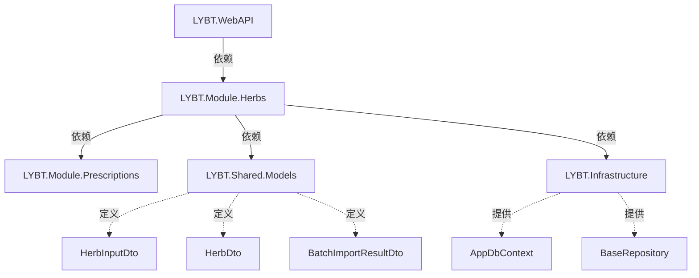

# 药材管理功能完善 - 技术设计文档

**文档版本**: v1.1
**创建日期**: 2025-11-09
**最后更新**: 2025-11-09
**状态**: 🟢 设计评审中（已根据反馈修正）
**相关需求**: [herbs-management-enhancement-requirements.md](herbs-management-enhancement-requirements.md) v1.1

---

## 📋 目录

1. [架构设计](#1-架构设计)
2. [API端点设计](#2-api端点设计)
3. [DTO设计](#3-dto设计)
4. [数据库Schema设计](#4-数据库schema设计)
5. [Service层设计](#5-service层设计)
6. [Repository层设计](#6-repository层设计)
7. [Validator设计](#7-validator设计)
8. [Mapping配置](#8-mapping配置)
9. [代码示例](#9-代码示例)
10. [Phase拆分计划](#10-phase拆分计划)

---

## 1. 架构设计

### 1.1 三层架构分配

```
┌──────────────────────────────────────────────────────────┐
│                  Presentation Layer                      │
│            (LYBT.WebAPI/Controllers)                     │
├──────────────────────────────────────────────────────────┤
│  HerbsController                                         │
│  - BatchImport(IFormFile file)        // FR-001         │
│  - ExportHerbs(string? category)      // FR-002         │
│  - ExportTemplate()                    // FR-003         │
│  - Delete(Guid id)                     // FR-004         │
│  - BatchDelete(List<Guid> ids)         // FR-004         │
└──────────────────────────────────────────────────────────┘
                            ↓ 依赖
┌──────────────────────────────────────────────────────────┐
│                  Application Layer                       │
│          (LYBT.Module.Herbs/Services)                    │
├──────────────────────────────────────────────────────────┤
│  IHerbService / HerbService (internal)                   │
│  - BatchImportAsync(...)               // FR-001         │
│  - ExportAsync(...)                    // FR-002         │
│  - GenerateImportTemplate()            // FR-003         │
│  - CheckReferenceAsync(Guid id)        // FR-004         │
│  - BatchCheckReferenceAsync(...)       // FR-004         │
│  - DeleteAsync(Guid id)                // FR-004         │
│  - GeneratePinYinCode(string name)     // BR-002         │
└──────────────────────────────────────────────────────────┘
                            ↓ 依赖
┌──────────────────────────────────────────────────────────┐
│                 Infrastructure Layer                     │
│        (LYBT.Module.Herbs/Repositories)                  │
├──────────────────────────────────────────────────────────┤
│  IHerbRepository / HerbRepository (internal)             │
│  - GetByNameAsync(string name)         // BR-001         │
│  - ExistsByNameAsync(string name)      // BR-001         │
│  - GetPagedAsync(...)                  // 查询分页       │
│  - GetByCategoryAsync(...)             // 按分类查询     │
│                                                          │
│  IPrescriptionRepository (依赖注入)     // FR-004         │
│  - GetHerbReferenceCountAsync(Guid herbId)              │
│  - GetRecentReferencesAsync(Guid herbId, int top)       │
└──────────────────────────────────────────────────────────┘
                            ↓ 依赖
┌──────────────────────────────────────────────────────────┐
│                    Database Layer                        │
│                 (SQL Server 2022)                        │
├──────────────────────────────────────────────────────────┤
│  Tables:                                                 │
│  - Herbs (已有)                                          │
│  - Prescriptions (依赖)                                  │
│  - PrescriptionItems (依赖)                              │
└──────────────────────────────────────────────────────────┘
```

### 1.2 模块依赖关系



### 1.3 职责划分

#### Server端（本设计文档范围）

| 层次 | 组件 | 职责 | 文件位置 |
|------|------|------|----------|
| **Controller** | HerbsController | API端点、参数验证、响应格式化、Stream接收 | `LYBT.WebAPI/Controllers/HerbsController.cs` |
| **Service** | HerbService | 业务逻辑、批量操作编排、引用检查、**接收已解析的数据** | `LYBT.Module.Herbs/Services/HerbService.cs` |
| **Repository** | HerbRepository | 数据访问、EF Core查询 | `LYBT.Module.Herbs/Repositories/HerbRepository.cs` |
| **Validator** | HerbInputDtoValidator | FluentValidation验证规则 | `LYBT.Shared.Validators/Herbs/HerbInputDtoValidator.cs` |
| **Mapping** | HerbMappingProfile | AutoMapper映射配置 | `LYBT.Module.Herbs/Mapping/HerbMappingProfile.cs` |

**⚠️ 重要职责划分**:
- **Server端仅处理业务逻辑**：接收`List<HerbInputDto>`（已解析的数据），不直接处理Excel文件
- **Excel读写由Desktop层负责**：参考Patients模块（Epic #1934）

#### Client端（Desktop）- Excel处理主体

| 组件 | 职责 | 备注 |
|------|------|------|
| HerbListViewModel | 列表展示、搜索筛选、导入/导出触发 | WPF MVVM |
| **HerbImportService** | **Excel读取（EPPlus）、数据解析、失败数据导出** | **主要Excel处理逻辑** |
| **HerbExportService** | **Excel生成（EPPlus）、模板生成** | **主要Excel处理逻辑** |
| HerbApiService | 调用Server端API（传递`List<HerbInputDto>`） | HTTP Client |

#### Shared层

| 组件 | 职责 | 文件位置 |
|------|------|----------|
| HerbDto | 查询结果DTO | `LYBT.Shared.Models/Contracts/Herbs/HerbDtos.cs` |
| HerbInputDto | 创建/更新DTO | `LYBT.Shared.Models/Contracts/Herbs/HerbDtos.cs` |
| BatchImportResultDto | 批量导入结果DTO | `LYBT.Shared.Models/Contracts/Common/` |
| HerbInputDtoValidator | 验证器 | `LYBT.Shared.Validators/Herbs/` |

---

## 2. API端点设计

### 2.1 批量导入API（FR-001）

```http
POST /api/v1/herbs/import
Content-Type: multipart/form-data
Authorization: Bearer {token}

# Request Body (FormData)
file: <Excel文件> (.xlsx)

# Response (200 OK)
{
  "success": true,
  "message": "导入完成",
  "data": {
    "totalCount": 100,
    "successCount": 95,
    "failedCount": 5,
    "skippedCount": 0,
    "failedItems": [
      {
        "rowNumber": 12,
        "herbName": "当归",
        "errorMessage": "药材名称已存在",
        "originalData": { ... }
      }
    ]
  },
  "timestamp": "2025-11-09T10:30:00Z"
}

# Response (400 Bad Request)
{
  "success": false,
  "message": "仅支持.xlsx格式的Excel文件",
  "errors": [ "文件格式不正确" ],
  "timestamp": "2025-11-09T10:30:00Z"
}
```

**验证规则**:
- 文件大小限制：10MB
- 文件格式：.xlsx
- 最大导入行数：10000（BR-006）

### 2.2 批量导出API（FR-002）

```http
GET /api/v1/herbs/export?category={category}
Authorization: Bearer {token}

# Query Parameters
category: string (可选) - 药材分类筛选

# Response (200 OK)
Content-Type: application/vnd.openxmlformats-officedocument.spreadsheetml.sheet
Content-Disposition: attachment; filename="药材数据_20251109_103000.xlsx"

<Excel文件二进制流>
```

**性能要求**:
- 10000条记录 < 5秒（NFR-001）

### 2.3 导出导入模板API（FR-003）

```http
GET /api/v1/herbs/import-template
Authorization: Bearer {token}

# Response (200 OK)
Content-Type: application/vnd.openxmlformats-officedocument.spreadsheetml.sheet
Content-Disposition: attachment; filename="药材导入模板_20251109.xlsx"

<Excel模板文件>
```

**模板内容**:
- 第1行：列标题（中文）
- 第2-4行：3条示例数据
- 单独说明页：数据格式说明

### 2.4 检查引用API（FR-004）

```http
GET /api/v1/herbs/{id}/references
Authorization: Bearer {token}

# Response (200 OK)
{
  "success": true,
  "data": {
    "herbId": "3fa85f64-5717-4562-b3fc-2c963f66afa6",
    "herbName": "当归",
    "totalReferenceCount": 25,
    "prescriptionCount": 20,
    "recentReferences": [
      {
        "prescriptionId": "...",
        "prescriptionNumber": "RX-20251109-0001",
        "patientName": "张三",
        "prescribedDate": "2025-11-08",
        "quantity": 12.0
      }
    ],
    "canDelete": false,
    "deleteRestriction": "该药材被25个处方引用，仅可软删除"
  }
}
```

### 2.5 批量删除API（FR-004增强）

```http
DELETE /api/v1/herbs/batch
Content-Type: application/json
Authorization: Bearer {token}

# Request Body
{
  "ids": [
    "3fa85f64-5717-4562-b3fc-2c963f66afa6",
    "..."
  ]
}

# Response (200 OK)
{
  "success": true,
  "data": {
    "totalCount": 10,
    "deletedCount": 7,
    "skippedCount": 3,
    "skippedItems": [
      {
        "herbId": "...",
        "herbName": "当归",
        "reason": "被25个处方引用，已软删除"
      }
    ]
  }
}
```

**验证规则**:
- 最大删除数量：100（BR-006）

---

## 3. DTO设计

### 3.1 HerbInputDto（统一创建/更新）

```csharp
/// <summary>
/// 药材输入DTO（统一创建/更新，Epic #1961模式）
/// Id == null: 创建
/// Id != null: 更新
/// </summary>
public class HerbInputDto
{
    /// <summary>
    /// 药材ID（更新时必填，创建时为null）
    /// </summary>
    public Guid? Id { get; set; }

    /// <summary>
    /// 药材名称（必填，1-100字符）
    /// </summary>
    [Required(ErrorMessage = "药材名称不能为空")]
    [StringLength(100, ErrorMessage = "药材名称不能超过100个字符")]
    public string Name { get; set; } = string.Empty;

    /// <summary>
    /// 拼音码（可选，最多50字符，未填写时自动生成）
    /// </summary>
    [StringLength(50, ErrorMessage = "拼音码不能超过50个字符")]
    public string? PinYinCode { get; set; }

    /// <summary>
    /// 药材分类（可选，最多50字符）- 单层级分类（Q1推荐方案）
    /// </summary>
    [StringLength(50, ErrorMessage = "药材分类不能超过50个字符")]
    public string? Category { get; set; }

    /// <summary>
    /// 单位（必填，1-20字符）
    /// </summary>
    [Required(ErrorMessage = "单位不能为空")]
    [StringLength(20, ErrorMessage = "单位不能超过20个字符")]
    public string Unit { get; set; } = "克";

    /// <summary>
    /// 单价（必填，0-999999.99）
    /// </summary>
    [Required(ErrorMessage = "单价不能为空")]
    [Range(0.01, 999999.99, ErrorMessage = "单价必须在0.01-999999.99之间")]
    public decimal Price { get; set; }

    /// <summary>
    /// 成本价（可选，0-999999.99）
    /// </summary>
    [Range(0, 999999.99, ErrorMessage = "成本价必须在0-999999.99之间")]
    public decimal? CostPrice { get; set; }

    /// <summary>
    /// 产地（可选，最多100字符）
    /// </summary>
    [StringLength(100, ErrorMessage = "产地不能超过100个字符")]
    public string? Origin { get; set; }

    /// <summary>
    /// 规格（可选，最多50字符）
    /// </summary>
    [StringLength(50, ErrorMessage = "规格不能超过50个字符")]
    public string? Spec { get; set; }

    /// <summary>
    /// 功效说明（可选，最多1000字符）
    /// </summary>
    [StringLength(1000, ErrorMessage = "功效说明不能超过1000个字符")]
    public string? Effect { get; set; }

    /// <summary>
    /// 用法用量（可选，最多500字符）
    /// </summary>
    [StringLength(500, ErrorMessage = "用法用量不能超过500个字符")]
    public string? Usage { get; set; }

    /// <summary>
    /// 备注（可选，最多500字符）
    /// </summary>
    [StringLength(500, ErrorMessage = "备注不能超过500个字符")]
    public string? Remark { get; set; }

    /// <summary>
    /// 状态（默认启用）
    /// </summary>
    public CommonStatus Status { get; set; } = CommonStatus.Enabled;
}
```

### 3.2 BatchImportResultDto

```csharp
/// <summary>
/// 批量导入结果DTO（复用Shared层已有定义）
/// </summary>
public class BatchImportResultDto
{
    /// <summary>
    /// 总记录数
    /// </summary>
    public int TotalCount { get; set; }

    /// <summary>
    /// 成功导入数量
    /// </summary>
    public int SuccessCount { get; set; }

    /// <summary>
    /// 失败数量
    /// </summary>
    public int FailedCount { get; set; }

    /// <summary>
    /// 跳过数量（重复记录）
    /// </summary>
    public int SkippedCount { get; set; }

    /// <summary>
    /// 失败项详情
    /// </summary>
    public List<ImportFailureDto> FailedItems { get; set; } = new();
}

/// <summary>
/// 导入失败项DTO
/// </summary>
public class ImportFailureDto
{
    /// <summary>
    /// Excel行号
    /// </summary>
    public int RowNumber { get; set; }

    /// <summary>
    /// 药材名称
    /// </summary>
    public string HerbName { get; set; } = string.Empty;

    /// <summary>
    /// 错误信息
    /// </summary>
    public string ErrorMessage { get; set; } = string.Empty;

    /// <summary>
    /// 原始数据（用于失败数据导出）
    /// </summary>
    public Dictionary<string, string> OriginalData { get; set; } = new();
}
```

### 3.3 HerbReferenceCheckDto

```csharp
/// <summary>
/// 药材引用检查结果DTO
/// </summary>
public class HerbReferenceCheckDto
{
    /// <summary>
    /// 药材ID
    /// </summary>
    public Guid HerbId { get; set; }

    /// <summary>
    /// 药材名称
    /// </summary>
    public string HerbName { get; set; } = string.Empty;

    /// <summary>
    /// 总引用次数
    /// </summary>
    public int TotalReferenceCount { get; set; }

    /// <summary>
    /// 引用的处方数量
    /// </summary>
    public int PrescriptionCount { get; set; }

    /// <summary>
    /// 最近的引用记录（最多5条）
    /// </summary>
    public List<PrescriptionReferenceDto> RecentReferences { get; set; } = new();

    /// <summary>
    /// 是否可以删除
    /// </summary>
    public bool CanDelete { get; set; }

    /// <summary>
    /// 删除限制说明
    /// </summary>
    public string? DeleteRestriction { get; set; }
}

/// <summary>
/// 处方引用DTO
/// </summary>
public class PrescriptionReferenceDto
{
    /// <summary>
    /// 处方ID
    /// </summary>
    public Guid PrescriptionId { get; set; }

    /// <summary>
    /// 处方编号
    /// </summary>
    public string PrescriptionNumber { get; set; } = string.Empty;

    /// <summary>
    /// 患者姓名
    /// </summary>
    public string PatientName { get; set; } = string.Empty;

    /// <summary>
    /// 开方日期
    /// </summary>
    public DateTime PrescribedDate { get; set; }

    /// <summary>
    /// 药材用量
    /// </summary>
    public decimal Quantity { get; set; }
}
```

---

## 4. 数据库Schema设计

### 4.1 Herbs表（已有，需优化索引）

```sql
CREATE TABLE [dbo].[Herbs] (
    [Id] UNIQUEIDENTIFIER NOT NULL PRIMARY KEY DEFAULT NEWID(),
    [Name] NVARCHAR(100) NOT NULL,
    [PinYinCode] NVARCHAR(50),
    [Category] NVARCHAR(50),  -- 药材分类（单层级，Q1推荐方案）
    [Origin] NVARCHAR(100),
    [Spec] NVARCHAR(100),
    [Unit] NVARCHAR(10) NOT NULL DEFAULT N'克',
    [Price] DECIMAL(18,2) NOT NULL,
    [CostPrice] DECIMAL(18,2),
    [Effect] NVARCHAR(500),
    [Usage] NVARCHAR(500),
    [Remark] NVARCHAR(500),
    [Status] INT NOT NULL DEFAULT 1,  -- CommonStatus枚举

    -- 审计字段（继承自BaseEntity）
    [CreatedAt] DATETIME2 NOT NULL DEFAULT GETUTCDATE(),
    [CreatedBy] NVARCHAR(100),
    [UpdatedAt] DATETIME2,
    [UpdatedBy] NVARCHAR(100),
    [RowVersion] ROWVERSION NOT NULL,
    [IsDeleted] BIT NOT NULL DEFAULT 0
);

-- ✅ 索引优化（新增）
CREATE UNIQUE NONCLUSTERED INDEX [IX_Herbs_Name_Unique]
    ON [dbo].[Herbs]([Name])
    WHERE [IsDeleted] = 0;  -- BR-001: 药材名称唯一性（软删除后名称可重用）

CREATE NONCLUSTERED INDEX [IX_Herbs_PinYinCode]
    ON [dbo].[Herbs]([PinYinCode])
    WHERE [IsDeleted] = 0;  -- BR-002: 拼音码检索

CREATE NONCLUSTERED INDEX [IX_Herbs_Status_IsDeleted]
    ON [dbo].[Herbs]([Status], [IsDeleted])
    INCLUDE ([Name], [Unit], [Price]);  -- 列表查询性能优化

-- ✅ EF Core Query Filter（已有）
-- modelBuilder.Entity<Herb>().HasQueryFilter(h => !h.IsDeleted);
```

### 4.2 索引策略说明

| 索引名称 | 类型 | 用途 | 性能提升 |
|----------|------|------|----------|
| `IX_Herbs_Name_Unique` | 唯一索引（过滤软删除） | BR-001名称唯一性验证 | 导入时重复检查 < 5ms |
| `IX_Herbs_PinYinCode` | 非聚集索引 | 拼音码快速检索 | 搜索查询 < 50ms |
| `IX_Herbs_Status_IsDeleted` | 覆盖索引 | 列表分页查询 | 分页查询 < 300ms |

### 4.3 数据迁移脚本（EF Core Migration）

```csharp
public partial class AddHerbsIndexes : Migration
{
    protected override void Up(MigrationBuilder migrationBuilder)
    {
        // 唯一索引：药材名称（过滤软删除）
        migrationBuilder.CreateIndex(
            name: "IX_Herbs_Name_Unique",
            table: "Herbs",
            column: "Name",
            unique: true,
            filter: "[IsDeleted] = 0");

        // 非聚集索引：拼音码
        migrationBuilder.CreateIndex(
            name: "IX_Herbs_PinYinCode",
            table: "Herbs",
            column: "PinYinCode",
            filter: "[IsDeleted] = 0");

        // 覆盖索引：状态+软删除标记
        migrationBuilder.Sql(@"
            CREATE NONCLUSTERED INDEX [IX_Herbs_Status_IsDeleted]
            ON [dbo].[Herbs]([Status], [IsDeleted])
            INCLUDE ([Name], [Unit], [Price]);
        ");
    }

    protected override void Down(MigrationBuilder migrationBuilder)
    {
        migrationBuilder.DropIndex(name: "IX_Herbs_Name_Unique", table: "Herbs");
        migrationBuilder.DropIndex(name: "IX_Herbs_PinYinCode", table: "Herbs");
        migrationBuilder.DropIndex(name: "IX_Herbs_Status_IsDeleted", table: "Herbs");
    }
}
```

---

## 5. Service层设计

### 5.1 IHerbService接口（增强现有接口）

```csharp
/// <summary>
/// 药材服务接口
/// </summary>
public interface IHerbService
{
    // ===== FR-001: 批量导入 =====
    /// <summary>
    /// 批量导入药材数据
    /// ⚠️ 注意：Excel解析由Desktop层完成，此方法接收已解析的数据
    /// </summary>
    /// <param name="herbs">Desktop层解析的药材数据列表</param>
    /// <param name="fileName">文件名（用于日志）</param>
    /// <param name="duplicateStrategy">重复处理策略（Skip/Update/Error）</param>
    /// <returns>导入结果</returns>
    Task<ServiceResult<BatchImportResultDto>> BatchImportAsync(
        List<HerbInputDto> herbs,
        string? fileName = null,
        DuplicateHandlingStrategy duplicateStrategy = DuplicateHandlingStrategy.Skip);

    // ===== FR-002: 批量导出（Server端仅提供数据） =====
    /// <summary>
    /// 查询药材数据用于导出
    /// ⚠️ 注意：Excel生成由Desktop层完成，此方法仅返回数据列表
    /// </summary>
    /// <param name="category">分类筛选（可选）</param>
    /// <returns>药材数据列表</returns>
    Task<ServiceResult<List<HerbDto>>> GetAllForExportAsync(string? category = null);

    // ===== FR-004: 删除前引用检查 =====
    /// <summary>
    /// 检查药材是否被处方引用
    /// </summary>
    /// <param name="herbId">药材ID</param>
    /// <returns>引用检查结果</returns>
    Task<ServiceResult<HerbReferenceCheckDto>> CheckReferenceAsync(Guid herbId);

    /// <summary>
    /// 批量检查药材引用（批量删除前调用）
    /// </summary>
    /// <param name="herbIds">药材ID列表</param>
    /// <returns>引用检查结果列表</returns>
    Task<ServiceResult<List<HerbReferenceCheckDto>>> BatchCheckReferenceAsync(List<Guid> herbIds);

    /// <summary>
    /// 删除药材（软删除）
    /// </summary>
    /// <param name="id">药材ID</param>
    /// <returns>操作结果</returns>
    Task<ServiceResult> DeleteAsync(Guid id);

    // ===== BR-002: 拼音码生成（使用Shared层PinYinHelper） =====
    /// <summary>
    /// 根据药材名称生成拼音码
    /// 实现：调用 LYBT.Shared.Utilities.Text.PinYinHelper.GetPinYinCode(name)
    /// </summary>
    /// <param name="name">药材名称</param>
    /// <returns>拼音码（大写）</returns>
    string GeneratePinYinCode(string name);

    // ===== 现有方法（保持兼容性） =====
    Task<ServiceResult<HerbDto>> GetByIdAsync(Guid id);
    Task<ServiceResult<PagedResult<HerbDto>>> GetPagedAsync(int page, int pageSize, string? keyword = null);
    Task<ServiceResult<Guid>> CreateAsync(HerbInputDto dto);
    Task<ServiceResult> UpdateAsync(Guid id, HerbInputDto dto);
}
```

### 5.2 Service层业务逻辑关键点

#### 5.2.1 BatchImportAsync实现要点

**⚠️ 重要**：Excel解析由Desktop层（HerbImportService）完成，Server端仅接收`List<HerbInputDto>`

```csharp
public async Task<ServiceResult<BatchImportResultDto>> BatchImportAsync(
    List<HerbInputDto> herbs,  // Desktop层已解析的数据
    string? fileName,
    DuplicateHandlingStrategy duplicateStrategy)
{
    var result = new BatchImportResultDto();

    try
    {
        // 1. 接收Desktop层解析的数据（无需EPPlus）
        result.TotalCount = herbs.Count;

        // 2. BR-002: 自动生成拼音码（使用Shared层PinYinHelper）
        foreach (var dto in herbs)
        {
            if (string.IsNullOrWhiteSpace(dto.PinYinCode))
            {
                // ✅ 调用Shared层现有工具类
                dto.PinYinCode = PinYinHelper.GetPinYinCode(dto.Name);
            }
        }

        // 4. BR-006: 批量操作限制
        if (herbs.Count > 10000)
        {
            return ServiceResult<BatchImportResultDto>.Failure("批量导入最多支持10000条记录");
        }

        // 5. 批量验证（FluentValidation）
        var validator = new HerbInputDtoValidator();
        foreach (var (dto, index) in herbs.Select((h, i) => (h, i)))
        {
            var validationResult = await validator.ValidateAsync(dto);
            if (!validationResult.IsValid)
            {
                result.FailedItems.Add(new ImportFailureDto
                {
                    RowNumber = index + 2,
                    HerbName = dto.Name,
                    ErrorMessage = string.Join("; ", validationResult.Errors.Select(e => e.ErrorMessage)),
                    OriginalData = ConvertToDict(dto)
                });
                result.FailedCount++;
                continue;
            }

            // 6. BR-001: 名称唯一性检查
            var existingHerb = await _repository.GetByNameAsync(dto.Name);
            if (existingHerb != null)
            {
                switch (duplicateStrategy)
                {
                    case DuplicateHandlingStrategy.Skip:
                        result.SkippedCount++;
                        continue;

                    case DuplicateHandlingStrategy.Update:
                        // 更新现有记录
                        _mapper.Map(dto, existingHerb);
                        await _repository.UpdateAsync(existingHerb);
                        result.SuccessCount++;
                        break;

                    case DuplicateHandlingStrategy.Error:
                        result.FailedItems.Add(new ImportFailureDto
                        {
                            RowNumber = index + 2,
                            HerbName = dto.Name,
                            ErrorMessage = "药材名称已存在",
                            OriginalData = ConvertToDict(dto)
                        });
                        result.FailedCount++;
                        break;
                }
            }
            else
            {
                // 7. 新增药材
                var entity = _mapper.Map<Herb>(dto);
                await _repository.AddAsync(entity);
                result.SuccessCount++;
            }
        }

        // 8. 批量保存（EF Core Transaction）
        await _repository.SaveChangesAsync();

        return ServiceResult<BatchImportResultDto>.Success(result);
    }
    catch (Exception ex)
    {
        _logger.LogError(ex, "批量导入药材失败：{FileName}", fileName);
        return ServiceResult<BatchImportResultDto>.Failure("批量导入失败");
    }
}
```

#### 5.2.2 CheckReferenceAsync实现要点

```csharp
public async Task<ServiceResult<HerbReferenceCheckDto>> CheckReferenceAsync(Guid herbId)
{
    try
    {
        // 1. 获取药材信息
        var herb = await _repository.GetByIdAsync(herbId);
        if (herb == null)
        {
            return ServiceResult<HerbReferenceCheckDto>.Failure("药材不存在");
        }

        // 2. 查询处方引用（跨模块依赖 IPrescriptionRepository）
        var referenceCount = await _prescriptionRepository.GetHerbReferenceCountAsync(herbId);
        var recentReferences = await _prescriptionRepository.GetRecentReferencesAsync(herbId, 5);

        // 3. 构建结果DTO
        var result = new HerbReferenceCheckDto
        {
            HerbId = herbId,
            HerbName = herb.Name,
            TotalReferenceCount = referenceCount,
            PrescriptionCount = recentReferences.Count,
            RecentReferences = _mapper.Map<List<PrescriptionReferenceDto>>(recentReferences),
            CanDelete = true,  // BR-007: 总是允许软删除
            DeleteRestriction = referenceCount > 0
                ? $"该药材被{referenceCount}个处方引用，仅可软删除"
                : null
        };

        return ServiceResult<HerbReferenceCheckDto>.Success(result);
    }
    catch (Exception ex)
    {
        _logger.LogError(ex, "检查药材引用失败：{HerbId}", herbId);
        return ServiceResult<HerbReferenceCheckDto>.Failure("检查引用失败");
    }
}
```

---

## 6. Repository层设计

### 6.1 IHerbRepository接口（增强）

```csharp
/// <summary>
/// 药材仓储接口
/// </summary>
public interface IHerbRepository
{
    // ===== BR-001: 名称唯一性验证 =====
    /// <summary>
    /// 根据名称获取药材（不区分大小写）
    /// </summary>
    Task<Herb?> GetByNameAsync(string name);

    /// <summary>
    /// 检查药材名称是否已存在
    /// </summary>
    Task<bool> ExistsByNameAsync(string name);

    // ===== 分页查询 =====
    /// <summary>
    /// 分页查询药材列表
    /// </summary>
    Task<PagedResult<Herb>> GetPagedAsync(
        int page,
        int pageSize,
        string? keyword = null,
        CommonStatus? status = null);

    // ===== FR-002: 按分类导出 =====
    /// <summary>
    /// 根据分类查询药材列表（全量，用于导出）
    /// </summary>
    Task<List<Herb>> GetByCategoryAsync(string? category = null);

    // ===== 基础CRUD =====
    Task<Herb?> GetByIdAsync(Guid id);
    Task<Guid> AddAsync(Herb entity);
    Task UpdateAsync(Herb entity);
    Task DeleteAsync(Guid id);  // BR-007: 软删除实现
    Task<int> SaveChangesAsync();
}
```

### 6.2 Repository层实现要点

```csharp
/// <summary>
/// 药材仓储实现类（internal，Epic #1600强制聚合根模式）
/// </summary>
internal class HerbRepository : IHerbRepository
{
    private readonly AppDbContext _context;

    public HerbRepository(AppDbContext context)
    {
        _context = context;
    }

    // BR-001: 名称唯一性验证（不区分大小写，过滤软删除）
    public async Task<Herb?> GetByNameAsync(string name)
    {
        return await _context.Herbs
            .FirstOrDefaultAsync(h =>
                EF.Functions.Like(h.Name, name) && !h.IsDeleted);
    }

    public async Task<bool> ExistsByNameAsync(string name)
    {
        return await _context.Herbs
            .AnyAsync(h =>
                EF.Functions.Like(h.Name, name) && !h.IsDeleted);
    }

    // 分页查询（使用Epic #1725辅助方法）
    public async Task<PagedResult<Herb>> GetPagedAsync(
        int page,
        int pageSize,
        string? keyword,
        CommonStatus? status)
    {
        var query = _context.Herbs.AsQueryable();

        // 关键词搜索（名称/拼音码）
        if (!string.IsNullOrWhiteSpace(keyword))
        {
            query = query.Where(h =>
                h.Name.Contains(keyword) ||
                (h.PinYinCode != null && h.PinYinCode.Contains(keyword)));
        }

        // 状态筛选
        if (status.HasValue)
        {
            query = query.Where(h => h.Status == status.Value);
        }

        // 排序（名称拼音码优先）
        query = query.OrderBy(h => h.PinYinCode ?? h.Name);

        // Epic #1725辅助方法
        return await GetPagedResultAsync(query, page, pageSize);
    }

    // FR-002: 全量查询（用于导出）
    public async Task<List<Herb>> GetByCategoryAsync(string? category)
    {
        var query = _context.Herbs.AsQueryable();

        // ⚠️ MVP阶段：Category字段暂未实现，预留扩展
        // if (!string.IsNullOrWhiteSpace(category))
        // {
        //     query = query.Where(h => h.Category == category);
        // }

        return await query
            .OrderBy(h => h.PinYinCode ?? h.Name)
            .AsNoTracking()
            .ToListAsync();
    }

    // BR-007: 软删除实现
    public async Task DeleteAsync(Guid id)
    {
        var entity = await GetByIdAsync(id);
        if (entity != null)
        {
            entity.IsDeleted = true;
            entity.UpdatedAt = DateTime.UtcNow;
            _context.Herbs.Update(entity);
        }
    }
}
```

---

## 7. Validator设计

### 7.1 HerbInputDtoValidator（FluentValidation）

```csharp
/// <summary>
/// 药材输入DTO验证器（Epic #1961统一验证框架）
/// </summary>
public class HerbInputDtoValidator : AbstractValidator<HerbInputDto>
{
    public HerbInputDtoValidator()
    {
        // BR-001: 药材名称唯一性（Service层验证）
        RuleFor(x => x.Name)
            .NotEmpty().WithMessage("药材名称不能为空")
            .MaximumLength(100).WithMessage("药材名称不能超过100个字符");

        // BR-002: 拼音码（可选）
        RuleFor(x => x.PinYinCode)
            .MaximumLength(50).WithMessage("拼音码不能超过50个字符")
            .When(x => !string.IsNullOrWhiteSpace(x.PinYinCode));

        // 药材分类（可选）
        RuleFor(x => x.Category)
            .MaximumLength(50).WithMessage("药材分类不能超过50个字符")
            .When(x => !string.IsNullOrWhiteSpace(x.Category));

        // 单位（必填）
        RuleFor(x => x.Unit)
            .NotEmpty().WithMessage("单位不能为空")
            .MaximumLength(20).WithMessage("单位不能超过20个字符");

        // BR-003: 单价验证规则
        RuleFor(x => x.Price)
            .GreaterThan(0).WithMessage("单价必须大于0")
            .LessThanOrEqualTo(999999.99m).WithMessage("单价不能超过999999.99");

        // BR-008: 成本价可选性
        RuleFor(x => x.CostPrice)
            .GreaterThanOrEqualTo(0).WithMessage("成本价不能为负数")
            .LessThanOrEqualTo(999999.99m).WithMessage("成本价不能超过999999.99")
            .When(x => x.CostPrice.HasValue);

        // 产地（可选）
        RuleFor(x => x.Origin)
            .MaximumLength(100).WithMessage("产地不能超过100个字符")
            .When(x => !string.IsNullOrWhiteSpace(x.Origin));

        // 规格（可选）
        RuleFor(x => x.Spec)
            .MaximumLength(50).WithMessage("规格不能超过50个字符")
            .When(x => !string.IsNullOrWhiteSpace(x.Spec));

        // 功效说明（可选）
        RuleFor(x => x.Effect)
            .MaximumLength(1000).WithMessage("功效说明不能超过1000个字符")
            .When(x => !string.IsNullOrWhiteSpace(x.Effect));

        // 用法用量（可选）
        RuleFor(x => x.Usage)
            .MaximumLength(500).WithMessage("用法用量不能超过500个字符")
            .When(x => !string.IsNullOrWhiteSpace(x.Usage));

        // 备注（可选）
        RuleFor(x => x.Remark)
            .MaximumLength(500).WithMessage("备注不能超过500个字符")
            .When(x => !string.IsNullOrWhiteSpace(x.Remark));

        // 创建/更新场景区分（Epic #1961模式）
        // 更新时Id必须提供
        When(x => x.Id.HasValue, () =>
        {
            RuleFor(x => x.Id).NotEmpty().WithMessage("更新时药材ID不能为空");
        });
    }
}
```

---

## 8. Mapping配置

### 8.1 HerbMappingProfile（AutoMapper）

```csharp
/// <summary>
/// 药材映射配置（AutoMapper）
/// </summary>
public class HerbMappingProfile : Profile
{
    public HerbMappingProfile()
    {
        // HerbInputDto -> Herb（创建/更新）
        CreateMap<HerbInputDto, Herb>()
            .ForMember(dest => dest.Id, opt => opt.Ignore())  // Service层生成
            .ForMember(dest => dest.CreatedAt, opt => opt.Ignore())
            .ForMember(dest => dest.CreatedBy, opt => opt.Ignore())
            .ForMember(dest => dest.UpdatedAt, opt => opt.Ignore())
            .ForMember(dest => dest.UpdatedBy, opt => opt.Ignore())
            .ForMember(dest => dest.RowVersion, opt => opt.Ignore())
            .ForMember(dest => dest.IsDeleted, opt => opt.Ignore());

        // Herb -> HerbDto（查询）
        CreateMap<Herb, HerbDto>();

        // Herb -> HerbDetailDto（详情）
        CreateMap<Herb, HerbDetailDto>();

        // PrescriptionItem -> PrescriptionReferenceDto（引用检查）
        CreateMap<PrescriptionItem, PrescriptionReferenceDto>()
            .ForMember(dest => dest.PrescriptionId, opt => opt.MapFrom(src => src.PrescriptionId))
            .ForMember(dest => dest.PrescriptionNumber, opt => opt.MapFrom(src => src.Prescription.PrescriptionNumber))
            .ForMember(dest => dest.PatientName, opt => opt.MapFrom(src => src.Prescription.MedicalCase.PatientName))
            .ForMember(dest => dest.PrescribedDate, opt => opt.MapFrom(src => src.Prescription.CreatedAt));
    }
}
```

---

## 9. 代码示例

### 9.1 Controller示例（HerbsController部分）

```csharp
/// <summary>
/// 药材管理控制器
/// </summary>
[ApiController]
[ApiVersion("1")]
[Route("api/v{version:apiVersion}/[controller]")]
public class HerbsController : BaseApiController
{
    private readonly IHerbService _herbService;

    public HerbsController(IHerbService herbService)
    {
        _herbService = herbService;
    }

    /// <summary>
    /// 批量导入药材数据（FR-001）
    /// ⚠️ 注意：接收Desktop层解析的数据，不直接处理Excel文件
    /// </summary>
    [HttpPost("import")]
    [ProducesResponseType(typeof(ApiResponse<BatchImportResultDto>), StatusCodes.Status200OK)]
    [ProducesResponseType(typeof(ApiResponse), StatusCodes.Status400BadRequest)]
    public async Task<IActionResult> BatchImport([FromBody] List<HerbInputDto> herbs)
    {
        // 1. 参数验证
        if (herbs == null || herbs.Count == 0)
        {
            return BadRequest("导入数据不能为空");
        }

        // 2. 调用Service（Desktop层已完成Excel解析）
        var result = await _herbService.BatchImportAsync(herbs, fileName: null);

        // 3. 返回结果
        return HandleServiceResult(result);
    }

    /// <summary>
    /// 查询药材数据用于导出（FR-002）
    /// ⚠️ 注意：Excel生成由Desktop层完成，此端点仅返回数据列表
    /// </summary>
    [HttpGet("export")]
    [ProducesResponseType(typeof(ApiResponse<List<HerbDto>>), StatusCodes.Status200OK)]
    public async Task<IActionResult> GetAllForExport([FromQuery] string? category = null)
    {
        var result = await _herbService.GetAllForExportAsync(category);
        return HandleServiceResult(result);
    }

    // ⚠️ FR-003导出模板功能：
    // 模板生成由Desktop层（HerbExportService）完成，无需Server端API

    /// <summary>
    /// 检查药材引用（FR-004）
    /// </summary>
    [HttpGet("{id}/references")]
    [ProducesResponseType(typeof(ApiResponse<HerbReferenceCheckDto>), StatusCodes.Status200OK)]
    public async Task<IActionResult> CheckReferences(Guid id)
    {
        var result = await _herbService.CheckReferenceAsync(id);
        return HandleServiceResult(result);
    }

    /// <summary>
    /// 批量删除药材（FR-004）
    /// </summary>
    [HttpDelete("batch")]
    [ProducesResponseType(typeof(ApiResponse<BatchDeleteResultDto>), StatusCodes.Status200OK)]
    public async Task<IActionResult> BatchDelete([FromBody] List<Guid> ids)
    {
        // BR-006: 批量删除限制
        if (ids.Count > 100)
        {
            return BadRequest("批量删除最多支持100条记录");
        }

        var result = await _herbService.BatchDeleteAsync(ids);
        return HandleServiceResult(result);
    }
}
```

---

## 10. Phase拆分计划

### Phase 1: 基础架构与数据库优化（2天）

**目标**: 完成数据库索引优化、Repository层实现、基础CRUD验证

**任务清单**:
- [ ] **Task 1.1**: 创建EF Core Migration添加Category字段和索引（1.5小时）
  - 添加`Category NVARCHAR(50)`字段（单层级分类，Q1推荐方案）
  - `IX_Herbs_Name_Unique`（唯一索引）
  - `IX_Herbs_PinYinCode`（拼音码索引）
  - `IX_Herbs_Status_IsDeleted`（覆盖索引）
- [ ] **Task 1.2**: 完善HerbRepository实现（3小时）
  - `GetByNameAsync()` - 名称唯一性检查
  - `GetPagedAsync()` - 分页查询优化
  - `GetByCategoryAsync()` - 全量查询（用于导出）
  - 标记实现类为`internal`（Epic #1600）
- [ ] **Task 1.3**: 创建HerbInputDtoValidator（1小时）
  - 8条验证规则（BR-001至BR-008）
  - Epic #1961统一验证框架
- [ ] **Task 1.4**: 配置HerbMappingProfile（1小时）
  - `HerbInputDto -> Herb`映射
  - `Herb -> HerbDto`映射
- [ ] **Task 1.5**: 运行Migration并验证索引（1小时）
  - 执行`dotnet ef migrations add AddHerbsIndexes`
  - 执行`dotnet ef database update`
  - 查询执行计划验证索引生效

**验收标准**:
- ✅ 数据库索引创建成功，查询性能测试通过
- ✅ Repository单元测试覆盖率 > 80%
- ✅ FluentValidation验证器测试通过

---

### Phase 2: 批量导入功能（2.5天）

**目标**: 实现FR-001批量导入功能（Server端业务逻辑）

**任务清单**:
- [ ] **Task 2.1**: 实现HerbService.GeneratePinYinCode()（1小时）
  - ✅ 调用Shared层PinYinHelper.GetPinYinCode()（已实现）
  - 单元测试（常见药材名称："当归" → "DG"）
- [ ] **Task 2.2**: 实现HerbService.BatchImportAsync()核心逻辑（5小时）
  - ⚠️ 接收Desktop层解析的`List<HerbInputDto>`（无需EPPlus）
  - 批量验证（FluentValidation）
  - 重复检查（BR-001）
  - 拼音码自动生成（BR-002，调用PinYinHelper）
  - 重复处理策略（BR-004：Skip/Update/Error）
  - 失败数据记录
- [ ] **Task 2.3**: 实现HerbsController.BatchImport()（1.5小时）
  - 参数验证（数据非空、数量限制）
  - 调用Service层
  - 响应格式化
- [ ] **Task 2.4**: 单元测试（4小时）
  - 正常导入场景
  - 重复数据处理（3种策略）
  - 失败数据记录
  - 批量限制验证（BR-006）
- [ ] **Task 2.5**: 集成测试（2小时）
  - 端到端导入流程
  - 性能测试（1000条 < 10秒）

**验收标准**:
- ✅ 批量导入功能完整实现
- ✅ 失败数据导出功能正常
- ✅ 性能测试通过（1000条 < 10秒）
- ✅ 单元测试覆盖率 > 85%

---

### Phase 3: 导出数据查询功能（1.5天）

**目标**: 实现FR-002数据查询接口（Excel生成由Desktop层完成）

**任务清单**:
- [ ] **Task 3.1**: 实现HerbService.GetAllForExportAsync()（2小时）
  - 分类筛选查询（支持Category参数）
  - 全量数据返回（使用`GetByCategoryAsync`）
  - 性能优化（AsNoTracking）
- [ ] **Task 3.2**: 实现HerbsController.GetAllForExport()（1小时）
  - `GetAllForExport(string? category)` API端点
  - 参数验证
  - 响应格式化
- [ ] **Task 3.3**: 单元测试（3小时）
  - 分类筛选测试
  - 全量查询测试
  - 性能测试（10000条 < 2秒）

**验收标准**:
- ✅ 数据查询功能正常（支持分类筛选）
- ✅ 性能测试通过（10000条 < 2秒）
- ⚠️ Excel生成和模板功能由Desktop层实现（Phase外）

---

### Phase 4: 删除前引用检查（2天）

**目标**: 实现FR-004删除前引用检查（跨模块依赖）

**任务清单**:
- [ ] **Task 4.1**: 扩展IPrescriptionRepository接口（2小时）
  - `GetHerbReferenceCountAsync(Guid herbId)`
  - `GetRecentReferencesAsync(Guid herbId, int top)`
- [ ] **Task 4.2**: 实现HerbService引用检查方法（4小时）
  - `CheckReferenceAsync()`
  - `BatchCheckReferenceAsync()`
- [ ] **Task 4.3**: 实现HerbsController引用检查端点（2小时）
  - `CheckReferences(Guid id)`
  - `BatchDelete(List<Guid> ids)`（调用引用检查）
- [ ] **Task 4.4**: 单元测试（3小时）
  - 引用检查逻辑测试
  - 批量删除测试
  - 软删除验证（BR-007）
- [ ] **Task 4.5**: 集成测试（2小时）
  - 跨模块依赖验证
  - 性能测试（< 500ms）

**验收标准**:
- ✅ 引用检查功能正常
- ✅ 软删除策略正确实施
- ✅ 批量删除限制验证通过（≤100条）
- ✅ 性能测试通过（< 500ms）

---

### Phase 5: 集成测试与文档（1天）

**目标**: 完整端到端测试、API文档生成

**任务清单**:
- [ ] **Task 5.1**: 集成测试（4小时）
  - 完整业务流程测试
  - 边界条件测试
  - 并发测试
- [ ] **Task 5.2**: Swagger文档完善（2小时）
  - API注释补充
  - 示例数据添加
- [ ] **Task 5.3**: 更新架构文档（2小时）
  - 同步docs/explanation/architecture/server/README.md
  - 更新docs/reference/api/herbs-api.md

**验收标准**:
- ✅ 所有集成测试通过
- ✅ Swagger文档完整且准确
- ✅ 架构文档同步更新

---

## 📊 总结

### 工作量估算

| Phase | 预计工时 | 涉及文件数 | 关键风险 |
|-------|---------|-----------|---------|
| Phase 1 | 2天（16小时） | 6个 | EF Core Migration可能失败 |
| Phase 2 | 2.5天（20小时） | 6个 | 业务逻辑复杂度 |
| Phase 3 | 1.5天（12小时） | 4个 | 查询性能优化 |
| Phase 4 | 2天（16小时） | 7个 | 跨模块依赖复杂度 |
| Phase 5 | 1天（8小时） | 3个 | 集成测试覆盖不全 |
| **总计** | **9天（72小时）** | **26个** | - |

**⚠️ 说明**: Excel处理逻辑由Desktop层实现（不在此估算范围）

### 技术风险与缓解措施

| 风险 | 影响 | 概率 | 缓解措施 |
|------|------|------|---------|
| EF Core Migration失败 | 高 | 低 | 提前备份数据库，Migration脚本手动验证 |
| Desktop-Server数据传输性能 | 中 | 中 | 分批处理（每批1000条），使用压缩 |
| 跨模块依赖耦合度高 | 中 | 低 | 通过接口依赖，最小化直接引用 |
| Category字段数据迁移 | 低 | 低 | 新字段可为NULL，现有数据不受影响 |

### 依赖项检查

| 依赖项 | 版本 | 状态 | 备注 |
|--------|------|------|------|
| EPPlus | 7.x | ✅ 已安装（Desktop） | MIT许可，Desktop层Excel处理 |
| PinYinHelper | - | ✅ 已实现（Shared） | `LYBT.Shared.Utilities.Text.PinYinHelper` |
| FluentValidation | 11.x | ✅ 已安装 | Epic #1961统一验证框架 |
| AutoMapper | 13.x | ✅ 已安装 | 对象映射 |
| hyjiacan.pinyin4net | 4.1.1 | ✅ 已安装（Shared） | PinYinHelper底层依赖 |

---

**设计文档** - 药材管理功能完善技术设计 v1.1
**最后更新**: 2025-11-09
**审核状态**: 已根据反馈修正（待任务分解）
**相关Issue**: 待创建

**v1.1 变更说明**:
1. ✅ 拼音码生成：改用Shared层`PinYinHelper.GetPinYinCode()`（不再依赖TinyPinyin.NET）
2. ✅ 添加Category字段：Herb实体、HerbInputDto、数据库Schema均已添加（单层级分类）
3. ✅ Excel处理职责：明确Desktop层负责Excel读写，Server端仅处理业务逻辑和数据流

