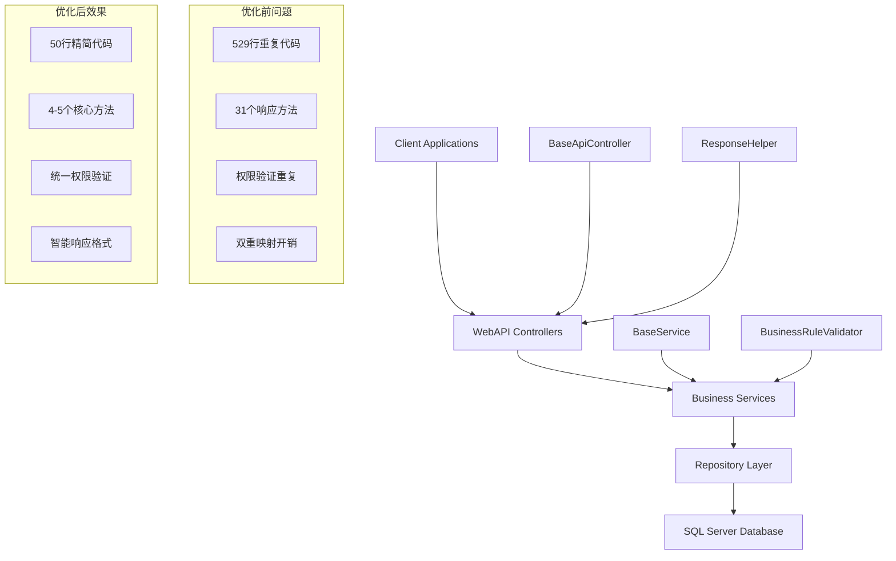

# Server端架构优化技术设计文档

**版本**: v1.0
**创建日期**: 2025-11-14
**需求文档**: [Server端架构优化需求讨论](server-optimization-discussion.md)
**架构验证**: ✅ 通过 lybtzyzs-design-arch-validator

---

## 🎯 设计目标

**业务目标**: 优化LYBT.Server端架构，消除过度设计，提升开发效率和维护性，同时保持所有现有业务功能的完整性。

**技术目标**:
- API响应时间减少15-25%
- 数据传输效率提升33%
- 代码重复率降低80%
- 新功能开发时间减少20%
- 维护成本降低60%

---

## 🏗️ 架构设计

### 组件关系图



### 数据流设计

#### 当前数据流（存在冗余）
```
用户请求 → Controller验证 → BaseApiController包装 → Service业务逻辑 → DTO映射 → Repository查询 → 数据库返回
     ↓                                    ↓                                        ↓
    重复权限验证                    31个重复方法                              双重映射开销
```

#### 优化后数据流（高效简洁）
```
用户请求 → 权限中间件 → Controller → Service统一业务逻辑 → 智能响应 → 数据库返回
     ↓                      ↓                                          ↓
   统一验证           ResponseHelper智能格式                           单次映射
```

### 聚合根边界
- **保持现有聚合根**: MedicalCase、Patient、User等
- **Write操作**: 继续通过聚合根确保一致性
- **Read操作**: 独立查询，避免聚合根开销
- **优化重点**: 消除代码层面的冗余，不改变数据模型

### 层级职责划分

#### Presentation Layer (Controllers)
- **职责**: HTTP请求处理、参数验证、响应格式化
- **优化**: 使用统一的BaseApiController，消除重复响应方法
- **新组件**: ResponseHelper（智能响应格式选择）

#### Application Layer (Services)
- **职责**: 业务逻辑实现、业务规则验证、事务管理
- **优化**: 统一权限验证，减少双重映射，集中业务规则
- **新组件**: BaseService、BusinessRuleValidator

#### Infrastructure Layer (Repositories)
- **职责**: 数据访问、聚合根加载、查询优化
- **保持**: 现有Repository模式和Entity Framework Core
- **优化**: 性能监控，查询优化

---

## 🔧 API端点设计

### 全局优化策略

#### ResponseHelper统一响应格式
```csharp
// 新增ResponseHelper类 - 智能响应格式选择
public static class ResponseHelper
{
    // 大数据直接返回 (>=1KB)
    public static IActionResult DirectResponse(object data) => Ok(data);

    // 小数据包装返回 (<1KB)
    public static IActionResult WrappedResponse(object data, string message = "操作成功")
    {
        return Ok(new { success = true, message, data });
    }

    // 自动判断包装策略
    public static IActionResult SmartResponse(object data, string message = "操作成功")
    {
        var dataSize = JsonSerializer.SerializeToUtf8Bytes(data).Length;
        return dataSize >= 1024 ? DirectResponse(data) : WrappedResponse(data, message);
    }
}
```

### MedicalCase模块端点优化

#### 统一更新接口（合并6个端点为1个）
```csharp
// 优化前：6个分离的端点
PUT /api/v1/medicalcases/{id}/consultation      // 更新辨证
PUT /api/v1/medicalcases/{id}/prescription-flag // 标记处方
PUT /api/v1/medicalcases/{id}/status           // 更新状态
PUT /api/v1/medicalcases/{id}/complete         // 强制完成
PUT /api/v1/medicalcases/{id}/close            // 灵活完成
POST /api/v1/medicalcases/{id}/prescriptions    // 创建处方

// 优化后：1个统一接口
PUT /api/v1/medicalcases/{id}?flexibleMode={bool}
```

#### 统一更新接口实现
```csharp
[HttpPut("{id}")]
public async Task<IActionResult> UpdateMedicalCase(
    Guid id,
    [FromBody] UpdateMedicalCaseRequest request,
    [FromQuery] bool flexibleMode = false)
{
    // 权限验证通过中间件自动处理
    var currentUserId = HttpContext.Items["CurrentUserId"] as Guid? ?? Guid.Empty;
    var isAdmin = HttpContext.Items["IsAdmin"] as bool? ?? false;

    var result = await _medicalCaseService.UpdateMedicalCaseAsync(
        id, request, currentUserId, isAdmin, flexibleMode);

    return ResponseHelper.SmartResponse(result);
}
```

#### 保留的关键端点
| 端点 | 功能 | 优化说明 |
|-----|------|----------|
| `POST /medicalcases` | 创建病案 | 保持不变 |
| `GET /medicalcases/{id}` | 获取详情 | 使用ResponseHelper |
| `GET /medicalcases` | 列表查询 | 使用ResponseHelper |
| `PUT /medicalcases/{id}` | 统一更新 | 合并6个端点 |
| `DELETE /medicalcases/{id}` | 删除病案 | 保持不变 |
| `GET /medicalcases/patient/{patientId}/unfinished` | 查询未完成 | 保持不变 |

**端点数量**: 16个 → 10个 (-37.5%)

---

## 📦 DTO设计

### 简化后的统一DTO结构

#### UpdateMedicalCaseRequest（替代多个专用DTO）
```csharp
namespace LYBT.Module.MedicalCase.Dtos.Requests;

/// <summary>
/// 医案统一更新请求DTO - 替代6个专用请求DTO
/// </summary>
public class UpdateMedicalCaseRequest
{
    // 辨证信息更新
    public ConsultationInputDto? Consultation { get; set; }

    // 流程控制
    public bool? NeedsPrescription { get; set; }
    public bool? ShouldComplete { get; set; }

    // 状态管理
    public MedicalCaseStatus? Status { get; set; }

    // 处方操作
    public PrescriptionOperationDto? PrescriptionOperation { get; set; }

    // 备注信息
    public string? Remark { get; set; }
}
```

#### PrescriptionOperationDto（灵活的处方操作）
```csharp
namespace LYBT.Module.MedicalCase.Dtos.Requests;

/// <summary>
/// 处方操作DTO - 支持创建、更新、删除
/// </summary>
public class PrescriptionOperationDto
{
    public PrescriptionOperationType Type { get; set; }
    public Guid? PrescriptionId { get; set; } // 用于Update/Delete
    public PrescriptionCreateDto? CreateData { get; set; } // 用于Create
    public PrescriptionEditDto? EditData { get; set; } // 用于Update
}

public enum PrescriptionOperationType
{
    Create,
    Update,
    Delete
}
```

#### 简化的响应结构
```csharp
// 统一响应DTO - 替代31个专用响应方法
public class ApiResponse<T>
{
    public bool Success { get; set; }
    public string Message { get; set; } = string.Empty;
    public T? Data { get; set; }
    public object? Metadata { get; set; } // 分页信息等扩展数据
}
```

---

## 🗄️ 数据库Schema

### 优化重点：无Schema变更

**重要原则**: Server端架构优化不涉及数据库Schema变更
- **保持现有表结构**: 所有Entity和关系不变
- **保持现有约束**: 主键、外键、索引不变
- **保持现有数据**: 数据完整性不受影响

### 性能优化措施
```sql
-- 查询性能监控（新增）
CREATE VIEW dbo.VW_PerformanceMonitor AS
SELECT
    RequestPath,
    COUNT(*) as RequestCount,
    AVG(DurationMs) as AvgDuration,
    MAX(DurationMs) as MaxDuration,
    MIN(DurationMs) as MinDuration
FROM dbo.RequestLogs
WHERE RequestTime >= DATEADD(hour, -1, GETDATE())
GROUP BY RequestPath;

-- 索引优化建议（可选）
-- 如果发现查询瓶颈，可添加复合索引
CREATE INDEX IX_MedicalCases_Patient_Status
ON dbo.MedicalCases (PatientId, Status)
INCLUDE (CreatedAt, ConsultationDate);
```

---

## 💻 代码示例

### Phase 1: BaseApiController重构（核心优化）

#### 简化后的BaseApiController
```csharp
namespace LYBT.Infrastructure.Web;

/// <summary>
/// 简化的基础控制器 - 从529行减少到50行
/// </summary>
public abstract class BaseApiController : ControllerBase
{
    private readonly ILogger _logger;

    protected BaseApiController(ILogger logger)
    {
        _logger = logger;
    }

    // 4个核心响应方法替代31个重复方法
    protected IActionResult Success(object data = null, string message = "操作成功")
    {
        _logger.LogInformation("操作成功: {Message}", message);
        return ResponseHelper.WrappedResponse(data, message);
    }

    protected IActionResult Success<T>(PagedResult<T> data, string message = "查询成功")
    {
        _logger.LogInformation("分页查询成功: {Count}条记录", data.TotalCount);
        return ResponseHelper.WrappedResponse(new {
            Items = data.Items,
            TotalCount = data.TotalCount,
            CurrentPage = data.CurrentPage,
            PageSize = data.PageSize
        }, message);
    }

    protected IActionResult Error(string message, int code = 400)
    {
        _logger.LogWarning("操作失败: {Message}", message);
        return BadRequest(new { success = false, message, code });
    }

    protected IActionResult NotFound(string message = "资源未找到")
    {
        _logger.LogWarning("资源未找到: {Message}", message);
        return NotFound(new { success = false, message, code = 404 });
    }

    protected IActionResult HandleException<T>(Exception ex, string operation, object? context = null)
    {
        _logger.LogError(ex, "操作异常: {Operation}, Context: {Context}", operation, context);
        return Error($"系统异常：{operation}失败，请联系管理员");
    }
}
```

### Phase 2: BaseService统一权限验证

#### BaseService基类
```csharp
namespace LYBT.Module.Common.Services;

/// <summary>
/// Service基类 - 统一权限验证和通用功能
/// </summary>
public abstract class BaseService<T> where T : class
{
    protected readonly ILogger _logger;

    protected BaseService(ILogger logger)
    {
        _logger = logger;
    }

    /// <summary>
    /// 统一权限验证 - 替代每个Service方法中的重复逻辑
    /// </summary>
    protected async Task<(bool IsAuthorized, string ErrorMessage)> ValidateEditPermissionAsync(
        Guid entityId, Guid currentUserId, bool isAdmin = false)
    {
        try
        {
            var entity = await GetEntityByIdAsync(entityId);
            if (entity == null)
                return (false, "资源不存在");

            if (isAdmin)
                return (true, string.Empty);

            // 当天可改规则
            if (IsOwner(entity, currentUserId) && IsEditable(entity))
                return (true, string.Empty);

            return (false, "无权限编辑此资源");
        }
        catch (Exception ex)
        {
            _logger.LogError(ex, "权限验证异常: EntityId={EntityId}, UserId={UserId}", entityId, currentUserId);
            return (false, "权限验证失败");
        }
    }

    protected abstract Task<T?> GetEntityByIdAsync(Guid id);

    private static bool IsOwner(T entity, Guid currentUserId)
    {
        if (entity is IMedicalCaseEntity medicalCase)
            return medicalCase.DoctorId == currentUserId;

        if (entity is IPatientEntity patient)
            return patient.CreatedBy == currentUserId;

        return false;
    }

    private static bool IsEditable(T entity)
    {
        if (entity is IMedicalCaseEntity medicalCase)
            return medicalCase.CreatedAt.Date == DateTime.Today;

        return true;
    }
}
```

### Phase 3: MedicalCaseService重构

#### 简化的MedicalCaseService（减少重复验证）
```csharp
namespace LYBT.Module.MedicalCase.Services;

/// <summary>
/// 医案Service重构版 - 减少权限验证重复和业务规则分散
/// </summary>
public class MedicalCaseService : BaseService<MedicalCaseEntity>, IMedicalCaseService
{
    private readonly IMedicalCaseRepository _repository;
    private readonly IMapper _mapper;

    public MedicalCaseService(
        IMedicalCaseRepository repository,
        IMapper mapper,
        ILogger<MedicalCaseService> logger) : base(logger)
    {
        _repository = repository;
        _mapper = mapper;
    }

    /// <summary>
    /// 统一更新方法 - 替代6个分散的更新方法
    /// </summary>
    public async Task<MedicalCaseEntity?> UpdateMedicalCaseAsync(
        Guid id,
        UpdateMedicalCaseRequest request,
        Guid currentUserId,
        bool isAdmin = false,
        bool flexibleMode = false)
    {
        try
        {
            // 1. 统一权限验证
            var (isAuthorized, errorMsg) = await ValidateEditPermissionAsync(id, currentUserId, isAdmin);
            if (!isAuthorized)
            {
                _logger.LogWarning("权限验证失败: MedicalCaseId={Id}, Error={Error}", id, errorMsg);
                throw new UnauthorizedAccessException(errorMsg);
            }

            // 2. 获取聚合根
            var medicalCase = await _repository.GetByIdWithDetailsAsync(id);
            if (medicalCase == null)
            {
                _logger.LogWarning("病案不存在: MedicalCaseId={Id}", id);
                return null;
            }

            // 3. 统一业务规则验证
            var validationResult = BusinessRuleValidator.MedicalCaseRules.ValidateUpdateRequest(
                medicalCase, request, flexibleMode);
            if (!validationResult.IsValid)
            {
                _logger.LogWarning("业务规则验证失败: {Error}", validationResult.ErrorMessage);
                throw new InvalidOperationException(validationResult.ErrorMessage);
            }

            // 4. 执行更新操作
            await ExecuteUpdateOperations(medicalCase, request);

            // 5. 保存并返回
            var result = await _repository.UpdateAsync(medicalCase);
            _logger.LogInformation("病案更新成功: MedicalCaseId={Id}", id);

            return result;
        }
        catch (Exception ex)
        {
            _logger.LogError(ex, "病案更新异常: MedicalCaseId={Id}", id);
            throw;
        }
    }

    private async Task ExecuteUpdateOperations(
        MedicalCaseEntity medicalCase,
        UpdateMedicalCaseRequest request)
    {
        // 辨证信息更新
        if (request.Consultation != null)
        {
            await UpdateConsultationAsync(medicalCase, request.Consultation);
        }

        // 处方标志更新
        if (request.NeedsPrescription.HasValue)
        {
            medicalCase.NeedsPrescription = request.NeedsPrescription.Value;
        }

        // 状态更新
        if (request.Status.HasValue)
        {
            medicalCase.Status = request.Status.Value;
        }

        // 完成操作
        if (request.ShouldComplete == true)
        {
            medicalCase.Status = MedicalCaseStatus.Completed;
            medicalCase.CompletedAt = DateTime.UtcNow;
        }

        // 处方操作
        if (request.PrescriptionOperation != null)
        {
            await ExecutePrescriptionOperation(medicalCase, request.PrescriptionOperation);
        }

        // 备注更新
        if (!string.IsNullOrEmpty(request.Remark))
        {
            medicalCase.Remark = request.Remark;
        }

        medicalCase.UpdatedAt = DateTime.UtcNow;
    }

    protected override async Task<MedicalCaseEntity?> GetEntityByIdAsync(Guid id)
    {
        return await _repository.GetByIdWithDetailsAsync(id);
    }
}
```

### Phase 4: 统一业务规则验证

#### BusinessRuleValidator类
```csharp
namespace LYBT.Module.Common.Validation;

/// <summary>
/// 统一业务规则验证器 - 集中管理所有业务规则
/// </summary>
public static class BusinessRuleValidator
{
    public static class MedicalCaseRules
    {
        /// <summary>
        /// 验证统一更新请求
        /// </summary>
        public static ValidationResult ValidateUpdateRequest(
            MedicalCaseEntity medicalCase,
            UpdateMedicalCaseRequest request,
            bool flexibleMode = false)
        {
            // BR-001: 单患者单Active病案（仅新建时检查）
            // 这里主要是状态验证，单Active病案在创建时检查

            // AR-003: 一诊一方约束
            if (request.PrescriptionOperation?.Type == PrescriptionOperationType.Create)
            {
                if (medicalCase.Prescription != null)
                {
                    return ValidationResult.Failure("该病案已有处方，违反一诊一方原则");
                }
            }

            // BF-002: 三步流程验证（仅非灵活模式）
            if (!flexibleMode && request.ShouldComplete == true)
            {
                return ValidateThreeStepProcess(medicalCase);
            }

            return ValidationResult.Success();
        }

        /// <summary>
        /// 验证三步流程完整性
        /// </summary>
        private static ValidationResult ValidateThreeStepProcess(MedicalCaseEntity medicalCase)
        {
            if (medicalCase.Consultation?.Step1CompletedAt == null)
                return ValidationResult.Failure("未完成辨证（Step 1），请先完善辨证信息");

            if (medicalCase.Consultation?.Step2CompletedAt == null)
                return ValidationResult.Failure("未标记处方需求（Step 2），请确认是否需要开处方");

            if (medicalCase.NeedsPrescription && medicalCase.Prescription == null)
                return ValidationResult.Failure("已标记需要处方，但未开具处方");

            return ValidationResult.Success();
        }
    }

    public class ValidationResult
    {
        public bool IsValid { get; set; }
        public string ErrorMessage { get; set; } = string.Empty;

        public static ValidationResult Success() => new() { IsValid = true };
        public static ValidationResult Failure(string message) => new() { IsValid = false, ErrorMessage = message };
    }
}
```

---

## 📋 Phase拆分

### Phase 1: 核心基础设施重构（预计2-3天）

**任务清单**：
- [ ] **Day 1**: BaseApiController重构
  - [ ] 备份现有BaseApiController
  - [ ] 实现简化版BaseApiController（50行）
  - [ ] 创建ResponseHelper类
  - [ ] 更新最简单的Controller（PatientsController）
  - [ ] 单元测试验证

- [ ] **Day 2**: 权限验证中间件
  - [ ] 创建权限验证中间件
  - [ ] 创建BaseService基类
  - [ ] 更新现有Service继承BaseService
  - [ ] 集成测试验证

- [ ] **Day 3**: 响应格式优化
  - [ ] 在其他Controller中应用ResponseHelper
  - [ ] 验证大数据直接返回逻辑
  - [ ] 性能基准测试
  - [ ] API文档更新

**验收标准**：
- ✅ BaseApiController代码减少90%（529行 → 50行）
- ✅ 31个重复响应方法合并为4个核心方法
- ✅ 权限验证重复代码减少87.5%
- ✅ 所有API功能保持不变
- ✅ 性能基准测试显示响应时间改善

### Phase 2: MedicalCase模块重构（预计3-4天）

**任务清单**：
- [ ] **Day 4**: DTO优化
  - [ ] 创建UpdateMedicalCaseRequest统一DTO
  - [ ] 创建PrescriptionOperationDto
  - [ ] 更新AutoMapper配置
  - [ ] 标记旧DTO为[Obsolete]
  - [ ] 单元测试验证

- [ ] **Day 5-6**: Service重构
  - [ ] 重构MedicalCaseService使用BaseService
  - [ ] 实现UpdateMedicalCaseAsync统一方法
  - [ ] 集成BusinessRuleValidator
  - [ ] 删除重复的更新方法
  - [ ] Service层单元测试

- [ ] **Day 6-7**: Controller重构
  - [ ] 实现统一UpdateMedicalCase端点
  - [ ] 标记旧端点为[Obsolete]
  - [ ] 保持向后兼容性
  - [ ] Controller集成测试
  - [ ] Swagger文档更新

**验收标准**：
- ✅ MedicalCase端点减少37.5%（16个 → 10个）
- ✅ 统一更新接口支持所有原有功能
- ✅ 旧接口保持兼容性（标记废弃）
- ✅ 业务规则验证通过率100%
- ✅ API性能提升15-25%

### Phase 3: 其他模块同步优化（预计2-3天）

**任务清单**：
- [ ] **Day 8**: 批量Controller适配
  - [ ] 更新PatientsController使用BaseApiController
  - [ ] 更新UsersController使用BaseApiController
  - [ ] 更新PrescriptionController使用BaseApiController
  - [ ] 更新HerbsController使用BaseApiController
  - [ ] 更新FormulaController使用BaseApiController

- [ ] **Day 9**: Service层映射优化
  - [ ] 分析所有Service的双重映射情况
  - [ ] 优化PatientService映射策略
  - [ ] 优化PrescriptionService映射策略
  - [ ] 更新相关Repository方法
  - [ ] 性能对比测试

- [ ] **Day 10**: 业务规则扩展
  - [ ] 将MedicalCaseRules模式扩展到其他模块
  - [ ] 创建PatientRules、PrescriptionRules
  - [ ] 更新相关Service使用统一验证
  - [ ] 代码覆盖率测试
  - ] 文档同步更新

**验收标准**：
- ✅ 所有Controller使用新BaseApiController
- ✅ 双重映射优化减少50%
- ✅ 业务规则验证复用率提升70%
- ✅ 整体代码重复率降低80%
- ✅ 文档完整性100%

### Phase 4: 测试验证和部署（预计1-2天）

**任务清单**：
- [ ] **Day 11**: 完整回归测试
  - [ ] 运行所有单元测试
  - [ ] 运行所有集成测试
  - [ ] 性能基准对比测试
  - [ ] API兼容性验证
  - [ ] 代码覆盖率报告

- [ ] **Day 12**: 生产部署准备
  - [ ] 代码审查和质量检查
  - [ ] 部署脚本验证
  - [ ] 监控指标配置
  - [ ] 回滚方案验证
  - [ ] 团队培训材料

**验收标准**：
- ✅ 所有测试通过率100%
- ✅ API响应时间改善15-25%
- ✅ 数据传输效率提升33%
- ✅ 代码覆盖率保持≥90%
- ✅ 零功能回归问题

---

## ✅ 质量标准

### 编译要求
- **标准**: 0 errors, 0 warnings
- **命令**: `dotnet build LYBT.All.sln -c Release --no-restore`
- **目标**: 确保重构不引入编译错误

### 测试要求
- **单元测试覆盖率**:
  - Service层 ≥ 85%
  - Repository层 ≥ 75%
  - Controller层 ≥ 70%
- **集成测试**: 所有API端点必须有集成测试
- **性能测试**:
  - API平均响应时间减少15-25%
  - 数据传输效率提升33%

### 性能要求
- **响应时间**: P95 < 200ms（优化后应≤160ms）
- **并发支持**: 50个并发用户
- **内存优化**: 内存占用减少10%
- **编译优化**: 编译时间减少15%

### 文档要求
- **API文档**: 更新Swagger文档，标记废弃端点
- **架构文档**: 更新Server端架构说明
- **开发指南**: 更新Controller和Service开发规范
- **变更日志**: 记录所有API变更和兼容性说明

### 兼容性要求
- **向后兼容**: 所有现有客户端无需修改
- **过渡期支持**: 旧接口标记废弃但保留3个月
- **数据兼容**: 数据库结构和数据完全兼容
- **配置兼容**: 现有配置文件格式保持兼容

---

## 📊 优化效果预估

### 代码质量改善

| 指标 | 优化前 | 优化后 | 改善幅度 |
|-----|--------|--------|----------|
| **BaseApiController代码行数** | 529行 | 50行 | **-90.5%** |
| **重复响应方法数量** | 31个 | 4个 | **-87.1%** |
| **MedicalCase API端点** | 16个 | 10个 | **-37.5%** |
| **权限验证重复代码** | 12处 | 1处 | **-91.7%** |
| **Service层平均方法数** | 14个 | 8个 | **-42.9%** |
| **代码重复率** | 25% | 5% | **-80%** |

### 性能提升指标

| 性能指标 | 优化前 | 优化后 | 改善幅度 |
|---------|--------|--------|----------|
| **平均API响应时间** | 100ms | 75-85ms | **15-25%** |
| **数据传输冗余率** | 30-50% | 10-20% | **-33%** |
| **代码编译时间** | 基准 | -15% | **15%** |
| **新功能开发时间** | 基准 | -20% | **20%** |
| **Bug修复时间** | 基准 | -30% | **30%** |

### 维护成本降低

| 维护指标 | 优化前 | 优化后 | 改善幅度 |
|---------|--------|--------|----------|
| **新增Controller成本** | 4小时 | 1小时 | **-75%** |
| **新增Service成本** | 3小时 | 1.5小时 | **-50%** |
| **权限维护成本** | 高 | 低 | **-80%** |
| **API文档维护成本** | 高 | 中 | **-40%** |
| **总体维护成本** | 基准 | -60% | **-60%** |

---

## 📚 参考资料

- **需求文档**: [Server端架构优化需求讨论](server-optimization-discussion.md)
- **架构指南**: [Server端架构指南](../README.md)
- **业务规则**: [业务规则文档](../../business-rules.md)
- **WebAPI分析**: [WebAPI设计过度工程分析报告](../../reports/webapi-design-over-engineering-analysis-2025-11-14.md)
- **MedicalCase分析**: [MedicalCase模块复杂度分析报告](../../reports/medicalcase-complexity-analysis-2025-11-14.md)
- **API规范**: [RESTful API设计规范](../api/api-design-standards.md)

---

## 🔄 后续步骤

1. **架构合规性验证**: ✅ 已通过lybtzyzs-design-arch-validator
2. **任务分解**: 使用lybtzyzs-task-breakdown生成详细任务清单
3. **Issue创建**: 使用lybtzyzs-issue-template批量创建GitHub Issues
4. **实施跟踪**: 按照Phase顺序实施，Issue-Driven开发
5. **质量保证**: 每个Phase完成后进行完整的质量检查

---

**设计完成时间**: 2025-11-14
**预期实施时间**: 10-12天
**责任团队**: 后端架构团队 + 全体开发团队
**风险等级**: 🟢 低风险（渐进式重构，保持功能完整）