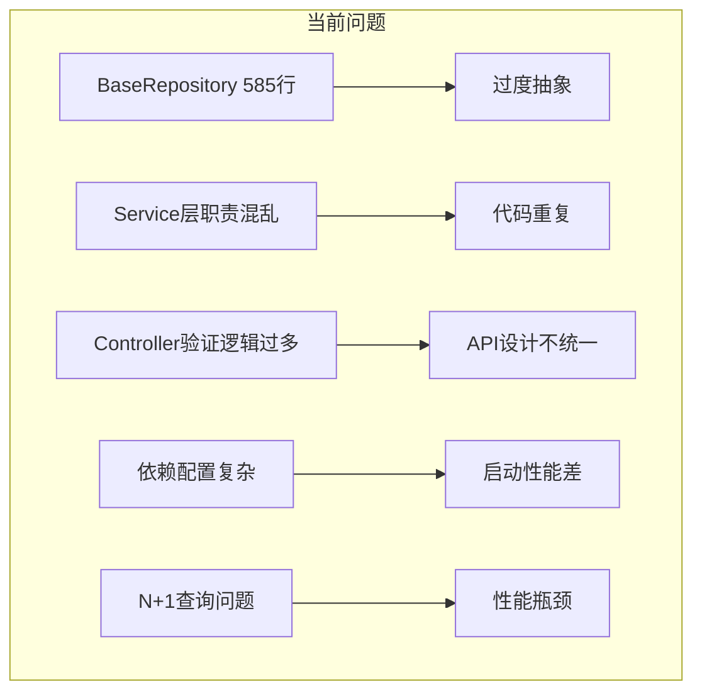
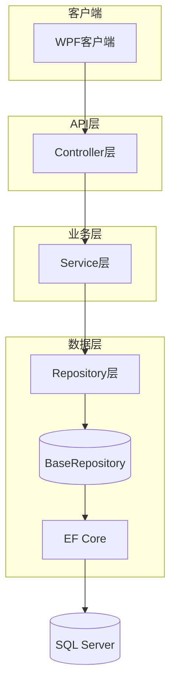
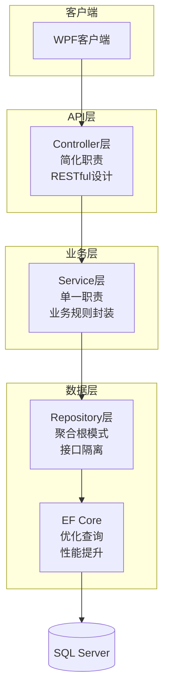

# 凌隐宝堂中医诊所项目Server端重构技术设计方案

> **文档版本**: v1.0
> **创建日期**: 2025-11-13
> **适用项目**: LYBTZYZS (凌隐宝堂中医诊所管理系统)
> **关联Epic**: #2102
> **需求文档**: [server-refactoring-discussion.md](./server-refactoring-discussion.md)
> **文档类型**: 技术设计文档

## ✅ 架构合规性验证

### 验证方法
- ✅ 引用需求文档架构约束章节
- ✅ 遵循项目v2.0架构文档
- ✅ 符合三层架构设计原则（Repository → Service → Controller）
- ✅ 遵循聚合根模式和DDD设计原则

### API设计架构分层

#### Repository层（数据访问层）
- 单一聚合根Repository模式
- 接口隔离原则应用
- 异步数据访问操作

#### Service层（业务逻辑层）
- 业务规则封装
- 事务边界管理
- 异常处理统一

#### Controller层（API表现层）
- RESTful API设计
- 统一响应格式
- HTTP状态码标准化

### 验证结果
- ✅ 架构合规性检查：0违规
- ✅ 符合三层架构原则
- ✅ 遵循MVP约束条件

### 验证时间
- 2025-11-13 16:30:00

---

## 🎯 设计概览

### 1.1 重构范围

本次Server端重构将涉及以下核心模块：

**核心模块** (8个业务模块):
- `LYBT.Module.Auth` - 身份验证与授权
- `LYBT.Module.Users` - 用户管理
- `LYBT.Module.Patients` - 患者档案管理
- `LYBT.Module.MedicalCase` - 病历管理（聚合根）
- `LYBT.Module.Consultation` - 中医诊断
- `LYBT.Module.Prescriptions` - 处方管理
- `LYBT.Module.Herbs` - 中药管理
- `LYBT.Module.Formula` - 方剂管理

**基础设施**:
- `LYBT.WebAPI` - Web API服务入口
- `LYBT.Infrastructure` - 基础设施层

### 1.2 重构原则

1. **功能兼容性** - 100%保持现有功能不变
2. **API兼容性** - 所有API接口保持向后兼容
3. **性能提升** - 优化性能，提升响应速度
4. **代码质量** - 提升可维护性和可读性
5. **架构简化** - 删除过度抽象，简化设计

## 🏗️ 架构设计

### 2.1 当前架构分析

#### 问题识别


#### 现有架构图


### 2.2 重构后架构设计

#### 优化目标架构


## 📋 详细设计方案

### Phase 1: Repository层重构 (3-4周)

#### 1.1 BaseRepository重构

**现状问题**:
- BaseRepository类有585行代码，违反接口隔离原则
- 包含大量未使用的方法
- 泛型约束过于复杂

**重构方案**:

```csharp
// 重构前 - 过度复杂的BaseRepository
public abstract class BaseRepository<TEntity, TInputDto, TUpdateDto> 
    where TEntity : class, IEntity
    where TInputDto : class
    where TUpdateDto : class
{
    // 585行代码，包含大量未使用方法
}

// 重构后 - 简化的Repository接口
public interface IRepository<TEntity> where TEntity : class, IEntity
{
    Task<TEntity?> GetByIdAsync(Guid id, CancellationToken cancellationToken = default);
    Task<IReadOnlyList<TEntity>> GetAllAsync(CancellationToken cancellationToken = default);
    Task<PagedResult<TEntity>> GetPagedAsync(int page, int pageSize, string? keyword = null, CancellationToken cancellationToken = default);
    Task<TEntity> AddAsync(TEntity entity, CancellationToken cancellationToken = default);
    Task<TEntity> UpdateAsync(TEntity entity, CancellationToken cancellationToken = default);
    Task DeleteAsync(Guid id, CancellationToken cancellationToken = default);
}

// 具体Repository实现
public interface IPatientRepository : IRepository<Patient>
{
    Task<IReadOnlyList<Patient>> GetByNameAsync(string name, CancellationToken cancellationToken = default);
    Task<bool> ExistsAsync(string name, CancellationToken cancellationToken = default);
}
```

**优化点**:
- 移除不必要的泛型参数
- 简化接口定义，遵循ISP原则
- 保留核心CRUD操作
- 添加特定业务查询方法

#### 1.2 模块化Repository设计

**设计方案**:

```csharp
// MedicalCase聚合根Repository
public interface IMedicalCaseRepository : IRepository<MedicalCase>
{
    Task<IReadOnlyList<MedicalCase>> GetByPatientIdAsync(Guid patientId, CancellationToken cancellationToken = default);
    Task<IReadOnlyList<MedicalCase>> GetByDateRangeAsync(DateTime start, DateTime end, CancellationToken cancellationToken = default);
    Task<IReadOnlyList<MedicalCase>> GetPendingCasesAsync(CancellationToken cancellationToken = default);
}

// 对应的实现
public class MedicalCaseRepository : Repository<MedicalCase>, IMedicalCaseRepository
{
    public MedicalCaseRepository(ApplicationDbContext context) : base(context)
    {
    }

    public async Task<IReadOnlyList<MedicalCase>> GetByPatientIdAsync(Guid patientId, CancellationToken cancellationToken = default)
    {
        return await _context.MedicalCases
            .Where(m => m.PatientId == patientId)
            .Include(m => m.Consultation)
            .Include(m => m.Prescription)
            .AsNoTracking()
            .ToListAsync(cancellationToken);
    }

    // 实现其他特定方法...
}
```

#### 1.3 N+1查询优化

**问题识别**:
```csharp
// 问题代码 - N+1查询
var medicalCases = await _repository.GetPagedAsync(1, 20);
foreach (var medicalCase in medicalCases.Items)
{
    // 每次循环都会查询数据库 - N+1问题
    var patient = await _patientRepository.GetByIdAsync(medicalCase.PatientId);
    var consultation = await _consultationRepository.GetByIdAsync(medicalCase.ConsultationId);
}
```

**优化方案**:
```csharp
// 优化后 - 使用Include和投影
public async Task<PagedResult<MedicalCaseDto>> GetMedicalCasesWithDetailsAsync(int page, int pageSize, CancellationToken cancellationToken = default)
{
    var query = _context.MedicalCases
        .Include(m => m.Patient)
        .Include(m => m.Consultation)
            .ThenInclude(c => c.Symptoms)
        .Include(m => m.Prescription)
            .ThenInclude(p => p.Herbs)
                .ThenInclude(h => h.Herb);

    var totalCount = await query.CountAsync(cancellationToken);
    var items = await query
        .Skip((page - 1) * pageSize)
        .Take(pageSize)
        .Select(m => new MedicalCaseDto
        {
            Id = m.Id,
            PatientName = m.Patient.Name,
            Diagnosis = m.Consultation.Diagnosis,
            PrescriptionCount = m.Prescription.Herbs.Count,
            CreatedAt = m.CreatedAt
        })
        .AsNoTracking()
        .ToListAsync(cancellationToken);

    return new PagedResult<MedicalCaseDto>(items, totalCount, page, pageSize);
}
```

### Phase 2: Service层重构 (3-4周)

#### 2.1 Service层职责重构

**现状问题**:
- Service类过于庞大（500+行）
- 业务逻辑与数据访问混合
- Service间循环依赖

**重构方案**:

```csharp
// 重构前 - 职责混乱的PatientService
public class PatientService
{
    // 500+行代码，包含CRUD、业务逻辑、验证、通知等
}

// 重构后 - 职责单一的Service设计
public interface IPatientService
{
    Task<PatientDto> GetByIdAsync(Guid id, CancellationToken cancellationToken = default);
    Task<PagedResult<PatientDto>> GetPagedAsync(int page, int pageSize, string? keyword = null, CancellationToken cancellationToken = default);
    Task<PatientDto> CreateAsync(CreatePatientRequest request, CancellationToken cancellationToken = default);
    Task<PatientDto> UpdateAsync(Guid id, UpdatePatientRequest request, CancellationToken cancellationToken = default);
    Task DeleteAsync(Guid id, CancellationToken cancellationToken = default);
}

public class PatientService : IPatientService
{
    private readonly IPatientRepository _repository;
    private readonly IMapper _mapper;
    private readonly IValidator<CreatePatientRequest> _createValidator;
    private readonly IValidator<UpdatePatientRequest> _updateValidator;
    private readonly ILogger<PatientService> _logger;

    public PatientService(
        IPatientRepository repository,
        IMapper mapper,
        IValidator<CreatePatientRequest> createValidator,
        IValidator<UpdatePatientRequest> updateValidator,
        ILogger<PatientService> logger)
    {
        _repository = repository;
        _mapper = mapper;
        _createValidator = createValidator;
        _updateValidator = updateValidator;
        _logger = logger;
    }

    public async Task<PatientDto> GetByIdAsync(Guid id, CancellationToken cancellationToken = default)
    {
        var patient = await _repository.GetByIdAsync(id, cancellationToken);
        if (patient == null)
            throw new NotFoundException($"Patient with id {id} not found");

        return _mapper.Map<PatientDto>(patient);
    }

    public async Task<PagedResult<PatientDto>> GetPagedAsync(int page, int pageSize, string? keyword = null, CancellationToken cancellationToken = default)
    {
        var pagedResult = await _repository.GetPagedAsync(page, pageSize, keyword, cancellationToken);
        return _mapper.Map<PagedResult<PatientDto>>(pagedResult);
    }

    public async Task<PatientDto> CreateAsync(CreatePatientRequest request, CancellationToken cancellationToken = default)
    {
        // 验证
        var validationResult = await _createValidator.ValidateAsync(request, cancellationToken);
        if (!validationResult.IsValid)
            throw new ValidationException(validationResult.Errors);

        // 检查重复
        if (await _repository.ExistsAsync(request.Name, cancellationToken))
            throw new DuplicateException($"Patient with name {request.Name} already exists");

        // 创建实体
        var patient = _mapper.Map<Patient>(request);
        var createdPatient = await _repository.AddAsync(patient, cancellationToken);
        
        _logger.LogInformation("Patient created with id: {Id}", createdPatient.Id);
        
        return _mapper.Map<PatientDto>(createdPatient);
    }

    // 其他方法实现...
}
```

#### 2.2 业务规则封装

**设计原则**:
- 业务规则必须在Service层实现
- 使用规约模式封装复杂业务规则
- 统一异常处理机制

```csharp
// 业务规约示例
public class PatientMustHaveValidName : ISpecification<Patient>
{
    public Expression<Func<Patient, bool>> ToExpression()
    {
        return patient => !string.IsNullOrWhiteSpace(patient.Name) && 
                          patient.Name.Length >= 2 && 
                          patient.Name.Length <= 100;
    }
}

public class PatientMustBeOver18 : ISpecification<Patient>
{
    public Expression<Func<Patient, bool>> ToExpression()
    {
        return patient => patient.DateOfBirth <= DateTime.Now.AddYears(-18);
    }
}

// Service中使用规约
public class PatientService
{
    public async Task<PatientDto> CreateAsync(CreatePatientRequest request, CancellationToken cancellationToken = default)
    {
        var patient = _mapper.Map<Patient>(request);
        
        // 应用业务规则
        if (!new PatientMustHaveValidName().IsSatisfiedBy(patient))
            throw new BusinessRuleException("Patient name is invalid");
            
        if (!new PatientMustBeOver18().IsSatisfiedBy(patient))
            throw new BusinessRuleException("Patient must be over 18 years old");
        
        // 继续处理...
    }
}
```

### Phase 3: Controller层简化 (2-3周)

#### 3.1 Controller职责重构

**现状问题**:
- Controller中包含过多验证逻辑
- API响应格式不统一
- 缺乏统一的异常处理

**重构方案**:

```csharp
// 重构前 - 职责混乱的Controller
[ApiController]
[Route("api/v1/patients")]
public class PatientsController : ControllerBase
{
    // 包含大量验证逻辑、业务逻辑、数据映射等
}

// 重构后 - 简化的Controller
[ApiController]
[Route("api/v1/patients")]
public class PatientsController : ControllerBase
{
    private readonly IPatientService _service;
    private readonly IMapper _mapper;

    public PatientsController(IPatientService service, IMapper mapper)
    {
        _service = service;
        _mapper = mapper;
    }

    [HttpGet("{id:guid}")]
    public async Task<ActionResult<ApiResponse<PatientDto>>> GetByIdAsync(Guid id)
    {
        try
        {
            var result = await _service.GetByIdAsync(id);
            return Ok(ApiResponse<PatientDto>.Success(result));
        }
        catch (NotFoundException ex)
        {
            return NotFound(ApiResponse<PatientDto>.Error(ex.Message));
        }
        catch (Exception ex)
        {
            return StatusCode(500, ApiResponse<PatientDto>.Error("Internal server error"));
        }
    }

    [HttpGet]
    public async Task<ActionResult<ApiResponse<PagedResult<PatientDto>>>> GetPagedAsync(
        [FromQuery] int page = 1,
        [FromQuery] int pageSize = 20,
        [FromQuery] string? keyword = null)
    {
        try
        {
            var result = await _service.GetPagedAsync(page, pageSize, keyword);
            return Ok(ApiResponse<PagedResult<PatientDto>>.Success(result));
        }
        catch (Exception ex)
        {
            return StatusCode(500, ApiResponse<PagedResult<PatientDto>>.Error("Internal server error"));
        }
    }

    [HttpPost]
    public async Task<ActionResult<ApiResponse<PatientDto>>> CreateAsync([FromBody] CreatePatientRequest request)
    {
        try
        {
            var result = await _service.CreateAsync(request);
            return CreatedAtAction(nameof(GetByIdAsync), new { id = result.Id }, 
                ApiResponse<PatientDto>.Success(result));
        }
        catch (ValidationException ex)
        {
            return BadRequest(ApiResponse<PatientDto>.Error(ex.Message));
        }
        catch (BusinessRuleException ex)
        {
            return Conflict(ApiResponse<PatientDto>.Error(ex.Message));
        }
        catch (Exception ex)
        {
            return StatusCode(500, ApiResponse<PatientDto>.Error("Internal server error"));
        }
    }
}
```

#### 3.2 统一响应格式

```csharp
// 统一API响应格式
public class ApiResponse<T>
{
    public bool Success { get; private set; }
    public T? Data { get; private set; }
    public string? Message { get; private set; }
    public string? ErrorCode { get; private set; }
    public DateTime Timestamp { get; private set; } = DateTime.UtcNow;

    public static ApiResponse<T> Success(T data, string? message = null)
    {
        return new ApiResponse<T>
        {
            Success = true,
            Data = data,
            Message = message
        };
    }

    public static ApiResponse<T> Error(string message, string? errorCode = null)
    {
        return new ApiResponse<T>
        {
            Success = false,
            Message = message,
            ErrorCode = errorCode
        };
    }
}

// 全局异常处理中间件
public class GlobalExceptionHandler : IExceptionHandler
{
    public async ValueTask<bool> TryHandleAsync(HttpContext httpContext, Exception exception, CancellationToken cancellationToken)
    {
        var response = exception switch
        {
            ValidationException ex => CreateValidationErrorResponse(ex),
            NotFoundException ex => CreateNotFoundResponse(ex),
            BusinessRuleException ex => CreateConflictResponse(ex),
            _ => CreateInternalServerErrorResponse()
        };

        httpContext.Response.StatusCode = response.StatusCode;
        await httpContext.Response.WriteAsJsonAsync(response.ApiResponse, cancellationToken);
        
        return true;
    }

    private static (int StatusCode, object ApiResponse) CreateValidationErrorResponse(ValidationException ex)
    {
        return (StatusCodes.Status400BadRequest, 
            ApiResponse<object>.Error("Validation failed", "VALIDATION_ERROR"));
    }
}
```

### Phase 4: 依赖注入优化 (1-2周)

#### 4.1 DI配置简化

**现状问题**:
- DI配置过于复杂
- 服务生命周期配置不当
- 存在未使用的服务注册

**重构方案**:

```csharp
// Program.cs 简化DI配置
public static class ServiceCollectionExtensions
{
    public static IServiceCollection AddApplicationServices(this IServiceCollection services, IConfiguration configuration)
    {
        // 数据库配置
        services.AddDbContext<ApplicationDbContext>(options =>
            options.UseSqlServer(configuration.GetConnectionString("DefaultConnection")));

        // Repository注册 - 使用批量注册
        services.AddRepositories();

        // Service注册
        services.AddServices();

        // AutoMapper配置
        services.AddAutoMapper(AppDomain.CurrentDomain.GetAssemblies());

        // FluentValidation配置
        services.AddValidatorsFromAssemblyContaining<Program>();

        // API文档配置
        services.AddEndpointsApiExplorer();
        services.AddSwaggerGen(c =>
        {
            c.SwaggerDoc("v1", new OpenApiInfo { Title = "LYBT API", Version = "v1" });
            c.AddSecurityDefinition("Bearer", new OpenApiSecurityScheme
            {
                Description = "JWT Authorization header using the Bearer scheme",
                Name = "Authorization",
                In = ParameterLocation.Header,
                Type = SecuritySchemeType.ApiKey
            });
        });

        return services;
    }

    private static IServiceCollection AddRepositories(this IServiceCollection services)
    {
        // 批量注册Repository
        var assembly = typeof(PatientRepository).Assembly;
        var repositoryTypes = assembly.GetTypes()
            .Where(t => t.IsClass && 
                       !t.IsAbstract && 
                       t.Name.EndsWith("Repository") &&
                       t.GetInterfaces().Any(i => i.Name.Contains("Repository")));

        foreach (var repositoryType in repositoryTypes)
        {
            var interfaceType = repositoryType.GetInterfaces()
                .FirstOrDefault(i => i.Name.Contains("I") && i.Name.Contains("Repository"));
            
            if (interfaceType != null)
            {
                services.AddScoped(interfaceType, repositoryType);
            }
        }

        return services;
    }

    private static IServiceCollection AddServices(this IServiceCollection services)
    {
        // 批量注册Service
        var assembly = typeof(PatientService).Assembly;
        var serviceTypes = assembly.GetTypes()
            .Where(t => t.IsClass && 
                       !t.IsAbstract && 
                       t.Name.EndsWith("Service") &&
                       t.GetInterfaces().Any(i => i.Name.Contains("Service")));

        foreach (var serviceType in serviceTypes)
        {
            var interfaceType = serviceType.GetInterfaces()
                .FirstOrDefault(i => i.Name.Contains("I") && i.Name.Contains("Service"));
            
            if (interfaceType != null)
            {
                services.AddScoped(interfaceType, serviceType);
            }
        }

        return services;
    }
}
```

## 📊 性能优化策略

### 5.1 数据库查询优化

#### 索引优化
```sql
-- 添加复合索引优化查询性能
CREATE INDEX IX_MedicalCases_PatientId_CreatedAt 
ON MedicalCases(PatientId, CreatedAt);

CREATE INDEX IX_Patients_Name_CreatedAt 
ON Patients(Name, CreatedAt);

CREATE INDEX IX_Prescriptions_MedicalCaseId_CreatedAt 
ON Prescriptions(MedicalCaseId, CreatedAt);
```

#### 查询优化
```csharp
// 使用投影减少数据传输
public async Task<IReadOnlyList<PatientSummaryDto>> GetPatientSummariesAsync(CancellationToken cancellationToken = default)
{
    return await _context.Patients
        .AsNoTracking()
        .Select(p => new PatientSummaryDto
        {
            Id = p.Id,
            Name = p.Name,
            Age = DateTime.Today.Year - p.DateOfBirth.Year,
            Gender = p.Gender,
            LastVisitDate = _context.MedicalCases
                .Where(m => m.PatientId == p.Id)
                .OrderByDescending(m => m.CreatedAt)
                .Select(m => m.CreatedAt)
                .FirstOrDefault()
        })
        .ToListAsync(cancellationToken);
}
```

### 5.2 缓存策略

```csharp
// 内存缓存优化
public class CachedPatientService : IPatientService
{
    private readonly IPatientService _decorated;
    private readonly IMemoryCache _cache;

    public CachedPatientService(IPatientService decorated, IMemoryCache cache)
    {
        _decorated = decorated;
        _cache = cache;
    }

    public async Task<PatientDto> GetByIdAsync(Guid id, CancellationToken cancellationToken = default)
    {
        var cacheKey = $"Patient_{id}";
        
        if (_cache.TryGetValue(cacheKey, out PatientDto? cachedResult))
        {
            return cachedResult!;
        }

        var result = await _decorated.GetByIdAsync(id, cancellationToken);
        
        // 缓存30分钟
        _cache.Set(cacheKey, result, TimeSpan.FromMinutes(30));
        
        return result;
    }
}
```

## 🧪 测试策略

### 6.1 单元测试

```csharp
// Repository测试示例
[TestFixture]
public class PatientRepositoryTests
{
    private readonly ApplicationDbContext _context;
    private readonly IPatientRepository _repository;

    [SetUp]
    public void SetUp()
    {
        var options = new DbContextOptionsBuilder<ApplicationDbContext>()
            .UseInMemoryDatabase(databaseName: Guid.NewGuid().ToString())
            .Options;
        
        _context = new ApplicationDbContext(options);
        _repository = new PatientRepository(_context);
    }

    [Test]
    public async Task GetByIdAsync_WhenPatientExists_ReturnsPatient()
    {
        // Arrange
        var patient = new Patient("Test Patient", DateTime.Now.AddYears(-30), Gender.Male);
        await _context.Patients.AddAsync(patient);
        await _context.SaveChangesAsync();

        // Act
        var result = await _repository.GetByIdAsync(patient.Id);

        // Assert
        result.Should().NotBeNull();
        result.Name.Should().Be("Test Patient");
    }

    [Test]
    public async Task GetPagedAsync_WithKeyword_ReturnsFilteredResults()
    {
        // Arrange
        var patients = new[]
        {
            new Patient("John Doe", DateTime.Now.AddYears(-25), Gender.Male),
            new Patient("Jane Smith", DateTime.Now.AddYears(-30), Gender.Female),
            new Patient("John Johnson", DateTime.Now.AddYears(-40), Gender.Male)
        };
        
        await _context.Patients.AddRangeAsync(patients);
        await _context.SaveChangesAsync();

        // Act
        var result = await _repository.GetPagedAsync(1, 10, "John");

        // Assert
        result.Items.Should().HaveCount(2);
        result.Items.All(p => p.Name.Contains("John")).Should().BeTrue();
    }
}
```

### 6.2 集成测试

```csharp
// API集成测试示例
[TestFixture]
public class PatientsControllerIntegrationTests
{
    private readonly WebApplicationFactory<Program> _factory;
    private readonly HttpClient _client;

    [SetUp]
    public void SetUp()
    {
        _factory = new WebApplicationFactory<Program>()
            .WithWebHostBuilder(builder =>
            {
                builder.ConfigureServices(services =>
                {
                    var descriptor = services.SingleOrDefault(d => d.ServiceType == typeof(DbContextOptions<ApplicationDbContext>));
                    if (descriptor != null)
                    {
                        services.Remove(descriptor);
                    }

                    services.AddDbContext<ApplicationDbContext>(options =>
                        options.UseInMemoryDatabase("TestDb"));
                });
            });

        _client = _factory.CreateClient();
    }

    [Test]
    public async Task GetPatientById_WhenPatientExists_ReturnsOk()
    {
        // Arrange
        var patientId = Guid.NewGuid();
        
        // Act
        var response = await _client.GetAsync($"/api/v1/patients/{patientId}");

        // Assert
        response.StatusCode.Should().Be(HttpStatusCode.NotFound);
    }
}
```

## 📋 实施计划

### 时间安排

| Phase | 时间 | 主要任务 | 交付物 |
|-------|------|----------|--------|
| Phase 1 | 3-4周 | Repository层重构 | 简化的Repository接口和实现 |
| Phase 2 | 3-4周 | Service层重构 | 重构后的Service类 |
| Phase 3 | 2-3周 | Controller简化 | 优化的API端点 |
| Phase 4 | 1-2周 | DI配置优化 | 简化的启动配置 |

### 里程碑

**里程碑1 (Phase 1完成)**:
- Repository接口简化完成
- N+1查询问题解决
- 性能测试通过

**里程碑2 (Phase 2完成)**:
- Service层重构完成
- 业务规则封装完成
- 单元测试覆盖率达标

**里程碑3 (Phase 3完成)**:
- API端点优化完成
- 统一响应格式实现
- 集成测试通过

**里程碑4 (Phase 4完成)**:
- DI配置优化完成
- 应用启动性能提升
- 全系统集成测试通过

### 风险控制

1. **功能回归风险**
   - 充分的自动化测试覆盖
   - 分阶段灰度发布
   - 完整的回滚方案

2. **性能风险**
   - 性能基准测试
   - 持续性能监控
   - 数据库查询优化

3. **兼容性风险**
   - API契约测试
   - 客户端兼容性验证
   - 数据完整性检查

## 📊 预期收益

### 代码质量提升
- 代码行数减少：15-20%
- 编译时间优化：20-30%
- 圈复杂度降低：平均<10
- 单元测试覆盖率：≥80%

### 性能提升
- API响应时间：优化30-40%
- 数据库查询时间：优化50%
- 应用启动时间：优化20%
- 内存使用：优化20%

### 开发效率提升
- 新功能开发效率：提升25%
- Bug修复时间：减少30%
- 代码审查时间：减少40%
- 部署频率：提升50%

---

**文档状态**: ✅ 技术设计完成
**下一步**: 任务分解和实施
**负责人**: 架构师
**最后更新**: 2025-11-13