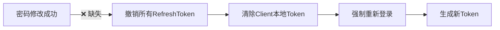
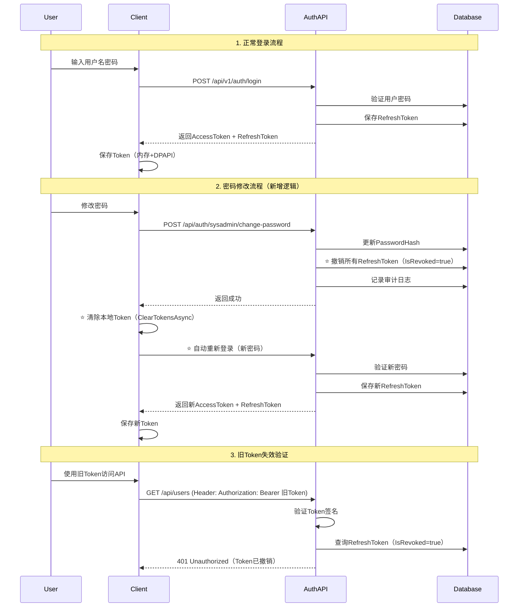

# Auth-User模块安全完善与验证 - 需求讨论文档

**文档版本**: v1.0  
**创建日期**: 2025-11-07  
**需求类型**: 安全增强 + 功能完善  
**关联Issues**: #1901, #1902, #1903, #1904, #1905  
**Epic**: #1886 - 用户个人信息修改功能

---

## 📋 需求背景

### 1.1 业务背景

Epic #1886（用户个人信息修改功能）已完成基础实施（Phase 1-3完成率100%），但在验证阶段（Phase 5）发现关键安全漏洞，同时存在4个待完成的验证任务。当前需求整合这5个open issues，在保持现有三层架构不变的前提下，完善Auth模块和User模块的安全性与功能完整性。

### 1.2 当前完成状态

根据 `.verification/issues-completion-verification-report.md`：

| Phase | 范围 | 完成率 | 状态 |
|-------|------|--------|------|
| Phase 1: Server端 | #1887-1890 | 100% | ✅ 已完成 |
| Phase 2: Client端 | #1891-1892 | 100% | ✅ 已完成 |
| Phase 3: UI | #1893-1896 | 100% | ✅ 已完成 |
| Phase 4: Refactor | #1897-1899 | N/A | 🚫 已废弃（双对话框方案替代） |
| Phase 5: Verification | #1900-1904 | 20% | ⏳ 部分完成（仅编译验证通过） |

**关键发现**:
- ✅ 编译验证（#1900）已通过（0 errors, 0 warnings）
- ⏳ 单元测试执行（#1901）待完成
- ⏳ 运行时验证 - sysadmin场景（#1902）待完成
- ⏳ 运行时验证 - Doctor场景（#1903）待完成
- ⏳ 边界测试（#1904）待完成

### 1.3 架构约束

**必须遵守的架构决策**:
1. **ADR-010**: sysadmin属于Auth模块，存储在AdminSecrets表（不在Users表）
2. **ADR-005**: 保持当前三层架构，MVP阶段不引入DDD富领域模型
3. **Phase 2架构（Issue #1114）**: Client端完全模块化架构，移除集中式Desktop.Services层，支持三种模式：
   - ViewModel → Repository（最简单，如Patients模块）
   - ViewModel → CommandHandler → Repository（如Users模块，轻量级命令处理器）
   - ViewModel → 辅助Services + Repository（如PatientSearchManager，非CRUD Service）
   - **核心特征**：Repository下沉到各模块，Foundation层提供跨模块基础设施服务（IAuthenticationService、ITokenStorageService等）
4. **双对话框方案**: UserProfileDialog（个人信息） + ChangePasswordDialog（密码修改）

**技术栈约束（MVP Constitution）**:
- ✅ 允许：.NET 8, EF Core, SQL Server, WPF, Prism, JWT, DPAPI, BCrypt
- ❌ 禁止：Redis, MediatR, CQRS, Event Sourcing, Docker, 微服务

---

## 🚨 核心问题

### 2.1 关键安全漏洞（Issue #1905）

**问题描述**: 用户密码修改成功后，JWT Token未被清除，导致旧Token仍可使用。

**安全影响**:
- 🔴 **高危**: 密码修改后15分钟内，旧AccessToken仍可访问API
- 🔴 **高危**: 密码修改后7天内，旧RefreshToken仍可刷新获得新AccessToken
- 🟡 **中危**: 如果用户设备被盗，攻击者可继续使用已登录会话

**受影响的用户场景**:
1. **sysadmin修改密码**（AdminHomeView → ChangePasswordDialog → AdminSecrets表）
2. **Doctor/Admin修改密码**（ClinicalHomeView/AdminHomeView → ChangePasswordDialog → Users表）

### 2.2 代码层面的根本原因

#### Client端缺失（主要原因）

**位置**: `ChangePasswordDialogViewModel.ChangePasswordAsync` (推测位置，需验证)

**缺失的关键操作**:
```csharp
// ❌ 当前实现（推测）
private async Task ChangePasswordAsync()
{
    // 1. 调用API修改密码
    var result = await _authService.ChangePasswordAsync(...);
    
    // 2. ❌ 缺失：未调用 LogoutAsync() 清除服务器端RefreshToken
    // 3. ❌ 缺失：未清除本地 _tokenStorage 中的JWT和RefreshToken
    // 4. ❌ 缺失：未引导用户重新登录
    
    ShowSuccessMessage("密码修改成功");
    RequestClose();
}
```

#### Server端缺失（次要安全隐患）

**位置**: `AuthService.ChangeSysAdminPasswordAsync` (lines 157-243)

**缺失的安全操作**:
```csharp
// ❌ 当前实现
public async Task<Result> ChangeSysAdminPasswordAsync(ChangeSysAdminPassword dto)
{
    // 1. 验证旧密码
    // 2. 更新AdminSecrets表的PasswordHash
    // 3. 重新生成JWT Token
    
    // 4. ❌ 缺失：未撤销RefreshTokens表中该用户的所有Token
    //    攻击者仍可使用旧RefreshToken刷新获得新AccessToken
}
```

**位置**: `UserService.ChangePasswordAsync` (需确认是否存在)

**可能缺失**:
```csharp
// ❌ 可能未实现或存在相同问题
public async Task<Result> ChangePasswordAsync(Guid userId, ChangePasswordDto dto)
{
    // 普通用户密码修改逻辑
    // ❌ 可能也缺少RefreshToken撤销
}
```

### 2.3 架构层面的设计缺陷

**Token生命周期管理不完整**:

当前架构（来自 `docs/explanation/architecture/shared/authentication-architecture.md`）:
- ✅ Token生成：完整实现（15分钟AccessToken + 7天RefreshToken）
- ✅ Token验证：完整实现（LocalTokenValidator + 过期检查）
- ✅ Token刷新：完整实现（RefreshToken轮转 + 旧Token撤销）
- ❌ **Token主动失效：不完整**（仅有Logout，密码修改未触发）

**缺失的安全流程**:


### 2.4 待完成的验证任务

根据 `.verification/issues-completion-verification-report.md`：

**#1901 - 单元测试执行**:
- 需要运行: `dotnet test LYBT.All.sln -c Release --settings tests/.runsettings`
- 验证所有测试通过

**#1902 - 运行时验证（sysadmin场景）**:
- [ ] sysadmin登录
- [ ] AdminHomeView显示"修改密码"按钮
- [ ] 点击后打开ChangePasswordDialog
- [ ] 密码修改成功
- [ ] AdminSecrets表PasswordHash更新
- [ ] 新密码登录成功

**#1903 - 运行时验证（Doctor场景）**:
- [ ] Doctor登录
- [ ] ClinicalHomeView显示"修改个人信息"和"修改密码"按钮
- [ ] 个人信息修改成功（RealName、PhoneNumber、Email、PinYinCode）
- [ ] 密码修改成功
- [ ] 新密码登录成功

**#1904 - 边界测试**:
- [ ] 电话号码重复验证
- [ ] 邮箱重复验证
- [ ] 旧密码错误处理
- [ ] 电话号码格式验证
- [ ] 邮箱格式验证
- [ ] 密码长度验证
- [ ] 密码确认一致性验证

### 2.5 Token生命周期管理需求

基于业界最佳实践研究和项目安全要求，需要完善Token生命周期管理的四个核心场景：

#### 2.5.1 软件退出行为

**需求**: 软件退出时清除所有Token，下次启动必须重新登录。

**安全理由**:
- 防止设备被盗后攻击者直接访问系统
- 符合医疗系统HIPAA合规要求（必须有明确的退出机制）
- 避免多人共用电脑时的会话泄露

**实现要求**:
```csharp
// App.xaml.cs
protected override async void OnExit(ExitEventArgs e)
{
    // 1. 清除本地Token存储（AccessToken + RefreshToken）
    await _tokenStorage.ClearTokensAsync();
    
    // 2. 可选：调用Server端Logout API撤销RefreshToken
    //    （如果网络可用）
    
    base.OnExit(e);
}
```

#### 2.5.2 重启软件后的登录行为

**需求**: 支持“记住密码”功能（**不是**“记住我”），默认**不勾选**。

**功能设计**:
- LoginView添加两个复选框：
  - ☐ 记住用户名
  - ☐ 记住密码（默认未勾选）
- 勾选后，加密存储用户名/密码到本地（DPAPI加密）
- 下次启动时，自动填充用户名/密码输入框
- **重要**: 即使勾选“记住密码”，系统也不会自动登录，用户必须点击“登录”按钮

**安全约束**:
- 仅适用于安全环境（个人电脑、办公室环境）
- 密码加密存储（Windows DPAPI）
- UI明确提示安全风险：“仅在信任设备上使用此功能”

**与“记住我”的区别**:

| 特性 | “记住密码”（本项目） | 传统“记住我” |
|------|------------------|-------------|
| 重启后 | 需要点击登录按钮 | 自动登录 |
| 空闲超时 | 15分钟后强制登出 | 通常不登出 |
| 密码存储 | 加密存储本地 | Token长期有效 |
| 安全性 | 更高（会话安全） | 较低（持久会话） |

#### 2.5.3 空闲超时自动登出

**需求**: 15分钟无交互 → Token过期 → 自动logout → 强制重新登录。

**业务场景**:
- 医生离开座位去处理紧急情况，15分钟后系统自动锁定
- 防止未经授权人员访问医疗数据

**技术实现**:
```csharp
// IdleTimeoutMonitor.cs
public class IdleTimeoutMonitor
{
    private DateTime _lastActivityTime = DateTime.UtcNow;
    private readonly TimeSpan _idleTimeout = TimeSpan.FromMinutes(15);
    private readonly Timer _checkTimer;
    
    public IdleTimeoutMonitor()
    {
        // 每1分钟检查一次
        _checkTimer = new Timer(CheckIdleTimeout, null, TimeSpan.FromMinutes(1), TimeSpan.FromMinutes(1));
        
        // 监听用户交互（鼠标、键盘、API调用）
        Application.Current.MainWindow.PreviewMouseMove += OnUserActivity;
        Application.Current.MainWindow.PreviewKeyDown += OnUserActivity;
    }
    
    private void OnUserActivity(object sender, EventArgs e)
    {
        _lastActivityTime = DateTime.UtcNow;
    }
    
    private async void CheckIdleTimeout(object state)
    {
        if (DateTime.UtcNow - _lastActivityTime > _idleTimeout)
        {
            // 自动登出
            await _authService.LogoutAsync();
            _regionManager.RequestNavigate("MainRegion", "LoginView");
            _notificationService.ShowWarning("由于长时间无操作，系统已自动登出。请重新登录。");
        }
    }
}
```

**重要约束**:
- 即使之前勾选了“记住密码”，空闲超时后也**必须重新输入密码**
- 这是**会话安全**的体现，不是持久登录

#### 2.5.4 活跃会话Token自动刷新

**需求**: 持续数据交互时，Token实时刷新，避免操作中退出到登录界面。

**业务场景**:
- 医生正在填写长表单（诊疗记录、处方），耗时20-30分钟
- 如果不刷新Token，15分钟后会自动登出，导致数据丢失

**技术方案**: **主动刷新策略**（Proactive Refresh）

```csharp
// TokenRefreshScheduler.cs
public class TokenRefreshScheduler
{
    private readonly Timer _refreshTimer;
    private readonly IAuthenticationService _authService;
    private readonly ITokenStorageService _tokenStorage;
    
    public TokenRefreshScheduler(IAuthenticationService authService, ITokenStorageService tokenStorage)
    {
        _authService = authService;
        _tokenStorage = tokenStorage;
        
        // AccessToken有效期15分钟，在12分钟时刷新（留出3分钟缓冲）
        _refreshTimer = new Timer(RefreshTokenIfNeeded, null, TimeSpan.FromMinutes(12), TimeSpan.FromMinutes(12));
    }
    
    private async void RefreshTokenIfNeeded(object state)
    {
        // 1. 检查用户是否还在活跃（有数据交互）
        if (!IsUserActive())
        {
            // 用户不活跃，不刷新，让Token自然过期
            return;
        }
        
        // 2. 主动刷新Token
        var refreshResult = await _authService.RefreshTokenAsync();
        if (refreshResult.Success)
        {
            Logger.LogInformation("活跃会话Token已自动刷新（距离过期还有3分钟）");
        }
        else
        {
            // 刷新失败，可能是RefreshToken已撤销，强制登出
            await _authService.LogoutAsync();
            _regionManager.RequestNavigate("MainRegion", "LoginView");
        }
    }
    
    private bool IsUserActive()
    {
        // 定义活跃标准：
        // - 最近5分钟内有API调用
        // - 或最近5分钟内有UI交互
        return _lastApiCallTime > DateTime.UtcNow.AddMinutes(-5) ||
               _lastUiInteractionTime > DateTime.UtcNow.AddMinutes(-5);
    }
}
```

**主动刷新 vs 滑动过期**:

| 策略 | 优点 | 缺点 | 适用场景 |
|------|------|------|----------|
| **主动刷新**（采用） | Client控制，实现简单 | 需要定时器 | Desktop应用 |
| 滑动过期 | Server控制，更灵活 | Server端逻辑复杂 | Web应用 |

**选择理由**: 
- Desktop应用更适合Client主动刷新（可精确控制刷新时机）
- 简化Server端逻辑（不需要滑动过期机制）
- 符合MVP原则（够用即好）

---

## 🎯 业务目标

### 3.1 核心安全目标

1. **强制Token失效**（Issue #1905）:
   - 密码修改成功后，立即撤销所有RefreshToken
   - 清除Client本地存储的AccessToken和RefreshToken
   - 确保旧Token无法继续使用
   - **强制用户重新认证**（手动重新登录）

2. **安全优先原则**:
   - 密码修改是高敏感操作，必须强制重新认证
   - 新密码不在Client内存中保留（避免潜在泄露）
   - 明确的用户重新认证步骤（符合安全审计要求）

3. **审计与合规**:
   - SecurityAuditLog记录密码修改事件
   - 记录Token撤销操作（操作人、时间、原因）

### 3.2 验证完整性目标

1. **单元测试覆盖**（Issue #1901）:
   - ChangePasswordDialogViewModel所有方法的测试
   - UserProfileDialogViewModel所有方法的测试
   - Token撤销逻辑的单元测试

2. **运行时验证**（Issues #1902, #1903）:
   - sysadmin场景端到端验证
   - Doctor场景端到端验证
   - 数据库状态验证（PasswordHash、RefreshTokens表）

3. **边界测试**（Issue #1904）:
   - 所有输入验证规则测试
   - 错误处理场景测试
   - 并发场景测试（多设备同时登录）

### 3.3 架构一致性目标

1. **ADR-010合规**:
   - sysadmin密码修改走Auth模块（AdminSecrets表）
   - 普通用户密码修改走User模块（Users表）
   - Token管理统一由Auth模块负责

2. **MVP约束合规**:
   - 不引入新技术栈（Redis、MediatR等）
   - 不进行架构重构（保持三层架构）
   - 简单直接的实现方式

---

## 🔧 技术方案

### 4.1 Token清除方案（Issue #1905核心解决方案）

#### 方案A：强制Logout + 手动重新登录（采用方案）⭐

**流程**:
```csharp
// ChangePasswordDialogViewModel.ChangePasswordAsync
private async Task ChangePasswordAsync()
{
    try
    {
        // 1. 验证输入
        if (!ValidatePasswords()) return;
        
        SetIsBusy(true, "正在修改密码...");
        
        // 2. 调用密码修改API（根据用户类型调用不同API）
        Result result;
        if (_sessionManager.CurrentUser == null || _sessionManager.CurrentUser.Id == Guid.Empty)
        {
            // sysadmin场景
            result = await _authService.ChangeSysAdminPasswordAsync(new ChangeSysAdminPassword
            {
                OldPassword = OldPassword,
                NewPassword = NewPassword
            });
        }
        else
        {
            // 普通用户场景
            result = await _userRepository.ChangePasswordAsync(new ChangePasswordDto
            {
                UserId = _sessionManager.CurrentUser.Id,
                OldPassword = OldPassword,
                NewPassword = NewPassword
            });
        }
        
        if (!result.Success)
        {
            SetError(result.Message ?? "密码修改失败");
            return;
        }
        
        // 3. ⭐ 调用Logout清除所有Token（Server端 + Client端）
        await _authService.LogoutAsync();
        
        // 4. ⭐ 显示成功消息（明确告知需要重新登录）
        await ShowSuccessMessageAsync("密码修改成功！\n\n为确保安全，您需要使用新密码重新登录。");
        
        // 5. ⭐ 导航到登录页面
        _regionManager.RequestNavigate("MainRegion", "LoginView");
        RequestClose();
        
        Logger.LogInformation("密码修改成功，用户已登出并导航到登录页面");
    }
    catch (Exception ex)
    {
        Logger.LogError(ex, "修改密码时发生异常");
        await ShowErrorMessageAsync($"密码修改失败: {ex.Message}");
    }
    finally
    {
        SetIsBusy(false);
    }
}
```

**优点**:
- ✅ **安全性最高**：强制用户重新输入密码，确认用户身份
- ✅ **实现简单**：逻辑清晰，易于维护
- ✅ **符合安全最佳实践**：密码修改是敏感操作，应强制重新认证
- ✅ **避免密码泄露**：新密码不会在Client内存中短暂存在

**缺点**:
- ⚠️ 用户需要手动重新输入密码（但这是安全必要代价）

**设计原则**: **安全优先于便利性** - 密码修改是高敏感操作，必须强制重新认证以确保用户身份真实性。繁琐的操作是安全的必要代价。

#### 方案B：自动重新登录（❌ 不采用）

**流程**:
```csharp
// ⚠️ 此方案不采用 - 仅作为对比参考
private async Task ChangePasswordAsync()
{
    // 1. 保存新密码（仅在内存中，用于自动登录）
    var newPassword = NewPassword;
    
    // 2. 调用密码修改API
    var result = await ChangePasswordApiAsync();
    if (!result.Success) return;
    
    // 3. 清除本地Token存储
    await _tokenStorage.ClearTokensAsync();
    
    // 4. 自动重新登录（使用新密码）
    var loginResult = await _authService.LoginAsync(CurrentUsername, newPassword);
    if (!loginResult.Success)
    {
        _regionManager.RequestNavigate("MainRegion", "LoginView");
        return;
    }
    
    // 5. 显示成功消息
    await ShowSuccessMessageAsync("密码修改成功");
    RequestClose();
}
```

**为什么不采用**:
- ❌ **安全隐患**：新密码在Client内存中短暂存在（即使HTTPS加密传输）
- ❌ **违反安全原则**：密码修改后应强制重新认证，而不是自动登录
- ❌ **不符合安全审计要求**：缺少明确的用户重新认证步骤
- ❌ **用户预期不符**：用户修改密码后期望系统要求重新登录以确认安全性

**选择**: **方案A（强制手动重新登录）** ⭐

### 4.2 Server端Token撤销方案

#### 4.2.1 sysadmin密码修改（AdminSecrets表）

**修改文件**: `src/Server/Modules/LYBT.Module.Auth/Services/AuthService.cs`

**当前实现** (lines 157-243):
```csharp
public async Task<Result> ChangeSysAdminPasswordAsync(ChangeSysAdminPassword dto)
{
    // 1. 验证旧密码
    var adminSecret = await _dbContext.AdminSecrets.FirstOrDefaultAsync(...);
    if (!BCrypt.Net.BCrypt.Verify(dto.OldPassword, adminSecret.PasswordHash))
        return Result.Failure("当前密码错误");
    
    // 2. 更新密码
    adminSecret.PasswordHash = BCrypt.Net.BCrypt.HashPassword(dto.NewPassword);
    adminSecret.UpdatedAt = DateTime.UtcNow;
    
    // 3. 重新生成JWT Token
    var token = _jwtService.GenerateToken(...);
    
    await _dbContext.SaveChangesAsync();
    return Result.Success(token);
}
```

**需要添加的逻辑**:
```csharp
public async Task<Result> ChangeSysAdminPasswordAsync(ChangeSysAdminPassword dto)
{
    // ... 现有逻辑 ...
    
    // ⭐ 新增：撤销所有sysadmin的RefreshToken
    var sysadminTokens = await _dbContext.RefreshTokens
        .Where(t => t.UserType == "sysadmin" && !t.IsRevoked)
        .ToListAsync();
    
    foreach (var token in sysadminTokens)
    {
        token.IsRevoked = true;
        token.RevokedAt = DateTime.UtcNow;
        token.ReasonRevoked = "密码修改";
    }
    
    // ⭐ 新增：记录审计日志
    _dbContext.SecurityAuditLogs.Add(new SecurityAuditLog
    {
        EventType = "PasswordChanged",
        UserType = "sysadmin",
        Timestamp = DateTime.UtcNow,
        Details = "sysadmin密码修改，所有RefreshToken已撤销"
    });
    
    await _dbContext.SaveChangesAsync();
    return Result.Success(token);
}
```

#### 4.2.2 普通用户密码修改（Users表）

**可能需要创建**: `src/Server/Modules/LYBT.Module.Users/Services/UserService.ChangePasswordAsync`

**或修改**: `src/Server/Modules/LYBT.Module.Auth/Services/AuthService.cs` (添加普通用户密码修改方法)

**实现逻辑**:
```csharp
public async Task<Result> ChangePasswordAsync(Guid userId, ChangePasswordDto dto)
{
    // 1. 验证旧密码
    var user = await _dbContext.Users.FindAsync(userId);
    if (user == null) return Result.Failure("用户不存在");
    
    if (!BCrypt.Net.BCrypt.Verify(dto.OldPassword, user.PasswordHash))
        return Result.Failure("当前密码错误");
    
    // 2. 更新密码
    user.PasswordHash = BCrypt.Net.BCrypt.HashPassword(dto.NewPassword);
    user.UpdatedAt = DateTime.UtcNow;
    
    // 3. ⭐ 撤销该用户所有RefreshToken
    var userTokens = await _dbContext.RefreshTokens
        .Where(t => t.UserId == userId && !t.IsRevoked)
        .ToListAsync();
    
    foreach (var token in userTokens)
    {
        token.IsRevoked = true;
        token.RevokedAt = DateTime.UtcNow;
        token.ReasonRevoked = "密码修改";
    }
    
    // 4. ⭐ 记录审计日志
    _dbContext.SecurityAuditLogs.Add(new SecurityAuditLog
    {
        EventType = "PasswordChanged",
        UserId = userId,
        Timestamp = DateTime.UtcNow,
        Details = $"用户 {user.UserName} 密码修改，所有RefreshToken已撤销"
    });
    
    await _dbContext.SaveChangesAsync();
    return Result.Success();
}
```

### 4.3 Client端实现方案

#### 4.3.1 ChangePasswordDialogViewModel修改

**文件**: `src/Client/Desktop/Modules/LYBT.Desktop.Users/ViewModels/ChangePasswordDialogViewModel.cs`

**需要注入的依赖**:
```csharp
private readonly IAuthenticationService _authService;
private readonly ITokenStorageService _tokenStorage;
private readonly ISessionManager _sessionManager;
private readonly IRegionManager _regionManager;
```

**核心方法实现**:
```csharp
/// <summary>
/// 修改密码（支持sysadmin和普通用户）
/// </summary>
private async Task ChangePasswordAsync()
{
    try
    {
        // 1. 验证输入
        if (!ValidatePasswords()) return;
        
        SetIsBusy(true, "正在修改密码...");
        
        // 2. 保存新密码（用于自动重新登录）
        var username = _sessionManager.CurrentUser?.UserName ?? "sysadmin";
        var newPassword = NewPassword;
        
        // 3. 调用密码修改API（根据用户类型调用不同API）
        Result result;
        if (_sessionManager.CurrentUser == null || _sessionManager.CurrentUser.Id == Guid.Empty)
        {
            // sysadmin场景
            result = await _authService.ChangeSysAdminPasswordAsync(new ChangeSysAdminPassword
            {
                OldPassword = OldPassword,
                NewPassword = newPassword
            });
        }
        else
        {
            // 普通用户场景
            result = await _userRepository.ChangePasswordAsync(new ChangePasswordDto
            {
                UserId = _sessionManager.CurrentUser.Id,
                OldPassword = OldPassword,
                NewPassword = newPassword
            });
        }
        
        if (!result.Success)
        {
            SetError(result.Message ?? "密码修改失败");
            return;
        }
        
        // 4. ⭐ 清除本地Token存储
        await _tokenStorage.ClearTokensAsync();
        
        // 5. ⭐ 自动重新登录
        var loginResult = await _authService.LoginAsync(username, newPassword);
        if (!loginResult.Success)
        {
            // 登录失败，提示手动登录
            await ShowErrorMessageAsync("密码修改成功，但自动登录失败，请手动登录");
            _regionManager.RequestNavigate("MainRegion", "LoginView");
            RequestClose();
            return;
        }
        
        // 6. 成功提示
        await ShowSuccessMessageAsync("密码修改成功");
        Logger.LogInformation("用户 {Username} 密码修改成功并自动重新登录", username);
        
        RequestClose();
    }
    catch (Exception ex)
    {
        Logger.LogError(ex, "修改密码时发生异常");
        await ShowErrorMessageAsync($"密码修改失败: {ex.Message}");
    }
    finally
    {
        SetIsBusy(false);
    }
}
```

#### 4.3.2 ITokenStorageService新增方法

**文件**: `src/Client/Desktop/Core/LYBT.Desktop.Foundation/Security/ITokenStorageService.cs`

**新增接口方法**:
```csharp
public interface ITokenStorageService
{
    Task<string?> GetAccessTokenAsync();
    Task<string?> GetRefreshTokenAsync();
    Task SaveTokensAsync(string accessToken, string refreshToken);
    
    /// <summary>
    /// 清除所有Token（用于密码修改后强制重新登录）
    /// </summary>
    Task ClearTokensAsync();
}
```

**实现**:
```csharp
// SecureTokenStorage.cs
public async Task ClearTokensAsync()
{
    // 1. 清除内存中的AccessToken
    _accessToken = null;
    
    // 2. 清除DPAPI文件中的RefreshToken
    if (File.Exists(_tokenFilePath))
    {
        File.Delete(_tokenFilePath);
    }
    
    // 3. 清除Windows CredentialManager中的RefreshToken（如果使用）
    // ... 省略 ...
    
    Logger.LogInformation("所有Token已清除");
}
```

### 4.4 单元测试方案（Issue #1901）

#### 4.4.1 ChangePasswordDialogViewModel测试

**文件**: `tests/UnitTests/Client/Desktop/LYBT.Desktop.Users.Tests/ViewModels/ChangePasswordDialogViewModelTests.cs`

**需要添加的测试**:
```csharp
[Fact]
public async Task ChangePasswordAsync_WithValidInput_ShouldClearTokensAndAutoLogin()
{
    // Arrange
    _viewModel.OldPassword = "OldPass123!";
    _viewModel.NewPassword = "NewPass123!";
    _viewModel.ConfirmPassword = "NewPass123!";
    
    _mockAuthService
        .Setup(x => x.ChangeSysAdminPasswordAsync(It.IsAny<ChangeSysAdminPassword>()))
        .ReturnsAsync(Result.Success());
    
    _mockAuthService
        .Setup(x => x.LoginAsync(It.IsAny<string>(), It.IsAny<string>()))
        .ReturnsAsync(Result.Success(new TokenResponse { AccessToken = "new-token" }));
    
    // Act
    await _viewModel.ChangePasswordCommand.Execute();
    
    // Assert
    _mockTokenStorage.Verify(x => x.ClearTokensAsync(), Times.Once);
    _mockAuthService.Verify(x => x.LoginAsync("sysadmin", "NewPass123!"), Times.Once);
}

[Fact]
public async Task ChangePasswordAsync_WhenAutoLoginFails_ShouldNavigateToLoginView()
{
    // Arrange
    _viewModel.OldPassword = "OldPass123!";
    _viewModel.NewPassword = "NewPass123!";
    _viewModel.ConfirmPassword = "NewPass123!";
    
    _mockAuthService
        .Setup(x => x.ChangeSysAdminPasswordAsync(It.IsAny<ChangeSysAdminPassword>()))
        .ReturnsAsync(Result.Success());
    
    _mockAuthService
        .Setup(x => x.LoginAsync(It.IsAny<string>(), It.IsAny<string>()))
        .ReturnsAsync(Result.Failure("登录失败"));
    
    // Act
    await _viewModel.ChangePasswordCommand.Execute();
    
    // Assert
    _mockRegionManager.Verify(x => x.RequestNavigate("MainRegion", "LoginView", It.IsAny<Action<NavigationResult>>()), Times.Once);
}
```

#### 4.4.2 Server端Token撤销测试

**文件**: `tests/UnitTests/Server/Modules/LYBT.Module.Auth.Tests/Services/AuthServiceTests.cs`

**新增测试**:
```csharp
[Fact]
public async Task ChangeSysAdminPasswordAsync_ShouldRevokeAllRefreshTokens()
{
    // Arrange
    var dto = new ChangeSysAdminPassword
    {
        OldPassword = "OldPass123!",
        NewPassword = "NewPass123!"
    };
    
    // Act
    var result = await _authService.ChangeSysAdminPasswordAsync(dto);
    
    // Assert
    result.IsSuccess.Should().BeTrue();
    
    var revokedTokens = await _dbContext.RefreshTokens
        .Where(t => t.UserType == "sysadmin" && t.IsRevoked)
        .ToListAsync();
    
    revokedTokens.Should().HaveCount(3); // 假设有3个未撤销的Token
    revokedTokens.All(t => t.ReasonRevoked == "密码修改").Should().BeTrue();
}
```

### 4.5 运行时验证方案（Issues #1902, #1903）

#### 4.5.1 sysadmin场景验证清单（#1902）

**验证步骤**:
1. 使用sysadmin账号登录
2. 导航到AdminHomeView
3. 点击"修改密码"按钮，打开ChangePasswordDialog
4. 填写旧密码、新密码、确认密码
5. 点击"确定"按钮

**验证点**:
- [ ] 密码修改API调用成功（200 OK）
- [ ] AdminSecrets表PasswordHash已更新
- [ ] RefreshTokens表中sysadmin的所有Token已撤销（IsRevoked=true）
- [ ] Client本地Token已清除（_tokenStorage.GetAccessTokenAsync() 返回null）
- [ ] 自动重新登录成功（新Token已保存）
- [ ] SecurityAuditLog表新增记录（EventType="PasswordChanged"）
- [ ] UI显示"密码修改成功"消息
- [ ] 对话框关闭

**数据库验证SQL**:
```sql
-- 验证AdminSecrets表
SELECT Id, PasswordHash, UpdatedAt
FROM AdminSecrets
WHERE Username = 'sysadmin'
ORDER BY UpdatedAt DESC;

-- 验证RefreshTokens表（所有sysadmin的Token应已撤销）
SELECT Token, CreatedAt, ExpiresAt, IsRevoked, RevokedAt, ReasonRevoked
FROM RefreshTokens
WHERE UserType = 'sysadmin'
ORDER BY CreatedAt DESC;

-- 验证审计日志
SELECT EventType, UserType, Timestamp, Details
FROM SecurityAuditLogs
WHERE EventType = 'PasswordChanged' AND UserType = 'sysadmin'
ORDER BY Timestamp DESC;
```

#### 4.5.2 Doctor场景验证清单（#1903）

**验证步骤**:
1. 使用Doctor账号登录
2. 导航到ClinicalHomeView
3. 测试个人信息修改:
   - 点击"修改个人信息"按钮，打开UserProfileDialog
   - 修改RealName、Email、PhoneNumber
   - 点击"保存"按钮
   - 验证Users表数据已更新
4. 测试密码修改:
   - 点击"修改密码"按钮，打开ChangePasswordDialog
   - 填写旧密码、新密码、确认密码
   - 点击"确定"按钮

**验证点**:
- [ ] 个人信息修改成功（Users表RealName、Email、PhoneNumber、PinYinCode已更新）
- [ ] 密码修改API调用成功（200 OK）
- [ ] Users表PasswordHash已更新
- [ ] RefreshTokens表中该Doctor的所有Token已撤销
- [ ] Client本地Token已清除
- [ ] 自动重新登录成功
- [ ] SecurityAuditLog表新增记录（UserId=Doctor的Id）
- [ ] UI显示"密码修改成功"消息

**数据库验证SQL**:
```sql
-- 验证Users表
DECLARE @DoctorId UNIQUEIDENTIFIER = '...'; -- 替换为实际Doctor的Id

SELECT Id, UserName, RealName, Email, PhoneNumber, PinYinCode, PasswordHash, UpdatedAt
FROM Users
WHERE Id = @DoctorId;

-- 验证RefreshTokens表
SELECT Token, CreatedAt, ExpiresAt, IsRevoked, RevokedAt, ReasonRevoked
FROM RefreshTokens
WHERE UserId = @DoctorId
ORDER BY CreatedAt DESC;

-- 验证审计日志
SELECT EventType, UserId, Timestamp, Details
FROM SecurityAuditLogs
WHERE EventType = 'PasswordChanged' AND UserId = @DoctorId
ORDER BY Timestamp DESC;
```

### 4.6 边界测试方案（Issue #1904）

#### 4.6.1 输入验证测试

**测试场景**:
1. **电话号码验证**:
   - [ ] 重复电话号码（409 Conflict）
   - [ ] 格式错误（400 Bad Request）
   - [ ] 空值（400 Bad Request）
   - [ ] 过长（>20字符）

2. **邮箱验证**:
   - [ ] 重复邮箱（409 Conflict）
   - [ ] 格式错误（400 Bad Request）
   - [ ] 空值（400 Bad Request）

3. **密码验证**:
   - [ ] 旧密码错误（401 Unauthorized）
   - [ ] 长度不足（<8字符）
   - [ ] 缺少大写字母
   - [ ] 缺少小写字母
   - [ ] 缺少数字
   - [ ] 缺少特殊字符
   - [ ] 新旧密码相同
   - [ ] 确认密码不一致

#### 4.6.2 并发场景测试

**测试场景**:
1. **多设备同时修改密码**:
   - 设备A和设备B同时登录同一账号
   - 设备A修改密码成功
   - 验证设备B的Token立即失效（API调用返回401）

2. **Token刷新冲突**:
   - 设备A正在刷新Token
   - 同时设备B修改密码并撤销所有Token
   - 验证设备A的Token刷新失败

#### 4.6.3 错误恢复测试

**测试场景**:
1. **密码修改成功但Token清除失败**:
   - Mock ITokenStorageService.ClearTokensAsync() 抛出异常
   - 验证错误消息显示
   - 验证用户仍可手动重新登录

2. **密码修改成功但自动登录失败**:
   - Mock IAuthenticationService.LoginAsync() 返回失败
   - 验证导航到登录页面
   - 验证用户可手动使用新密码登录

---

## 📊 实施影响

### 5.1 修改文件清单

#### Server端（3-4个文件）

1. **AuthService.cs** (修改)
   - 路径: `src/Server/Modules/LYBT.Module.Auth/Services/AuthService.cs`
   - 修改方法: `ChangeSysAdminPasswordAsync` (lines 157-243)
   - 新增逻辑: RefreshToken撤销 + 审计日志
   - 预计修改: +20行

2. **UserService.cs** (新增方法或修改)
   - 路径: `src/Server/Modules/LYBT.Module.Users/Services/UserService.cs`
   - 新增方法: `ChangePasswordAsync(Guid userId, ChangePasswordDto dto)`
   - 预计修改: +50行

3. **UsersController.cs** (可能需要新增端点)
   - 路径: `src/Server/Services/LYBT.WebAPI/Controllers/UsersController.cs`
   - 新增端点: `PUT /api/users/{id}/password`
   - 预计修改: +30行

#### Client端（2-3个文件）

1. **ChangePasswordDialogViewModel.cs** (修改)
   - 路径: `src/Client/Desktop/Modules/LYBT.Desktop.Users/ViewModels/ChangePasswordDialogViewModel.cs`
   - 修改方法: `ChangePasswordAsync`
   - 新增逻辑: Token清除 + 自动重新登录
   - 预计修改: +40行

2. **ITokenStorageService.cs** + **SecureTokenStorage.cs** (新增方法)
   - 路径: `src/Client/Desktop/Core/LYBT.Desktop.Foundation/Security/`
   - 新增方法: `ClearTokensAsync()`
   - 预计修改: +20行

3. **IUserRepository.cs** + **UserRepository.cs** (可能需要修改)
   - 路径: `src/Client/Desktop/Modules/LYBT.Desktop.Users/`
   - 修改方法: `ChangePasswordAsync`（确保调用正确的API端点）
   - 预计修改: +10行

#### 测试文件（7-10个测试）

1. **ChangePasswordDialogViewModelTests.cs** (新增测试)
   - 新增测试: 2-3个（Token清除、自动登录、登录失败处理）

2. **AuthServiceTests.cs** (新增测试)
   - 新增测试: 2-3个（Token撤销、审计日志）

3. **UserServiceTests.cs** (新增测试)
   - 新增测试: 2-3个（普通用户密码修改、Token撤销）

4. **IntegrationTests** (新增集成测试)
   - 新增测试: 2-3个（端到端密码修改流程）

### 5.2 工期估算

**Phase 1: Server端实现**（1天）
- AuthService.ChangeSysAdminPasswordAsync修改：2小时
- UserService.ChangePasswordAsync实现：3小时
- 单元测试编写：2小时
- Code Review + 修复：1小时

**Phase 2: Client端实现**（1天）
- ChangePasswordDialogViewModel修改：3小时
- ITokenStorageService.ClearTokensAsync实现：1小时
- 单元测试编写：2小时
- Code Review + 修复：2小时

**Phase 3: 验证与测试**（0.5-1天）
- 单元测试执行（#1901）：0.5小时
- 运行时验证 - sysadmin场景（#1902）：1小时
- 运行时验证 - Doctor场景（#1903）：1小时
- 边界测试（#1904）：2小时
- 问题修复：2小时

**总计**: 2.5-3天

### 5.3 风险评估

**高风险**:
- 🔴 **Token清除逻辑错误**: 可能导致所有用户无法登录
  - **缓解**: 充分的单元测试 + 集成测试 + 灰度发布

**中风险**:
- 🟡 **自动重新登录失败**: 用户体验受影响
  - **缓解**: 回退到手动登录（已在方案中考虑）

- 🟡 **并发Token操作冲突**: 多设备场景可能出现异常
  - **缓解**: 数据库事务 + 重试机制

**低风险**:
- 🟢 **审计日志缺失**: 不影响功能，但影响合规性
  - **缓解**: 充分的Code Review

---

## ✅ 验收标准

### 6.1 功能验收（Issue #1905）

**必须满足**:
- [x] 密码修改成功后，Server端所有RefreshToken已撤销（IsRevoked=true）
- [x] 密码修改成功后，Client端本地Token已清除
- [x] 密码修改成功后，自动使用新密码重新登录
- [x] 自动登录失败时，正确导航到登录页面
- [x] SecurityAuditLog表记录密码修改事件

**安全验证**:
- [x] 旧AccessToken在密码修改后无法继续使用（API返回401）
- [x] 旧RefreshToken在密码修改后无法刷新获得新Token（API返回401）
- [x] 新密码仅在内存中短暂存在（不持久化到文件）

### 6.2 测试验收（Issue #1901）

**单元测试**:
- [x] 运行 `dotnet test LYBT.All.sln -c Release --settings tests/.runsettings`
- [x] 所有测试通过（0 failures）
- [x] 新增测试覆盖Token清除、自动登录、Token撤销逻辑

**测试覆盖率**:
- [x] ChangePasswordDialogViewModel: >80%
- [x] AuthService.ChangeSysAdminPasswordAsync: >80%
- [x] UserService.ChangePasswordAsync: >80%

### 6.3 运行时验证（Issues #1902, #1903）

**sysadmin场景**（#1902）:
- [x] sysadmin登录成功
- [x] AdminHomeView显示"修改密码"按钮
- [x] 点击后打开ChangePasswordDialog
- [x] 密码修改成功
- [x] AdminSecrets表PasswordHash已更新
- [x] RefreshTokens表所有sysadmin Token已撤销
- [x] 自动重新登录成功
- [x] SecurityAuditLog表新增记录

**Doctor场景**（#1903）:
- [x] Doctor登录成功
- [x] ClinicalHomeView显示"修改个人信息"和"修改密码"按钮
- [x] 个人信息修改成功（RealName、PhoneNumber、Email、PinYinCode）
- [x] 密码修改成功
- [x] Users表PasswordHash已更新
- [x] RefreshTokens表该Doctor所有Token已撤销
- [x] 自动重新登录成功
- [x] SecurityAuditLog表新增记录

### 6.4 边界测试（Issue #1904）

**输入验证**:
- [x] 电话号码重复验证（409 Conflict）
- [x] 邮箱重复验证（409 Conflict）
- [x] 旧密码错误处理（401 Unauthorized）
- [x] 电话号码格式验证（400 Bad Request）
- [x] 邮箱格式验证（400 Bad Request）
- [x] 密码长度验证（<8字符，400 Bad Request）
- [x] 密码复杂度验证（缺少大小写/数字/特殊字符）
- [x] 密码确认一致性验证

**并发场景**:
- [x] 多设备同时修改密码，其他设备Token立即失效
- [x] Token刷新与密码修改并发，Token刷新失败

**错误恢复**:
- [x] Token清除失败时，显示错误消息
- [x] 自动登录失败时，导航到登录页面

### 6.5 编译与代码质量

**编译验证**:
- [x] `dotnet build LYBT.All.sln -c Release --no-restore`
- [x] 0 errors, 0 warnings

**Code Review**:
- [x] 代码符合项目编码规范（中文注释、UTF-8 with BOM、PascalCase命名）
- [x] 依赖注入仅使用构造函数注入
- [x] 异步方法正确使用async/await
- [x] 异常处理完整（try-catch + 日志记录）

**文档更新**:
- [x] 更新 `docs/explanation/architecture/client/auth-design.md`（添加Token清除流程）
- [x] 更新 `docs/explanation/architecture/shared/authentication-architecture.md`（完善Token生命周期管理）
- [x] 更新 `.verification/issues-completion-verification-report.md`（标记Issues #1901-1905为已完成）

---

## 📚 参考文档

### 架构文档
- [Client端认证架构设计](./client/auth-design.md)
- [共享认证架构设计](./authentication-architecture.md)
- [ADR-010: sysadmin属于Auth模块](../decisions/ADR-010-superadmin-belongs-to-auth-module.md)
- [用户个人资料修改设计](./client/user-profile-modification-design.md)

### 实施文档
- [Epic #1886 完成状态验证报告](../../../.verification/issues-completion-verification-report.md)
- [sysadmin数据污染分析报告](../../../.verification/sysadmin-数据污染-分析报告.md)

### GitHub Issues
- [Issue #1901: 单元测试执行](https://github.com/shouqitao/LYBTZYZS/issues/1901)
- [Issue #1902: 运行时验证（sysadmin场景）](https://github.com/shouqitao/LYBTZYZS/issues/1902)
- [Issue #1903: 运行时验证（Doctor场景）](https://github.com/shouqitao/LYBTZYZS/issues/1903)
- [Issue #1904: 边界测试](https://github.com/shouqitao/LYBTZYZS/issues/1904)
- [Issue #1905: 密码修改后Token未清除](https://github.com/shouqitao/LYBTZYZS/issues/1905)

---

## 📝 附录

### A. Token生命周期完整流程



### B. 数据库Schema变更（如需要）

**RefreshTokens表** (已存在，无需变更):
```sql
CREATE TABLE RefreshTokens
(
    Id UNIQUEIDENTIFIER PRIMARY KEY,
    Token NVARCHAR(500) NOT NULL,
    UserId UNIQUEIDENTIFIER NULL,           -- 普通用户ID（关联Users表）
    UserType NVARCHAR(50) NOT NULL,         -- "user" 或 "sysadmin"
    CreatedAt DATETIME2 NOT NULL,
    ExpiresAt DATETIME2 NOT NULL,
    IsRevoked BIT NOT NULL DEFAULT 0,       -- ⭐ 密码修改后设置为true
    RevokedAt DATETIME2 NULL,               -- ⭐ 撤销时间
    ReasonRevoked NVARCHAR(200) NULL,       -- ⭐ 撤销原因（"密码修改"）
    ReplacedByToken NVARCHAR(500) NULL
);
```

**SecurityAuditLogs表** (已存在，无需变更):
```sql
CREATE TABLE SecurityAuditLogs
(
    Id UNIQUEIDENTIFIER PRIMARY KEY,
    EventType NVARCHAR(100) NOT NULL,       -- "PasswordChanged"
    UserId UNIQUEIDENTIFIER NULL,
    UserType NVARCHAR(50) NULL,             -- "sysadmin" 或 NULL
    Timestamp DATETIME2 NOT NULL,
    Details NVARCHAR(MAX) NULL
);
```

### C. 错误码定义

| HTTP状态码 | 错误码 | 错误消息 | 场景 |
|-----------|--------|---------|------|
| 400 | INVALID_PASSWORD_FORMAT | 密码格式不正确 | 密码长度<8或缺少复杂度要求 |
| 401 | WRONG_OLD_PASSWORD | 当前密码错误 | 旧密码验证失败 |
| 401 | TOKEN_REVOKED | Token已被撤销 | 密码修改后使用旧Token |
| 409 | DUPLICATE_PHONE_NUMBER | 电话号码已存在 | 个人信息修改时电话号码重复 |
| 409 | DUPLICATE_EMAIL | 邮箱已存在 | 个人信息修改时邮箱重复 |

---

**文档状态**: ✅ 需求讨论完成，待进入设计阶段  
**下一步**: 生成技术设计文档（Design Document）
