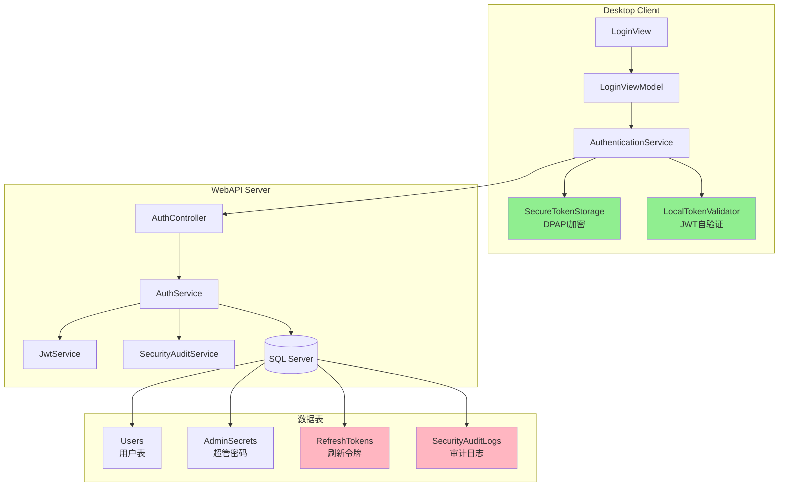
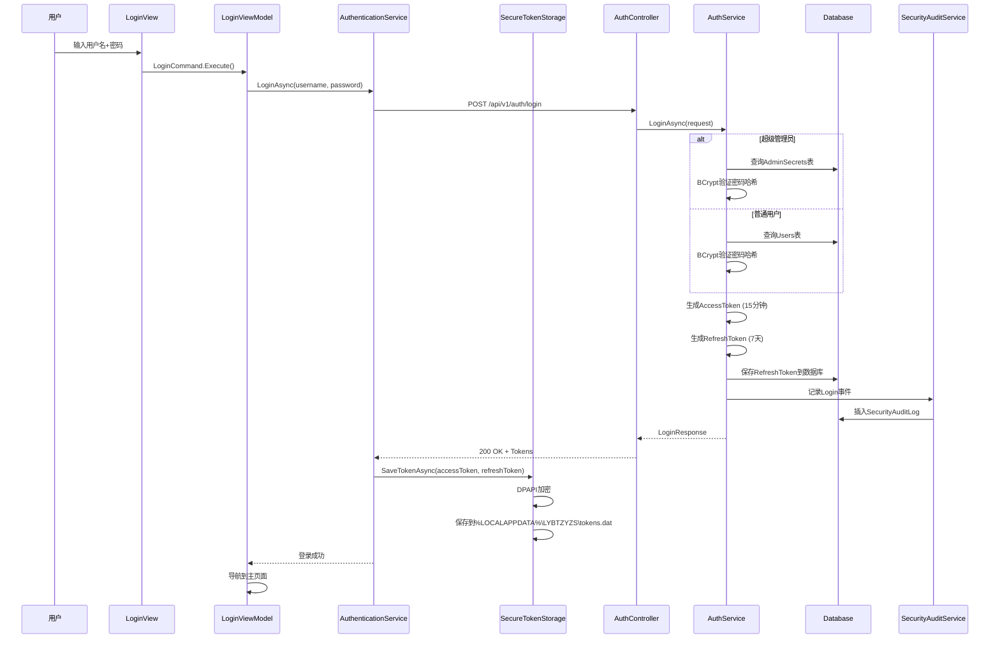
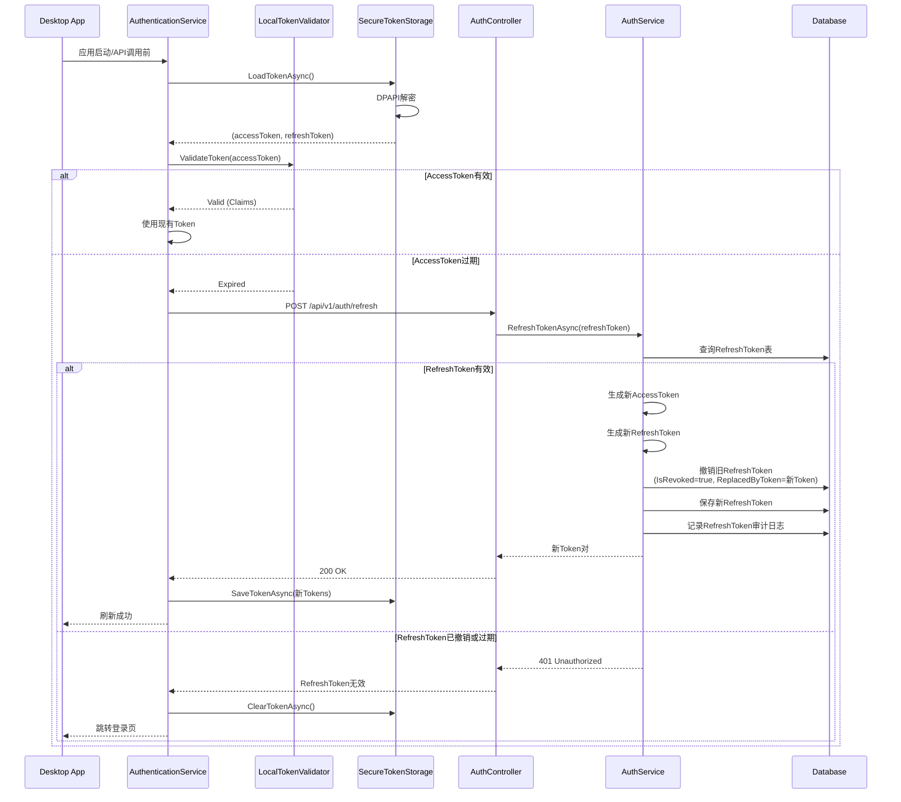
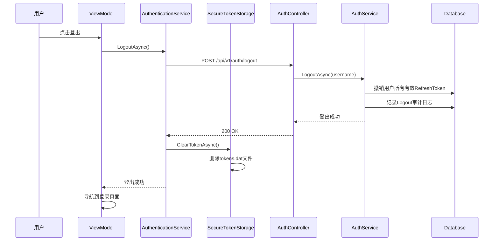
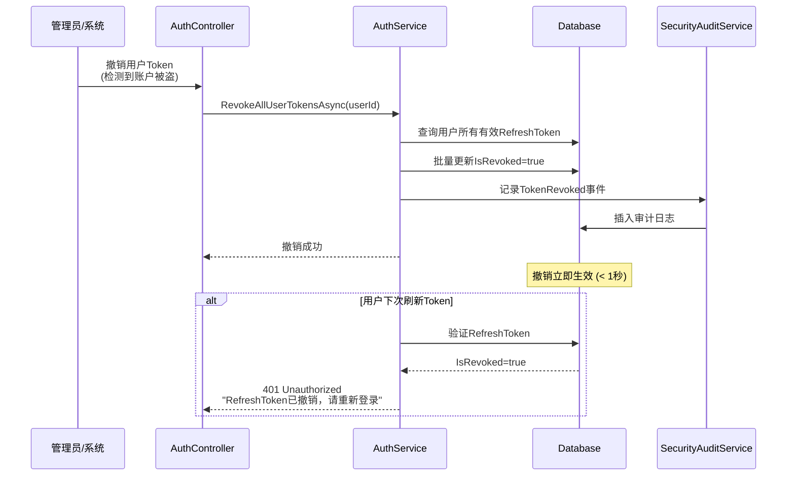

# 认证架构设计

**版本**: 2.0  
**最后更新**: 2025-11-07  
**Issue来源**: #1861 - Token认证安全重构  
**状态**: ✅ 已实施

---

## 📋 目录

- [概述](#概述)
- [架构设计](#架构设计)
  - [1. 系统组件](#1-系统组件)
  - [2. Token策略](#2-token策略)
  - [3. 认证流程](#3-认证流程)
- [核心组件详解](#核心组件详解)
  - [Client端组件](#client端组件)
  - [Server端组件](#server端组件)
  - [Shared组件](#shared组件)
- [安全特性](#安全特性)
- [性能优化](#性能优化)
- [架构决策记录](#架构决策记录)

---

## 概述

### 设计目标

LYBTZYZS认证系统基于JWT（JSON Web Token）实现,支持:

- ✅ **安全Token存储** - Client端DPAPI加密
- ✅ **本地Token验证** - 无需Server API调用,性能提升10-20倍
- ✅ **RefreshToken撤销** - 快速响应安全事件(< 1秒)
- ✅ **完整审计日志** - 所有认证事件可追溯
- ✅ **Token轮换机制** - 防止RefreshToken重放攻击

### 核心原则

1. **安全优先** - Token加密存储,支持主动撤销
2. **性能优化** - Client端本地验证,减少网络调用
3. **可追溯性** - 完整安全审计日志
4. **用户体验** - Token自动刷新,用户无感知

---

## 架构设计

### 1. 系统组件



### 2. Token策略

**统一策略**（超级管理员 + 普通用户）:

| Token类型 | 有效期 | 存储位置 | 用途 |
|----------|--------|---------|------|
| **AccessToken** | 15分钟 | Client内存 + DPAPI加密文件 | API调用认证 |
| **RefreshToken** | 7天 | DPAPI加密文件 + Server数据库 | 刷新AccessToken |

**Token Claims**（AccessToken）:
```json
{
  "sub": "用户ID（GUID）",
  "unique_name": "用户名",
  "role": "用户角色（Admin/Doctor/Nurse）",
  "email": "邮箱",
  "IsSuperAdmin": "true/false（超级管理员标记）",
  "nbf": "生效时间",
  "exp": "过期时间",
  "iat": "签发时间",
  "iss": "签发者",
  "aud": "受众"
}
```

### 3. 认证流程

#### 3.1 登录流程



#### 3.2 Token自动刷新流程



#### 3.3 登出流程



#### 3.4 Token撤销流程（安全事件响应）



---

## 核心组件详解

### Client端组件

#### 1. AuthenticationService

**职责**:
- 登录/登出协调
- Token自动刷新
- Token生命周期管理

**关键方法**:
```csharp
// src/Client/Desktop/Foundation/LYBT.Desktop.Foundation.Auth/Services/AuthenticationService.cs

public async Task<bool> LoginAsync(string userName, string password)
public async Task LogoutAsync()
public async Task<bool> RefreshTokenAsync()
public async Task<SessionInfo?> GetCurrentSessionAsync()
```

#### 2. SecureTokenStorage

**职责**:
- Token DPAPI加密存储
- Token读取和清理

**文件位置**: `%LOCALAPPDATA%\LYBTZYZS\tokens.dat`

**关键方法**:
```csharp
// src/Client/Desktop/Foundation/LYBT.Desktop.Foundation.Auth/Services/SecureTokenStorage.cs

public async Task SaveTokenAsync(string accessToken, string refreshToken)
public async Task<(string? accessToken, string? refreshToken)> LoadTokenAsync()
public async Task ClearTokenAsync()
```

**加密实现**:
```csharp
// 加密
var encryptedBytes = ProtectedData.Protect(
    bytes, 
    null,  // 无额外熵
    DataProtectionScope.CurrentUser  // 当前用户
);

// 解密
var decryptedBytes = ProtectedData.Unprotect(
    encryptedBytes,
    null,
    DataProtectionScope.CurrentUser
);
```

#### 3. LocalTokenValidator

**职责**:
- JWT签名验证
- Claims提取
- Token过期检查

**性能**: ~5ms (vs Server API ~50-100ms)

**关键方法**:
```csharp
// src/Client/Desktop/Foundation/LYBT.Desktop.Foundation.Auth/Validators/LocalTokenValidator.cs

public bool ValidateToken(string token, out ClaimsPrincipal? principal)
public SessionInfo? GetSessionInfo(string token)
```

**验证参数**:
```csharp
var validationParameters = new TokenValidationParameters
{
    ValidateIssuer = true,
    ValidIssuer = _jwtSettings.Issuer,
    
    ValidateAudience = true,
    ValidAudience = _jwtSettings.Audience,
    
    ValidateIssuerSigningKey = true,
    IssuerSigningKey = new SymmetricSecurityKey(
        Encoding.UTF8.GetBytes(_jwtSettings.Secret)
    ),
    
    ValidateLifetime = true,
    ClockSkew = TimeSpan.Zero  // 严格过期验证
};
```

---

### Server端组件

#### 1. AuthController

**职责**:
- HTTP请求处理
- 参数验证
- 限流保护

**API端点**:
```csharp
// src/Server/Services/LYBT.WebAPI/Controllers/AuthController.cs

[HttpPost("login")]
[AllowAnonymous]
[EnableRateLimiting("Login")]  // 5次/分钟
public async Task<ActionResult<ApiResponse<LoginResponse>>> LoginAsync(...)

[HttpPost("refresh")]
[AllowAnonymous]
public async Task<ActionResult<ApiResponse<LoginResponse>>> RefreshTokenAsync(...)

[HttpPost("logout")]
[Authorize]
public async Task<ActionResult<ApiResponse>> LogoutAsync(...)

[HttpGet("validate")]
[AllowAnonymous]
public async Task<ActionResult<ApiResponse<object>>> ValidateTokenFromHeaderAsync()
```

#### 2. AuthService

**职责**:
- 认证逻辑协调
- 用户验证（超管+普通用户）
- RefreshToken管理

**关键方法**:
```csharp
// src/Server/Modules/LYBT.Module.Auth/Services/AuthService.cs

public async Task<ServiceResult<LoginResponse>> LoginAsync(LoginRequest request)
public async Task<ServiceResult<LoginResponse>> RefreshTokenAsync(string refreshToken)
public async Task<ServiceResult<bool>> LogoutAsync(LogoutRequest request)
public async Task<bool> RevokeAllUserTokensAsync(Guid userId, string reason, string revokedBy)
```

**登录验证流程**:
```csharp
public async Task<ServiceResult<LoginResponse>> LoginAsync(LoginRequest request)
{
    // 1. 优先检查超级管理员
    var isSuperAdmin = request.UserName == _systemAdminUserName;
    
    if (isSuperAdmin)
    {
        var adminSecret = await _context.AdminSecrets.FirstOrDefaultAsync();
        if (!BCrypt.Net.BCrypt.Verify(request.Password, adminSecret?.PasswordHash))
            return ServiceResult<LoginResponse>.Fail("用户名或密码错误");
            
        // 生成超管Token (UserId = 全0 GUID, IsSuperAdmin = true)
        var superAdminUser = new User { Id = Guid.Empty, UserName = _systemAdminUserName, ... };
        return await GenerateTokenResponseAsync(superAdminUser, isSuperAdmin: true);
    }
    
    // 2. 普通用户验证
    var user = await _context.Users.FirstOrDefaultAsync(u => u.UserName == request.UserName);
    if (user == null || !BCrypt.Net.BCrypt.Verify(request.Password, user.PasswordHash))
        return ServiceResult<LoginResponse>.Fail("用户名或密码错误");
        
    return await GenerateTokenResponseAsync(user, isSuperAdmin: false);
}
```

#### 3. JwtService

**职责**:
- JWT Token生成
- Claims构建

**关键方法**:
```csharp
// src/Server/Modules/LYBT.Module.Auth/Services/JwtService.cs

public string GenerateAccessToken(User user, bool isSuperAdmin = false)
public string GenerateRefreshToken()
```

**AccessToken生成**:
```csharp
public string GenerateAccessToken(User user, bool isSuperAdmin = false)
{
    var claims = new List<Claim>
    {
        new Claim(ClaimTypes.NameIdentifier, user.Id.ToString()),
        new Claim(ClaimTypes.Name, user.UserName),
        new Claim(ClaimTypes.Role, user.Role.ToString()),
        new Claim(ClaimTypes.Email, user.Email ?? ""),
        new Claim("IsSuperAdmin", isSuperAdmin.ToString())
    };

    var key = new SymmetricSecurityKey(Encoding.UTF8.GetBytes(_jwtSettings.Secret));
    var credentials = new SigningCredentials(key, SecurityAlgorithms.HmacSha256);

    var token = new JwtSecurityToken(
        issuer: _jwtSettings.Issuer,
        audience: _jwtSettings.Audience,
        claims: claims,
        expires: DateTime.UtcNow.AddMinutes(_jwtSettings.AccessTokenExpireMinutes),
        signingCredentials: credentials
    );

    return new JwtSecurityTokenHandler().WriteToken(token);
}
```

#### 4. SecurityAuditService

**职责**:
- 安全事件记录
- IP地址脱敏
- UserAgent截断

**关键方法**:
```csharp
// src/Server/Modules/LYBT.Module.Auth/Services/SecurityAuditService.cs

public async Task LogSecurityEventAsync(
    string eventType,
    Guid? userId,
    string? userName,
    bool success,
    string? errorMessage = null)
```

**IP脱敏示例**:
```csharp
// 192.168.1.100 → 192.168.1.*
private string? ExtractAndMaskIpAddress()
{
    var ipAddress = _httpContextAccessor.HttpContext?.Connection.RemoteIpAddress?.ToString();
    if (string.IsNullOrEmpty(ipAddress)) return null;

    var parts = ipAddress.Split('.');
    if (parts.Length == 4)
        return $"{parts[0]}.{parts[1]}.{parts[2]}.*";

    return ipAddress;
}
```

---

### Shared组件

#### DTO模型

**位置**: `src/Shared/LYBT.Shared.Models/Contracts/Auth/`

**核心DTO**:
```csharp
// LoginRequest.cs
public class LoginRequest
{
    public string UserName { get; set; } = string.Empty;
    public string Password { get; set; } = string.Empty;
}

// LoginResponse.cs
public class LoginResponse
{
    public string Token { get; set; } = string.Empty;
    public string RefreshToken { get; set; } = string.Empty;
    public UserInfoDto User { get; set; } = null!;
    public DateTime ExpiresAt { get; set; }
}

// RefreshTokenRequest.cs
public class RefreshTokenRequest
{
    public string RefreshToken { get; set; } = string.Empty;
}

// LogoutRequest.cs
public class LogoutRequest
{
    public string Username { get; set; } = string.Empty;
}
```

#### 实体模型

**RefreshToken实体**:
```csharp
// src/Server/Entities/LYBT.Entities/Auth/RefreshToken.cs

public class RefreshToken
{
    public Guid Id { get; set; }
    public string Token { get; set; } = string.Empty;
    public Guid UserId { get; set; }
    public DateTime ExpiresAt { get; set; }
    public DateTime CreatedAt { get; set; }
    
    // 撤销相关
    public bool IsRevoked { get; set; }
    public DateTime? RevokedAt { get; set; }
    public string? RevokedReason { get; set; }
    public string? RevokedBy { get; set; }
    public string? ReplacedByToken { get; set; }

    // 方法
    public void Revoke(string reason, string revokedBy)
    {
        IsRevoked = true;
        RevokedAt = DateTime.UtcNow;
        RevokedReason = reason;
        RevokedBy = revokedBy;
    }
}
```

**SecurityAuditLog实体**:
```csharp
// src/Server/Entities/LYBT.Entities/Auth/SecurityAuditLog.cs

public class SecurityAuditLog
{
    public Guid Id { get; set; }
    public string EventType { get; set; } = string.Empty;  // Login, Logout, RefreshToken, TokenRevoked
    public Guid? UserId { get; set; }
    public string? UserName { get; set; }
    public string? IpAddress { get; set; }
    public string? UserAgent { get; set; }
    public bool Success { get; set; }
    public string? ErrorMessage { get; set; }
    public DateTime CreatedAt { get; set; }
}
```

---

## 安全特性

### 1. Token加密存储（Client端）

**技术**: Windows DPAPI (Data Protection API)

**安全保障**:
- ✅ 只有当前Windows用户可解密
- ✅ 操作系统级别密钥管理
- ✅ 防止跨用户访问

**文件路径**: `%LOCALAPPDATA%\LYBTZYZS\tokens.dat`

### 2. RefreshToken撤销机制（Server端）

**撤销场景**:
1. 用户登出 - 撤销所有Token
2. Token刷新 - 撤销旧Token（Token轮换）
3. 安全事件 - 管理员手动撤销
4. Token重放攻击检测 - 自动撤销Token家族

**撤销响应时间**: < 1秒

### 3. 安全审计日志（Server端）

**记录事件**:
- Login - 登录成功/失败
- Logout - 登出
- RefreshToken - Token刷新成功/失败
- TokenRevoked - Token被撤销

**隐私保护**:
- IP地址脱敏（192.168.1.100 → 192.168.1.*）
- UserAgent截断（最大500字符）

**保留期限**: 30天自动清理

### 4. Token轮换（Server端）

**原理**: 每次刷新AccessToken时，同时生成新RefreshToken并撤销旧RefreshToken

**安全优势**:
- ✅ 限制RefreshToken生命周期
- ✅ 检测Token重放攻击
- ✅ 支持链式撤销（检测到重用立即撤销整个Token家族）

### 5. JWT本地验证（Client端）

**优势**:
- ✅ 减少网络攻击面
- ✅ 性能提升10-20倍
- ✅ 支持离线验证

**限制**:
- ⚠️ Client需安全存储JWT Secret（当前使用appsettings.json）
- ⚠️ AccessToken无法主动撤销（设计权衡）

---

## 性能优化

### Token验证性能对比

| 操作 | 重构前 | 重构后 | 提升 |
|-----|--------|--------|------|
| Token验证 | ~50-100ms<br/>（Server API调用） | ~5ms<br/>（本地JWT验证） | **10-20倍** |
| 应用启动 | N/A | +300ms<br/>（加载+验证Token） | **无感知** |
| Token撤销生效 | N/A | < 200ms<br/>（数据库更新） | **实时** |

### 优化措施

1. **Client端JWT自验证** - 消除Server API调用延迟
2. **DPAPI异步I/O** - 文件读写不阻塞UI线程
3. **RefreshToken数据库索引** - 加速查询（Token字段索引）
4. **审计日志异步写入** - 不阻塞认证流程

---

## 架构决策记录

### ADR-001: 选择JWT而非Session

**背景**: 需要支持Desktop客户端和未来Web客户端

**决策**: 使用JWT Token认证，而非传统Session

**理由**:
- ✅ 无状态，便于横向扩展
- ✅ 跨平台（Desktop + Web）
- ✅ 支持Client端自验证
- ❌ 不支持主动撤销AccessToken（通过RefreshToken撤销缓解）

### ADR-002: RefreshToken存储在数据库

**背景**: 需要支持Token主动撤销

**决策**: RefreshToken存储在SQL Server数据库

**理由**:
- ✅ 支持主动撤销（更新IsRevoked字段）
- ✅ 审计追溯（保留撤销记录）
- ✅ Token轮换（记录ReplacedByToken）
- ❌ 增加数据库负载（通过索引优化）

### ADR-003: Client端DPAPI加密存储

**背景**: 需要安全存储Token在本地文件

**决策**: 使用Windows DPAPI加密Token

**理由**:
- ✅ 操作系统级别安全
- ✅ 无需开发者管理密钥
- ✅ 防止跨用户访问
- ❌ 仅限Windows平台（符合当前WPF桌面应用定位）

### ADR-004: 统一Token策略

**背景**: 需要平衡安全性和用户体验

**决策**: 
- AccessToken: 15分钟
- RefreshToken: 7天
- 超级管理员和普通用户使用相同策略

**理由**:
- ✅ 15分钟足够短以限制泄露风险
- ✅ 配合自动刷新，用户无感知
- ✅ 7天RefreshToken避免频繁登录
- ✅ 统一策略简化实现

### ADR-005: Client端JWT自验证

**背景**: 需要优化Token验证性能

**决策**: Client端直接验证JWT签名和Claims，不调用Server API

**理由**:
- ✅ 性能提升10-20倍（~50-100ms → ~5ms）
- ✅ 减少Server负载
- ✅ 支持离线验证
- ⚠️ Client需安全配置JWT Secret（当前使用appsettings.json）

---

## 相关文档

- [Auth API参考文档](../../../reference/api/auth-api.md) - API端点详细说明
- [Token安全使用指南](../../../how-to/token-security-guide.md) - 安全最佳实践
- [CHANGELOG.md](../../../CHANGELOG.md) - 变更历史记录

---

**最后更新**: 2025-11-07（Issue #1861 - Token认证安全重构）  
**相关Issue**: #1861 (Token认证安全重构), #1880 (更新文档)
