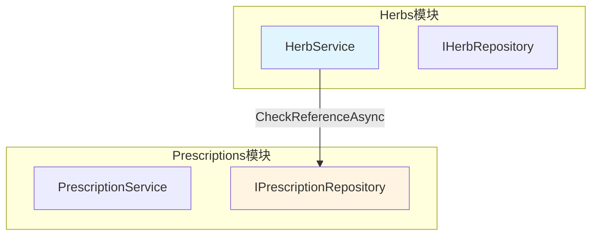
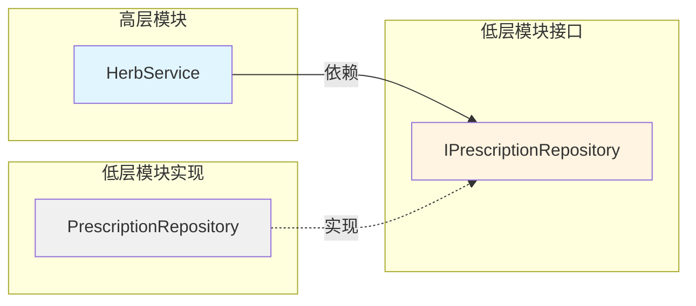

# 跨模块依赖关系说明

> **文档版本**: v1.0  
> **最后更新**: 2025-11-10  
> **适用范围**: LYBTZYZS Server端三层架构  
> **相关Epic**: #1962（Herbs批量操作）

---

## 📋 目录

- [1. 概述](#1-概述)
- [2. Herbs → Prescriptions 依赖](#2-herbs--prescriptions-依赖)
- [3. 依赖注入配置](#3-依赖注入配置)
- [4. 未来扩展方向](#4-未来扩展方向)
- [5. 架构原则与约束](#5-架构原则与约束)

---

## 1. 概述

### 1.1 跨模块依赖定义

**跨模块依赖**指模块边界之间的服务调用关系，遵循以下原则：

| 原则 | 说明 | 示例 |
|-----|------|------|
| **单向依赖** | 模块间依赖必须单向，禁止循环依赖 | ✅ Herbs → Prescriptions<br>❌ Prescriptions → Herbs |
| **接口隔离** | 通过接口调用，不直接依赖实现 | `IPrescriptionRepository` 而非 `PrescriptionRepository` |
| **最小知识** | 仅暴露必要的查询接口 | 仅提供引用检查，不暴露内部业务逻辑 |
| **聚合根保护** | 不允许跨模块修改聚合根状态 | ✅ 只读查询<br>❌ 跨模块写操作 |

### 1.2 当前依赖关系图



**说明**：
- **实线**：已实现的依赖（Epic #1962 Phase 4）
- **虚线**：未来扩展（见 [4. 未来扩展方向](#4-未来扩展方向)）

---

## 2. Herbs → Prescriptions 依赖

### 2.1 业务场景

**功能需求**（Epic #1962 FR-004）：
> 删除药材前需要检查是否被处方引用，防止数据孤立

**业务规则**：
- **BR-007**（软删除支持）：
  - `CanDelete` 始终返回 `true`（支持软删除）
  - 引用检查结果仅用于提示用户，不阻止删除操作
  - 软删除后（`IsDeleted=true`），处方中该药材名称仍保留用于历史记录

### 2.2 Service层实现

**HerbService.CheckReferenceAsync** (src/Server/Modules/LYBT.Module.Herbs/Services/HerbService.cs:639)

```csharp
public async Task<ServiceResult<HerbReferenceCheckDto>> CheckReferenceAsync(Guid herbId)
{
    try
    {
        var herb = await _repository.GetByIdAsync(herbId);
        if (herb == null)
        {
            return ServiceResult<HerbReferenceCheckDto>.Failure("药材不存在");
        }

        var result = new HerbReferenceCheckDto
        {
            HerbId = herbId,
            HerbName = herb.Name,
            HasReferences = false,
            ReferenceCount = 0,
            CanDelete = true, // BR-007: 支持软删除，始终可删除
            RecentReferences = new List<PrescriptionReferenceDto>()
        };

        // TODO: 实现处方引用检查
        // 当前版本暂不检查，直接返回无引用
        // 后续迭代中需要查询 PrescriptionItems 表
        _logger.LogInformation("检查药材引用: {HerbName}, 暂不支持引用检查", herb.Name);

        return ServiceResult<HerbReferenceCheckDto>.Success(result);
    }
    catch (Exception ex)
    {
        _logger.LogError(ex, "检查药材引用失败: {HerbId}", herbId);
        return ServiceResult<HerbReferenceCheckDto>.Failure($"检查引用失败: {ex.Message}");
    }
}
```

**当前实现状态**：
- ✅ **Phase 1（MVP）**：接口已定义，返回固定值（无引用）
- ⏳ **Phase 2（未来迭代）**：实现跨模块查询（见下节）

### 2.3 DTO定义

**HerbReferenceCheckDto** (src/Shared/LYBT.Shared.Models/Contracts/Herbs/HerbReferenceCheckDto.cs)

```csharp
/// <summary>
/// 药材引用检查结果DTO（Epic #1962 Phase 4）
/// </summary>
public class HerbReferenceCheckDto
{
    /// <summary>
    /// 药材ID
    /// </summary>
    public Guid HerbId { get; set; }

    /// <summary>
    /// 药材名称
    /// </summary>
    public string HerbName { get; set; } = string.Empty;

    /// <summary>
    /// 是否存在引用
    /// </summary>
    public bool HasReferences { get; set; }

    /// <summary>
    /// 引用数量
    /// </summary>
    public int ReferenceCount { get; set; }

    /// <summary>
    /// 是否可以删除（BR-007: 始终为true，支持软删除）
    /// </summary>
    public bool CanDelete { get; set; }

    /// <summary>
    /// 最近引用的处方列表（最多10条，用于展示提示信息）
    /// </summary>
    public List<PrescriptionReferenceDto> RecentReferences { get; set; } = new();
}

/// <summary>
/// 处方引用信息DTO
/// </summary>
public class PrescriptionReferenceDto
{
    public Guid PrescriptionId { get; set; }
    public string PrescriptionNumber { get; set; } = string.Empty;
    public DateTime CreatedAt { get; set; }
    public string PatientName { get; set; } = string.Empty;
}
```

### 2.4 Controller端点

**HerbsController.CheckReference** (src/Server/Services/LYBT.WebAPI/Controllers/HerbsController.cs:406)

```csharp
/// <summary>
/// 检查药材是否被处方引用（Epic #1962 Task 4.3）
/// </summary>
/// <param name="id">药材ID</param>
/// <returns>引用检查结果</returns>
[HttpGet("{id}/check-reference")]
[ProducesResponseType(typeof(ApiResponse<HerbReferenceCheckDto>), 200)]
[ProducesResponseType(400)]
[ProducesResponseType(404)]
public async Task<ActionResult<ApiResponse<HerbReferenceCheckDto>>> CheckReference(Guid id)
{
    try
    {
        var validation = ValidateGuid<HerbReferenceCheckDto>(id, "药材ID");
        if (validation != null)
        {
            return validation;
        }

        var result = await _herbService.CheckReferenceAsync(id);
        return HandleServiceResult(result, "引用检查完成");
    }
    catch (Exception ex)
    {
        return HandleException<HerbReferenceCheckDto>(ex, "检查药材引用", id);
    }
}
```

---

## 3. 依赖注入配置

### 3.1 模块注册顺序

**Program.cs** 中的模块注册必须遵守依赖顺序：

```csharp
// ⚠️ 重要：被依赖的模块必须先注册
builder.Services.AddPrescriptionsModule(builder.Configuration);  // 1. 先注册Prescriptions
builder.Services.AddHerbsModule(builder.Configuration);          // 2. 后注册Herbs（依赖Prescriptions）
```

**依赖关系**：
```
Herbs模块
  └─ 依赖 → IPrescriptionRepository（来自Prescriptions模块）
```

### 3.2 跨模块接口注入

**HerbsModule.cs** (src/Server/Modules/LYBT.Module.Herbs/HerbsModule.cs)

```csharp
public static class HerbsModule
{
    public static IServiceCollection AddHerbsModule(
        this IServiceCollection services,
        IConfiguration configuration)
    {
        // 注册本模块服务
        services.AddScoped<IHerbRepository, HerbRepository>();
        services.AddScoped<IHerbService, HerbService>();

        // ⚠️ 不需要显式注册 IPrescriptionRepository
        // 它已经由 Prescriptions 模块注册，DI容器自动解析
        
        return services;
    }
}
```

**HerbService构造函数**（未来扩展）：

```csharp
public class HerbService : IHerbService
{
    private readonly IHerbRepository _repository;
    private readonly IPrescriptionRepository _prescriptionRepository;  // 跨模块依赖
    private readonly IMapper _mapper;
    private readonly ILogger<HerbService> _logger;

    public HerbService(
        IHerbRepository repository,
        IPrescriptionRepository prescriptionRepository,  // DI自动注入
        IMapper mapper,
        ILogger<HerbService> logger)
    {
        _repository = repository;
        _prescriptionRepository = prescriptionRepository;  // 来自Prescriptions模块
        _mapper = mapper;
        _logger = logger;
    }
}
```

---

## 4. 未来扩展方向

### 4.1 扩展IPrescriptionRepository接口

**新增方法定义**：

```csharp
/// <summary>
/// 处方仓储接口扩展（Epic #1962 Phase 4 未来迭代）
/// </summary>
public interface IPrescriptionRepository
{
    // ===== 现有方法（略） =====

    // ===== Epic #1962 新增：药材引用查询 =====

    /// <summary>
    /// 获取药材在处方中的引用数量
    /// </summary>
    /// <param name="herbId">药材ID</param>
    /// <returns>引用次数（统计PrescriptionItems表中出现次数）</returns>
    Task<int> GetHerbReferenceCountAsync(Guid herbId);

    /// <summary>
    /// 获取引用该药材的最近处方列表
    /// </summary>
    /// <param name="herbId">药材ID</param>
    /// <param name="topCount">返回数量（默认10条）</param>
    /// <returns>处方引用信息列表</returns>
    Task<List<PrescriptionReferenceDto>> GetRecentReferencesAsync(Guid herbId, int topCount = 10);
}
```

### 4.2 实现示例（EF Core查询）

**PrescriptionRepository.cs** (未来实现)

```csharp
public async Task<int> GetHerbReferenceCountAsync(Guid herbId)
{
    // 查询 PrescriptionItems 表
    return await _context.PrescriptionItems
        .Where(item => item.HerbId == herbId)
        .CountAsync();
}

public async Task<List<PrescriptionReferenceDto>> GetRecentReferencesAsync(
    Guid herbId, int topCount = 10)
{
    // 联表查询获取处方详情
    return await _context.PrescriptionItems
        .Where(item => item.HerbId == herbId)
        .Select(item => new PrescriptionReferenceDto
        {
            PrescriptionId = item.PrescriptionId,
            PrescriptionNumber = item.Prescription.PrescriptionNumber,
            CreatedAt = item.Prescription.CreatedAt,
            PatientName = item.Prescription.Patient.Name
        })
        .OrderByDescending(dto => dto.CreatedAt)
        .Take(topCount)
        .ToListAsync();
}
```

### 4.3 HerbService完整实现（未来）

```csharp
public async Task<ServiceResult<HerbReferenceCheckDto>> CheckReferenceAsync(Guid herbId)
{
    try
    {
        var herb = await _repository.GetByIdAsync(herbId);
        if (herb == null)
        {
            return ServiceResult<HerbReferenceCheckDto>.Failure("药材不存在");
        }

        // ⚠️ 跨模块查询 Prescriptions
        var referenceCount = await _prescriptionRepository.GetHerbReferenceCountAsync(herbId);
        var recentReferences = await _prescriptionRepository.GetRecentReferencesAsync(herbId, 10);

        var result = new HerbReferenceCheckDto
        {
            HerbId = herbId,
            HerbName = herb.Name,
            HasReferences = referenceCount > 0,
            ReferenceCount = referenceCount,
            CanDelete = true,  // BR-007: 始终可删除（软删除）
            RecentReferences = recentReferences
        };

        _logger.LogInformation(
            "检查药材引用: {HerbName}, 引用数量: {Count}",
            herb.Name, referenceCount);

        return ServiceResult<HerbReferenceCheckDto>.Success(result);
    }
    catch (Exception ex)
    {
        _logger.LogError(ex, "检查药材引用失败: {HerbId}", herbId);
        return ServiceResult<HerbReferenceCheckDto>.Failure($"检查引用失败: {ex.Message}");
    }
}
```

### 4.4 性能优化建议

**查询优化**：
```sql
-- 建议在 PrescriptionItems 表添加索引
CREATE INDEX IX_PrescriptionItems_HerbId 
ON PrescriptionItems(HerbId)
INCLUDE (PrescriptionId);  -- 覆盖索引，包含关联字段
```

**批量查询优化**（BatchCheckReferenceAsync）：
```csharp
public async Task<ServiceResult<List<HerbReferenceCheckDto>>> BatchCheckReferenceAsync(
    List<Guid> herbIds)
{
    // ✅ 优化：一次性查询所有引用数量
    var referenceCounts = await _prescriptionRepository
        .GetBatchHerbReferenceCountsAsync(herbIds);

    // 组装结果...
}

// IPrescriptionRepository 新增方法
Task<Dictionary<Guid, int>> GetBatchHerbReferenceCountsAsync(List<Guid> herbIds);
```

---

## 5. 架构原则与约束

### 5.1 DDD聚合根边界保护

**禁止跨模块修改聚合根**：

```csharp
// ❌ 错误示例：跨模块修改Prescription
public async Task DeleteHerbAsync(Guid herbId)
{
    // ❌ 不允许在Herbs模块中修改Prescription状态
    var prescriptions = await _prescriptionRepository.GetByHerbIdAsync(herbId);
    foreach (var prescription in prescriptions)
    {
        prescription.RemoveItem(herbId);  // ❌ 违反聚合根保护原则
    }
}

// ✅ 正确示例：仅查询，提示用户手动处理
public async Task<ServiceResult> DeleteHerbAsync(Guid herbId)
{
    var referenceCheck = await CheckReferenceAsync(herbId);
    if (referenceCheck.Data.HasReferences)
    {
        _logger.LogWarning(
            "药材 {HerbId} 被 {Count} 个处方引用，执行软删除",
            herbId, referenceCheck.Data.ReferenceCount);
    }

    // ✅ 仅在本模块内操作（软删除）
    await _repository.SoftDeleteAsync(herbId);
    return ServiceResult.Success();
}
```

### 5.2 依赖方向控制

**遵循依赖倒置原则（DIP）**：



**关键点**：
- ✅ HerbService 依赖 `IPrescriptionRepository` 接口（而非实现）
- ✅ 接口定义在被依赖模块（Prescriptions）
- ✅ DI容器负责解析具体实现（PrescriptionRepository）

### 5.3 BR-006与BR-007业务规则

**BR-006**（批量操作限制）：
```csharp
const int MAX_CHECK_SIZE = 100;

if (herbIds.Count > MAX_CHECK_SIZE)
{
    return ServiceResult<List<HerbReferenceCheckDto>>.Failure(
        $"批量检查最多支持{MAX_CHECK_SIZE}条记录");
}
```

**BR-007**（软删除支持）：
```csharp
// ✅ CanDelete 始终为 true（无强制约束）
var result = new HerbReferenceCheckDto
{
    CanDelete = true,  // 软删除模式，允许删除有引用的药材
    // ...
};

// 删除后处方历史记录保留药材名称
// 用户界面提示："该药材已被X个处方引用，删除后历史记录仍保留"
```

---

## 📚 相关文档

| 文档 | 路径 | 说明 |
|-----|------|------|
| **Herbs模块架构** | `docs/explanation/architecture/server/modules/herbs.md` | Herbs模块详细设计 |
| **批量操作模式** | `docs/how-to/patterns/batch-operations.md` | Desktop主导模式指南 |
| **Server三层架构** | `docs/explanation/architecture/server/README.md` | 服务端总体架构 |
| **Epic #1962设计文档** | `docs/explanation/architecture/server/herbs-management-enhancement-design.md` | 详细技术设计 |

---

## 📝 变更历史

| 版本 | 日期 | 作者 | 变更内容 |
|-----|------|------|---------|
| v1.0 | 2025-11-10 | Claude | 初始版本（Epic #1962 Phase 5 Task 5.3） |

---

**最后更新**: 2025-11-10  
**维护者**: 开发团队  
**文档状态**: ✅ 已完成
