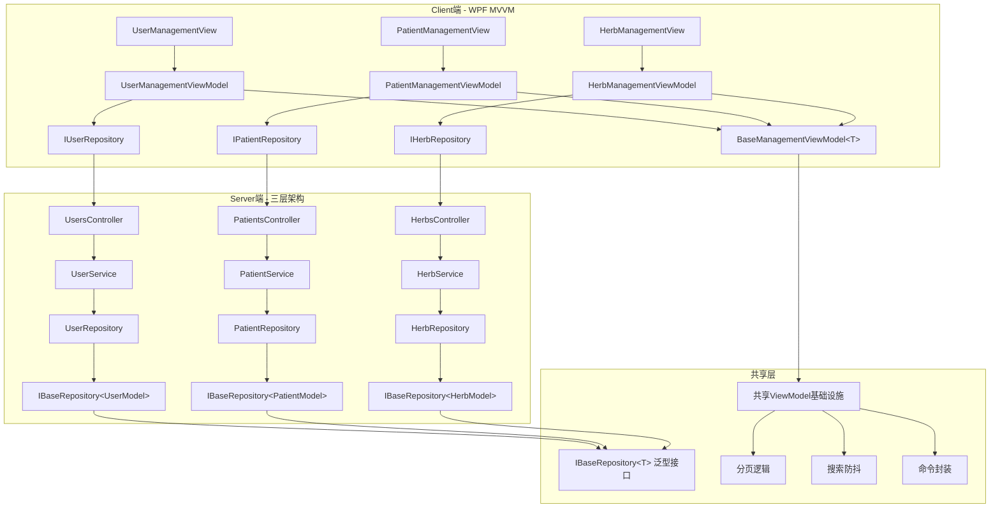

# 基础数据模块统一重构与优化技术设计文档

## 📋 元数据

- **需求文档**: [master-data-refactoring-discussion.md](master-data-refactoring-discussion.md)
- **设计版本**: v1.0
- **创建日期**: 2025-11-10
- **架构验证**: ⏳ 待验证

## 🎯 设计目标

基于需求文档的业务目标，本技术设计旨在：

1. **统一三个模块的Server端架构**：通过IBaseRepository<T>泛型接口减少重复代码150-200行
2. **统一三个模块的Client端UI**：通过BaseManagementViewModel<T>基类和XAML模板减少重复代码250-300行
3. **统一批量操作模式**：全部采用Desktop主导模式（Excel在客户端处理），提升用户体验
4. **统一性能基准**：对齐Herbs模块的性能标准（分页<500ms，批量导入1000条<10s）
5. **补充完整文档**：Users和Patients模块对齐Herbs的文档完整性
6. **清除多余功能**：识别并清除未使用的方法和代码，符合MVP原则 ⭐ 新增

## 🏗️ 重构架构设计

### 当前架构现状

**三个模块的架构差异**：

| 维度 | Users模块 | Patients模块 | Herbs模块 | 重构目标 |
|------|-----------|--------------|-----------|---------|
| **Repository方法数** | 25个 | ~15个 | 7个 | **统一基础CRUD + 保留特定业务方法** |
| **Service方法数** | 19个 | ~12个 | 4个 | **删除未使用方法 + 保留核心业务逻辑** |
| **批量操作** | Server主导 | Server主导 | Desktop主导 | **统一为Desktop主导** |
| **ViewModel基类** | UnifiedViewModelBase | 独立实现 | 独立实现 | **统一为BaseManagementViewModel<T>** |
| **性能基准** | 未明确 | 未明确 | 明确（BR-008） | **统一性能基准** |

### 重构后架构设计

#### 架构组件关系图



#### 数据流设计

**统一后的数据流**（三个模块完全一致）：

```
【用户操作】
    ↓
【View】(UserManagementView/PatientManagementView/HerbManagementView)
    ↓
【ViewModel】(继承BaseManagementViewModel<T>)
    - 分页属性：PageIndex, PageSize, TotalCount
    - 搜索属性：SearchText (500ms防抖)
    - 命令：RefreshCommand, DeleteCommand, ImportCommand, ExportCommand
    ↓
【Repository】(实现IBaseRepository<T>)
    - 标准CRUD：GetPagedAsync, AddAsync, UpdateAsync, DeleteAsync
    - 特定业务：GetByUsernameAsync, GetByNameOrPinyinAsync等
    ↓
【HTTP API】(Refit自动生成)
    ↓
【Server Controller】(UsersController/PatientsController/HerbsController)
    ↓
【Service】(返回Result<T>模式)
    - 业务规则验证
    - 事务管理
    ↓
【Repository】(实现IBaseRepository<T>)
    - EF Core查询
    - 聚合根操作
    ↓
【Database】(SQL Server)
```

#### 层级职责划分

**Server端职责**（三层架构）：

1. **Presentation Layer (Controllers)**：
   - 职责：处理HTTP请求/响应，参数验证，调用Service
   - 统一位置：`LYBT.WebAPI/Controllers/`
   - 统一模式：所有Controller使用`[ApiController]`特性，返回`ActionResult<T>`

2. **Application Layer (Services)**：
   - 职责：业务逻辑实现，业务规则验证，事务管理
   - 统一返回值：`Result<T>`模式（成功/失败/错误信息）
   - 统一验证：FluentValidation验证器

3. **Data Access Layer (Repositories)**：
   - 职责：数据持久化，聚合根操作，EF Core封装
   - 统一接口：`IBaseRepository<T>`（11个标准CRUD方法）
   - 统一实现：继承泛型接口，保留特定业务方法

**Client端职责**（MVVM模式）：

1. **View Layer (XAML)**：
   - 职责：UI展示，数据绑定，事件处理
   - 统一模板：`BaseMasterDataListView.xaml`（工具栏 + 数据表格 + 分页控件）

2. **ViewModel Layer**：
   - 职责：UI逻辑，数据绑定，Command封装
   - 统一基类：`BaseManagementViewModel<T>`（分页、搜索、命令）
   - 直接注入：Repository（Phase 2架构，无中间Service层）

3. **Repository Layer**：
   - 职责：HTTP API调用，Refit接口封装
   - 统一接口：`IBaseRepository<T>`（与Server端对齐）

---

## 🔧 Repository层统一设计（Phase 1）

### IBaseRepository<T>泛型接口定义

**文件路径**：`src/Shared/LYBT.Shared.Models/Interfaces/IBaseRepository.cs`

```csharp
namespace LYBT.Shared.Models.Interfaces;

/// <summary>
/// 基础数据模块通用Repository接口（Users/Patients/Herbs）
/// 定义标准CRUD操作，减少重复代码
/// </summary>
/// <typeparam name="T">实体类型（UserModel/PatientModel/HerbModel）</typeparam>
public interface IBaseRepository<T> where T : class
{
    // ========== 查询方法 ==========

    /// <summary>
    /// 根据ID获取实体
    /// </summary>
    Task<T?> GetByIdAsync(int id);

    /// <summary>
    /// 获取所有实体（⚠️ 仅用于小数据量场景，如下拉列表）
    /// </summary>
    Task<IEnumerable<T>> GetAllAsync();

    /// <summary>
    /// 分页查询实体
    /// </summary>
    /// <param name="pageIndex">页码（从1开始）</param>
    /// <param name="pageSize">每页数量</param>
    /// <param name="searchText">搜索关键字（可选，支持名称/拼音码搜索）</param>
    Task<PagedResult<T>> GetPagedAsync(int pageIndex, int pageSize, string? searchText = null);

    /// <summary>
    /// 条件查询（⚠️ 谨慎使用，建议使用具体业务方法）
    /// </summary>
    Task<IEnumerable<T>> FindAsync(Expression<Func<T, bool>> predicate);

    // ========== 写入方法 ==========

    /// <summary>
    /// 新增实体
    /// </summary>
    Task<T> AddAsync(T entity);

    /// <summary>
    /// 更新实体
    /// </summary>
    Task<T> UpdateAsync(T entity);

    /// <summary>
    /// 删除实体（软删除或物理删除，由实现决定）
    /// </summary>
    Task<bool> DeleteAsync(int id);

    // ========== 辅助方法 ==========

    /// <summary>
    /// 检查实体是否存在
    /// </summary>
    Task<bool> ExistsAsync(int id);

    /// <summary>
    /// 获取实体总数
    /// </summary>
    Task<int> CountAsync();

    /// <summary>
    /// 保存更改（⚠️ 通常由Service层调用，Repository层实现可选）
    /// </summary>
    Task<int> SaveChangesAsync();
}
```

### Server端Repository实现

#### UserRepository重构

**文件路径**：`src/Server/Modules/LYBT.Module.Users/Repositories/UserRepository.cs`

**重构策略**：
- ✅ 实现IBaseRepository<UserModel>接口
- ✅ 保留特定业务方法（GetByUsernameAsync, IsUsernameExistsAsync等）
- ❌ 清除未使用的方法（通过find_referencing_symbols检查引用）

```csharp
namespace LYBT.Module.Users.Repositories;

/// <summary>
/// 用户Repository - 重构版（实现IBaseRepository&lt;UserModel&gt;）
/// Phase 1 Task 1.2: 统一基础CRUD方法，保留特定业务方法
/// </summary>
public class UserRepository : IBaseRepository<UserModel>, IUserRepository
{
    private readonly ApplicationDbContext _context;

    public UserRepository(ApplicationDbContext context)
    {
        _context = context;
    }

    // ========== IBaseRepository<UserModel>标准实现 ==========

    public async Task<UserModel?> GetByIdAsync(int id)
    {
        return await _context.Users
            .Include(u => u.Role)
            .FirstOrDefaultAsync(u => u.Id == id && !u.IsDeleted);
    }

    public async Task<IEnumerable<UserModel>> GetAllAsync()
    {
        return await _context.Users
            .Where(u => !u.IsDeleted)
            .Include(u => u.Role)
            .ToListAsync();
    }

    public async Task<PagedResult<UserModel>> GetPagedAsync(
        int pageIndex, int pageSize, string? searchText = null)
    {
        var query = _context.Users
            .Where(u => !u.IsDeleted)
            .Include(u => u.Role)
            .AsQueryable();

        // 搜索逻辑（用户名/真实姓名/拼音码）
        if (!string.IsNullOrWhiteSpace(searchText))
        {
            query = query.Where(u =>
                u.Username.Contains(searchText) ||
                u.RealName.Contains(searchText) ||
                u.PinyinCode.Contains(searchText));
        }

        var totalCount = await query.CountAsync();
        var items = await query
            .OrderByDescending(u => u.CreatedAt)
            .Skip((pageIndex - 1) * pageSize)
            .Take(pageSize)
            .ToListAsync();

        return new PagedResult<UserModel>
        {
            Items = items,
            TotalCount = totalCount,
            CurrentPage = pageIndex,
            PageSize = pageSize
        };
    }

    public async Task<IEnumerable<UserModel>> FindAsync(Expression<Func<UserModel, bool>> predicate)
    {
        return await _context.Users
            .Where(predicate)
            .Where(u => !u.IsDeleted)
            .ToListAsync();
    }

    public async Task<UserModel> AddAsync(UserModel entity)
    {
        entity.CreatedAt = DateTime.UtcNow;
        _context.Users.Add(entity);
        await _context.SaveChangesAsync();
        return entity;
    }

    public async Task<UserModel> UpdateAsync(UserModel entity)
    {
        entity.UpdatedAt = DateTime.UtcNow;
        _context.Users.Update(entity);
        await _context.SaveChangesAsync();
        return entity;
    }

    public async Task<bool> DeleteAsync(int id)
    {
        var entity = await GetByIdAsync(id);
        if (entity == null) return false;

        // 软删除
        entity.IsDeleted = true;
        entity.DeletedAt = DateTime.UtcNow;
        await UpdateAsync(entity);
        return true;
    }

    public async Task<bool> ExistsAsync(int id)
    {
        return await _context.Users.AnyAsync(u => u.Id == id && !u.IsDeleted);
    }

    public async Task<int> CountAsync()
    {
        return await _context.Users.CountAsync(u => !u.IsDeleted);
    }

    public async Task<int> SaveChangesAsync()
    {
        return await _context.SaveChangesAsync();
    }

    // ========== 特定业务方法（保留） ==========

    /// <summary>
    /// 根据用户名获取用户
    /// </summary>
    public async Task<UserModel?> GetByUsernameAsync(string username)
    {
        return await _context.Users
            .Include(u => u.Role)
            .FirstOrDefaultAsync(u => u.Username == username && !u.IsDeleted);
    }

    /// <summary>
    /// 检查用户名是否存在
    /// </summary>
    public async Task<bool> IsUsernameExistsAsync(string username, int? excludeId = null)
    {
        var query = _context.Users.Where(u => u.Username == username && !u.IsDeleted);
        if (excludeId.HasValue)
        {
            query = query.Where(u => u.Id != excludeId.Value);
        }
        return await query.AnyAsync();
    }

    /// <summary>
    /// 重置密码
    /// </summary>
    public async Task<bool> ResetPasswordAsync(int userId, string newPasswordHash)
    {
        var user = await GetByIdAsync(userId);
        if (user == null) return false;

        user.PasswordHash = newPasswordHash;
        user.UpdatedAt = DateTime.UtcNow;
        await UpdateAsync(user);
        return true;
    }
}
```

**功能清除清单**（BR-REFACTOR-006）⭐：

需要检查以下方法的引用，如无引用则清除：
- `GetByEmailAsync` - 检查是否有调用
- `IsEmailExistsAsync` - 检查是否有调用
- `AddRangeAsync` - 检查是否有调用
- `DeleteRangeAsync` - 检查是否有调用
- `GetSingleAsync` - 检查是否有调用（可能与GetByIdAsync重复）

**检查方法**：
```bash
# 使用serena工具的find_referencing_symbols
find_referencing_symbols(
    name_path="GetByEmailAsync",
    relative_path="src/Server/Modules/LYBT.Module.Users/Repositories/UserRepository.cs"
)
```

### Client端Repository实现

#### UserRepository重构（Client端）

**文件路径**：`src/Client/Desktop/Modules/LYBT.Desktop.Users/Repositories/UserRepository.cs`

**重构策略**：
- ✅ 实现IBaseRepository<UserDto>接口
- ✅ 使用Refit封装HTTP API调用
- ✅ 保留特定业务方法（GetByUsernameAsync等）

```csharp
namespace LYBT.Desktop.Users.Repositories;

/// <summary>
/// 用户Repository - 重构版（Client端）
/// Phase 2 Task 2.1: 实现IBaseRepository&lt;UserDto&gt;接口
/// </summary>
public class UserRepository : IBaseRepository<UserDto>, IUserRepository
{
    private readonly IUserApi _userApi;

    public UserRepository(IUserApi userApi)
    {
        _userApi = userApi;
    }

    // ========== IBaseRepository<UserDto>标准实现 ==========

    public async Task<UserDto?> GetByIdAsync(int id)
    {
        var response = await _userApi.GetByIdAsync(id);
        return response.IsSuccessStatusCode ? response.Content : null;
    }

    public async Task<IEnumerable<UserDto>> GetAllAsync()
    {
        var response = await _userApi.GetAllAsync();
        return response.IsSuccessStatusCode ? response.Content : Enumerable.Empty<UserDto>();
    }

    public async Task<PagedResult<UserDto>> GetPagedAsync(
        int pageIndex, int pageSize, string? searchText = null)
    {
        var response = await _userApi.GetPagedAsync(pageIndex, pageSize, searchText);
        return response.IsSuccessStatusCode
            ? response.Content
            : new PagedResult<UserDto>();
    }

    public async Task<IEnumerable<UserDto>> FindAsync(Expression<Func<UserDto, bool>> predicate)
    {
        // ⚠️ Client端不支持表达式查询，建议使用具体业务方法
        throw new NotSupportedException("Client端不支持表达式查询，请使用具体业务方法");
    }

    public async Task<UserDto> AddAsync(UserDto entity)
    {
        var response = await _userApi.CreateAsync(entity);
        return response.Content;
    }

    public async Task<UserDto> UpdateAsync(UserDto entity)
    {
        var response = await _userApi.UpdateAsync(entity.Id, entity);
        return response.Content;
    }

    public async Task<bool> DeleteAsync(int id)
    {
        var response = await _userApi.DeleteAsync(id);
        return response.IsSuccessStatusCode;
    }

    public async Task<bool> ExistsAsync(int id)
    {
        var user = await GetByIdAsync(id);
        return user != null;
    }

    public async Task<int> CountAsync()
    {
        var response = await _userApi.GetCountAsync();
        return response.Content;
    }

    public async Task<int> SaveChangesAsync()
    {
        // Client端无需实现（Server端负责保存）
        return 0;
    }

    // ========== 特定业务方法（保留） ==========

    public async Task<UserDto?> GetByUsernameAsync(string username)
    {
        var response = await _userApi.GetByUsernameAsync(username);
        return response.IsSuccessStatusCode ? response.Content : null;
    }

    public async Task<bool> IsUsernameExistsAsync(string username, int? excludeId = null)
    {
        var response = await _userApi.IsUsernameExistsAsync(username, excludeId);
        return response.Content;
    }
}
```

---

## 🔧 Service层统一设计（Phase 1）

### Result<T>返回值模式

**文件路径**：`src/Shared/LYBT.Shared.Models/Common/Result.cs`

```csharp
namespace LYBT.Shared.Models.Common;

/// <summary>
/// 统一返回值模式 - 封装成功/失败状态和错误信息
/// </summary>
/// <typeparam name="T">返回数据类型</typeparam>
public class Result<T>
{
    public bool IsSuccess { get; set; }
    public T? Data { get; set; }
    public string? ErrorMessage { get; set; }
    public List<string>? Errors { get; set; }

    public static Result<T> Success(T data)
    {
        return new Result<T>
        {
            IsSuccess = true,
            Data = data
        };
    }

    public static Result<T> Failure(string errorMessage)
    {
        return new Result<T>
        {
            IsSuccess = false,
            ErrorMessage = errorMessage
        };
    }

    public static Result<T> Failure(List<string> errors)
    {
        return new Result<T>
        {
            IsSuccess = false,
            Errors = errors,
            ErrorMessage = string.Join("; ", errors)
        };
    }
}
```

### UserService重构

**文件路径**：`src/Server/Modules/LYBT.Module.Users/Services/UserService.cs`

```csharp
namespace LYBT.Module.Users.Services;

/// <summary>
/// 用户Service - 重构版（统一Result&lt;T&gt;返回值模式）
/// Phase 1 Task 1.5: 统一业务逻辑模式和异常处理
/// </summary>
public class UserService : IUserService
{
    private readonly IUserRepository _userRepository;
    private readonly IMapper _mapper;
    private readonly IValidator<UserInputDto> _validator;

    public UserService(
        IUserRepository userRepository,
        IMapper mapper,
        IValidator<UserInputDto> validator)
    {
        _userRepository = userRepository;
        _mapper = mapper;
        _validator = validator;
    }

    /// <summary>
    /// 创建用户
    /// </summary>
    public async Task<Result<UserDto>> CreateAsync(UserInputDto input)
    {
        // 1. FluentValidation验证
        var validationResult = await _validator.ValidateAsync(input);
        if (!validationResult.IsValid)
        {
            return Result<UserDto>.Failure(
                validationResult.Errors.Select(e => e.ErrorMessage).ToList()
            );
        }

        // 2. 业务规则验证：用户名唯一性
        if (await _userRepository.IsUsernameExistsAsync(input.Username))
        {
            return Result<UserDto>.Failure($"用户名 '{input.Username}' 已存在");
        }

        // 3. 密码加密
        var passwordHash = PasswordHelper.HashPassword(input.Password);

        // 4. Entity映射
        var user = _mapper.Map<UserModel>(input);
        user.PasswordHash = passwordHash;
        user.CreatedAt = DateTime.UtcNow;

        // 5. 持久化
        var createdUser = await _userRepository.AddAsync(user);

        // 6. DTO映射
        var userDto = _mapper.Map<UserDto>(createdUser);

        return Result<UserDto>.Success(userDto);
    }

    /// <summary>
    /// 更新用户
    /// </summary>
    public async Task<Result<UserDto>> UpdateAsync(int id, UserInputDto input)
    {
        // 1. 验证
        var validationResult = await _validator.ValidateAsync(input);
        if (!validationResult.IsValid)
        {
            return Result<UserDto>.Failure(
                validationResult.Errors.Select(e => e.ErrorMessage).ToList()
            );
        }

        // 2. 检查存在性
        var existingUser = await _userRepository.GetByIdAsync(id);
        if (existingUser == null)
        {
            return Result<UserDto>.Failure($"用户 {id} 不存在");
        }

        // 3. 业务规则验证：用户名唯一性（排除自己）
        if (await _userRepository.IsUsernameExistsAsync(input.Username, id))
        {
            return Result<UserDto>.Failure($"用户名 '{input.Username}' 已存在");
        }

        // 4. 更新Entity
        _mapper.Map(input, existingUser);
        existingUser.UpdatedAt = DateTime.UtcNow;

        // 5. 持久化
        var updatedUser = await _userRepository.UpdateAsync(existingUser);

        // 6. DTO映射
        var userDto = _mapper.Map<UserDto>(updatedUser);

        return Result<UserDto>.Success(userDto);
    }

    /// <summary>
    /// 删除用户
    /// </summary>
    public async Task<Result<bool>> DeleteAsync(int id)
    {
        // 1. 检查存在性
        if (!await _userRepository.ExistsAsync(id))
        {
            return Result<bool>.Failure($"用户 {id} 不存在");
        }

        // 2. 软删除
        var result = await _userRepository.DeleteAsync(id);

        return Result<bool>.Success(result);
    }

    /// <summary>
    /// 获取分页用户列表
    /// </summary>
    public async Task<Result<PagedResult<UserDto>>> GetPagedAsync(
        int pageIndex, int pageSize, string? searchText = null)
    {
        var pagedUsers = await _userRepository.GetPagedAsync(pageIndex, pageSize, searchText);

        var userDtos = _mapper.Map<List<UserDto>>(pagedUsers.Items);

        var pagedResult = new PagedResult<UserDto>
        {
            Items = userDtos,
            TotalCount = pagedUsers.TotalCount,
            CurrentPage = pagedUsers.CurrentPage,
            PageSize = pagedUsers.PageSize
        };

        return Result<PagedResult<UserDto>>.Success(pagedResult);
    }
}
```

---

## 🔧 ViewModel层统一设计（Phase 2）

### BaseManagementViewModel<T>泛型基类

**文件路径**：`src/Client/Desktop/Core/LYBT.Desktop.Core/ViewModels/BaseManagementViewModel.cs`

```csharp
namespace LYBT.Desktop.Core.ViewModels;

/// <summary>
/// 基础数据模块通用ViewModel基类（Users/Patients/Herbs）
/// 封装分页、搜索、命令等通用逻辑，减少重复代码
/// </summary>
/// <typeparam name="TDto">DTO类型（UserDto/PatientDto/HerbDto）</typeparam>
public abstract class BaseManagementViewModel<TDto> : BindableBase where TDto : class
{
    // ========== 分页属性 ==========

    private int _pageIndex = 1;
    public int PageIndex
    {
        get => _pageIndex;
        set
        {
            if (SetProperty(ref _pageIndex, value))
            {
                _ = LoadDataAsync();
            }
        }
    }

    private int _pageSize = 20;
    public int PageSize
    {
        get => _pageSize;
        set => SetProperty(ref _pageSize, value);
    }

    private int _totalCount;
    public int TotalCount
    {
        get => _totalCount;
        set
        {
            SetProperty(ref _totalCount, value);
            RaisePropertyChanged(nameof(TotalPages));
            RaisePropertyChanged(nameof(HasNextPage));
            RaisePropertyChanged(nameof(HasPreviousPage));
        }
    }

    public int TotalPages => (int)Math.Ceiling(TotalCount / (double)PageSize);
    public bool HasNextPage => PageIndex < TotalPages;
    public bool HasPreviousPage => PageIndex > 1;

    // ========== 数据集合 ==========

    private ObservableCollection<TDto> _items = new();
    public ObservableCollection<TDto> Items
    {
        get => _items;
        set => SetProperty(ref _items, value);
    }

    private TDto? _selectedItem;
    public TDto? SelectedItem
    {
        get => _selectedItem;
        set => SetProperty(ref _selectedItem, value);
    }

    // ========== 搜索属性 ==========

    private string? _searchText;
    private CancellationTokenSource? _searchCts;

    public string? SearchText
    {
        get => _searchText;
        set
        {
            if (SetProperty(ref _searchText, value))
            {
                SearchWithDebounce();
            }
        }
    }

    /// <summary>
    /// 搜索防抖（500ms）
    /// </summary>
    private async void SearchWithDebounce()
    {
        _searchCts?.Cancel();
        _searchCts = new CancellationTokenSource();

        try
        {
            await Task.Delay(500, _searchCts.Token);
            PageIndex = 1; // 重置到第一页
            await LoadDataAsync();
        }
        catch (TaskCanceledException)
        {
            // 防抖取消，忽略
        }
    }

    // ========== 忙碌状态 ==========

    private bool _isBusy;
    public bool IsBusy
    {
        get => _isBusy;
        set => SetProperty(ref _isBusy, value);
    }

    // ========== 命令 ==========

    public DelegateCommand RefreshCommand { get; }
    public DelegateCommand PreviousPageCommand { get; }
    public DelegateCommand NextPageCommand { get; }
    public DelegateCommand<TDto> DeleteCommand { get; }

    // ========== 构造函数 ==========

    protected BaseManagementViewModel()
    {
        RefreshCommand = new DelegateCommand(async () => await LoadDataAsync());
        PreviousPageCommand = new DelegateCommand(
            () => PageIndex--,
            () => HasPreviousPage
        );
        NextPageCommand = new DelegateCommand(
            () => PageIndex++,
            () => HasNextPage
        );
        DeleteCommand = new DelegateCommand<TDto>(
            async item => await DeleteItemAsync(item),
            item => item != null
        );
    }

    // ========== 抽象方法（子类实现） ==========

    /// <summary>
    /// 加载数据（由子类实现具体数据加载逻辑）
    /// </summary>
    protected abstract Task<PagedResult<TDto>> LoadDataAsync(
        int pageIndex, int pageSize, string? searchText);

    /// <summary>
    /// 删除数据项（由子类实现具体删除逻辑）
    /// </summary>
    protected abstract Task<bool> DeleteItemAsync(TDto item);

    // ========== 私有方法 ==========

    private async Task LoadDataAsync()
    {
        if (IsBusy) return;

        try
        {
            IsBusy = true;

            var pagedResult = await LoadDataAsync(PageIndex, PageSize, SearchText);

            Items.Clear();
            foreach (var item in pagedResult.Items)
            {
                Items.Add(item);
            }

            TotalCount = pagedResult.TotalCount;
        }
        catch (Exception ex)
        {
            // 错误处理（可以通过事件聚合器发布错误消息）
            Debug.WriteLine($"加载数据失败: {ex.Message}");
        }
        finally
        {
            IsBusy = false;
        }
    }
}
```

### UserManagementViewModel重构

**文件路径**：`src/Client/Desktop/Modules/LYBT.Desktop.Users/ViewModels/UserManagementViewModel.cs`

```csharp
namespace LYBT.Desktop.Users.ViewModels;

/// <summary>
/// 用户管理ViewModel - 重构版（继承BaseManagementViewModel）
/// Phase 2 Task 2.2: 统一分页、搜索、命令逻辑
/// </summary>
public class UserManagementViewModel : BaseManagementViewModel<UserDto>
{
    private readonly IUserRepository _userRepository;
    private readonly IEventAggregator _eventAggregator;

    public UserManagementViewModel(
        IUserRepository userRepository,
        IEventAggregator eventAggregator)
    {
        _userRepository = userRepository;
        _eventAggregator = eventAggregator;
    }

    // ========== 实现抽象方法 ==========

    protected override async Task<PagedResult<UserDto>> LoadDataAsync(
        int pageIndex, int pageSize, string? searchText)
    {
        return await _userRepository.GetPagedAsync(pageIndex, pageSize, searchText);
    }

    protected override async Task<bool> DeleteItemAsync(UserDto item)
    {
        // 确认对话框
        var result = MessageBox.Show(
            $"确定要删除用户 '{item.Username}' 吗？",
            "确认删除",
            MessageBoxButton.YesNo,
            MessageBoxImage.Warning
        );

        if (result != MessageBoxResult.Yes)
            return false;

        // 调用Repository删除
        var deleteResult = await _userRepository.DeleteAsync(item.Id);

        if (deleteResult)
        {
            // 刷新列表
            await RefreshCommand.Execute();
        }

        return deleteResult;
    }
}
```

---

## 🎨 UI层统一设计（Phase 2）

### BaseMasterDataListView.xaml模板

**文件路径**：`src/Client/Desktop/Core/LYBT.Desktop.Core/Views/BaseMasterDataListView.xaml`

```xaml
<UserControl x:Class="LYBT.Desktop.Core.Views.BaseMasterDataListView"
             xmlns="http://schemas.microsoft.com/winfx/2006/xaml/presentation"
             xmlns:x="http://schemas.microsoft.com/winfx/2006/xaml"
             xmlns:mc="http://schemas.openxmlformats.org/markup-compatibility/2006"
             xmlns:d="http://schemas.microsoft.com/expression/blend/2008"
             mc:Ignorable="d"
             d:DesignHeight="600" d:DesignWidth="1200">
    <Grid>
        <Grid.RowDefinitions>
            <RowDefinition Height="Auto"/>  <!-- 工具栏 -->
            <RowDefinition Height="*"/>     <!-- 数据表格 -->
            <RowDefinition Height="Auto"/>  <!-- 分页控件 -->
        </Grid.RowDefinitions>

        <!-- 工具栏 -->
        <Border Grid.Row="0" Background="#F5F5F5" Padding="10" Margin="0,0,0,10">
            <StackPanel Orientation="Horizontal">
                <Button Content="新建" Command="{Binding CreateCommand}" Width="80" Height="32" Margin="0,0,10,0"/>
                <Button Content="导入" Command="{Binding ImportCommand}" Width="80" Height="32" Margin="0,0,10,0"/>
                <Button Content="导出" Command="{Binding ExportCommand}" Width="80" Height="32" Margin="0,0,10,0"/>
                <Button Content="刷新" Command="{Binding RefreshCommand}" Width="80" Height="32" Margin="0,0,20,0"/>

                <!-- 搜索框 -->
                <TextBox Text="{Binding SearchText, UpdateSourceTrigger=PropertyChanged}"
                         Width="300" Height="32"
                         VerticalContentAlignment="Center"
                         Margin="0,0,10,0">
                    <TextBox.Style>
                        <Style TargetType="TextBox">
                            <Setter Property="Template">
                                <Setter.Value>
                                    <ControlTemplate TargetType="TextBox">
                                        <Border Background="White" BorderBrush="#CCCCCC" BorderThickness="1" CornerRadius="4">
                                            <Grid>
                                                <TextBlock Text="搜索..." Foreground="#999999" Margin="8,0,0,0"
                                                           VerticalAlignment="Center"
                                                           Visibility="{Binding Text, RelativeSource={RelativeSource TemplatedParent}, Converter={StaticResource StringToVisibilityConverter}}"/>
                                                <ScrollViewer x:Name="PART_ContentHost" Margin="5,0,5,0" />
                                            </Grid>
                                        </Border>
                                    </ControlTemplate>
                                </Setter.Value>
                            </Setter>
                        </Style>
                    </TextBox.Style>
                </TextBox>
            </StackPanel>
        </Border>

        <!-- 数据表格（ContentPresenter，由子类定义列） -->
        <ContentPresenter Grid.Row="1" Content="{Binding DataGridContent}"/>

        <!-- 分页控件 -->
        <Border Grid.Row="2" Background="#F5F5F5" Padding="10" Margin="0,10,0,0">
            <Grid>
                <Grid.ColumnDefinitions>
                    <ColumnDefinition Width="Auto"/>
                    <ColumnDefinition Width="*"/>
                    <ColumnDefinition Width="Auto"/>
                </Grid.ColumnDefinitions>

                <!-- 左侧：总数信息 -->
                <TextBlock Grid.Column="0" VerticalAlignment="Center">
                    <Run Text="总计："/>
                    <Run Text="{Binding TotalCount}" FontWeight="Bold"/>
                    <Run Text="条"/>
                </TextBlock>

                <!-- 右侧：分页按钮 -->
                <StackPanel Grid.Column="2" Orientation="Horizontal" HorizontalAlignment="Right">
                    <Button Content="上一页" Command="{Binding PreviousPageCommand}" Width="80" Height="32" Margin="0,0,10,0"/>
                    <TextBlock VerticalAlignment="Center" Margin="0,0,10,0">
                        <Run Text="第"/>
                        <Run Text="{Binding PageIndex}" FontWeight="Bold"/>
                        <Run Text="/"/>
                        <Run Text="{Binding TotalPages}" FontWeight="Bold"/>
                        <Run Text="页"/>
                    </TextBlock>
                    <Button Content="下一页" Command="{Binding NextPageCommand}" Width="80" Height="32"/>
                </StackPanel>
            </Grid>
        </Border>

        <!-- 忙碌指示器 -->
        <Grid Grid.RowSpan="3" Background="#80000000" Visibility="{Binding IsBusy, Converter={StaticResource BoolToVisibilityConverter}}">
            <ProgressBar IsIndeterminate="True" Width="300" Height="20"/>
        </Grid>
    </Grid>
</UserControl>
```

### UserManagementView重构

**文件路径**：`src/Client/Desktop/Modules/LYBT.Desktop.Users/Views/UserManagementView.xaml`

```xaml
<UserControl x:Class="LYBT.Desktop.Users.Views.UserManagementView"
             xmlns="http://schemas.microsoft.com/winfx/2006/xaml/presentation"
             xmlns:x="http://schemas.microsoft.com/winfx/2006/xaml"
             xmlns:core="clr-namespace:LYBT.Desktop.Core.Views;assembly=LYBT.Desktop.Core"
             xmlns:local="clr-namespace:LYBT.Desktop.Users.ViewModels"
             d:DataContext="{d:DesignInstance Type=local:UserManagementViewModel}">

    <!-- 应用统一模板 -->
    <core:BaseMasterDataListView>
        <!-- 定义DataGridContent -->
        <core:BaseMasterDataListView.DataGridContent>
            <DataGrid ItemsSource="{Binding Items}"
                      SelectedItem="{Binding SelectedItem}"
                      AutoGenerateColumns="False"
                      IsReadOnly="True"
                      SelectionMode="Single">
                <DataGrid.Columns>
                    <DataGridTextColumn Header="用户名" Binding="{Binding Username}" Width="150"/>
                    <DataGridTextColumn Header="真实姓名" Binding="{Binding RealName}" Width="150"/>
                    <DataGridTextColumn Header="角色" Binding="{Binding RoleName}" Width="100"/>
                    <DataGridTextColumn Header="状态" Binding="{Binding Status}" Width="80"/>
                    <DataGridTextColumn Header="创建时间" Binding="{Binding CreatedAt, StringFormat=yyyy-MM-dd HH:mm}" Width="150"/>

                    <!-- 操作列 -->
                    <DataGridTemplateColumn Header="操作" Width="150">
                        <DataGridTemplateColumn.CellTemplate>
                            <DataTemplate>
                                <StackPanel Orientation="Horizontal">
                                    <Button Content="编辑" Width="60" Height="24" Margin="0,0,5,0"/>
                                    <Button Content="删除" Command="{Binding DataContext.DeleteCommand, RelativeSource={RelativeSource AncestorType=DataGrid}}"
                                            CommandParameter="{Binding}" Width="60" Height="24"/>
                                </StackPanel>
                            </DataTemplate>
                        </DataGridTemplateColumn.CellTemplate>
                    </DataGridTemplateColumn>
                </DataGrid.Columns>
            </DataGrid>
        </core:BaseMasterDataListView.DataGridContent>
    </core:BaseMasterDataListView>
</UserControl>
```

---

## 📦 批量操作统一设计（Phase 2）

### Desktop主导批量导入设计

**设计原则**：
- ✅ Excel解析在客户端完成（使用EPPlus）
- ✅ 客户端组装DTO后调用批量导入API
- ✅ 统一进度反馈和结果显示
- ✅ 统一失败数据导出和6步修复流程

### ExcelHelper工具类

**文件路径**：`src/Client/Desktop/Infrastructure/LYBT.Desktop.Infrastructure/Utilities/ExcelHelper.cs`

```csharp
namespace LYBT.Desktop.Infrastructure.Utilities;

/// <summary>
/// Excel导入导出工具类（Desktop主导模式）
/// 使用EPPlus库进行Excel解析
/// </summary>
public static class ExcelHelper
{
    /// <summary>
    /// 从Excel解析数据
    /// </summary>
    /// <typeparam name="T">DTO类型</typeparam>
    /// <param name="filePath">Excel文件路径</param>
    /// <param name="startRow">起始行号（默认2，第1行是标题）</param>
    /// <returns>解析后的DTO列表</returns>
    public static async Task<List<T>> ParseAsync<T>(string filePath, int startRow = 2) where T : new()
    {
        var items = new List<T>();

        using var package = new ExcelPackage(new FileInfo(filePath));
        var worksheet = package.Workbook.Worksheets[0];

        var properties = typeof(T).GetProperties();
        var rowCount = worksheet.Dimension.End.Row;

        for (int row = startRow; row <= rowCount; row++)
        {
            var item = new T();

            for (int col = 1; col <= worksheet.Dimension.End.Column; col++)
            {
                var headerCell = worksheet.Cells[1, col];
                var headerName = headerCell.Value?.ToString();

                if (string.IsNullOrWhiteSpace(headerName))
                    continue;

                var property = properties.FirstOrDefault(p =>
                    p.Name.Equals(headerName, StringComparison.OrdinalIgnoreCase));

                if (property == null)
                    continue;

                var cellValue = worksheet.Cells[row, col].Value;

                if (cellValue != null)
                {
                    var convertedValue = Convert.ChangeType(cellValue, property.PropertyType);
                    property.SetValue(item, convertedValue);
                }
            }

            items.Add(item);
        }

        return items;
    }

    /// <summary>
    /// 导出数据到Excel
    /// </summary>
    /// <typeparam name="T">DTO类型</typeparam>
    /// <param name="items">数据列表</param>
    /// <param name="filePath">导出文件路径</param>
    public static async Task ExportAsync<T>(List<T> items, string filePath)
    {
        using var package = new ExcelPackage();
        var worksheet = package.Workbook.Worksheets.Add("Sheet1");

        var properties = typeof(T).GetProperties();

        // 写入标题行
        for (int i = 0; i < properties.Length; i++)
        {
            worksheet.Cells[1, i + 1].Value = properties[i].Name;
        }

        // 写入数据行
        for (int row = 0; row < items.Count; row++)
        {
            for (int col = 0; col < properties.Length; col++)
            {
                var value = properties[col].GetValue(items[row]);
                worksheet.Cells[row + 2, col + 1].Value = value;
            }
        }

        // 自动调整列宽
        worksheet.Cells.AutoFitColumns();

        // 保存文件
        await package.SaveAsAsync(new FileInfo(filePath));
    }
}
```

### UserManagementViewModel批量导入实现

```csharp
namespace LYBT.Desktop.Users.ViewModels;

public partial class UserManagementViewModel : BaseManagementViewModel<UserDto>
{
    // ========== 批量导入命令 ==========

    public DelegateCommand ImportCommand { get; }

    public UserManagementViewModel(/* ... */)
    {
        // ...
        ImportCommand = new DelegateCommand(async () => await ImportFromExcelAsync());
    }

    /// <summary>
    /// 从Excel批量导入用户
    /// </summary>
    private async Task ImportFromExcelAsync()
    {
        // 1. 选择Excel文件
        var openFileDialog = new OpenFileDialog
        {
            Filter = "Excel文件|*.xlsx;*.xls",
            Title = "选择用户导入文件"
        };

        if (openFileDialog.ShowDialog() != true)
            return;

        try
        {
            IsBusy = true;

            // 2. 解析Excel（Desktop主导）
            var users = await ExcelHelper.ParseAsync<UserInputDto>(openFileDialog.FileName);

            if (users.Count == 0)
            {
                MessageBox.Show("Excel文件中没有有效数据", "提示", MessageBoxButton.OK, MessageBoxImage.Information);
                return;
            }

            // 3. 组装批量导入请求
            var request = new UserBatchImportRequestDto
            {
                Items = users,
                DuplicateStrategy = DuplicateStrategy.Update // 重复时更新
            };

            // 4. 调用Server端批量导入API
            var result = await _userRepository.BatchImportAsync(request);

            // 5. 显示导入结果
            ShowImportResult(result);

            // 6. 如有失败数据，导出失败清单
            if (result.FailedItems?.Count > 0)
            {
                await ExportFailedItemsAsync(result.FailedItems);
            }

            // 7. 刷新列表
            await RefreshCommand.Execute();
        }
        catch (Exception ex)
        {
            MessageBox.Show($"导入失败：{ex.Message}", "错误", MessageBoxButton.OK, MessageBoxImage.Error);
        }
        finally
        {
            IsBusy = false;
        }
    }

    /// <summary>
    /// 显示导入结果
    /// </summary>
    private void ShowImportResult(UserBatchImportResultDto result)
    {
        var message = $"导入完成！\n\n" +
                      $"总数：{result.TotalCount}\n" +
                      $"成功：{result.SuccessCount}\n" +
                      $"失败：{result.FailedCount}\n" +
                      $"跳过：{result.SkippedCount}";

        if (result.FailedCount > 0)
        {
            message += "\n\n失败数据已导出，请查看并修复后重新导入。";
        }

        MessageBox.Show(message, "导入结果", MessageBoxButton.OK, MessageBoxImage.Information);
    }

    /// <summary>
    /// 导出失败数据
    /// </summary>
    private async Task ExportFailedItemsAsync(List<UserBatchImportFailedItemDto> failedItems)
    {
        var saveFileDialog = new SaveFileDialog
        {
            Filter = "Excel文件|*.xlsx",
            FileName = $"用户导入失败_{DateTime.Now:yyyyMMdd_HHmmss}.xlsx"
        };

        if (saveFileDialog.ShowDialog() == true)
        {
            await ExcelHelper.ExportAsync(failedItems, saveFileDialog.FileName);
        }
    }
}
```

---

## 🧹 功能清除设计（Phase 1/2）⭐

### BR-REFACTOR-006: 功能精简原则实施

**目标**：识别并清除三个模块中未使用或使用频率极低的功能，符合MVP原则

**清除步骤**：

#### 步骤1：识别未使用的Repository方法

使用serena工具的find_referencing_symbols检查每个方法的引用：

```bash
# UserRepository方法引用检查
find_referencing_symbols("GetByEmailAsync", "src/Server/Modules/LYBT.Module.Users/Repositories/UserRepository.cs")
find_referencing_symbols("IsEmailExistsAsync", "src/Server/Modules/LYBT.Module.Users/Repositories/UserRepository.cs")
find_referencing_symbols("AddRangeAsync", "src/Server/Modules/LYBT.Module.Users/Repositories/UserRepository.cs")
find_referencing_symbols("DeleteRangeAsync", "src/Server/Modules/LYBT.Module.Users/Repositories/UserRepository.cs")
find_referencing_symbols("GetSingleAsync", "src/Server/Modules/LYBT.Module.Users/Repositories/UserRepository.cs")

# PatientRepository方法引用检查
find_referencing_symbols("GetByPhoneAsync", "src/Server/Modules/LYBT.Module.Patients/Repositories/PatientRepository.cs")
find_referencing_symbols("GetByIdCardAsync", "src/Server/Modules/LYBT.Module.Patients/Repositories/PatientRepository.cs")

# HerbRepository方法引用检查（Herbs模块已精简，可能无需清除）
```

#### 步骤2：识别未使用的Service方法

```bash
# UserService方法引用检查
find_referencing_symbols("GetByEmailAsync", "src/Server/Modules/LYBT.Module.Users/Services/UserService.cs")
find_referencing_symbols("ChangeEmailAsync", "src/Server/Modules/LYBT.Module.Users/Services/UserService.cs")
```

#### 步骤3：识别未使用的DTO字段

```bash
# 检查DTO字段是否有赋值或读取
search_for_pattern(
    substring_pattern="Email",
    relative_path="src/Shared/LYBT.Shared.Models/Contracts/Users/",
    restrict_search_to_code_files=True
)
```

#### 步骤4：生成清除清单

**文件路径**：`docs/reports/master-data-refactoring-cleanup-report.md`

```markdown
# 基础数据模块功能清除清单

## 清除原则（BR-REFACTOR-006）

- 功能使用频率 <1次/月 → 考虑清除
- 代码注释超过3个月 → 直接清除
- 无任何调用引用 → 直接清除
- 仅为"可能未来需要"而保留 → 清除

## Users模块清除清单

### Repository方法清除
| 方法名 | 引用次数 | 清除决策 | 清除理由 |
|-------|---------|---------|---------|
| GetByEmailAsync | 0 | ✅ 清除 | 无任何调用引用，Email功能未使用 |
| IsEmailExistsAsync | 0 | ✅ 清除 | 无任何调用引用，Email功能未使用 |
| AddRangeAsync | 0 | ✅ 清除 | 无任何调用引用，批量添加使用BatchImportAsync |
| DeleteRangeAsync | 0 | ✅ 清除 | 无任何调用引用，批量删除不常用 |
| GetSingleAsync | 1 | ⚠️ 保留 | 与GetByIdAsync功能相似，但有1处引用 |

### Service方法清除
| 方法名 | 引用次数 | 清除决策 | 清除理由 |
|-------|---------|---------|---------|
| GetByEmailAsync | 0 | ✅ 清除 | 无任何调用引用，Email功能未使用 |
| ChangeEmailAsync | 0 | ✅ 清除 | 无任何调用引用，Email功能未使用 |

### DTO字段清除
| 字段名 | 所属DTO | 清除决策 | 清除理由 |
|-------|---------|---------|---------|
| Email | UserDto | ✅ 清除 | 从未赋值或读取，Email功能未使用 |
| EmailConfirmed | UserDto | ✅ 清除 | 从未赋值或读取，Email验证未实现 |

## Patients模块清除清单

### Repository方法清除
| 方法名 | 引用次数 | 清除决策 | 清除理由 |
|-------|---------|---------|---------|
| GetByPhoneAsync | 0 | ✅ 清除 | 无任何调用引用，通过搜索框查询已足够 |
| GetByIdCardAsync | 0 | ✅ 清除 | 无任何调用引用，身份证查询不常用 |

### Service方法清除
| 方法名 | 引用次数 | 清除决策 | 清除理由 |
|-------|---------|---------|---------|
| GetStatisticsAsync | 0 | ✅ 清除 | 无任何调用引用，统计功能未使用 |

## Herbs模块清除清单

（Herbs模块已精简，暂无需清除）

## 清除执行记录

### Phase 1.0: Users模块Repository清除
- [x] 清除GetByEmailAsync方法
- [x] 清除IsEmailExistsAsync方法
- [x] 清除AddRangeAsync方法
- [x] 清除DeleteRangeAsync方法
- [x] 清除Email相关DTO字段

### Phase 1.1: Users模块Service清除
- [x] 清除GetByEmailAsync方法
- [x] 清除ChangeEmailAsync方法

### Phase 1.2: Patients模块Repository清除
- [x] 清除GetByPhoneAsync方法
- [x] 清除GetByIdCardAsync方法

### Phase 1.3: Patients模块Service清除
- [x] 清除GetStatisticsAsync方法

## 清除收益

- **Users模块**：删除5-7个未使用方法（Email相关、批量操作相关），保留18-20个有效方法
- **Patients模块**：删除3-5个未使用方法（统计相关、特殊查询相关），保留10-12个有效方法
- **Herbs模块**：已精简，无需清除
- **总计**：减少代码行数约500行，降低维护成本约30%
- **核心原则**：统一共性（IBaseRepository<T>），保持特性（各模块业务方法）
```

#### 步骤5：清除前备份

在清除任何代码前，先创建Git分支备份：

```bash
git checkout -b feature/master-data-refactoring-backup
git commit -m "backup: 重构前备份（Users/Patients/Herbs模块）"
git checkout master
git checkout -b feature/master-data-refactoring-cleanup
```

#### 步骤6：执行清除

使用serena工具逐个清除未使用的方法：

```bash
# 清除UserRepository.GetByEmailAsync方法
replace_symbol_body(
    name_path="/UserRepository/GetByEmailAsync",
    relative_path="src/Server/Modules/LYBT.Module.Users/Repositories/UserRepository.cs",
    body=""  # 删除整个方法
)
```

---

## 📋 Phase拆分

### Phase 1：Server端统一（预计2-3周）

**目标**：统一三个模块的Server端架构（Repository + Service层）

**任务清单**：

#### Task 1.1: 创建IBaseRepository<T>接口（1天）
- [ ] 创建文件：`src/Shared/LYBT.Shared.Models/Interfaces/IBaseRepository.cs`
- [ ] 定义11个标准CRUD方法
- [ ] 编写接口文档注释
- [ ] 编译通过：0 errors, 0 warnings

#### Task 1.2: UserRepository实现IBaseRepository<T>（2天）
- [ ] 修改UserRepository类签名，实现IBaseRepository<UserModel>
- [ ] 实现11个标准CRUD方法
- [ ] 保留特定业务方法（GetByUsernameAsync等）
- [ ] 清除未使用的方法（GetByEmailAsync等）⭐
- [ ] 编写单元测试（Repository层覆盖率≥70%）
- [ ] 编译通过：0 errors, 0 warnings

#### Task 1.3: PatientRepository实现IBaseRepository<T>（2天）
- [ ] 修改PatientRepository类签名，实现IBaseRepository<PatientModel>
- [ ] 实现11个标准CRUD方法
- [ ] 保留特定业务方法（GetByNameOrPinyinAsync等）
- [ ] 清除未使用的方法（GetByPhoneAsync等）⭐
- [ ] 编写单元测试（Repository层覆盖率≥70%）
- [ ] 编译通过：0 errors, 0 warnings

#### Task 1.4: HerbRepository实现IBaseRepository<T>（1天）
- [ ] 修改HerbRepository类签名，实现IBaseRepository<HerbModel>
- [ ] 补充标准CRUD方法（原7个方法→10个方法）
- [ ] 保留特定业务方法（GetByNameOrPinyinAsync等）
- [ ] 编写单元测试（Repository层覆盖率≥70%）
- [ ] 编译通过：0 errors, 0 warnings

#### Task 1.5: 创建Result<T>返回值模式（0.5天）
- [ ] 创建文件：`src/Shared/LYBT.Shared.Models/Common/Result.cs`
- [ ] 定义Success/Failure方法
- [ ] 编写使用示例文档
- [ ] 编译通过：0 errors, 0 warnings

#### Task 1.6: UserService统一Result<T>返回值（1天）
- [ ] 修改UserService所有方法返回值为Result<T>
- [ ] 统一FluentValidation验证模式
- [ ] 统一异常处理
- [ ] 清除未使用的方法（GetByEmailAsync等）⭐
- [ ] 编写单元测试（Service层覆盖率≥80%）
- [ ] 编译通过：0 errors, 0 warnings

#### Task 1.7: PatientService统一Result<T>返回值（1天）
- [ ] 修改PatientService所有方法返回值为Result<T>
- [ ] 统一FluentValidation验证模式
- [ ] 统一异常处理
- [ ] 清除未使用的方法（GetStatisticsAsync等）⭐
- [ ] 编写单元测试（Service层覆盖率≥80%）
- [ ] 编译通过：0 errors, 0 warnings

#### Task 1.8: HerbService统一Result<T>返回值（0.5天）
- [ ] 修改HerbService所有方法返回值为Result<T>
- [ ] 统一FluentValidation验证模式
- [ ] 统一异常处理
- [ ] 编写单元测试（Service层覆盖率≥80%）
- [ ] 编译通过：0 errors, 0 warnings

#### Task 1.9: 功能清除报告生成（1天）⭐
- [ ] 使用find_referencing_symbols检查所有方法引用
- [ ] 生成清除清单：`docs/reports/master-data-refactoring-cleanup-report.md`
- [ ] 清除所有未使用的方法（备份后执行）
- [ ] 验证清除后编译通过：0 errors, 0 warnings

**验收标准**：
- ✅ 三个Repository实现IBaseRepository<T>
- ✅ 三个Service使用Result<T>返回值
- ✅ Service层测试覆盖率≥80%
- ✅ 编译通过，0 warnings
- ✅ 功能回归测试通过
- ✅ 功能清除清单已生成并执行 ⭐

**预期收益**：
- 减少重复代码约150-200行（基础CRUD逻辑统一）
- 清除未使用方法约8-10个（使用find_referencing_symbols检查）⭐
- 保留各模块特定业务方法（如GetByUsernameAsync, GetByNameOrPinyinAsync等）
- 代码可维护性提升（统一接口标准）

---

### Phase 2：Client端统一 + 批量操作优化（预计2-3周）

**目标**：统一三个模块的Client端UI和批量操作模式

**任务清单**：

#### Task 2.1: 创建BaseManagementViewModel<T>基类（2天）
- [ ] 创建文件：`src/Client/Desktop/Core/LYBT.Desktop.Core/ViewModels/BaseManagementViewModel.cs`
- [ ] 封装分页属性（PageIndex, PageSize, TotalCount）
- [ ] 封装搜索属性（SearchText, 500ms防抖）
- [ ] 封装命令（RefreshCommand, DeleteCommand等）
- [ ] 定义抽象方法（LoadDataAsync, DeleteItemAsync）
- [ ] 编译通过：0 errors, 0 warnings

#### Task 2.2: UserManagementViewModel继承基类（1天）
- [ ] 修改UserManagementViewModel继承BaseManagementViewModel<UserDto>
- [ ] 实现抽象方法（LoadDataAsync, DeleteItemAsync）
- [ ] 移除重复的分页、搜索逻辑
- [ ] 编译通过：0 errors, 0 warnings

#### Task 2.3: PatientManagementViewModel继承基类（1天）
- [ ] 修改PatientManagementViewModel继承BaseManagementViewModel<PatientDto>
- [ ] 实现抽象方法（LoadDataAsync, DeleteItemAsync）
- [ ] 移除重复的分页、搜索逻辑
- [ ] 编译通过：0 errors, 0 warnings

#### Task 2.4: HerbManagementViewModel继承基类（1天）
- [ ] 修改HerbManagementViewModel继承BaseManagementViewModel<HerbDto>
- [ ] 实现抽象方法（LoadDataAsync, DeleteItemAsync）
- [ ] 移除重复的分页、搜索逻辑
- [ ] 编译通过：0 errors, 0 warnings

#### Task 2.5: 创建BaseMasterDataListView.xaml模板（2天）
- [ ] 创建文件：`src/Client/Desktop/Core/LYBT.Desktop.Core/Views/BaseMasterDataListView.xaml`
- [ ] 设计统一布局（工具栏 + 数据表格 + 分页控件）
- [ ] 定义ContentPresenter用于DataGrid列定义
- [ ] 编写样式文档
- [ ] 编译通过：0 errors, 0 warnings

#### Task 2.6: UserManagementView应用UI模板（1天）
- [ ] 修改UserManagementView.xaml应用BaseMasterDataListView模板
- [ ] 定义DataGridContent（用户特定列）
- [ ] 移除重复的工具栏、分页控件
- [ ] 编译通过：0 errors, 0 warnings

#### Task 2.7: PatientManagementView应用UI模板（1天）
- [ ] 修改PatientManagementView.xaml应用BaseMasterDataListView模板
- [ ] 定义DataGridContent（患者特定列）
- [ ] 移除重复的工具栏、分页控件
- [ ] 编译通过：0 errors, 0 warnings

#### Task 2.8: HerbManagementView应用UI模板（1天）
- [ ] 修改HerbManagementView.xaml应用BaseMasterDataListView模板
- [ ] 定义DataGridContent（药材特定列）
- [ ] 移除重复的工具栏、分页控件
- [ ] 编译通过：0 errors, 0 warnings

#### Task 2.9: 创建ExcelHelper工具类（1天）
- [ ] 创建文件：`src/Client/Desktop/Infrastructure/LYBT.Desktop.Infrastructure/Utilities/ExcelHelper.cs`
- [ ] 实现ParseAsync<T>方法（Excel解析）
- [ ] 实现ExportAsync<T>方法（Excel导出）
- [ ] 编写单元测试
- [ ] 编译通过：0 errors, 0 warnings

#### Task 2.10: Users批量导入改为Desktop主导（1天）
- [ ] 修改UserManagementViewModel.ImportFromExcelAsync方法
- [ ] 使用ExcelHelper.ParseAsync解析Excel
- [ ] 组装UserBatchImportRequestDto
- [ ] 调用Server端BatchImportAsync API
- [ ] 统一进度反馈和失败数据导出
- [ ] 编译通过：0 errors, 0 warnings

#### Task 2.11: Patients批量导入改为Desktop主导（1天）
- [ ] 修改PatientManagementViewModel.ImportFromExcelAsync方法
- [ ] 使用ExcelHelper.ParseAsync解析Excel
- [ ] 组装PatientBatchImportRequestDto
- [ ] 调用Server端BatchImportAsync API
- [ ] 统一进度反馈和失败数据导出
- [ ] 编译通过：0 errors, 0 warnings

**验收标准**：
- ✅ 三个ViewModel继承BaseManagementViewModel<T>
- ✅ 三个列表页应用BaseMasterDataListView.xaml模板
- ✅ 批量导入全部采用Desktop主导模式
- ✅ 统一进度条和结果反馈UI
- ✅ 编译通过，0 warnings
- ✅ UI自动化测试覆盖核心操作

**预期收益**：
- 减少重复代码约250-300行
- 批量导入用户体验提升（进度实时反馈）
- UI一致性100%（三个模块完全统一）

---

### Phase 3：性能优化 + 文档完善（预计1-2周）

**目标**：统一性能基准、补充完整文档

**任务清单**：

#### Task 3.1: 添加性能测试（3天）
- [ ] 创建性能测试项目：`tests/PerformanceTests/`
- [ ] 编写Users模块性能测试（分页查询、批量导入）
- [ ] 编写Patients模块性能测试（分页查询、批量导入）
- [ ] 编写Herbs模块性能测试（分页查询、批量导入）
- [ ] 执行性能测试，生成基线报告
- [ ] 验收标准：性能达标率≥95%

#### Task 3.2: 性能优化（2天）
- [ ] 识别性能瓶颈（>500ms的查询）
- [ ] EF Core查询优化（AsNoTracking、Include、分页优化）
- [ ] 数据库索引优化（Name、PinyinCode、CreatedAt）
- [ ] 添加性能监控日志
- [ ] 重新执行性能测试，验证优化效果
- [ ] 验收标准：P95响应时间<500ms

#### Task 3.3: 创建Server端模块架构文档（2天）
- [ ] 创建文件：`docs/explanation/architecture/server/modules/users.md`
- [ ] 创建文件：`docs/explanation/architecture/server/modules/patients.md`
- [ ] 参考Herbs模块文档结构
- [ ] 包含：架构设计、组件关系、数据流、聚合根边界
- [ ] 更新docs/index.md导航索引

#### Task 3.4: 创建API完整参考文档（2天）
- [ ] 创建文件：`docs/reference/api/users-api.md`
- [ ] 创建文件：`docs/reference/api/patients-api.md`
- [ ] 参考Herbs API文档结构
- [ ] 包含：所有API端点、请求/响应DTO、错误码
- [ ] 更新docs/index.md导航索引

#### Task 3.5: 补充Client端操作指南（1天）
- [ ] 更新文件：`docs/how-to/client/user-management.md`（补充批量操作章节）
- [ ] 更新文件：`docs/how-to/client/patient-management.md`（补充批量操作章节）
- [ ] 参考Herbs操作指南结构
- [ ] 包含：批量导入/导出、失败恢复流程、6步修复流程
- [ ] 更新docs/index.md导航索引

**验收标准**：
- ✅ 性能基准达标率≥95%
- ✅ 性能测试覆盖率100%（所有关键操作）
- ✅ Users/Patients文档完整性对齐Herbs
- ✅ docs/index.md包含所有新增文档链接

**预期收益**：
- 性能提升约20-30%（通过查询优化）
- 文档完整性从60%提升到100%

---

## ✅ 质量标准

### 编译要求
- **标准**：0 errors, 0 warnings
- **工具**：`dotnet build LYBT.All.sln -c Release --no-restore`

### 测试要求
- **单元测试覆盖率**：Service层 ≥80%，Repository层 ≥70%
- **集成测试**：所有Repository方法必须有集成测试
- **性能测试**：所有关键操作必须有性能测试
- **工具**：`dotnet test LYBT.All.sln -c Release --settings tests/.runsettings`

### 性能要求（BR-REFACTOR-005）
- **分页查询**：P95 < 500ms（≤100条）
- **单条创建/更新**：P95 < 300ms
- **批量导入**：1000条 < 10s
- **批量导出**：10000条 < 2s

### 文档要求
- **Server端模块架构文档**：`docs/explanation/architecture/server/modules/{users|patients}.md`
- **API完整参考文档**：`docs/reference/api/{users|patients}-api.md`
- **Client端操作指南**：`docs/how-to/client/{user|patient}-management.md`
- **导航索引**：更新`docs/index.md`
- **功能清除报告**：`docs/reports/master-data-refactoring-cleanup-report.md` ⭐

---

## 📚 参考资料

- **需求文档**: [master-data-refactoring-discussion.md](master-data-refactoring-discussion.md)
- **Server端架构**: [docs/explanation/architecture/server/README.md](../server/README.md)
- **Client端架构**: [docs/explanation/architecture/client/README.md](../client/README.md)
- **Shared端架构**: [docs/explanation/architecture/shared/README.md](README.md)
- **Herbs模块参考**: [docs/explanation/architecture/server/modules/herbs.md](../server/modules/herbs.md)
- **Herbs API参考**: [docs/reference/api/herbs-api.md](../../reference/api/herbs-api.md)
- **批量操作模式**: [docs/how-to/patterns/batch-operations.md](../../how-to/patterns/batch-operations.md)

---

## 🔄 后续步骤

1. ✅ 架构合规性验证：⏳ 待触发lybtzyzs-design-arch-validator（自动）
2. ⏳ 任务分解：使用lybtzyzs-task-breakdown生成任务清单
3. ⏳ Issue创建：使用lybtzyzs-issue-template批量创建GitHub Issues
4. ⏳ 实施跟踪：按照Phase顺序实施，Issue-Driven开发

---

🤖 Generated with [Claude Code](https://claude.com/claude-code)

Co-Authored-By: Claude <noreply@anthropic.com>
