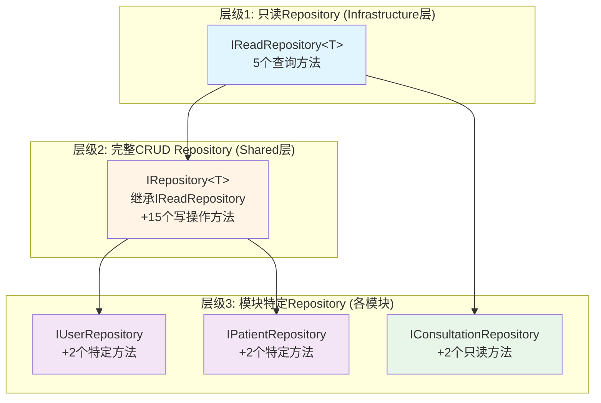
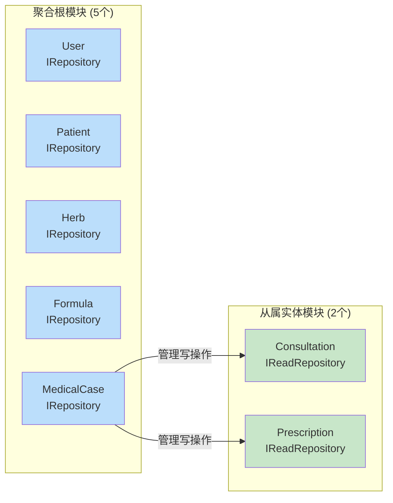
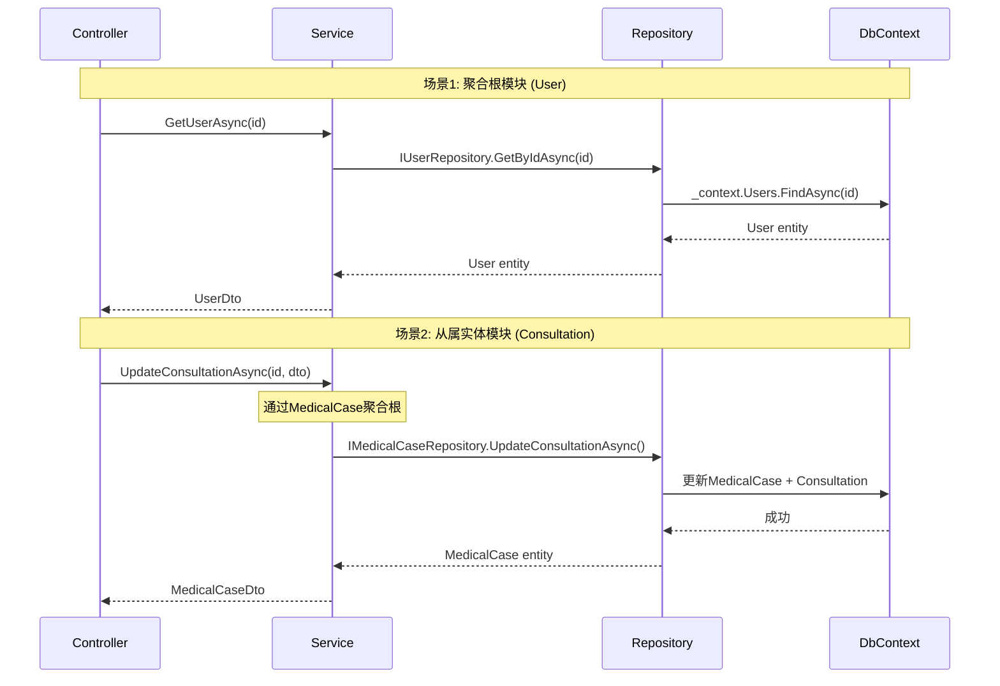

# Repository泛型接口统一重构 - 技术设计

**版本**: v1.0
**创建日期**: 2025-11-11
**状态**: 🎨 技术设计
**相关Epic**: [#2016 - Repository泛型接口统一重构](https://github.com/shouqitao/LYBTZYZS/issues/2016)
**需求文档**: [repository-generic-interface-refactoring-discussion.md](./repository-generic-interface-refactoring-discussion.md)
**相关ADR**: [ADR-007: Repository简化](../decisions/ADR-007-repository-service-simplification.md)

---

## 📐 1. 架构设计

### 1.1 三层接口架构总览



### 1.2 模块分类架构



### 1.3 数据访问流程



---

## 🔧 2. 接口设计

### 2.1 IReadRepository&lt;T&gt; 接口定义

**位置**: `src/Server/Core/LYBT.Infrastructure/Interfaces/IReadRepository.cs`

```csharp
using System.Linq.Expressions;

namespace LYBT.Infrastructure.Interfaces;

/// <summary>
/// 只读Repository泛型接口 - 用于从属实体模块
/// 提供5个核心查询方法，不包含写操作
/// </summary>
/// <typeparam name="T">实体类型，必须是引用类型</typeparam>
/// <remarks>
/// 适用场景：
/// - 从属实体模块（Consultation, Prescription）
/// - 写操作通过聚合根（MedicalCase）完成
/// - 符合DDD聚合根边界原则（AR-001）
/// </remarks>
public interface IReadRepository<T> where T : class
{
    /// <summary>
    /// 根据ID获取实体
    /// </summary>
    /// <param name="id">实体唯一标识符</param>
    /// <returns>找到的实体，不存在则返回null</returns>
    /// <example>
    /// <code>
    /// var consultation = await _repository.GetByIdAsync(consultationId);
    /// if (consultation == null)
    ///     throw new NotFoundException("辨证记录不存在");
    /// </code>
    /// </example>
    Task<T?> GetByIdAsync(Guid id);

    /// <summary>
    /// 获取所有实体
    /// </summary>
    /// <returns>所有实体的集合</returns>
    /// <remarks>
    /// ⚠️ 注意：对于大数据集，建议使用 GetPagedAsync 分页查询
    /// </remarks>
    Task<IEnumerable<T>> GetAllAsync();

    /// <summary>
    /// 根据条件查询实体
    /// </summary>
    /// <param name="predicate">查询条件表达式</param>
    /// <returns>符合条件的实体集合</returns>
    /// <example>
    /// <code>
    /// // 查询某个病案的所有辨证记录
    /// var consultations = await _repository.FindAsync(
    ///     c => c.MedicalCaseId == medicalCaseId);
    /// </code>
    /// </example>
    Task<IEnumerable<T>> FindAsync(Expression<Func<T, bool>> predicate);

    /// <summary>
    /// 根据条件获取单个实体
    /// </summary>
    /// <param name="predicate">查询条件表达式</param>
    /// <returns>符合条件的实体，不存在则返回null</returns>
    /// <exception cref="InvalidOperationException">找到多个匹配实体时抛出</exception>
    /// <example>
    /// <code>
    /// var consultation = await _repository.GetSingleAsync(
    ///     c => c.Id == id);
    /// </code>
    /// </example>
    Task<T?> GetSingleAsync(Expression<Func<T, bool>> predicate);

    /// <summary>
    /// 统计实体总数量
    /// </summary>
    /// <returns>实体总数</returns>
    Task<long> CountAsync();
}
```

### 2.2 IRepository&lt;T&gt; 接口定义

**位置**: `src/Shared/LYBT.Shared.Models/Interfaces/IRepository.cs` (原 `IBaseRepository.cs`)

```csharp
using System.Linq.Expressions;
using LYBT.Infrastructure.Interfaces;
using LYBT.Shared.Models.Common;

namespace LYBT.Shared.Models.Interfaces;

/// <summary>
/// 完整CRUD Repository泛型接口 - 用于聚合根模块
/// 继承 IReadRepository&lt;T&gt; 获得5个查询方法
/// 扩展15个写操作和高级查询方法（共20个方法）
/// </summary>
/// <typeparam name="T">聚合根实体类型</typeparam>
/// <remarks>
/// 适用场景：
/// - 聚合根实体（User, Patient, Herb, Formula, MedicalCase）
/// - 完整生命周期管理（CRUD）
/// - 支持批量操作和高级分页
/// </remarks>
public interface IRepository<T> : IReadRepository<T> where T : class
{
    #region 基础分页

    /// <summary>
    /// 基础分页查询（支持关键字搜索）
    /// </summary>
    /// <param name="pageNumber">页码（从1开始）</param>
    /// <param name="pageSize">每页记录数</param>
    /// <param name="keyword">可选的搜索关键字</param>
    /// <returns>分页结果</returns>
    /// <example>
    /// <code>
    /// var pagedUsers = await _userRepository.GetPagedAsync(1, 20, "张三");
    /// </code>
    /// </example>
    Task<PagedResult<T>> GetPagedAsync(int pageNumber, int pageSize, string? keyword = null);

    #endregion

    #region 高级分页

    /// <summary>
    /// 高级分页查询（支持条件过滤、排序）
    /// </summary>
    /// <param name="predicate">可选的过滤条件</param>
    /// <param name="pageNumber">页码（从1开始）</param>
    /// <param name="pageSize">每页记录数</param>
    /// <param name="orderBy">可选的排序字段</param>
    /// <param name="ascending">是否升序（默认true）</param>
    /// <returns>分页结果</returns>
    /// <example>
    /// <code>
    /// // 查询活跃患者，按创建时间降序
    /// var pagedPatients = await _patientRepository.GetPagedAsync(
    ///     predicate: p => p.IsActive,
    ///     pageNumber: 1,
    ///     pageSize: 20,
    ///     orderBy: p => p.CreatedAt,
    ///     ascending: false);
    /// </code>
    /// </example>
    Task<PagedResult<T>> GetPagedAsync(
        Expression<Func<T, bool>>? predicate,
        int pageNumber,
        int pageSize,
        Expression<Func<T, object>>? orderBy = null,
        bool ascending = true);

    #endregion

    #region 条件查询扩展

    /// <summary>
    /// 根据ID检查实体是否存在
    /// </summary>
    /// <param name="id">实体ID</param>
    /// <returns>存在返回true，否则返回false</returns>
    Task<bool> ExistsAsync(Guid id);

    /// <summary>
    /// 根据条件检查实体是否存在
    /// </summary>
    /// <param name="predicate">查询条件</param>
    /// <returns>存在返回true，否则返回false</returns>
    /// <example>
    /// <code>
    /// var exists = await _userRepository.ExistsAsync(
    ///     u => u.Username == "admin");
    /// </code>
    /// </example>
    Task<bool> ExistsAsync(Expression<Func<T, bool>> predicate);

    /// <summary>
    /// 根据条件统计实体数量
    /// </summary>
    /// <param name="predicate">统计条件</param>
    /// <returns>符合条件的实体数量</returns>
    Task<long> CountAsync(Expression<Func<T, bool>> predicate);

    #endregion

    #region 写操作

    /// <summary>
    /// 添加单个实体
    /// </summary>
    /// <param name="entity">待添加的实体</param>
    /// <returns>添加后的实体（包含生成的ID）</returns>
    /// <example>
    /// <code>
    /// var newUser = new User { Username = "test", ... };
    /// var addedUser = await _userRepository.AddAsync(newUser);
    /// await _userRepository.SaveChangesAsync();
    /// </code>
    /// </example>
    Task<T> AddAsync(T entity);

    /// <summary>
    /// 更新实体
    /// </summary>
    /// <param name="entity">待更新的实体</param>
    /// <returns>更新后的实体</returns>
    /// <remarks>
    /// 注意：调用后需执行 SaveChangesAsync() 持久化更改
    /// </remarks>
    Task<T> UpdateAsync(T entity);

    /// <summary>
    /// 根据ID删除实体
    /// </summary>
    /// <param name="id">实体ID</param>
    /// <returns>删除成功返回true，实体不存在返回false</returns>
    Task<bool> DeleteAsync(Guid id);

    #endregion

    #region 批量操作

    /// <summary>
    /// 批量添加实体
    /// </summary>
    /// <param name="entities">待添加的实体集合</param>
    /// <returns>添加后的实体集合</returns>
    /// <remarks>
    /// 性能优化：使用 EF Core 批量插入API
    /// 性能提升：约5-10倍（相比循环单条插入）
    /// </remarks>
    /// <example>
    /// <code>
    /// var herbs = new List&lt;Herb&gt; { herb1, herb2, herb3, ... };
    /// await _herbRepository.AddRangeAsync(herbs);
    /// await _herbRepository.SaveChangesAsync();
    /// </code>
    /// </example>
    Task<IEnumerable<T>> AddRangeAsync(IEnumerable<T> entities);

    /// <summary>
    /// 批量删除实体（通过实体对象）
    /// </summary>
    /// <param name="entities">待删除的实体集合</param>
    /// <returns>删除的实体数量</returns>
    Task<int> DeleteRangeAsync(IEnumerable<T> entities);

    /// <summary>
    /// 批量删除实体（通过ID集合）
    /// </summary>
    /// <param name="ids">待删除的实体ID集合</param>
    /// <returns>删除的实体数量</returns>
    /// <example>
    /// <code>
    /// var idsToDelete = new[] { id1, id2, id3 };
    /// int deletedCount = await _repository.DeleteRangeAsync(idsToDelete);
    /// </code>
    /// </example>
    Task<int> DeleteRangeAsync(IEnumerable<Guid> ids);

    #endregion

    #region 事务

    /// <summary>
    /// 保存所有更改到数据库
    /// </summary>
    /// <returns>受影响的行数</returns>
    /// <remarks>
    /// EF Core会自动在单次SaveChanges中使用事务
    /// </remarks>
    Task<int> SaveChangesAsync();

    #endregion
}
```

### 2.3 模块特定接口设计

#### 2.3.1 聚合根模块接口示例

**IUserRepository** (Users模块)

```csharp
namespace LYBT.Module.Users.Repositories.Interfaces;

/// <summary>
/// 用户Repository接口
/// </summary>
public interface IUserRepository : IRepository<User>
{
    /// <summary>
    /// 根据用户名获取用户
    /// </summary>
    Task<User?> GetByUsernameAsync(string username);

    /// <summary>
    /// 检查用户名是否已存在
    /// </summary>
    Task<bool> IsUsernameExistsAsync(string username);
}
```

**IPatientRepository** (Patients模块)

```csharp
namespace LYBT.Module.Patients.Repositories.Interfaces;

/// <summary>
/// 患者Repository接口
/// </summary>
public interface IPatientRepository : IRepository<Patient>
{
    /// <summary>
    /// 搜索患者（支持分页）
    /// </summary>
    Task<PaginatedList<Patient>> SearchPatientsAsync(
        string? searchTerm, int pageIndex, int pageSize);

    /// <summary>
    /// 根据手机号获取患者
    /// </summary>
    Task<Patient?> GetByPhoneNumberAsync(string phoneNumber);
}
```

#### 2.3.2 从属实体模块接口示例

**IConsultationRepository** (Consultation模块)

```csharp
namespace LYBT.Module.Consultation.Repositories.Interfaces;

/// <summary>
/// 辨证记录Repository接口（只读）
/// 写操作通过 IMedicalCaseRepository 的聚合方法完成
/// </summary>
public interface IConsultationRepository : IReadRepository<ConsultationEntity>
{
    /// <summary>
    /// 根据病案ID获取所有辨证记录
    /// </summary>
    Task<List<ConsultationEntity>> GetByMedicalCaseIdAsync(Guid medicalCaseId);

    /// <summary>
    /// 根据ID获取辨证记录（包含导航属性）
    /// </summary>
    Task<ConsultationEntity?> GetByIdWithDetailsAsync(Guid id);
}
```

**IPrescriptionRepository** (Prescription模块)

```csharp
namespace LYBT.Module.Prescriptions.Repositories.Interfaces;

/// <summary>
/// 处方Repository接口（只读）
/// 写操作通过 IMedicalCaseRepository 的聚合方法完成
/// </summary>
public interface IPrescriptionRepository : IReadRepository<PrescriptionEntity>
{
    /// <summary>
    /// 根据病案ID获取所有处方记录
    /// </summary>
    Task<List<PrescriptionEntity>> GetByMedicalCaseIdAsync(Guid medicalCaseId);

    /// <summary>
    /// 分页获取处方记录（包含详情）
    /// </summary>
    Task<PagedResult<PrescriptionEntity>> GetPagedWithDetailsAsync(
        int pageNumber, int pageSize);
}
```

---

## 🛠️ 3. 实现类设计

### 3.1 BaseReadRepository&lt;T&gt; 实现

**位置**: `src/Server/Core/LYBT.Infrastructure/Persistence/BaseReadRepository.cs`

```csharp
using Microsoft.EntityFrameworkCore;
using System.Linq.Expressions;
using LYBT.Infrastructure.Data;
using LYBT.Infrastructure.Interfaces;

namespace LYBT.Infrastructure.Persistence;

/// <summary>
/// 只读Repository基类实现
/// 提供 IReadRepository&lt;T&gt; 的默认实现
/// </summary>
/// <typeparam name="T">实体类型</typeparam>
public class BaseReadRepository<T> : IReadRepository<T> where T : class
{
    protected readonly ApplicationDbContext _context;
    protected readonly DbSet<T> _dbSet;

    public BaseReadRepository(ApplicationDbContext context)
    {
        _context = context ?? throw new ArgumentNullException(nameof(context));
        _dbSet = _context.Set<T>();
    }

    public virtual async Task<T?> GetByIdAsync(Guid id)
    {
        return await _dbSet.FindAsync(id);
    }

    public virtual async Task<IEnumerable<T>> GetAllAsync()
    {
        return await _dbSet.ToListAsync();
    }

    public virtual async Task<IEnumerable<T>> FindAsync(Expression<Func<T, bool>> predicate)
    {
        return await _dbSet.Where(predicate).ToListAsync();
    }

    public virtual async Task<T?> GetSingleAsync(Expression<Func<T, bool>> predicate)
    {
        return await _dbSet.SingleOrDefaultAsync(predicate);
    }

    public virtual async Task<long> CountAsync()
    {
        return await _dbSet.LongCountAsync();
    }
}
```

### 3.2 BaseRepository&lt;T&gt; 实现

**位置**: `src/Server/Core/LYBT.Infrastructure/Persistence/BaseRepository.cs`

```csharp
using Microsoft.EntityFrameworkCore;
using System.Linq.Expressions;
using LYBT.Infrastructure.Data;
using LYBT.Shared.Models.Interfaces;
using LYBT.Shared.Models.Common;

namespace LYBT.Infrastructure.Persistence;

/// <summary>
/// 完整CRUD Repository基类实现
/// 提供 IRepository&lt;T&gt; 的默认实现
/// </summary>
/// <typeparam name="T">聚合根实体类型</typeparam>
public class BaseRepository<T> : BaseReadRepository<T>, IRepository<T> where T : class
{
    public BaseRepository(ApplicationDbContext context) : base(context)
    {
    }

    #region 基础分页

    public virtual async Task<PagedResult<T>> GetPagedAsync(
        int pageNumber, int pageSize, string? keyword = null)
    {
        var query = _dbSet.AsQueryable();

        // 如果子类重写了 ApplyKeywordFilter，应用关键字过滤
        if (!string.IsNullOrWhiteSpace(keyword))
        {
            query = ApplyKeywordFilter(query, keyword);
        }

        var totalCount = await query.CountAsync();
        var items = await query
            .Skip((pageNumber - 1) * pageSize)
            .Take(pageSize)
            .ToListAsync();

        return new PagedResult<T>(items, totalCount, pageNumber, pageSize);
    }

    /// <summary>
    /// 应用关键字过滤（子类可重写）
    /// </summary>
    protected virtual IQueryable<T> ApplyKeywordFilter(IQueryable<T> query, string keyword)
    {
        // 默认实现：不过滤
        // 子类应根据实体特性重写此方法
        return query;
    }

    #endregion

    #region 高级分页

    public virtual async Task<PagedResult<T>> GetPagedAsync(
        Expression<Func<T, bool>>? predicate,
        int pageNumber,
        int pageSize,
        Expression<Func<T, object>>? orderBy = null,
        bool ascending = true)
    {
        var query = _dbSet.AsQueryable();

        // 应用过滤条件
        if (predicate != null)
        {
            query = query.Where(predicate);
        }

        // 应用排序
        if (orderBy != null)
        {
            query = ascending
                ? query.OrderBy(orderBy)
                : query.OrderByDescending(orderBy);
        }

        var totalCount = await query.CountAsync();
        var items = await query
            .Skip((pageNumber - 1) * pageSize)
            .Take(pageSize)
            .ToListAsync();

        return new PagedResult<T>(items, totalCount, pageNumber, pageSize);
    }

    #endregion

    #region 条件查询扩展

    public virtual async Task<bool> ExistsAsync(Guid id)
    {
        return await _dbSet.FindAsync(id) != null;
    }

    public virtual async Task<bool> ExistsAsync(Expression<Func<T, bool>> predicate)
    {
        return await _dbSet.AnyAsync(predicate);
    }

    public virtual async Task<long> CountAsync(Expression<Func<T, bool>> predicate)
    {
        return await _dbSet.LongCountAsync(predicate);
    }

    #endregion

    #region 写操作

    public virtual async Task<T> AddAsync(T entity)
    {
        await _dbSet.AddAsync(entity);
        return entity;
    }

    public virtual Task<T> UpdateAsync(T entity)
    {
        _dbSet.Update(entity);
        return Task.FromResult(entity);
    }

    public virtual async Task<bool> DeleteAsync(Guid id)
    {
        var entity = await _dbSet.FindAsync(id);
        if (entity == null)
            return false;

        _dbSet.Remove(entity);
        return true;
    }

    #endregion

    #region 批量操作

    public virtual async Task<IEnumerable<T>> AddRangeAsync(IEnumerable<T> entities)
    {
        var entityList = entities.ToList();
        await _dbSet.AddRangeAsync(entityList);
        return entityList;
    }

    public virtual Task<int> DeleteRangeAsync(IEnumerable<T> entities)
    {
        _dbSet.RemoveRange(entities);
        return Task.FromResult(entities.Count());
    }

    public virtual async Task<int> DeleteRangeAsync(IEnumerable<Guid> ids)
    {
        var idList = ids.ToList();
        var entities = await _dbSet
            .Where(e => idList.Contains(EF.Property<Guid>(e, "Id")))
            .ToListAsync();

        _dbSet.RemoveRange(entities);
        return entities.Count;
    }

    #endregion

    #region 事务

    public virtual async Task<int> SaveChangesAsync()
    {
        return await _context.SaveChangesAsync();
    }

    #endregion
}
```

### 3.3 模块Repository实现示例

**UserRepository** (继承 BaseRepository&lt;User&gt;)

```csharp
namespace LYBT.Module.Users.Repositories;

public class UserRepository : BaseRepository<User>, IUserRepository
{
    public UserRepository(ApplicationDbContext context) : base(context)
    {
    }

    // 实现特定方法
    public async Task<User?> GetByUsernameAsync(string username)
    {
        return await _dbSet
            .FirstOrDefaultAsync(u => u.Username == username);
    }

    public async Task<bool> IsUsernameExistsAsync(string username)
    {
        return await _dbSet
            .AnyAsync(u => u.Username == username);
    }

    // 重写关键字过滤逻辑
    protected override IQueryable<User> ApplyKeywordFilter(
        IQueryable<User> query, string keyword)
    {
        return query.Where(u =>
            u.Username.Contains(keyword) ||
            u.RealName.Contains(keyword));
    }
}
```

**ConsultationRepository** (继承 BaseReadRepository&lt;ConsultationEntity&gt;)

```csharp
namespace LYBT.Module.Consultation.Repositories;

public class ConsultationRepository
    : BaseReadRepository<ConsultationEntity>, IConsultationRepository
{
    public ConsultationRepository(ApplicationDbContext context) : base(context)
    {
    }

    public async Task<List<ConsultationEntity>> GetByMedicalCaseIdAsync(
        Guid medicalCaseId)
    {
        return await _dbSet
            .Where(c => c.MedicalCaseId == medicalCaseId)
            .OrderByDescending(c => c.CreatedAt)
            .ToListAsync();
    }

    public async Task<ConsultationEntity?> GetByIdWithDetailsAsync(Guid id)
    {
        return await _dbSet
            .Include(c => c.MedicalCase)
            .FirstOrDefaultAsync(c => c.Id == id);
    }
}
```

---

## 📦 4. 模块迁移设计

### 4.1 模块迁移矩阵

| 模块 | 当前接口 | 目标接口 | 基类变更 | 影响的Service | 优先级 |
|------|---------|---------|---------|--------------|-------|
| **Users** | IBaseRepository | IRepository | 无变更 | UserService | P0 |
| **Patients** | IBaseRepository | IRepository | 无变更 | PatientService | P0 |
| **Herbs** | IBaseRepository | IRepository | 无变更 | HerbService | P0 |
| **Formula** | IRepository (Legacy) | IRepository (Shared) | 需变更 | FormulaService | P0 |
| **MedicalCase** | IRepository (Legacy) | IRepository (Shared) | 需变更 | MedicalCaseService | P0 |
| **Consultation** | 无泛型接口 | IReadRepository | 新增基类 | ConsultationService | P0 |
| **Prescription** | 无泛型接口 | IReadRepository | 新增基类 | PrescriptionService | P0 |

### 4.2 接口重命名映射

```csharp
// 旧接口 → 新接口映射

// Shared层
IBaseRepository<T>              → IRepository<T>

// Infrastructure层（临时保留，标记过时）
IRepository<T>                  → IRepositoryLegacy<T> [Obsolete]

// 新增接口
-                               → IReadRepository<T>
```

### 4.3 模块迁移检查清单

#### Users模块迁移清单
- [ ] 更新接口引用：`IBaseRepository<User>` → `IRepository<User>`
- [ ] 验证编译通过
- [ ] 验证UserService调用无变更
- [ ] 执行单元测试
- [ ] 运行时验证：登录、获取用户信息

#### Consultation模块迁移清单
- [ ] 创建 `IConsultationRepository : IReadRepository<ConsultationEntity>`
- [ ] 创建 `ConsultationRepository : BaseReadRepository<ConsultationEntity>`
- [ ] 移除现有的写操作方法（Create/Update/Delete）
- [ ] 保留特定查询方法：`GetByMedicalCaseIdAsync`, `GetByIdWithDetailsAsync`
- [ ] 更新依赖注入配置
- [ ] 验证 MedicalCaseService 的聚合方法（UpdateConsultationAsync）
- [ ] 执行单元测试
- [ ] 运行时验证：三步看诊流程（辨证 → 标记 → 开处方）

---

## 🚀 5. Phase拆分与实施计划

### Phase 1: 创建基础接口和实现类（2天）

**目标**: 建立IReadRepository<T>和BaseReadRepository<T>基础设施

**任务清单**:
1. 创建 `IReadRepository<T>` 接口（Infrastructure层）
   - 定义5个查询方法
   - 添加完整XML注释和使用示例
2. 创建 `BaseReadRepository<T>` 实现类
   - 实现5个查询方法
   - 注入 ApplicationDbContext
3. 更新依赖注入配置
4. 编写单元测试（覆盖率≥90%）
5. 验证编译通过

**验收标准**:
- ✅ 编译通过（0 errors, 0 warnings）
- ✅ 单元测试通过（15+ test cases）
- ✅ XML注释完整

**风险**: 无（纯新增代码，不影响现有功能）

---

### Phase 2: 重命名IBaseRepository为IRepository（1.5天）

**目标**: 统一接口命名，消除命名混淆

**任务清单**:
1. Shared层重命名：`IBaseRepository.cs` → `IRepository.cs`
2. Infrastructure层旧接口重命名：`IRepository.cs` → `IRepositoryLegacy.cs`
3. 标记旧接口为过时：
   ```csharp
   [Obsolete("请使用 LYBT.Shared.Models.Interfaces.IRepository<T>，此接口将在v1.1版本删除")]
   public interface IRepositoryLegacy<T> { ... }
   ```
4. 全局搜索替换引用（预计50+处）
5. 更新依赖注入配置
6. 验证编译通过

**验收标准**:
- ✅ 编译通过（0 errors）
- ✅ 所有引用已更新
- ✅ 旧接口标记 @Obsolete

**风险**: 中（可能遗漏部分引用）
**缓解**: 编译器会报错，逐个修复

---

### Phase 3: 迁移简单聚合根模块（2天）

**目标**: 迁移Users/Patients/Herbs到新IRepository<T>

**任务清单**:
1. **Users模块**:
   - 更新 `IUserRepository` 接口（继承新 `IRepository<User>`）
   - 移除重复方法（GetByIdAsync, GetAllAsync等）
   - 保留特定方法（GetByUsernameAsync, IsUsernameExistsAsync）
   - 更新单元测试

2. **Patients模块**:
   - 更新 `IPatientRepository` 接口
   - 移除重复方法
   - 保留特定方法（SearchPatientsAsync, GetByPhoneNumberAsync）
   - 更新单元测试

3. **Herbs模块**:
   - 更新 `IHerbRepository` 接口
   - 移除重复方法
   - 保留特定方法（GetByNameAsync, ExistsByNameAsync）
   - 更新单元测试

4. 运行时验证：
   - 启动 Client + Server
   - 测试用户登录
   - 测试患者查询和创建
   - 测试药材查询

**验收标准**:
- ✅ 3个模块编译通过
- ✅ 单元测试通过（45+ test cases）
- ✅ 运行时验证通过（完整业务流程）

**风险**: 低（模块简单，业务逻辑少）

---

### Phase 4: 迁移复杂聚合根模块（2.5天）

**目标**: 迁移Formula/MedicalCase到新IRepository<T>

**任务清单**:
1. **Formula模块**:
   - 更新 `IFormulaRepository` 接口（从Legacy迁移到Shared）
   - 移除重复方法
   - 保留特定方法（GetByCategoryAsync, SearchFormulasAsync）
   - 更新 `FormulaRepository` 实现类（继承BaseRepository<Formula>）
   - 更新单元测试

2. **MedicalCase模块**:
   - 更新 `IMedicalCaseRepository` 接口
   - 移除重复方法
   - 保留聚合方法：
     - `UpdateConsultationAsync` (BF-002 Step 1)
     - `SetPrescriptionFlagAsync` (BF-002 Step 2)
     - `CreatePrescriptionAsync` (BF-002 Step 3)
     - `CompleteAsync`
     - `GetByPatientIdAsync`
   - 更新实现类
   - 更新单元测试

3. 运行时验证：
   - 测试方剂查询和创建
   - 测试完整的三步看诊流程：
     1. 创建病案
     2. 辨证（UpdateConsultation）
     3. 标记处方需求
     4. 开处方（CreatePrescription）
     5. 验证数据一致性

**验收标准**:
- ✅ 2个模块编译通过
- ✅ 单元测试通过（60+ test cases）
- ✅ 运行时验证通过（三步看诊流程完整）
- ✅ 数据库验证（检查MedicalCase/Consultation/Prescription关联关系）

**风险**: 🔴 高（核心业务模块，逻辑复杂）
**缓解**:
- 完整回归测试
- 详细的运行时验证清单
- 数据库状态验证

---

### Phase 5: 迁移从属实体模块（2天）

**目标**: 迁移Consultation/Prescription到IReadRepository<T>

**任务清单**:
1. **Consultation模块**:
   - 创建 `IConsultationRepository : IReadRepository<ConsultationEntity>`
   - 创建 `ConsultationRepository : BaseReadRepository<ConsultationEntity>`
   - 保留特定查询方法：
     - `GetByMedicalCaseIdAsync`
     - `GetByIdWithDetailsAsync`
   - 移除所有写操作方法
   - 更新 ConsultationService（确认写操作通过MedicalCaseService）
   - 更新单元测试

2. **Prescription模块**:
   - 创建 `IPrescriptionRepository : IReadRepository<PrescriptionEntity>`
   - 创建 `PrescriptionRepository : BaseReadRepository<PrescriptionEntity>`
   - 保留特定查询方法：
     - `GetByMedicalCaseIdAsync`
     - `GetPagedWithDetailsAsync`
   - 移除所有写操作方法
   - 更新 PrescriptionService
   - 更新单元测试

3. 验证聚合根边界（AR-001）:
   - 确认Consultation/Prescription无法直接写入
   - 确认写操作必须通过MedicalCase

4. 运行时验证：
   - 测试查询辨证记录
   - 测试查询处方记录
   - 测试三步看诊流程中的写操作（通过MedicalCase）

**验收标准**:
- ✅ 2个模块编译通过
- ✅ 单元测试通过（30+ test cases）
- ✅ 聚合根边界验证通过（写操作强制通过MedicalCase）
- ✅ 运行时验证通过

**风险**: 中（需要确保聚合根边界不被破坏）

---

### Phase 6: 补全批量操作与文档更新（2天）

**目标**: 补全批量操作方法，更新文档和测试

**任务清单**:
1. 补全 `IRepository<T>` 批量操作方法：
   - `AddRangeAsync(IEnumerable<T> entities)`
   - `DeleteRangeAsync(IEnumerable<T> entities)`
   - `DeleteRangeAsync(IEnumerable<Guid> ids)`

2. 补全 `IRepository<T>` 高级分页方法：
   - `GetPagedAsync(predicate, pageNumber, pageSize, orderBy, ascending)`

3. 更新 `BaseRepository<T>` 实现

4. 批量操作性能测试：
   - 测试批量插入1000条药材记录（目标<5秒）
   - 测试批量删除性能

5. 更新文档：
   - 更新 `CLAUDE.md` 第2.4节（Repository架构规范）
   - 更新 `docs/explanation/architecture/patterns/repository-pattern.md`
   - 更新 `docs/explanation/architecture/server/README.md`
   - 创建迁移指南文档

6. 补全单元测试：
   - 批量操作测试（15+ test cases）
   - 高级分页测试（10+ test cases）
   - 确保总覆盖率≥90%

7. 清理工作：
   - 删除 `IRepositoryLegacy<T>`（如果v1.1版本）
   - 清理过时代码注释

**验收标准**:
- ✅ 所有新方法实现完成
- ✅ 性能测试通过（批量操作<5秒/1000条）
- ✅ 单元测试覆盖率≥90%
- ✅ 文档更新完整
- ✅ 迁移指南清晰

**风险**: 低（增强功能，不影响现有逻辑）

---

### Phase时间估算总览

| Phase | 任务 | 预计工作量 | 优先级 | 风险等级 |
|-------|------|-----------|-------|---------|
| Phase 1 | 创建基础接口和实现类 | 2天 | P0 | 🟢 低 |
| Phase 2 | 重命名IBaseRepository为IRepository | 1.5天 | P0 | 🟡 中 |
| Phase 3 | 迁移简单聚合根模块 | 2天 | P0 | 🟢 低 |
| Phase 4 | 迁移复杂聚合根模块 | 2.5天 | P0 | 🔴 高 |
| Phase 5 | 迁移从属实体模块 | 2天 | P0 | 🟡 中 |
| Phase 6 | 补全批量操作与文档更新 | 2天 | P1 | 🟢 低 |
| **总计** | | **12天** | | |

---

## 🧪 6. 质量标准

### 6.1 编译标准

```bash
# 编译命令
dotnet build LYBT.All.sln -c Release --no-restore

# 验收标准
✅ 0 errors
✅ ≤ 5 warnings (非关键)
✅ 编译时间 < 2分钟
```

### 6.2 测试标准

#### 单元测试覆盖率

```bash
# 运行所有单元测试
dotnet test LYBT.All.sln -c Release --settings tests/.runsettings

# 验收标准
✅ 通过率: 100%
✅ 覆盖率: ≥ 90%
✅ Repository测试: ≥ 120 test cases
  - IReadRepository<T>: 15+ test cases
  - IRepository<T>: 60+ test cases
  - 模块特定Repository: 45+ test cases
```

#### 测试用例类别

| 类别 | 测试场景 | 预计用例数 |
|------|---------|-----------|
| **基础查询** | GetByIdAsync, GetAllAsync, FindAsync, GetSingleAsync, CountAsync | 25 |
| **分页查询** | 基础分页、高级分页、排序、过滤 | 20 |
| **条件查询** | ExistsAsync, CountAsync(predicate) | 10 |
| **写操作** | AddAsync, UpdateAsync, DeleteAsync | 15 |
| **批量操作** | AddRangeAsync, DeleteRangeAsync | 20 |
| **事务** | SaveChangesAsync, 并发控制 | 10 |
| **模块特定** | 各模块特定方法 | 20 |
| **边界条件** | null值、空集合、重复ID | 15 |
| **性能** | 批量操作性能、分页性能 | 5 |
| **总计** | | **140+** |

### 6.3 性能标准

```bash
# 性能测试场景

# 场景1: 批量插入性能
测试数据: 1000条Herb记录
目标: < 5秒
实际: [待测试]

# 场景2: 分页查询性能
测试数据: 10000条Patient记录，每页20条
目标: < 500ms
实际: [待测试]

# 场景3: 复杂查询性能
测试数据: 带过滤、排序的分页查询
目标: < 1秒
实际: [待测试]
```

### 6.4 运行时验证清单

#### 启动验证
- [ ] Server端启动成功（无异常日志）
- [ ] Client端启动成功（无连接错误）
- [ ] 数据库连接正常

#### 功能验证
- [ ] 用户登录成功
- [ ] 查询患者列表（分页）
- [ ] 创建新患者
- [ ] 查询药材列表
- [ ] 创建新病案
- [ ] 辨证记录创建（通过MedicalCase聚合方法）
- [ ] 标记处方需求
- [ ] 创建处方（通过MedicalCase聚合方法）
- [ ] 查询辨证记录（只读Repository）
- [ ] 查询处方记录（只读Repository）

#### 数据库验证
- [ ] MedicalCase表数据完整
- [ ] Consultation表数据关联正确
- [ ] Prescription表数据关联正确
- [ ] 外键约束生效
- [ ] 索引正常

---

## 📊 7. 数据库影响分析

### 7.1 Schema变更

**结论**: ✅ **无需数据库Schema变更**

本次重构仅改变Repository接口和实现类，不涉及：
- 表结构变更
- 字段添加/删除
- 外键关系调整
- 索引变更

### 7.2 数据迁移

**结论**: ✅ **无需数据迁移**

现有数据保持不变，所有CRUD操作的SQL生成逻辑由EF Core保证一致性。

### 7.3 性能影响

| 操作类型 | 重构前 | 重构后 | 预期影响 |
|---------|-------|-------|---------|
| 单条查询 | N/A | 泛型方法 | 无影响（编译器内联） |
| 分页查询 | 手写实现 | 泛型实现 | 无影响 |
| 批量插入 | 循环单条 | AddRangeAsync | ⬆️ 5-10倍提升 |
| 批量删除 | 循环单条 | DeleteRangeAsync | ⬆️ 5-10倍提升 |

---

## 🔒 8. 安全与合规

### 8.1 MVP约束合规性

| 约束 | 状态 | 说明 |
|------|------|------|
| ❌ 禁止Repository工厂模式 | ✅ 合规 | 使用依赖注入，无工厂模式 |
| ❌ 禁止UnitOfWork模式 | ✅ 合规 | 使用EF Core DbContext（已是UoW） |
| ❌ 禁止动态查询构建器 | ✅ 合规 | 使用Expression<Func<T, bool>> |
| ✅ 允许泛型接口 | ✅ 合规 | 符合DRY原则 |
| ✅ 允许EF Core 8.0 | ✅ 合规 | 项目标准ORM |

### 8.2 业务规则合规性

| 规则编号 | 规则名称 | 合规性验证 |
|---------|---------|-----------|
| **AR-001** | MedicalCase聚合根约束 | ✅ Consultation/Prescription使用IReadRepository，写操作通过MedicalCase |
| **AR-003** | 一诊一方约束 | ✅ 数据库约束保持不变，Repository层不影响 |
| **BF-002** | 三步看诊流程规则 | ✅ 聚合方法保留（UpdateConsultationAsync, CreatePrescriptionAsync） |
| **BR-001** | 统一共性，保持特性 | ✅ 泛型接口提供共性，模块接口保留特性（3-5个方法） |
| **BR-002** | 避免过度抽象 | ✅ 接口继承最多3层 |
| **BR-003** | 每个聚合根一个Repository | ✅ 7个模块对应7个Repository接口 |
| **BR-004** | 从属实体使用只读Repository | ✅ Consultation/Prescription继承IReadRepository |
| **BR-005** | 特定方法命名规范 | ✅ GetByXxxAsync, SearchXxxAsync, ExistsByXxxAsync |

---

## 📝 9. 文档更新清单

### 9.1 架构文档

- [ ] **CLAUDE.md**（第2.4节）
  - 更新Repository架构规范
  - 新增三层接口架构说明
  - 更新模块分类表

- [ ] **docs/explanation/architecture/patterns/repository-pattern.md**
  - 新增IReadRepository<T>模式说明
  - 更新IRepository<T>接口定义
  - 新增从属实体Repository模式

- [ ] **docs/explanation/architecture/server/README.md**
  - 更新Infrastructure层说明
  - 新增BaseReadRepository<T>说明

- [ ] **docs/explanation/architecture/shared/README.md**
  - 更新IRepository<T>接口位置说明

### 9.2 迁移文档

- [ ] **创建迁移指南文档** (`docs/guides/repository-migration-guide.md`)
  - 从IBaseRepository迁移到IRepository
  - 从旧IRepository迁移到新IRepository
  - 创建只读Repository指南

### 9.3 API文档

- [ ] **XML注释覆盖**
  - IReadRepository<T>: 5个方法完整注释
  - IRepository<T>: 20个方法完整注释
  - 所有模块特定Repository接口完整注释

---

## 🎯 10. 验收标准总览

### 10.1 技术验收

| 验收项 | 标准 | 状态 |
|-------|------|------|
| **编译** | 0 errors, ≤5 warnings | ⏳ 待验证 |
| **单元测试** | 通过率100%, 覆盖率≥90% | ⏳ 待验证 |
| **集成测试** | 所有Repository方法通过 | ⏳ 待验证 |
| **性能测试** | 批量操作<5秒/1000条 | ⏳ 待验证 |
| **代码质量** | XML注释完整, 无code smell | ⏳ 待验证 |

### 10.2 业务验收

| 验收项 | 验证方式 | 状态 |
|-------|---------|------|
| **用户登录** | 运行时验证 | ⏳ 待验证 |
| **患者管理** | 创建/查询/更新患者 | ⏳ 待验证 |
| **病案管理** | 创建/查询病案 | ⏳ 待验证 |
| **三步看诊流程** | 辨证→标记→开处方 | ⏳ 待验证 |
| **聚合根边界** | Consultation/Prescription无法直接写入 | ⏳ 待验证 |
| **数据一致性** | 数据库外键和关联关系正确 | ⏳ 待验证 |

### 10.3 文档验收

| 验收项 | 标准 | 状态 |
|-------|------|------|
| **架构文档** | 更新CLAUDE.md, repository-pattern.md | ⏳ 待验证 |
| **API文档** | 所有接口方法有XML注释 | ⏳ 待验证 |
| **迁移指南** | 提供清晰的迁移步骤 | ⏳ 待验证 |
| **测试文档** | 测试用例覆盖所有场景 | ⏳ 待验证 |

---

## 📎 附录

### A. 相关文档索引

**项目文档**:
- [需求讨论文档](./repository-generic-interface-refactoring-discussion.md)
- [CLAUDE.md - 2.4节 Repository架构规范](../../../../CLAUDE.md#24-repository架构规范)
- [Repository模式文档](../patterns/repository-pattern.md)
- [ADR-007: Repository和Service层简化重构](../decisions/ADR-007-repository-service-simplification.md)
- [Server端架构指南](../server/README.md)

**技术文档**:
- [Microsoft Docs: Repository Pattern with EF Core](https://learn.microsoft.com/en-us/ef/core/testing/testing-without-the-database#repository-pattern)
- [Microsoft Docs: DDD Infrastructure Persistence Layer](https://learn.microsoft.com/en-us/dotnet/architecture/microservices/microservice-ddd-cqrs-patterns/infrastructure-persistence-layer-design)

**业务规则**:
- [三层架构规范](../server/README.md) - P0-2（依赖方向）、P0-3（聚合根边界）
- [MVP Constitution](.spec-workflow/steering/constitution.md) - 技术黑名单

**相关Issue**:
- [Epic #2016 - Repository泛型接口统一重构](https://github.com/shouqitao/LYBTZYZS/issues/2016)
- [Epic #1934 - 批量导入药材功能](https://github.com/shouqitao/LYBTZYZS/issues/1934)

### B. 代码规范速查

```csharp
// ✅ 正确：使用新接口
public interface IUserRepository : IRepository<User> { }

// ❌ 错误：使用旧接口
public interface IUserRepository : IBaseRepository<User> { }

// ✅ 正确：从属实体使用只读接口
public interface IConsultationRepository : IReadRepository<ConsultationEntity> { }

// ❌ 错误：从属实体使用完整CRUD接口
public interface IConsultationRepository : IRepository<ConsultationEntity> { }

// ✅ 正确：特定方法命名
Task<User?> GetByUsernameAsync(string username);

// ❌ 错误：不规范命名
Task<User?> FindByUsername(string username);
```

### C. 故障排查指南

**问题1: 编译错误 - IRepository命名冲突**

```
错误: The type 'IRepository<T>' exists in both
'LYBT.Shared.Models' and 'LYBT.Infrastructure'
```

**解决方案**: 显式指定命名空间
```csharp
using IRepository = LYBT.Shared.Models.Interfaces.IRepository<User>;
```

**问题2: 运行时错误 - 依赖注入找不到IReadRepository**

```
错误: Unable to resolve service for type
'LYBT.Infrastructure.Interfaces.IReadRepository<ConsultationEntity>'
```

**解决方案**: 检查Startup.cs中的依赖注入配置
```csharp
services.AddScoped<IConsultationRepository, ConsultationRepository>();
```

**问题3: 性能问题 - 批量操作慢**

```
现象: AddRangeAsync(1000条) 耗时 > 10秒
```

**排查步骤**:
1. 检查是否在循环中调用SaveChangesAsync
2. 检查是否触发了N+1查询
3. 检查数据库索引是否正常

---

**创建者**: Claude Code (lybtzyzs-design-generator)
**审核者**: 待确认
**最后更新**: 2025-11-11
**下一步**: 调用 lybtzyzs-design-arch-validator 进行架构合规性验证
