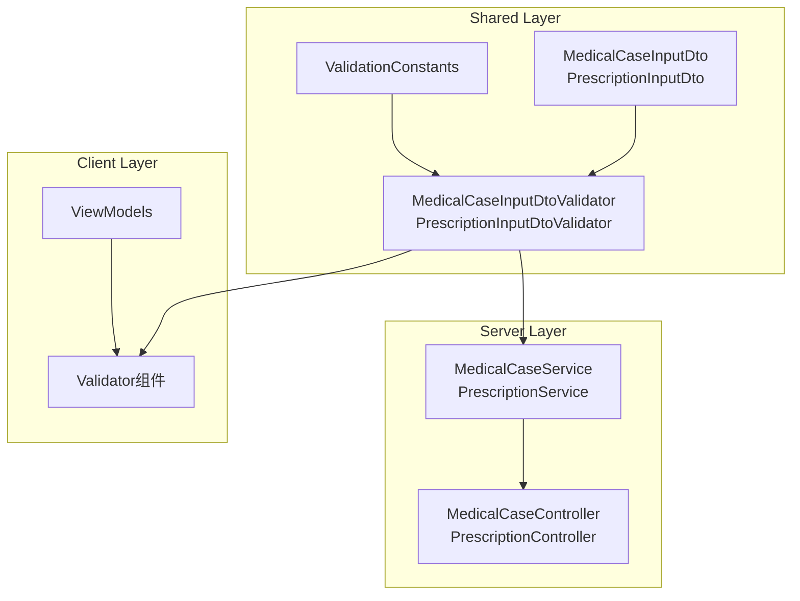

# FluentValidation统一设计技术设计文档

**文档类型**: Technical Design Document
**目标读者**: 开发人员、架构师
**前置阅读**: [FluentValidation统一设计需求分析](fluentvalidation-unified-design-requirements.md)
**完成日期**: 2025-11-09
**对应Issue**: #1960

---

## 1. 设计概述

### 1.1 设计目标

本设计文档提供FluentValidation验证器统一化的完整技术方案，将MedicalCase和Prescriptions模块从**分离验证器模式**迁移到**条件验证模式**，并建立验证常量统一管理机制。

**核心目标**：
- ✅ 减少验证器数量：从12个减少到10个（-16.7%）
- ✅ 减少代码重复：消除~500行重复验证规则
- ✅ 统一验证模式：所有模块遵循InputDto + 条件验证
- ✅ 提升可维护性：集中管理验证常量

### 1.2 设计原则

**MVP架构原则**：
- ✅ **够用即好**：只迁移存在问题的模块（MedicalCase、Prescriptions）
- ✅ **统一模式**：遵循Users模块的条件验证标准模式
- ✅ **渐进式演进**：分Phase实施，每次只改1个模块
- ✅ **零破坏性**：API向后兼容，前端无需修改

**分离职责原则**：
- ✅ **数据格式验证**：在Shared.Validators中（字符串长度、正则格式）
- ❌ **业务规则验证**：在Service层中（如"患者是否存在"）

---

## 2. 架构设计

### 2.1 目标架构

```
LYBT.Shared.Validators/
├── Auth/
│   ├── LoginRequestValidator.cs
│   ├── ChangePasswordRequestValidator.cs
│   └── SuperAdminLoginRequestValidator.cs
├── Users/
│   └── UserInputDtoValidator.cs ✅ 条件验证（参考标准）
├── Patients/
│   └── PatientInputDtoValidator.cs ✅ 条件验证
├── Consultation/
│   └── ConsultationInputDtoValidator.cs ✅ 统一验证
├── Formula/
│   ├── FormulaInputDtoValidator.cs ✅ 统一验证
│   └── FormulaHerbItemInputDtoValidator.cs（嵌套）
├── Herbs/
│   └── HerbInputDtoValidator.cs ✅ 统一验证
├── MedicalCase/
│   └── MedicalCaseInputDtoValidator.cs ⭐ 新增（替代2个）
├── Prescriptions/
│   ├── PrescriptionInputDtoValidator.cs ⭐ 新增（替代2个）
│   └── PrescriptionItemInputDtoValidator.cs（嵌套，保留）
└── Common/
    └── ValidationConstants.cs ⭐ 新增（验证常量）
```

**变更说明**：
- ❌ 删除：`MedicalCaseCreateDtoValidator`, `MedicalCaseUpdateDtoValidator`
- ❌ 删除：`PrescriptionCreateDtoValidator`, `PrescriptionEditDtoValidator`
- ✅ 新增：`MedicalCaseInputDtoValidator`, `PrescriptionInputDtoValidator`
- ✅ 新增：`ValidationConstants.cs`（验证常量集中管理）

### 2.2 组件关系图



### 2.3 数据流设计

#### 创建流程（Create）
```
User Input (Id=null)
  → ViewModel验证（FluentValidation）
  → Controller接收（MedicalCaseInputDto, Id=null）
  → ASP.NET Core Pipeline自动验证
  → Service.CreateAsync(input)
      → 验证Id必须为null
      → 业务规则验证（Service层）
      → Repository.AddAsync()
  → 返回MedicalCaseDto
```

#### 更新流程（Update）
```
User Input (Id=有值)
  → ViewModel验证（FluentValidation）
  → Controller接收（MedicalCaseInputDto, Id=有值）
  → ASP.NET Core Pipeline自动验证
  → Service.UpdateAsync(id, input)
      → 验证Id必须有值
      → 业务规则验证（Service层）
      → Repository.UpdateAsync()
  → 返回MedicalCaseDto
```

---

## 3. DTO设计

### 3.1 MedicalCaseInputDto设计

**文件位置**：`LYBT.Shared.Models/Contracts/MedicalCase/MedicalCaseInputDto.cs`

```csharp
using System;
using System.ComponentModel;

namespace LYBT.Shared.Models.Contracts.MedicalCase
{
    /// <summary>
    /// 病案输入DTO - 统一创建和更新
    /// Epic #1960: FluentValidation统一设计
    /// </summary>
    public class MedicalCaseInputDto
    {
        /// <summary>
        /// 病案ID（更新时必填，创建时为null）
        /// </summary>
        [DisplayName("病案ID")]
        public Guid? Id { get; set; }

        /// <summary>
        /// 患者ID
        /// </summary>
        [DisplayName("患者ID")]
        public Guid PatientId { get; set; }

        /// <summary>
        /// 医生ID
        /// </summary>
        [DisplayName("医生ID")]
        public Guid DoctorId { get; set; }

        /// <summary>
        /// 就诊日期
        /// </summary>
        [DisplayName("就诊日期")]
        public DateTime VisitDate { get; set; }

        /// <summary>
        /// 主诉
        /// </summary>
        [DisplayName("主诉")]
        public string? ChiefComplaint { get; set; }

        /// <summary>
        /// 现病史
        /// </summary>
        [DisplayName("现病史")]
        public string? PresentIllnessHistory { get; set; }

        /// <summary>
        /// 既往史
        /// </summary>
        [DisplayName("既往史")]
        public string? PastMedicalHistory { get; set; }

        /// <summary>
        /// 过敏史
        /// </summary>
        [DisplayName("过敏史")]
        public string? AllergyHistory { get; set; }

        /// <summary>
        /// 望诊
        /// </summary>
        [DisplayName("望诊")]
        public string? Inspection { get; set; }

        /// <summary>
        /// 闻诊
        /// </summary>
        [DisplayName("闻诊")]
        public string? Auscultation { get; set; }

        /// <summary>
        /// 问诊
        /// </summary>
        [DisplayName("问诊")]
        public string? Inquiry { get; set; }

        /// <summary>
        /// 切诊（脉象）
        /// </summary>
        [DisplayName("切诊")]
        public string? Palpation { get; set; }

        /// <summary>
        /// 中医诊断
        /// </summary>
        [DisplayName("中医诊断")]
        public string? TCMDiagnosis { get; set; }

        /// <summary>
        /// 西医诊断
        /// </summary>
        [DisplayName("西医诊断")]
        public string? WesternDiagnosis { get; set; }

        /// <summary>
        /// 治则治法
        /// </summary>
        [DisplayName("治则治法")]
        public string? TreatmentPrinciple { get; set; }

        /// <summary>
        /// 备注
        /// </summary>
        [DisplayName("备注")]
        public string? Remark { get; set; }
    }
}
```

### 3.2 PrescriptionInputDto设计

**文件位置**：`LYBT.Shared.Models/Contracts/Prescriptions/PrescriptionInputDto.cs`

```csharp
using System;
using System.Collections.Generic;
using System.ComponentModel;

namespace LYBT.Shared.Models.Contracts.Prescriptions
{
    /// <summary>
    /// 处方输入DTO - 统一创建和更新
    /// Epic #1960: FluentValidation统一设计
    /// </summary>
    public class PrescriptionInputDto
    {
        /// <summary>
        /// 处方ID（更新时必填，创建时为null）
        /// </summary>
        [DisplayName("处方ID")]
        public Guid? Id { get; set; }

        /// <summary>
        /// 病案ID
        /// </summary>
        [DisplayName("病案ID")]
        public Guid MedicalCaseId { get; set; }

        /// <summary>
        /// 处方日期
        /// </summary>
        [DisplayName("处方日期")]
        public DateTime PrescriptionDate { get; set; }

        /// <summary>
        /// 剂数
        /// </summary>
        [DisplayName("剂数")]
        public int DosageCount { get; set; }

        /// <summary>
        /// 用法
        /// </summary>
        [DisplayName("用法")]
        public string? Usage { get; set; }

        /// <summary>
        /// 注意事项
        /// </summary>
        [DisplayName("注意事项")]
        public string? Precautions { get; set; }

        /// <summary>
        /// 备注
        /// </summary>
        [DisplayName("备注")]
        public string? Remark { get; set; }

        /// <summary>
        /// 处方明细
        /// </summary>
        [DisplayName("处方明细")]
        public List<PrescriptionItemInputDto> Items { get; set; } = new();
    }
}
```

---

## 4. Validator设计

### 4.1 ValidationConstants设计

**文件位置**：`LYBT.Shared.Models/Constants/ValidationConstants.cs`

```csharp
namespace LYBT.Shared.Models.Constants
{
    /// <summary>
    /// 验证常量 - 集中管理
    /// Epic #1960: FluentValidation统一设计
    /// </summary>
    public static class ValidationConstants
    {
        // ========== 长度限制 ==========

        /// <summary>姓名最大长度</summary>
        public const int NameMaxLength = 100;

        /// <summary>短文本最大长度（如用法）</summary>
        public const int ShortTextMaxLength = 200;

        /// <summary>备注最大长度</summary>
        public const int RemarkMaxLength = 1000;

        /// <summary>长备注最大长度（如现病史）</summary>
        public const int LongRemarkMaxLength = 2000;

        /// <summary>地址最大长度</summary>
        public const int AddressMaxLength = 200;

        /// <summary>手机号最大长度</summary>
        public const int PhoneMaxLength = 20;

        /// <summary>身份证号长度</summary>
        public const int IdCardLength = 18;

        // ========== 数值范围 ==========

        /// <summary>年龄最小值</summary>
        public const int AgeMinValue = 0;

        /// <summary>年龄最大值</summary>
        public const int AgeMaxValue = 150;

        /// <summary>剂数最小值</summary>
        public const int DosageCountMinValue = 1;

        /// <summary>剂数最大值</summary>
        public const int DosageCountMaxValue = 100;

        /// <summary>药材剂量最小值（克）</summary>
        public const decimal HerbDosageMinValue = 0.1m;

        /// <summary>药材剂量最大值（克）</summary>
        public const decimal HerbDosageMaxValue = 1000m;

        // ========== 正则表达式 ==========

        /// <summary>身份证号正则表达式（18位）</summary>
        public const string IdCardRegex = @"^\d{17}[\dXx]$";

        /// <summary>手机号正则表达式（中国大陆）</summary>
        public const string PhoneRegex = @"^1[3-9]\d{9}$";

        /// <summary>邮箱正则表达式</summary>
        public const string EmailRegex = @"^[\w-\.]+@([\w-]+\.)+[\w-]{2,4}$";
    }
}
```

### 4.2 MedicalCaseInputDtoValidator设计

**文件位置**：`LYBT.Shared.Validators/MedicalCase/MedicalCaseInputDtoValidator.cs`

```csharp
using FluentValidation;
using LYBT.Shared.Models.Contracts.MedicalCase;
using LYBT.Shared.Models.Constants;

namespace LYBT.Shared.Validators.MedicalCase
{
    /// <summary>
    /// 病案输入DTO验证器
    /// Epic #1960: FluentValidation统一设计
    /// 参考标准：UserInputDtoValidator（条件验证模式）
    /// </summary>
    public class MedicalCaseInputDtoValidator : AbstractValidator<MedicalCaseInputDto>
    {
        public MedicalCaseInputDtoValidator()
        {
            // ========== 必填字段验证 ==========

            // 患者ID：始终必填
            RuleFor(x => x.PatientId)
                .NotEmpty().WithMessage("患者ID不能为空");

            // 医生ID：始终必填
            RuleFor(x => x.DoctorId)
                .NotEmpty().WithMessage("医生ID不能为空");

            // 就诊日期：始终必填
            RuleFor(x => x.VisitDate)
                .NotEmpty().WithMessage("就诊日期不能为空")
                .LessThanOrEqualTo(DateTime.Today).WithMessage("就诊日期不能晚于今天");

            // ========== 可选字段验证（有值时验证长度） ==========

            // 主诉：可选，有值时验证长度
            RuleFor(x => x.ChiefComplaint)
                .MaximumLength(ValidationConstants.RemarkMaxLength)
                .WithMessage($"主诉长度不能超过{ValidationConstants.RemarkMaxLength}个字符")
                .When(x => !string.IsNullOrEmpty(x.ChiefComplaint));

            // 现病史：可选，有值时验证长度
            RuleFor(x => x.PresentIllnessHistory)
                .MaximumLength(ValidationConstants.LongRemarkMaxLength)
                .WithMessage($"现病史长度不能超过{ValidationConstants.LongRemarkMaxLength}个字符")
                .When(x => !string.IsNullOrEmpty(x.PresentIllnessHistory));

            // 既往史：可选，有值时验证长度
            RuleFor(x => x.PastMedicalHistory)
                .MaximumLength(ValidationConstants.LongRemarkMaxLength)
                .WithMessage($"既往史长度不能超过{ValidationConstants.LongRemarkMaxLength}个字符")
                .When(x => !string.IsNullOrEmpty(x.PastMedicalHistory));

            // 过敏史：可选，有值时验证长度
            RuleFor(x => x.AllergyHistory)
                .MaximumLength(ValidationConstants.RemarkMaxLength)
                .WithMessage($"过敏史长度不能超过{ValidationConstants.RemarkMaxLength}个字符")
                .When(x => !string.IsNullOrEmpty(x.AllergyHistory));

            // 望诊：可选，有值时验证长度
            RuleFor(x => x.Inspection)
                .MaximumLength(ValidationConstants.RemarkMaxLength)
                .WithMessage($"望诊长度不能超过{ValidationConstants.RemarkMaxLength}个字符")
                .When(x => !string.IsNullOrEmpty(x.Inspection));

            // 闻诊：可选，有值时验证长度
            RuleFor(x => x.Auscultation)
                .MaximumLength(ValidationConstants.RemarkMaxLength)
                .WithMessage($"闻诊长度不能超过{ValidationConstants.RemarkMaxLength}个字符")
                .When(x => !string.IsNullOrEmpty(x.Auscultation));

            // 问诊：可选，有值时验证长度
            RuleFor(x => x.Inquiry)
                .MaximumLength(ValidationConstants.RemarkMaxLength)
                .WithMessage($"问诊长度不能超过{ValidationConstants.RemarkMaxLength}个字符")
                .When(x => !string.IsNullOrEmpty(x.Inquiry));

            // 切诊：可选，有值时验证长度
            RuleFor(x => x.Palpation)
                .MaximumLength(ValidationConstants.RemarkMaxLength)
                .WithMessage($"切诊长度不能超过{ValidationConstants.RemarkMaxLength}个字符")
                .When(x => !string.IsNullOrEmpty(x.Palpation));

            // 中医诊断：可选，有值时验证长度
            RuleFor(x => x.TCMDiagnosis)
                .MaximumLength(ValidationConstants.RemarkMaxLength)
                .WithMessage($"中医诊断长度不能超过{ValidationConstants.RemarkMaxLength}个字符")
                .When(x => !string.IsNullOrEmpty(x.TCMDiagnosis));

            // 西医诊断：可选，有值时验证长度
            RuleFor(x => x.WesternDiagnosis)
                .MaximumLength(ValidationConstants.RemarkMaxLength)
                .WithMessage($"西医诊断长度不能超过{ValidationConstants.RemarkMaxLength}个字符")
                .When(x => !string.IsNullOrEmpty(x.WesternDiagnosis));

            // 治则治法：可选，有值时验证长度
            RuleFor(x => x.TreatmentPrinciple)
                .MaximumLength(ValidationConstants.RemarkMaxLength)
                .WithMessage($"治则治法长度不能超过{ValidationConstants.RemarkMaxLength}个字符")
                .When(x => !string.IsNullOrEmpty(x.TreatmentPrinciple));

            // 备注：可选，有值时验证长度
            RuleFor(x => x.Remark)
                .MaximumLength(ValidationConstants.RemarkMaxLength)
                .WithMessage($"备注长度不能超过{ValidationConstants.RemarkMaxLength}个字符")
                .When(x => !string.IsNullOrEmpty(x.Remark));

            // ========== 创建/更新场景区分 ==========
            // 注意：当前MedicalCase的创建和更新验证规则完全相同，暂不需要条件验证
            // 如果未来需要，可添加：
            // RuleFor(x => x.SomeField)
            //     .NotEmpty()
            //     .When(x => x.Id == null || x.Id == Guid.Empty);
        }
    }
}
```

### 4.3 PrescriptionInputDtoValidator设计

**文件位置**：`LYBT.Shared.Validators/Prescriptions/PrescriptionInputDtoValidator.cs`

```csharp
using FluentValidation;
using LYBT.Shared.Models.Contracts.Prescriptions;
using LYBT.Shared.Models.Constants;

namespace LYBT.Shared.Validators.Prescriptions
{
    /// <summary>
    /// 处方输入DTO验证器
    /// Epic #1960: FluentValidation统一设计
    /// 包含嵌套集合验证（Items）
    /// </summary>
    public class PrescriptionInputDtoValidator : AbstractValidator<PrescriptionInputDto>
    {
        public PrescriptionInputDtoValidator()
        {
            // ========== 必填字段验证 ==========

            // 病案ID：始终必填
            RuleFor(x => x.MedicalCaseId)
                .NotEmpty().WithMessage("病案ID不能为空");

            // 处方日期：始终必填
            RuleFor(x => x.PrescriptionDate)
                .NotEmpty().WithMessage("处方日期不能为空")
                .LessThanOrEqualTo(DateTime.Today).WithMessage("处方日期不能晚于今天");

            // 剂数：始终必填，范围验证
            RuleFor(x => x.DosageCount)
                .InclusiveBetween(
                    ValidationConstants.DosageCountMinValue,
                    ValidationConstants.DosageCountMaxValue)
                .WithMessage($"剂数必须在{ValidationConstants.DosageCountMinValue}-{ValidationConstants.DosageCountMaxValue}之间");

            // ========== 可选字段验证 ==========

            // 用法：可选，有值时验证长度
            RuleFor(x => x.Usage)
                .MaximumLength(ValidationConstants.ShortTextMaxLength)
                .WithMessage($"用法长度不能超过{ValidationConstants.ShortTextMaxLength}个字符")
                .When(x => !string.IsNullOrEmpty(x.Usage));

            // 注意事项：可选，有值时验证长度
            RuleFor(x => x.Precautions)
                .MaximumLength(ValidationConstants.RemarkMaxLength)
                .WithMessage($"注意事项长度不能超过{ValidationConstants.RemarkMaxLength}个字符")
                .When(x => !string.IsNullOrEmpty(x.Precautions));

            // 备注：可选，有值时验证长度
            RuleFor(x => x.Remark)
                .MaximumLength(ValidationConstants.RemarkMaxLength)
                .WithMessage($"备注长度不能超过{ValidationConstants.RemarkMaxLength}个字符")
                .When(x => !string.IsNullOrEmpty(x.Remark));

            // ========== 嵌套集合验证 ==========

            // 处方明细：必须包含至少一项
            RuleFor(x => x.Items)
                .NotEmpty().WithMessage("处方明细不能为空")
                .Must(items => items != null && items.Any())
                .WithMessage("必须包含至少一项处方明细");

            // 处方明细集合中每个元素的验证
            RuleForEach(x => x.Items)
                .SetValidator(new PrescriptionItemInputDtoValidator())
                .When(x => x.Items != null);
        }
    }
}
```

### 4.4 PrescriptionItemInputDtoValidator设计（保留）

**文件位置**：`LYBT.Shared.Validators/Prescriptions/PrescriptionItemInputDtoValidator.cs`

```csharp
using FluentValidation;
using LYBT.Shared.Models.Contracts.Prescriptions;
using LYBT.Shared.Models.Constants;

namespace LYBT.Shared.Validators.Prescriptions
{
    /// <summary>
    /// 处方明细输入DTO验证器（嵌套验证器）
    /// Epic #1960: FluentValidation统一设计
    /// 注意：此验证器保留，用于嵌套集合验证
    /// </summary>
    public class PrescriptionItemInputDtoValidator : AbstractValidator<PrescriptionItemInputDto>
    {
        public PrescriptionItemInputDtoValidator()
        {
            // 药材ID：必填
            RuleFor(x => x.HerbId)
                .NotEmpty().WithMessage("药材ID不能为空");

            // 剂量：必填，范围验证
            RuleFor(x => x.Dosage)
                .InclusiveBetween(
                    ValidationConstants.HerbDosageMinValue,
                    ValidationConstants.HerbDosageMaxValue)
                .WithMessage($"剂量必须在{ValidationConstants.HerbDosageMinValue}-{ValidationConstants.HerbDosageMaxValue}克之间");

            // 单位：可选，有值时验证长度
            RuleFor(x => x.Unit)
                .MaximumLength(10).WithMessage("单位长度不能超过10个字符")
                .When(x => !string.IsNullOrEmpty(x.Unit));

            // 备注：可选，有值时验证长度
            RuleFor(x => x.Remark)
                .MaximumLength(ValidationConstants.ShortTextMaxLength)
                .WithMessage($"备注长度不能超过{ValidationConstants.ShortTextMaxLength}个字符")
                .When(x => !string.IsNullOrEmpty(x.Remark));
        }
    }
}
```

---

## 5. Service层调整

### 5.1 MedicalCaseService调整

**文件位置**：`LYBT.Module.MedicalCase/Services/MedicalCaseService.cs`

```csharp
// ========== CreateAsync方法调整 ==========

/// <summary>
/// 创建病案
/// Epic #1960: 使用MedicalCaseInputDto替代MedicalCaseCreateDto
/// </summary>
public async Task<ServiceResult<MedicalCaseDto>> CreateAsync(MedicalCaseInputDto input)
{
    try
    {
        // ⭐ Phase 1: 验证Id必须为null（创建时）
        if (input.Id.HasValue && input.Id.Value != Guid.Empty)
        {
            return ServiceResult<MedicalCaseDto>.Error("创建时不应提供ID");
        }

        // FluentValidation已在ASP.NET Core Pipeline中自动执行
        // 无需手动调用验证

        // 业务规则验证（Service层）
        var patientExists = await _patientRepository.ExistsAsync(input.PatientId);
        if (!patientExists)
        {
            return ServiceResult<MedicalCaseDto>.Error("患者不存在");
        }

        // 映射并创建实体
        var entity = _mapper.Map<MedicalCaseEntity>(input);
        entity.Id = Guid.NewGuid(); // Service层生成ID
        entity.CreatedAt = DateTime.UtcNow;

        var created = await _repository.AddAsync(entity);
        await _repository.SaveChangesAsync();

        var dto = _mapper.Map<MedicalCaseDto>(created);
        return ServiceResult<MedicalCaseDto>.Success(dto);
    }
    catch (Exception ex)
    {
        _logger.LogError(ex, "创建病案失败");
        return ServiceResult<MedicalCaseDto>.Error("创建病案失败");
    }
}

// ========== UpdateAsync方法调整 ==========

/// <summary>
/// 更新病案
/// Epic #1960: 使用MedicalCaseInputDto替代MedicalCaseUpdateDto
/// </summary>
public async Task<ServiceResult<MedicalCaseDto>> UpdateAsync(Guid id, MedicalCaseInputDto input)
{
    try
    {
        // ⭐ Phase 1: 验证实体存在
        var existing = await _repository.GetByIdAsync(id);
        if (existing == null)
        {
            return ServiceResult<MedicalCaseDto>.Error("病案不存在");
        }

        // FluentValidation已在ASP.NET Core Pipeline中自动执行
        // 无需手动调用验证

        // 映射更新（仅映射业务属性，Id和CreatedAt不变）
        _mapper.Map(input, existing);
        existing.UpdatedAt = DateTime.UtcNow;

        await _repository.UpdateAsync(existing);
        await _repository.SaveChangesAsync();

        var dto = _mapper.Map<MedicalCaseDto>(existing);
        return ServiceResult<MedicalCaseDto>.Success(dto);
    }
    catch (Exception ex)
    {
        _logger.LogError(ex, "更新病案失败，ID: {Id}", id);
        return ServiceResult<MedicalCaseDto>.Error("更新病案失败");
    }
}
```

### 5.2 PrescriptionService调整

**调整方式与MedicalCaseService类似**：
- `CreateAsync(PrescriptionInputDto input)` - 验证Id为null
- `UpdateAsync(Guid id, PrescriptionInputDto input)` - 验证实体存在

---

## 6. AutoMapper配置调整

### 6.1 MedicalCase模块AutoMapper配置

**文件位置**：`LYBT.Module.MedicalCase/Mapping/MedicalCaseMappingProfile.cs`

```csharp
using AutoMapper;
using LYBT.Entities;
using LYBT.Shared.Models.Contracts.MedicalCase;

namespace LYBT.Module.MedicalCase.Mapping
{
    public class MedicalCaseMappingProfile : Profile
    {
        public MedicalCaseMappingProfile()
        {
            // ⭐ Epic #1960: MedicalCaseInputDto → MedicalCaseEntity (创建)
            CreateMap<MedicalCaseInputDto, MedicalCaseEntity>()
                .ForMember(dest => dest.Id, opt => opt.Ignore()) // Service层生成
                .ForMember(dest => dest.CreatedAt, opt => opt.Ignore()) // Service层设置
                .ForMember(dest => dest.UpdatedAt, opt => opt.Ignore());

            // ⭐ Epic #1960: MedicalCaseInputDto → MedicalCaseEntity (更新)
            // 注意：更新时使用相同的映射配置，Id和CreatedAt会被Ignore
            // Service层调用：_mapper.Map(input, existingEntity)

            // MedicalCaseEntity → MedicalCaseDto (查询)
            CreateMap<MedicalCaseEntity, MedicalCaseDto>();

            // ❌ Epic #1960: 删除旧映射
            // CreateMap<MedicalCaseCreateDto, MedicalCaseEntity>()
            // CreateMap<MedicalCaseUpdateDto, MedicalCaseEntity>()
        }
    }
}
```

### 6.2 Prescriptions模块AutoMapper配置

**调整方式与MedicalCase类似**：
- 删除：`PrescriptionCreateDto → PrescriptionEntity`
- 删除：`PrescriptionEditDto → PrescriptionEntity`
- 新增：`PrescriptionInputDto → PrescriptionEntity`

---

## 7. Controller层调整

### 7.1 MedicalCaseController调整

**文件位置**：`LYBT.WebAPI/Controllers/MedicalCaseController.cs`

```csharp
// ========== CreateAsync调整 ==========

/// <summary>
/// 创建病案
/// Epic #1960: 使用MedicalCaseInputDto
/// </summary>
[HttpPost]
[ProducesResponseType(typeof(ApiResponse<MedicalCaseDto>), 201)]
[ProducesResponseType(typeof(ApiResponse), 400)]
public async Task<IActionResult> CreateAsync(
    [FromBody] MedicalCaseInputDto input) // ⭐ 使用InputDto
{
    var result = await _medicalCaseService.CreateAsync(input);

    if (result.IsSuccess)
    {
        return CreatedAtAction(
            nameof(GetByIdAsync),
            new { id = result.Data.Id },
            Success(result.Data, "创建病案成功"));
    }

    return HandleServiceResult(result);
}

// ========== UpdateAsync调整 ==========

/// <summary>
/// 更新病案
/// Epic #1960: 使用MedicalCaseInputDto
/// </summary>
[HttpPut("{id}")]
[ProducesResponseType(typeof(ApiResponse<MedicalCaseDto>), 200)]
[ProducesResponseType(typeof(ApiResponse), 400)]
[ProducesResponseType(typeof(ApiResponse), 404)]
public async Task<IActionResult> UpdateAsync(
    Guid id,
    [FromBody] MedicalCaseInputDto input) // ⭐ 使用InputDto
{
    var result = await _medicalCaseService.UpdateAsync(id, input);
    return HandleServiceResult(result);
}
```

**关键变更**：
- ✅ API签名保持RESTful风格（`POST /api/medicalcases`, `PUT /api/medicalcases/{id}`）
- ✅ 请求体从`MedicalCaseCreateDto`/`MedicalCaseUpdateDto`统一为`MedicalCaseInputDto`
- ✅ FluentValidation自动验证（ASP.NET Core Pipeline集成）

---

## 8. 测试设计

### 8.1 MedicalCaseInputDtoValidator单元测试

**文件位置**：`tests/UnitTests/Shared/LYBT.Shared.Validators.Tests/MedicalCase/MedicalCaseInputDtoValidatorTests.cs`

```csharp
using FluentAssertions;
using FluentValidation.TestHelper;
using LYBT.Shared.Models.Contracts.MedicalCase;
using LYBT.Shared.Validators.MedicalCase;
using Xunit;

namespace LYBT.Shared.Validators.Tests.MedicalCase
{
    public class MedicalCaseInputDtoValidatorTests
    {
        private readonly MedicalCaseInputDtoValidator _validator;

        public MedicalCaseInputDtoValidatorTests()
        {
            _validator = new MedicalCaseInputDtoValidator();
        }

        [Fact]
        public void Validate_ValidInput_ShouldPass()
        {
            // Arrange
            var input = new MedicalCaseInputDto
            {
                Id = null, // 创建场景
                PatientId = Guid.NewGuid(),
                DoctorId = Guid.NewGuid(),
                VisitDate = DateTime.Today
            };

            // Act
            var result = _validator.TestValidate(input);

            // Assert
            result.ShouldNotHaveAnyValidationErrors();
        }

        [Fact]
        public void Validate_PatientIdEmpty_ShouldFail()
        {
            // Arrange
            var input = new MedicalCaseInputDto
            {
                PatientId = Guid.Empty,
                DoctorId = Guid.NewGuid(),
                VisitDate = DateTime.Today
            };

            // Act
            var result = _validator.TestValidate(input);

            // Assert
            result.ShouldHaveValidationErrorFor(x => x.PatientId)
                .WithErrorMessage("患者ID不能为空");
        }

        [Fact]
        public void Validate_ChiefComplaintTooLong_ShouldFail()
        {
            // Arrange
            var input = new MedicalCaseInputDto
            {
                PatientId = Guid.NewGuid(),
                DoctorId = Guid.NewGuid(),
                VisitDate = DateTime.Today,
                ChiefComplaint = new string('A', 1001) // 超过1000字符
            };

            // Act
            var result = _validator.TestValidate(input);

            // Assert
            result.ShouldHaveValidationErrorFor(x => x.ChiefComplaint)
                .WithErrorMessage("主诉长度不能超过1000个字符");
        }

        [Theory]
        [InlineData("")]
        [InlineData(null)]
        public void Validate_ChiefComplaintEmpty_ShouldPass(string chiefComplaint)
        {
            // Arrange
            var input = new MedicalCaseInputDto
            {
                PatientId = Guid.NewGuid(),
                DoctorId = Guid.NewGuid(),
                VisitDate = DateTime.Today,
                ChiefComplaint = chiefComplaint
            };

            // Act
            var result = _validator.TestValidate(input);

            // Assert
            result.ShouldNotHaveValidationErrorFor(x => x.ChiefComplaint);
        }

        [Fact]
        public void Validate_VisitDateInFuture_ShouldFail()
        {
            // Arrange
            var input = new MedicalCaseInputDto
            {
                PatientId = Guid.NewGuid(),
                DoctorId = Guid.NewGuid(),
                VisitDate = DateTime.Today.AddDays(1) // 未来日期
            };

            // Act
            var result = _validator.TestValidate(input);

            // Assert
            result.ShouldHaveValidationErrorFor(x => x.VisitDate)
                .WithErrorMessage("就诊日期不能晚于今天");
        }
    }
}
```

### 8.2 PrescriptionInputDtoValidator单元测试

**测试覆盖**：
- ✅ 必填字段验证（MedicalCaseId, PrescriptionDate, DosageCount）
- ✅ 数值范围验证（DosageCount: 1-100）
- ✅ 字符串长度验证（Usage, Precautions, Remark）
- ✅ 嵌套集合验证（Items不能为空，至少一项）
- ✅ 嵌套对象验证（PrescriptionItemInputDto验证规则）

### 8.3 Service层集成测试

**测试场景**：
- ✅ 创建病案（Id=null）- 成功
- ✅ 创建病案（Id有值）- 失败（"创建时不应提供ID"）
- ✅ 更新病案（Id有值）- 成功
- ✅ 更新病案（不存在的Id）- 失败（"病案不存在"）

---

## 9. Phase实施计划

### Phase 1: MedicalCase模块重构（3-5天）

**任务清单**：
1. ✅ 创建`ValidationConstants.cs`（Common/）
2. ✅ 创建`MedicalCaseInputDto.cs`（Models/Contracts/MedicalCase/）
3. ✅ 创建`MedicalCaseInputDtoValidator.cs`（Validators/MedicalCase/）
4. ✅ 更新`MedicalCaseService.CreateAsync/UpdateAsync`
5. ✅ 更新`MedicalCaseController.CreateAsync/UpdateAsync`
6. ✅ 更新`MedicalCaseMappingProfile.cs`（AutoMapper配置）
7. ✅ 删除`MedicalCaseCreateDto.cs`和`MedicalCaseUpdateDto.cs`
8. ✅ 删除`MedicalCaseCreateDtoValidator.cs`和`MedicalCaseUpdateDtoValidator.cs`
9. ✅ 编写单元测试（`MedicalCaseInputDtoValidatorTests.cs`）
10. ✅ 编写集成测试（Service层）
11. ✅ 编译验证（0 errors, 0 warnings）
12. ✅ 功能测试（创建/更新病案）

**验收标准**：
- ✅ MedicalCase模块只有1个InputDto和1个验证器
- ✅ 创建和更新功能正常工作
- ✅ 所有测试通过（单元测试 + 集成测试）
- ✅ 编译无错误和警告

### Phase 2: Prescriptions模块重构（3-5天）

**任务清单**：
1. ✅ 创建`PrescriptionInputDto.cs`（Models/Contracts/Prescriptions/）
2. ✅ 创建`PrescriptionInputDtoValidator.cs`（Validators/Prescriptions/）
3. ✅ 保留`PrescriptionItemInputDtoValidator.cs`（嵌套验证器）
4. ✅ 更新`PrescriptionService.CreateAsync/UpdateAsync`
5. ✅ 更新`PrescriptionController.CreateAsync/UpdateAsync`
6. ✅ 更新`PrescriptionMappingProfile.cs`（AutoMapper配置）
7. ✅ 删除`PrescriptionCreateDto.cs`和`PrescriptionEditDto.cs`
8. ✅ 删除`PrescriptionCreateDtoValidator.cs`和`PrescriptionEditDtoValidator.cs`
9. ✅ 编写单元测试（`PrescriptionInputDtoValidatorTests.cs`）
10. ✅ 编写集成测试（Service层）
11. ✅ 编译验证（0 errors, 0 warnings）
12. ✅ 功能测试（创建/更新处方）

**验收标准**：
- ✅ Prescriptions模块只有1个InputDto和2个验证器（Input + Item）
- ✅ 创建和更新功能正常工作
- ✅ 嵌套集合验证正常
- ✅ 所有测试通过

### Phase 3: 验证常量统一管理（2-3天）

**任务清单**：
1. ✅ 补充`ValidationConstants.cs`中的常量定义
2. ✅ 更新所有验证器使用常量（12个验证器）
3. ✅ 编译验证（0 errors, 0 warnings）
4. ✅ 回归测试（所有验证器）

**验收标准**：
- ✅ 所有验证器使用`ValidationConstants`
- ✅ 无硬编码的魔法数字
- ✅ 所有测试通过

### Phase 4: 测试补充与文档更新（2-3天）

**任务清单**：
1. ✅ 补充单元测试（测试覆盖率 ≥ 80%）
2. ✅ 补充集成测试（Service层）
3. ✅ 更新`validation-patterns.md`文档
4. ✅ 更新`shared/README.md`架构文档
5. ✅ 创建迁移指南（如需要）

**验收标准**：
- ✅ 测试覆盖率 ≥ 80%
- ✅ 所有验证器有完整测试
- ✅ 文档完整更新

### Phase 5: 代码审查与优化（1-2天）

**任务清单**：
1. ✅ 代码审查（命名、规范、注释）
2. ✅ 性能测试（验证器性能）
3. ✅ 优化建议实施
4. ✅ 最终验收

**验收标准**：
- ✅ 代码审查通过
- ✅ 性能测试通过
- ✅ 所有验收标准满足

---

## 10. 风险控制

### 10.1 技术风险缓解

| 风险 | 缓解措施 |
|-----|---------|
| DTO变更导致编译错误 | 分Phase实施，每次只改1个模块，充分编译验证 |
| Service层逻辑调整复杂 | 提供详细代码示例，严格遵循设计文档 |
| AutoMapper配置遗漏 | 编写单元测试验证映射配置，集成测试验证端到端 |
| 现有功能受影响 | 完整的回归测试计划，功能测试覆盖所有场景 |

### 10.2 质量保证措施

**编译验证**：
- ✅ 每个Phase完成后立即编译
- ✅ 目标：0 errors, 0 warnings

**测试验证**：
- ✅ 单元测试覆盖率 ≥ 80%
- ✅ 集成测试覆盖所有Service方法
- ✅ 功能测试覆盖创建/更新场景

**代码审查**：
- ✅ 命名规范检查
- ✅ 注释完整性检查
- ✅ 架构合规性检查（自动调用lybtzyzs-design-arch-validator）

---

## 11. 验收标准

### 11.1 功能验收

- ✅ MedicalCase模块使用`MedicalCaseInputDto`和`MedicalCaseInputDtoValidator`
- ✅ Prescriptions模块使用`PrescriptionInputDto`和`PrescriptionInputDtoValidator`
- ✅ 所有验证器使用`ValidationConstants`
- ✅ 创建和更新功能正常工作
- ✅ 嵌套集合验证正常工作

### 11.2 质量验收

- ✅ 编译：0 errors, 0 warnings
- ✅ 测试覆盖率：≥ 80%
- ✅ 所有单元测试通过
- ✅ 所有集成测试通过
- ✅ 代码审查通过

### 11.3 文档验收

- ✅ `validation-patterns.md`更新（新增MedicalCase/Prescriptions示例）
- ✅ `shared/README.md`架构文档更新
- ✅ 本设计文档创建并审核通过

### 11.4 性能验收

- ✅ 验证器性能测试通过
- ✅ API响应时间无明显增加（±5%）

---

## 12. 相关文档

- **[FluentValidation统一设计需求分析](fluentvalidation-unified-design-requirements.md)** - 需求分析文档
- **[FluentValidation验证模式](validation-patterns.md)** - 条件验证详细说明
- **[共享架构指南](architecture/shared/README.md)** - Shared层架构
- **[Server端架构指南](architecture/server/README.md)** - Server层架构

---

## 13. 决策记录

| 决策项 | 决策结果 | 理由 | 日期 |
|-------|---------|------|------|
| 验证模式选择 | 条件验证模式（InputDto + .When()） | 减少代码重复，统一API设计 | 2025-11-09 |
| 验证器命名 | {ModuleName}InputDtoValidator | 统一命名规范，遵循Users模块标准 | 2025-11-09 |
| 嵌套验证器 | 保留（Prescriptions.Items） | 集合验证需要，符合FluentValidation最佳实践 | 2025-11-09 |
| 验证常量管理 | 集中管理（ValidationConstants） | 避免魔法数字，易维护 | 2025-11-09 |
| 实施策略 | 渐进式（5 Phases） | 降低风险，可控制，符合MVP原则 | 2025-11-09 |
| AutoMapper配置 | InputDto → Entity统一映射 | 创建和更新使用相同配置，Ignore Id和CreatedAt | 2025-11-09 |

---

**文档版本**: v1.0
**最后更新**: 2025-11-09
**下一步行动**: 执行Phase 1实施
**预计完成时间**: 2025-11-30（3周）

---

**🤖 Generated with [Claude Code](https://claude.com/claude-code)**
