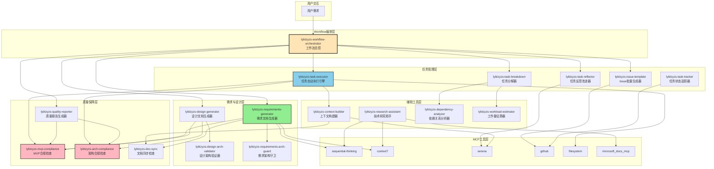
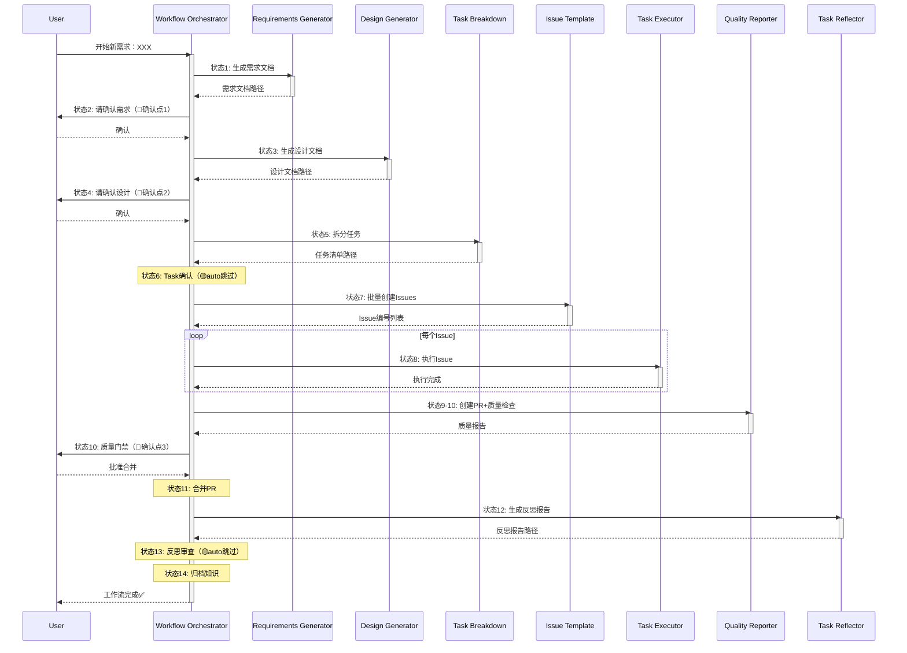
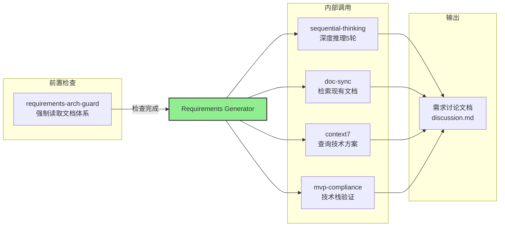
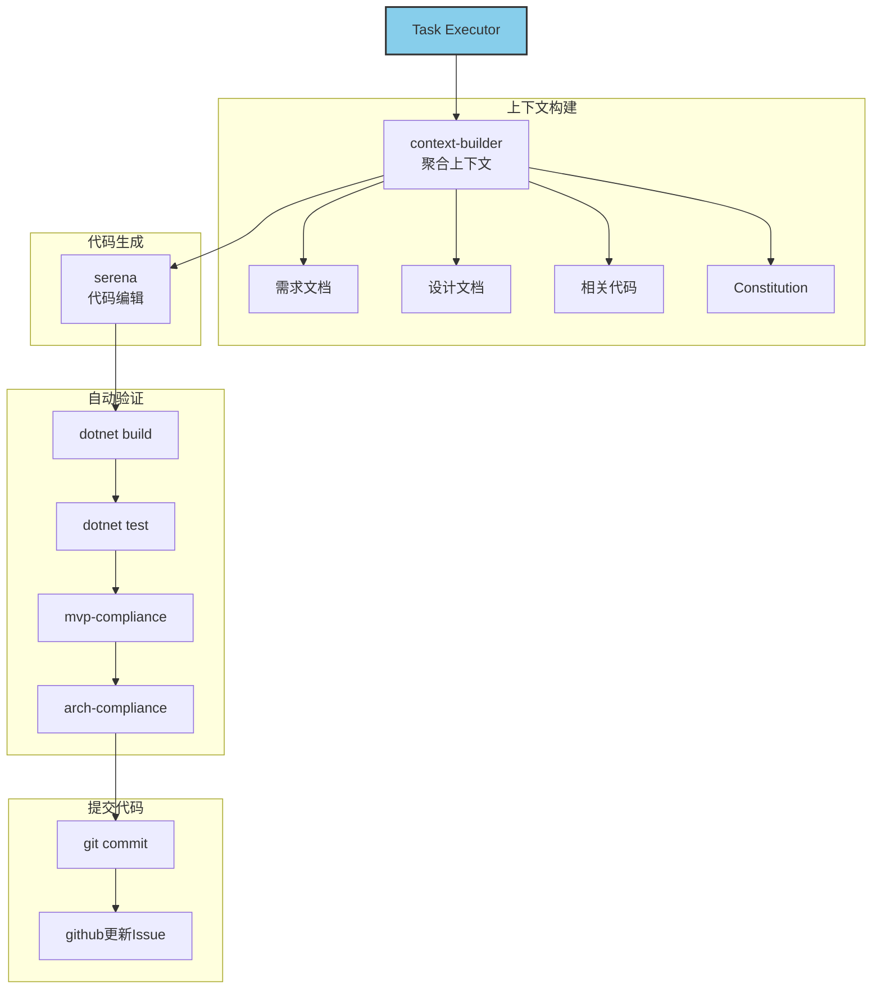
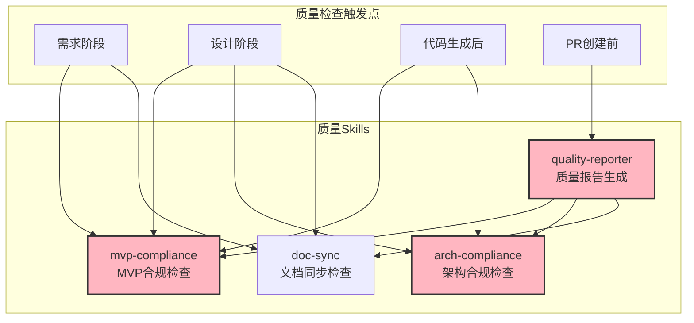
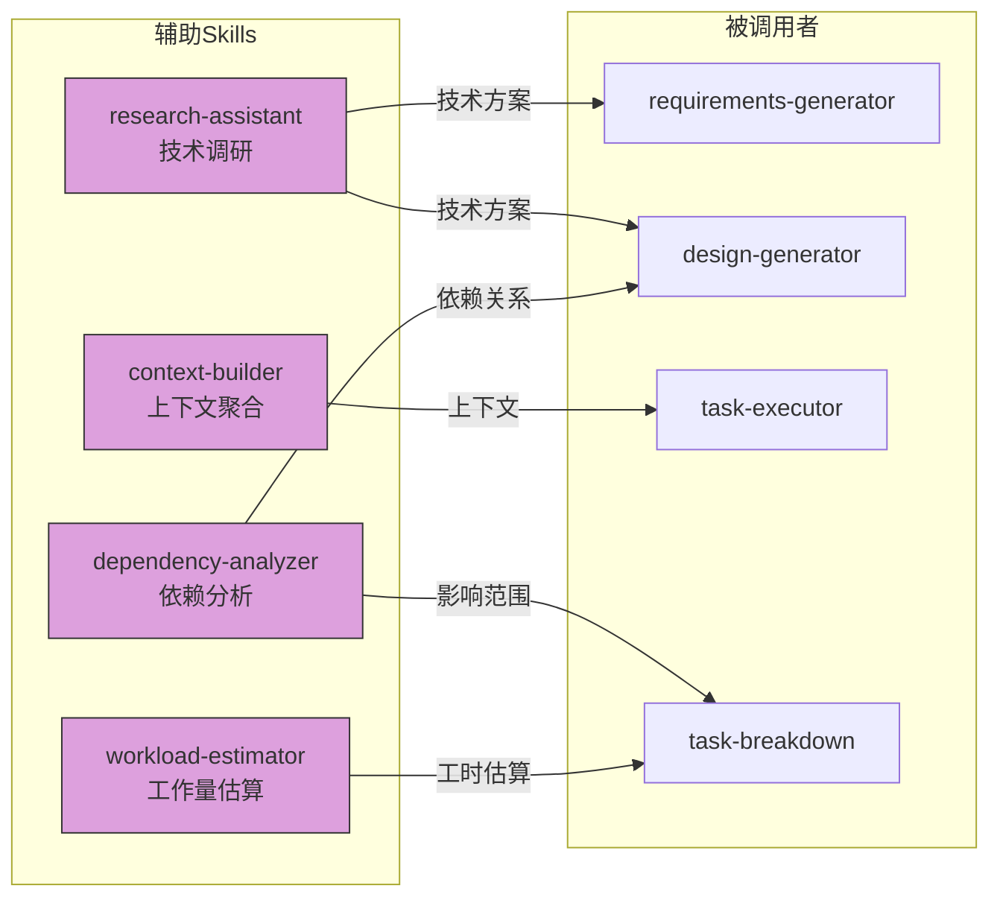
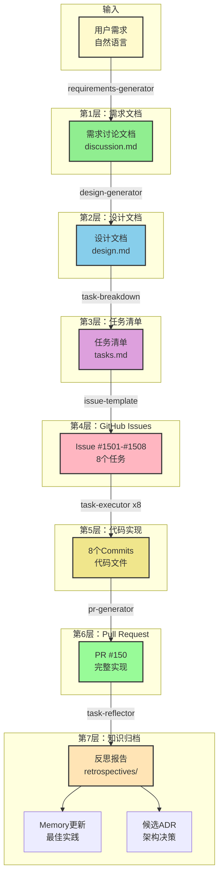
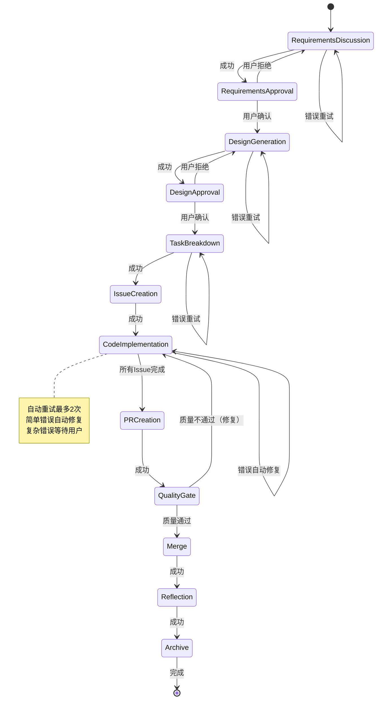

# LYBTZYZS Skills 协同关系图

## 整体协同架构



---

## 详细协同关系

### 1. Workflow Orchestrator协同

**作为总控中枢**，orchestrator协调所有Skills按14个状态顺序执行：



---

### 2. Requirements Generator协同

**核心职责**：从用户需求生成结构化需求文档



**协同示例**：
```
用户: 实现病案草稿功能

→ requirements-arch-guard: 强制读取docs/index.md等5个文档
→ requirements-generator:
  ├─ sequential-thinking: 5轮推理分析需求
  ├─ doc-sync: 查找medicalcase-requirements.md
  ├─ context7: 查询草稿管理最佳实践
  └─ mvp-compliance: 验证技术栈（本地存储方案）
→ 生成: medicalcase-draft-discussion.md
```

---

### 3. Task Executor协同

**核心职责**：自动执行GitHub Issue任务



**协同示例**：
```
Issue #1501: 创建MedicalCaseDraft Entity

→ context-builder: 聚合上下文
  ├─ 需求文档: medicalcase-draft-discussion.md
  ├─ 设计文档: medicalcase-draft-design.md
  ├─ 相关代码: MedicalCase.cs, BaseEntity.cs
  └─ Constitution: MVP约束
→ serena: 生成Entity代码（80行）
→ dotnet build: ✅ 编译通过
→ dotnet test: ✅ 测试通过（无需测试Entity）
→ mvp-compliance: ✅ 无违规
→ arch-compliance: ✅ 符合架构
→ git commit: feat(medicalcase): Issue #1501 创建Entity
→ github: 更新Issue状态 → Completed
```

---

### 4. 质量保障层协同

**核心职责**：多层次质量检查



**协同示例**：
```
质量门禁阶段:

→ quality-reporter: 生成质量报告
  ├─ mvp-compliance: 检查技术黑名单（Redis/CQRS等）
  ├─ arch-compliance: 检查依赖方向（Controller→Service→Repository）
  ├─ doc-sync: 检查文档是否更新
  ├─ dotnet build: 编译检查
  ├─ dotnet test: 测试覆盖率
  └─ 技术债务分析
→ 生成评分: 88/100
→ 判断: 满足自动合并条件（≥85）
```

---

### 5. 辅助工具层协同

**核心职责**：为其他Skills提供支持服务



---

## Skills调用频率统计（完整Epic）

| Skill | 调用次数 | 触发阶段 | 平均耗时 |
|-------|---------|---------|---------|
| requirements-generator | 1 | 需求讨论 | 3-5分钟 |
| design-generator | 1 | 设计生成 | 5-8分钟 |
| task-breakdown | 1 | 任务分解 | 2-3分钟 |
| issue-template | 1 | Issue创建 | 1-2分钟 |
| **task-executor** | **8** | 代码实现（循环） | 10-15分钟/Issue |
| **task-tracker** | **10** | 初始化+更新+查询 | 10秒/次 |
| context-builder | 8 | 每个Issue前 | 30秒/次 |
| mvp-compliance | 3 | 需求/设计/代码 | 1分钟/次 |
| arch-compliance | 2 | 设计/代码 | 2分钟/次 |
| doc-sync | 3 | 需求/设计/质量 | 1分钟/次 |
| pr-generator | 1 | PR创建 | 2-3分钟 |
| quality-reporter | 1 | 质量门禁 | 3-5分钟 |
| task-reflector | 1 | 反思总结 | 2-3分钟 |
| research-assistant | 0-2 | 按需调用 | 5-10分钟/次 |
| dependency-analyzer | 0-1 | 按需调用 | 2-3分钟 |
| workload-estimator | 1 | 任务分解 | 1分钟 |
| **总计** | **38-42** | - | **2-3小时** |

---

## 数据流向图



---

## 错误处理与恢复



---

## Skills版本兼容性

| Skill | 版本 | 依赖Skills | 依赖MCP工具 |
|-------|------|-----------|------------|
| workflow-orchestrator | v1.0 | 所有11个Skills | - |
| requirements-generator | v1.0 | requirements-arch-guard, doc-sync, mvp-compliance | sequential-thinking, context7 |
| design-generator | v1.0 | design-arch-validator, mvp-compliance, arch-compliance | sequential-thinking, context7 |
| task-breakdown | v1.0 | workload-estimator, dependency-analyzer | serena |
| issue-template | v1.2 | - | github |
| task-executor | v1.3 | context-builder, mvp-compliance, arch-compliance | serena, filesystem |
| task-tracker | v1.3 | - | github |
| task-reflector | v1.3 | - | serena |
| research-assistant | v1.3 | - | context7, microsoft_docs_mcp, sequential-thinking |
| context-builder | v1.3 | doc-sync | serena |
| dependency-analyzer | v1.3 | - | serena |
| workload-estimator | v1.3 | - | - |
| mvp-compliance | v1.0 | - | grep, serena, sequential-thinking |
| arch-compliance | v1.0 | - | serena |
| doc-sync | v1.0 | - | git, grep |
| quality-reporter | v1.0 | mvp-compliance, arch-compliance, doc-sync | - |

---

**最后更新**: 2025-11-07
**总Skills数**: 16个（11个核心 + 5个辅助）
