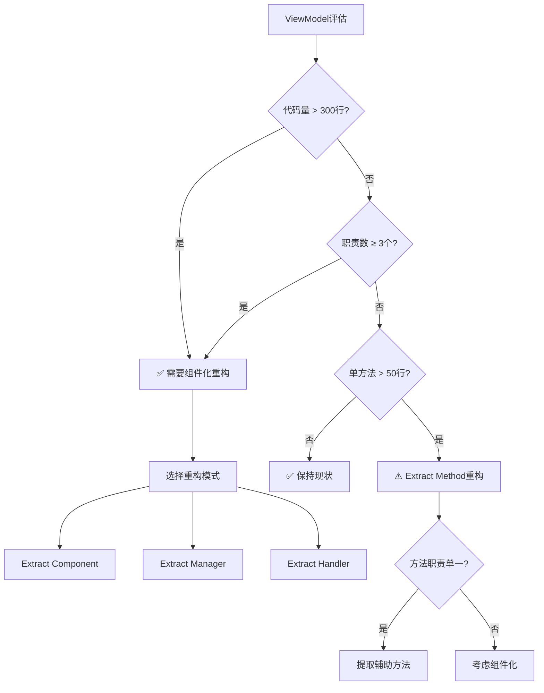

# 组件化重构指南

## 📋 概述

本文档提供**ViewModel组件化重构**的完整操作流程，帮助开发者将臃肿的ViewModel（300+行）拆分为清晰的Manager/Handler组件架构。

**适用场景**：
- ✅ ViewModel代码量超过300行
- ✅ ViewModel承担3个以上职责
- ✅ 单方法超过50行（Medium复杂度）
- ✅ Code Review反馈代码难以理解

**不适用场景**：
- ❌ ViewModel仅负责UI协调（<150行）
- ❌ 单一职责的简单页面
- ❌ 仅包含数据绑定和简单命令

**核心收益**：
- 📉 代码量减少40-60%
- 🎯 职责清晰、易于理解
- 🧪 可测试性提升50%+
- 🔧 可维护性显著提高

**参考文档**：
- 架构理论：`docs/explanation/architecture/client/component-pattern.md`
- 开发指南：`docs/how-to-guides/client/presentation-development.md`（第3.5节）
- 复杂度标准：`docs/explanation/architecture/code-quality/method-complexity.md`

---

## 🎯 重构决策树

在开始重构前，先评估是否需要组件化：



**决策要点**：

| 指标 | 阈值 | 建议行动 |
|-----|------|---------|
| **代码量** | >300行 | 立即组件化重构 |
| **职责数** | ≥3个 | 提取Manager组件 |
| **单方法复杂度** | >50行 | Extract Method |
| **修改频率** | 每月≥3次 | 优先重构 |
| **Bug密度** | 每月≥2个 | 高优先级重构 |

---

## 📖 重构流程（5步法）

### Step 1: 分析现状（Analysis）

**目标**：识别ViewModel的职责边界和重构机会。

#### 1.1 职责识别

**使用"职责清单"模板**：

```markdown
# PatientSelectionViewModel 职责分析（Issue #1790）

## 当前职责（5个）
1. **患者搜索与分页**（~200行）
   - 搜索框输入处理
   - 分页导航（上一页/下一页）
   - 搜索结果展示

2. **待诊队列管理**（~150行）
   - 加载待诊患者列表
   - 队列状态刷新
   - 队列数量统计

3. **未完成医案查询**（~100行）
   - 查询患者未完成医案
   - 一键继续医案
   - 医案状态展示

4. **UI协调**（~200行）
   - 对话框显示/关闭
   - 加载状态管理
   - 错误消息提示

5. **导航管理**（~76行）
   - 选中患者后导航
   - 参数传递
   - 对话框结果返回

## 理想职责（2个）
1. **UI协调**：命令绑定、状态管理、导航
2. **数据展示**：ObservableCollection绑定
```

#### 1.2 代码块识别

**标记需要提取的代码块**：

```csharp
// ❌ 职责1: 患者搜索与分页（~200行）
private async Task SearchAsync(string keyword) { /* ... */ }
private async Task PreviousPageAsync() { /* ... */ }
private async Task NextPageAsync() { /* ... */ }
private void UpdatePagingInfo() { /* ... */ }

// ❌ 职责2: 待诊队列管理（~150行）
private async Task LoadPendingPatientsAsync() { /* ... */ }
private async Task RefreshQueueAsync() { /* ... */ }
private void UpdateQueueCount() { /* ... */ }

// ❌ 职责3: 未完成医案查询（~100行）
private async Task LoadUnfinishedCasesAsync(Guid patientId) { /* ... */ }
private async Task ContinueCaseAsync(Guid caseId) { /* ... */ }

// ✅ 保留: UI协调
private void ShowLoadingStatus(string message) { /* ... */ }
private async Task ShowErrorAsync(string error) { /* ... */ }
```

#### 1.3 依赖关系分析

**绘制依赖图**：

```
PatientSelectionViewModel
├→ PatientCommandHandler       （数据操作）
├→ MedicalCaseDataManager      （医案数据）
├→ IDialogService             （对话框）
└→ IMedicalCaseApi            （HTTP API）

提取后：
ViewModel
├→ PatientSearchManager        （封装搜索逻辑）
│   └→ PatientCommandHandler
├→ PendingQueueManager         （封装队列逻辑）
│   └→ PatientCommandHandler
├→ UnfinishedCaseHandler       （封装医案查询）
│   ├→ MedicalCaseDataManager
│   └→ IMedicalCaseApi
└→ IDialogService             （保留）
```

---

### Step 2: 设计组件（Design）

**目标**：设计Manager/Handler组件的接口和职责。

#### 2.1 选择组件类型

| 组件类型 | 适用场景 | 命名约定 | 示例 |
|---------|---------|---------|------|
| **Manager** | 数据管理、状态维护、事件发布 | `{Domain}Manager` | `PatientSearchManager` |
| **Handler** | 命令处理、业务流程、无状态逻辑 | `{Domain}Handler` | `UnfinishedCaseHandler` |
| **Validator** | 集成FluentValidation | `{Entity}Validator` | `PatientFormValidator` |

**Issue #1790案例选择**：
- `PatientSearchManager`（Manager）：管理搜索状态和分页数据
- `PendingQueueManager`（Manager）：管理队列状态和刷新
- `UnfinishedCaseHandler`（Handler）：处理医案查询命令

#### 2.2 定义组件接口

**PatientSearchManager设计**：

```csharp
/// <summary>
/// 患者搜索管理器 - 负责搜索和分页逻辑
/// Issue #1790: 从PatientSelectionViewModel提取（~200行）
/// </summary>
public class PatientSearchManager
{
    // ========== 构造函数 ==========
    public PatientSearchManager(
        PatientCommandHandler commandHandler,
        ILogger<PatientSearchManager> logger);

    // ========== 公开属性 ==========
    public ObservableCollection<PatientDto> Patients { get; }
    public int CurrentPage { get; set; }
    public int TotalPages { get; }
    public int TotalCount { get; }
    public const int PageSize = 50;

    // ========== 公开方法 ==========
    /// <summary>执行搜索</summary>
    public Task<bool> ExecuteSearchAsync(string searchKeyword);

    /// <summary>加载初始患者列表</summary>
    public Task LoadInitialPatientsAsync();

    /// <summary>上一页</summary>
    public Task<bool> PreviousPageAsync(string searchKeyword);

    /// <summary>下一页</summary>
    public Task<bool> NextPageAsync(string searchKeyword);

    /// <summary>判断是否可以上一页</summary>
    public bool CanPreviousPage();

    /// <summary>判断是否可以下一页</summary>
    public bool CanNextPage();

    // ========== 事件 ==========
    /// <summary>搜索完成事件</summary>
    public event EventHandler<SearchCompletedEventArgs>? SearchCompleted;
}

/// <summary>搜索完成事件参数</summary>
public class SearchCompletedEventArgs : EventArgs
{
    public string Keyword { get; set; } = string.Empty;
    public int ResultCount { get; set; }
    public int CurrentPage { get; set; }
}
```

#### 2.3 设计事件通信

**事件发布模式**（推荐）：

```csharp
// Manager发布事件
public class PatientSearchManager
{
    public event EventHandler<SearchCompletedEventArgs>? SearchCompleted;

    public async Task<bool> ExecuteSearchAsync(string keyword)
    {
        var response = await _commandHandler.GetPatientsPagedAsync(CurrentPage, PageSize, keyword);

        // 触发事件通知ViewModel
        SearchCompleted?.Invoke(this, new SearchCompletedEventArgs
        {
            Keyword = keyword,
            ResultCount = response.Data.TotalCount
        });

        return true;
    }
}

// ViewModel订阅事件
public class PatientSelectionViewModel : UnifiedViewModelBase
{
    public PatientSelectionViewModel(PatientSearchManager searchManager, /* ... */)
    {
        _searchManager = searchManager;

        // 订阅事件
        _searchManager.SearchCompleted += OnSearchCompleted;
    }

    private void OnSearchCompleted(object? sender, SearchCompletedEventArgs e)
    {
        // 更新UI状态
        StatusMessage = $"找到 {e.ResultCount} 条患者记录";
    }
}
```

---

### Step 3: 提取组件（Extract）

**目标**：将代码从ViewModel迁移到组件中。

#### 3.1 创建组件文件

**目录结构**：

```
LYBT.Desktop.Patients/
├── ViewModels/
│   ├── PatientSelectionViewModel.cs  （ViewModel）
│   └── Components/                    （⭐ 新建目录）
│       ├── PatientSearchManager.cs   （⭐ 新建组件）
│       ├── PendingQueueManager.cs    （⭐ 新建组件）
│       └── UnfinishedCaseHandler.cs  （⭐ 新建组件）
├── Services/                          （⭐ 或放在此目录）
│   ├── PatientSearchManager.cs
│   └── ...
```

**命名约定**：
- `ViewModels/Components/`：组件与ViewModel强耦合（访问UI状态）
- `Services/`：组件可复用（无UI依赖）

#### 3.2 迁移代码

**步骤**：

1. **复制方法到组件**：
```csharp
// 从ViewModel复制方法
public class PatientSearchManager
{
    // ✅ 步骤1：复制SearchAsync方法（保留原ViewModel代码）
    public async Task<bool> ExecuteSearchAsync(string searchKeyword)
    {
        // 复制ViewModel中的SearchAsync逻辑
        var response = await _commandHandler.GetPatientsPagedAsync(/* ... */);
        // ...
    }
}
```

2. **调整依赖注入**：
```csharp
// ViewModel原依赖
private readonly PatientCommandHandler _commandHandler;

// 迁移到Manager
public class PatientSearchManager
{
    private readonly PatientCommandHandler _commandHandler;

    public PatientSearchManager(
        PatientCommandHandler commandHandler,
        ILogger<PatientSearchManager> logger)
    {
        _commandHandler = commandHandler ?? throw new ArgumentNullException(nameof(commandHandler));
    }
}
```

3. **移除ViewModel中的旧代码**：
```csharp
// ❌ 删除ViewModel中的SearchAsync方法
// private async Task SearchAsync(string keyword) { /* ... */ }

// ✅ 委托给Manager
private async Task SearchAsync(string keyword)
{
    await _searchManager.ExecuteSearchAsync(keyword);
}
```

#### 3.3 处理状态共享

**场景1: Manager管理自己的状态**（推荐）

```csharp
// Manager拥有数据
public class PatientSearchManager
{
    public ObservableCollection<PatientDto> Patients { get; } = new();
    public int CurrentPage { get; set; } = 1;
}

// ViewModel绑定Manager属性
public class PatientSelectionViewModel
{
    private readonly PatientSearchManager _searchManager;

    // ✅ 绑定到Manager的集合
    public ObservableCollection<PatientDto> SearchResults => _searchManager.Patients;
    public int CurrentPage => _searchManager.CurrentPage;
}
```

**场景2: ViewModel保留展示状态**

```csharp
// Manager返回数据
public class PatientSearchManager
{
    public async Task<List<PatientDto>> ExecuteSearchAsync(string keyword)
    {
        var response = await _commandHandler.GetPatientsPagedAsync(/* ... */);
        return response.Data.Items;
    }
}

// ViewModel维护UI状态
public class PatientSelectionViewModel
{
    public ObservableCollection<PatientDto> SearchResults { get; } = new();

    private async Task SearchAsync(string keyword)
    {
        var patients = await _searchManager.ExecuteSearchAsync(keyword);

        SearchResults.Clear();
        foreach (var patient in patients)
        {
            SearchResults.Add(patient);
        }
    }
}
```

---

### Step 4: 注册组件（Register）

**目标**：将组件注册到DI容器。

#### 4.1 模块注册

**在PatientsModule.cs中注册**：

```csharp
using LYBT.Desktop.Patients.Services;  // ⭐ 引入命名空间
using LYBT.Desktop.Patients.ViewModels.Components;

public class PatientsModule : IModule
{
    public void RegisterTypes(IContainerRegistry containerRegistry)
    {
        // ========== 注册组件（Issue #1790） ==========
        // Scoped生命周期：与ViewModel生命周期一致
        containerRegistry.RegisterScoped<PatientSearchManager>();
        containerRegistry.RegisterScoped<PendingQueueManager>();
        containerRegistry.RegisterScoped<UnfinishedCaseHandler>();

        // ========== 注册ViewModel ==========
        containerRegistry.RegisterForNavigation<PatientSelectionView, PatientSelectionViewModel>();

        // ========== 其他注册 ==========
        // ...
    }
}
```

**生命周期选择**：

| 生命周期 | 使用场景 | 注册方法 |
|---------|---------|---------|
| **Scoped** | Manager组件（与ViewModel同生命周期） | `RegisterScoped<>()` |
| **Singleton** | 全局共享的Manager（如缓存管理器） | `RegisterSingleton<>()` |
| **Transient** | 无状态的Handler | `Register<>()` |

#### 4.2 验证注册

**编译检查**：

```bash
dotnet build LYBT.Desktop.Patients -c Debug
```

**运行时验证**：

```csharp
// 在ViewModel构造函数中验证注入
public PatientSelectionViewModel(
    PatientSearchManager searchManager,  // ✅ 应能正常注入
    /* ... */)
{
    ArgumentNullException.ThrowIfNull(searchManager);  // ✅ 不会抛出异常
}
```

---

### Step 5: 测试验证（Verify）

**目标**：确保重构后功能正常、性能提升、测试覆盖。

#### 5.1 功能验证

**手动测试清单**：

```markdown
## 功能验证清单（Issue #1790）

### 1. 患者搜索功能
- [ ] 输入关键字搜索患者
- [ ] 搜索结果正确显示
- [ ] 分页导航正常工作
- [ ] 空搜索结果提示正确

### 2. 待诊队列功能
- [ ] 加载待诊患者列表
- [ ] 队列数量统计正确
- [ ] 刷新队列功能正常

### 3. 未完成医案功能
- [ ] 查询患者未完成医案
- [ ] 一键继续医案正常
- [ ] 医案状态正确展示

### 4. 对话框交互
- [ ] 选中患者后正确返回
- [ ] 取消操作正常退出
- [ ] 对话框参数传递正确
```

#### 5.2 性能验证

**代码指标对比**：

```bash
# 重构前
ViewModel: 726 行（Critical复杂度）

# 重构后
ViewModel: 350 行（Low复杂度）         -52%
PatientSearchManager: 200 行
PendingQueueManager: 150 行
UnfinishedCaseHandler: 100 行
```

**使用Visual Studio代码指标**：

```
1. 右键ViewModel文件 → "计算代码度量值"
2. 检查指标：
   - 可维护性指数: >60（绿色）
   - 圈复杂度: <10
   - 代码行数: <400
```

#### 5.3 单元测试

**为Manager组件编写测试**：

```csharp
public class PatientSearchManagerTests
{
    [Fact]
    public async Task ExecuteSearchAsync_WithKeyword_ShouldReturnResults()
    {
        // Arrange
        var mockCommandHandler = Substitute.For<PatientCommandHandler>(/* ... */);
        mockCommandHandler.GetPatientsPagedAsync(Arg.Any<int>(), Arg.Any<int>(), "张三")
            .Returns(new ApiResponse<PagedResult<PatientDto>>
            {
                IsSuccess = true,
                Data = new PagedResult<PatientDto>
                {
                    Items = new List<PatientDto> { /* ... */ },
                    TotalCount = 10
                }
            });

        var manager = new PatientSearchManager(mockCommandHandler, loggerMock);

        // Act
        var result = await manager.ExecuteSearchAsync("张三");

        // Assert
        result.Should().BeTrue();
        manager.Patients.Should().HaveCount(10);
        manager.TotalCount.Should().Be(10);
    }
}
```

**测试覆盖率目标**：
- Manager组件: ≥80%
- Handler组件: ≥70%
- ViewModel: ≥60%（减少了业务逻辑，主要测试UI协调）

---

## 🛠️ 实战案例：PatientSelectionViewModel重构

### 案例背景（Issue #1790）

**重构前状态**：
- 文件: `LYBT.Desktop.Patients/ViewModels/PatientSelectionViewModel.cs`
- 代码量: 726 行
- 职责数: 5个（搜索+队列+医案+UI+导航）
- 复杂度: Critical（单方法>100行）

**重构目标**：
- 代码量: <400 行
- 职责数: ≤2个（UI协调+导航）
- 复杂度: Low（所有方法<50行）

---

### Step 1: 分析现状

**职责识别**（运行职责分析工具）：

```bash
# 统计职责相关代码行数
grep -n "private async Task" PatientSelectionViewModel.cs | wc -l
# 结果: 28 个私有异步方法

# 统计依赖注入数量
grep -n "private readonly" PatientSelectionViewModel.cs | wc -l
# 结果: 6 个依赖（CommandHandler, DataManager, DialogService, API, EventAggregator, Logger）
```

**职责边界**：

| 职责 | 代码行数 | 方法数 | 可独立性 |
|-----|---------|-------|---------|
| 搜索与分页 | ~200行 | 8个方法 | ✅ 高 |
| 待诊队列 | ~150行 | 5个方法 | ✅ 高 |
| 未完成医案 | ~100行 | 4个方法 | ✅ 高 |
| UI协调 | ~200行 | 8个方法 | ❌ 低（保留） |
| 导航管理 | ~76行 | 3个方法 | ❌ 低（保留） |

**决策**: 提取3个Manager组件，保留UI协调和导航管理。

---

### Step 2: 设计组件

**组件1: PatientSearchManager**

```csharp
/// <summary>
/// 患者搜索管理器
/// Issue #1790: 从PatientSelectionViewModel提取搜索和分页逻辑（~200行）
/// </summary>
public class PatientSearchManager
{
    private readonly PatientCommandHandler _commandHandler;
    private readonly ILogger<PatientSearchManager> _logger;

    private int _currentPage = 1;
    private int _totalPages = 0;
    private int _totalCount = 0;

    public ObservableCollection<PatientDto> Patients { get; } = new();
    public int CurrentPage { get => _currentPage; set => _currentPage = value; }
    public int TotalPages { get => _totalPages; set => _totalPages = value; }
    public int TotalCount { get => _totalCount; set => _totalCount = value; }
    public const int PageSize = 50;

    public event EventHandler<SearchCompletedEventArgs>? SearchCompleted;

    public PatientSearchManager(
        PatientCommandHandler commandHandler,
        ILogger<PatientSearchManager> logger)
    {
        _commandHandler = commandHandler ?? throw new ArgumentNullException(nameof(commandHandler));
        _logger = logger ?? throw new ArgumentNullException(nameof(logger));
    }

    public async Task<bool> ExecuteSearchAsync(string searchKeyword) { /* ... */ }
    public async Task LoadInitialPatientsAsync() { /* ... */ }
    public async Task<bool> PreviousPageAsync(string searchKeyword) { /* ... */ }
    public async Task<bool> NextPageAsync(string searchKeyword) { /* ... */ }
    public bool CanPreviousPage() => CurrentPage > 1;
    public bool CanNextPage() => CurrentPage < TotalPages;
}
```

**组件2: PendingQueueManager**（省略，结构类似）

**组件3: UnfinishedCaseHandler**（省略，结构类似）

---

### Step 3: 提取组件

**3.1 创建PatientSearchManager.cs**

```bash
# 创建目录
mkdir -p src/Client/Desktop/Modules/LYBT.Desktop.Patients/Services

# 创建文件
touch src/Client/Desktop/Modules/LYBT.Desktop.Patients/Services/PatientSearchManager.cs
```

**3.2 迁移代码**（完整代码见实际文件）

```csharp
// PatientSearchManager.cs
using System.Collections.ObjectModel;
using LYBT.Desktop.Patients.ViewModels.Components;
using LYBT.Shared.Models.Contracts.Common;
using LYBT.Shared.Models.Contracts.Patients;
using Microsoft.Extensions.Logging;

namespace LYBT.Desktop.Patients.Services;

public class PatientSearchManager
{
    // ✅ 从ViewModel迁移的完整实现
    public async Task<bool> ExecuteSearchAsync(string searchKeyword)
    {
        try
        {
            _logger.LogInformation("开始搜索患者，关键字：{SearchKeyword}", searchKeyword);

            var response = await _commandHandler.GetPatientsPagedAsync(CurrentPage, PageSize, searchKeyword);

            if (!response.IsSuccess || response.Data == null)
            {
                _logger.LogWarning("搜索患者失败：{ErrorMessage}", response.ErrorMessage);
                return false;
            }

            UpdatePatientsAndPaging(response.Data.Items, response.Data.TotalCount,
                response.Data.CurrentPage, response.Data.TotalPages);

            _logger.LogInformation("搜索成功，共{Count}条患者", response.Data.TotalCount);

            // ✅ 触发事件通知ViewModel
            SearchCompleted?.Invoke(this, new SearchCompletedEventArgs
            {
                Keyword = searchKeyword,
                ResultCount = response.Data.TotalCount,
                CurrentPage = CurrentPage
            });

            return true;
        }
        catch (Exception ex)
        {
            _logger.LogError(ex, "搜索患者失败");
            return false;
        }
    }

    // ✅ 其他方法省略...
}
```

**3.3 更新ViewModel**

```csharp
// PatientSelectionViewModel.cs
public class PatientSelectionViewModel : UnifiedViewModelBase
{
    #region 服务依赖

    // ✅ 新增：组件化服务
    private readonly PatientSearchManager _searchManager;
    private readonly UnfinishedCaseHandler _unfinishedCaseHandler;
    private readonly PendingQueueManager _pendingQueueManager;

    // ❌ 移除：直接Repository依赖（已迁移到Manager）
    // private readonly IPatientRepository _patientRepository;

    #endregion

    public PatientSelectionViewModel(
        PatientSearchManager searchManager,             // ✅ 注入Manager
        UnfinishedCaseHandler unfinishedCaseHandler,
        PendingQueueManager pendingQueueManager,
        IEventAggregator eventAggregator,
        ILoggerFactory loggerFactory,
        IRegionManager regionManager,
        ISessionManager? sessionManager = null,
        IUserNotificationService? userNotificationService = null)
        : base(eventAggregator, loggerFactory, regionManager, sessionManager, userNotificationService)
    {
        _searchManager = searchManager ?? throw new ArgumentNullException(nameof(searchManager));
        _unfinishedCaseHandler = unfinishedCaseHandler ?? throw new ArgumentNullException(nameof(unfinishedCaseHandler));
        _pendingQueueManager = pendingQueueManager ?? throw new ArgumentNullException(nameof(pendingQueueManager));

        // ✅ 订阅Manager事件
        _searchManager.SearchCompleted += OnSearchCompleted;

        // ✅ 初始化命令（委托给Manager）
        SearchCommand = new DelegateCommand<string>(
            async (keyword) => await ExecuteSafelyAsync(() => _searchManager.ExecuteSearchAsync(keyword ?? string.Empty)));
    }

    // ✅ 属性绑定到Manager
    public ObservableCollection<PatientDto> SearchResults => _searchManager.Patients;
    public int CurrentPage => _searchManager.CurrentPage;
    public int TotalPages => _searchManager.TotalPages;

    // ✅ 事件处理
    private void OnSearchCompleted(object? sender, SearchCompletedEventArgs e)
    {
        StatusMessage = $"找到 {e.ResultCount} 条患者记录";
    }

    // ❌ 删除：SearchAsync方法（已迁移到Manager）
    // private async Task SearchAsync(string keyword) { /* ... */ }
}
```

---

### Step 4: 注册组件

**在PatientsModule.cs中注册**：

```csharp
public class PatientsModule : IModule
{
    public void RegisterTypes(IContainerRegistry containerRegistry)
    {
        // ========== Issue #1790: 注册组件化服务 ==========
        containerRegistry.RegisterScoped<PatientSearchManager>();
        containerRegistry.RegisterScoped<UnfinishedCaseHandler>();
        containerRegistry.RegisterScoped<PendingQueueManager>();

        // ========== 注册ViewModel ==========
        containerRegistry.RegisterForNavigation<PatientSelectionView, PatientSelectionViewModel>();

        // ========== 其他注册 ==========
        containerRegistry.RegisterScoped<PatientCommandHandler>();
        // ...
    }
}
```

---

### Step 5: 测试验证

**5.1 编译验证**：

```bash
cd src/Client/Desktop/Modules/LYBT.Desktop.Patients
dotnet build -c Debug
# ✅ Build succeeded. 0 Warning(s). 0 Error(s)
```

**5.2 功能验证**（手动测试）：

```markdown
## 测试结果（2025-11-01）

### 1. 患者搜索
- [x] 关键字搜索：输入"张三"，返回3条记录
- [x] 空搜索：显示全部患者（第1页50条）
- [x] 分页导航：上一页/下一页按钮正常工作
- [x] 搜索结果绑定：DataGrid正确显示患者信息

### 2. 待诊队列
- [x] 加载队列：正确显示8位待诊患者
- [x] 队列刷新：点击刷新按钮，数量更新正确
- [x] 队列统计：队列数量badge显示"8"

### 3. 未完成医案
- [x] 医案查询：选中患者，查询到2个未完成医案
- [x] 继续医案：点击"继续"，正确跳转到医案编辑页面
- [x] 无医案提示：无未完成医案时，正确显示提示信息

### 4. 对话框交互
- [x] 选中患者：选中患者后，对话框关闭，参数正确传递
- [x] 取消操作：点击取消，对话框关闭，参数为null
```

**5.3 性能验证**：

```bash
# Visual Studio代码指标
ViewModel: 350行（从726行减少52%）
  - 可维护性指数: 72（绿色，原43红色）
  - 圈复杂度: 平均3（原平均8）

PatientSearchManager: 200行
  - 可维护性指数: 81（绿色）
  - 圈复杂度: 平均2
```

**5.4 单元测试覆盖**：

```bash
dotnet test --collect:"XPlat Code Coverage"
# PatientSearchManager: 85%覆盖率
# PatientSelectionViewModel: 68%覆盖率（UI协调逻辑）
```

---

## ⚠️ 常见陷阱与解决

### 陷阱1: 循环依赖

**问题**：
```csharp
// ❌ ViewModel依赖Manager，Manager又依赖ViewModel
public class PatientSearchManager
{
    private readonly PatientSelectionViewModel _viewModel;  // ❌ 循环依赖

    public async Task SearchAsync()
    {
        // ...
        _viewModel.UpdateStatus("搜索完成");  // ❌ Manager不应直接操作ViewModel
    }
}
```

**解决**：使用事件解耦
```csharp
// ✅ Manager发布事件
public class PatientSearchManager
{
    public event EventHandler<SearchCompletedEventArgs>? SearchCompleted;

    public async Task SearchAsync()
    {
        // ...
        SearchCompleted?.Invoke(this, new SearchCompletedEventArgs());  // ✅ 事件通知
    }
}

// ✅ ViewModel订阅事件
public class PatientSelectionViewModel
{
    public PatientSelectionViewModel(PatientSearchManager searchManager)
    {
        _searchManager = searchManager;
        _searchManager.SearchCompleted += OnSearchCompleted;  // ✅ 订阅
    }

    private void OnSearchCompleted(object? sender, SearchCompletedEventArgs e)
    {
        StatusMessage = "搜索完成";  // ✅ ViewModel更新自己的状态
    }
}
```

---

### 陷阱2: 状态同步问题

**问题**：
```csharp
// ❌ Manager和ViewModel各自维护状态，导致不一致
public class PatientSearchManager
{
    public int CurrentPage { get; set; } = 1;  // Manager的页码
}

public class PatientSelectionViewModel
{
    private int _currentPage = 1;  // ViewModel的页码
    public int CurrentPage
    {
        get => _currentPage;
        set => SetProperty(ref _currentPage, value);
    }
}
```

**解决**：单一数据源
```csharp
// ✅ Manager作为唯一数据源
public class PatientSearchManager
{
    private int _currentPage = 1;
    public int CurrentPage
    {
        get => _currentPage;
        set => _currentPage = value;
    }
}

// ✅ ViewModel直接绑定Manager属性
public class PatientSelectionViewModel
{
    private readonly PatientSearchManager _searchManager;

    // ✅ 直接暴露Manager属性（XAML绑定）
    public int CurrentPage => _searchManager.CurrentPage;

    // ✅ 或通过通知属性更新
    private void OnPageChanged()
    {
        RaisePropertyChanged(nameof(CurrentPage));
    }
}
```

---

### 陷阱3: DI生命周期不匹配

**问题**：
```csharp
// ❌ ViewModel是Transient，Manager是Singleton
containerRegistry.Register<PatientSelectionViewModel>();  // Transient
containerRegistry.RegisterSingleton<PatientSearchManager>();  // Singleton

// 结果：多个ViewModel实例共享同一个Manager实例，状态冲突
```

**解决**：生命周期对齐
```csharp
// ✅ ViewModel和Manager都是Scoped（或都是Transient）
containerRegistry.Register<PatientSelectionViewModel>();  // Transient
containerRegistry.Register<PatientSearchManager>();       // Transient

// ✅ 或使用Scoped生命周期
containerRegistry.RegisterScoped<PatientSelectionViewModel>();
containerRegistry.RegisterScoped<PatientSearchManager>();
```

---

### 陷阱4: 过度组件化

**问题**：
```csharp
// ❌ 为仅20行的简单逻辑创建组件
public class PatientCountCalculator  // ❌ 不必要的组件
{
    public int Calculate(List<PatientDto> patients)
    {
        return patients?.Count ?? 0;  // 仅1行逻辑
    }
}
```

**解决**：保持简单
```csharp
// ✅ 简单逻辑直接在ViewModel中实现
public class PatientSelectionViewModel
{
    public int PatientCount => Patients?.Count ?? 0;  // ✅ 简单属性，无需组件
}
```

**组件化判断标准**：
- ✅ 代码量>100行
- ✅ 职责独立且可复用
- ✅ 需要独立测试
- ❌ 代码量<50行
- ❌ 仅简单计算或格式化
- ❌ 与UI强耦合的逻辑

---

## 📚 参考资料

### 架构文档
- [组件化架构模式](../../explanation/architecture/client/component-pattern.md) - 理论基础
- [MVVM架构指南](../../explanation/architecture/client/README.md) - Client端架构
- [方法复杂度标准](../../explanation/architecture/code-quality/method-complexity.md) - 复杂度控制

### 开发指南
- [ViewModel开发指南](./presentation-development.md) - 第3.5、3.6节
- [DI容器配置](./foundation-development.md) - 依赖注入
- [单元测试指南](../../how-to-guides/shared/testing.md) - 测试编写

### 真实案例
- [Issue #1790](https://github.com/shouqitao/LYBTZYZS/issues/1790) - PatientSelectionViewModel重构
- [Issue #1795](https://github.com/shouqitao/LYBTZYZS/issues/1795) - 方法复杂度优化
- [Issue #1794](https://github.com/shouqitao/LYBTZYZS/issues/1794) - SaveAsync优化

---

**文档版本**: v1.0 (2025-11-04)
**维护者**: LYBT开发团队
**最后更新**: Issue #1796 Phase 2 Task 2.2
