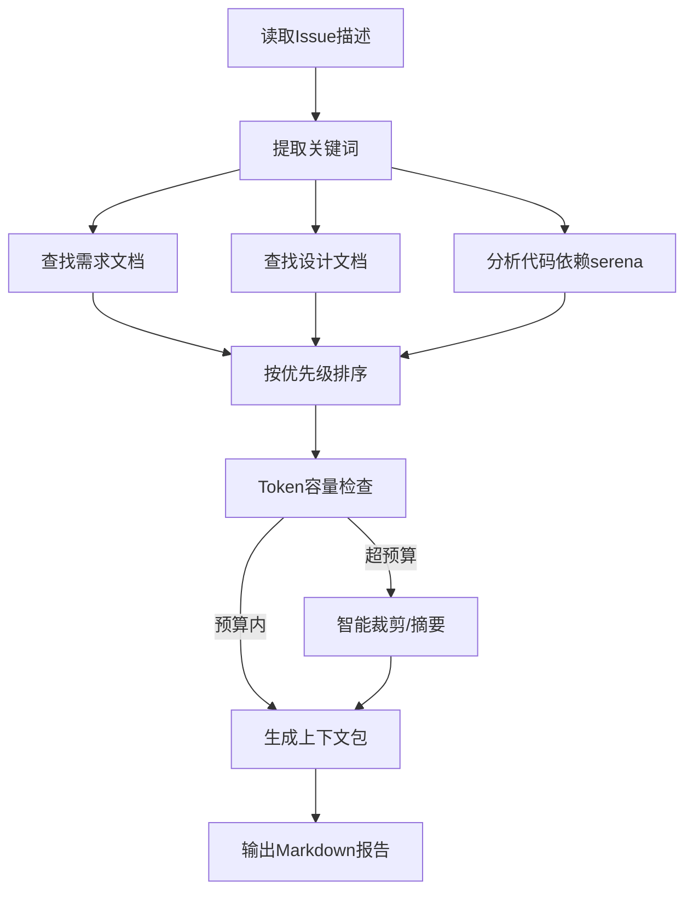

# LYBTZYZS 上下文构建器

## 核心能力

### 1. 需求文档聚合
- **自动定位**：从Issue描述中提取相关需求文档链接
- **层级遍历**：requirements → design → task文档链接
- **智能去重**：避免重复加载相同文档

### 2. 代码依赖分析
- **符号引用**：使用serena分析代码依赖关系
- **层级扩展**：Repository → Service → Controller调用链
- **接口实现**：识别接口及其所有实现类

### 3. 历史决策追溯
- **ADR查询**：查找相关架构决策记录
- **Memory检索**：搜索相关最佳实践和反模式
- **Issue历史**：查找相关的已完成Issues

### 4. 优先级排序
- **核心优先**：直接相关的代码和文档优先级最高
- **依赖次之**：间接依赖的内容次之
- **背景最后**：历史背景和ADR最后加载

### 5. 容量控制
- **Token预算**：控制总上下文不超过指定Token数
- **智能裁剪**：优先保留核心内容，裁剪背景信息
- **摘要生成**：大文件生成摘要而非全文

---

## 使用场景

### 场景：为任务执行构建完整上下文

**触发**：lybtzyzs-task-executor调用

**输入**：Issue #1234（新增ConsultationRepository.GetByPatientIdAsync）

**执行流程**：
```
1. 读取Issue描述 → 提取关键词（Consultation, Repository, PatientId）
2. 查找需求文档 → docs/requirements/consultation-requirements.md
3. 查找设计文档 → docs/design/consultation-design.md
4. 查找相关代码：
   - Repository层: ConsultationRepository.cs, BaseRepository.cs
   - Entity层: Consultation.cs, Patient.cs
   - Service层: ConsultationService.cs（调用方）
5. 查找相关ADR → ADR-005（Repository模式）
6. 查找Memory → pattern-repository-query.md
7. 查找历史Issues → #1100（首次实现ConsultationRepository）
8. 按优先级排序 → 生成上下文包
```

**输出**：
```markdown
## 任务上下文包（Issue #1234）

### 📋 核心文档（优先级：P0）
1. **需求文档**: docs/requirements/consultation-requirements.md（摘要）
   - 相关需求: REQ-001（查询患者诊疗记录）
2. **设计文档**: docs/design/consultation-design.md（完整）
   - API设计: GET /api/v1/consultations/{patientId}

### 💻 核心代码（优先级：P0）
1. **BaseRepository.cs**（完整 - 200行）
   - 基础查询方法模板
2. **ConsultationRepository.cs**（完整 - 150行）
   - 现有查询方法参考
3. **Consultation.cs**（完整 - 80行）
   - Entity定义

### 🔗 依赖代码（优先级：P1）
1. **ConsultationService.cs**（摘要 - 调用方）
   - 调用GetByPatientIdAsync的位置
2. **Patient.cs**（摘要 - 关联Entity）
   - PatientId字段定义

### 📚 历史决策（优先级：P2）
1. **ADR-005**: Repository模式设计
   - 核心原则: 依赖注入、泛型基类
2. **Memory**: pattern-repository-query.md
   - 最佳实践: 命名规范、异步方法

### 🔍 相关Issues（优先级：P2）
1. **Issue #1100**: 首次实现ConsultationRepository
   - 参考实现模式

---

**上下文统计**:
- 总Token数: 8,500 / 10,000（预算内）
- 完整文件: 4个
- 摘要文件: 2个
- ADR: 1个
- Memory: 1个
- Issues: 1个
```

---

## 工作流程



---

## 配置选项

```json
{
  "tokenBudget": 10000,
  "priorities": {
    "coreDocuments": 0,
    "coreCode": 0,
    "dependencyCode": 1,
    "adr": 2,
    "memory": 2,
    "issues": 2
  },
  "summarizationThreshold": 500
}
```

---

**最后更新**: 2025-11-07
