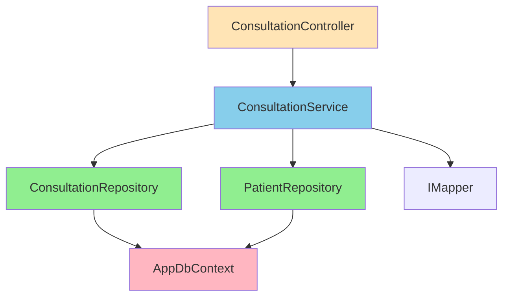
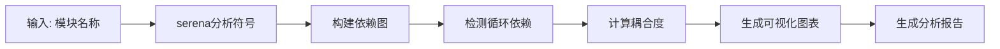

# LYBTZYZS 依赖关系分析器

## 核心能力

### 1. 依赖图生成
- **层级依赖图**：Repository → Service → Controller → ViewModel
- **模块依赖图**：Auth → Users → Patients → MedicalCase
- **Mermaid可视化**：自动生成依赖关系图
- **调用链追踪**：从入口点追踪完整调用链

### 2. 循环依赖检测
- **拓扑排序**：检测循环依赖
- **循环路径可视化**：标识循环依赖的完整路径
- **解耦建议**：提供打破循环的方案

### 3. 影响范围分析
- **变更影响**：修改A影响哪些模块
- **风险评估**：影响范围大小（低/中/高风险）
- **测试范围**：需要测试的模块清单

### 4. 紧耦合识别
- **耦合度计算**：模块间耦合强度
- **重构建议**：高耦合模块解耦方案
- **依赖方向检查**：验证依赖方向是否符合架构

---

## 使用场景

### 场景1：分析模块依赖关系

**触发**：用户说"分析Consultation模块的依赖关系"

**输出示例**：


**依赖统计**：
- 直接依赖: 2个（ConsultationRepository, PatientRepository）
- 间接依赖: 3个（AppDbContext, IMapper, BaseRepository）
- 耦合度: ⭐⭐⭐ 中等
- 风险评估: ✅ 低风险（依赖方向正确）

---

### 场景2：变更影响范围分析

**触发**：用户说"修改ConsultationRepository会影响哪些模块"

**输出**：
```markdown
## 影响范围分析: ConsultationRepository变更

### 🎯 直接影响（必须测试）
1. **ConsultationService**
   - 调用方法: 5个（GetById, GetByPatientId, Create, Update, Delete）
   - 影响行数: ~50行
   - 测试文件: ConsultationServiceTests.cs

### 🔗 间接影响（建议测试）
1. **ConsultationController**
   - 通过ConsultationService间接调用
   - 影响API端点: 5个
   - 测试文件: ConsultationControllerTests.cs

2. **ConsultationViewModel**（Client端）
   - 通过API间接调用
   - 影响UI: 诊疗管理页面
   - 测试文件: ConsultationViewModelTests.cs

### 📊 风险评估
- 影响范围: ⭐⭐⭐ 中等（3个模块）
- 风险等级: ⚠️ 中风险（核心业务逻辑）
- 建议: 运行完整测试套件（Repository + Service + Controller）
```

---

## 工作流程



---

## 配置选项

```json
{
  "visualization": {
    "format": "mermaid",
    "maxDepth": 3,
    "showIndirect": true
  },
  "analysis": {
    "detectCycles": true,
    "calculateCoupling": true,
    "assessRisk": true
  }
}
```

---

**最后更新**: 2025-11-07
