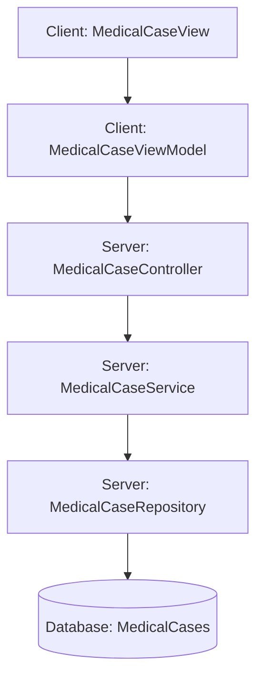

# LYBTZYZS 设计文档生成器

## 📋 元数据

- **Skill名称**: lybtzyzs-design-generator
- **版本**: v1.0
- **创建日期**: 2025-10-26
- **适用项目**: LYBTZYZS
- **触发场景**: 需求文档完成并通过架构守护检查后，生成技术设计文档
- **优先级**: 🟢 推荐使用（Recommended）

## 🎯 核心目标

从需求文档自动生成完整的技术设计文档，包含架构设计、API端点、DTO设计、数据库Schema、代码示例、Phase拆分等，并自动触发架构合规性验证。

## 核心能力

1. **需求解析**：自动解析需求文档中的业务需求、架构约束、验收标准
2. **架构设计生成**：基于v2.0三层架构生成组件关系图和数据流设计
3. **API端点设计**：遵循Write/Read/Helper层分离，生成RESTful API端点
4. **DTO设计**：生成请求/响应DTO和映射关系
5. **数据库Schema**：生成表结构调整和迁移脚本
6. **代码示例生成**：生成关键逻辑的完整代码示例（Controller/Service/Repository/ViewModel）
7. **Phase拆分**：将实施计划分解为多个Phase，每个Phase包含任务清单和时间估算
8. **质量标准生成**：生成编译、测试、性能要求的验收标准
9. **架构合规性自动验证**：生成后自动触发lybtzyzs-design-arch-validator检查

## ⚠️ 强制性文档阅读规则（⭐⭐⭐ 最高优先级）

**执行时机**：在生成设计文档之前

### 规则1：拒绝未读架构文档的设计生成请求

**强制流程**：
1. **检测用户请求类型**：
   - 如用户要求"生成设计文档"、"写技术设计"、"创建Design文档"
   - **必须先拒绝**，提示："⚠️ 设计文档生成前必须先阅读架构指南，请确认是否已理解架构约束？"

2. **强制架构文档阅读清单**：
   ```markdown
   📚 设计文档生成前必读架构文档（按优先级排序）：

   ### Level 0 - 需求文档（100%必读）
   - [ ] 对应的需求文档 - 必须先阅读需求文档全文，重点关注"架构约束"章节

   ### Level 1 - 核心架构（100%必读）
   - [ ] docs/index.md - 文档导航中心
   - [ ] docs/business-rules.md - 14条核心业务规则
   - [ ] docs/architecture/{server|client|shared}/README.md - 对应层架构指南

   ### Level 2 - 详细架构（根据功能必读）
   #### Server端设计
   - [ ] docs/architecture/server/README.md - Server端三层架构
   - [ ] docs/architecture/server/services.md - Service层设计标准
   - [ ] docs/architecture/server/repositories.md - Repository模式
   - [ ] docs/architecture/server/aggregation-roots.md - 聚合根边界

   #### Client端设计
   - [ ] docs/architecture/client/README.md - Client端MVVM架构
   - [ ] docs/architecture/client/shell-layer-design.md - Shell层设计
   - [ ] docs/architecture/client/viewmodel-patterns.md - ViewModel模式

   #### 跨端设计
   - [ ] docs/architecture/shared/README.md - 共享架构
   - [ ] docs/architecture/shared/dto-design.md - DTO设计标准

   ### Level 3 - 专题架构（可选）
   - [ ] docs/architecture/decisions/ADR-*.md - 相关架构决策记录
   - [ ] docs/deep/advanced-patterns.md - 高级模式（如涉及复杂重构）
   ```

3. **验证文档阅读**：
   - 使用Read工具读取核心文档
   - 生成文档要点摘要，证明已理解
   - 用户确认后才继续设计生成

### 规则2：生成前必须确认需求文档的架构约束章节

**检查点**：
- ✅ 需求文档是否包含"架构约束"章节
- ✅ 架构约束是否包含聚合根原则、三层架构参考
- ✅ 是否明确了Write/Read Layer分离要求
- ❌ 如需求文档缺少架构约束章节，必须先补充再生成设计

## 何时使用

- 需求文档完成并通过lybtzyzs-requirements-arch-guard检查后
- 需要将业务需求转化为技术设计蓝图
- 需要完整的API端点、DTO、数据库Schema设计
- 需要指导编码的详细设计文档
- Epic需要技术设计文档作为实施依据

## 工作流程

### Phase 1：架构文档阅读（强制）

1. **拒绝未读文档的请求**：提示用户必须先阅读架构文档
2. **读取核心架构文档**：
   - docs/index.md
   - docs/business-rules.md
   - docs/architecture/{server|client|shared}/README.md
3. **读取需求文档的架构约束章节**：
   - 确认聚合根约束
   - 确认三层架构参考
   - 确认技术黑名单
4. **生成文档阅读摘要**：证明已理解架构规范
5. **等待用户确认**：用户确认后才进入Phase 2

### Phase 2：需求解析

6. **读取需求文档全文**（docs/requirements/*.md）
7. **提取核心信息**：
   - 业务需求清单（REQ-001, REQ-002...）
   - 架构要求（ARCH-001, ARCH-002...）
   - 验收标准
   - 优先级和时间估算

### Phase 3：设计文档生成

8. **生成架构设计章节**：
   - 组件关系图（Mermaid图）
   - 数据流设计
   - 聚合根边界说明
   - 层级职责划分

9. **生成API端点设计章节**：
   - Write Layer端点（遵循聚合根原则）
   - Read Layer端点（独立查询）
   - Helper Layer端点（工具函数）
   - 每个端点包含：请求/响应DTO、业务规则引用、错误处理

10. **生成DTO设计章节**：
    - 请求DTO定义
    - 响应DTO定义
    - Entity到DTO映射关系

11. **生成数据库Schema章节**：
    - 新增表结构
    - 字段调整
    - 外键关系
    - 迁移脚本示例

12. **生成代码示例章节**：
    - Controller代码示例（含注释）
    - Service代码示例（含业务规则验证）
    - Repository代码示例（含聚合根操作）
    - ViewModel代码示例（如涉及Client端）
    - AutoMapper配置示例

13. **生成Phase拆分章节**：
    - Phase 1：基础架构和数据层
    - Phase 2：业务逻辑和API实现
    - Phase 3：UI集成和测试
    - 每个Phase包含任务清单和时间估算

14. **生成质量标准章节**：
    - 编译要求：0 errors, 0 warnings
    - 测试要求：单元测试覆盖率
    - 性能要求：响应时间、并发限制
    - 文档要求：同步更新的文档清单

15. **写入设计文档**：保存到docs/design/{feature-name}-design.md

### Phase 4：架构合规性自动验证

16. **自动触发lybtzyzs-design-arch-validator**：
    - 检查Write Layer端点是否遵循聚合根原则
    - 检查Read Layer端点是否独立
    - 检查是否引用了架构约束和业务规则
    - 检查Phase拆分是否合理
    - 生成验证报告

17. **处理验证结果**：
    - ✅ 验证通过：设计文档完成，可进入任务分解阶段
    - ❌ 验证失败：修正设计文档中的违规项，重新验证

## 输入要求

**必需**：
- 需求文档路径（docs/requirements/*.md）
- 需求文档必须包含"架构约束"章节

**可选**：
- Epic编号（用于关联）
- Phase数量建议（默认：3个Phase）
- 代码示例详细程度（默认：关键逻辑全覆盖）

## 输出格式

### 1. 设计文档（标准格式）

**文件路径**：`docs/design/{feature-name}-design.md`

**文档结构**：
```markdown
# {Feature Name} 技术设计文档

## 📋 元数据
- Epic: #XXXX
- 需求文档: docs/requirements/{feature-name}-requirements.md
- 设计版本: v1.0
- 创建日期: YYYY-MM-DD
- 架构验证: ✅ 通过 lybtzyzs-design-arch-validator

## 🎯 设计目标
[从需求文档的业务目标提炼的技术目标]

## 🏗️ 架构设计

### 组件关系图


### 数据流设计
1. 用户操作 → ViewModel.Command
2. Command → WebAPI Client → Controller.Action
3. Controller → Service.BusinessMethod
4. Service → Repository.AggregateMethod
5. Repository → Database → Entity
6. Entity → DTO → ViewModel → UI

### 聚合根边界
- **聚合根**: MedicalCase
- **聚合成员**: Consultation, Prescription
- **Write操作**: 必须通过MedicalCase聚合根
- **Read操作**: 可独立查询

### 层级职责划分
- **Presentation Layer**: Controller处理HTTP请求，参数验证
- **Application Layer**: Service实现业务规则，事务管理
- **Data Access Layer**: Repository管理聚合根持久化

## 🔧 API端点设计

### Write Layer（写操作，通过聚合根）

#### 1. 更新病案辨证信息
- **端点**: `PUT /api/v1/medicalcases/{id}/consultation`
- **业务规则**: AR-001（MedicalCase聚合根约束）, BF-002（三步看诊流程）
- **请求DTO**:
  ```csharp
  public class UpdateConsultationRequest
  {
      public string ChiefComplaint { get; set; }       // 主诉
      public string Symptoms { get; set; }             // 症状
      public string Diagnosis { get; set; }            // 诊断
      // ... 其他字段
  }
  ```
- **响应DTO**:
  ```csharp
  public class MedicalCaseDetailResponse
  {
      public int Id { get; set; }
      public ConsultationDto Consultation { get; set; }
      // ... 其他字段
  }
  ```
- **错误处理**:
  - 404: 病案不存在
  - 400: 病案状态不允许修改
  - 422: 业务规则验证失败

#### 2. 标记是否开处方
- **端点**: `PUT /api/v1/medicalcases/{id}/prescription-flag`
- **业务规则**: BF-002（开处方决策点）, AR-003（一诊断一处方）
- **请求DTO**:
  ```csharp
  public class SetPrescriptionFlagRequest
  {
      public bool NeedsPrescription { get; set; }
  }
  ```
- **响应DTO**: `MedicalCaseDetailResponse`
- **错误处理**: 同上

### Read Layer（读操作，独立查询）

#### 1. 获取病案详情
- **端点**: `GET /api/v1/medicalcases/{id}`
- **响应DTO**: `MedicalCaseDetailResponse`
- **缓存策略**: 无（实时数据）

#### 2. 查询辨证记录列表
- **端点**: `GET /api/v1/consultations?medicalCaseId={id}`
- **响应DTO**: `List<ConsultationDto>`
- **分页支持**: 是（默认20条/页）

### Helper Layer（辅助功能）

#### 1. 验证病案状态是否允许操作
- **端点**: `GET /api/v1/medicalcases/{id}/can-edit`
- **响应DTO**:
  ```csharp
  public class CanEditResponse
  {
      public bool CanEdit { get; set; }
      public string Reason { get; set; }  // 不允许时的原因
  }
  ```

## 📦 DTO设计

### 请求DTO

#### UpdateConsultationRequest
```csharp
namespace LYBT.Module.MedicalCase.Dtos.Requests;

/// <summary>
/// 更新辨证信息请求DTO
/// </summary>
public class UpdateConsultationRequest
{
    /// <summary>
    /// 主诉
    /// </summary>
    [Required(ErrorMessage = "主诉不能为空")]
    [MaxLength(500, ErrorMessage = "主诉长度不能超过500字符")]
    public string ChiefComplaint { get; set; }

    /// <summary>
    /// 现病史
    /// </summary>
    [MaxLength(2000)]
    public string PresentIllness { get; set; }

    // ... 其他字段
}
```

### 响应DTO

#### MedicalCaseDetailResponse
```csharp
namespace LYBT.Module.MedicalCase.Dtos.Responses;

/// <summary>
/// 病案详情响应DTO
/// </summary>
public class MedicalCaseDetailResponse
{
    public int Id { get; set; }
    public PatientDto Patient { get; set; }
    public ConsultationDto Consultation { get; set; }
    public PrescriptionDto Prescription { get; set; }
    public string Status { get; set; }
    public bool NeedsPrescription { get; set; }
    public DateTime CreatedAt { get; set; }
    public DateTime? UpdatedAt { get; set; }
}
```

### Entity到DTO映射关系

#### AutoMapper配置
```csharp
namespace LYBT.Module.MedicalCase.Mappings;

public class MedicalCaseMappingProfile : Profile
{
    public MedicalCaseMappingProfile()
    {
        // Entity → Response DTO
        CreateMap<MedicalCase, MedicalCaseDetailResponse>()
            .ForMember(dest => dest.Patient, opt => opt.MapFrom(src => src.Patient))
            .ForMember(dest => dest.Consultation, opt => opt.MapFrom(src => src.Consultation))
            .ForMember(dest => dest.Prescription, opt => opt.MapFrom(src => src.Prescription));

        // Request DTO → Entity（用于更新）
        CreateMap<UpdateConsultationRequest, Consultation>()
            .ForMember(dest => dest.Id, opt => opt.Ignore())
            .ForMember(dest => dest.MedicalCaseId, opt => opt.Ignore());
    }
}
```

## 🗄️ 数据库Schema

### 表结构调整

#### MedicalCases表（新增字段）
```sql
ALTER TABLE MedicalCases
ADD NeedsPrescription BIT NOT NULL DEFAULT 0;  -- 是否需要开处方
```

#### Consultations表（调整字段）
```sql
ALTER TABLE Consultations
ALTER COLUMN Diagnosis NVARCHAR(2000) NULL;  -- 诊断字段可为空（初始阶段）
```

### 数据迁移脚本

#### Migration: AddNeedsPrescriptionFlag
```csharp
namespace LYBT.Infrastructure.Migrations;

public partial class AddNeedsPrescriptionFlag : Migration
{
    protected override void Up(MigrationBuilder migrationBuilder)
    {
        migrationBuilder.AddColumn<bool>(
            name: "NeedsPrescription",
            table: "MedicalCases",
            type: "bit",
            nullable: false,
            defaultValue: false);
    }

    protected override void Down(MigrationBuilder migrationBuilder)
    {
        migrationBuilder.DropColumn(
            name: "NeedsPrescription",
            table: "MedicalCases");
    }
}
```

## 💻 代码示例

### Controller代码示例

```csharp
namespace LYBT.WebAPI.Controllers;

[ApiController]
[Route("api/v1/medicalcases")]
public class MedicalCaseController : ControllerBase
{
    private readonly IMedicalCaseService _medicalCaseService;
    private readonly IMapper _mapper;

    public MedicalCaseController(
        IMedicalCaseService medicalCaseService,
        IMapper mapper)
    {
        _medicalCaseService = medicalCaseService;
        _mapper = mapper;
    }

    /// <summary>
    /// 更新病案辨证信息
    /// </summary>
    /// <param name="id">病案ID</param>
    /// <param name="request">辨证信息</param>
    /// <returns>更新后的病案详情</returns>
    [HttpPut("{id}/consultation")]
    [ProducesResponseType(typeof(MedicalCaseDetailResponse), StatusCodes.Status200OK)]
    [ProducesResponseType(StatusCodes.Status404NotFound)]
    [ProducesResponseType(StatusCodes.Status422UnprocessableEntity)]
    public async Task<ActionResult<MedicalCaseDetailResponse>> UpdateConsultation(
        int id,
        [FromBody] UpdateConsultationRequest request)
    {
        // 业务规则引用：AR-001（通过聚合根操作）
        var medicalCase = await _medicalCaseService.UpdateConsultationAsync(id, request);

        if (medicalCase == null)
        {
            return NotFound(new { Message = $"病案 {id} 不存在" });
        }

        var response = _mapper.Map<MedicalCaseDetailResponse>(medicalCase);
        return Ok(response);
    }

    /// <summary>
    /// 标记是否开处方
    /// </summary>
    [HttpPut("{id}/prescription-flag")]
    [ProducesResponseType(typeof(MedicalCaseDetailResponse), StatusCodes.Status200OK)]
    public async Task<ActionResult<MedicalCaseDetailResponse>> SetPrescriptionFlag(
        int id,
        [FromBody] SetPrescriptionFlagRequest request)
    {
        // 业务规则引用：BF-002（开处方决策点）
        var medicalCase = await _medicalCaseService.SetPrescriptionFlagAsync(id, request.NeedsPrescription);

        if (medicalCase == null)
        {
            return NotFound(new { Message = $"病案 {id} 不存在" });
        }

        var response = _mapper.Map<MedicalCaseDetailResponse>(medicalCase);
        return Ok(response);
    }
}
```

### Service代码示例

```csharp
namespace LYBT.Module.MedicalCase.Services;

public class MedicalCaseService : IMedicalCaseService
{
    private readonly IMedicalCaseRepository _medicalCaseRepository;
    private readonly IMapper _mapper;

    public MedicalCaseService(
        IMedicalCaseRepository medicalCaseRepository,
        IMapper mapper)
    {
        _medicalCaseRepository = medicalCaseRepository;
        _mapper = mapper;
    }

    public async Task<MedicalCase> UpdateConsultationAsync(
        int medicalCaseId,
        UpdateConsultationRequest request)
    {
        // 1. 获取聚合根
        var medicalCase = await _medicalCaseRepository.GetByIdAsync(medicalCaseId);
        if (medicalCase == null)
        {
            return null;
        }

        // 2. 业务规则验证：BF-002（必须在合适的状态）
        if (medicalCase.Status != MedicalCaseStatus.InProgress &&
            medicalCase.Status != MedicalCaseStatus.Saved)
        {
            throw new BusinessRuleException("只有进行中或暂存的病案可以修改辨证信息");
        }

        // 3. 通过聚合根方法修改（遵循AR-001）
        if (medicalCase.Consultation == null)
        {
            medicalCase.Consultation = new Consultation();
        }

        _mapper.Map(request, medicalCase.Consultation);
        medicalCase.UpdatedAt = DateTime.UtcNow;

        // 4. 持久化
        await _medicalCaseRepository.UpdateAsync(medicalCase);

        return medicalCase;
    }

    public async Task<MedicalCase> SetPrescriptionFlagAsync(
        int medicalCaseId,
        bool needsPrescription)
    {
        var medicalCase = await _medicalCaseRepository.GetByIdAsync(medicalCaseId);
        if (medicalCase == null)
        {
            return null;
        }

        // 业务规则验证：AR-003（一诊断一处方）
        if (needsPrescription && medicalCase.Prescription != null)
        {
            throw new BusinessRuleException("该病案已有处方，不能重复开处方");
        }

        medicalCase.NeedsPrescription = needsPrescription;
        medicalCase.UpdatedAt = DateTime.UtcNow;

        await _medicalCaseRepository.UpdateAsync(medicalCase);

        return medicalCase;
    }
}
```

### Repository代码示例

```csharp
namespace LYBT.Infrastructure.Repositories;

public class MedicalCaseRepository : IMedicalCaseRepository
{
    private readonly ApplicationDbContext _context;

    public MedicalCaseRepository(ApplicationDbContext context)
    {
        _context = context;
    }

    public async Task<MedicalCase> GetByIdAsync(int id)
    {
        // 加载聚合根及其成员
        return await _context.MedicalCases
            .Include(m => m.Patient)
            .Include(m => m.Consultation)
            .Include(m => m.Prescription)
            .FirstOrDefaultAsync(m => m.Id == id);
    }

    public async Task UpdateAsync(MedicalCase medicalCase)
    {
        _context.MedicalCases.Update(medicalCase);
        await _context.SaveChangesAsync();
    }
}
```

### ViewModel代码示例（Client端）

```csharp
namespace LYBT.Desktop.MedicalCase.ViewModels;

public class MedicalCaseConsultationViewModel : BindableBase
{
    private readonly IMedicalCaseApiClient _apiClient;
    private string _chiefComplaint;
    private bool _needsPrescription;

    public MedicalCaseConsultationViewModel(IMedicalCaseApiClient apiClient)
    {
        _apiClient = apiClient;
        SaveConsultationCommand = new DelegateCommand(async () => await SaveConsultationAsync());
    }

    public string ChiefComplaint
    {
        get => _chiefComplaint;
        set => SetProperty(ref _chiefComplaint, value);
    }

    public bool NeedsPrescription
    {
        get => _needsPrescription;
        set
        {
            if (SetProperty(ref _needsPrescription, value))
            {
                // RadioBox变化时自动保存标志
                _ = SetPrescriptionFlagAsync(value);
            }
        }
    }

    public DelegateCommand SaveConsultationCommand { get; }

    private async Task SaveConsultationAsync()
    {
        var request = new UpdateConsultationRequest
        {
            ChiefComplaint = ChiefComplaint,
            // ... 其他字段
        };

        var response = await _apiClient.UpdateConsultationAsync(MedicalCaseId, request);

        // 更新UI状态
        // ...
    }

    private async Task SetPrescriptionFlagAsync(bool needsPrescription)
    {
        var request = new SetPrescriptionFlagRequest
        {
            NeedsPrescription = needsPrescription
        };

        await _apiClient.SetPrescriptionFlagAsync(MedicalCaseId, request);
    }
}
```

## 📋 Phase拆分

### Phase 1：基础架构和数据层（预计3-4天）

**任务清单**：
- [ ] 数据库Schema调整（MedicalCases.NeedsPrescription字段）
- [ ] 创建Migration脚本
- [ ] 更新Entity模型（MedicalCase.NeedsPrescription属性）
- [ ] 创建请求/响应DTO（UpdateConsultationRequest等）
- [ ] 配置AutoMapper映射关系
- [ ] 更新IMedicalCaseRepository接口
- [ ] 实现Repository方法（包含聚合根加载）

**验收标准**：
- ✅ 编译通过：0 errors, 0 warnings
- ✅ Migration脚本可正常执行
- ✅ Entity和DTO映射测试通过
- ✅ Repository单元测试通过

### Phase 2：业务逻辑和API实现（预计4-5天）

**任务清单**：
- [ ] 创建IMedicalCaseService接口
- [ ] 实现Service业务方法（UpdateConsultationAsync等）
- [ ] 实现业务规则验证（AR-001, BF-002, AR-003）
- [ ] 创建Controller端点（PUT /medicalcases/{id}/consultation等）
- [ ] 配置依赖注入
- [ ] 实现错误处理和异常封装
- [ ] 编写Service单元测试
- [ ] 编写Controller集成测试

**验收标准**：
- ✅ 编译通过：0 errors, 0 warnings
- ✅ Service层业务规则测试通过
- ✅ API端点测试通过（Postman/Swagger）
- ✅ 通过lybtzyzs-arch-compliance检查

### Phase 3：UI集成和端到端测试（预计3-4天）

**任务清单**：
- [ ] 创建MedicalCaseApiClient（Client端）
- [ ] 实现MedicalCaseConsultationViewModel
- [ ] 更新MedicalCaseView.xaml（RadioBox控件）
- [ ] 实现双向绑定和Command
- [ ] 集成WebAPI调用
- [ ] 实现UI错误提示
- [ ] 端到端功能测试
- [ ] 更新用户文档

**验收标准**：
- ✅ 编译通过：0 errors, 0 warnings
- ✅ UI功能测试通过（辨证→RadioBox→施治流程）
- ✅ 数据库状态验证通过
- ✅ 文档同步完成

## ✅ 质量标准

### 编译要求
- **标准**：0 errors, 0 warnings
- **工具**：`dotnet build LYBT.All.sln -c Release --no-restore`

### 测试要求
- **单元测试覆盖率**：Service层 ≥80%，Repository层 ≥70%
- **集成测试**：所有API端点必须有集成测试
- **E2E测试**：关键用户流程必须有E2E测试

### 性能要求
- **API响应时间**：P95 < 200ms（单个请求）
- **并发限制**：支持50个并发用户
- **数据库查询**：避免N+1查询，使用Include预加载

### 文档要求
- **架构文档**：更新`docs/architecture/server/README.md`中的MedicalCase模块说明
- **API文档**：更新`docs/api/medicalcase-api.md`中的端点列表
- **导航索引**：更新`docs/index.md`中的相关链接
- **模块文档**：更新`docs/modules/medicalcase/README.md`

## 📚 参考资料

- **需求文档**: docs/requirements/{feature-name}-requirements.md
- **架构指南**: docs/architecture/server/README.md
- **业务规则**: docs/business-rules.md
- **API规范**: docs/api/api-design-standards.md
- **DTO设计**: docs/architecture/shared/dto-design.md
- **Repository模式**: docs/architecture/server/repositories.md

## 🔄 后续步骤

1. **架构合规性验证**：自动触发lybtzyzs-design-arch-validator
2. **任务分解**：使用lybtzyzs-task-breakdown生成任务清单
3. **Issue创建**：使用lybtzyzs-issue-template批量创建GitHub Issues
4. **实施跟踪**：按照Phase顺序实施，Issue-Driven开发
```

## 🔄 工具集成

### 自动触发架构合规性验证

**触发时机**：设计文档生成完成后

**验证工具**：lybtzyzs-design-arch-validator

**验证内容**：
1. ✅ Write Layer端点是否遵循聚合根原则（/medicalcases/{id}/...）
2. ✅ Read Layer端点是否独立（/consultations/...）
3. ✅ 是否引用了架构约束（需求文档的架构约束章节）
4. ✅ 是否引用了业务规则（如AR-001, BF-002等）
5. ✅ Phase拆分是否合理（基础层→业务层→UI层）
6. ✅ DTO设计是否符合规范
7. ✅ 代码示例是否完整可用

**处理逻辑**：
```python
# Phase 4：架构合规性自动验证
def auto_validate_design():
    # 1. 读取生成的设计文档
    design_doc_path = "docs/design/{feature-name}-design.md"
    design_content = read_file(design_doc_path)

    # 2. 触发lybtzyzs-design-arch-validator
    print("⚠️ 自动触发架构合规性验证...")
    validation_result = trigger_skill("lybtzyzs-design-arch-validator", {
        "design_doc_path": design_doc_path
    })

    # 3. 处理验证结果
    if validation_result.status == "PASS":
        print("✅ 架构合规性验证通过")
        print(f"- 检查项：{validation_result.total_checks}")
        print(f"- 通过项：{validation_result.passed_checks}")
        print("\n🎯 下一步：使用lybtzyzs-task-breakdown生成任务清单")
        return True
    else:
        print("❌ 架构合规性验证失败")
        print(f"- 违规项数量：{len(validation_result.violations)}")
        for violation in validation_result.violations:
            print(f"  ❌ {violation.category}: {violation.message}")
        print("\n⚠️ 请修正设计文档中的违规项，然后重新运行验证")
        return False
```

## 💡 使用示例

### 示例1：从需求文档生成设计

**用户命令**：
```
"根据需求文档生成设计文档"
或
"为medicalcase-consultation-prescription-refactoring-requirements.md生成设计文档"
```

**执行过程**：
```
Claude:
📚 Step 1: 架构文档阅读（强制）
⚠️ 设计文档生成前必须先阅读架构指南

正在读取架构文档：
✓ docs/index.md
✓ docs/business-rules.md
✓ docs/architecture/server/README.md
✓ docs/requirements/medicalcase-consultation-prescription-refactoring-requirements.md

📝 架构文档要点摘要：
- v2.0三层架构：Presentation → Application → Data Access
- MedicalCase聚合根：Write操作必须通过聚合根
- Write/Read/Helper层分离：Write通过聚合根，Read独立查询
- 14条业务规则：AR-001（聚合根约束）、BF-002（三步流程）等
- 技术黑名单：禁止Redis、CQRS、MediatR等

用户确认后继续？

用户：确认

✓ Step 2: 需求解析
✓ 读取需求文档：medicalcase-consultation-prescription-refactoring-requirements.md
✓ 提取6个业务需求（REQ-001 - REQ-006）
✓ 提取5个架构要求（ARCH-001 - ARCH-005）
✓ 识别9个违规项需修复（V1 - V9）

✓ Step 3: 设计文档生成
✓ 生成架构设计章节（组件关系图、数据流）
✓ 生成API端点设计（Write/Read/Helper层）
✓ 生成DTO设计（7个DTO + AutoMapper配置）
✓ 生成数据库Schema（2个字段调整 + Migration脚本）
✓ 生成代码示例（Controller/Service/Repository/ViewModel）
✓ 生成Phase拆分（3个Phase，10-13天）
✓ 生成质量标准（编译、测试、性能、文档）

✓ 写入设计文档：docs/design/medicalcase-consultation-prescription-refactoring-design.md

⚠️ Step 4: 架构合规性自动验证
✓ 触发lybtzyzs-design-arch-validator
✓ 检查Write Layer端点：8个端点，全部遵循聚合根原则
✓ 检查Read Layer端点：5个端点，全部独立
✓ 检查架构约束引用：✅ 已引用需求文档架构约束章节
✓ 检查业务规则引用：✅ 已引用AR-001、BF-002、AR-003等
✓ 检查Phase拆分：✅ 合理（基础层→业务层→UI层）

✅ 架构合规性验证通过！

📊 生成统计：
- 设计文档：docs/design/medicalcase-consultation-prescription-refactoring-design.md
- API端点数：13个（Write: 8, Read: 5）
- DTO数量：7个
- 代码示例：5个（Controller/Service/Repository/ViewModel/AutoMapper）
- Phase数量：3个
- 总工作量：10-13天

🎯 下一步：使用lybtzyzs-task-breakdown生成任务清单
```

### 示例2：验证失败的处理

**执行过程**：
```
Claude:
✓ Step 1-3: 架构文档阅读、需求解析、设计文档生成
✓ 写入设计文档：docs/design/feature-xyz-design.md

⚠️ Step 4: 架构合规性自动验证
✓ 触发lybtzyzs-design-arch-validator

❌ 架构合规性验证失败！

违规项：
❌ V1: Write Layer端点违规
  端点：POST /api/v1/consultations/{id}/complete
  原因：绕过MedicalCase聚合根，直接操作Consultation
  修正：改为 PUT /api/v1/medicalcases/{id}/consultation/complete

❌ V2: 缺少架构约束引用
  原因：设计文档未引用需求文档的架构约束章节
  修正：在"参考资料"章节添加链接

⚠️ 请修正设计文档中的2个违规项，然后重新运行验证。

修正完成后，重新运行命令：
"重新验证设计文档的架构合规性"
```

## 🎯 成功标准

1. **设计文档完整性**：
   - ✅ 包含架构设计、API端点、DTO、数据库Schema、代码示例、Phase拆分、质量标准
   - ✅ 每个章节内容具体、可直接指导编码
   - ✅ 引用了需求文档的架构约束和业务规则

2. **架构合规性**：
   - ✅ 通过lybtzyzs-design-arch-validator验证
   - ✅ 所有Write Layer端点遵循聚合根原则
   - ✅ 所有Read Layer端点独立查询
   - ✅ 无架构违规项

3. **代码示例质量**：
   - ✅ 代码示例完整可用（包含注释、错误处理）
   - ✅ 遵循项目编码规范（PascalCase、依赖注入、异步模式）
   - ✅ 展示关键业务规则验证逻辑

4. **可执行性**：
   - ✅ Phase拆分合理（基础层→业务层→UI层）
   - ✅ 任务清单可直接用于后续任务分解
   - ✅ 验收标准明确（编译、测试、文档）

## 📚 版本历史

| 版本 | 日期 | 变更说明 |
|------|------|----------|
| v1.0 | 2025-10-26 | 初始版本，支持从需求文档生成完整设计文档，自动触发架构合规性验证 |

---

**维护者**：Claude Code
**反馈渠道**：GitHub Issues
**最后更新**：2025-10-26
