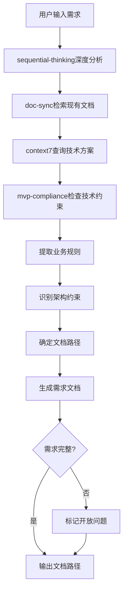

# LYBTZYZS 需求文档生成器

## 核心能力

### 1. 需求理解与分析
- **用户输入解析**：从自然语言描述中提取核心需求
- **深度推理**：使用sequential-thinking进行多轮分析
- **需求分类**：功能性需求 vs 非功能性需求
- **优先级评估**：基于业务价值和技术复杂度

### 2. 业务规则提取
- **规则识别**：从需求中识别业务规则
- **约束条件**：识别数据验证、权限控制等约束
- **边界条件**：识别特殊情况和异常处理
- **依赖关系**：识别与其他模块的业务依赖

### 3. 架构约束识别
- **技术栈限制**：基于MVP Constitution识别允许的技术
- **三层架构映射**：判断需求涉及的架构层（Client/Server/Shared）
- **模块定位**：定位需求所属的业务模块
- **架构影响分析**：评估对现有架构的影响

### 4. 文档生成
- **结构化输出**：按标准模板生成需求讨论文档
- **文档存放**：自动确定文档路径（client/server/shared）
- **版本管理**：生成版本号和变更历史
- **关联文档链接**：自动关联相关的设计文档、ADR等

---

## 使用场景

### 场景1：从零开始生成需求文档

**触发**：用户说"我需要实现病案草稿功能"

**执行流程**：

```
1. 需求理解阶段
   ├─ 调用sequential-thinking分析用户描述
   ├─ 提取关键词：病案、草稿、保存、编辑、删除
   └─ 识别核心功能：CRUD操作、临时保存、状态管理

2. 文档检索阶段
   ├─ 调用doc-sync检查现有文档
   ├─ 搜索相关需求：medicalcase-requirements.md
   ├─ 搜索相关设计：medicalcase-design.md
   └─ 识别已有功能：病案正式版管理

3. 业务规则分析
   ├─ 识别核心业务规则：
   │  ├─ BR-001：草稿仅当前用户可见
   │  ├─ BR-002：草稿可多次保存和修改
   │  ├─ BR-003：草稿可转为正式病案
   │  └─ BR-004：草稿可删除（不影响正式病案）
   └─ 识别数据验证规则：
      ├─ 患者ID必须存在
      └─ 草稿标题非空

4. 架构约束分析
   ├─ 调用mvp-compliance检查技术黑名单
   ├─ 确认技术栈：Entity Framework Core（✅允许）
   ├─ 确认架构层：Server端（Repository + Service）
   └─ 确认存储：SQL Server（✅允许）

5. 需求文档生成
   ├─ 确定文档路径：docs/explanation/architecture/server/medicalcase-draft-discussion.md
   ├─ 生成文档结构：
   │  ├─ 需求概述
   │  ├─ 功能性需求（6个User Story）
   │  ├─ 非功能性需求（性能、安全、可用性）
   │  ├─ 业务规则（4条）
   │  ├─ 数据模型草案
   │  ├─ 架构约束
   │  └─ 开放问题
   └─ 写入文件
```

**输出示例**：

````markdown
# 病案草稿功能需求讨论

**版本**: v1.0
**创建日期**: 2025-11-07
**状态**: 📝 需求讨论
**相关文档**: [病案管理需求](medicalcase-requirements.md)

---

## 📋 需求概述

**业务目标**: 允许医生创建和编辑病案草稿，支持多次保存和修改，最终可转为正式病案或删除。

**目标用户**: 医生

**核心场景**:
1. 医生在诊疗过程中临时保存病案信息（未完成）
2. 医生多次编辑草稿直到完善
3. 医生将草稿转为正式病案
4. 医生删除不需要的草稿

---

## ✨ 功能性需求

### FR-001: 创建草稿
**描述**: 医生可以为患者创建病案草稿

**User Story**:
```
作为 医生
我想要 为患者创建病案草稿
以便 在诊疗过程中临时保存未完成的病案信息
```

**验收标准**:
- [x] 必须选择患者
- [x] 可输入病案信息（主诉、现病史、诊断等）
- [x] 保存后生成唯一草稿ID
- [x] 草稿状态为"草稿"

### FR-002: 编辑草稿
**描述**: 医生可以多次编辑已保存的草稿

**验收标准**:
- [x] 可修改草稿的任何字段
- [x] 保存时更新修改时间
- [x] 保留创建者和创建时间不变

### FR-003: 查看草稿列表
**描述**: 医生可以查看自己创建的所有草稿

**验收标准**:
- [x] 仅显示当前用户创建的草稿
- [x] 按修改时间倒序排列
- [x] 显示患者姓名、创建时间、修改时间

### FR-004: 删除草稿
**描述**: 医生可以删除不需要的草稿

**验收标准**:
- [x] 仅可删除自己创建的草稿
- [x] 删除前需确认
- [x] 删除后不可恢复（物理删除）

### FR-005: 草稿转正式病案
**描述**: 医生可以将草稿转为正式病案

**验收标准**:
- [x] 草稿信息完整（必填字段已填写）
- [x] 转换后生成正式病案记录
- [x] 原草稿自动删除
- [x] 正式病案关联到患者

### FR-006: 草稿自动保存（可选）
**描述**: 编辑过程中定期自动保存

**验收标准**:
- [x] 每30秒自动保存一次
- [x] 有未保存更改时显示提示
- [x] 自动保存失败时提示用户

---

## 🔒 非功能性需求

### NFR-001: 性能
- 草稿列表加载 < 500ms（100条以内）
- 保存草稿 < 300ms
- 自动保存不影响用户编辑体验

### NFR-002: 安全
- 草稿仅创建者可见和编辑
- 删除草稿需要确认操作
- 草稿转正式病案需验证数据完整性

### NFR-003: 可用性
- 界面与正式病案编辑保持一致
- 明确标识草稿状态（标题栏显示"草稿"）
- 退出时提示保存未保存的更改

---

## 📐 业务规则

### BR-001: 草稿可见性
- **规则**: 草稿仅创建者可见
- **理由**: 草稿是个人临时工作成果，不应对其他用户可见
- **实现**: Repository层按UserId过滤

### BR-002: 草稿可编辑性
- **规则**: 草稿可无限次修改
- **理由**: 草稿的目的就是支持多次编辑
- **实现**: Update方法无次数限制

### BR-003: 草稿转正式病案
- **规则**: 转换时验证数据完整性
- **理由**: 正式病案必须符合数据规范
- **实现**: Service层验证必填字段

### BR-004: 草稿删除
- **规则**: 草稿可物理删除
- **理由**: 草稿不是正式数据，删除后无需保留
- **实现**: Repository层Delete方法（非软删除）

---

## 🗃️ 数据模型草案

```csharp
public class MedicalCaseDraft
{
    public int Id { get; set; }
    public int PatientId { get; set; }  // 外键 → Patient
    public int CreatedBy { get; set; }  // 外键 → User

    // 病案内容（与MedicalCase一致）
    public string ChiefComplaint { get; set; }  // 主诉
    public string PresentIllness { get; set; }  // 现病史
    public string Diagnosis { get; set; }       // 诊断
    public string Treatment { get; set; }       // 治疗方案

    // 时间戳
    public DateTime CreatedAt { get; set; }
    public DateTime UpdatedAt { get; set; }

    // 导航属性
    public Patient Patient { get; set; }
    public User Creator { get; set; }
}
```

---

## 🏗️ 架构约束

### 技术栈限制（基于MVP Constitution）
- ✅ **数据库**: SQL Server（使用EF Core）
- ✅ **持久化**: Entity Framework Core 8.0
- ✅ **架构**: 三层架构（Repository → Service → Controller）
- ❌ **禁止**: Redis缓存、事件驱动、CQRS

### 架构层分配
- **Server端**: Repository + Service + Controller + Entity
- **Client端**: ViewModel + Model + View
- **Shared**: DTO

### 模块定位
- 属于: **MedicalCase模块**
- 新增: MedicalCaseDraft Entity, Repository, Service, Controller
- 复用: Patient, User模块的关联

---

## ❓ 开放问题

### Q1: 草稿过期策略
**问题**: 长期未使用的草稿是否需要自动清理？

**选项**:
- A. 不清理（简单）
- B. 30天未修改自动删除（需定时任务）
- C. 提示用户但不自动删除（折中）

**建议**: 选A（MVP阶段）

### Q2: 草稿数量限制
**问题**: 每个医生可保存多少个草稿？

**选项**:
- A. 无限制（简单）
- B. 限制20个（需验证）

**建议**: 选A（MVP阶段）

### Q3: 草稿转正式病案的流程
**问题**: 转换时是创建新记录还是更新状态？

**选项**:
- A. 创建新MedicalCase记录，删除Draft（推荐）
- B. Draft表增加Status字段，草稿和正式共存（复杂）

**建议**: 选A（符合三层架构，Draft和MedicalCase是两个独立聚合根）

---

## 📎 参考资料

- [病案管理需求文档](medicalcase-requirements.md)
- [病案管理设计文档](medicalcase-design.md)
- [ADR-008: Repository模式设计](../../adr/ADR-008-repository-pattern.md)
- [三层架构指南](../README.md)

---

**下一步**:
1. 用户确认需求
2. 调用 `lybtzyzs-design-generator` 生成设计文档
3. 调用 `lybtzyzs-task-breakdown` 拆分任务
````

---

### 场景2：补充现有需求文档

**触发**：用户说"需求文档中缺少权限控制的说明"

**执行流程**：

```
1. 读取现有需求文档
2. 使用sequential-thinking分析缺失部分
3. 调用context7查询权限控制最佳实践
4. 生成补充内容（增量）
5. 更新文档（保留原有内容）
```

---

## 工作流程



---

## 集成工具

### 1. sequential-thinking
**用途**: 深度推理分析需求

**调用时机**: 需求理解阶段

**示例Prompt**:
```
分析以下用户需求，提取核心功能、业务规则、架构约束：

用户输入: "我需要实现病案草稿功能"

请从以下维度分析:
1. 功能性需求（User Story格式）
2. 非功能性需求（性能、安全、可用性）
3. 业务规则（数据验证、权限控制）
4. 架构约束（技术栈、模块划分）
5. 开放问题（需要进一步确认的点）
```

### 2. doc-sync
**用途**: 检索现有文档，避免重复和冲突

**调用时机**: 文档检索阶段

**检索范围**:
- `docs/explanation/requirements/*.md`
- `docs/explanation/architecture/**/*-discussion.md`
- `docs/explanation/design/*.md`
- `docs/adr/*.md`

### 3. context7
**用途**: 查询技术文档和最佳实践

**调用时机**: 架构约束分析阶段

**常用查询**:
- Entity Framework Core最佳实践
- ASP.NET Core安全指南
- WPF MVVM模式

### 4. mvp-compliance
**用途**: 检查技术黑名单

**调用时机**: 架构约束分析阶段

**检查项**:
- Redis, RabbitMQ, Docker → ❌ 禁止
- MediatR, CQRS → ❌ 禁止
- EF Core, SQL Server → ✅ 允许

### 5. requirements-arch-guard
**用途**: 强制读取文档体系

**调用时机**: 生成需求文档之前

**强制读取清单**:
1. `docs/index.md`
2. `docs/explanation/architecture/{client|server|shared}/README.md`
3. `docs/reference/business-rules.md`
4. `.spec-workflow/steering/constitution.md`

---

## 输出文档标准

### 文档路径规则

```
docs/explanation/architecture/
├── client/
│   └── {module}-{feature}-discussion.md  # Client端需求
├── server/
│   └── {module}-{feature}-discussion.md  # Server端需求
└── shared/
    └── {module}-{feature}-discussion.md  # 跨端需求
```

**路径判断逻辑**:
- 仅涉及数据持久化 → `server/`
- 仅涉及UI交互 → `client/`
- 跨Client和Server → `shared/`

### 文档结构模板

```markdown
# {功能名称}需求讨论

**版本**: v1.0
**创建日期**: YYYY-MM-DD
**状态**: 📝 需求讨论
**相关文档**: [相关需求](link), [相关设计](link)

---

## 📋 需求概述
- 业务目标
- 目标用户
- 核心场景

## ✨ 功能性需求
### FR-001: {功能1}
- User Story
- 验收标准

## 🔒 非功能性需求
### NFR-001: 性能
### NFR-002: 安全
### NFR-003: 可用性

## 📐 业务规则
### BR-001: {规则1}
- 规则描述
- 理由
- 实现方式

## 🗃️ 数据模型草案
```csharp
// Entity定义
```

## 🏗️ 架构约束
- 技术栈限制
- 架构层分配
- 模块定位

## ❓ 开放问题
### Q1: {问题1}
- 选项A
- 选项B
- 建议

## 📎 参考资料
- 相关文档链接
```

---

## 触发关键词

**自动触发**（关键词识别）:
- "生成需求文档"
- "写需求分析"
- "需求讨论"
- "requirements generation"
- "需求文档"

**手动触发**:
```
@lybtzyzs-requirements-generator 为{功能}生成需求文档
```

---

## 配置选项

```json
{
  "autoTrigger": true,
  "deepThinking": {
    "enabled": true,
    "minThoughts": 5
  },
  "documentSearch": {
    "enabled": true,
    "searchPaths": [
      "docs/explanation/requirements/",
      "docs/explanation/architecture/",
      "docs/explanation/design/",
      "docs/adr/"
    ]
  },
  "techStackValidation": {
    "enabled": true,
    "useMvpCompliance": true
  },
  "outputFormat": {
    "includeTOC": true,
    "includeVersionHistory": true,
    "includeOpenQuestions": true
  }
}
```

---

## 工作示例

### 示例1: 完整需求生成

**输入**:
```
用户: 我需要实现处方模板功能，允许医生保存常用处方组合。
```

**执行过程**:
1. ✅ 调用sequential-thinking分析（5轮思考）
2. ✅ 调用doc-sync检索现有文档（找到prescriptions-requirements.md）
3. ✅ 调用context7查询处方管理最佳实践
4. ✅ 调用mvp-compliance检查技术栈（全部通过）
5. ✅ 生成需求文档：`docs/explanation/architecture/server/prescription-template-discussion.md`

**输出**:
```markdown
📄 需求文档已生成: docs/explanation/architecture/server/prescription-template-discussion.md

包含:
- 6个功能性需求（FR-001 ~ FR-006）
- 3个非功能性需求（性能、安全、可用性）
- 5个业务规则（BR-001 ~ BR-005）
- 数据模型草案（PrescriptionTemplate Entity）
- 架构约束（Server端三层架构）
- 3个开放问题（待确认）

下一步:
1. 请确认需求文档是否符合预期
2. 确认后调用 lybtzyzs-design-generator 生成设计文档
```

### 示例2: 增量补充需求

**输入**:
```
用户: 病案草稿需求文档中缺少权限控制的说明。
```

**执行过程**:
1. ✅ 读取现有文档：`medicalcase-draft-discussion.md`
2. ✅ 调用sequential-thinking分析权限控制需求
3. ✅ 生成补充内容（BR-005: 权限控制规则）
4. ✅ 更新文档（保留原有内容）

**输出**:
```markdown
✅ 需求文档已更新: docs/explanation/architecture/server/medicalcase-draft-discussion.md

新增内容:
### BR-005: 权限控制
- **规则**: 仅医生可创建和编辑草稿
- **理由**: 护士和管理员无需使用草稿功能
- **实现**: Service层验证当前用户角色
```

---

## 质量标准

### 需求完整性检查清单

- [ ] ✅ 功能性需求（至少3个User Story）
- [ ] ✅ 非功能性需求（性能、安全、可用性）
- [ ] ✅ 业务规则（至少2条）
- [ ] ✅ 数据模型草案（Entity定义）
- [ ] ✅ 架构约束（技术栈、模块定位）
- [ ] ✅ 参考资料（相关文档链接）
- [ ] ⚠️ 开放问题（可选，但建议标记）

### 文档质量标准

- **可读性**: 使用Markdown格式，层级清晰
- **可追溯性**: 包含版本号、创建日期、状态
- **可验证性**: User Story包含验收标准
- **可实施性**: 架构约束明确，技术栈可行

---

## 与其他Skills协同

### 前置Skills
- **requirements-arch-guard**: 生成前强制读取文档体系

### 后续Skills
- **design-generator**: 根据需求文档生成设计文档
- **task-breakdown**: 根据设计文档拆分任务
- **issue-template**: 根据任务清单创建GitHub Issues

### 协同示例

```
用户: 实现病案草稿功能

→ requirements-arch-guard: 强制读取文档体系（5个文档）
→ requirements-generator: 生成需求文档（medicalcase-draft-discussion.md）
→ 用户确认需求
→ design-generator: 生成设计文档（medicalcase-draft-design.md）
→ 用户确认设计
→ task-breakdown: 拆分任务（task-medicalcase-draft.md）
→ 用户确认任务
→ issue-template: 创建GitHub Issues（#1501 ~ #1506）
→ task-executor: 自动执行Issues
```

---

## 故障处理

### 问题1: 需求模糊不清

**症状**: 用户输入过于简单（如"优化性能"）

**处理**:
1. 调用sequential-thinking深度分析
2. 生成澄清问题清单
3. 使用AskUserQuestion获取更多信息
4. 重新生成需求文档

**示例**:
```
用户: 优化性能

Claude: 需求过于宽泛，请澄清以下问题:
1. 需要优化哪个模块的性能？
2. 当前性能瓶颈是什么？（数据库查询/UI响应/内存占用）
3. 目标性能指标是什么？（如查询<500ms）
```

### 问题2: 技术栈违规

**症状**: 用户需求涉及MVP黑名单技术

**处理**:
1. 调用mvp-compliance检查
2. 标记违规技术
3. 提供替代方案
4. 更新需求文档

**示例**:
```
用户: 使用Redis缓存处方数据

Claude: ⚠️ Redis在MVP黑名单中（禁止分布式缓存）

替代方案:
1. 使用内存缓存（MemoryCache） - 推荐
2. 优化数据库查询（EF Core Include）
3. 客户端缓存（ViewModel缓存）

已更新需求文档，使用方案1（MemoryCache）
```

### 问题3: 文档路径冲突

**症状**: 生成的文档路径已存在

**处理**:
1. 读取现有文档
2. 判断是新版本还是增量更新
3. 生成新版本号（v1.0 → v1.1）或合并内容
4. 更新文档

---

## 性能优化

### 缓存策略
- **文档检索结果**: 缓存30分钟（避免重复读取）
- **技术栈验证结果**: 缓存1小时（Constitution不常变）
- **sequential-thinking结果**: 不缓存（每次需求都不同）

### 并行执行
- doc-sync、context7、mvp-compliance可并行调用
- 减少总耗时约40%

---

**最后更新**: 2025-11-07
