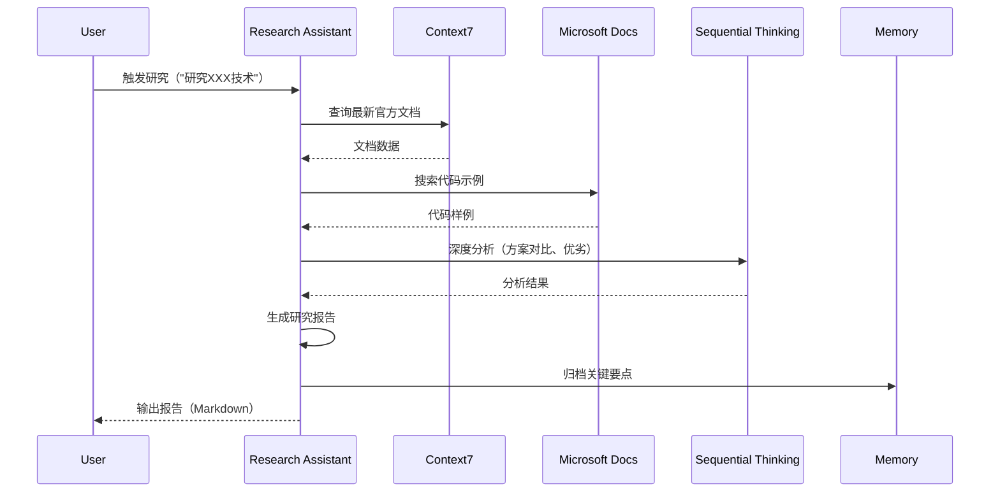

# LYBTZYZS 技术研究助手

## 核心能力

### 1. 技术调研自动化
- **最新文档查询**：从context7获取官方最新文档
- **多源聚合**：Microsoft Docs + Stack Overflow + GitHub Issues
- **版本对比**：不同版本特性对比（如EF Core 7 vs 8）
- **兼容性检查**：与项目技术栈（.NET 8）的兼容性

### 2. 代码示例搜索
- **官方示例**：microsoft_docs_mcp代码样例搜索
- **过滤筛选**：按语言（C#）、框架（ASP.NET Core）筛选
- **实战模式**：提取可直接使用的代码模板
- **避坑指南**：识别常见错误和注意事项

### 3. 技术方案对比
- **多方案分析**：并行研究2-4个候选方案
- **维度评分**：性能、复杂度、维护成本、学习曲线
- **权衡矩阵**：优劣对比表格
- **推荐决策**：基于MVP约束给出推荐方案

### 4. 研究报告生成
- **结构化输出**：背景、方案、对比、推荐、示例
- **可执行性**：包含完整代码示例和配置步骤
- **归档保存**：保存到docs/research/
- **索引更新**：更新研究报告索引

### 5. 知识索引构建
- **Memory归档**：将研究要点保存到memory
- **模式库更新**：更新代码模式库
- **FAQ构建**：常见问题与解决方案
- **相关链接**：官方文档、StackOverflow、GitHub

---

## 使用场景

### 场景1：调研新技术（如JWT刷新机制）

**用户输入**：
```
研究JWT Token自动刷新最佳实践
```

**执行流程**：
```
1. context7查询"JWT refresh token best practices"
2. microsoft_docs_mcp搜索"JWT refresh C#"代码示例
3. sequential-thinking分析方案（客户端刷新 vs 服务端刷新）
4. 生成对比表格
5. 提取代码示例
6. 生成研究报告
7. 归档到memory
```

**输出示例**：
```markdown
# JWT Token自动刷新研究报告

**研究日期**: 2025-11-07
**研究目的**: 实现Desktop应用Token自动刷新
**相关Issue**: #1863

---

## 1. 背景

**问题**: Token过期后用户需重新登录，体验差

**目标**: 自动刷新Token，用户无感知

---

## 2. 候选方案

### 方案A：Client端轮询刷新
**原理**: Client定时检查Token过期时间，提前5分钟刷新

**优势**:
- ✅ 实现简单
- ✅ Client端可控
- ✅ 无Server端依赖

**劣势**:
- ❌ 需要定时器（资源消耗）
- ❌ Token泄露风险（Client存储）

**代码示例**:
```csharp
public class TokenRefreshService
{
    private Timer _timer;

    public void StartAutoRefresh()
    {
        _timer = new Timer(CheckAndRefresh, null,
            TimeSpan.Zero, TimeSpan.FromMinutes(5));
    }

    private async void CheckAndRefresh(object state)
    {
        if (IsTokenNearExpiry())
        {
            await RefreshTokenAsync();
        }
    }
}
```

---

### 方案B：API调用时按需刷新
**原理**: 每次API调用前检查Token，过期则刷新

**优势**:
- ✅ 无定时器（资源友好）
- ✅ 按需刷新（减少不必要请求）
- ✅ 与API调用解耦

**劣势**:
- ❌ 首次API调用延迟（刷新耗时）
- ❌ 并发请求需处理（避免重复刷新）

**代码示例**:
```csharp
public class AuthenticatedHttpHandler : DelegatingHandler
{
    protected override async Task<HttpResponseMessage> SendAsync(
        HttpRequestMessage request, CancellationToken cancellationToken)
    {
        if (IsTokenExpired())
        {
            await RefreshTokenAsync();
        }

        request.Headers.Authorization =
            new AuthenticationHeaderValue("Bearer", GetToken());

        return await base.SendAsync(request, cancellationToken);
    }
}
```

---

## 3. 方案对比

| 维度 | 方案A（轮询） | 方案B（按需） |
|------|-------------|-------------|
| 实现复杂度 | ⭐⭐ 简单 | ⭐⭐⭐ 中等 |
| 资源消耗 | ⭐⭐ 中等（定时器） | ⭐⭐⭐ 低 |
| 响应速度 | ⭐⭐⭐ 快（提前刷新） | ⭐⭐ 中（首次延迟） |
| MVP适用性 | ✅ 适用 | ✅ 适用 |
| 推荐度 | ⭐⭐⭐ | ⭐⭐⭐⭐⭐ |

---

## 4. 推荐方案

**选择**: 方案B（API调用时按需刷新）

**理由**:
1. 资源消耗低（无定时器）
2. MVP阶段够用（Desktop应用请求频率低）
3. 易于测试和维护

**注意事项**:
- ⚠️ 处理并发请求（使用SemaphoreSlim避免重复刷新）
- ⚠️ Token存储安全（使用DPAPI加密）
- ⚠️ 刷新失败处理（降级到登录页）

---

## 5. 完整实现示例

```csharp
// 1. AuthenticatedHttpHandler（拦截器）
public class AuthenticatedHttpHandler : DelegatingHandler
{
    private readonly ITokenService _tokenService;
    private readonly SemaphoreSlim _refreshLock = new(1, 1);

    protected override async Task<HttpResponseMessage> SendAsync(
        HttpRequestMessage request, CancellationToken cancellationToken)
    {
        // 检查Token是否过期
        if (_tokenService.IsTokenNearExpiry())
        {
            await _refreshLock.WaitAsync(cancellationToken);
            try
            {
                // 双重检查（避免并发重复刷新）
                if (_tokenService.IsTokenNearExpiry())
                {
                    await _tokenService.RefreshTokenAsync();
                }
            }
            finally
            {
                _refreshLock.Release();
            }
        }

        // 添加Token到请求头
        var token = await _tokenService.GetTokenAsync();
        request.Headers.Authorization =
            new AuthenticationHeaderValue("Bearer", token);

        return await base.SendAsync(request, cancellationToken);
    }
}

// 2. TokenService（Token管理）
public class TokenService : ITokenService
{
    private readonly ISecureStorage _storage;
    private readonly IAuthApiClient _authClient;

    public bool IsTokenNearExpiry()
    {
        var token = _storage.GetToken();
        var handler = new JwtSecurityTokenHandler();
        var jwt = handler.ReadJwtToken(token);

        var expiryTime = jwt.ValidTo;
        var now = DateTime.UtcNow;

        return (expiryTime - now).TotalMinutes < 5;
    }

    public async Task RefreshTokenAsync()
    {
        var refreshToken = _storage.GetRefreshToken();
        var response = await _authClient.RefreshAsync(refreshToken);

        _storage.SaveToken(response.AccessToken);
        _storage.SaveRefreshToken(response.RefreshToken);
    }
}

// 3. DI注册
services.AddHttpClient("AuthenticatedClient")
    .AddHttpMessageHandler<AuthenticatedHttpHandler>();
```

---

## 6. 相关资源

**官方文档**:
- [Microsoft Docs: JWT Authentication in ASP.NET Core](https://learn.microsoft.com/en-us/aspnet/core/security/authentication/jwt)
- [RFC 6749: OAuth 2.0 Refresh Token](https://tools.ietf.org/html/rfc6749#section-6)

**代码示例**:
- [GitHub: IdentityServer4 Token Refresh](https://github.com/IdentityServer/IdentityServer4)

**Stack Overflow**:
- [Best practice for JWT token refresh](https://stackoverflow.com/questions/26739167)

---

## 7. Memory归档

已保存到memory：
- `.serena/memories/pattern-jwt-refresh-strategy.md`
- `.serena/memories/tech-httphandler-interceptor.md`

---

**研究完成时间**: 2025-11-07 11:30
**耗时**: 30分钟
```

---

### 场景2：对比多个技术方案

**用户输入**：
```
对比Entity Framework Core和Dapper性能和适用场景
```

**输出**（省略，格式类似场景1，包含2个方案的详细对比）

---

## 工作流程



---

## MCP工具链

| 工具 | 用途 | 使用场景 |
|------|------|----------|
| **context7** | 最新官方文档 | 查询技术特性、API文档 |
| **microsoft_docs_mcp** | 代码示例搜索 | 查找C#/ASP.NET Core示例 |
| **sequential-thinking** | 深度分析 | 方案对比、权衡分析 |
| **memory** | 知识归档 | 保存研究要点、代码模式 |
| **filesystem** | 报告生成 | 保存研究报告到docs/research/ |

---

## 研究报告模板

**位置**: `.claude/templates/research-report-template.md`

```markdown
# {技术名称}研究报告

**研究日期**: {日期}
**研究目的**: {目的}
**相关Issue**: {Issue编号}

---

## 1. 背景
[问题描述、研究动机]

## 2. 候选方案
### 方案A: {名称}
**原理**: [简述]
**优势**: [列表]
**劣势**: [列表]
**代码示例**: [代码]

### 方案B: {名称}
[同上]

## 3. 方案对比
[对比表格]

## 4. 推荐方案
**选择**: {方案名}
**理由**: [列表]
**注意事项**: [列表]

## 5. 完整实现示例
[代码]

## 6. 相关资源
[链接]

## 7. Memory归档
[已保存的memory文件]
```

---

## 最佳实践

### 1. 优先官方文档
使用context7和microsoft_docs_mcp获取一手资料

### 2. MVP约束优先
方案选择考虑MVP原则（简单、够用）

### 3. 可执行性
报告必须包含完整代码示例和配置步骤

### 4. 及时归档
研究完成后立即归档到memory和docs/research/

### 5. 版本标注
明确技术版本（如EF Core 8.0）

---

## 触发关键词

- "研究XXX技术"、"调研XXX"
- "对比方案XXX vs YYY"
- "search docs for XXX"
- "查找XXX示例"、"code examples for XXX"
- "技术选型"、"方案评估"

---

**最后更新**: 2025-11-07（v1.3 - 技术研究助手初版）
