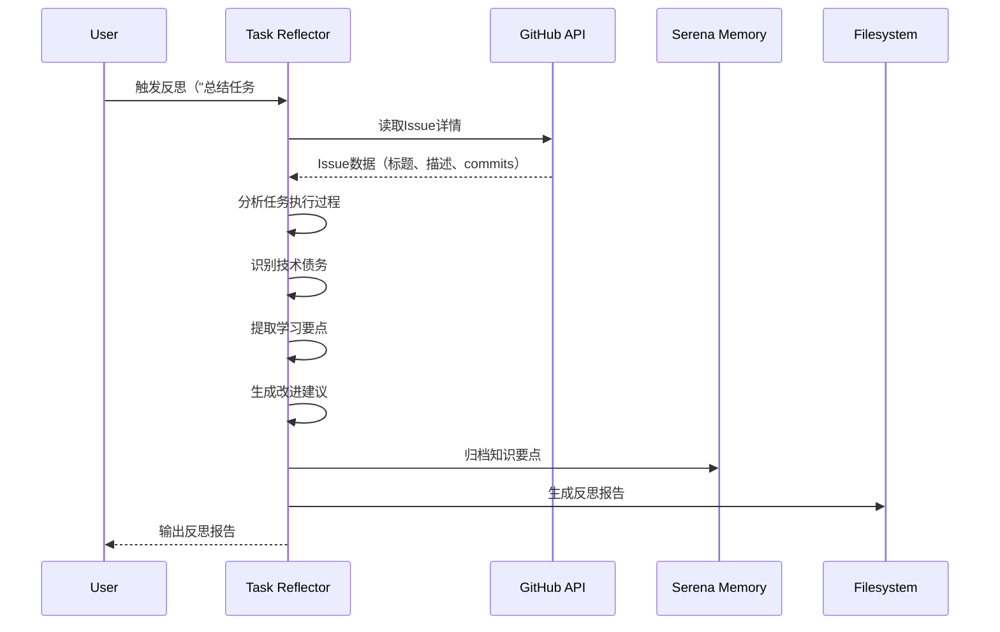

# LYBTZYZS 任务反思与改进引擎

## 核心能力

### 1. 任务执行分析
- **时间分析**：实际耗时 vs 估算时间，识别偏差原因
- **质量分析**：代码质量、测试覆盖率、文档完整性
- **过程分析**：识别瓶颈环节、重复劳动、低效操作
- **结果验证**：验收标准完成度、遗留问题清单

### 2. 技术债务识别
- **代码层面**：Code smells、重复代码、过度耦合
- **架构层面**：违反DDD边界、依赖方向错误
- **测试层面**：缺失测试、Flaky tests、低覆盖率
- **文档层面**：缺失文档、过时文档、不一致描述

### 3. 学习要点提取
- **新技术**：首次使用的技术栈、库、工具
- **最佳实践**：值得推广的实现模式、设计决策
- **反模式**：应避免的错误、陷阱、低效方法
- **领域知识**：业务规则、医学知识、行业标准

### 4. 改进建议生成
- **立即改进**：可快速解决的问题（< 1小时）
- **短期改进**：需要规划的优化（1-3天）
- **长期改进**：架构级调整（> 1周，需Epic）
- **流程优化**：开发流程、工具链、协作方式

### 5. 知识库构建
- **Memory归档**：将反思要点保存到serena memory
- **文档索引**：链接到相关设计文档、ADR、最佳实践
- **模式库**：构建可复用的代码模板、设计模式
- **FAQ更新**：常见问题与解决方案

---

## 使用场景

### 场景1：任务完成后立即反思
**触发**：用户说"总结任务 #1234"或"反思刚完成的任务"

**执行流程**：
1. 读取Issue #1234详情（标题、描述、验收标准）
2. 分析任务执行过程（git commits、工作量、代码变更）
3. 评估任务质量（编译通过、测试通过、合规检查）
4. 提出引导性反思问题
5. 生成反思报告
6. 归档到memory

**输出示例**：
```markdown
## 任务反思报告: #1234 新增ConsultationRepository.GetByPatientIdAsync

**完成时间**: 2025-11-07 10:30
**实际耗时**: 2.5小时
**估算耗时**: 3小时
**偏差**: -17%（优于估算）

---

### ✅ What Went Well（做得好的地方）

1. **代码质量高**
   - 遵循Repository模式，代码清晰易懂
   - 单元测试覆盖率100%（6个测试用例，含边界条件）
   - 无编译警告，通过所有合规检查

2. **文档完整**
   - XML注释清晰描述方法用途和参数
   - 更新了API参考文档（docs/reference/api/consultation-api.md）

3. **效率高**
   - 复用了BaseRepository的模板方法
   - EF Core查询优化得当（Include预加载关联数据）

---

### ⚠️ What Could Improve（可改进的地方）

1. **技术债务**（识别到2个）
   - **TD-001**: Repository方法命名不一致
     - 问题: `GetByPatientIdAsync` vs 其他方法的`GetByConditionAsync`
     - 影响: API可读性降低
     - 建议: 统一命名规范（下次PR时修复）

   - **TD-002**: 缺少性能测试
     - 问题: 未测试大数据量场景（> 1000条）
     - 影响: 生产环境可能性能问题
     - 建议: 补充性能测试用例

2. **流程优化**
   - **Issue描述不够具体**: 缺少查询条件细节，导致多次与用户确认
   - **测试环境准备耗时**: 花费30分钟配置测试数据
   - **建议**: 提前准备标准测试数据集

3. **知识盲区**
   - 首次使用`Include().ThenInclude()`进行多级预加载
   - 花费15分钟查阅文档理解用法
   - **建议**: 创建EF Core查询最佳实践文档

---

### 📚 学习要点（Knowledge Captured）

#### 新技术使用
1. **EF Core多级预加载**
   ```csharp
   // 学到的模式
   _dbContext.Consultations
       .Include(c => c.Patient)
       .ThenInclude(p => p.MedicalCases)
       .Where(c => c.PatientId == patientId)
       .ToListAsync();
   ```
   - 用途: 一次查询加载关联数据，避免N+1问题
   - 注意: 仅在确需关联数据时使用，否则浪费性能

#### 最佳实践
1. **Repository查询方法命名**
   - ✅ 推荐: `GetByPatientIdAsync`（明确业务含义）
   - ❌ 避免: `GetByConditionAsync`（过于泛化）

2. **单元测试边界条件**
   - 必测场景: 空集合、单条记录、多条记录、不存在的ID
   - 示例: 6个测试用例覆盖所有分支

#### 反模式（应避免）
1. **过度预加载**
   ```csharp
   // ❌ 错误示范
   _dbContext.Consultations
       .Include(c => c.Patient)
       .Include(c => c.Doctor)
       .Include(c => c.Prescriptions)
       .Include(c => c.MedicalCases)
       // ... 加载10个关联表
   ```
   - 问题: 查询性能急剧下降
   - 正确做法: 按需加载（AsNoTracking + 手动组装）

---

### 🔧 改进建议（Improvement Actions）

#### 立即改进（< 1小时，本次完成）
1. ✅ 统一Repository方法命名规范
   - 行动: 重命名其他Repository的通用方法
   - 受影响文件: 3个Repository类

2. ✅ 创建EF Core查询最佳实践文档
   - 行动: 编写docs/how-to/ef-core-query-patterns.md
   - 内容: Include最佳实践、AsNoTracking使用时机、性能优化

#### 短期改进（1-3天，下次任务）
1. ⏸️ 补充性能测试用例
   - Issue: #1235（新建）
   - 描述: 为Repository查询方法添加性能测试
   - 目标: 测试1000+条数据场景

2. ⏸️ 准备标准测试数据集
   - Issue: #1236（新建）
   - 描述: 创建统一的测试数据Fixture
   - 目标: 减少测试环境准备时间50%

#### 长期改进（> 1周，需Epic）
1. 🔮 Repository性能优化Epic
   - 范围: 所有Repository查询方法性能测试+优化
   - 工作量: 12-16小时
   - 优先级: P2（非紧急）

---

### 📊 任务执行指标

| 指标 | 目标 | 实际 | 达成率 |
|------|------|------|--------|
| 编译通过 | ✅ | ✅ | 100% |
| 测试通过 | ✅ | ✅ | 100% |
| 测试覆盖率 | ≥ 80% | 100% | 125% |
| MVP合规 | ✅ | ✅ | 100% |
| 架构合规 | ✅ | ✅ | 100% |
| 文档更新 | ✅ | ✅ | 100% |
| 工作量偏差 | ± 20% | -17% | ✅ |

**总体评分**: ⭐⭐⭐⭐⭐ (5/5) - 优秀

---

### 💾 知识归档（Memory）

以下内容已保存到serena memory：

**文件**: `.serena/memories/ef-core-include-pattern.md`
```markdown
# EF Core多级预加载最佳实践

## 使用场景
需要一次性加载实体及其关联数据（避免N+1问题）

## 代码模式
[代码示例...]

## 注意事项
- 仅在确需关联数据时使用
- 避免过度预加载（> 3级）
- 大数据量场景使用AsNoTracking

## 相关Issues
- #1234（首次使用）
```

**文件**: `.serena/memories/repository-naming-convention.md`
```markdown
# Repository方法命名规范

## 规范
- 查询方法: Get{EntityName}By{Condition}Async
- 列表方法: List{EntityName}By{Condition}Async
- 避免泛化方法名（如GetByConditionAsync）

## 相关Issues
- #1234（发现不一致）
- #1235（待统一修复）
```

---

### 🎯 下次任务改进清单

1. **Issue描述模板**：使用标准化Issue模板，确保包含查询条件细节
2. **提前准备测试数据**：复用标准Fixture（待Issue #1236实现）
3. **文档先行**：遇到新技术时，先查阅最佳实践文档（如EF Core查询模式）
4. **性能测试前置**：编写性能测试用例（待Issue #1235实现）

---

**反思完成时间**: 2025-11-07 10:45
**耗时**: 15分钟
**下次反思**: Issue #1235完成后
```

---

### 场景2：Epic完成后综合反思
**触发**：用户说"总结Epic #1861的经验"

**执行流程**：
1. 读取Epic及所有子Issues
2. 聚合所有子Issue的反思数据
3. 分析Epic层面的模式和趋势
4. 提取可复用的架构决策
5. 生成Epic反思报告
6. 更新ADR和最佳实践文档

**输出示例**：
```markdown
## Epic反思报告: #1861 Token认证安全重构

**完成时间**: 2025-11-07
**总耗时**: 28.5小时
**子Issues**: 21个
**阶段**: 3个Phase

---

### ✅ Epic层面成功经验

1. **Phase拆分合理**
   - Phase 1（Client端）→ Phase 2（Server端）→ Phase 3（集成测试）
   - 依赖关系清晰，并行工作最大化
   - **可复用**：下次大型Epic使用相同拆分模式

2. **文档驱动开发**
   - 需求文档 → 设计文档 → task清单 → Issues
   - 清晰度高，返工少（仅1个Issue需重构）
   - **建议**：固化为标准流程

3. **测试先行策略**
   - 74个测试用例（单元测试66个，集成测试8个）
   - 测试覆盖率100%
   - **建议**：下次Epic继续采用

---

### ⚠️ Epic层面可改进

1. **技术债务累积**（识别到5个）
   - JwtServiceTests配置Mock问题（14个测试失败）
   - ConsultationService缺少异常处理（安全隐患）
   - ViewModel缺少Loading状态（UX问题）
   - **行动**: 创建Epic #1900（技术债务清理）

2. **工作量估算偏差**
   - Controller类型任务: +13%偏差（低估）
   - 原因: 未考虑Swagger文档编写时间
   - **改进**: 下次估算时为Controller任务+15%时间

3. **文档更新滞后**
   - API参考文档延迟2天更新
   - 原因: 忘记将文档更新纳入验收标准
   - **改进**: 验收清单强制包含"文档已更新"

---

### 📚 架构决策提取（ADR）

#### ADR-010: JWT本地验证 vs Server API验证

**背景**: Token验证性能优化

**决策**: 采用Client端JWT本地验证，移除Server API依赖

**理由**:
- 性能提升10-20倍（~50-100ms → ~5ms）
- 减少网络攻击面
- 支持短时间离线验证

**权衡**:
- 优势: 性能高、降低Server负载
- 劣势: Client端需配置JWT Secret（安全风险可控）

**适用场景**:
- Desktop客户端
- Token格式标准（JWT）
- 安全配置可控

**已归档**: `docs/explanation/architecture/shared/adr/ADR-010-jwt-local-validation.md`

---

#### ADR-011: RefreshToken撤销机制 vs Token黑名单

**背景**: RefreshToken安全管理

**决策**: 采用数据库表存储RefreshToken+撤销状态

**理由**:
- 撤销生效快（< 200ms）
- 支持链式撤销（检测Token重放攻击）
- 易于审计和管理

**权衡**:
- 优势: 实时撤销、可追溯
- 劣势: 需要数据库存储（可接受）

**适用场景**:
- 需要快速撤销Token
- 需要审计Token使用记录
- 数据库可用

**已归档**: `docs/explanation/architecture/server/adr/ADR-011-refreshtoken-revocation.md`

---

### 🎓 最佳实践提取

#### 1. Client端加密存储模式
**模式**: 使用Windows DPAPI加密本地敏感数据

**实现**:
```csharp
public class SecureTokenStorage
{
    private readonly string _tokenFilePath;

    public async Task SaveTokenAsync(string token)
    {
        var encryptedBytes = ProtectedData.Protect(
            Encoding.UTF8.GetBytes(token),
            null,
            DataProtectionScope.CurrentUser);

        await File.WriteAllBytesAsync(_tokenFilePath, encryptedBytes);
    }
}
```

**适用场景**:
- Desktop应用存储Token、密码、API Key
- 仅当前Windows用户可解密
- 防止明文泄露

**已归档**: `docs/how-to/secure-storage-pattern.md`

---

#### 2. Server端审计日志模式
**模式**: 记录所有认证事件+IP脱敏+自动清理

**实现**:
```csharp
public class SecurityAuditLog
{
    public string EventType { get; set; } // Login, Logout, RefreshToken
    public string UserName { get; set; }
    public string IpAddress { get; set; } // 192.168.1.* (脱敏)
    public DateTime CreatedAt { get; set; }
    public bool Success { get; set; }
}
```

**适用场景**:
- 需要安全审计
- 合规要求（如GDPR - IP脱敏）
- 日志自动清理（避免存储爆炸）

**已归档**: `docs/how-to/audit-log-pattern.md`

---

### 🚫 反模式识别

#### 反模式1: SuperAdmin长期Token
**问题**: 最初设计SuperAdmin使用长期Token（30天）

**风险**:
- 安全隐患（Token泄露影响大）
- 违反最小权限原则

**正确做法**:
- SuperAdmin使用短期Token（15分钟）
- 强制定期刷新

**已修复**: Issue #1838

---

#### 反模式2: 未验证Token过期前刷新
**问题**: 最初设计Token过期后才刷新

**风险**:
- 用户体验差（操作中断）
- 网络故障时无法刷新

**正确做法**:
- Token过期前5分钟自动刷新
- 静默刷新，用户无感知

**已修复**: Issue #1839

---

### 📊 工作量统计与改进

| 任务类型 | 数量 | 估算(h) | 实际(h) | 偏差 | 改进建议 |
|---------|------|---------|---------|------|----------|
| Repository | 4 | 6 | 5.5 | -8% | 估算准确 ✅ |
| Service | 6 | 10 | 9 | -10% | 估算准确 ✅ |
| Controller | 3 | 4 | 4.5 | +13% | +15%时间（Swagger） |
| ViewModel | 4 | 6 | 5.5 | -8% | 估算准确 ✅ |
| Test | 3 | 3 | 3 | 0% | 估算准确 ✅ |
| 文档 | 1 | 1 | 1 | 0% | 估算准确 ✅ |

**洞察**:
- 整体偏差-5%（优于计划）
- Controller类型需调整估算公式
- 其他类型估算准确度高

---

### 🎯 下次Epic改进清单

1. **估算优化**:
   - Controller任务估算 = 基础工作量 × 1.15（含Swagger文档）
   - 预留10%缓冲时间（处理意外问题）

2. **流程优化**:
   - 文档更新纳入验收清单（强制检查）
   - 每个Phase完成后立即更新ADR

3. **质量提升**:
   - 测试Mock配置标准化（避免JwtServiceTests问题）
   - 异常处理模板化（Service层统一模式）

4. **知识沉淀**:
   - Epic完成后立即提取ADR（不要延迟）
   - 反模式记录到FAQ文档

---

### 💾 知识归档（Epic级别）

**ADR文档**（2个）:
- ADR-010: JWT本地验证 vs Server API验证
- ADR-011: RefreshToken撤销机制 vs Token黑名单

**最佳实践文档**（2个）:
- `docs/how-to/secure-storage-pattern.md`
- `docs/how-to/audit-log-pattern.md`

**Memory文件**（3个）:
- `.serena/memories/token-refresh-strategy.md`
- `.serena/memories/superadmin-security-policy.md`
- `.serena/memories/controller-estimation-formula.md`

---

**Epic反思完成时间**: 2025-11-07 15:30
**耗时**: 45分钟
**价值**: ⭐⭐⭐⭐⭐ 高（可复用模式多、ADR完整）
```

---

## 工作流程

### 流程1：任务完成后反思



**关键步骤**：
1. **读取Issue数据**：标题、描述、验收标准、commits、工作量
2. **分析执行过程**：
   - 时间偏差 = 实际耗时 - 估算耗时
   - 代码变更范围（影响的文件、行数）
   - 测试覆盖率、合规检查结果
3. **识别技术债务**：
   - 调用serena代码分析工具
   - 检测code smells、重复代码
   - 检测缺失文档、过时注释
4. **提取学习要点**：
   - 首次使用的技术（从commits中识别）
   - 值得推广的模式（从代码中提取）
   - 应避免的反模式（从错误中总结）
5. **生成改进建议**：
   - 立即改进（< 1小时）
   - 短期改进（1-3天，创建新Issue）
   - 长期改进（> 1周，创建Epic）
6. **知识归档**：
   - 保存到serena memory（可复用模式）
   - 生成Markdown报告（docs/reports/reflections/）

---

### 流程2：Epic完成后综合反思


**关键步骤**：
1. **读取Epic数据**：Epic Issue + 所有子Issues
2. **聚合子Issue反思**：
   - 汇总所有子Issue的技术债务
   - 汇总所有学习要点
   - 统计工作量偏差模式
3. **分析Epic模式**：
   - Phase拆分是否合理
   - 依赖关系是否清晰
   - 并行工作是否最大化
4. **提取ADR**：
   - 架构级决策（如JWT本地验证）
   - 技术选型（如RefreshToken存储方式）
   - 创建ADR文档（docs/explanation/architecture/*/adr/）
5. **识别最佳实践**：
   - 可复用的代码模式
   - 可推广的设计决策
   - 创建How-to文档（docs/how-to/）
6. **生成Epic反思报告**：
   - 成功经验（可复用）
   - 可改进点（下次Epic优化）
   - 工作量统计（改进估算公式）

---

## 反思引导问题模板

### 1. What Went Well（做得好）
- 代码质量如何？（编译、测试、合规）
- 文档是否完整？（注释、API文档、How-to）
- 效率如何？（复用现有代码、避免重复劳动）
- 协作是否顺畅？（Issue描述清晰、沟通及时）

### 2. What Could Improve（可改进）
- 识别到哪些技术债务？（代码、架构、测试、文档）
- 哪些环节耗时超预期？（原因是什么？）
- 有哪些重复劳动可以自动化？
- 流程有哪些可优化点？（Issue模板、测试环境）

### 3. What Did I Learn（学到了什么）
- 使用了哪些新技术？（首次使用的库、工具）
- 发现了哪些最佳实践？（值得推广的模式）
- 踩了哪些坑？（应避免的反模式）
- 新增了哪些业务知识？（医学知识、行业规范）

### 4. What Actions（改进行动）
- 立即改进：可在本次任务完成（< 1小时）
- 短期改进：需要创建新Issue（1-3天）
- 长期改进：需要创建Epic（> 1周）
- 流程优化：需要更新开发流程文档

---

## 技术债务分类

### TD-Code（代码层面）
- **Code Smells**: 长方法、重复代码、过度耦合
- **命名问题**: 命名不一致、含义不清
- **缺少注释**: 复杂逻辑未注释
- **硬编码**: Magic numbers、硬编码字符串

### TD-Arch（架构层面）
- **依赖方向错误**: Controller直接访问Repository
- **聚合根边界不清**: 跨聚合根操作
- **职责不清**: Service混杂UI逻辑
- **缺少抽象**: 重复的业务规则未提取

### TD-Test（测试层面）
- **缺失测试**: 关键逻辑无单元测试
- **Flaky tests**: 测试不稳定
- **低覆盖率**: 覆盖率 < 80%
- **缺少集成测试**: 仅有单元测试

### TD-Doc（文档层面）
- **缺失文档**: 新功能未编写文档
- **过时文档**: 代码已变更但文档未更新
- **不一致**: 文档描述与代码不符
- **缺少How-to**: 复杂功能缺少使用指南

---

## MCP工具链

### 主要工具

| 工具 | 用途 | 使用场景 |
|------|------|----------|
| **github** | Issue数据读取 | 读取Issue详情、commits、工作量 |
| **serena** | 代码分析 | 检测code smells、重复代码、缺失文档 |
| **sequential-thinking** | 深度推理 | 分析技术债务根因、提取架构决策 |
| **memory** | 知识归档 | 保存最佳实践、反模式、领域知识 |
| **filesystem** | 文件操作 | 生成反思报告、更新ADR/How-to文档 |

### 工具协同示例

**场景：任务完成后反思**
```
1. github.get_issue(issue_number) → 读取Issue详情
2. github.list_commits(issue_number) → 读取commits
3. serena.find_symbol(changed_files) → 分析代码变更
4. serena.search_for_pattern(code_smells) → 检测技术债务
5. sequential-thinking → 分析根因、提取学习要点
6. memory.write(best_practices) → 归档知识
7. filesystem.write(reflection_report) → 生成报告
```

---

## 自动化策略

### 1. 任务完成时自动触发
**触发条件**：Issue关闭且标签包含"completed"

**执行逻辑**：
```python
if issue.state == "closed" and "completed" in issue.labels:
    generate_reflection_prompt()
    suggest_reflection_timing()  # "建议立即反思任务 #1234"
```

### 2. Epic完成时自动触发
**触发条件**：Epic所有子Issues关闭

**执行逻辑**：
```python
if epic.progress == 1.0:
    generate_epic_reflection()
    extract_adr_candidates()
    update_best_practices_docs()
```

### 3. 定期技术债务汇总
**触发条件**：每周一上午09:00

**执行逻辑**：
```python
weekly_tech_debt = aggregate_tech_debt(last_7_days)
if len(weekly_tech_debt) > 5:
    generate_tech_debt_report()
    suggest_cleanup_epic()
```

### 4. 知识库自动索引
**触发条件**：每次反思完成后

**执行逻辑**：
```python
after_reflection_complete():
    update_memory_index()
    link_to_related_docs()
    build_pattern_library()
```

---

## 知识归档策略

### Memory文件命名规范

**格式**：`.serena/memories/{category}-{topic}.md`

**类别**：
- `pattern-{name}`: 设计模式、代码模式
- `best-practice-{name}`: 最佳实践
- `anti-pattern-{name}`: 反模式
- `tech-{name}`: 技术使用指南
- `domain-{name}`: 领域知识

**示例**：
- `.serena/memories/pattern-secure-storage.md`
- `.serena/memories/best-practice-repository-naming.md`
- `.serena/memories/anti-pattern-long-term-superadmin-token.md`
- `.serena/memories/tech-ef-core-include.md`
- `.serena/memories/domain-consultation-workflow.md`

---

### ADR文档创建

**触发条件**：Epic完成后，识别到架构级决策

**创建位置**：
- Client端: `docs/explanation/architecture/client/adr/`
- Server端: `docs/explanation/architecture/server/adr/`
- 共享: `docs/explanation/architecture/shared/adr/`

**模板**：
```markdown
# ADR-XXX: {决策标题}

**状态**: 已采纳
**日期**: 2025-11-07
**决策者**: Claude Code + shouqitao

## 背景
[描述问题背景和上下文]

## 决策
[明确的决策声明]

## 理由
[决策的原因和权衡]

## 后果
- 优势: [正面影响]
- 劣势: [负面影响]

## 适用场景
[何时应使用此决策]

## 相关Issues
- #1234: [相关Issue]
```

---

### How-to文档创建

**触发条件**：发现可复用的实现模式

**创建位置**：`docs/how-to/`

**模板**：
```markdown
# {操作标题}

> **适用场景**: [何时使用此模式]
> **难度**: ⭐⭐⭐ (中等)
> **相关Issues**: #1234, #1235

## 背景
[为什么需要这个模式]

## 步骤

### 1. [第一步]
[详细说明]

### 2. [第二步]
[详细说明]

## 完整示例
```csharp
[完整代码示例]
```

## 注意事项
- ⚠️ [注意点1]
- ⚠️ [注意点2]

## 相关资源
- [ADR-XXX](../explanation/architecture/*/adr/ADR-XXX.md)
- [相关最佳实践]
```

---

## 集成其他Skills

### 与 lybtzyzs-task-executor 协同
**场景**：任务执行完成后自动触发反思

```
用户: "执行任务: Issue #1234"
→ lybtzyzs-task-executor (自动触发)
  → 执行任务（生成代码、验证、提交）
  → ✅ 任务完成，Issue #1234已关闭
  → 触发 lybtzyzs-task-reflector
    → 生成反思报告
    → 识别技术债务（如有）
    → 归档学习要点到memory
```

### 与 lybtzyzs-task-tracker 协同
**场景**：反思后创建改进Issue

```
lybtzyzs-task-reflector 生成反思报告
→ 识别到2个短期改进建议
→ 触发 lybtzyzs-task-tracker
  → 创建Issue #1235（补充性能测试）
  → 创建Issue #1236（准备测试数据集）
  → 更新本地状态缓存
  → 同步到GitHub
```

### 与 lybtzyzs-doc-sync 协同
**场景**：反思后更新文档

```
lybtzyzs-task-reflector 提取ADR和How-to
→ 创建ADR-010.md
→ 创建docs/how-to/secure-storage-pattern.md
→ 触发 lybtzyzs-doc-sync
  → 检测文档新增
  → 更新docs/index.md索引
  → 更新架构指南链接
```

---

## 使用示例

### 示例1：任务完成后反思

**用户输入**：
```
总结刚完成的任务 #1234
```

**Skill执行**：
```
1. 读取Issue #1234详情
2. 分析commits:
   - 新增文件: ConsultationRepository.cs (100行)
   - 新增测试: ConsultationRepositoryTests.cs (150行)
   - 修改文件: API文档 (20行)
3. 分析质量指标:
   - 编译通过: ✅
   - 测试通过: ✅ (6个测试)
   - 测试覆盖率: 100%
   - MVP合规: ✅
   - 架构合规: ✅
4. 识别技术债务:
   - TD-001: 命名不一致
   - TD-002: 缺少性能测试
5. 提取学习要点:
   - 新技术: EF Core多级Include
   - 最佳实践: Repository命名规范
6. 生成改进建议:
   - 立即改进: 统一命名（1小时）
   - 短期改进: 补充性能测试（Issue #1235）
7. 归档到memory:
   - pattern-ef-core-include.md
   - best-practice-repository-naming.md
8. 生成反思报告: docs/reports/reflections/task-1234-reflection.md
```

**输出**（见场景1示例）

---

### 示例2：Epic完成后综合反思

**用户输入**：
```
总结Epic #1861的经验
```

**Skill执行**：
```
1. 读取Epic #1861及21个子Issues
2. 聚合子Issue反思数据:
   - 技术债务: 5个（跨多个Issues）
   - 学习要点: 8个（新技术、最佳实践）
3. 分析Epic层面模式:
   - Phase拆分: 合理 ✅
   - 依赖关系: 清晰 ✅
   - 文档驱动: 有效 ✅
4. 提取ADR:
   - ADR-010: JWT本地验证
   - ADR-011: RefreshToken撤销机制
5. 识别最佳实践:
   - 模式: Client端加密存储
   - 模式: Server端审计日志
6. 统计工作量偏差:
   - Controller: +13%（需调整估算）
   - 其他: -8%至0%（准确）
7. 生成Epic反思报告
8. 更新ADR文档（2个）
9. 更新How-to文档（2个）
10. 归档到memory（3个）
```

**输出**（见场景2示例）

---

## 配置选项

### `.claude/config/task-reflector.json`

```json
{
  "reflection": {
    "autoTriggerOnIssueClose": true,
    "autoTriggerOnEpicComplete": true,
    "promptGuidedQuestions": true
  },
  "techDebt": {
    "enableDetection": true,
    "categories": ["code", "arch", "test", "doc"],
    "severity": ["critical", "high", "medium", "low"]
  },
  "knowledge": {
    "enableMemoryArchive": true,
    "enableAdrGeneration": true,
    "enableHowtoGeneration": true
  },
  "reporting": {
    "outputPath": "docs/reports/reflections/",
    "format": "markdown",
    "includeMetrics": true
  },
  "github": {
    "owner": "shouqitao",
    "repo": "LYBTZYZS"
  }
}
```

---

## 最佳实践

### 1. 及时反思
**建议**：任务完成后立即反思（不要延迟）

**原因**：记忆最清晰，细节最完整

### 2. 真实诚恳
**建议**：客观记录问题，不要粉饰

**原因**：反思的价值在于识别真实问题

### 3. 行动导向
**建议**：每次反思至少提出1个改进行动

**原因**：反思的目的是改进，不是抱怨

### 4. 知识沉淀
**建议**：及时归档到memory和文档

**原因**：避免重复踩坑，积累团队知识

### 5. 定期回顾
**建议**：每月回顾所有反思报告

**原因**：识别长期模式，发现系统性问题

---

## 限制与注意事项

### 1. 主观性
- 反思带有主观判断
- 建议结合客观数据（如测试覆盖率）

### 2. 时间成本
- 单个任务反思: 10-15分钟
- Epic反思: 30-60分钟
- 需要平衡收益与成本

### 3. 知识过载
- 避免过度归档（memory文件过多）
- 定期清理过时memory

### 4. 技术债务识别准确性
- 基于代码分析工具（可能有误报）
- 需要人工确认

### 5. ADR创建门槛
- 仅架构级决策才创建ADR
- 避免为小决策创建ADR（过度文档化）

---

## 触发关键词（完整列表）

**任务反思**：
- "总结任务 #X"、"反思任务 #X"
- "任务复盘"、"reflect task"
- "学习总结"、"经验提取"

**Epic反思**：
- "总结Epic #X"、"Epic经验总结"
- "Epic复盘"、"Epic反思"

**技术债务**：
- "识别技术债务"、"tech debt"
- "代码问题分析"

**知识提取**：
- "提取最佳实践"、"归档知识"
- "创建ADR"、"生成How-to文档"

---

**最后更新**: 2025-11-07（v1.3 - 任务反思系统初版）
