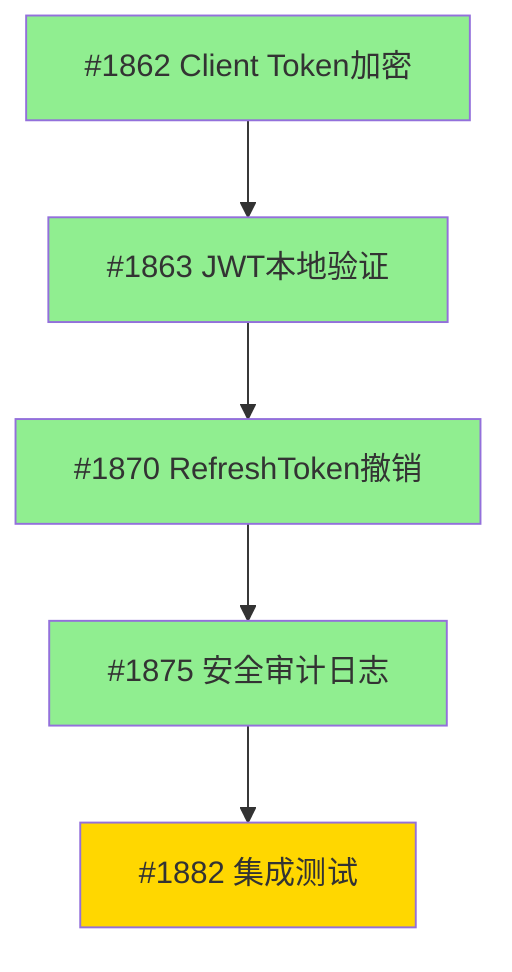
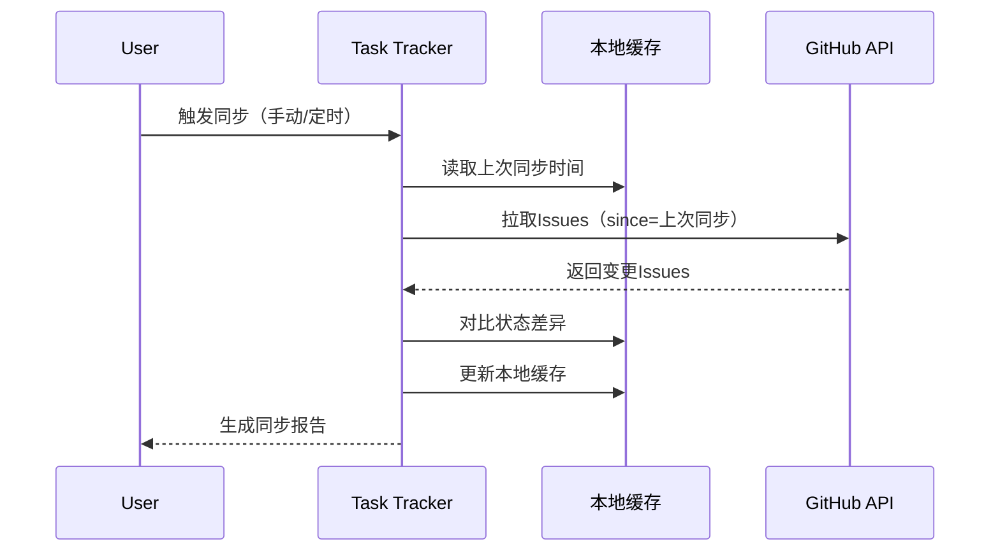
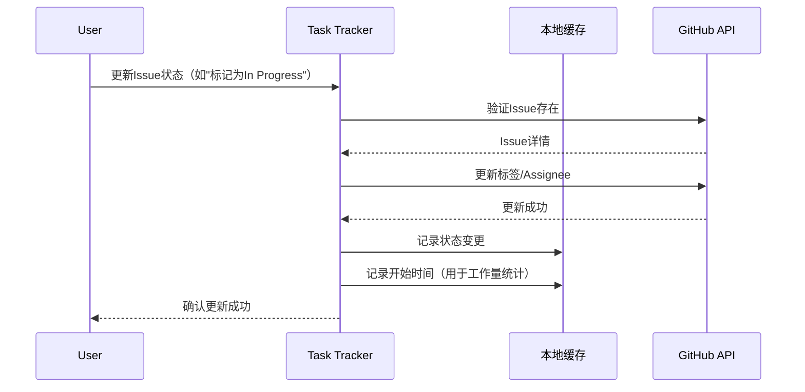
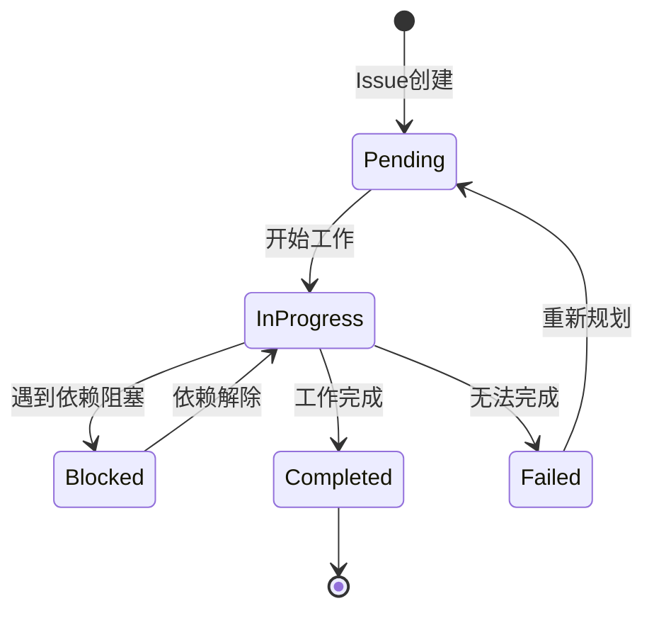

# LYBTZYZS 任务状态追踪器

## 核心能力

### 1. 任务状态双向同步
- **GitHub → 本地**：自动拉取Issue状态变更（Open/Closed/In Progress）
- **本地 → GitHub**：更新Issue标签、Assignee、Milestone
- **冲突解决**：GitHub优先策略（远程覆盖本地）
- **增量同步**：仅同步变更的Issues（基于updated_at时间戳）

### 2. 依赖关系管理
- **依赖图可视化**：生成Mermaid依赖关系图
- **阻塞检测**：自动识别被阻塞的任务（依赖未完成）
- **循环依赖检测**：检测并警告循环依赖
- **关键路径分析**：标识影响Epic完成的关键任务链

### 3. Epic进度聚合
- **自动计算**：Epic完成度 = 已完成子Issue数 / 总子Issue数
- **层级展示**：Epic → Feature → Task 三级结构
- **进度预警**：检测进度滞后（实际进度 < 计划进度 10%）
- **燃尽图数据**：生成Sprint燃尽图数据（剩余工作量 vs 时间）

### 4. 工作量记录
- **自动记录**：Issue从In Progress → Closed的耗时
- **对比分析**：实际耗时 vs 初始估算
- **偏差统计**：计算平均偏差率（用于改进估算）
- **分类统计**：按任务类型（Repository/Service/Controller等）统计

### 5. 里程碑追踪
- **Sprint进度**：当前Sprint的Issues完成情况
- **发布计划**：Milestone关联的Issues状态
- **时间线视图**：按时间排序的任务完成记录
- **风险预警**：识别可能延期的Milestone

---

## 使用场景

### 场景1：每日站会前查看进度
**触发**：用户说"查看当前Sprint进度"

**执行流程**：
1. 读取当前活跃Milestone（如"v1.4.0 - 任务追踪系统"）
2. 从GitHub拉取所有关联Issues
3. 分析任务状态分布
4. 检测阻塞任务
5. 生成进度报告

**输出示例**：
```markdown
## Sprint进度报告（2025-11-07）

**Milestone**: v1.4.0 - 任务追踪系统

### 📊 整体进度
- **完成度**: 45% (9/20 Issues)
- **进度健康度**: ⚠️ 滞后 5%（计划50%，实际45%）

### 📋 任务分布
- ✅ Completed: 9 Issues (45%)
- 🔄 In Progress: 5 Issues (25%)
- 🚫 Blocked: 2 Issues (10%)
- ⏸️ Pending: 4 Issues (20%)

### 🚨 阻塞任务
1. **Issue #1895**: Server端状态同步API
   - 阻塞原因: 依赖 #1893（Entity设计）未完成
   - 阻塞时长: 2天
   - 建议: 优先完成 #1893

2. **Issue #1898**: Client端进度可视化
   - 阻塞原因: 依赖 #1895（API）未完成
   - 阻塞时长: 1天

### 📈 关键路径
#1893 → #1895 → #1898 → #1900（Epic完成）

### 💡 建议
- 优先完成 #1893（Entity设计）以解除 2 个任务阻塞
- #1897（测试覆盖）可并行进行
```

---

### 场景2：更新任务状态（本地→GitHub）
**触发**：用户说"将Issue #1234标记为In Progress"

**执行流程**：
1. 验证Issue存在且未关闭
2. 更新本地状态记录
3. 调用GitHub API更新标签（添加"in-progress"）
4. 更新Assignee（如果未分配）
5. 记录开始时间（用于工作量统计）
6. 确认更新成功

**输出示例**：
```
✅ Issue #1234状态已更新

- 状态: Open → In Progress
- 标签: [feature] → [feature, in-progress]
- Assignee: 无 → @shouqitao
- 开始时间: 2025-11-07 09:30
- GitHub: 已同步

💡 提示: 完成后使用"标记Issue #1234为完成"自动记录工作量
```

---

### 场景3：同步GitHub状态（GitHub→本地）
**触发**：用户说"同步所有任务状态"或定时触发（每小时）

**执行流程**：
1. 读取本地状态缓存（`.claude/cache/task-tracker-state.json`）
2. 从GitHub拉取更新的Issues（since=上次同步时间）
3. 对比状态差异
4. 更新本地缓存
5. 生成同步报告

**输出示例**：
```markdown
## 任务状态同步报告（2025-11-07 10:00）

### 📥 从GitHub拉取更新
- 检测到 3 个Issues变更

**变更详情**:
1. **Issue #1892**: 状态变更 In Progress → Closed
   - 关闭时间: 2025-11-07 09:45
   - 关闭人: @shouqitao
   - 耗时: 2.5小时（估算: 3小时，偏差: -17%）

2. **Issue #1893**: 新增标签 "needs-review"
   - 更新时间: 2025-11-07 09:30

3. **Issue #1895**: Assignee变更 无 → @shouqitao
   - 分配时间: 2025-11-07 09:25

### 📤 本地状态
- 无待上传的本地变更

### ✅ 同步完成
- 下次同步时间: 2025-11-07 11:00
```

---

### 场景4：生成Epic进度报告
**触发**：用户说"生成Epic #1861的进度报告"

**执行流程**：
1. 读取Epic Issue及所有子Issues
2. 分析完成度和时间线
3. 计算关键指标（完成率、平均耗时、预计完成时间）
4. 生成依赖关系图
5. 生成燃尽图数据

**输出示例**：
```markdown
## Epic进度报告: #1861 Token认证安全重构

### 📊 总体进度
- **完成度**: 95% (20/21 Issues)
- **状态**: ✅ 即将完成
- **开始时间**: 2025-10-25
- **当前时间**: 2025-11-07
- **已用时间**: 13天
- **预计完成**: 2025-11-08（剩余1个Issue）

### 📋 子Issues分布
- ✅ Completed: 20 Issues (95%)
  - Phase 1: 6/6 (100%)
  - Phase 2: 9/9 (100%)
  - Phase 3: 5/6 (83%)
- 🔄 In Progress: 1 Issue (5%)
  - #1882: 集成测试与验收（预计明天完成）

### 📈 工作量统计
- **总估算**: 30小时
- **总实际**: 28.5小时
- **偏差率**: -5%（优于估算）

**按类型分布**:
| 类型 | 数量 | 估算 | 实际 | 偏差 |
|------|------|------|------|------|
| Repository | 4 | 6h | 5.5h | -8% |
| Service | 6 | 10h | 9h | -10% |
| Controller | 3 | 4h | 4.5h | +13% |
| ViewModel | 4 | 6h | 5.5h | -8% |
| Test | 3 | 3h | 3h | 0% |
| 文档 | 1 | 1h | 1h | 0% |

### 🔗 依赖关系图


### 📉 燃尽图数据
| 日期 | 剩余工作量(h) | 计划(h) |
|------|---------------|---------|
| 10-25 | 30 | 30 |
| 10-27 | 24 | 26 |
| 10-29 | 18 | 22 |
| 11-01 | 12 | 18 |
| 11-03 | 6 | 14 |
| 11-05 | 3 | 10 |
| 11-07 | 1.5 | 6 |

### 💡 洞察
- ✅ 整体进度优于计划（提前1天）
- ✅ 工作量估算准确（偏差仅-5%）
- ✅ 无阻塞任务
- ⚠️ Controller类型任务偏差+13%（未来估算时注意）
```

---

## 工作流程

### 流程1：任务状态同步（GitHub → 本地）



**关键步骤**：
1. **读取本地缓存**：`.claude/cache/task-tracker-state.json`
2. **增量拉取**：`GET /repos/{owner}/{repo}/issues?since={timestamp}`
3. **状态对比**：检测status、labels、assignee、milestone变更
4. **更新缓存**：保存最新状态 + 更新同步时间戳
5. **生成报告**：变更摘要 + 下次同步时间

---

### 流程2：任务状态更新（本地 → GitHub）



**关键步骤**：
1. **验证Issue**：确保Issue存在且可更新
2. **更新GitHub**：
   - 添加/移除标签：`POST /repos/{owner}/{repo}/issues/{number}/labels`
   - 更新Assignee：`PATCH /repos/{owner}/{repo}/issues/{number}`
3. **记录时间戳**：保存状态变更时间（用于工作量统计）
4. **更新本地缓存**：同步最新状态

---

### 流程3：Epic进度聚合


**关键步骤**：
1. **读取Epic**：使用GitHub API获取Epic Issue
2. **提取子Issues**：从Issue body中解析子Issue链接（#1234格式）
3. **批量拉取**：并行拉取所有子Issue详情
4. **聚合计算**：
   - 完成度 = Closed Issues / Total Issues
   - 工作量 = Σ(实际耗时) vs Σ(估算时间)
5. **依赖分析**：从Issue body提取"Depends on #1234"
6. **生成可视化**：Mermaid依赖图 + 燃尽图数据

---

## 数据模型

### 本地状态缓存格式（`.claude/cache/task-tracker-state.json`）

```json
{
  "lastSyncAt": "2025-11-07T10:00:00Z",
  "issues": {
    "1234": {
      "number": 1234,
      "title": "新增ConsultationRepository.GetByPatientIdAsync",
      "state": "in_progress",
      "labels": ["feature", "in-progress", "repository"],
      "assignee": "shouqitao",
      "milestone": "v1.4.0",
      "createdAt": "2025-11-05T08:00:00Z",
      "updatedAt": "2025-11-07T09:30:00Z",
      "closedAt": null,
      "estimatedHours": 2,
      "dependencies": [1233],
      "blockedBy": [],
      "timeline": [
        {
          "status": "pending",
          "timestamp": "2025-11-05T08:00:00Z"
        },
        {
          "status": "in_progress",
          "timestamp": "2025-11-07T09:30:00Z",
          "triggeredBy": "user"
        }
      ]
    }
  },
  "epics": {
    "1861": {
      "number": 1861,
      "title": "Token认证安全重构",
      "subIssues": [1862, 1863, 1870, 1875, 1882],
      "totalEstimatedHours": 30,
      "completedHours": 28.5,
      "progress": 0.95
    }
  },
  "milestones": {
    "v1.4.0": {
      "title": "v1.4.0 - 任务追踪系统",
      "dueDate": "2025-11-15",
      "issues": [1890, 1891, 1892, 1893, 1894],
      "progress": 0.6
    }
  }
}
```

---

## 任务状态机



**状态定义**：
- **Pending**：待开始（Issue已创建但未开始工作）
- **In Progress**：进行中（已分配且正在工作）
- **Blocked**：已阻塞（依赖未完成或遇到阻塞问题）
- **Completed**：已完成（Issue已关闭且验证通过）
- **Failed**：失败（无法完成，需重新规划）

**GitHub标签映射**：
- Pending → 无特殊标签
- In Progress → `in-progress`
- Blocked → `blocked`
- Completed → Issue状态为Closed
- Failed → `wontfix`或`invalid`

---

## MCP工具链

### 主要工具

| 工具 | 用途 | 使用场景 |
|------|------|----------|
| **github** | GitHub API交互 | 拉取Issues、更新标签、读取Milestone |
| **filesystem** | 本地文件操作 | 读写缓存文件、生成报告 |
| **sequential-thinking** | 深度分析 | 依赖关系分析、关键路径计算、风险评估 |
| **memory** | 持久化存储 | 保存历史进度数据、工作量统计 |

### 工具协同示例

**场景：生成Epic进度报告**
```
1. github.get_issue(epic_number) → 读取Epic详情
2. github.list_issues(milestone=...) → 拉取子Issues
3. sequential-thinking → 分析依赖关系和关键路径
4. filesystem.read(cache) → 读取历史工作量数据
5. sequential-thinking → 计算燃尽图数据
6. filesystem.write(report) → 生成Markdown报告
```

---

## 自动化策略

### 1. 定时同步（每小时）
**触发条件**：每小时整点（09:00, 10:00, ...）

**执行逻辑**：
```python
if current_time.minute == 0:
    if has_local_changes() or github_has_updates():
        sync_task_status()
        generate_sync_report()
```

### 2. 阻塞任务预警（每日早晨）
**触发条件**：每天08:00

**执行逻辑**：
```python
blocked_issues = detect_blocked_issues()
if len(blocked_issues) > 0:
    generate_blocking_alert()
    suggest_resolution_actions()
```

### 3. 进度滞后预警（每周一）
**触发条件**：每周一09:00

**执行逻辑**：
```python
for milestone in active_milestones:
    actual_progress = calculate_progress(milestone)
    planned_progress = calculate_planned_progress(milestone)
    if actual_progress < planned_progress - 0.1:  # 滞后10%
        generate_progress_alert(milestone)
```

### 4. Epic完成通知
**触发条件**：Epic所有子Issues关闭

**执行逻辑**：
```python
if epic.progress == 1.0:
    generate_completion_report(epic)
    calculate_final_metrics(epic)
    archive_epic_data(epic)
```

---

## 错误处理

### 1. GitHub API限流
**问题**：超出API调用限制（每小时5000次）

**处理**：
- 检测429响应码
- 使用指数退避策略（1s → 2s → 4s → 8s）
- 优先级队列：优先处理用户主动触发的请求
- 缓存策略：优先使用本地缓存，减少API调用

### 2. 网络故障
**问题**：GitHub API不可达

**处理**：
- 降级到本地缓存模式
- 提示用户"离线模式，使用本地数据"
- 队列保存待上传的状态变更
- 网络恢复后自动同步

### 3. 数据冲突
**问题**：本地状态与GitHub不一致

**处理**：
- **GitHub优先策略**：GitHub状态覆盖本地状态
- 记录冲突日志（用于审计）
- 提示用户冲突详情
- 建议重新拉取最新状态

### 4. 循环依赖检测
**问题**：Issue A依赖B，B依赖A

**处理**：
- 使用拓扑排序算法检测循环
- 生成循环依赖警告报告
- 建议打破循环的方案（移除某个依赖）
- 阻止保存循环依赖配置

---

## 集成其他Skills

### 与 lybtzyzs-task-executor 协同
**场景**：执行任务后自动更新状态

```
用户: "执行任务: Issue #1234"
→ lybtzyzs-task-executor (自动触发)
  → 读取Issue详情
  → 执行任务（生成代码、验证、提交）
  → ✅ 任务完成
  → 触发 lybtzyzs-task-tracker 更新状态
    → 标记Issue #1234为Completed
    → 记录工作量（从开始到完成的耗时）
    → 同步到GitHub（关闭Issue）
```

### 与 lybtzyzs-task-breakdown 协同
**场景**：任务分解后初始化追踪

```
用户: "根据设计文档生成任务分解"
→ lybtzyzs-task-breakdown (自动触发)
  → 生成8个子任务
  → 输出task文档（docs/tasks/xxx-tasks.md）
  → 触发 lybtzyzs-task-tracker 初始化追踪
    → 为每个任务创建本地状态记录
    → 设置依赖关系
    → 初始化工作量估算
```

### 与 lybtzyzs-issue-template 协同
**场景**：批量创建Issues后同步状态

```
用户: "批量创建Issues"
→ lybtzyzs-issue-template (批量模式)
  → 批量创建8个GitHub Issues
  → 触发 lybtzyzs-task-tracker 同步
    → 拉取新创建的Issues
    → 更新本地缓存
    → 初始化依赖关系
```

---

## 使用示例

### 示例1：每日站会前查看进度

**用户输入**：
```
查看当前Sprint进度
```

**Skill执行**：
```
1. 读取当前活跃Milestone: "v1.4.0 - 任务追踪系统"
2. 从GitHub拉取20个Issues
3. 分析状态分布：
   - Completed: 9 (45%)
   - In Progress: 5 (25%)
   - Blocked: 2 (10%)
   - Pending: 4 (20%)
4. 检测阻塞任务：
   - #1895: 依赖#1893未完成
   - #1898: 依赖#1895未完成
5. 生成关键路径: #1893 → #1895 → #1898
6. 输出进度报告
```

**输出**（见场景1示例）

---

### 示例2：更新任务状态

**用户输入**：
```
将Issue #1234标记为In Progress
```

**Skill执行**：
```
1. 调用 github.get_issue(1234) 验证Issue
2. 更新GitHub标签: 添加"in-progress"
3. 更新Assignee: shouqitao
4. 更新本地缓存:
   {
     "status": "in_progress",
     "startTime": "2025-11-07T09:30:00Z"
   }
5. 输出确认信息
```

**输出**（见场景2示例）

---

### 示例3：生成Epic进度报告

**用户输入**：
```
生成Epic #1861的进度报告
```

**Skill执行**：
```
1. 读取Epic #1861详情
2. 提取子Issues: [1862, 1863, 1870, 1875, 1882]
3. 批量拉取子Issue详情（并行）
4. 计算完成度: 20/21 = 95%
5. 分析工作量:
   - 总估算: 30h
   - 总实际: 28.5h
   - 偏差: -5%
6. 生成依赖关系图（Mermaid）
7. 生成燃尽图数据
8. 输出完整报告
```

**输出**（见场景4示例）

---

## 配置选项

### `.claude/config/task-tracker.json`

```json
{
  "sync": {
    "autoSync": true,
    "syncInterval": 3600,
    "conflictResolution": "github_priority"
  },
  "tracking": {
    "enableWorklogTracking": true,
    "enableDependencyTracking": true,
    "enableBurndownChart": true
  },
  "alerts": {
    "enableBlockingAlert": true,
    "enableProgressAlert": true,
    "alertThreshold": 0.1
  },
  "github": {
    "owner": "shouqitao",
    "repo": "LYBTZYZS",
    "defaultLabels": {
      "in_progress": "in-progress",
      "blocked": "blocked"
    }
  },
  "cache": {
    "path": ".claude/cache/task-tracker-state.json",
    "ttl": 3600
  }
}
```

---

## 最佳实践

### 1. 及时更新状态
**建议**：每次开始/完成任务时立即更新状态

**原因**：确保进度报告准确，工作量统计精确

### 2. 清晰标注依赖
**建议**：在Issue描述中明确标注依赖关系

**格式**：
```markdown
## 依赖关系
- Depends on #1234 (ConsultationRepository实现)
- Depends on #1235 (DTO定义)
```

### 3. 合理拆分Epic
**建议**：Epic子Issues数量控制在5-15个

**原因**：过多子Issues难以追踪，过少Epic粒度太粗

### 4. 定期审查阻塞任务
**建议**：每日早晨检查阻塞任务清单

**操作**：使用"查看阻塞任务"命令，优先解除阻塞

### 5. 工作量估算复盘
**建议**：每个Epic完成后分析工作量偏差

**目的**：改进未来估算准确度

---

## 限制与注意事项

### 1. GitHub API限流
- 每小时最多5000次API调用
- 超限后等待1小时或使用缓存

### 2. 依赖关系解析
- 仅支持Issue描述中的"Depends on #1234"格式
- 不支持GitHub Projects的依赖功能（需手动维护）

### 3. 工作量统计精度
- 基于Issue状态变更时间戳（可能不完全准确）
- 建议手动补充实际工作时间

### 4. 本地缓存同步
- 本地缓存可能与GitHub不同步（网络故障）
- 定期执行"同步所有任务状态"

### 5. Epic子Issues识别
- 仅识别Issue body中的#1234格式链接
- 需要在Epic描述中明确列出子Issues

---

## 触发关键词（完整列表）

**状态查询**：
- "查看进度"、"查看任务状态"
- "Sprint进度"、"Milestone进度"
- "任务看板"、"progress tracking"
- "track tasks"

**状态更新**：
- "标记Issue #X为Y"（Y=In Progress/Completed/Blocked）
- "更新任务状态"
- "开始任务 #X"、"完成任务 #X"

**同步操作**：
- "同步任务状态"
- "从GitHub拉取更新"
- "sync tasks"

**Epic分析**：
- "生成Epic #X的进度报告"
- "Epic进度"
- "分析Epic完成度"

**阻塞检测**：
- "查看阻塞任务"
- "检测依赖问题"
- "blocked tasks"

---

**最后更新**: 2025-11-07（v1.3 - 任务追踪系统初版）
