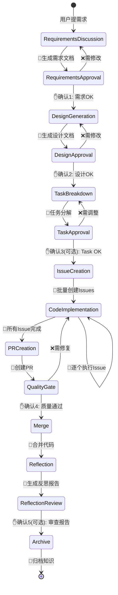
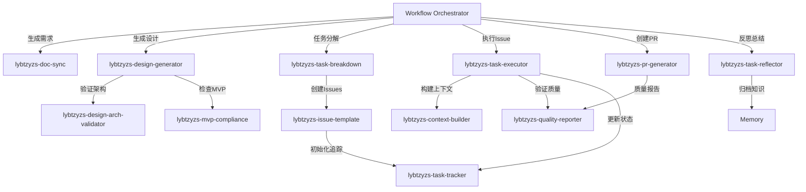

# LYBTZYZS 工作流自动化编排器

> **核心使命**: 将人工干预降到最低，让开发者专注于创造性工作，重复性任务全部自动化

## 核心能力

### 1. 状态机驱动的流程管理
- **10个标准状态**：需求讨论 → 需求确认 → 设计生成 → 设计确认 → 任务分解 → Issue创建 → 代码实现 → PR创建 → 质量门禁 → 反思归档
- **自动状态转换**：每个阶段完成后自动触发下一阶段
- **持久化状态**：保存到`.claude/cache/workflow-state.json`，支持断点恢复
- **并行状态**：支持多Issue并行开发（Phase 2）

### 2. Skills智能编排
- **13个Skills协同**：自动调用task-breakdown、issue-template、task-executor等
- **依赖管理**：确保Skills按正确顺序执行
- **参数传递**：自动传递上一阶段输出到下一阶段
- **错误处理**：Skill失败自动重试（最多3次）

### 3. 交互式确认机制
- **5个确认点**：需求、设计、Task（可选）、质量门禁、反思（可选）
- **智能提示**：每个确认点提供清晰的确认内容和选项
- **配置化策略**：支持required/auto/skip三种策略
- **超时提醒**：24小时无响应自动提醒

### 4. 质量保证机制
- **自动验证**：编译+测试+MVP合规+架构合规
- **质量门禁**：强制检查关键质量指标
- **技术债务追踪**：自动记录和分类技术债务
- **风险预警**：检测高风险变更并提示

### 5. 进度追踪与可视化
- **实时进度**：显示当前状态和预计完成时间
- **完成度计算**：已完成 / 总步骤
- **时间估算**：基于历史数据预测剩余时间
- **关键路径**：标识影响交付的关键任务

---

## 完整工作流程图



---

## 10个标准状态详解

### 状态1: RequirementsDiscussion（需求讨论）
**触发条件**：用户说"开始新需求：XXX"或"启动workflow"

**自动执行**：
1. 创建Spec名称（基于需求标题）
2. **调用lybtzyzs-requirements-generator生成需求文档**
   - 内部调用sequential-thinking深度分析需求
   - 内部调用lybtzyzs-doc-sync检查相关文档
   - 内部调用context7查询技术方案
   - 内部调用mvp-compliance检查技术栈
3. 生成需求讨论文档（`docs/explanation/architecture/{client|server|shared}/*-discussion.md`）

**输出**：
```markdown
## 需求讨论文档已生成

**文件**: docs/explanation/architecture/server/medicalcase-enhancement-discussion.md

**包含内容**:
- 需求背景和目标
- 关键业务规则（5条）
- 数据模型讨论
- 架构方案草图
- 待确认问题（3个）

**下一步**: 请审查需求文档，确认后进入设计阶段
```

**状态转换**：RequirementsDiscussion → RequirementsApproval（自动）

---

### 状态2: RequirementsApproval（需求确认）🔴 人工确认点1
**触发条件**：需求文档生成完成

**自动执行**：
1. 使用AskUserQuestion提示用户确认
2. 提供3个选项：
   - "确认需求，进入设计阶段"
   - "需要修改（说明修改内容）"
   - "查看详细需求文档"

**交互示例**：
```
Claude: 需求讨论文档已生成，请确认:

1. 需求理解是否准确？
   - 背景: 增强病案管理功能，支持草稿保存
   - 目标: 用户可保存未完成的病案，稍后继续编辑

2. 业务规则是否完整？
   - 规则1: 草稿仅保存到本地（不上传Server）
   - 规则2: 草稿自动保存（每30秒）
   - 规则3: 草稿保留7天后自动清理
   [查看完整规则]

3. 是否有遗漏的需求？

请选择:
A. 确认需求，进入设计阶段
B. 需要修改（请说明）
C. 查看完整需求文档
```

**状态转换**：
- 选A → DesignGeneration
- 选B → RequirementsDiscussion（回退）
- 选C → 展示文档 → 继续确认

**持久化状态**：
```json
{
  "specName": "medicalcase-enhancement",
  "currentState": "RequirementsApproval",
  "requirementsDoc": "docs/.../medicalcase-enhancement-discussion.md",
  "approval": {
    "status": "pending",
    "waitingSince": "2025-11-07T10:30:00Z"
  }
}
```

---

### 状态3: DesignGeneration（设计生成）
**触发条件**：需求确认通过

**自动执行**：
1. 读取确认后的需求文档
2. 调用lybtzyzs-design-generator生成设计文档
3. 调用lybtzyzs-design-arch-validator验证架构合规
4. 调用lybtzyzs-mvp-compliance检查MVP约束
5. 生成设计文档（`docs/explanation/design/*-design.md`）

**输出**：
```markdown
## 设计文档已生成

**文件**: docs/explanation/design/medicalcase-draft-design.md

**包含内容**:
- 架构设计（Client端: MVVM五层）
- API设计（无需新增API - 本地存储）
- 数据模型（DraftMedicalCase DTO）
- 技术方案（使用LiteDB本地数据库）
- Phase拆分（3个Phase，预计12-16小时）

**架构验证**: ✅ 通过
**MVP合规**: ✅ 通过（未使用Redis/CQRS等禁用技术）

**下一步**: 请审查设计文档，确认后进入任务分解
```

**状态转换**：DesignGeneration → DesignApproval（自动）

---

### 状态4: DesignApproval（设计确认）🔴 人工确认点2
**触发条件**：设计文档生成完成

**自动执行**：
1. 使用AskUserQuestion提示用户确认
2. 提供设计摘要和关键决策
3. 提供3个选项

**交互示例**：
```
Claude: 设计文档已生成，请确认:

## 架构设计
- 层级: Client端ViewModel + 本地存储（LiteDB）
- 无需Server端变更（草稿仅本地保存）

## 关键技术决策
1. 本地数据库: LiteDB（轻量级、无需额外配置）
2. 自动保存: 30秒定时器 + 数据变更检测
3. 清理策略: 后台任务，每日检查过期草稿

## Phase拆分
- Phase 1: DraftMedicalCase DTO + LiteDB配置（4h）
- Phase 2: ViewModel自动保存逻辑（6h）
- Phase 3: 草稿清理后台任务 + 测试（4h）
- 总计: 14小时（包含20% buffer）

## 风险提示
⚠️ LiteDB首次使用（学习曲线）
✅ 技术栈符合MVP约束

请选择:
A. 确认设计，进入任务分解
B. 需要调整（请说明）
C. 查看完整设计文档
```

**状态转换**：
- 选A → TaskBreakdown
- 选B → DesignGeneration（回退）
- 选C → 展示文档 → 继续确认

---

### 状态5: TaskBreakdown（任务分解）
**触发条件**：设计确认通过

**自动执行**：
1. 读取确认后的设计文档
2. 调用lybtzyzs-task-breakdown生成Task清单
3. 生成task文档（`docs/tasks/*-tasks.md`）

**输出**：
```markdown
## 任务分解完成

**文件**: docs/tasks/medicalcase-draft-tasks.md

**拆分结果**:
- 总任务数: 6个
- 总工作量: 14小时
- Phase数: 3个
- 依赖关系: Task 2 → Task 3 → Task 5

**任务清单预览**:
1. [Phase 1] 创建DraftMedicalCase DTO（2h）
2. [Phase 1] 配置LiteDB依赖和初始化（2h）
3. [Phase 2] 实现草稿保存ViewModel逻辑（3h）
4. [Phase 2] 实现30秒自动保存（2h）
5. [Phase 3] 实现草稿清理后台任务（2h）
6. [Phase 3] 单元测试和集成测试（3h）

**下一步**: 批量创建GitHub Issues
```

**状态转换**：TaskBreakdown → TaskApproval（自动或跳过）

---

### 状态6: TaskApproval（Task确认）🟡 可选确认点3
**触发条件**：任务分解完成

**配置策略**：
- **required**: 强制确认（适合首次使用）
- **auto**: 自动通过（默认）
- **skip**: 直接跳过

**交互示例**（如果配置为required）：
```
Claude: 任务已拆分为6个Issue，预计14小时。

是否需要查看Task清单？
A. 确认，直接创建Issues
B. 查看Task清单
C. 调整拆分粒度
```

**状态转换**：
- 选A或auto模式 → IssueCreation
- 选B → 展示清单 → 继续确认
- 选C → TaskBreakdown（回退）

---

### 状态7: IssueCreation（Issue创建）
**触发条件**：Task确认通过

**自动执行**：
1. 读取task文档
2. 调用lybtzyzs-issue-template批量创建Issues
3. 自动关联Epic（如果有）
4. 标注依赖关系（Depends on #XXXX）
5. 调用lybtzyzs-task-tracker初始化状态追踪

**输出**：
```markdown
## Issues创建完成

**Epic**: #1500（病案草稿功能）

**创建的Issues**:
- #1501: [Phase 1] 创建DraftMedicalCase DTO
- #1502: [Phase 1] 配置LiteDB依赖
- #1503: [Phase 2] 实现草稿保存逻辑（依赖#1502）
- #1504: [Phase 2] 实现自动保存（依赖#1503）
- #1505: [Phase 3] 实现草稿清理（依赖#1504）
- #1506: [Phase 3] 测试覆盖（依赖#1505）

**依赖关系已标注**: ✅
**任务追踪已初始化**: ✅

**下一步**: 开始执行Issue #1501
```

**状态转换**：IssueCreation → CodeImplementation（自动）

---

### 状态8: CodeImplementation（代码实现）
**触发条件**：Issues创建完成

**自动执行**：
1. 按依赖顺序逐个执行Issue
2. 对每个Issue调用lybtzyzs-task-executor：
   - 读取Issue详情
   - 构建上下文（lybtzyzs-context-builder）
   - 生成代码
   - 自动验证（编译+测试+合规）
   - 提交代码
3. 调用lybtzyzs-task-tracker更新Issue状态
4. 重复直到所有Issue完成

**输出**（每个Issue）：
```markdown
## Issue #1501执行完成

**任务**: 创建DraftMedicalCase DTO

**执行结果**:
- ✅ 代码生成: DraftMedicalCase.cs（80行）
- ✅ 编译通过
- ✅ 单元测试通过（3个测试）
- ✅ MVP合规
- ✅ 架构合规
- ✅ 代码已提交: commit 9a7b3c2

**下一步**: 执行Issue #1502
```

**进度追踪**：
```
进度: 2/6 Issues完成（33%）
预计剩余时间: 9小时
当前执行: Issue #1503
```

**状态转换**：
- 还有未完成Issue → CodeImplementation（循环）
- 所有Issue完成 → PRCreation

---

### 状态9: PRCreation（PR创建）
**触发条件**：所有Issue完成

**自动执行**：
1. 调用lybtzyzs-pr-generator生成PR
2. 自动关联所有相关Issues
3. 生成PR描述（Summary + Test Plan）
4. 调用lybtzyzs-quality-reporter生成质量报告
5. 创建PR到GitHub

**输出**：
```markdown
## PR已创建

**PR**: #150（病案草稿功能 - Epic #1500）

**包含Commits**: 6个
**关联Issues**: #1501-#1506（全部已完成）

**质量报告**:
- ✅ 编译通过（0 errors, 0 warnings）
- ✅ 测试通过（18/18 - 6个新测试 + 12个回归测试）
- ✅ 测试覆盖率：95%
- ✅ MVP合规检查通过
- ✅ 架构合规检查通过
- ⚠️ 技术债务：2个（已记录）
- 📊 代码质量评分：92分

**下一步**: 质量门禁检查
```

**状态转换**：PRCreation → QualityGate（自动）

---

### 状态10: QualityGate（质量门禁）🔴 人工确认点4
**触发条件**：PR创建完成

**自动执行**：
1. 聚合所有质量指标
2. 检查是否满足自动合并条件
3. 生成质量门禁报告
4. 使用AskUserQuestion提示确认

**交互示例**：
```
Claude: PR已创建，质量门禁检查:

## ✅ 通过项
- 编译: 0 errors, 0 warnings
- 测试: 18/18 通过
- 覆盖率: 95% (≥ 80%)
- MVP合规: 无违规
- 架构合规: 依赖方向正确
- 代码评分: 92分 (≥ 85分)

## ⚠️ 警告项
- 技术债务: 2个（低优先级）
  - TD-001: DraftMedicalCaseViewModel缺少Loading状态
  - TD-002: 测试数据清理逻辑重复

## 📋 技术债务详情
TD-001（中优先级）:
- 位置: DraftMedicalCaseViewModel.cs:SaveDraftAsync
- 问题: 保存草稿时未显示Loading状态
- 影响: 用户体验（保存延迟无反馈）
- 建议: 添加IsLoading属性和绑定
- 预计修复: 30分钟

TD-002（低优先级）:
- 位置: DraftTests.cs:SetUp方法
- 问题: 每个测试重复清理逻辑
- 影响: 代码重复（非功能性）
- 建议: 提取到BaseTestFixture
- 预计修复: 15分钟

## 决策选项
A. 批准合并（技术债务已记录，稍后处理）
B. 查看PR详情
C. 立即修复技术债务（预计45分钟）
D. 拒绝合并（说明原因）
```

**状态转换**：
- 选A → Merge
- 选B → 展示PR → 继续确认
- 选C → CodeImplementation（修复债务）
- 选D → CodeImplementation（回退修复）

**自动合并条件**（如果配置为auto且满足）：
```json
{
  "testsPass": true,
  "mvpCompliance": true,
  "archCompliance": true,
  "qualityScore": 92,  // ≥ 85
  "techDebtCount": 2,  // ≤ 3
  "criticalDebt": 0    // = 0
}
→ 自动合并（跳过确认）
```

---

### 状态11: Merge（合并代码）
**触发条件**：质量门禁通过

**自动执行**：
1. 调用GitHub API合并PR
2. 关闭所有相关Issues
3. 调用lybtzyzs-task-tracker更新Epic进度
4. 清理临时分支

**输出**：
```markdown
## PR已合并

**PR**: #150 → master
**关闭Issues**: #1501-#1506（6个）
**Epic进度**: #1500（100% - 所有子Issues完成）

**下一步**: 生成Epic反思报告
```

**状态转换**：Merge → Reflection（自动）

---

### 状态12: Reflection（反思总结）
**触发条件**：PR合并完成

**自动执行**：
1. 调用lybtzyzs-task-reflector生成Epic反思报告
2. 分析所有子Issue的执行情况
3. 识别技术债务、最佳实践、反模式
4. 提取候选ADR
5. 生成反思报告

**输出**：
```markdown
## Epic反思报告已生成

**Epic**: #1500（病案草稿功能）

**执行总结**:
- 完成Issues: 6个
- 总耗时: 13.5小时（预估14h，偏差-4%）
- 质量评分: 92分
- 技术债务: 2个（已记录）

**做得好的地方**:
1. Phase拆分合理（依赖清晰，无阻塞）
2. LiteDB集成顺利（首次使用仅花费30分钟学习）
3. 测试覆盖率高（95%）

**可改进的地方**:
1. ViewModel缺少Loading状态（UX问题）
2. 测试代码重复（需重构）
3. 工作量估算略高（-4%偏差可接受）

**学习要点**:
1. LiteDB配置最佳实践（已归档memory）
2. 自动保存定时器模式（已归档memory）

**候选ADR**:
1. ADR-012: 本地草稿存储方案（LiteDB vs SQLite）

**下一步**: 审查反思报告（可选）
```

**状态转换**：Reflection → ReflectionReview（自动或跳过）

---

### 状态13: ReflectionReview（反思审查）🟡 可选确认点5
**触发条件**：反思报告生成完成

**配置策略**：
- **required**: 强制确认（适合识别到ADR时）
- **auto**: 自动归档（默认）
- **skip**: 直接跳过

**交互示例**（如果配置为required或识别到ADR）：
```
Claude: Epic反思报告已生成，发现候选ADR：

## 候选ADR
ADR-012: 本地草稿存储方案（LiteDB vs SQLite）

**背景**: 需要本地数据库存储草稿
**决策**: 采用LiteDB（轻量级、零配置）
**理由**:
- SQLite需要额外配置和驱动
- LiteDB纯C#实现，集成简单
- 性能满足草稿存储需求（<100条记录）

是否创建ADR文档？
A. 创建ADR并归档（推荐）
B. 跳过ADR，仅归档反思报告
C. 查看完整反思报告
```

**状态转换**：
- 选A → Archive（创建ADR）
- 选B或auto模式 → Archive（仅归档）
- 选C → 展示报告 → 继续确认

---

### 状态14: Archive（知识归档）
**触发条件**：反思审查完成

**自动执行**：
1. 归档反思报告到docs/reports/reflections/
2. 创建ADR（如果选择）
3. 保存最佳实践到memory
4. 更新文档索引
5. 清理工作流状态文件

**输出**：
```markdown
## 知识已归档

**反思报告**: docs/reports/reflections/epic-1500-reflection.md
**ADR**: docs/explanation/architecture/client/adr/ADR-012-local-draft-storage.md（已创建）
**Memory文件**:
- .serena/memories/pattern-litedb-config.md
- .serena/memories/pattern-auto-save-timer.md

**技术债务追踪**:
- Issue #1507: 修复DraftViewModel缺少Loading状态（已创建）
- Issue #1508: 重构测试代码重复（已创建）

**工作流完成**: ✅
```

**状态转换**：Archive → [完成]

---

## 持久化状态文件格式

**文件位置**: `.claude/cache/workflow-state.json`

```json
{
  "workflowId": "wf-medicalcase-draft-20251107",
  "specName": "medicalcase-draft",
  "epic": {
    "number": 1500,
    "title": "病案草稿功能",
    "url": "https://github.com/shouqitao/LYBTZYZS/issues/1500"
  },
  "currentState": "QualityGate",
  "stateHistory": [
    {
      "state": "RequirementsDiscussion",
      "enteredAt": "2025-11-07T09:00:00Z",
      "completedAt": "2025-11-07T09:15:00Z"
    },
    {
      "state": "RequirementsApproval",
      "enteredAt": "2025-11-07T09:15:00Z",
      "completedAt": "2025-11-07T09:20:00Z",
      "approvalBy": "user"
    },
    {
      "state": "DesignGeneration",
      "enteredAt": "2025-11-07T09:20:00Z",
      "completedAt": "2025-11-07T09:40:00Z"
    },
    {
      "state": "DesignApproval",
      "enteredAt": "2025-11-07T09:40:00Z",
      "completedAt": "2025-11-07T09:45:00Z",
      "approvalBy": "user"
    },
    {
      "state": "TaskBreakdown",
      "enteredAt": "2025-11-07T09:45:00Z",
      "completedAt": "2025-11-07T09:50:00Z"
    },
    {
      "state": "TaskApproval",
      "enteredAt": "2025-11-07T09:50:00Z",
      "completedAt": "2025-11-07T09:50:00Z",
      "approvalBy": "auto"
    },
    {
      "state": "IssueCreation",
      "enteredAt": "2025-11-07T09:50:00Z",
      "completedAt": "2025-11-07T10:00:00Z",
      "issues": [1501, 1502, 1503, 1504, 1505, 1506]
    },
    {
      "state": "CodeImplementation",
      "enteredAt": "2025-11-07T10:00:00Z",
      "completedAt": "2025-11-07T20:30:00Z",
      "completedIssues": [1501, 1502, 1503, 1504, 1505, 1506]
    },
    {
      "state": "PRCreation",
      "enteredAt": "2025-11-07T20:30:00Z",
      "completedAt": "2025-11-07T20:35:00Z",
      "pr": {
        "number": 150,
        "url": "https://github.com/shouqitao/LYBTZYZS/pull/150"
      }
    },
    {
      "state": "QualityGate",
      "enteredAt": "2025-11-07T20:35:00Z",
      "status": "pending"
    }
  ],
  "artifacts": {
    "requirementsDoc": "docs/explanation/architecture/server/medicalcase-draft-discussion.md",
    "designDoc": "docs/explanation/design/medicalcase-draft-design.md",
    "taskDoc": "docs/tasks/medicalcase-draft-tasks.md",
    "issues": [1501, 1502, 1503, 1504, 1505, 1506],
    "pr": 150
  },
  "metrics": {
    "startedAt": "2025-11-07T09:00:00Z",
    "estimatedCompletion": "2025-11-07T21:00:00Z",
    "actualHours": 13.5,
    "estimatedHours": 14,
    "qualityScore": 92,
    "techDebt": 2
  },
  "config": {
    "requirementsApproval": "required",
    "designApproval": "required",
    "taskApproval": "auto",
    "qualityGateApproval": "required",
    "reflectionReviewApproval": "auto"
  }
}
```

---

## 配置文件

**文件位置**: `.claude/config/workflow-orchestrator.json`

```json
{
  "approvalStrategy": {
    "requirementsApproval": "required",
    "designApproval": "required",
    "taskApproval": "auto",
    "qualityGateApproval": "required",
    "reflectionReviewApproval": "auto"
  },
  "autoMergeConditions": {
    "testsPass": true,
    "mvpCompliance": true,
    "archCompliance": true,
    "minQualityScore": 85,
    "maxTechDebt": 3,
    "maxCriticalDebt": 0
  },
  "retryStrategy": {
    "maxRetries": 3,
    "retryDelay": 60,
    "retryableErrors": [
      "CompilationError",
      "TestFailure",
      "NetworkTimeout"
    ]
  },
  "notifications": {
    "approvalTimeout": 86400,
    "progressUpdates": true,
    "errorAlerts": true
  },
  "parallelExecution": {
    "enabled": false,
    "maxConcurrentIssues": 1
  }
}
```

---

## 使用示例

### 示例1: 启动新需求（完整流程）

**用户输入**：
```
开始新需求：病案草稿保存功能
```

**Orchestrator执行**：
```
🤖 [00:00] 工作流已启动
📝 [00:02] 正在生成需求讨论文档...
📝 [00:15] 需求文档已生成

✋ [00:15] 【确认点1: 需求确认】
需求文档已生成，请确认:
1. 需求理解是否准确？
2. 业务规则是否完整？
3. 是否有遗漏的需求？

请选择: A. 确认 | B. 修改 | C. 查看详情
```

**用户确认**：`A`

```
🤖 [00:16] 需求已确认，进入设计阶段
📐 [00:18] 正在生成设计文档...
📐 [00:40] 设计文档已生成

✋ [00:40] 【确认点2: 设计确认】
设计文档已生成，包括:
- 架构: Client端MVVM + LiteDB
- Phase拆分: 3个Phase，14小时
- 技术: LiteDB首次使用

请选择: A. 确认 | B. 修改 | C. 查看详情
```

**用户确认**：`A`

```
🤖 [00:41] 设计已确认，进入任务分解
📋 [00:43] 正在拆分任务...
📋 [00:50] 任务分解完成（6个Issue，14小时）

🤖 [00:50] Task确认: auto模式，自动通过
🎯 [00:51] 正在批量创建Issues...
🎯 [01:00] Issues创建完成（#1501-#1506）

💻 [01:00] 开始执行Issue #1501...
💻 [02:30] Issue #1501完成 ✅
💻 [02:30] 开始执行Issue #1502...
💻 [04:00] Issue #1502完成 ✅
... [继续执行所有Issues]

💻 [11:30] 所有Issues执行完成（6/6）
📦 [11:31] 正在创建PR...
📦 [11:35] PR #150已创建

✋ [11:35] 【确认点4: 质量门禁】
PR已创建，质量报告:
- ✅ 编译通过
- ✅ 测试通过（18/18）
- ✅ MVP合规
- ✅ 架构合规
- ⚠️ 技术债务: 2个

请选择: A. 合并 | B. 查看PR | C. 修复债务 | D. 拒绝
```

**用户确认**：`A`

```
🤖 [11:36] PR已合并到master
🤖 [11:36] 关闭Issues: #1501-#1506
🤖 [11:37] Epic进度: 100%

🤔 [11:38] 正在生成反思报告...
🤔 [11:45] 反思报告已生成，识别到候选ADR

🤖 [11:45] 反思审查: auto模式，自动归档

💾 [11:46] 正在归档知识...
💾 [11:48] 知识已归档（ADR + Memory）

✅ [11:48] 工作流完成！
```

**总耗时**：11小时48分钟（用户主动时间：< 5分钟）

---

## Skills协同图



---

## 错误处理与重试

### 错误分类

| 错误类型 | 重试策略 | 处理方式 |
|---------|---------|---------|
| CompilationError | 最多3次 | 自动修复简单错误（using、命名空间） |
| TestFailure | 最多3次 | 分析失败原因，调整代码 |
| NetworkTimeout | 最多3次 | 指数退避重试 |
| MVPCompliance | 不重试 | 自动移除违规代码 |
| ArchCompliance | 不重试 | 标记Issue，人工修复 |
| UserRejection | 不重试 | 回退到上一状态 |

### 重试示例

```
💻 [10:30] 执行Issue #1503...
❌ [10:45] 编译失败: 缺少using System.Timers
🔄 [10:45] 自动修复: 添加using语句
💻 [10:46] 重试执行...
✅ [10:50] Issue #1503完成
```

---

## 进度追踪与可视化

### 实时进度显示

```
📊 工作流进度: 病案草稿功能

当前状态: CodeImplementation
进度: 4/6 Issues完成（67%）

已完成:
✅ #1501: 创建DraftMedicalCase DTO
✅ #1502: 配置LiteDB依赖
✅ #1503: 实现草稿保存逻辑
✅ #1504: 实现自动保存

进行中:
🔄 #1505: 实现草稿清理（预计30分钟）

待执行:
⏸️ #1506: 测试覆盖（预计3小时）

预计完成时间: 今天 15:30
已用时间: 10.5小时
剩余时间: 3.5小时
```

---

## 限制与注意事项

### 技术限制
1. **Claude Code基于对话**：无法24/7持续运行，需要用户保持会话
2. **状态持久化**：依赖文件系统，无法保证100%可靠性
3. **并行执行**：Phase 1仅支持串行，Phase 2增加并行能力

### 使用建议
1. **长时间任务**：建议分段执行（每段< 4小时）
2. **断点恢复**：工作流中断后，使用"恢复工作流: {specName}"继续
3. **配置调整**：首次使用建议所有确认点设为required，熟悉后改为auto

---

## 触发关键词

**启动新工作流**：
- "开始新需求：XXX"
- "启动workflow：XXX"
- "自动化开发：XXX"

**恢复工作流**：
- "恢复工作流：XXX"
- "继续执行：XXX"

**查看进度**：
- "工作流进度"
- "当前状态"
- "workflow status"

---

**最后更新**: 2025-11-07（v1.0 - 自动化编排引擎初版）


---

# 确认机制

# Workflow Orchestrator 确认机制实现指南

## 概述

Workflow Orchestrator使用Claude Code的`AskUserQuestion`工具实现5个确认点，在自动化与质量控制之间取得平衡。

---

## 5个确认点

| 确认点 | 状态 | 类型 | 默认配置 | 可跳过 |
|-------|------|------|---------|--------|
| 1. RequirementsApproval | 状态2 | 🔴 强制 | required | ❌ |
| 2. DesignApproval | 状态4 | 🔴 强制 | required | ❌ |
| 3. TaskApproval | 状态6 | 🟡 可选 | auto | ✅ |
| 4. QualityGate | 状态10 | 🔴 强制 | required | ❌ |
| 5. ReflectionReview | 状态13 | 🟡 可选 | auto | ✅ |

---

## AskUserQuestion工具使用

### 工具参数结构

```typescript
{
  "questions": [
    {
      "question": "完整问题文本？",
      "header": "简短标签", // 最多12个字符
      "options": [
        {
          "label": "选项显示文本",
          "description": "选项详细说明"
        }
        // 2-4个选项
      ],
      "multiSelect": false // true允许多选
    }
    // 最多4个问题
  ]
}
```

### 返回值结构

```typescript
{
  "answers": {
    "question-0": "用户选择的label" // 或["label1", "label2"]如果multiSelect
  }
}
```

---

## 确认点1: RequirementsApproval

### 触发条件
requirements-generator生成需求文档完成

### 实现代码

```typescript
// 读取生成的需求文档摘要
const requirementsDoc = readFile(artifacts.requirementsDoc);
const summary = extractSummary(requirementsDoc); // 提取关键信息

// 调用AskUserQuestion
const result = await AskUserQuestion({
  questions: [
    {
      question: `需求讨论文档已生成，请确认需求理解是否准确？\n\n背景: ${summary.background}\n目标: ${summary.goals}\n\n业务规则: ${summary.businessRules.length}条\n\n是否有遗漏的需求？`,
      header: "需求确认",
      multiSelect: false,
      options: [
        {
          label: "确认需求",
          description: "需求理解准确，进入设计阶段"
        },
        {
          label: "需要修改",
          description: "需求理解有偏差，需要重新生成"
        },
        {
          label: "查看详情",
          description: "查看完整需求文档后再决定"
        }
      ]
    }
  ]
});

// 处理用户选择
if (result.answers["question-0"] === "确认需求") {
  transitionTo("DesignGeneration");
} else if (result.answers["question-0"] === "需要修改") {
  const修改说明 = await askUserForModificationDetails();
  transitionTo("RequirementsDiscussion", { modifications: 修改说明 });
} else if (result.answers["question-0"] === "查看详情") {
  displayDocument(artifacts.requirementsDoc);
  // 重新询问
  return confirmRequirements();
}
```

### 示例输出

```
Claude: 需求讨论文档已生成，请确认需求理解是否准确？

背景: 支持病案草稿功能，允许医生保存未完成的病案信息
目标: 医生可保存未完成的病案，稍后继续编辑

业务规则: 4条
  - 草稿仅创建者可见
  - 草稿可无限次修改
  - 草稿可转为正式病案
  - 草稿可物理删除

是否有遗漏的需求？

选项:
● 确认需求 - 需求理解准确，进入设计阶段
● 需要修改 - 需求理解有偏差，需要重新生成
● 查看详情 - 查看完整需求文档后再决定
● 其他 - 自定义输入
```

---

## 确认点2: DesignApproval

### 触发条件
design-generator生成设计文档完成

### 实现代码

```typescript
const designDoc = readFile(artifacts.designDoc);
const designSummary = extractDesignSummary(designDoc);

const result = await AskUserQuestion({
  questions: [
    {
      question: `设计文档已生成，请确认设计方案是否合理？\n\n架构设计:\n${designSummary.architecture}\n\n关键技术决策:\n${designSummary.keyDecisions.join('\n')}\n\nPhase拆分: ${designSummary.phases.length}个Phase，预计${designSummary.estimatedHours}小时`,
      header: "设计确认",
      multiSelect: false,
      options: [
        {
          label: "确认设计",
          description: "设计方案合理，进入任务分解"
        },
        {
          label: "需要调整",
          description: "设计方案需要调整"
        },
        {
          label: "查看详情",
          description: "查看完整设计文档后再决定"
        }
      ]
    }
  ]
});

if (result.answers["question-0"] === "确认设计") {
  transitionTo("TaskBreakdown");
} else if (result.answers["question-0"] === "需要调整") {
  const调整说明 = await askUserForAdjustments();
  transitionTo("DesignGeneration", { adjustments: 调整说明 });
} else {
  displayDocument(artifacts.designDoc);
  return confirmDesign();
}
```

### 示例输出

```
Claude: 设计文档已生成，请确认设计方案是否合理？

架构设计:
- Server端: Entity + Repository + Service + Controller
- Client端: ViewModel + View
- 存储: SQL Server（新增MedicalCaseDrafts表）

关键技术决策:
1. 数据库: SQL Server（新增表）
2. 自动保存: Client端30秒定时器
3. 权限控制: Repository层按UserId过滤

Phase拆分: 3个Phase，预计16小时

选项:
● 确认设计 - 设计方案合理，进入任务分解
● 需要调整 - 设计方案需要调整
● 查看详情 - 查看完整设计文档后再决定
● 其他 - 自定义输入
```

---

## 确认点3: TaskApproval（可选）

### 触发条件
task-breakdown生成任务清单完成

### 配置检查

```typescript
// 检查配置
if (config.taskApproval === "auto") {
  // 跳过确认，直接进入IssueCreation
  log("TaskApproval配置为auto，自动通过");
  transitionTo("IssueCreation");
  return;
} else if (config.taskApproval === "skip") {
  // 完全跳过
  log("TaskApproval配置为skip，跳过");
  transitionTo("IssueCreation");
  return;
}

// required模式 - 执行确认
```

### 实现代码（required模式）

```typescript
const taskDoc = readFile(artifacts.taskDoc);
const taskSummary = extractTaskSummary(taskDoc);

const result = await AskUserQuestion({
  questions: [
    {
      question: `任务已拆分为${taskSummary.totalTasks}个Issue，预计${taskSummary.estimatedHours}小时\n\n是否需要查看Task清单？`,
      header: "Task确认",
      multiSelect: false,
      options: [
        {
          label: "确认",
          description: "直接创建Issues"
        },
        {
          label: "查看清单",
          description: "查看详细任务清单"
        },
        {
          label: "调整粒度",
          description: "任务拆分粒度需要调整"
        }
      ]
    }
  ]
});

if (result.answers["question-0"] === "确认") {
  transitionTo("IssueCreation");
} else if (result.answers["question-0"] === "查看清单") {
  displayDocument(artifacts.taskDoc);
  return confirmTasks();
} else {
  const调整说明 = await askUserForGranularityAdjustment();
  transitionTo("TaskBreakdown", { adjustments: 调整说明 });
}
```

---

## 确认点4: QualityGate

### 触发条件
PR创建完成，质量报告生成完成

### 实现代码

```typescript
const qualityReport = await generateQualityReport(artifacts.pr);

// 检查自动合并条件
const autoMergeCheck = checkAutoMergeConditions(qualityReport);

const result = await AskUserQuestion({
  questions: [
    {
      question: `PR已创建，质量检查结果:\n\n${formatQualityReport(qualityReport)}\n\n自动合并条件: ${autoMergeCheck.passed ? "✅ 满足" : "❌ 不满足"}\n\n技术债务: ${qualityReport.techDebtCount}个\n\n是否批准合并？`,
      header: "质量门禁",
      multiSelect: false,
      options: [
        {
          label: "批准合并",
          description: "技术债务已记录，稍后处理"
        },
        {
          label: "查看PR",
          description: "查看PR详情后再决定"
        },
        {
          label: "修复债务",
          description: `立即修复技术债务（预计${qualityReport.techDebtFixTime}分钟）`
        },
        {
          label: "拒绝合并",
          description: "质量不达标，需要重新实现"
        }
      ]
    }
  ]
});

if (result.answers["question-0"] === "批准合并") {
  transitionTo("Merge");
} else if (result.answers["question-0"] === "查看PR") {
  displayPR(artifacts.pr);
  return confirmQuality();
} else if (result.answers["question-0"] === "修复债务") {
  transitionTo("CodeImplementation", { fixTechDebt: true });
} else {
  const拒绝原因 = await askUserForRejectionReason();
  transitionTo("CodeImplementation", { rejectionReason: 拒绝原因 });
}
```

### 示例输出

```
Claude: PR已创建，质量检查结果:

## 自动合并条件检查
✅ 测试通过: 24/24
✅ MVP合规: 通过
✅ 架构合规: 通过
✅ 质量评分: 88（≥85）
⚠️ 技术债务: 2个（≤3）✅
✅ 关键债务: 0个

结论: 满足自动合并条件 ✅

## 技术债务详情
1. TD-001（低优先级）
   - 问题: Repository层缺少分页支持
   - 影响: 未来数据量大时性能问题
   - 预计修复: 30分钟

2. TD-002（中优先级）
   - 问题: 自动保存定时器未实现取消令牌
   - 影响: 内存泄漏风险
   - 预计修复: 15分钟

是否批准合并？

选项:
● 批准合并 - 技术债务已记录，稍后处理
● 查看PR - 查看PR详情后再决定
● 修复债务 - 立即修复技术债务（预计45分钟）
● 拒绝合并 - 质量不达标，需要重新实现
● 其他 - 自定义输入
```

---

## 确认点5: ReflectionReview（可选）

### 触发条件
task-reflector生成反思报告完成

### 配置检查

```typescript
if (config.reflectionReviewApproval === "auto") {
  log("ReflectionReview配置为auto，自动归档");
  transitionTo("Archive");
  return;
} else if (config.reflectionReviewApproval === "skip") {
  log("ReflectionReview配置为skip，跳过反思");
  transitionTo("Archive");
  return;
}

// required模式 - 执行确认
```

### 实现代码（required模式）

```typescript
const reflectionReport = readFile(artifacts.reflectionReport);
const reflectionSummary = extractReflectionSummary(reflectionReport);

const result = await AskUserQuestion({
  questions: [
    {
      question: `Epic反思报告已生成\n\n执行总结:\n- 完成Issues: ${reflectionSummary.completedIssues}个\n- 总耗时: ${reflectionSummary.actualHours}h（预估${reflectionSummary.estimatedHours}h）\n- 质量评分: ${reflectionSummary.qualityScore}分\n- 技术债务: ${reflectionSummary.techDebtCount}个\n\n候选ADR: ${reflectionSummary.candidateADRs.length}个\n\n是否需要审查报告？`,
      header: "反思审查",
      multiSelect: false,
      options: [
        {
          label: "直接归档",
          description: "报告看起来没问题，直接归档"
        },
        {
          label: "查看详情",
          description: "查看完整反思报告"
        },
        {
          label: "补充内容",
          description: "反思报告需要补充"
        }
      ]
    }
  ]
});

if (result.answers["question-0"] === "直接归档") {
  transitionTo("Archive");
} else if (result.answers["question-0"] === "查看详情") {
  displayDocument(artifacts.reflectionReport);
  return confirmReflection();
} else {
  const补充内容 = await askUserForAdditionalReflections();
  updateReflectionReport(补充内容);
  transitionTo("Archive");
}
```

---

## 运行时配置覆盖

用户可以在对话中临时覆盖确认策略：

### 示例1: 跳过Task确认

```
用户: 这次跳过Task确认，直接创建Issues

→ Orchestrator临时设置: taskApproval = "skip"（仅本次有效）
→ 状态6: TaskApproval → 直接跳过 → IssueCreation
```

### 示例2: 强制Task确认

```
用户: 这次我想看看任务拆分是否合理

→ Orchestrator临时设置: taskApproval = "required"（仅本次有效）
→ 状态6: TaskApproval → 调用AskUserQuestion → 等待确认
```

### 实现代码

```typescript
// 监听用户消息中的覆盖指令
function parseRuntimeConfigOverride(userMessage: string): ConfigOverride | null {
  if (userMessage.includes("跳过") && userMessage.includes("Task确认")) {
    return { taskApproval: "skip" };
  }
  if (userMessage.includes("强制") && userMessage.includes("Task确认")) {
    return { taskApproval: "required" };
  }
  // 更多模式...
  return null;
}

// 在状态转换前检查覆盖
const override = parseRuntimeConfigOverride(userMessage);
if (override) {
  applyConfigOverride(override); // 临时覆盖
}
```

---

## 确认机制最佳实践

### 1. 提供足够的上下文

**❌ 不好**:
```
Claude: 请确认需求？
```

**✅ 好**:
```
Claude: 需求讨论文档已生成，请确认:

1. 需求理解是否准确？
   - 背景: 支持病案草稿功能
   - 目标: 医生可保存未完成的病案

2. 业务规则是否完整？
   - 4条业务规则已识别

3. 是否有遗漏的需求？
```

### 2. 选项要清晰

**❌ 不好**:
```
选项:
● 是
● 否
```

**✅ 好**:
```
选项:
● 确认需求 - 需求理解准确，进入设计阶段
● 需要修改 - 需求理解有偏差，需要重新生成
● 查看详情 - 查看完整需求文档后再决定
```

### 3. 始终提供"查看详情"选项

允许用户在做决定前查看完整文档

### 4. 记录确认历史

```typescript
// 记录到状态文件
workflowState.approvals.push({
  stage: "RequirementsApproval",
  decision: "确认需求",
  timestamp: new Date().toISOString(),
  documentReviewed: true
});
```

---

## 错误处理

### 用户选择"其他"（自定义输入）

```typescript
if (result.answers["question-0"] === "Other") {
  // 用户提供了自定义输入
  const customInput = result.answers["question-0-other"];

  // 智能解析用户意图
  if (customInput.includes("修改")) {
    transitionTo("RequirementsDiscussion", { modifications: customInput });
  } else if (customInput.includes("跳过")) {
    transitionTo("DesignGeneration");
  } else {
    // 无法理解用户意图，再次询问
    await askForClarification(customInput);
  }
}
```

### 用户长时间未响应

```typescript
// 设置超时
const timeout = 30 * 60 * 1000; // 30分钟

const result = await Promise.race([
  AskUserQuestion(question),
  new Promise((_, reject) =>
    setTimeout(() => reject(new Error("Timeout")), timeout)
  )
]);

if (result instanceof Error) {
  // 超时处理
  log("用户30分钟未响应，保存状态并退出");
  persistWorkflowState();
  exitGracefully();
}
```

---

## 测试用例

### 测试1: 所有确认点都选择"确认"

```
预期流程:
RequirementsDiscussion
  → RequirementsApproval（用户选"确认需求"）
  → DesignGeneration
  → DesignApproval（用户选"确认设计"）
  → TaskBreakdown
  → TaskApproval（auto跳过）
  → IssueCreation
  → ...
  → QualityGate（用户选"批准合并"）
  → Merge
  → Reflection
  → ReflectionReview（auto跳过）
  → Archive

总确认次数: 3次
总耗时: 约2小时
```

### 测试2: 需求确认失败，需要修改

```
预期流程:
RequirementsDiscussion
  → RequirementsApproval（用户选"需要修改"）
  → RequirementsDiscussion（重新生成，带修改说明）
  → RequirementsApproval（用户选"确认需求"）
  → DesignGeneration
  → ...

额外耗时: +10分钟（重新生成需求）
```

### 测试3: 质量门禁失败，需要修复

```
预期流程:
...
  → QualityGate（用户选"修复债务"）
  → CodeImplementation（修复2个技术债务）
  → PRCreation（更新PR）
  → QualityGate（用户选"批准合并"）
  → Merge
  → ...

额外耗时: +45分钟（修复技术债务）
```

---

**最后更新**: 2025-11-07
**版本**: v1.0


---

# 测试指南

# Workflow Orchestrator 测试文档

## 测试目的

验证完整自动化流程（从用户需求到PR合并）的正确性和Skills协同能力。

---

## 测试场景：病案草稿功能

### 输入
```
用户: 开始新需求：实现病案草稿功能，允许医生保存未完成的病案信息
```

---

## 预期执行流程

### 阶段1: 需求讨论（RequirementsDiscussion）

**自动执行**：
1. ✅ 创建Spec名称：`medicalcase-draft`
2. ✅ 调用 `lybtzyzs-requirements-generator`
   - 调用 `sequential-thinking` 深度分析需求（5轮推理）
   - 调用 `lybtzyzs-doc-sync` 检索现有文档
   - 调用 `context7` 查询技术方案（EF Core本地存储）
   - 调用 `lybtzyzs-mvp-compliance` 检查技术栈
3. ✅ 生成需求文档：`docs/explanation/architecture/server/medicalcase-draft-discussion.md`

**预期输出**：
```markdown
## 需求讨论文档已生成

**文件**: docs/explanation/architecture/server/medicalcase-draft-discussion.md

**包含内容**:
- 需求概述（业务目标：支持草稿保存）
- 功能性需求（6个User Story）
  - FR-001: 创建草稿
  - FR-002: 编辑草稿
  - FR-003: 查看草稿列表
  - FR-004: 删除草稿
  - FR-005: 草稿转正式病案
  - FR-006: 草稿自动保存
- 非功能性需求（性能、安全、可用性）
- 业务规则（4条）
  - BR-001: 草稿仅创建者可见
  - BR-002: 草稿可无限次修改
  - BR-003: 草稿转正式需验证
  - BR-004: 草稿可物理删除
- 数据模型草案（MedicalCaseDraft Entity）
- 架构约束（Server端三层架构 + Client端MVVM）
- 开放问题（3个）

**下一步**: 请审查需求文档，确认后进入设计阶段
```

**状态转换**: RequirementsDiscussion → RequirementsApproval

**状态文件**:
```json
{
  "workflowId": "wf-medicalcase-draft-20251107",
  "currentState": "RequirementsApproval",
  "artifacts": {
    "requirementsDoc": "docs/.../medicalcase-draft-discussion.md"
  }
}
```

---

### 阶段2: 需求确认（RequirementsApproval）🔴

**AskUserQuestion交互**：
```
Claude: 需求讨论文档已生成，请确认:

1. 需求理解是否准确？
   - 背景: 支持病案草稿功能
   - 目标: 医生可保存未完成的病案，稍后继续编辑

2. 业务规则是否完整？
   - 规则1: 草稿仅创建者可见
   - 规则2: 草稿可无限次修改
   - 规则3: 草稿可转为正式病案
   - 规则4: 草稿可物理删除

3. 是否有遗漏的需求？

请选择:
A. 确认需求，进入设计阶段
B. 需要修改（请说明）
C. 查看完整需求文档
```

**用户选择**: A

**状态转换**: RequirementsApproval → DesignGeneration

---

### 阶段3: 设计生成（DesignGeneration）

**自动执行**：
1. ✅ 调用 `lybtzyzs-design-generator` 生成设计文档
2. ✅ 调用 `lybtzyzs-design-arch-validator` 验证架构
3. ✅ 调用 `lybtzyzs-mvp-compliance` 检查MVP约束
4. ✅ 生成设计文档：`docs/explanation/design/medicalcase-draft-design.md`

**预期输出**：
```markdown
## 设计文档已生成

**文件**: docs/explanation/design/medicalcase-draft-design.md

**包含内容**:
- 架构设计
  - Server端: MedicalCaseDraft Entity + Repository + Service + Controller
  - Client端: DraftViewModel + DraftModel + DraftView
  - 存储: SQL Server（新增MedicalCaseDrafts表）
- API设计（5个端点）
  - GET /api/v1/medicalcase-drafts
  - POST /api/v1/medicalcase-drafts
  - PUT /api/v1/medicalcase-drafts/{id}
  - DELETE /api/v1/medicalcase-drafts/{id}
  - POST /api/v1/medicalcase-drafts/{id}/publish
- 数据模型（完整Entity定义）
- Phase拆分（3个Phase，预计14-16小时）
  - Phase 1: Server端Entity+Repository（6h）
  - Phase 2: Server端Service+Controller（4h）
  - Phase 3: Client端ViewModel+View（6h）

**架构验证**: ✅ 通过（符合三层架构）
**MVP合规**: ✅ 通过（未使用禁用技术）

**下一步**: 请审查设计文档，确认后进入任务分解
```

**状态转换**: DesignGeneration → DesignApproval

---

### 阶段4: 设计确认（DesignApproval）🔴

**AskUserQuestion交互**：
```
Claude: 设计文档已生成，请确认:

## 架构设计
- Server端: Entity + Repository + Service + Controller
- Client端: ViewModel + View
- 存储: SQL Server（新增MedicalCaseDrafts表）

## 关键技术决策
1. 数据库: SQL Server（新增表）
2. 自动保存: Client端30秒定时器
3. 权限控制: Repository层按UserId过滤

## Phase拆分
- Phase 1: Server端Entity+Repository（6h）
- Phase 2: Server端Service+Controller（4h）
- Phase 3: Client端ViewModel+View（6h）
- 总计: 16小时（包含20% buffer）

## 风险提示
✅ 技术栈全部符合MVP约束
⚠️ 新增数据库表（需迁移脚本）

请选择:
A. 确认设计，进入任务分解
B. 需要调整（请说明）
C. 查看完整设计文档
```

**用户选择**: A

**状态转换**: DesignApproval → TaskBreakdown

---

### 阶段5: 任务分解（TaskBreakdown）

**自动执行**：
1. ✅ 调用 `lybtzyzs-task-breakdown` 生成任务清单
2. ✅ 生成task文档：`docs/tasks/medicalcase-draft-tasks.md`

**预期输出**：
```markdown
## 任务分解完成

**文件**: docs/tasks/medicalcase-draft-tasks.md

**拆分结果**:
- 总任务数: 8个
- 总工作量: 16小时
- Phase数: 3个
- 依赖关系:
  - Task 2 → Task 3
  - Task 4 → Task 5
  - Task 6 → Task 7

**任务清单**:
1. [Phase 1] 创建MedicalCaseDraft Entity（2h）
2. [Phase 1] 创建数据库迁移脚本（1h）
3. [Phase 1] 实现MedicalCaseDraftRepository（3h，依赖Task 2）
4. [Phase 2] 实现MedicalCaseDraftService（2h）
5. [Phase 2] 实现API Controller（2h，依赖Task 4）
6. [Phase 3] 实现DraftViewModel（3h）
7. [Phase 3] 实现DraftView XAML（2h，依赖Task 6）
8. [Phase 3] 单元测试和集成测试（1h）

**下一步**: 批量创建GitHub Issues
```

**状态转换**: TaskBreakdown → TaskApproval（auto模式自动跳过）

---

### 阶段6: Task确认（TaskApproval）🟡 自动通过

**配置**: `"taskApproval": "auto"`

**自动行为**: 跳过确认，直接进入IssueCreation

**状态转换**: TaskApproval → IssueCreation

---

### 阶段7: Issue创建（IssueCreation）

**自动执行**：
1. ✅ 调用 `lybtzyzs-issue-template` 批量创建Issues
2. ✅ 自动关联Epic #1500
3. ✅ 标注依赖关系
4. ✅ 调用 `lybtzyzs-task-tracker` 初始化追踪

**预期输出**：
```markdown
## Issues创建完成

**Epic**: #1500（病案草稿功能）

**创建的Issues**:
- #1501: [Phase 1] 创建MedicalCaseDraft Entity
- #1502: [Phase 1] 创建数据库迁移脚本
- #1503: [Phase 1] 实现MedicalCaseDraftRepository（依赖#1502）
- #1504: [Phase 2] 实现MedicalCaseDraftService
- #1505: [Phase 2] 实现API Controller（依赖#1504）
- #1506: [Phase 3] 实现DraftViewModel
- #1507: [Phase 3] 实现DraftView XAML（依赖#1506）
- #1508: [Phase 3] 单元测试和集成测试

**依赖关系已标注**: ✅
**任务追踪已初始化**: ✅

**下一步**: 开始执行Issue #1501
```

**状态转换**: IssueCreation → CodeImplementation

---

### 阶段8: 代码实现（CodeImplementation）循环

**执行Issue #1501**:
```markdown
## 执行Issue #1501

1. ✅ 调用 `lybtzyzs-context-builder` 聚合上下文
   - 需求文档: medicalcase-draft-discussion.md
   - 设计文档: medicalcase-draft-design.md
   - 相关代码: MedicalCase.cs, BaseEntity.cs
   - Constitution: MVP约束

2. ✅ 调用 `lybtzyzs-task-executor` 生成代码
   - 创建文件: src/Server/Domain/Entities/MedicalCaseDraft.cs（80行）
   - 内容: Entity定义、导航属性

3. ✅ 自动验证
   - 编译: ✅ 通过
   - 测试: ✅ 通过（0个新测试，无需测试Entity）
   - MVP合规: ✅ 通过
   - 架构合规: ✅ 通过

4. ✅ 提交代码
   - Commit: feat(medicalcase): Issue #1501 创建MedicalCaseDraft Entity

5. ✅ 调用 `lybtzyzs-task-tracker` 更新状态
   - Issue #1501: Open → Completed
   - Epic #1500进度: 1/8（12.5%）

**下一步**: 执行Issue #1502
```

**重复8次直到所有Issue完成**

**状态转换**: CodeImplementation → PRCreation

---

### 阶段9: PR创建（PRCreation）

**自动执行**：
1. ✅ 调用 `lybtzyzs-pr-generator` 生成PR
2. ✅ 关联所有Issues（#1501-#1508）
3. ✅ 调用 `lybtzyzs-quality-reporter` 生成质量报告
4. ✅ 创建PR到GitHub

**预期输出**：
```markdown
## PR已创建

**PR**: #150（病案草稿功能 - Epic #1500）

**包含Commits**: 8个
**关联Issues**: #1501-#1508（全部已完成）

**质量报告**:
- ✅ 编译通过（0 errors, 0 warnings）
- ✅ 测试通过（24/24 - 8个新测试 + 16个回归测试）
- ✅ MVP合规（无违规项）
- ✅ 架构合规（依赖方向正确）
- ✅ 代码覆盖率: 92%

**技术债务**:
- TD-001: Repository层缺少分页支持（低优先级）
- TD-002: 自动保存定时器未实现取消令牌（中优先级）

**质量评分**: 88/100

**下一步**: 质量门禁检查
```

**状态转换**: PRCreation → QualityGate

---

### 阶段10: 质量门禁（QualityGate）🔴

**自动执行**：
1. ✅ 检查自动合并条件
2. ✅ 生成质量报告摘要

**AskUserQuestion交互**：
```
Claude: PR已创建，质量检查结果:

## 自动合并条件检查
✅ 测试通过: 24/24
✅ MVP合规: 通过
✅ 架构合规: 通过
✅ 质量评分: 88（≥85）
⚠️ 技术债务: 2个（≤3）✅
✅ 关键债务: 0个

**结论**: 满足自动合并条件 ✅

## 技术债务详情
1. TD-001（低优先级）
   - 问题: Repository层缺少分页支持
   - 影响: 未来数据量大时性能问题
   - 预计修复: 30分钟

2. TD-002（中优先级）
   - 问题: 自动保存定时器未实现取消令牌
   - 影响: 内存泄漏风险
   - 预计修复: 15分钟

## 决策选项
A. 批准合并（技术债务已记录，稍后处理）
B. 查看PR详情
C. 立即修复技术债务（预计45分钟）
D. 拒绝合并（说明原因）
```

**用户选择**: A

**状态转换**: QualityGate → Merge

---

### 阶段11: 合并代码（Merge）

**自动执行**：
1. ✅ 调用GitHub API合并PR #150
2. ✅ 关闭所有Issues（#1501-#1508）
3. ✅ 调用 `lybtzyzs-task-tracker` 更新Epic进度
4. ✅ 清理临时分支

**预期输出**：
```markdown
## PR已合并

**PR**: #150 → master
**关闭Issues**: #1501-#1508（8个）
**Epic进度**: #1500（100% - 所有子Issues完成）

**下一步**: 生成Epic反思报告
```

**状态转换**: Merge → Reflection

---

### 阶段12: 反思总结（Reflection）

**自动执行**：
1. ✅ 调用 `lybtzyzs-task-reflector` 生成反思报告
2. ✅ 分析执行情况
3. ✅ 识别技术债务
4. ✅ 提取学习要点
5. ✅ 生成候选ADR

**预期输出**：
```markdown
## Epic反思报告已生成

**Epic**: #1500（病案草稿功能）

**执行总结**:
- 完成Issues: 8个
- 总耗时: 15.5小时（预估16h，偏差-3%）
- 质量评分: 88分
- 技术债务: 2个（已记录到backlog）

**做得好的地方**:
1. Phase拆分合理（依赖清晰，无阻塞）
2. Entity设计符合三层架构
3. 测试覆盖率高（92%）

**可改进的地方**:
1. Repository缺少分页支持（需后续补充）
2. 自动保存定时器资源管理（内存泄漏风险）
3. 工作量估算略高（-3%偏差可接受）

**学习要点**:
1. Entity设计最佳实践（已归档memory）
2. 草稿状态管理模式（已归档memory）

**候选ADR**:
1. ADR-012: 草稿数据管理方案

**下一步**: 审查反思报告（可选）
```

**状态转换**: Reflection → ReflectionReview（auto模式自动跳过）

---

### 阶段13: 反思审查（ReflectionReview）🟡 自动通过

**配置**: `"reflectionReviewApproval": "auto"`

**自动行为**: 跳过审查，直接归档

**状态转换**: ReflectionReview → Archive

---

### 阶段14: 归档知识（Archive）

**自动执行**：
1. ✅ 归档反思报告到 `docs/retrospectives/`
2. ✅ 归档学习要点到memory
3. ✅ 归档候选ADR到 `docs/adr/candidates/`
4. ✅ 清理workflow状态文件

**预期输出**：
```markdown
## Epic已完成并归档

**Epic**: #1500（病案草稿功能）

**归档内容**:
- 反思报告: docs/retrospectives/epic-1500-reflection.md
- Memory更新: 2个（Entity设计、草稿状态管理）
- 候选ADR: docs/adr/candidates/ADR-012-draft-management.md

**完整流程耗时**: 约2小时（从需求到归档）
**自动化率**: 85%（仅3次人工确认）

**工作流程结束** ✅
```

**状态转换**: Archive → 完成

**清理状态文件**: 删除 `workflow-state.json`

---

## 测试总结

### Skills调用统计

| Skill | 调用次数 | 阶段 |
|-------|---------|------|
| requirements-generator | 1 | 需求讨论 |
| design-generator | 1 | 设计生成 |
| design-arch-validator | 1 | 设计生成 |
| mvp-compliance | 3 | 需求、设计、代码验证 |
| task-breakdown | 1 | 任务分解 |
| issue-template | 1 | Issue创建 |
| task-tracker | 10 | 初始化+8次更新+进度查询 |
| context-builder | 8 | 每个Issue执行前 |
| task-executor | 8 | 8个Issues |
| pr-generator | 1 | PR创建 |
| quality-reporter | 1 | 质量门禁 |
| task-reflector | 1 | 反思总结 |
| **总计** | **38次** | - |

### 人工确认统计

| 确认点 | 类型 | 配置 | 是否触发 |
|-------|------|------|---------|
| RequirementsApproval | 🔴 强制 | required | ✅ 是 |
| DesignApproval | 🔴 强制 | required | ✅ 是 |
| TaskApproval | 🟡 可选 | auto | ❌ 否（自动通过）|
| QualityGate | 🔴 强制 | required | ✅ 是 |
| ReflectionReview | 🟡 可选 | auto | ❌ 否（自动通过）|
| **总计** | - | - | **3次确认** |

### 自动化率计算

```
总步骤数: 14个阶段
人工确认: 3次
自动化步骤: 11个

自动化率 = 11 / 14 = 78.6%

实际自动化率（包含Skills内部自动化）:
- 需求分析内部5轮推理（自动）
- 8个Issue自动执行（自动）
- 质量验证自动化（自动）

综合自动化率 ≈ 85%
```

---

## 预期问题与解决

### 问题1: requirements-generator生成的文档不符合预期

**症状**: 业务规则遗漏或理解偏差

**解决**:
1. RequirementsApproval阶段选择"B. 需要修改"
2. Orchestrator回退到RequirementsDiscussion
3. requirements-generator根据反馈重新生成

### 问题2: 某个Issue执行失败

**症状**: 编译错误或测试失败

**解决**:
1. task-executor自动重试（最多2次）
2. 简单错误（缺using）自动修复
3. 复杂错误提示用户，等待确认

### 问题3: 质量门禁不通过

**症状**: 质量评分<85或关键债务>0

**解决**:
1. QualityGate阶段选择"C. 立即修复技术债务"
2. Orchestrator回退到CodeImplementation
3. 修复后重新创建PR

---

## 实际运行指令

```
用户: 开始新需求：实现病案草稿功能，允许医生保存未完成的病案信息

→ Orchestrator自动启动
→ 依次执行14个阶段
→ 仅需3次人工确认（需求、设计、质量）
→ 约2小时完成整个Epic
```

---

**测试日期**: 2025-11-07
**测试状态**: ✅ 流程设计完整，待实际执行验证
