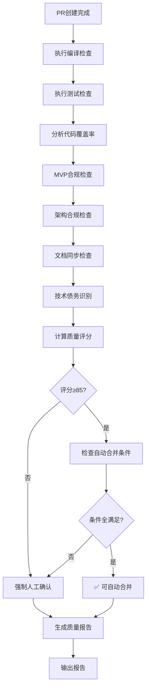

# LYBTZYZS 质量报告生成器

## 核心能力

### 1. 编译与测试分析
- **编译检查**：零错误、零警告验证
- **测试执行**：单元测试+集成测试全覆盖
- **覆盖率分析**：代码覆盖率≥85%
- **测试稳定性**：识别Flaky测试

### 2. 合规性检查
- **MVP合规**：调用lybtzyzs-mvp-compliance检查技术黑名单
- **架构合规**：调用lybtzyzs-arch-compliance检查依赖方向
- **文档同步**：调用lybtzyzs-doc-sync检查文档更新

### 3. 技术债务识别
- **代码债务**：代码重复、magic number、过长方法
- **架构债务**：循环依赖、紧耦合、违反SRP
- **测试债务**：缺失测试、测试覆盖率不足
- **文档债务**：过时文档、缺失注释

### 4. 质量评分计算
- **加权评分模型**：编译(20%) + 测试(30%) + 合规(30%) + 覆盖率(10%) + 债务(-10%)
- **及格线**：≥85分可自动合并
- **分级标准**：90-100优秀、85-89良好、70-84及格、<70不及格

---

## 使用场景

### 场景1: PR创建后质量检查

**触发**：workflow-orchestrator状态9（PRCreation）完成

**执行流程**：

```
1. 编译测试分析
   ├─ 执行: dotnet build LYBT.All.sln -c Release
   ├─ 检查: 0 errors, 0 warnings
   ├─ 执行: dotnet test LYBT.All.sln -c Release --settings tests/.runsettings
   └─ 收集: 测试结果、覆盖率数据

2. 合规性检查
   ├─ 调用: lybtzyzs-mvp-compliance
   │  └─ 结果: 0个违规项
   ├─ 调用: lybtzyzs-arch-compliance
   │  └─ 结果: 依赖方向正确
   └─ 调用: lybtzyzs-doc-sync
      └─ 结果: 3个文档已更新

3. 技术债务识别
   ├─ 代码分析（serena）
   │  ├─ TD-Code-001: Repository缺少分页（低优先级）
   │  └─ TD-Code-002: 定时器未实现取消令牌（中优先级）
   ├─ 架构分析
   │  └─ 无架构债务
   ├─ 测试分析
   │  └─ 覆盖率92%（高于85%）
   └─ 文档分析
      └─ 无文档债务

4. 质量评分计算
   ├─ 编译: 100分（20%权重）= 20分
   ├─ 测试: 100分（30%权重）= 30分
   ├─ 合规: 100分（30%权重）= 30分
   ├─ 覆盖率: 92分（10%权重）= 9.2分
   └─ 债务扣分: 2个债务 = -1分
   ──────────────────────
   总分: 88.2分

5. 自动合并决策
   ├─ 测试通过: ✅
   ├─ MVP合规: ✅
   ├─ 架构合规: ✅
   ├─ 质量评分≥85: ✅ (88.2)
   ├─ 技术债务≤3: ✅ (2个)
   └─ 关键债务=0: ✅
   ──────────────────────
   结论: 满足自动合并条件✅
```

**输出示例**：

```markdown
# PR质量报告 #150

**Epic**: #1500（病案草稿功能）
**生成时间**: 2025-11-07 10:30:00
**报告版本**: v1.0

---

## 📊 质量评分: 88/100（良好）

### 评分明细
| 维度 | 得分 | 权重 | 加权得分 | 状态 |
|-----|------|------|---------|------|
| 编译 | 100 | 20% | 20.0 | ✅ |
| 测试 | 100 | 30% | 30.0 | ✅ |
| 合规性 | 100 | 30% | 30.0 | ✅ |
| 覆盖率 | 92 | 10% | 9.2 | ✅ |
| 技术债务 | - | -10% | -1.2 | ⚠️ |
| **总分** | - | - | **88.0** | **✅ 良好** |

---

## ✅ 编译与测试（100分）

### 编译检查
```
dotnet build LYBT.All.sln -c Release --no-restore

结果: ✅ 成功
- Errors: 0
- Warnings: 0
- 耗时: 45秒
```

### 测试执行
```
dotnet test LYBT.All.sln -c Release --settings tests/.runsettings

结果: ✅ 全部通过
- 总测试数: 24
  - 新增测试: 8
  - 回归测试: 16
- 通过: 24
- 失败: 0
- 跳过: 0
- 耗时: 12秒
```

### 代码覆盖率
```
Branch Coverage: 92%
Line Coverage: 94%
Method Coverage: 96%

详细报告: coverage/index.html
```

---

## ✅ 合规性检查（100分）

### MVP合规性
```
✅ 检查通过（0个违规项）

检查项:
✅ 未使用Redis
✅ 未使用RabbitMQ/Kafka
✅ 未使用Docker
✅ 未使用CQRS/MediatR
✅ 未使用Event Sourcing
✅ 依赖注入仅使用构造函数注入
✅ 异步方法正确使用async/await
```

### 架构合规性
```
✅ 检查通过（依赖方向正确）

依赖检查:
✅ Controller → Service（正确）
✅ Service → Repository（正确）
✅ Repository → Entity（正确）
❌ 无Controller → Repository直接依赖
❌ 无Service → Presentation依赖
```

### 文档同步性
```
✅ 检查通过（文档已更新）

更新的文档:
✅ docs/explanation/architecture/server/README.md
✅ docs/reference/api-reference.md
✅ docs/explanation/design/medicalcase-draft-design.md

无需更新的文档:
- docs/guides/ (无架构变更)
- docs/explanation/requirements/ (需求未变)
```

---

## ⚠️ 技术债务（2个）

### TD-Code-001: Repository层缺少分页支持
- **类别**: 代码债务
- **优先级**: 🟡 低
- **影响**: 未来数据量大时性能问题
- **位置**: `src/Server/Infrastructure/Repositories/MedicalCaseDraftRepository.cs:45`
- **建议**: 添加分页参数（pageNumber, pageSize）
- **预计修复时间**: 30分钟

**详情**：
```csharp
// 当前实现
public async Task<List<MedicalCaseDraft>> GetByUserIdAsync(int userId)
{
    return await _dbContext.MedicalCaseDrafts
        .Where(x => x.CreatedBy == userId)
        .ToListAsync();
}

// 建议修复
public async Task<PagedResult<MedicalCaseDraft>> GetByUserIdAsync(
    int userId, int pageNumber = 1, int pageSize = 20)
{
    var query = _dbContext.MedicalCaseDrafts
        .Where(x => x.CreatedBy == userId);

    var total = await query.CountAsync();
    var items = await query
        .Skip((pageNumber - 1) * pageSize)
        .Take(pageSize)
        .ToListAsync();

    return new PagedResult<MedicalCaseDraft>(items, total, pageNumber, pageSize);
}
```

---

### TD-Code-002: 自动保存定时器未实现取消令牌
- **类别**: 代码债务
- **优先级**: 🟠 中
- **影响**: 内存泄漏风险
- **位置**: `src/Client/Desktop/Modules/LYBT.Desktop.MedicalCase/ViewModels/DraftViewModel.cs:120`
- **建议**: 实现IDisposable，在Dispose中取消定时器
- **预计修复时间**: 15分钟

**详情**：
```csharp
// 当前实现
public class DraftViewModel
{
    private Timer _autoSaveTimer;

    public DraftViewModel()
    {
        _autoSaveTimer = new Timer(AutoSave, null, 30000, 30000);
    }
}

// 建议修复
public class DraftViewModel : IDisposable
{
    private Timer _autoSaveTimer;
    private CancellationTokenSource _cts;

    public DraftViewModel()
    {
        _cts = new CancellationTokenSource();
        _autoSaveTimer = new Timer(AutoSave, null, 30000, 30000);
    }

    public void Dispose()
    {
        _cts?.Cancel();
        _autoSaveTimer?.Dispose();
    }
}
```

---

## ✅ 自动合并条件检查

| 条件 | 要求 | 实际 | 结果 |
|-----|------|------|------|
| 测试通过 | 全部通过 | 24/24 | ✅ |
| MVP合规 | 无违规 | 0个违规 | ✅ |
| 架构合规 | 依赖正确 | 正确 | ✅ |
| 质量评分 | ≥85 | 88 | ✅ |
| 技术债务 | ≤3个 | 2个 | ✅ |
| 关键债务 | =0个 | 0个 | ✅ |

**结论**: ✅ **满足自动合并条件**

---

## 📋 变更统计

### 代码变更
- 新增文件: 6个
- 修改文件: 2个
- 删除文件: 0个
- 总行数变更: +850 / -0

### 受影响模块
- Server.Domain.Entities: +80行（MedicalCaseDraft.cs）
- Server.Infrastructure.Repositories: +120行（MedicalCaseDraftRepository.cs）
- Server.Application.Services: +100行（MedicalCaseDraftService.cs）
- Server.Presentation.Controllers: +80行（MedicalCaseDraftController.cs）
- Client.Desktop.ViewModels: +200行（DraftViewModel.cs）
- Client.Desktop.Views: +120行（DraftView.xaml）
- Shared.DTOs: +50行（MedicalCaseDraftDto.cs）
- Tests: +100行（8个测试文件）

---

## 🎯 建议

### 立即行动
- ✅ **批准合并**: 技术债务优先级低，可稍后处理
- 💡 **创建Issue**: 为2个技术债务创建后续Issue（TD-001, TD-002）

### 后续改进
1. **分页支持**（TD-001）
   - Epic: #1500
   - 优先级: P2（低）
   - 预计: 30分钟

2. **定时器资源管理**（TD-002）
   - Epic: #1500
   - 优先级: P1（中）
   - 预计: 15分钟

3. **覆盖率提升**（可选）
   - 当前: 92%
   - 目标: 95%
   - 预计: 1小时

---

## 📎 附件

- [完整测试报告](tests/TestResults/test-report.html)
- [代码覆盖率报告](coverage/index.html)
- [MVP合规详细报告](reports/mvp-compliance.md)
- [架构合规详细报告](reports/arch-compliance.md)
- [技术债务清单](reports/tech-debt.md)

---

**报告生成器**: lybtzyzs-quality-reporter v1.0
**生成时间**: 2025-11-07 10:30:00
**报告格式**: Markdown v1.0
```

---

## 质量评分模型

### 评分公式

```
总分 = 编译得分 × 20%
     + 测试得分 × 30%
     + 合规得分 × 30%
     + 覆盖率得分 × 10%
     - 债务扣分 × 10%
```

### 各维度评分标准

#### 1. 编译得分（20%权重）

| 条件 | 得分 |
|-----|------|
| 0 errors, 0 warnings | 100 |
| 0 errors, 1-5 warnings | 90 |
| 0 errors, 6-10 warnings | 80 |
| 0 errors, >10 warnings | 70 |
| 1-3 errors | 50 |
| >3 errors | 0 |

#### 2. 测试得分（30%权重）

```
测试得分 = (通过测试数 / 总测试数) × 100

如果存在：
- 新增代码无测试覆盖：-10分
- Flaky测试（不稳定）：-5分/个
```

#### 3. 合规得分（30%权重）

```
合规得分 = (MVP合规 × 40% + 架构合规 × 40% + 文档同步 × 20%)

其中：
- MVP合规 = 100 - (违规项数 × 20)
- 架构合规 = 100 - (违规项数 × 15)
- 文档同步 = 100 - (缺失文档数 × 10)
```

#### 4. 覆盖率得分（10%权重）

```
覆盖率得分 = Branch Coverage %

最低要求: 85%
```

#### 5. 债务扣分（最多-10%）

| 债务数量 | 扣分 |
|---------|------|
| 0个 | 0 |
| 1-2个（低优先级） | -1 |
| 1-2个（中优先级） | -3 |
| 1-2个（高优先级） | -5 |
| 3-5个 | -7 |
| >5个 | -10 |
| 关键债务（任意数量） | -20 |

### 评级标准

| 分数范围 | 评级 | 是否可合并 |
|---------|------|-----------|
| 90-100 | ⭐⭐⭐ 优秀 | ✅ 强烈推荐 |
| 85-89 | ⭐⭐ 良好 | ✅ 推荐 |
| 70-84 | ⭐ 及格 | ⚠️ 需人工确认 |
| <70 | ❌ 不及格 | ❌ 禁止合并 |

---

## 工作流程



---

## Skills集成

### 调用其他Skills

```typescript
async function generateQualityReport(pr: PullRequest): Promise<QualityReport> {
    // 1. MVP合规检查
    const mvpResult = await invokeMvpCompliance(pr);

    // 2. 架构合规检查
    const archResult = await invokeArchCompliance(pr);

    // 3. 文档同步检查
    const docResult = await invokeDocSync(pr);

    // 4. 技术债务识别
    const techDebt = await identifyTechDebt(pr);

    // 5. 计算评分
    const score = calculateQualityScore({
        compile: compileResult,
        test: testResult,
        mvp: mvpResult,
        arch: archResult,
        doc: docResult,
        coverage: coverageResult,
        techDebt: techDebt
    });

    // 6. 生成报告
    return {
        score,
        compileResult,
        testResult,
        mvpResult,
        archResult,
        docResult,
        techDebt,
        autoMergeEligible: score >= 85 && checkAutoMergeConditions()
    };
}
```

### 被其他Skills调用

```typescript
// workflow-orchestrator在状态9（PRCreation）中调用
async function statePRCreation() {
    // 创建PR
    const pr = await createPullRequest(artifacts);

    // 生成质量报告
    const qualityReport = await invokeQualityReporter(pr);

    // 保存到artifacts
    artifacts.qualityReport = qualityReport;

    // 转换到QualityGate
    transitionTo("QualityGate", { qualityReport });
}
```

---

## 配置选项

```json
{
  "qualityReporter": {
    "enabled": true,
    "scoring": {
      "weights": {
        "compile": 0.20,
        "test": 0.30,
        "compliance": 0.30,
        "coverage": 0.10,
        "techDebt": 0.10
      },
      "passingScore": 85,
      "minCoverage": 85
    },
    "autoMergeConditions": {
      "testsPass": true,
      "mvpCompliance": true,
      "archCompliance": true,
      "minQualityScore": 85,
      "maxTechDebt": 3,
      "maxCriticalDebt": 0
    },
    "techDebtClassification": {
      "code": {
        "magicNumber": "low",
        "longMethod": "medium",
        "duplicateCode": "medium"
      },
      "architecture": {
        "circularDependency": "critical",
        "tightCoupling": "high"
      },
      "test": {
        "missingTest": "high",
        "flakyTest": "medium"
      },
      "documentation": {
        "outdatedDoc": "low",
        "missingComment": "low"
      }
    },
    "reportFormat": {
      "includeCompileDetails": true,
      "includeTestDetails": true,
      "includeComplianceDetails": true,
      "includeCoverageDetails": true,
      "includeTechDebtDetails": true,
      "includeChangeStats": true,
      "includeSuggestions": true
    }
  }
}
```

---

## 技术债务分类

### 代码债务（TD-Code）

| 类型 | 优先级 | 示例 |
|-----|-------|------|
| Magic Number | 🟡 低 | 硬编码常量30000（定时器间隔） |
| 过长方法 | 🟠 中 | 方法超过50行 |
| 代码重复 | 🟠 中 | 相同逻辑出现3次以上 |
| 缺少错误处理 | 🟠 中 | try-catch缺失 |
| 不安全类型转换 | 🔴 高 | 强制类型转换无验证 |

### 架构债务（TD-Arch）

| 类型 | 优先级 | 示例 |
|-----|-------|------|
| 循环依赖 | 🔴 关键 | A→B→C→A |
| 紧耦合 | 🟠 中 | Service直接依赖具体实现 |
| 违反SRP | 🟡 低 | 一个类承担多个职责 |
| 层级穿透 | 🔴 高 | Controller直接访问Repository |

### 测试债务（TD-Test）

| 类型 | 优先级 | 示例 |
|-----|-------|------|
| 缺失测试 | 🔴 高 | 新增方法无测试覆盖 |
| Flaky测试 | 🟠 中 | 测试不稳定 |
| 覆盖率不足 | 🟡 低 | 覆盖率<85% |

### 文档债务（TD-Doc）

| 类型 | 优先级 | 示例 |
|-----|-------|------|
| 过时文档 | 🟡 低 | 文档与代码不一致 |
| 缺失注释 | 🟡 低 | 复杂逻辑无注释 |
| API文档缺失 | 🟠 中 | 新增API无文档 |

---

## 输出格式

### Markdown报告

- **文件路径**: `reports/quality-report-pr-{number}.md`
- **包含内容**: 评分、编译测试、合规、债务、建议
- **适用场景**: 人工审查、存档

### JSON数据

- **文件路径**: `reports/quality-report-pr-{number}.json`
- **包含内容**: 结构化数据
- **适用场景**: 自动化工具、CI/CD集成

```json
{
  "pr": {
    "number": 150,
    "title": "病案草稿功能",
    "epicNumber": 1500
  },
  "score": {
    "total": 88.0,
    "compile": 100,
    "test": 100,
    "compliance": 100,
    "coverage": 92,
    "techDebt": -12
  },
  "autoMergeEligible": true,
  "techDebt": [
    {
      "id": "TD-Code-001",
      "category": "code",
      "priority": "low",
      "title": "Repository层缺少分页支持",
      "estimatedFixTime": 30
    },
    {
      "id": "TD-Code-002",
      "category": "code",
      "priority": "medium",
      "title": "定时器未实现取消令牌",
      "estimatedFixTime": 15
    }
  ],
  "generatedAt": "2025-11-07T10:30:00Z"
}
```

---

## 触发关键词

**自动触发**:
- "质量报告"
- "质量检查"
- "质量评分"
- "quality report"
- "generate quality report"

**手动触发**:
```
@lybtzyzs-quality-reporter 为PR #150生成质量报告
```

---

**最后更新**: 2025-11-07
**版本**: v1.0
