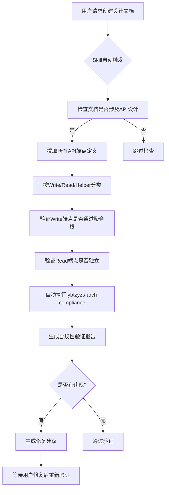

# 架构验证Skills使用指南

> **文档版本**：v1.0  
> **创建日期**：2025-10-24  
> **最后更新**：2025-10-24  
> **关联Issue**：Epic #1600（架构重构）  
> **目的**：防止未来再次出现类似Epic #1589的架构违规问题

---

## 📋 概述

本指南介绍两个自定义Claude Skills，用于在需求和设计阶段自动检查架构合规性：

| Skill名称 | 检查阶段 | 核心功能 | 触发关键词 |
|----------|---------|---------|-----------|
| **lybtzyzs-requirements-arch-guard** | 需求阶段 | 检查架构约束章节完整性 | 医案、诊疗、处方、需求文档 |
| **lybtzyzs-design-arch-validator** | 设计阶段 | 验证API设计架构合规性 | 设计文档、API端点、DDD |

---

## 🔍 问题背景：为什么需要这些Skills？

### Epic #1589架构违规回顾

**问题严重性**：
- 引入了**9个架构违规**（5个Critical、2个High、2个Medium）
- 违规横跨Controller、Service、Repository、DTO四层
- 所有Write操作都绕过了MedicalCase聚合根

**根本原因分析**：

| 阶段 | 问题 | 后果 |
|------|------|------|
| **需求阶段** | ❌ 无"架构约束"章节<br>❌ 未引用v2.0架构文档<br>❌ 未要求设计阶段架构验证 | 设计阶段无约束可遵循 |
| **设计阶段** | ❌ 声称遵循DDD但实际违规<br>❌ 未引用v2.0架构文档<br>❌ 未执行arch-compliance检查<br>❌ 路径依赖（复制现有违规模式） | 直接生成违规API设计 |

**用户反馈**：
> "我发现有些违规是epic 1589带入的。说明在设计的时候没有考虑充分。"

**解决方案**：
- 需求阶段 → **lybtzyzs-requirements-arch-guard**（架构约束门禁）
- 设计阶段 → **lybtzyzs-design-arch-validator**（架构合规验证器）

---

## 🛡️ Skill 1: lybtzyzs-requirements-arch-guard

### 核心目标

**在需求文档生成阶段强制添加架构约束章节，防止需求与架构脱节。**

### 工作流程

```mermaid
graph TD
    A[用户请求创建需求文档] --> B{Skill自动触发}
    B --> C[检查文档是否包含医案/诊疗/处方关键词]
    C -->|是| D[检查是否有"架构约束"章节]
    C -->|否| E[跳过检查]
    D -->|有| F[验证章节内容完整性]
    D -->|无| G[生成架构约束章节模板]
    F --> H[生成检查报告]
    G --> H
    H --> I[用户审查并补充]
```

### 检查清单

Skill会自动检查需求文档是否满足以下要求：

- [ ] **是否有"架构约束"章节**
- [ ] **是否引用v2.0架构文档** (`medicalcase-architecture-correction-plan-v2.md`)
- [ ] **是否明确Write/Read Layer分离要求**
- [ ] **是否要求设计阶段必须执行架构验证**
- [ ] **是否明确聚合根边界约束**（如果涉及MedicalCase/Consultation/Prescription）
- [ ] **是否禁止绕过聚合根的Write操作**

### 自动生成的架构约束模板

如果需求文档缺少"架构约束"章节，Skill会自动生成以下模板：

```markdown
## 架构约束

### REQ-ARCH-001：聚合根边界约束（Critical）⭐⭐⭐

**约束内容**：
- ✅ MedicalCase作为聚合根，Consultation和Prescription作为子实体
- ✅ 所有Write操作必须通过MedicalCase聚合根API
- ❌ 禁止直接调用 `POST/PUT/DELETE /consultations/{id}/*`
- ❌ 禁止直接调用 `POST/PUT/DELETE /prescriptions/{id}/*`

**参考文档**：
- `docs/explanation/design/medicalcase-architecture-correction-plan-v2.md`
- `docs/explanation/architecture/server/medicalcase-module.md`

**验收标准**：
- [ ] 设计阶段所有Write操作API路径以 `/medicalcases/{id}/` 开头
- [ ] 设计阶段必须执行 `lybtzyzs-arch-compliance` Skill验证

### REQ-ARCH-002：Write/Read Layer分离要求（High）⭐⭐

**约束内容**：
- ✅ Write Layer：所有修改状态的操作通过聚合根
- ✅ Read Layer：查询操作可以独立访问子实体
- ✅ Helper Layer：工具类操作不修改状态

**示例**：
```csharp
// ✅ Write Layer - 正确
POST /api/v1/medicalcases/{id}/complete-step1
PUT  /api/v1/medicalcases/{id}/reset-steps

// ✅ Read Layer - 正确
GET /api/v1/consultations/{id}
GET /api/v1/prescriptions/medicalcase/{id}

// ❌ Write Layer - 错误（绕过聚合根）
POST /api/v1/consultations/{id}/complete-step1
DELETE /api/v1/prescriptions/{id}
```

### REQ-ARCH-003：设计阶段架构验证要求（High）⭐⭐

**约束内容**：
- ✅ 设计文档必须包含"架构合规性验证"章节
- ✅ 设计阶段必须执行 `lybtzyzs-design-arch-validator` Skill
- ✅ 设计阶段必须执行 `lybtzyzs-arch-compliance` Skill
- ✅ 所有架构验证问题必须在设计阶段解决

**验收标准**：
- [ ] 设计文档包含"架构合规性验证"章节
- [ ] 设计文档附带架构验证报告
- [ ] 所有Critical/High违规项在设计阶段修复
```

### 输出示例

**检查报告**：
```markdown
# 需求文档架构约束检查报告

**文档路径**：`docs/explanation/requirements/medicalcase-consultation-prescription-enhancement-requirements.md`  
**检查时间**：2025-10-24 15:30:00  
**Skill版本**：lybtzyzs-requirements-arch-guard v1.0

## 检查结果

### ❌ Critical Issue：缺少"架构约束"章节

**问题描述**：
- 需求文档未包含"架构约束"章节
- 设计阶段无明确架构约束可遵循
- 可能导致设计违反v2.0三层架构规范

**影响范围**：
- 设计阶段可能生成违规API端点
- 可能重复Epic #1589的架构违规问题

**修复建议**：
1. 在需求文档中添加"架构约束"章节
2. 使用下方自动生成的模板作为起点
3. 根据具体需求调整约束内容

---

## 自动生成的架构约束章节模板

[插入上述模板内容]

---

## 下一步操作

1. ✅ 复制上述模板到需求文档
2. ✅ 根据具体需求调整REQ-ARCH-001/002/003
3. ✅ 确认所有约束条件明确可验证
4. ✅ 设计阶段使用 `lybtzyzs-design-arch-validator` 验证合规性
```

---

## 🔧 Skill 2: lybtzyzs-design-arch-validator

### 核心目标

**在设计文档生成阶段自动验证API设计的架构合规性，防止违规代码实施。**

### 工作流程



### API端点验证规则

#### Write Layer（修改状态）

**正确模式**（✅ 通过聚合根）：
```regex
POST   /api/v1/medicalcases/\{id\}/.*
PUT    /api/v1/medicalcases/\{id\}/.*
PATCH  /api/v1/medicalcases/\{id\}/.*
DELETE /api/v1/medicalcases/\{id\}/.*
```

**违规模式**（❌ 绕过聚合根）：
```regex
POST   /api/v1/consultations/\{id\}/.*
PUT    /api/v1/consultations/\{id\}/.*
DELETE /api/v1/consultations/\{id\}

POST   /api/v1/prescriptions/\{id\}/.*
PUT    /api/v1/prescriptions/\{id\}/.*
DELETE /api/v1/prescriptions/\{id\}
```

**特殊情况**（需人工判断）：
```regex
POST /api/v1/consultations          # 独立创建 - 需检查业务合理性
PUT  /api/v1/consultations/\{id\}   # 独立更新 - 通常为违规
```

#### Read Layer（查询操作）

**允许模式**（✅ 独立查询）：
```regex
GET /api/v1/consultations/.*
GET /api/v1/prescriptions/.*
GET /api/v1/medicalcases/.*
```

**注意事项**：
- Read操作允许独立访问子实体
- 无需通过聚合根路径
- 但查询逻辑中不应有状态修改

#### Helper Layer（工具操作）

**允许模式**（✅ 不修改状态）：
```regex
GET /api/v1/prescriptions/formula/\{id\}/preview
GET /api/v1/consultations/templates
```

**注意事项**：
- Helper操作不应修改任何实体状态
- 仅提供辅助功能（预览、模板、计算等）

### 自动执行的验证步骤

Skill在验证API设计时会自动执行以下步骤：

1. **提取API端点**：从设计文档中解析所有HTTP端点定义
2. **分类验证**：按Write/Read/Helper分类并验证规则
3. **执行arch-compliance**：自动运行 `lybtzyzs-arch-compliance` Skill
4. **生成报告**：综合API端点验证和代码合规性检查结果
5. **提供修复建议**：针对每个违规项提供具体修复方案

### 输出示例

**架构合规性验证报告**：
```markdown
# 设计文档架构合规性验证报告

**文档路径**：`docs/explanation/design/medicalcase-consultation-prescription-enhancement-design.md`  
**检查时间**：2025-10-24 16:00:00  
**Skill版本**：lybtzyzs-design-arch-validator v1.0

---

## 第一部分：API端点架构验证

### Write Layer端点检查

#### ❌ Critical Violation #1：绕过聚合根的Step1完成操作

**违规端点**：
```http
POST /api/v1/consultations/{id}/complete-step1
```

**问题描述**：
- Write操作直接访问Consultation子实体
- 绕过了MedicalCase聚合根

**正确设计**：
```http
POST /api/v1/medicalcases/{id}/complete-step1
```

**影响文档位置**：
- Line 261-289: ConsultationController.CompleteStep1 API设计

---

#### ❌ Critical Violation #2：绕过聚合根的处方删除操作

**违规端点**：
```http
DELETE /api/v1/prescriptions/{id}
```

**问题描述**：
- Delete操作直接访问Prescription子实体
- 违反聚合根边界约束

**正确设计**：
```http
DELETE /api/v1/medicalcases/{id}/prescription
```

**影响文档位置**：
- Line 373-399: PrescriptionsController.PhysicalDelete API设计

---

### Read Layer端点检查

#### ✅ Pass：Consultation查询操作

**端点**：
```http
GET /api/v1/consultations/{id}
GET /api/v1/consultations/medicalcase/{medicalCaseId}
```

**验证结果**：
- Read操作允许独立访问子实体
- 符合v2.0架构规范

---

## 第二部分：lybtzyzs-arch-compliance自动检查结果

### Controller层违规（3个Critical）

[附带完整的arch-compliance报告内容]

### Service层违规（2个High）

[附带完整的arch-compliance报告内容]

### Repository层违规（1个Medium）

[附带完整的arch-compliance报告内容]

---

## 验证总结

**总违规数**：9个
- Critical：5个
- High：2个
- Medium：2个

**必须在设计阶段修复**：
- ✅ 所有Critical违规（5个）
- ✅ 所有High违规（2个）
- ⚠️ Medium违规可延后到实施阶段

**下一步操作**：
1. ✅ 修改所有违规API端点为聚合根路径
2. ✅ 更新设计文档中的API定义
3. ✅ 重新运行本Skill验证修复结果
4. ✅ 确认所有Critical/High违规已解决后进入实施阶段
```

---

## 🚀 使用场景与最佳实践

### 场景1：创建新需求文档

**步骤**：
1. 用户请求Claude创建需求文档：
   ```
   "为XXX功能创建需求文档"
   ```

2. **lybtzyzs-requirements-arch-guard自动触发**：
   - 检查需求是否涉及MedicalCase/Consultation/Prescription
   - 检查是否有"架构约束"章节
   - 如无则自动生成模板

3. 用户根据模板补充架构约束：
   - 确认聚合根边界约束
   - 确认Write/Read Layer分离要求
   - 确认设计阶段验证要求

4. 保存需求文档并进入设计阶段

---

### 场景2：创建新设计文档

**步骤**：
1. 用户请求Claude创建设计文档：
   ```
   "基于需求文档XXX创建设计文档"
   ```

2. **lybtzyzs-design-arch-validator自动触发**：
   - 提取所有API端点定义
   - 验证Write端点是否通过聚合根
   - 自动运行lybtzyzs-arch-compliance

3. 审查验证报告：
   - 检查是否有Critical/High违规
   - 如有则修改API设计
   - 重新验证直到所有违规解决

4. 保存设计文档并进入实施阶段

---

### 场景3：修改现有需求/设计文档

**步骤**：
1. 用户请求修改文档：
   ```
   "在需求文档中添加XXX功能"
   ```

2. **对应Skill自动触发**：
   - 重新检查架构约束章节（需求阶段）
   - 重新验证API端点合规性（设计阶段）

3. 确认修改未引入新违规：
   - 检查验证报告
   - 修复任何新违规
   - 更新文档

---

## ⚠️ 注意事项与常见问题

### 1. Skills不是万能的

**Skills只检查文档，不检查代码**：
- ✅ Skills在需求/设计阶段预防违规
- ❌ Skills不替代实施阶段的arch-compliance检查
- ✅ 实施后仍需运行 `lybtzyzs-arch-compliance` 验证代码

### 2. 需要人工判断的情况

**边界情况**：
```http
# 情况A：独立创建Consultation（无MedicalCase）
POST /api/v1/consultations
# 判断：是否有业务合理性？还是应该通过MedicalCase创建？

# 情况B：批量查询
GET /api/v1/consultations?patientId={id}
# 判断：查询逻辑是否纯粹（无状态修改）？
```

**建议**：遇到边界情况时，参考以下原则：
1. 优先通过聚合根操作（保守）
2. 只有明确的业务需求才允许独立操作（激进）
3. 咨询架构师或团队讨论

### 3. 与现有违规代码的兼容性

**问题**：现有代码库可能已有违规API

**解决方案**：
- ✅ 新功能必须100%符合规范
- ⚠️ 旧代码标记为 `[Obsolete]`
- ⚠️ 逐步重构旧代码（通过Epic跟踪）

**示例**：
```csharp
// 旧代码（标记为Obsolete）
[Obsolete("请使用 POST /api/v1/medicalcases/{id}/complete-step1")]
[HttpPost("{id}/complete-step1")]
public async Task<IActionResult> CompleteStep1(Guid id)
{
    // 旧实现...
}

// 新代码（符合规范）
[HttpPost("{id}/complete-step1")]
public async Task<IActionResult> CompleteStep1(Guid id)
{
    // 新实现（在MedicalCaseController中）...
}
```

---

## 📊 效果评估

### Epic #1589问题复盘

**如果当时使用了这两个Skills**：

| 阶段 | 问题 | Skill干预 | 预期结果 |
|------|------|----------|---------|
| **需求阶段** | 无架构约束章节 | lybtzyzs-requirements-arch-guard自动生成模板 | ✅ 需求文档包含明确架构约束 |
| **设计阶段** | 所有Write API违规 | lybtzyzs-design-arch-validator报告9个违规 | ✅ 设计阶段修复所有违规 |
| **实施阶段** | 生成违规代码 | - | ✅ 不会生成违规代码 |

**结论**：
- ✅ Epic #1589的9个架构违规可以在设计阶段100%预防
- ✅ 避免实施后的返工成本（估计节省4-6小时）
- ✅ 保持代码库架构一致性

---

## 🔄 持续改进

### Skill版本演进计划

**v1.0（当前版本）**：
- ✅ 基础架构约束检查
- ✅ API端点验证（Write/Read/Helper）
- ✅ 自动生成模板

**v2.0（计划中）**：
- [ ] 支持更多聚合根场景（非MedicalCase）
- [ ] 支持自定义架构规则配置
- [ ] 集成到CI/CD流程（pre-commit hook）

**v3.0（远期）**：
- [ ] 实时代码合规性监控
- [ ] IDE插件集成（实时提示）
- [ ] 架构违规趋势分析

---

## 📚 参考资料

### 核心架构文档
- `docs/explanation/design/medicalcase-architecture-correction-plan-v2.md` - v2.0三层架构规范
- `docs/explanation/architecture/server/medicalcase-module.md` - MedicalCase模块架构
- `docs/explanation/architecture/server/README.md` - Server端架构总览

### Skills技术文档
- `.claude/skills/lybtzyzs-requirements-arch-guard/SKILL.md`
- `.claude/skills/lybtzyzs-design-arch-validator/SKILL.md`
- `.claude/skills/lybtzyzs-arch-compliance/SKILL.md`

### Epic #1589复盘文档
- `docs/explanation/requirements/medicalcase-consultation-prescription-enhancement-requirements.md` - 需求文档（违规来源）
- `docs/explanation/design/medicalcase-consultation-prescription-enhancement-design.md` - 设计文档（违规来源）
- `docs/explanation/design/medicalcase-consultation-prescription-architecture-refactoring-plan.md` - 重构方案

---

## ❓ 常见问题FAQ

### Q1: Skills会自动修复违规吗？

**A**: 不会。Skills只检测和报告违规，不会自动修改文档或代码。原因：
- 架构决策需要人工判断
- 自动修复可能误判边界情况
- 保持用户对架构的控制权

### Q2: Skills检查需要多长时间？

**A**: 通常<1分钟：
- 需求阶段：检查章节完整性（<10秒）
- 设计阶段：验证API端点（<30秒）+ arch-compliance检查（<30秒）

### Q3: 如果Skills误报怎么办？

**A**: 提供反馈并跳过：
```markdown
<!-- SKIP-ARCH-CHECK: 业务特殊需求，已与架构师确认 -->
POST /api/v1/consultations/{id}/special-operation
```

### Q4: Skills支持其他聚合根吗？

**A**: v1.0仅支持MedicalCase聚合根。v2.0计划支持：
- Patient聚合根
- User聚合根
- 自定义聚合根配置

---

## 🎯 总结

### 核心价值

**预防 > 修复**：
- ✅ 在需求/设计阶段发现问题成本最低
- ✅ 避免实施后的返工和重构
- ✅ 保持代码库架构一致性

**自动化 > 人工**：
- ✅ Skills自动触发，无需手动运行
- ✅ 自动生成模板，减少重复工作
- ✅ 集成到现有开发流程，无缝使用

**明确 > 模糊**：
- ✅ 明确的架构约束条件（REQ-ARCH-001/002/003）
- ✅ 明确的验证规则（Write/Read/Helper）
- ✅ 明确的修复建议（违规 → 正确模式）

---

**文档维护**：
- 本指南随Skills版本更新
- 如有问题或建议，请在Epic #1600中反馈
- 最新版本始终在 `docs/how-to-guides/shared/architecture-validation-skills-guide.md`
