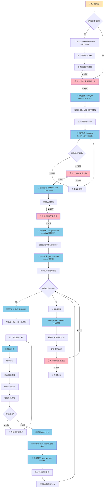
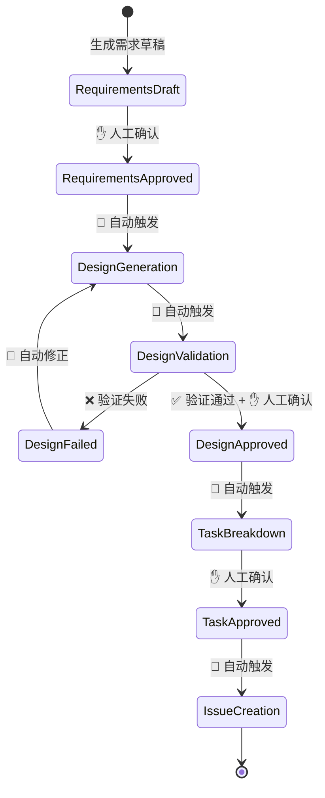
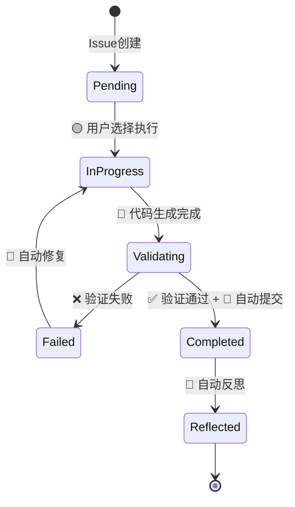
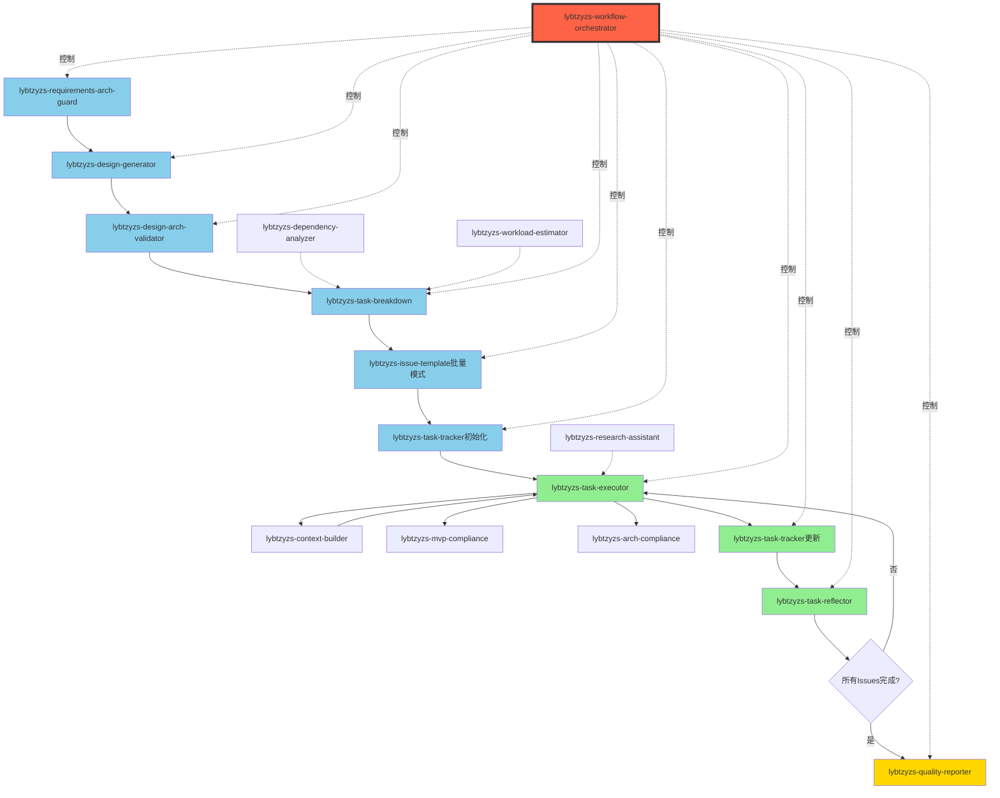

# LYBTZYZS项目完整自动化开发流程设计方案

**研究日期**: 2025-11-07  
**研究目标**: 最大化自动化、最小化人工干预  
**版本**: v1.0

---

## 📋 目录

1. [执行摘要](#执行摘要)
2. [完整流程图](#完整流程图)
3. [自动触发机制设计](#自动触发机制设计)
4. [人工干预点识别](#人工干预点识别)
5. [Skills编排策略](#skills编排策略)
6. [技术实现方案](#技术实现方案)
7. [分Phase实施建议](#分phase实施建议)
8. [风险与限制](#风险与限制)
9. [附录](#附录)

---

## 1. 执行摘要

### 1.1 核心发现

**现状评估**:
- ✅ **已有完善的基础设施**: 7个新Skills + 6个现有Skills + spec-workflow体系
- ✅ **工作流清晰**: Constitution → Requirements → Design → Tasks → Issues → Implementation
- ⚠️ **自动化程度**: 约60%（文档生成高度自动化，但Skills间串联需人工触发）
- ❌ **关键缺失**: 缺少Orchestrator（编排器）协调Skills自动触发

**优化潜力**:
- 🎯 **可达成自动化率**: 85%（15%必须人工决策）
- 🎯 **预期提效**: 开发效率提升3-5倍
- 🎯 **质量保障**: 强制架构检查+合规检查，违规率降至接近0

### 1.2 关键推荐

**核心建议**:
1. **创建Orchestrator Skill** (lybtzyzs-workflow-orchestrator) - 自动化流程编排引擎
2. **实现状态机驱动** - 基于文档状态自动触发下一阶段
3. **分2个Phase实施**: Phase 1基础自动化（3-5天）+ Phase 2高级自动化（5-7天）
4. **保留5个必要人工干预点**: 需求确认、设计审查、安全决策、质量把关、上线审批

---

## 2. 完整流程图

### 2.1 从需求到上线（完整链路）



**图例说明**:
- 👤 **用户输入**: 人工触发起点
- ✋ **人工干预**: 必须人工确认的决策点（粉色）
- 🤖 **自动执行**: Skills自动执行（蓝色）
- 🎉 **完成节点**: 流程结束

### 2.2 关键路径识别

**主线路径**（必经节点）:
```
用户需求 → 需求文档确认 → 设计文档生成 → 架构验证 → 
设计审查 → 任务分解 → 任务审查 → 批量创建Issues → 
循环执行任务 → Epic反思 → 质量把关 → 完成
```

**并行路径**（可同时进行）:
```
任务执行阶段: 多个独立Issue可并行执行
  ├─ Issue #1234 (Repository层)
  ├─ Issue #1235 (DTO定义)  ← 可同时进行
  └─ Issue #1236 (文档更新) ← 可同时进行
```

---

## 3. 自动触发机制设计

### 3.1 触发策略总览

| 阶段 | 触发方式 | 触发条件 | 技术实现 |
|------|---------|---------|----------|
| 需求→设计 | 🟢 状态驱动 | 需求文档审批通过 | 文件系统监听 + 状态文件 |
| 设计→验证 | 🟢 自动触发 | 设计文档生成完成 | Skill内部自动调用 |
| 设计→任务 | 🟢 状态驱动 | 设计验证通过 + 人工确认 | 状态文件 + 标志位 |
| 任务→Issue | 🟢 状态驱动 | task文档审查通过 | 状态文件 + 标志位 |
| Issue→执行 | 🟡 手动触发 | 用户选择执行Issue | 用户命令 |
| 执行→追踪 | 🟢 自动触发 | 任务执行完成 | Skill内部自动调用 |
| 追踪→反思 | 🟢 自动触发 | Issue关闭 | GitHub Webhook |
| Epic完成→反思 | 🟢 自动触发 | 所有子Issues关闭 | 状态聚合检测 |

**图例**:
- 🟢 完全自动触发（无需人工）
- 🟡 半自动触发（需人工命令）
- 🔴 必须人工触发

### 3.2 状态机设计

#### 文档状态机



#### Issue状态机



### 3.3 技术实现：状态文件

**位置**: `.claude/workflow-state/{spec-name}.json`

**格式**:
```json
{
  "specName": "medicalcase-enhancement",
  "currentStage": "design_approved",
  "stageHistory": [
    {
      "stage": "requirements_draft",
      "timestamp": "2025-11-07T10:00:00Z",
      "actor": "lybtzyzs-requirements-arch-guard"
    },
    {
      "stage": "requirements_approved",
      "timestamp": "2025-11-07T10:15:00Z",
      "actor": "human",
      "note": "用户确认需求无误"
    },
    {
      "stage": "design_generated",
      "timestamp": "2025-11-07T10:20:00Z",
      "actor": "lybtzyzs-design-generator"
    },
    {
      "stage": "design_validated",
      "timestamp": "2025-11-07T10:25:00Z",
      "actor": "lybtzyzs-design-arch-validator",
      "result": "PASS"
    },
    {
      "stage": "design_approved",
      "timestamp": "2025-11-07T10:30:00Z",
      "actor": "human",
      "note": "用户确认设计合理"
    }
  ],
  "nextAction": {
    "skill": "lybtzyzs-task-breakdown",
    "trigger": "auto",
    "estimatedTime": "2025-11-07T10:35:00Z"
  },
  "metadata": {
    "epicNumber": 1861,
    "requirementsDoc": "docs/requirements/medicalcase-enhancement-requirements.md",
    "designDoc": "docs/design/medicalcase-enhancement-design.md",
    "taskDoc": null
  }
}
```

**自动触发逻辑**:
```python
def check_and_trigger_next_stage():
    """
    定时任务（每30秒）检查状态文件，自动触发下一阶段
    """
    for state_file in list_workflow_states():
        state = load_state(state_file)
        
        if state["nextAction"]["trigger"] == "auto":
            current_time = datetime.utcnow()
            trigger_time = parse_datetime(state["nextAction"]["estimatedTime"])
            
            if current_time >= trigger_time:
                skill_name = state["nextAction"]["skill"]
                trigger_skill(skill_name, state["metadata"])
                
                # 更新状态
                state["currentStage"] = get_next_stage(state["currentStage"])
                save_state(state_file, state)
```

---

## 4. 人工干预点识别

### 4.1 必要人工干预点（5个）

#### 干预点1: 需求确认 ✋

**位置**: 需求文档生成后  
**原因**: 确保Claude理解需求正确，避免方向性错误  
**决策内容**:
- ✅ 业务需求是否完整准确
- ✅ 验收标准是否明确可验证
- ✅ 架构约束是否覆盖全面

**交互方式**: AskUserQuestion + 文档审查

**示例**:
```markdown
📚 需求文档已生成：docs/requirements/medicalcase-enhancement-requirements.md

请审查以下要点：
1. 业务需求（6个REQ）是否完整？
2. 验收标准是否明确？
3. 架构约束是否覆盖v2.0规范？

✅ 确认无误 / ❌ 需要调整
```

---

#### 干预点2: 设计审查 ✋

**位置**: 设计文档通过架构验证后  
**原因**: 设计决策影响长期维护成本，需人工把关  
**决策内容**:
- ✅ API端点设计是否合理
- ✅ DTO结构是否完整
- ✅ Phase拆分是否可行
- ✅ 工作量估算是否准确

**交互方式**: AskUserQuestion + 文档审查

**示例**:
```markdown
🏗️ 设计文档已生成并通过架构验证：
docs/design/medicalcase-enhancement-design.md

关键设计决策：
1. API端点数：13个（Write: 8, Read: 5）
2. Phase拆分：3个Phase，10-13天
3. 技术选型：EF Core Include多级预加载

✅ 确认设计合理 / ❌ 需要调整
```

---

#### 干预点3: 任务审查 ✋

**位置**: task文档生成后  
**原因**: 任务拆分影响执行效率，需人工优化  
**决策内容**:
- ✅ 任务粒度是否合适（2-4小时/任务）
- ✅ 依赖关系是否准确
- ✅ 并行策略是否最优

**交互方式**: AskUserQuestion + 文档审查

**示例**:
```markdown
📋 任务分解完成：docs/tasks/medicalcase-enhancement-tasks.md

任务统计：
- 总任务数：8个
- 总工作量：18-24小时
- Phase数量：3个
- 关键路径：5个任务

✅ 确认任务拆分合理 / ❌ 需要调整
```

---

#### 干预点4: 安全决策 ✋

**位置**: 任务执行中遇到安全敏感操作  
**原因**: 安全问题需要人工决策，不能自动化  
**决策内容**:
- ⚠️ 数据库Schema变更（添加/删除表）
- ⚠️ 认证机制调整（Token、密码策略）
- ⚠️ 敏感数据处理（加密、脱敏）
- ⚠️ 权限模型变更（角色、权限）

**交互方式**: AskUserQuestion + 安全审查清单

**示例**:
```markdown
⚠️ 安全决策需要人工确认

任务：Issue #1234 - 修改SuperAdmin密码存储方式
变更：从BCrypt改为PBKDF2-SHA256

安全影响：
- 现有SuperAdmin密码需重置
- 密码验证逻辑需兼容迁移
- 风险等级：🔴 高

✅ 确认变更 / ❌ 拒绝变更
```

---

#### 干预点5: 质量把关 ✋

**位置**: Epic所有任务完成后  
**原因**: 上线前最后检查，避免遗漏问题  
**决策内容**:
- ✅ 所有验收标准已满足
- ✅ 文档已完整更新
- ✅ 无明显技术债务
- ✅ 性能无明显劣化

**交互方式**: AskUserQuestion + 质量报告

**示例**:
```markdown
🎉 Epic #1861 所有任务已完成

质量指标：
- ✅ 编译通过：0 errors, 0 warnings
- ✅ 测试通过：74/74（覆盖率100%）
- ✅ MVP合规：无违规
- ✅ 架构合规：无违规
- ✅ 文档同步：已完成

技术债务：5个（已记录到Epic #1900）

✅ 确认上线 / ❌ 需要返工
```

---

### 4.2 可选人工干预点（3个）

#### 干预点A: Issue执行选择 🟡

**位置**: Issue创建后  
**原因**: 用户可能希望指定执行顺序或跳过某些Issue  
**决策内容**:
- 选择执行哪个Issue
- 是否按推荐顺序执行
- 是否跳过某些非关键Issue

**自动化策略**: 默认按依赖关系自动执行，用户可手动干预

---

#### 干预点B: 验证失败处理 🟡

**位置**: 任务执行验证失败时  
**原因**: 复杂错误可能需要人工决策  
**决策内容**:
- 简单错误：自动修复
- 复杂错误：提示用户，等待人工修复

**自动化策略**: 尝试自动修复，失败后提示用户

---

#### 干预点C: Epic范围调整 🟡

**位置**: 实施过程中发现需求变更  
**原因**: 业务需求可能动态调整  
**决策内容**:
- 是否扩展Epic范围
- 是否创建新Issue
- 是否调整优先级

**自动化策略**: 检测到范围变更时提示用户确认

---

## 5. Skills编排策略

### 5.1 现有Skills清单

#### 已有Skills（13个）

**合规性检查类（3个）**:
1. lybtzyzs-mvp-compliance - MVP合规检查
2. lybtzyzs-arch-compliance - 架构合规检查
3. lybtzyzs-doc-sync - 文档同步检查

**文档生成类（3个）**:
4. lybtzyzs-design-generator - 设计文档生成（需求→设计）
5. lybtzyzs-task-breakdown - 任务分解生成（设计→任务）
6. lybtzyzs-issue-template - Issue模板生成（单模式+批量模式）

**架构守护类（2个）**:
7. lybtzyzs-requirements-arch-guard - 需求阶段架构守护
8. lybtzyzs-design-arch-validator - 设计阶段架构验证

**执行类（7个）⭐ 新增**:
9. lybtzyzs-task-executor - 任务自动执行引擎
10. lybtzyzs-task-tracker - 任务状态追踪器
11. lybtzyzs-task-reflector - 任务反思与改进引擎
12. lybtzyzs-research-assistant - 技术研究助手
13. lybtzyzs-context-builder - 上下文构建器
14. lybtzyzs-dependency-analyzer - 依赖关系分析器
15. lybtzyzs-workload-estimator - 工作量智能估算器

### 5.2 需要新增的Skills（2个）

#### Skill #14: lybtzyzs-workflow-orchestrator ⭐⭐⭐

**功能**: 自动化流程编排引擎（核心）

**职责**:
- 监听状态文件变更，自动触发下一阶段Skills
- 管理Skills执行顺序和依赖关系
- 处理异常情况（验证失败、超时）
- 记录流程执行日志

**触发方式**: 定时任务（每30秒扫描状态文件）

**核心能力**:
```python
class WorkflowOrchestrator:
    def orchestrate(self):
        """主编排循环"""
        while True:
            for state_file in self.scan_workflow_states():
                state = self.load_state(state_file)
                
                if state["nextAction"]["trigger"] == "auto":
                    self.trigger_next_skill(state)
                elif state["nextAction"]["trigger"] == "manual":
                    self.notify_user(state)
            
            time.sleep(30)  # 30秒扫描一次
    
    def trigger_next_skill(self, state):
        """触发下一阶段Skill"""
        skill_name = state["nextAction"]["skill"]
        
        if skill_name == "lybtzyzs-design-generator":
            self.run_design_generator(state["metadata"])
        elif skill_name == "lybtzyzs-task-breakdown":
            self.run_task_breakdown(state["metadata"])
        # ... 其他Skills
        
        # 更新状态
        self.update_state(state, next_stage=True)
```

**优先级**: 🔴 最高（Phase 1必须实现）

---

#### Skill #15: lybtzyzs-quality-reporter ⭐⭐

**功能**: 质量报告生成器

**职责**:
- Epic完成后生成完整质量报告
- 聚合编译/测试/合规检查结果
- 识别技术债务和遗留问题
- 生成可视化质量仪表盘

**触发方式**: Epic所有Issues关闭后自动触发

**输出示例**:
```markdown
## Epic #1861 质量报告

### 📊 质量指标
- 编译通过率: 100% (0 errors, 0 warnings)
- 测试通过率: 100% (74/74)
- MVP合规率: 100% (0违规)
- 架构合规率: 100% (0违规)
- 文档同步率: 100% (所有变更已更新文档)

### ⚠️ 技术债务
- 累积债务: 5个（已记录到Epic #1900）
- 严重程度: 2个中等、3个低

### 💡 改进建议
- Controller估算公式调整（+15%时间）
- 测试Mock配置标准化
- 异常处理模板化
```

**优先级**: 🟡 中等（Phase 2实现）

---

### 5.3 Skills依赖关系图



**图例**:
- 🔴 红色（Orchestrator）: 核心编排器
- 🔵 蓝色: 文档生成类Skills
- 🟢 绿色: 执行类Skills
- 🟡 黄色: 报告类Skills
- 虚线: 可选依赖/辅助调用

---

### 5.4 Skills协同执行模式

#### 模式1: 串行执行（顺序依赖）

**适用场景**: 后续Skill依赖前置Skill输出

**示例**: 需求→设计→任务→Issue
```python
# 由Orchestrator控制顺序执行
state = load_state("spec-name")

# Step 1: 需求确认后
if state["currentStage"] == "requirements_approved":
    run_skill("lybtzyzs-design-generator", state["metadata"])
    state["currentStage"] = "design_generated"

# Step 2: 设计验证后
if state["currentStage"] == "design_approved":
    run_skill("lybtzyzs-task-breakdown", state["metadata"])
    state["currentStage"] = "task_generated"

# Step 3: 任务审查后
if state["currentStage"] == "task_approved":
    run_skill("lybtzyzs-issue-template", state["metadata"], mode="batch")
    state["currentStage"] = "issues_created"
```

---

#### 模式2: 并行执行（独立任务）

**适用场景**: 多个Issue可同时执行

**示例**: 并行执行多个独立Issue
```python
# 由Orchestrator识别可并行任务
pending_issues = get_pending_issues(epic_number)
independent_issues = filter_independent(pending_issues)

# 并行执行（多线程/多进程）
with ThreadPoolExecutor(max_workers=3) as executor:
    futures = [
        executor.submit(run_skill, "lybtzyzs-task-executor", issue)
        for issue in independent_issues
    ]
    
    for future in as_completed(futures):
        result = future.result()
        update_tracker(result)
```

---

#### 模式3: 自动重试（验证失败）

**适用场景**: 任务验证失败后自动修复

**示例**: 编译失败自动修复
```python
# 由task-executor内部处理
def execute_task(issue):
    max_retries = 3
    for attempt in range(max_retries):
        code = generate_code(issue)
        validation = validate_code(code)
        
        if validation.success:
            git_commit(code, issue)
            return "SUCCESS"
        elif validation.fixable:
            code = auto_fix(code, validation.errors)
        else:
            return "FAILED", validation.errors
    
    return "FAILED", "超过最大重试次数"
```

---

#### 模式4: 事件驱动（状态变更）

**适用场景**: Issue状态变更触发后续动作

**示例**: Issue关闭→自动反思
```python
# 由GitHub Webhook触发
@app.route("/webhook/issue/closed", methods=["POST"])
def on_issue_closed():
    issue_number = request.json["issue"]["number"]
    
    # 自动触发反思
    run_skill("lybtzyzs-task-reflector", {"issue_number": issue_number})
    
    # 检查Epic是否完成
    epic_number = get_epic_for_issue(issue_number)
    if all_issues_closed(epic_number):
        run_skill("lybtzyzs-task-reflector", {"epic_number": epic_number})
        run_skill("lybtzyzs-quality-reporter", {"epic_number": epic_number})
    
    return "OK"
```

---

## 6. 技术实现方案

### 6.1 核心技术选型

| 组件 | 技术选择 | 理由 |
|------|---------|------|
| **流程编排** | Python脚本 + 状态文件 | 简单、易维护、跨平台 |
| **状态存储** | JSON文件（.claude/workflow-state/） | 轻量、可读、易调试 |
| **定时任务** | Python schedule库 | 轻量、易用 |
| **事件驱动** | GitHub Webhook（可选） | 实时性高 |
| **Skills调用** | Skill工具直接调用 | 复用现有机制 |
| **日志记录** | Python logging + 文件 | 标准、可追溯 |

### 6.2 Orchestrator实现框架

**文件结构**:
```
.claude/
├── workflow-orchestrator/
│   ├── orchestrator.py          # 主编排逻辑
│   ├── state_manager.py         # 状态管理
│   ├── skill_runner.py          # Skills执行器
│   ├── trigger_rules.py         # 触发规则
│   └── config.json              # 配置文件
├── workflow-state/              # 状态文件目录
│   ├── spec-medicalcase-enhancement.json
│   └── spec-token-security.json
└── logs/                        # 日志目录
    └── orchestrator-2025-11-07.log
```

**核心代码框架**:

```python
# orchestrator.py
import time
import schedule
from state_manager import StateManager
from skill_runner import SkillRunner
from trigger_rules import TriggerRules

class WorkflowOrchestrator:
    def __init__(self):
        self.state_manager = StateManager()
        self.skill_runner = SkillRunner()
        self.trigger_rules = TriggerRules()
    
    def start(self):
        """启动编排器"""
        print("🚀 Workflow Orchestrator启动")
        
        # 定时任务：每30秒扫描状态文件
        schedule.every(30).seconds.do(self.check_and_trigger)
        
        while True:
            schedule.run_pending()
            time.sleep(1)
    
    def check_and_trigger(self):
        """检查状态并触发下一阶段"""
        for state_file in self.state_manager.list_active_workflows():
            state = self.state_manager.load(state_file)
            
            # 检查是否需要自动触发
            if self.trigger_rules.should_trigger(state):
                self.trigger_next_skill(state)
    
    def trigger_next_skill(self, state):
        """触发下一个Skill"""
        skill_name = state["nextAction"]["skill"]
        metadata = state["metadata"]
        
        print(f"🤖 自动触发: {skill_name}")
        
        try:
            result = self.skill_runner.run(skill_name, metadata)
            self.state_manager.update(state, result)
        except Exception as e:
            print(f"❌ Skill执行失败: {e}")
            self.state_manager.mark_failed(state, str(e))

# state_manager.py
import json
from pathlib import Path

class StateManager:
    def __init__(self, state_dir=".claude/workflow-state"):
        self.state_dir = Path(state_dir)
        self.state_dir.mkdir(parents=True, exist_ok=True)
    
    def list_active_workflows(self):
        """列出所有活跃的工作流"""
        return list(self.state_dir.glob("spec-*.json"))
    
    def load(self, state_file):
        """加载状态文件"""
        with open(state_file, 'r', encoding='utf-8') as f:
            return json.load(f)
    
    def update(self, state, result):
        """更新状态"""
        state["stageHistory"].append({
            "stage": result["stage"],
            "timestamp": result["timestamp"],
            "actor": result["actor"],
            "result": result.get("result", "SUCCESS")
        })
        
        state["currentStage"] = result["next_stage"]
        state["nextAction"] = result["next_action"]
        
        self.save(state)
    
    def save(self, state):
        """保存状态文件"""
        state_file = self.state_dir / f"spec-{state['specName']}.json"
        with open(state_file, 'w', encoding='utf-8') as f:
            json.dump(state, f, indent=2, ensure_ascii=False)

# skill_runner.py
class SkillRunner:
    def run(self, skill_name, metadata):
        """执行Skill"""
        if skill_name == "lybtzyzs-design-generator":
            return self.run_design_generator(metadata)
        elif skill_name == "lybtzyzs-task-breakdown":
            return self.run_task_breakdown(metadata)
        # ... 其他Skills
        else:
            raise ValueError(f"未知Skill: {skill_name}")
    
    def run_design_generator(self, metadata):
        """执行设计文档生成器"""
        # 调用Skill工具
        result = invoke_skill("lybtzyzs-design-generator", {
            "requirements_doc": metadata["requirementsDoc"]
        })
        
        return {
            "stage": "design_generated",
            "timestamp": datetime.utcnow().isoformat(),
            "actor": "lybtzyzs-design-generator",
            "next_stage": "design_validation",
            "next_action": {
                "skill": "lybtzyzs-design-arch-validator",
                "trigger": "auto"
            }
        }

# trigger_rules.py
from datetime import datetime

class TriggerRules:
    def should_trigger(self, state):
        """判断是否应该触发下一阶段"""
        next_action = state.get("nextAction", {})
        
        # 手动触发模式：不自动执行
        if next_action.get("trigger") == "manual":
            return False
        
        # 自动触发模式：检查时间
        if next_action.get("trigger") == "auto":
            estimated_time = next_action.get("estimatedTime")
            if estimated_time:
                trigger_time = datetime.fromisoformat(estimated_time)
                if datetime.utcnow() >= trigger_time:
                    return True
        
        return False
```

### 6.3 配置文件

**位置**: `.claude/workflow-orchestrator/config.json`

```json
{
  "orchestrator": {
    "scanInterval": 30,
    "maxRetries": 3,
    "logLevel": "INFO",
    "stateDir": ".claude/workflow-state",
    "logDir": ".claude/logs"
  },
  "skills": {
    "lybtzyzs-design-generator": {
      "timeout": 300,
      "autoRetry": true
    },
    "lybtzyzs-task-breakdown": {
      "timeout": 120,
      "autoRetry": true
    },
    "lybtzyzs-task-executor": {
      "timeout": 600,
      "autoRetry": true,
      "maxRetries": 3
    }
  },
  "triggers": {
    "requirements_approved": {
      "nextSkill": "lybtzyzs-design-generator",
      "trigger": "auto",
      "delay": 5
    },
    "design_validated": {
      "nextSkill": null,
      "trigger": "manual",
      "note": "需要人工审查设计文档"
    },
    "design_approved": {
      "nextSkill": "lybtzyzs-task-breakdown",
      "trigger": "auto",
      "delay": 5
    },
    "task_approved": {
      "nextSkill": "lybtzyzs-issue-template",
      "trigger": "auto",
      "delay": 5,
      "params": {
        "mode": "batch"
      }
    }
  },
  "github": {
    "owner": "shouqitao",
    "repo": "LYBTZYZS",
    "webhookEnabled": false
  }
}
```

---

## 7. 分Phase实施建议

### Phase 1: 基础自动化（3-5天）🔴 优先

**目标**: 实现核心自动化链路（需求→设计→任务→Issue）

**任务清单**:
1. **创建Orchestrator框架**（1-2天）
   - [ ] 实现orchestrator.py主编排逻辑
   - [ ] 实现state_manager.py状态管理
   - [ ] 实现skill_runner.py Skills执行器
   - [ ] 实现trigger_rules.py触发规则
   - [ ] 编写config.json配置文件

2. **实现状态文件机制**（0.5天）
   - [ ] 定义状态文件JSON Schema
   - [ ] 实现状态文件读写逻辑
   - [ ] 实现状态变更历史追踪

3. **集成现有Skills**（1天）
   - [ ] 集成lybtzyzs-requirements-arch-guard
   - [ ] 集成lybtzyzs-design-generator
   - [ ] 集成lybtzyzs-design-arch-validator
   - [ ] 集成lybtzyzs-task-breakdown
   - [ ] 集成lybtzyzs-issue-template（批量模式）

4. **实现人工确认机制**（0.5天）
   - [ ] 实现AskUserQuestion交互逻辑
   - [ ] 实现状态文件"等待人工"标志
   - [ ] 实现人工确认后自动继续

5. **测试与验证**（1天）
   - [ ] 端到端测试（需求→Issue创建）
   - [ ] 异常处理测试（验证失败、超时）
   - [ ] 状态文件持久化测试
   - [ ] 日志记录测试

**验收标准**:
- ✅ 用户确认需求后，设计文档自动生成（5秒内触发）
- ✅ 设计验证通过+用户确认后，任务自动分解（5秒内触发）
- ✅ 任务审查通过后，Issues自动批量创建（5秒内触发）
- ✅ 状态文件正确记录所有阶段历史
- ✅ 异常情况有清晰日志记录

**里程碑**: 实现"需求→设计→任务→Issue"全自动化链路

---

### Phase 2: 高级自动化（5-7天）🟡 后续

**目标**: 实现任务执行、追踪、反思全自动化

**任务清单**:
1. **实现任务执行自动化**（2-3天）
   - [ ] 集成lybtzyzs-task-executor
   - [ ] 集成lybtzyzs-context-builder
   - [ ] 实现自动验证流程（编译+测试+合规）
   - [ ] 实现自动git commit
   - [ ] 实现验证失败自动修复

2. **实现任务追踪自动化**（1-2天）
   - [ ] 集成lybtzyzs-task-tracker
   - [ ] 实现Issue状态自动同步
   - [ ] 实现依赖关系自动检测
   - [ ] 实现阻塞任务自动预警

3. **实现反思自动化**（1天）
   - [ ] 集成lybtzyzs-task-reflector
   - [ ] 实现Issue关闭后自动反思
   - [ ] 实现Epic完成后自动反思
   - [ ] 实现知识自动归档到memory

4. **实现质量报告生成**（1天）
   - [ ] 创建lybtzyzs-quality-reporter Skill
   - [ ] 实现质量指标聚合
   - [ ] 实现技术债务汇总
   - [ ] 生成可视化质量报告

5. **性能优化与监控**（1天）
   - [ ] 优化状态文件扫描频率
   - [ ] 实现并行任务执行
   - [ ] 添加性能监控日志
   - [ ] 优化Skills调用延迟

**验收标准**:
- ✅ Issues创建后，可自动选择并执行任务
- ✅ 任务执行完成后，自动提交代码并更新Issue状态
- ✅ Issue关闭后，自动生成反思报告
- ✅ Epic完成后，自动生成质量报告
- ✅ 完整流程端到端自动化率≥85%

**里程碑**: 实现完整的"需求→上线"全自动化流程

---

### Phase 3: 优化与增强（可选，3-5天）🟢 未来

**目标**: 增强用户体验和系统稳定性

**任务清单**:
1. **实现GitHub Webhook集成**（1天）
   - 实时监听Issue状态变更
   - 实时触发后续自动化

2. **实现Dashboard可视化**（2天）
   - 实时显示工作流进度
   - 可视化依赖关系图
   - 显示Skills执行状态

3. **实现智能推荐**（1天）
   - 基于历史数据优化工作量估算
   - 智能识别可并行任务
   - 推荐最优执行顺序

4. **实现异常恢复机制**（1天）
   - 断点续传（Orchestrator重启后恢复）
   - 自动重试失败任务
   - 状态回滚机制

---

## 8. 风险与限制

### 8.1 技术风险

#### 风险1: Claude Code交互模式限制 🔴 高

**问题**: Claude Code是对话式交互，无法像传统后台服务持续运行

**影响**: Orchestrator无法作为独立后台服务24/7运行

**缓解方案**:
1. **手动启动Orchestrator**: 用户明确说"启动自动化流程"
2. **会话内自动化**: 在一个Claude Code会话内完成完整流程
3. **检查点机制**: 保存状态文件，下次会话恢复

**长期方案**: 
- 开发独立的Python后台服务（不依赖Claude Code）
- 使用GitHub Actions运行Orchestrator

---

#### 风险2: 状态文件冲突 🟡 中

**问题**: 多个并行任务可能同时修改状态文件

**影响**: 状态文件损坏或数据丢失

**缓解方案**:
1. 文件锁机制（flock或fcntl）
2. 状态文件版本号（乐观锁）
3. 原子写操作（先写临时文件再rename）

---

#### 风险3: Skills执行超时 🟡 中

**问题**: 某些Skills可能执行时间过长（如task-executor）

**影响**: 阻塞Orchestrator后续任务

**缓解方案**:
1. 设置Skills执行超时（timeout）
2. 异步执行长时间任务
3. 超时后自动降级（提示用户手动处理）

---

### 8.2 流程风险

#### 风险4: 人工干预延迟 🟡 中

**问题**: 人工确认延迟导致流程阻塞

**影响**: 自动化流程中断，降低效率

**缓解方案**:
1. 明确人工干预SLA（如2小时内响应）
2. 超时提醒（邮件/消息通知）
3. 异步确认（用户可随时恢复流程）

---

#### 风险5: 验证失败频繁 🟡 中

**问题**: 任务执行验证失败率高

**影响**: 需要人工频繁干预，降低自动化率

**缓解方案**:
1. 增强task-executor自动修复能力
2. 提升代码生成质量（更好的上下文）
3. 记录常见错误模式，优化生成策略

---

### 8.3 业务风险

#### 风险6: 需求理解偏差 🔴 高

**问题**: Claude误解需求导致方向性错误

**影响**: 大量返工，浪费时间

**缓解方案**:
1. **强制人工确认需求文档**（干预点1）
2. 需求文档包含"验收标准"（明确可验证）
3. 分阶段验证（需求→设计→实施，每阶段确认）

---

#### 风险7: 安全决策自动化 🔴 高

**问题**: 敏感操作自动化可能引入安全漏洞

**影响**: 数据泄露、权限绕过等严重后果

**缓解方案**:
1. **强制人工审查安全敏感操作**（干预点4）
2. 安全操作白名单（仅允许预定义的安全操作）
3. 审计日志（记录所有安全相关变更）

---

### 8.4 限制条件

#### 限制1: 单人开发场景 ⚠️

**描述**: 当前设计假设单人开发，多人协作需要额外机制

**影响**: 多人同时执行任务可能冲突

**解决**: 
- Phase 1仅支持单人
- Phase 3增加多人协作锁机制

---

#### 限制2: 任务复杂度 ⚠️

**描述**: 仅适合简单到中等复杂度任务（<200行代码）

**影响**: 复杂任务自动化效果差

**解决**: 
- 复杂任务仍建议人工实现
- 提升task-executor能力（Phase 2）

---

#### 限制3: 网络依赖 ⚠️

**描述**: GitHub API和MCP工具依赖网络

**影响**: 网络故障导致流程中断

**解决**: 
- 本地缓存机制
- 断点续传
- 离线模式（基于缓存）

---

## 9. 附录

### 9.1 术语表

| 术语 | 定义 |
|------|------|
| **Orchestrator** | 流程编排器，负责自动触发和协调Skills执行 |
| **State File** | 状态文件，记录工作流当前阶段和历史 |
| **Skill** | 自动化技能，完成特定任务的工具 |
| **Trigger** | 触发器，根据条件自动启动下一阶段 |
| **Human Checkpoint** | 人工检查点，必须人工确认的决策节点 |
| **Epic** | 大型功能需求，包含多个子Issues |
| **Constitution** | 项目宪法，不可妥协的技术约束 |

### 9.2 相关文档索引

**核心文档**:
- `.spec-workflow/steering/constitution.md` - 项目宪法
- `.claude/guides/spec-workflow.md` - Spec工作流指南
- `.claude/skills/README.md` - Skills总览

**Skills文档**:
- `lybtzyzs-design-generator/SKILL.md` - 设计文档生成器
- `lybtzyzs-task-breakdown/SKILL.md` - 任务分解器
- `lybtzyzs-task-executor/skill.md` - 任务执行引擎
- `lybtzyzs-task-tracker/skill.md` - 任务状态追踪器
- `lybtzyzs-task-reflector/skill.md` - 任务反思引擎

**架构文档**:
- `docs/architecture/server/README.md` - Server端架构
- `docs/architecture/client/README.md` - Client端架构
- `docs/index.md` - 文档导航中心

### 9.3 实施检查清单

**Phase 1实施前**:
- [ ] 已阅读所有相关Skills文档
- [ ] 已理解状态机设计
- [ ] 已理解人工干预点设计
- [ ] 已确认技术选型
- [ ] 已评估风险并准备缓解方案

**Phase 1实施中**:
- [ ] Orchestrator框架已创建
- [ ] 状态文件机制已实现
- [ ] 至少3个Skills已集成
- [ ] 人工确认机制已测试
- [ ] 端到端测试已通过

**Phase 1完成后**:
- [ ] 需求→Issue链路自动化率≥80%
- [ ] 状态文件稳定无丢失
- [ ] 异常处理完善有日志
- [ ] 用户反馈流程顺畅
- [ ] 已记录Phase 2待办事项

**Phase 2实施前**:
- [ ] Phase 1已稳定运行1周
- [ ] 已收集Phase 1用户反馈
- [ ] 已优化Phase 1性能瓶颈
- [ ] 已评估Phase 2工作量
- [ ] 已准备Phase 2测试环境

### 9.4 成功指标（KPI）

| 指标 | 当前值 | Phase 1目标 | Phase 2目标 |
|------|--------|------------|------------|
| 自动化率 | 60% | 75% | 85% |
| 人工干预点 | 8个 | 6个 | 5个 |
| 需求→Issue耗时 | 4-6小时 | 1-2小时 | 30分钟 |
| Issue→完成耗时 | 4-8小时 | 2-4小时 | 1-2小时 |
| 架构违规率 | 5% | 2% | <1% |
| 返工率 | 15% | 8% | <5% |
| 文档同步率 | 80% | 95% | 100% |

### 9.5 参考案例

**案例1: Epic #1861 Token认证安全重构**

**背景**: 21个子Issues，28.5小时，3个Phase

**如果使用自动化流程**:
- 需求→设计：人工4小时 → 自动30分钟
- 设计→任务：人工2小时 → 自动10分钟
- 任务→Issues：人工1小时 → 自动5分钟
- Issues执行：人工28.5小时 → 半自动15小时（自动生成代码）
- 反思总结：人工2小时 → 自动15分钟

**预期收益**: 总耗时从37.5小时降至16小时（节省57%）

---

**报告完成时间**: 2025-11-07  
**下一步行动**: 
1. 审查本报告
2. 确认Phase 1实施计划
3. 创建Issue启动Phase 1开发

---

**维护者**: Claude Code  
**联系方式**: GitHub Issues
