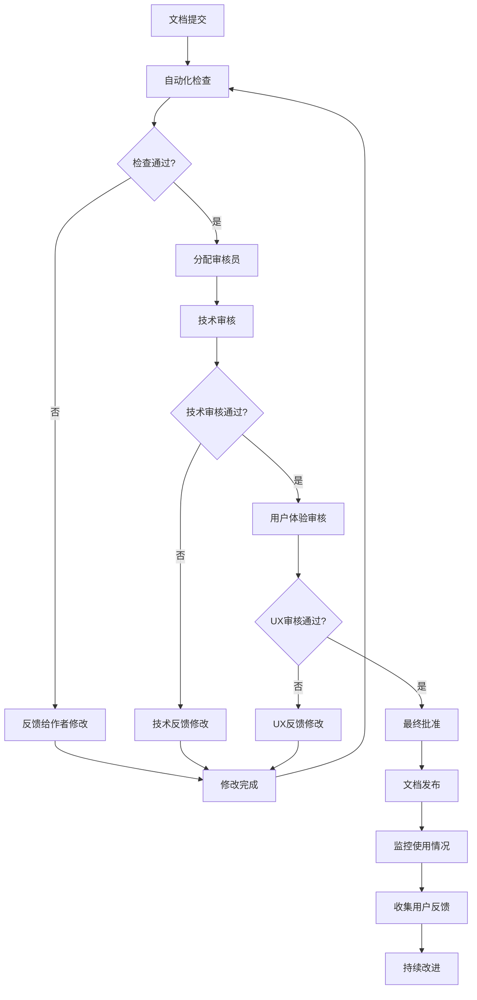

# 文档维护指南

## 概述

凌隐宝堂中医诊所管理系统文档体系采用"代码优先、文档同步"的维护策略，确保文档与实际代码始终保持一致。本指南定义了文档维护的标准流程、责任分工、质量检查机制和持续改进方法。

## 维护责任分工

### 1. 角色与职责

#### 1.1 技术写作负责人
```yaml
# 技术写作负责人职责
tech_writer_responsibilities:
  primary:
    - "文档架构设计和导航结构维护"
    - "写作标准和模板管理"
    - "质量审核和最终批准"
    - "跨模块文档协调"

  secondary:
    - "新人文档培训指导"
    - "文档工具和流程优化"
    - "用户反馈分析和处理"
    - "月度质量报告生成"

  time_allocation:
    daily_maintenance: "1小时"
    weekly_review: "2小时"
    monthly_reporting: "4小时"
    quarterly_planning: "8小时"
```

#### 1.2 模块负责人
```yaml
# 模块负责人职责
module_owner_responsibilities:
  content_ownership:
    - "负责模块内所有文档内容准确性"
    - "代码变更时及时更新文档"
    - "处理模块相关用户反馈"
    - "参与模块文档质量检查"

  coordination:
    - "与其他模块负责人协调交叉引用"
    - "提供模块变更的文档影响评估"
    - "协助技术写作负责人进行文档审查"
    - "参与文档标准制定和改进"

  response_time:
    code_changes: "24小时内更新文档"
    feedback_response: "48小时内回复"
    quality_issues: "72小时内修复"
```

#### 1.3 开发团队
```yaml
# 开发团队职责
developer_responsibilities:
  immediate:
    - "代码变更时同步更新相关文档"
    - "为新功能编写基础文档"
    - "检查文档引用的正确性"
    - "标记需要更新的文档部分"

  collaborative:
    - "参与文档审查和改进"
    - "提供技术细节和实现说明"
    - "协助测试文档示例代码"
    - "反馈文档使用体验"
```

## 文档更新流程

### 1. 代码驱动的文档更新

#### 1.1 变更触发机制
```csharp
// 文档变更检测服务
public class DocumentationChangeDetector
{
    private readonly IGitService _gitService;
    private readonly IDocumentationService _docService;
    private readonly ILogger<DocumentationChangeDetector> _logger;

    public async Task DetectChangesAsync(string branchName)
    {
        // 获取最新的代码变更
        var changes = await _gitService.GetChangesAsync(branchName);

        foreach (var change in changes)
        {
            var documentationTasks = await AnalyzeChangeAsync(change);

            if (documentationTasks.Any())
            {
                await CreateDocumentationTasksAsync(change, documentationTasks);
                await NotifyResponsiblePartiesAsync(change, documentationTasks);
            }
        }
    }

    private async Task<List<DocumentationTask>> AnalyzeChangeAsync(GitChange change)
    {
        var tasks = new List<DocumentationTask>();

        // 分析API变更
        if (IsApiChange(change))
        {
            tasks.AddRange(await AnalyzeApiChangeAsync(change));
        }

        // 分析实体变更
        if (IsEntityChange(change))
        {
            tasks.AddRange(await AnalyzeEntityChangeAsync(change));
        }

        // 分析配置变更
        if (IsConfigurationChange(change))
        {
            tasks.AddRange(await AnalyzeConfigurationChangeAsync(change));
        }

        // 分析架构变更
        if (IsArchitectureChange(change))
        {
            tasks.AddRange(await AnalyzeArchitectureChangeAsync(change));
        }

        return tasks;
    }

    private async Task<List<DocumentationTask>> AnalyzeApiChangeAsync(GitChange change)
    {
        var tasks = new List<DocumentationTask>();

        // 解析C#代码变更
        var codeChanges = await ParseCodeChangesAsync(change);

        foreach (var codeChange in codeChanges)
        {
            // 检查控制器变更
            if (codeChange.Type == "Controller")
            {
                tasks.Add(new DocumentationTask
                {
                    Type = "API Documentation Update",
                    Priority = "High",
                    Description = $"更新API文档: {codeChange.ClassName}",
                    AffectedDocuments = GetAffectedApiDocuments(codeChange.ClassName),
                    EstimatedEffort = "2-4小时",
                    DueDate = DateTime.UtcNow.AddDays(1)
                });
            }

            // 检查DTO变更
            if (codeChange.Type == "DTO")
            {
                tasks.Add(new DocumentationTask
                {
                    Type = "Data Model Update",
                    Priority = "Medium",
                    Description = $"更新数据模型文档: {codeChange.ClassName}",
                    AffectedDocuments = GetAffectedModelDocuments(codeChange.ClassName),
                    EstimatedEffort = "1-2小时",
                    DueDate = DateTime.UtcNow.AddDays(2)
                });
            }
        }

        return tasks;
    }

    private List<string> GetAffectedApiDocuments(string controllerName)
    {
        var affectedDocs = new List<string>();

        // API参考文档
        affectedDocs.Add("docs/quick-reference/api-reference.md");

        // 模块API文档
        var moduleName = ExtractModuleNameFromController(controllerName);
        affectedDocs.Add($"docs/api/modules/{moduleName.ToLower()}.md");

        // 架构文档（如果涉及重要变更）
        affectedDocs.Add($"docs/architecture/server/modules/{moduleName.ToLower()}.md");

        return affectedDocs;
    }
}
```

#### 1.2 自动化文档更新任务
```yaml
# GitHub Actions工作流 - 文档更新触发
name: Documentation Update Trigger

on:
  push:
    branches: [ main, develop ]
    paths:
      - 'src/**/*.cs'
      - 'src/**/*.csproj'
      - 'appsettings*.json'

jobs:
  detect-documentation-changes:
    runs-on: ubuntu-latest
    steps:
    - name: Checkout code
      uses: actions/checkout@v3
      with:
        fetch-depth: 0

    - name: Setup .NET
      uses: actions/setup-dotnet@v3
      with:
        dotnet-version: '8.0.x'

    - name: Analyze changes
      run: |
        dotnet run --project tools/DocumentationAnalyzer \
          --analyze-changes \
          --base-branch ${{ github.event.before }} \
          --head-branch ${{ github.sha }}

    - name: Create documentation issues
      if: steps.analyze-changes.outputs.has-changes == 'true'
      uses: actions/github-script@v6
      with:
        script: |
          const changes = JSON.parse(steps.analyze-changes.outputs.changes);

          for (const change of changes) {
            await github.rest.issues.create({
              owner: context.repo.owner,
              repo: context.repo.repo,
              title: `文档更新: ${change.description}`,
              body: `## 📝 文档更新任务

              **变更类型**: ${change.type}
              **优先级**: ${change.priority}
              **影响模块**: ${change.module}

              ### 🎯 需要更新的文档
              ${change.affected_documents.map(doc => `- [ ] ${doc}`).join('\n')}

              ### 📋 变更详情
              ${change.details}

              ### ⏰ 预计工作量
              ${change.estimated_effort}

              ### 📅 截止日期
              ${change.due_date}

              ---

              🤖 此任务由代码变更自动生成，请及时处理。

              **关联PR**: #${{ github.event.number }}`,
              labels: change.labels,
              assignees: change.assignees
            });
          }

    - name: Notify team
      if: steps.analyze-changes.outputs.has-high-priority-changes == 'true'
      run: |
        echo "🚨 发现高优先级文档变更"
        echo "请立即检查相关文档更新任务"
        # 这里可以集成Slack、Teams或其他通知系统
```

### 2. 定期维护任务

#### 2.1 周维护清单
```markdown
## 📅 周维护检查清单

### 周一：质量检查
- [ ] 检查新增的文档反馈（上周）
- [ ] 审查本周待处理的文档Issues
- [ ] 运行自动化质量检查工具
- [ ] 更新文档质量仪表板

### 周二：内容更新
- [ ] 处理高优先级的文档更新任务
- [ ] 更新API参考文档
- [ ] 检查代码示例的有效性
- [ ] 同步架构变更到文档

### 周三：结构优化
- [ ] 检查文档导航结构
- [ ] 验证内部链接的有效性
- [ ] 优化搜索关键词
- [ ] 更新标签和分类

### 周四：用户体验
- [ ] 分析用户搜索日志
- [ ] 处理用户体验反馈
- [ ] 优化热门文档的排版
- [ ] 添加缺失的快速链接

### 周五：报告和规划
- [ ] 生成周度维护报告
- [ ] 更新文档改进计划
- [ ] 评估维护工作量
- [ ] 安排下周维护任务
```

#### 2.2 月维护任务
```csharp
public class MonthlyDocumentationMaintenance
{
    private readonly ILogger<MonthlyDocumentationMaintenance> _logger;
    private readonly IDocumentationService _docService;
    private readonly IAnalyticsService _analyticsService;

    public async Task ExecuteMonthlyMaintenanceAsync()
    {
        _logger.LogInformation("开始月度文档维护任务");

        var maintenanceTasks = new List<Func<Task>>
        {
            PerformFullQualityAudit,
            UpdateUsageStatistics,
            GenerateMonthlyReport,
            ArchiveOldContent,
            UpdateDocumentationIndex,
            SyncWithLatestCode,
            ReviewAndUpdateTemplates,
            CheckForBrokenLinks,
            UpdateSearchIndex,
            PlanNextMonthImprovements
        };

        foreach (var task in maintenanceTasks)
        {
            try
            {
                await task();
                _logger.LogInformation("月度维护任务完成: {TaskName}", task.Method.Name);
            }
            catch (Exception ex)
            {
                _logger.LogError(ex, "月度维护任务失败: {TaskName}", task.Method.Name);
            }
        }

        _logger.LogInformation("月度文档维护任务完成");
    }

    private async Task PerformFullQualityAudit()
    {
        var allDocuments = await _docService.GetAllDocumentsAsync();
        var qualityChecker = new DocumentQualityChecker();

        foreach (var document in allDocuments)
        {
            var qualityReport = await qualityChecker.CheckDocumentQualityAsync(document.Path);

            if (qualityReport.OverallScore < 80)
            {
                await CreateQualityImprovementTaskAsync(document.Path, qualityReport);
            }

            await _docService.SaveQualityReportAsync(document.Path, qualityReport);
        }
    }

    private async Task UpdateUsageStatistics()
    {
        var startDate = DateTime.UtcNow.AddMonths(-1);
        var endDate = DateTime.UtcNow;

        var usageStats = await _analyticsService.GetUsageStatisticsAsync(startDate, endDate);

        foreach (var stat in usageStats.PageStatistics)
        {
            await _docService.UpdatePageStatisticsAsync(stat.PagePath, stat);
        }
    }

    private async Task GenerateMonthlyReport()
    {
        var reportGenerator = new MonthlyQualityReportGenerator();
        var report = await reportGenerator.GenerateReportAsync(
            DateTime.UtcNow.Year,
            DateTime.UtcNow.Month);

        await _docService.SaveMonthlyReportAsync(report);

        // 发送报告给团队
        await SendMonthlyReportAsync(report);
    }

    private async Task ArchiveOldContent()
    {
        var archiveDate = DateTime.UtcNow.AddMonths(-6);
        var oldDocuments = await _docService.GetDocumentsOlderThanAsync(archiveDate);

        foreach (var document in oldDocuments)
        {
            if (!await IsDocumentStillRelevantAsync(document))
            {
                await _docService.ArchiveDocumentAsync(document);
                _logger.LogInformation("文档已归档: {DocumentPath}", document.Path);
            }
        }
    }

    private async Task CheckForBrokenLinks()
    {
        var allDocuments = await _docService.GetAllDocumentsAsync();
        var linkChecker = new LinkChecker();

        foreach (var document in allDocuments)
        {
            var brokenLinks = await linkChecker.FindBrokenLinksAsync(document.Path);

            if (brokenLinks.Any())
            {
                await CreateLinkFixTaskAsync(document.Path, brokenLinks);
            }
        }
    }

    private async Task CreateQualityImprovementTaskAsync(string documentPath, QualityReport report)
    {
        var issueTitle = $"文档质量改进: {documentPath}";
        var issueBody = $@"
## 📊 质量检查结果

**文档路径**: {documentPath}
**总体评分**: {report.OverallScore:F1}/100
**检查日期**: {report.CheckDate:yyyy-MM-dd}

### 📋 各维度评分
{string.Join("\n", report.DimensionScores.Select(kv => $"- **{kv.Key}**: {kv.Value:F1}/100"))}

### 🔧 改进建议
{string.Join("\n", report.ImprovementSuggestions.Select(s => $"- {s}"))}

### 📈 质量趋势
[查看历史质量数据](link-to-quality-history)

---

🤖 此任务由自动质量检查生成，请及时改进文档质量。
";

        // 创建GitHub Issue
        await CreateGitHubIssueAsync(issueTitle, issueBody, new[] { "documentation", "quality-improvement" });
    }

    private async Task SendMonthlyReportAsync(MonthlyQualityReport report)
    {
        var emailService = new EmailService();
        var reportContent = GenerateReportEmailContent(report);

        await emailService.SendAsync(new EmailMessage
        {
            To = "team@lybt.com",
            Subject = $"📊 文档质量月报 - {report.Period.Start:yyyy年MM月}",
            Body = reportContent
        });
    }

    private string GenerateReportEmailContent(MonthlyQualityReport report)
    {
        return $@"
## 📊 {report.Period.Start:yyyy年MM月} 文档质量月报

### 📈 核心指标
- **总访问量**: {report.UsageMetrics.TotalVisits:N0}
- **独立用户数**: {report.UsageMetrics.UniqueUsers:N0}
- **平均评分**: {report.FeedbackMetrics.AverageRating:F1}/5 ⭐
- **高优先级问题**: {report.FeedbackMetrics.HighPriorityIssues:N0}

### 🎯 热门文档
{string.Join("\n", report.UsageMetrics.PopularPages.Take(5).Select(p => $"1. **{p.PagePath}** - {p.Views:N0} 次浏览"))}

### 🔧 改进重点
{string.Join("\n", report.Recommendations.Take(3).Select(r => $"- {r}"))}

### 📊 详细报告
[查看完整月报](link-to-full-report)

---

如有任何问题，请联系文档团队。
";
    }
}
```

## 质量保证机制

### 1. 自动化检查

#### 1.1 预提交钩子
```bash
#!/bin/bash
# pre-commit hook for documentation quality

echo "🔍 运行文档质量检查..."

# 检查文档格式
echo "检查文档格式..."
npm run lint:docs

# 检查拼写错误
echo "检查拼写错误..."
cspell "docs/**/*.md" --config .cspell.json

# 检查链接有效性
echo "检查链接有效性..."
markdown-link-check "docs/**/*.md" --config .mlc_config.json

# 检查图片引用
echo "检查图片引用..."
node scripts/check-image-references.js

# 检查代码示例
echo "检查代码示例..."
node scripts/validate-code-examples.js

# 生成变更摘要
echo "生成变更摘要..."
node scripts/generate-change-summary.js

echo "✅ 文档质量检查完成"
```

#### 1.2 CI/CD集成
```yaml
# .github/workflows/documentation-quality.yml
name: Documentation Quality Check

on:
  pull_request:
    paths:
      - 'docs/**'
  push:
    branches: [ main ]
    paths:
      - 'docs/**'

jobs:
  quality-check:
    runs-on: ubuntu-latest

    steps:
    - name: Checkout code
      uses: actions/checkout@v3

    - name: Setup Node.js
      uses: actions/setup-node@v3
      with:
        node-version: '18'

    - name: Install dependencies
      run: |
        npm install -g cspell markdown-link-cli markdownlint-cli
        npm install

    - name: Check markdown formatting
      run: |
        markdownlint "docs/**/*.md" --config .markdownlint.json

    - name: Check spelling
      run: |
        cspell "docs/**/*.md" --config .cspell.json

    - name: Check links
      run: |
        find docs -name "*.md" -exec markdown-link-check {} \; --config .mlc_config.json

    - name: Validate code examples
      run: |
        node scripts/validate-all-code-examples.js

    - name: Check for broken internal links
      run: |
        node scripts/check-internal-links.js

    - name: Generate quality report
      run: |
        node scripts/generate-quality-report.js > quality-report.json

    - name: Upload quality report
      uses: actions/upload-artifact@v3
      with:
        name: quality-report
        path: quality-report.json

    - name: Comment PR with results
      if: github.event_name == 'pull_request'
      uses: actions/github-script@v6
      with:
        script: |
          const fs = require('fs');
          const report = JSON.parse(fs.readFileSync('quality-report.json', 'utf8'));

          const comment = `## 📊 文档质量检查结果

          ### ✅ 通过的检查
          ${report.passed_checks.map(check => `- ${check}`).join('\n')}

          ### ❌ 失败的检查
          ${report.failed_checks.map(check => `- ${check}`).join('\n')}

          ### 📈 质量评分
          - **总体评分**: ${report.overall_score}/100
          - **可读性**: ${report.readability_score}/100
          - **准确性**: ${report.accuracy_score}/100
          - **完整性**: ${report.completeness_score}/100

          ${report.overall_score >= 90 ? '🎉 优秀！可以直接合并。' : report.overall_score >= 80 ? '✅ 良好，建议改进后合并。' : '⚠️ 需要改进质量后再合并。'}`;

          github.rest.issues.createComment({
            issue_number: context.issue.number,
            owner: context.repo.owner,
            repo: context.repo.repo,
            body: comment
          });
```

### 2. 人工审核流程

#### 2.1 文档审核检查清单
```markdown
## 📋 文档审核检查清单

### 内容质量 ✍️
- [ ] **准确性**: 所有技术信息与代码一致
- [ ] **完整性**: 包含所有必要的使用信息
- [ ] **清晰性**: 语言简洁明了，结构清晰
- [ ] **实用性**: 提供实际可用的示例和指导

### 格式规范 📐
- [ ] **标题层级**: 使用正确的Markdown标题层级
- [ ] **代码块**: 所有代码示例都有语法高亮
- [ ] **链接**: 所有内部和外部链接都有效
- [ ] **图片**: 图片大小合适，alt文本完整

### 用户体验 👥
- [ ] **导航**: 文档在导航结构中位置合理
- [ ] **搜索**: 包含适当的关键词和标签
- [ ] **可读性**: 字体大小、行距、段落长度适中
- [ ] **跨平台**: 在不同设备和浏览器上显示正常

### 技术要求 🔧
- [ ] **代码示例**: 所有代码示例都可以编译运行
- [ ] **API文档**: API参数、返回值、错误处理完整
- [ ] **配置说明**: 配置项说明详细，示例完整
- [ ] **依赖信息**: 明确列出所有依赖项和版本

### 维护性 🔄
- [ ] **版本信息**: 包含适用的版本信息
- [ ] **更新日期**: 最后更新日期准确
- [ ] **责任归属**: 明确的维护责任人
- [ ] **变更记录**: 重要的变更历史记录
```

#### 2.2 审核流程


## 工具和自动化

### 1. 文档生成工具

#### 1.1 API文档自动生成
```csharp
// API文档生成器
public class ApiDocumentationGenerator
{
    private readonly IAssemblyProvider _assemblyProvider;
    private readonly ITemplateEngine _templateEngine;

    public async Task GenerateApiDocumentationAsync()
    {
        var assembly = _assemblyProvider.GetMainAssembly();
        var controllers = GetApiControllers(assembly);

        foreach (var controller in controllers)
        {
            var documentation = await GenerateControllerDocumentationAsync(controller);
            await SaveDocumentationAsync(documentation);
        }

        await GenerateIndexAsync(controllers);
        await UpdateNavigationAsync(controllers);
    }

    private async Task<ControllerDocumentation> GenerateControllerDocumentationAsync(Type controller)
    {
        var documentation = new ControllerDocumentation
        {
            Name = controller.Name.Replace("Controller", ""),
            Description = GetControllerDescription(controller),
            Routes = GetControllerRoutes(controller),
            Endpoints = new List<EndpointDocumentation>()
        };

        var methods = controller.GetMethods()
            .Where(m => m.IsPublic && m.GetCustomAttributes<HttpMethodAttribute>().Any())
            .ToList();

        foreach (var method in methods)
        {
            var endpoint = await GenerateEndpointDocumentationAsync(method);
            documentation.Endpoints.Add(endpoint);
        }

        return documentation;
    }

    private async Task<EndpointDocumentation> GenerateEndpointDocumentationAsync(MethodInfo method)
    {
        var httpMethod = GetHttpMethod(method);
        var route = GetRoute(method);
        var parameters = GetParameters(method);
        var response = GetResponseType(method);
        var examples = await GenerateExamplesAsync(method);

        return new EndpointDocumentation
        {
            HttpMethod = httpMethod,
            Route = route,
            Description = GetMethodDescription(method),
            Parameters = parameters,
            Response = response,
            Examples = examples,
            StatusCode = GetExpectedStatusCode(method)
        };
    }

    private async Task<List<CodeExample>> GenerateExamplesAsync(MethodInfo method)
    {
        var examples = new List<CodeExample>();

        // 生成C#示例
        var csharpExample = await GenerateCSharpExampleAsync(method);
        examples.Add(csharpExample);

        // 生成JavaScript示例
        var jsExample = await GenerateJavaScriptExampleAsync(method);
        examples.Add(jsExample);

        // 生成curl示例
        var curlExample = await GenerateCurlExampleAsync(method);
        examples.Add(curlExample);

        return examples;
    }

    private async Task SaveDocumentationAsync(ControllerDocumentation documentation)
    {
        var markdown = await _templateEngine.RenderAsync("api-controller", documentation);
        var filePath = $"docs/api/modules/{documentation.Name.ToLower()}.md";

        await File.WriteAllTextAsync(filePath, markdown);

        _logger.LogInformation("API文档已生成: {FilePath}", filePath);
    }
}
```

#### 1.2 架构图自动生成
```csharp
public class ArchitectureDiagramGenerator
{
    public async Task GenerateArchitectureDiagramsAsync()
    {
        // 生成系统架构图
        await GenerateSystemArchitectureDiagramAsync();

        // 生成模块关系图
        await GenerateModuleRelationshipDiagramAsync();

        // 生成数据流图
        await GenerateDataFlowDiagramAsync();

        // 生成部署架构图
        await GenerateDeploymentDiagramAsync();
    }

    private async Task GenerateSystemArchitectureDiagramAsync()
    {
        var diagram = new MermaidDiagram
        {
            Type = "graph TD",
            Nodes = new List<Node>
            {
                new Node("Client", "WPF客户端"),
                new Node("API", "Web API"),
                new Node("Database", "SQL Server"),
                new Node("Cache", "内存缓存")
            },
            Edges = new List<Edge>
            {
                new Edge("Client", "API", "HTTPS"),
                new Edge("API", "Database", "ADO.NET"),
                new Edge("API", "Cache", "IMemoryCache")
            }
        };

        var mermaidCode = diagram.ToMermaidCode();
        var markdown = $"""
        ## 系统架构图

        ```mermaid
        {mermaidCode}
        ```

        ### 架构说明
        - **WPF客户端**: 基于MVVM模式的桌面应用程序
        - **Web API**: 基于ASP.NET Core的RESTful API
        - **SQL Server**: 关系型数据库，存储业务数据
        - **内存缓存**: 使用IMemoryCache实现缓存机制
        """;

        await File.WriteAllTextAsync("docs/architecture/system-architecture.md", markdown);
    }
}
```

### 2. 监控和告警

#### 2.1 文档健康监控
```csharp
public class DocumentationHealthMonitor
{
    private readonly ILogger<DocumentationHealthMonitor> _logger;
    private readonly IDocumentationService _docService;
    private readonly IAlertService _alertService;

    public async Task MonitorHealthAsync()
    {
        var healthReport = new DocumentationHealthReport
        {
            Timestamp = DateTime.UtcNow,
            Checks = new List<HealthCheck>()
        };

        // 检查文档完整性
        healthReport.Checks.Add(await CheckCompletenessAsync());

        // 检查链接有效性
        healthReport.Checks.Add(await CheckLinksAsync());

        // 检查代码示例
        healthReport.Checks.Add(await CheckCodeExamplesAsync());

        // 检查用户反馈
        healthReport.Checks.Add(await CheckUserFeedbackAsync());

        // 评估整体健康状态
        healthReport.OverallHealth = EvaluateOverallHealth(healthReport.Checks);

        // 发送告警
        if (healthReport.OverallHealth != HealthStatus.Healthy)
        {
            await SendHealthAlertAsync(healthReport);
        }

        // 记录监控结果
        await LogHealthReportAsync(healthReport);
    }

    private async Task<HealthCheck> CheckCompletenessAsync()
    {
        var allDocuments = await _docService.GetAllDocumentsAsync();
        var incompleteDocs = new List<string>();

        foreach (var doc in allDocuments)
        {
            var content = await File.ReadAllTextAsync(doc.Path);

            if (!HasRequiredSections(content))
            {
                incompleteDocs.Add(doc.Path);
            }
        }

        return new HealthCheck
        {
            Name = "文档完整性",
            Status = incompleteDocs.Any() ? HealthStatus.Warning : HealthStatus.Healthy,
            Message = incompleteDocs.Any()
                ? $"发现 {incompleteDocs.Count} 个不完整的文档"
                : "所有文档都包含必需的章节",
            Details = incompleteDocs
        };
    }

    private async Task<HealthCheck> CheckLinksAsync()
    {
        var allDocuments = await _docService.GetAllDocumentsAsync();
        var linkChecker = new LinkChecker();
        var brokenLinks = new List<string>();

        foreach (var doc in allDocuments)
        {
            var broken = await linkChecker.FindBrokenLinksAsync(doc.Path);
            brokenLinks.AddRange(broken);
        }

        return new HealthCheck
        {
            Name = "链接有效性",
            Status = brokenLinks.Any() ? HealthStatus.Warning : HealthStatus.Healthy,
            Message = brokenLinks.Any()
                ? $"发现 {brokenLinks.Count} 个失效链接"
                : "所有链接都有效",
            Details = brokenLinks
        };
    }

    private HealthStatus EvaluateOverallHealth(List<HealthCheck> checks)
    {
        if (checks.Any(c => c.Status == HealthStatus.Critical))
            return HealthStatus.Critical;

        if (checks.Any(c => c.Status == HealthStatus.Warning))
            return HealthStatus.Warning;

        return HealthStatus.Healthy;
    }

    private async Task SendHealthAlertAsync(DocumentationHealthReport report)
    {
        var alertMessage = $@"
        ## 🚨 文档健康告警

        **监控时间**: {report.Timestamp:yyyy-MM-dd HH:mm:ss}
        **整体状态**: {report.OverallHealth}

        ### 发现的问题
        {string.Join("\n", report.Checks.Where(c => c.Status != HealthStatus.Healthy)
            .Select(c => $"- **{c.Name}**: {c.Message}"))}

        ### 需要立即处理
        {string.Join("\n", report.Checks.Where(c => c.Status == HealthStatus.Critical)
            .Select(c => $"- {c.Name}"))}

        请及时处理这些问题以保持文档质量。
        ";

        await _alertService.SendAlertAsync(alertMessage);
    }
}
```

## 应急响应

### 1. 文档问题应急处理

#### 1.1 应急响应流程
```markdown
## 🚨 文档应急响应流程

### 优先级定义
- **P0 - 严重**: 完全误导性信息，可能导致系统故障
- **P1 - 高**: 重要信息错误，影响用户使用
- **P2 - 中**: 一般性问题，影响用户体验
- **P3 - 低**: 轻微问题，不影响主要功能

### 响应时间要求
- **P0**: 30分钟内响应，2小时内修复
- **P1**: 2小时内响应，24小时内修复
- **P2**: 1个工作日内响应，1周内修复
- **P3**: 1周内响应，按计划修复

### 应急处理步骤
1. **问题确认** (5分钟)
   - 确认问题严重程度
   - 评估影响范围
   - 通知相关人员

2. **临时处理** (30分钟)
   - 如有可能，添加警告标识
   - 提供临时解决方案
   - 设置重定向

3. **根本修复** (根据优先级)
   - 分析根本原因
   - 实施永久修复
   - 验证修复效果

4. **事后处理** (修复后)
   - 更新相关文档
   - 通知用户问题已解决
   - 总结经验教训
```

#### 1.2 应急联系机制
```yaml
# 应急联系方式
emergency_contacts:
  tech_writer:
    name: "技术写作负责人"
    role: "文档质量最终负责人"
    contact:
      email: "techwriter@lybt.com"
      phone: "+86-xxx-xxxx-xxxx"
    availability: "工作日 9:00-18:00"

  module_owners:
    auth:
      name: "认证模块负责人"
      contact:
        email: "auth-owner@lybt.com"
    patients:
      name: "患者模块负责人"
      contact:
        email: "patients-owner@lybt.com"
    # ... 其他模块负责人

  escalation:
    level_1:
      role: "技术主管"
      contact:
        email: "tech-lead@lybt.com"
        phone: "+86-xxx-xxxx-xxxx"
    level_2:
      role: "项目经理"
      contact:
        email: "pm@lybt.com"
        phone: "+86-xxx-xxxx-xxxx"
    level_3:
      role: "技术总监"
      contact:
        email: "cto@lybt.com"
        phone: "+86-xxx-xxxx-xxxx"

# 应急通知模板
emergency_notification_templates:
  p0_issue:
    subject: "🚨 P0级文档问题 - 需要立即处理"
    body: |
      发现P0级文档问题，需要立即处理：

      问题描述：{description}
      发现时间：{discovery_time}
      影响范围：{impact_scope}

      请立即采取以下措施：
      1. 确认问题严重程度
      2. 实施临时处理措施
      3. 开始根本修复

      预计修复时间：{estimated_fix_time}
```

## 持续改进

### 1. 改进计划制定

#### 1.1 季度改进规划
```markdown
## 📅 季度文档改进计划

### Q1 2024 改进重点
1. **质量提升**
   - 目标：平均文档质量评分提升至85+
   - 措施：实施自动化质量检查，加强人工审核
   - 负责人：技术写作负责人

2. **用户体验优化**
   - 目标：用户满意度提升至4.2+
   - 措施：优化导航结构，改进搜索功能
   - 负责人：UX设计师 + 技术写作

3. **维护效率提升**
   - 目标：文档更新平均时间缩短50%
   - 措施：自动化更新流程，优化工具链
   - 负责人：DevOps工程师

### 评估指标
- 文档质量评分
- 用户满意度调查
- 维护工作量统计
- 反馈响应时间

### 资源需求
- 人力资源：X人天/季度
- 工具投入：XXX元
- 培训需求：XXX元
```

通过这套完整的文档维护指南，凌隐宝堂中医诊所管理系统的文档体系能够保持高质量、高可用性和持续的改进，确保为用户提供准确、及时、易用的技术文档。