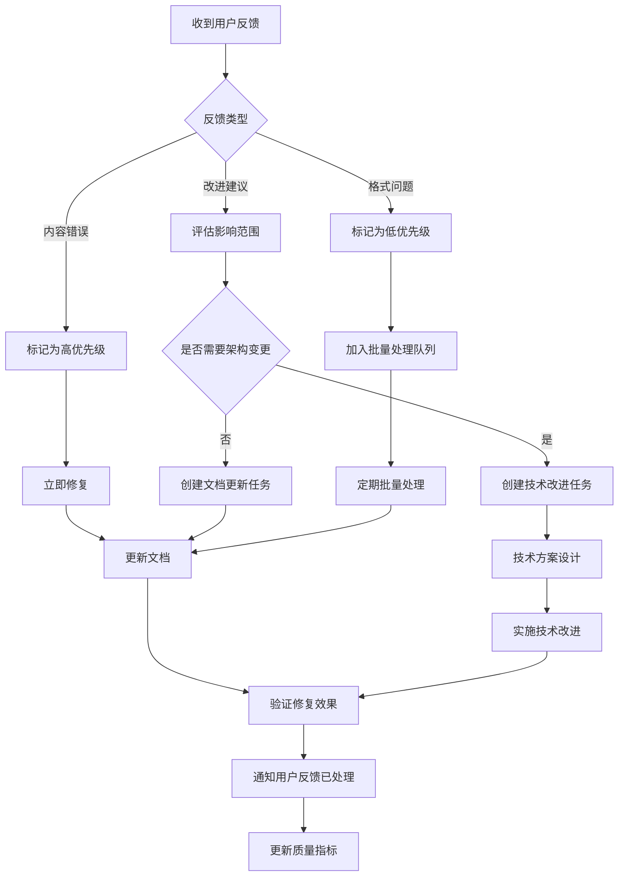

# 文档使用指标和反馈机制

## 概述

凌隐宝堂中医诊所管理系统文档体系建立了完善的使用指标收集和反馈机制，确保文档质量持续改进和用户体验优化。本文档定义了文档使用的核心指标、反馈收集渠道、质量评估标准和改进流程。

## 文档使用指标体系

### 1. 核心使用指标

#### 1.1 访问量指标
```yaml
# 指标定义
access_metrics:
  total_visits:
    name: "总访问量"
    description: "文档中心总访问次数"
    target: "月度增长 > 20%"
    measurement: "页面浏览计数"

  unique_visitors:
    name: "独立访客数"
    description: "访问文档的不同用户数量"
    target: "月度活跃用户 > 10人"
    measurement: "基于用户身份或IP去重"

  page_views:
    name: "页面浏览量"
    description: "各个文档页面的浏览次数"
    target: "核心文档页面浏览 > 5次/天"
    measurement: "每个页面独立计数"

  session_duration:
    name: "会话持续时间"
    description: "用户在文档中心的平均停留时间"
    target: "平均时长 > 5分钟"
    measurement: "从进入到离开的时间间隔"
```

#### 1.2 使用效果指标
```yaml
# 效果指标定义
effectiveness_metrics:
  search_success_rate:
    name: "搜索成功率"
    description: "用户通过搜索找到所需信息的成功率"
    target: "> 90%"
    measurement: "搜索后的页面停留时间 > 30秒"

  document_findability:
    name: "文档可发现性"
    description: "用户在3次点击内找到目标文档的比例"
    target: "> 95%"
    measurement: "基于点击路径分析"

  task_completion_time:
    name: "任务完成时间"
    description: "用户完成特定开发任务所需时间"
    target: "新手 < 30分钟，老手 < 5分钟"
    measurement: "从进入文档到完成任务的时间"
```

#### 1.3 质量反馈指标
```yaml
# 质量指标定义
quality_metrics:
  accuracy_score:
    name: "准确性评分"
    description: "文档内容与实际代码的一致性"
    target: "100%准确"
    measurement: "用户反馈和代码同步检查"

  completeness_score:
    name: "完整性评分"
    description: "文档覆盖所有必要信息的程度"
    target: "> 95%"
    measurement: "用户反馈和专家评审"

  clarity_score:
    name: "清晰度评分"
    description: "文档表达的清晰程度和易理解性"
    target: "> 4.0/5.0"
    measurement: "用户评分和可读性分析"
```

### 2. 指标收集机制

#### 2.1 自动化数据收集
```javascript
// 前端埋点脚本示例
class DocumentationAnalytics {
  constructor() {
    this.sessionStart = Date.now();
    this.userId = this.getUserId();
    this.pageViews = [];
    this.events = [];
  }

  // 页面访问跟踪
  trackPageView(pageTitle, pagePath) {
    const pageView = {
      timestamp: Date.now(),
      userId: this.userId,
      sessionId: this.getSessionId(),
      pageTitle,
      pagePath,
      referrer: document.referrer,
      userAgent: navigator.userAgent
    };

    this.pageViews.push(pageView);
    this.sendData('page_view', pageView);
  }

  // 搜索行为跟踪
  trackSearch(query, resultsCount, clickedResult = null) {
    const searchEvent = {
      timestamp: Date.now(),
      userId: this.userId,
      query,
      resultsCount,
      clickedResult,
      sessionDuration: Date.now() - this.sessionStart
    };

    this.events.push(searchEvent);
    this.sendData('search', searchEvent);
  }

  // 文档评分跟踪
  trackRating(documentPath, rating, feedback = '') {
    const ratingEvent = {
      timestamp: Date.now(),
      userId: this.userId,
      documentPath,
      rating,
      feedback,
      sessionDuration: Date.now() - this.sessionStart
    };

    this.events.push(ratingEvent);
    this.sendData('rating', ratingEvent);
  }

  // 发送数据到后端
  async sendData(eventType, data) {
    try {
      await fetch('/api/analytics/events', {
        method: 'POST',
        headers: {
          'Content-Type': 'application/json',
        },
        body: JSON.stringify({
          eventType,
          data,
          timestamp: Date.now()
        })
      });
    } catch (error) {
      console.warn('Failed to send analytics data:', error);
    }
  }

  getUserId() {
    // 从JWT token中提取用户ID，或生成匿名ID
    return localStorage.getItem('doc_user_id') || this.generateAnonymousId();
  }

  getSessionId() {
    return sessionStorage.getItem('doc_session_id') || this.generateSessionId();
  }

  generateAnonymousId() {
    const id = 'anon_' + Math.random().toString(36).substr(2, 9);
    localStorage.setItem('doc_user_id', id);
    return id;
  }

  generateSessionId() {
    const id = 'session_' + Date.now() + '_' + Math.random().toString(36).substr(2, 9);
    sessionStorage.setItem('doc_session_id', id);
    return id;
  }
}

// 初始化分析器
const docAnalytics = new DocumentationAnalytics();

// 跟踪页面访问
document.addEventListener('DOMContentLoaded', () => {
  const title = document.title;
  const path = window.location.pathname;
  docAnalytics.trackPageView(title, path);
});
```

#### 2.2 后端数据存储
```csharp
// 分析数据模型
public class AnalyticsEvent
{
    public int Id { get; set; }
    public string EventType { get; set; }
    public string UserId { get; set; }
    public string SessionId { get; set; }
    public string Data { get; set; } // JSON格式
    public DateTime Timestamp { get; set; }
    public string UserAgent { get; set; }
    public string IpAddress { get; set; }
}

// 分析服务
public class DocumentationAnalyticsService
{
    private readonly LYBTClinicDbContext _context;
    private readonly ILogger<DocumentationAnalyticsService> _logger;

    public async Task RecordEventAsync(string eventType, object data)
    {
        try
        {
            var analyticsEvent = new AnalyticsEvent
            {
                EventType = eventType,
                UserId = GetCurrentUserId(),
                SessionId = GetCurrentSessionId(),
                Data = JsonSerializer.Serialize(data),
                Timestamp = DateTime.UtcNow,
                UserAgent = GetUserAgent(),
                IpAddress = GetIpAddress()
            };

            _context.AnalyticsEvents.Add(analyticsEvent);
            await _context.SaveChangesAsync();

            _logger.LogDebug("记录分析事件: {EventType} for User: {UserId}", eventType, analyticsEvent.UserId);
        }
        catch (Exception ex)
        {
            _logger.LogError(ex, "记录分析事件失败: {EventType}", eventType);
        }
    }

    public async Task<AnalyticsReport> GenerateReportAsync(DateTime startDate, DateTime endDate)
    {
        var events = await _context.AnalyticsEvents
            .Where(e => e.Timestamp >= startDate && e.Timestamp <= endDate)
            .ToListAsync();

        return new AnalyticsReport
        {
            Period = new DateRange { Start = startDate, End = endDate },
            TotalEvents = events.Count,
            UniqueUsers = events.Select(e => e.UserId).Distinct().Count(),
            PageViews = events.Count(e => e.EventType == "page_view"),
            Searches = events.Count(e => e.EventType == "search"),
            Ratings = events.Count(e => e.EventType == "rating"),
            AverageRating = CalculateAverageRating(events),
            PopularPages = GetPopularPages(events),
            SearchTerms = GetPopularSearchTerms(events)
        };
    }

    private double CalculateAverageRating(List<AnalyticsEvent> events)
    {
        var ratingEvents = events.Where(e => e.EventType == "rating").ToList();
        if (!ratingEvents.Any()) return 0;

        var ratings = ratingEvents.Select(e =>
        {
            var data = JsonSerializer.Deserialize<Dictionary<string, object>>(e.Data);
            return Convert.ToDouble(data["rating"]);
        });

        return ratings.Average();
    }

    private List<PopularPage> GetPopularPages(List<AnalyticsEvent> events)
    {
        return events
            .Where(e => e.EventType == "page_view")
            .GroupBy(e => GetPagePath(e.Data))
            .Select(g => new PopularPage
            {
                PagePath = g.Key,
                Views = g.Count(),
                UniqueUsers = g.Select(e => e.UserId).Distinct().Count()
            })
            .OrderByDescending(p => p.Views)
            .Take(10)
            .ToList();
    }

    private string GetPagePath(string jsonData)
    {
        try
        {
            var data = JsonSerializer.Deserialize<Dictionary<string, object>>(jsonData);
            return data["pagePath"].ToString();
        }
        catch
        {
            return "unknown";
        }
    }
}
```

## 用户反馈收集机制

### 1. 反馈渠道设计

#### 1.1 页面内反馈组件
```html
<!-- 文档页面反馈组件 -->
<div class="doc-feedback" id="docFeedback">
  <div class="feedback-header">
    <span>这篇文档对您有帮助吗？</span>
    <button class="feedback-close" onclick="closeFeedback()">×</button>
  </div>

  <div class="feedback-actions">
    <button class="feedback-btn positive" onclick="submitFeedback(5)">
      👍 很有帮助
    </button>
    <button class="feedback-btn neutral" onclick="submitFeedback(3)">
      👌 一般般
    </button>
    <button class="feedback-btn negative" onclick="submitFeedback(1)">
      👎 没帮助
    </button>
  </div>

  <div class="feedback-details" id="feedbackDetails" style="display: none;">
    <textarea
      id="feedbackComment"
      placeholder="请告诉我们您的具体建议或遇到的问题..."
      rows="4">
    </textarea>
    <div class="feedback-submit">
      <button class="submit-btn" onclick="submitDetailedFeedback()">提交反馈</button>
      <button class="cancel-btn" onclick="closeFeedback()">取消</button>
    </div>
  </div>
</div>

<style>
.doc-feedback {
  position: fixed;
  bottom: 20px;
  right: 20px;
  background: white;
  border: 1px solid #ddd;
  border-radius: 8px;
  padding: 15px;
  box-shadow: 0 4px 12px rgba(0,0,0,0.1);
  z-index: 1000;
  max-width: 300px;
}

.feedback-header {
  display: flex;
  justify-content: space-between;
  align-items: center;
  margin-bottom: 10px;
  font-weight: bold;
}

.feedback-actions {
  display: flex;
  gap: 8px;
  margin-bottom: 10px;
}

.feedback-btn {
  flex: 1;
  padding: 8px 12px;
  border: 1px solid #ddd;
  border-radius: 4px;
  background: white;
  cursor: pointer;
  transition: all 0.2s;
}

.feedback-btn:hover {
  background: #f5f5f5;
}

.feedback-btn.positive:hover {
  background: #d4edda;
  border-color: #c3e6cb;
}

.feedback-btn.negative:hover {
  background: #f8d7da;
  border-color: #f5c6cb;
}

.feedback-details {
  margin-top: 10px;
}

.feedback-details textarea {
  width: 100%;
  padding: 8px;
  border: 1px solid #ddd;
  border-radius: 4px;
  resize: vertical;
}

.feedback-submit {
  display: flex;
  gap: 8px;
  margin-top: 10px;
}

.submit-btn, .cancel-btn {
  padding: 6px 12px;
  border: none;
  border-radius: 4px;
  cursor: pointer;
}

.submit-btn {
  background: #007bff;
  color: white;
}

.cancel-btn {
  background: #6c757d;
  color: white;
}
</style>

<script>
let currentRating = 0;

function submitFeedback(rating) {
  currentRating = rating;
  document.getElementById('feedbackDetails').style.display = 'block';
}

function submitDetailedFeedback() {
  const comment = document.getElementById('feedbackComment').value;
  const documentPath = window.location.pathname;

  // 发送反馈到后端
  fetch('/api/feedback', {
    method: 'POST',
    headers: {
      'Content-Type': 'application/json',
    },
    body: JSON.stringify({
      documentPath,
      rating: currentRating,
      comment,
      timestamp: new Date().toISOString()
    })
  })
  .then(response => response.json())
  .then(data => {
    if (data.success) {
      showThankYouMessage();
      closeFeedback();
    }
  })
  .catch(error => {
    console.error('提交反馈失败:', error);
  });
}

function closeFeedback() {
  document.getElementById('docFeedback').style.display = 'none';
  document.getElementById('feedbackDetails').style.display = 'none';
  document.getElementById('feedbackComment').value = '';
}

function showThankYouMessage() {
  const message = document.createElement('div');
  message.className = 'thank-you-message';
  message.textContent = '感谢您的反馈！';
  message.style.cssText = `
    position: fixed;
    bottom: 20px;
    right: 20px;
    background: #28a745;
    color: white;
    padding: 10px 15px;
    border-radius: 4px;
    z-index: 1001;
  `;

  document.body.appendChild(message);

  setTimeout(() => {
    document.body.removeChild(message);
  }, 3000);
}
</script>
```

#### 1.2 GitHub Issues集成
```markdown
## 文档反馈模板

在GitHub Issues中使用以下模板提交文档反馈：

### 📝 文档反馈

**文档路径：** <!-- 文档的相对路径 -->
**反馈类型：** <!-- 选择：问题报告/改进建议/内容错误/格式问题 -->
**优先级：** <!-- 高/中/低 -->

### 问题描述

<!-- 详细描述遇到的问题或建议 -->

### 期望效果

<!-- 描述您期望的效果或改进 -->

### 环境信息

- **浏览器版本：** <!-- Chrome/Firefox/Safari/Edge 版本 -->
- **设备类型：** <!-- 桌面/移动设备 -->
- **用户角色：** <!-- 开发者/架构师/项目经理/测试工程师 -->

### 补充信息

<!-- 任何其他相关信息，截图、错误信息等 -->
```

### 2. 反馈数据处理

#### 2.1 反馈数据模型
```csharp
public class DocumentationFeedback
{
    public int Id { get; set; }
    public string DocumentPath { get; set; }
    public string UserId { get; set; }
    public int Rating { get; set; } // 1-5星评分
    public string Comment { get; set; }
    public string FeedbackType { get; set; } // issue_report, improvement, content_error, format_issue
    public string Priority { get; set; } // high, medium, low
    public DateTime CreatedDate { get; set; }
    public bool IsResolved { get; set; }
    public DateTime? ResolvedDate { get; set; }
    public string ResolvedBy { get; set; }
    public string ResolutionNotes { get; set; }
}

public class FeedbackService
{
    private readonly LYBTClinicDbContext _context;
    private readonly ILogger<FeedbackService> _logger;

    public async Task<FeedbackResult> SubmitFeedbackAsync(FeedbackRequest request)
    {
        try
        {
            var feedback = new DocumentationFeedback
            {
                DocumentPath = request.DocumentPath,
                UserId = GetCurrentUserId(),
                Rating = request.Rating,
                Comment = request.Comment,
                FeedbackType = request.FeedbackType,
                Priority = request.Priority,
                CreatedDate = DateTime.UtcNow
            };

            _context.DocumentationFeedback.Add(feedback);
            await _context.SaveChangesAsync();

            _logger.LogInformation("收到文档反馈 - Document: {Document}, Rating: {Rating}, User: {UserId}",
                request.DocumentPath, request.Rating, feedback.UserId);

            // 如果是高优先级反馈，发送通知
            if (request.Priority == "high")
            {
                await NotifyHighPriorityFeedbackAsync(feedback);
            }

            return new FeedbackResult { Success = true, FeedbackId = feedback.Id };
        }
        catch (Exception ex)
        {
            _logger.LogError(ex, "提交文档反馈失败");
            return new FeedbackResult { Success = false, ErrorMessage = "提交失败，请稍后重试" };
        }
    }

    public async Task<List<FeedbackSummary>> GetFeedbackSummaryAsync(DateTime startDate, DateTime endDate)
    {
        var feedbacks = await _context.DocumentationFeedback
            .Where(f => f.CreatedDate >= startDate && f.CreatedDate <= endDate)
            .ToListAsync();

        return feedbacks
            .GroupBy(f => f.DocumentPath)
            .Select(g => new FeedbackSummary
            {
                DocumentPath = g.Key,
                TotalFeedbacks = g.Count(),
                AverageRating = g.Average(f => f.Rating),
                HighPriorityIssues = g.Count(f => f.Priority == "high"),
                UnresolvedIssues = g.Count(f => !f.IsResolved),
                LastFeedbackDate = g.Max(f => f.CreatedDate)
            })
            .OrderByDescending(s => s.TotalFeedbacks)
            .ToList();
    }

    private async Task NotifyHighPriorityFeedbackAsync(DocumentationFeedback feedback)
    {
        // 发送邮件通知给文档维护团队
        var emailService = new EmailService();
        await emailService.SendAsync(new EmailMessage
        {
            To = "doc-team@lybt.com",
            Subject = $"高优先级文档反馈 - {feedback.DocumentPath}",
            Body = $@"
收到高优先级文档反馈：

文档路径: {feedback.DocumentPath}
用户评分: {feedback.Rating}/5
反馈内容: {feedback.Comment}
创建时间: {feedback.CreatedDate:yyyy-MM-dd HH:mm:ss}

请及时处理此反馈。
"
        });
    }
}
```

## 质量评估标准

### 1. 文档质量评分模型

#### 1.1 评分维度定义
```yaml
# 质量评分维度
quality_dimensions:
  accuracy:
    weight: 0.35  # 准确性权重35%
    description: "文档内容与实际代码的一致性"
    criteria:
      - "API接口描述与实际代码一致"
      - "代码示例可以正常运行"
      - "配置参数描述准确无误"
      - "架构图反映真实结构"

  completeness:
    weight: 0.25  # 完整性权重25%
    description: "文档覆盖必要信息的程度"
    criteria:
      - "包含所有必要的参数说明"
      - "提供完整的示例代码"
      - "涵盖异常处理场景"
      - "包含相关依赖信息"

  clarity:
    weight: 0.20  # 清晰度权重20%
    description: "文档表达的清晰程度"
    criteria:
      - "语言简洁明了"
      - "结构层次清晰"
      - "术语使用准确"
      - "示例易于理解"

  usability:
    weight: 0.12  # 可用性权重12%
    description: "文档的实际使用价值"
    criteria:
      - "导航结构合理"
      - "搜索功能有效"
      - "快速找到所需信息"
      - "支持不同用户角色"

  maintenance:
    weight: 0.08  # 维护性权重8%
    description: "文档维护更新的及时性"
    criteria:
      - "与代码同步更新"
      - "版本信息准确"
      - "变更记录完整"
      - "定期内容审查"
```

#### 1.2 自动化质量检查
```csharp
public class DocumentQualityChecker
{
    private readonly ILogger<DocumentQualityChecker> _logger;

    public async Task<QualityReport> CheckDocumentQualityAsync(string documentPath)
    {
        var report = new QualityReport
        {
            DocumentPath = documentPath,
            CheckDate = DateTime.UtcNow,
            OverallScore = 0,
            DimensionScores = new Dictionary<string, double>()
        };

        // 准确性检查
        var accuracyScore = await CheckAccuracyAsync(documentPath);
        report.DimensionScores["accuracy"] = accuracyScore;

        // 完整性检查
        var completenessScore = await CheckCompletenessAsync(documentPath);
        report.DimensionScores["completeness"] = completenessScore;

        // 清晰度检查
        var clarityScore = await CheckClarityAsync(documentPath);
        report.DimensionScores["clarity"] = clarityScore;

        // 可用性检查
        var usabilityScore = await CheckUsabilityAsync(documentPath);
        report.DimensionScores["usability"] = usabilityScore;

        // 维护性检查
        var maintenanceScore = await CheckMaintenanceAsync(documentPath);
        report.DimensionScores["maintenance"] = maintenanceScore;

        // 计算总分
        report.OverallScore = CalculateOverallScore(report.DimensionScores);

        // 生成改进建议
        report.ImprovementSuggestions = GenerateImprovementSuggestions(report.DimensionScores);

        return report;
    }

    private async Task<double> CheckAccuracyAsync(string documentPath)
    {
        var score = 100.0;
        var issues = new List<string>();

        // 检查API引用是否与代码一致
        var apiReferences = ExtractApiReferences(documentPath);
        foreach (var reference in apiReferences)
        {
            if (!await ValidateApiReference(reference))
            {
                score -= 10;
                issues.Add($"API引用 {reference} 不准确");
            }
        }

        // 检查代码示例是否可以编译
        var codeExamples = ExtractCodeExamples(documentPath);
        foreach (var example in codeExamples)
        {
            if (!await ValidateCodeExample(example))
            {
                score -= 5;
                issues.Add($"代码示例编译失败: {example.Substring(0, 50)}...");
            }
        }

        return Math.Max(0, score);
    }

    private async Task<double> CheckCompletenessAsync(string documentPath)
    {
        var score = 100.0;
        var content = await File.ReadAllTextAsync(documentPath);

        // 检查必要章节
        var requiredSections = new[] { "## 概述", "## 使用方法", "## 示例", "## 注意事项" };
        foreach (var section in requiredSections)
        {
            if (!content.Contains(section))
            {
                score -= 15;
            }
        }

        // 检查参数说明完整性
        var parameterReferences = Regex.Matches(content, @"`(\w+)`");
        var documentedParameters = ExtractDocumentedParameters(content);
        var undocumentedParameters = parameterReferences.Cast<Match>()
            .Select(m => m.Groups[1].Value)
            .Where(p => !documentedParameters.Contains(p))
            .ToList();

        score -= undocumentedParameters.Count * 5;

        return Math.Max(0, score);
    }

    private double CalculateOverallScore(Dictionary<string, double> dimensionScores)
    {
        var weights = new Dictionary<string, double>
        {
            ["accuracy"] = 0.35,
            ["completeness"] = 0.25,
            ["clarity"] = 0.20,
            ["usability"] = 0.12,
            ["maintenance"] = 0.08
        };

        return dimensionScores.Sum(kv => kv.Value * weights[kv.Key]);
    }

    private List<string> GenerateImprovementSuggestions(Dictionary<string, double> dimensionScores)
    {
        var suggestions = new List<string>();

        foreach (var (dimension, score) in dimensionScores)
        {
            if (score < 80)
            {
                suggestions.Add(dimension switch
                {
                    "accuracy" => "建议检查API引用和代码示例的准确性",
                    "completeness" => "建议补充缺失的参数说明和示例",
                    "clarity" => "建议优化语言表达和文档结构",
                    "usability" => "建议改进导航和搜索功能",
                    "maintenance" => "建议及时更新文档内容",
                    _ => "建议全面改进文档质量"
                });
            }
        }

        return suggestions;
    }
}
```

## 持续改进流程

### 1. 反馈处理工作流

#### 1.1 反馈处理流程图


#### 1.2 自动化改进任务
```csharp
public class FeedbackProcessor
{
    private readonly ILogger<FeedbackProcessor> _logger;
    private readonly IGitHubService _gitHubService;
    private readonly EmailService _emailService;

    public async Task ProcessFeedbackAsync(int feedbackId)
    {
        var feedback = await GetFeedbackAsync(feedbackId);
        if (feedback == null) return;

        _logger.LogInformation("处理文档反馈 - Id: {Id}, Type: {Type}", feedbackId, feedback.FeedbackType);

        switch (feedback.FeedbackType.ToLower())
        {
            case "content_error":
                await ProcessContentErrorAsync(feedback);
                break;
            case "improvement":
                await ProcessImprovementAsync(feedback);
                break;
            case "format_issue":
                await ProcessFormatIssueAsync(feedback);
                break;
            default:
                await ProcessGeneralFeedbackAsync(feedback);
                break;
        }

        // 标记为已处理
        await MarkFeedbackAsProcessedAsync(feedbackId);
    }

    private async Task ProcessContentErrorAsync(DocumentationFeedback feedback)
    {
        // 内容错误需要立即处理
        var issueTitle = $"文档内容错误: {feedback.DocumentPath}";
        var issueBody = $@"
发现文档内容错误：

**文档路径**: {feedback.DocumentPath}
**用户反馈**: {feedback.Comment}
**优先级**: 高
**创建时间**: {feedback.CreatedDate:yyyy-MM-dd HH:mm:ss}

请立即核实并修复此错误。
";

        await _gitHubService.CreateIssueAsync(issueTitle, issueBody, labels: new[] { "documentation", "content-error", "high-priority" });

        // 发送紧急通知
        await _emailService.SendAsync(new EmailMessage
        {
            To = "doc-team@lybt.com",
            Subject = "紧急: 文档内容错误报告",
            Body = $@"
发现高优先级文档内容错误，请立即处理：

文档: {feedback.DocumentPath}
错误描述: {feedback.Comment}

GitHub Issue: [查看详情](https://github.com/shouqitao/凌隐宝堂中医诊所/issues)
"
        });
    }

    private async Task ProcessImprovementAsync(DocumentationFeedback feedback)
    {
        // 改进建议需要评估后创建任务
        var issueTitle = $"文档改进建议: {feedback.DocumentPath}";
        var issueBody = $@"
用户提出改进建议：

**文档路径**: {feedback.DocumentPath}
**用户评分**: {feedback.Rating}/5
**改进建议**: {feedback.Comment}
**优先级**: {feedback.Priority}
**创建时间**: {feedback.CreatedDate:yyyy-MM-dd HH:mm:ss}

请评估此建议并考虑实施。
";

        await _gitHubService.CreateIssueAsync(issueTitle, issueBody, labels: new[] { "documentation", "enhancement", feedback.Priority });
    }
}
```

### 2. 质量报告生成

#### 2.1 月度质量报告
```csharp
public class MonthlyQualityReportGenerator
{
    public async Task<MonthlyQualityReport> GenerateReportAsync(int year, int month)
    {
        var startDate = new DateTime(year, month, 1);
        var endDate = startDate.AddMonths(1).AddDays(-1);

        var report = new MonthlyQualityReport
        {
            Period = new DateRange { Start = startDate, End = endDate },
            GeneratedDate = DateTime.UtcNow
        };

        // 收集使用指标
        report.UsageMetrics = await CollectUsageMetricsAsync(startDate, endDate);

        // 收集反馈指标
        report.FeedbackMetrics = await CollectFeedbackMetricsAsync(startDate, endDate);

        // 收集质量检查结果
        report.QualityMetrics = await CollectQualityMetricsAsync(startDate, endDate);

        // 生成趋势分析
        report.TrendAnalysis = await GenerateTrendAnalysisAsync(year, month);

        // 生成改进建议
        report.Recommendations = GenerateRecommendations(report);

        return report;
    }

    private async Task<UsageMetrics> CollectUsageMetricsAsync(DateTime startDate, DateTime endDate)
    {
        var analyticsService = new DocumentationAnalyticsService();
        var analyticsReport = await analyticsService.GenerateReportAsync(startDate, endDate);

        return new UsageMetrics
        {
            TotalVisits = analyticsReport.TotalEvents,
            UniqueUsers = analyticsReport.UniqueUsers,
            PageViews = analyticsReport.PageViews,
            AverageSessionDuration = analyticsReport.AverageSessionDuration,
            PopularPages = analyticsReport.PopularPages.Take(10).ToList()
        };
    }

    private async Task<FeedbackMetrics> CollectFeedbackMetricsAsync(DateTime startDate, DateTime endDate)
    {
        var feedbackService = new FeedbackService();
        var feedbackSummary = await feedbackService.GetFeedbackSummaryAsync(startDate, endDate);

        return new FeedbackMetrics
        {
            TotalFeedbacks = feedbackSummary.Sum(s => s.TotalFeedbacks),
            AverageRating = feedbackSummary.Where(s => s.AverageRating > 0).DefaultIfEmpty().Average(s => s.AverageRating),
            HighPriorityIssues = feedbackSummary.Sum(s => s.HighPriorityIssues),
            UnresolvedIssues = feedbackSummary.Sum(s => s.UnresolvedIssues),
            MostProblematicPages = feedbackSummary.Where(s => s.AverageRating < 3).Take(5).ToList()
        };
    }

    private List<string> GenerateRecommendations(MonthlyQualityReport report)
    {
        var recommendations = new List<string>();

        // 基于使用数据的建议
        if (report.UsageMetrics.AverageSessionDuration < 3 * 60) // 3分钟
        {
            recommendations.Add("用户平均停留时间较短，建议改进文档结构和内容组织");
        }

        // 基于反馈的建议
        if (report.FeedbackMetrics.AverageRating < 4.0)
        {
            recommendations.Add("用户评分偏低，建议重点关注低评分文档的改进");
        }

        if (report.FeedbackMetrics.HighPriorityIssues > 5)
        {
            recommendations.Add("高优先级问题较多，建议增加文档审核频次");
        }

        // 基于质量检查的建议
        var lowQualityDocs = report.QualityMetrics.DocumentsBelowThreshold;
        if (lowQualityDocs.Any())
        {
            recommendations.Add($"发现 {lowQualityDocs.Count} 个低质量文档，建议优先改进");
        }

        return recommendations;
    }
}
```

## 使用指南

### 1. 团队使用建议

#### 1.1 开发团队
- **每日查看**：关注新增反馈和高优先级问题
- **定期检查**：每周检查文档质量报告
- **主动维护**：代码变更后立即更新相关文档

#### 1.2 项目经理
- **月度报告**：审阅文档质量月报
- **资源分配**：根据优先级分配改进任务
- **质量监控**：关注整体文档质量趋势

#### 1.3 用户团队
- **积极反馈**：使用反馈功能报告问题
- **评分参与**：为使用过的文档评分
- **建议提交**：提出改进建议

### 2. 成功指标

#### 2.1 短期目标（1个月）
- [ ] 建立完整的反馈收集机制
- [ ] 实现基础的自动化质量检查
- [ ] 生成第一份月度质量报告

#### 2.2 中期目标（3个月）
- [ ] 文档平均评分提升至4.2+
- [ ] 用户反馈响应时间<24小时
- [ ] 自动化质量检查覆盖80%文档

#### 2.3 长期目标（6个月）
- [ ] 建立持续改进的文档文化
- [ ] 实现99%的文档与代码同步率
- [ ] 用户满意度达到4.5+

通过这套完整的文档使用指标和反馈机制，凌隐宝堂中医诊所管理系统的文档体系能够持续改进，确保文档质量和用户体验的不断提升。