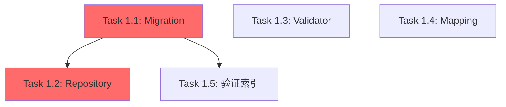
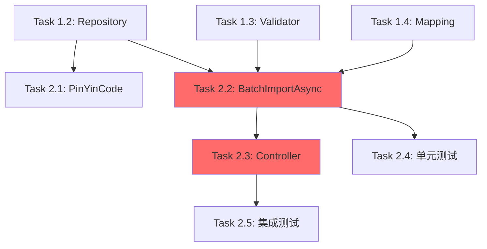
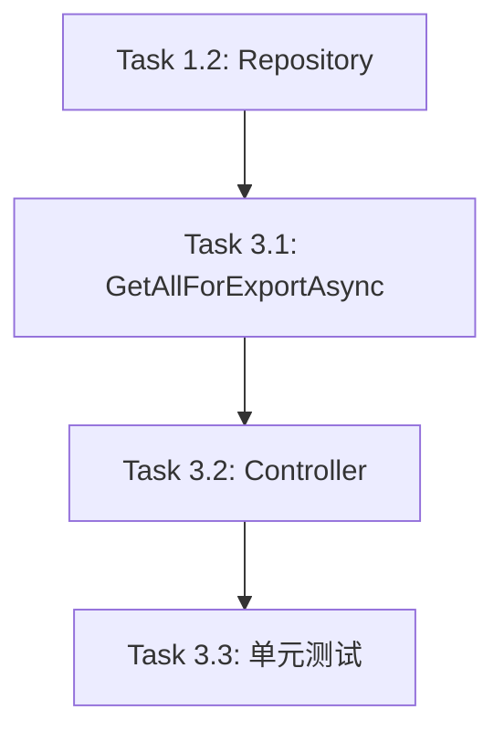
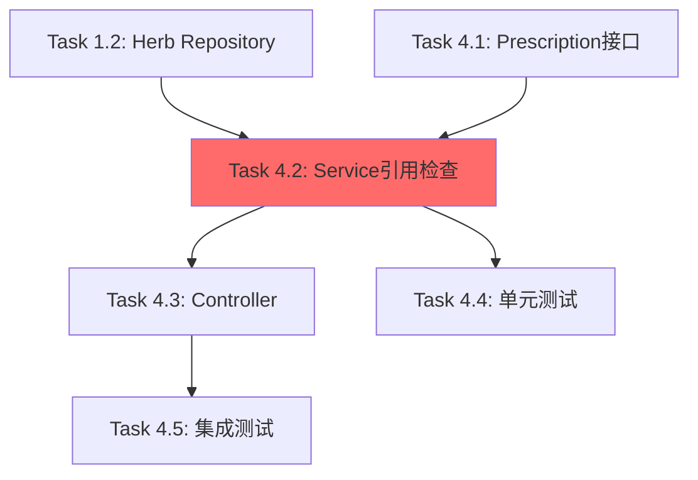
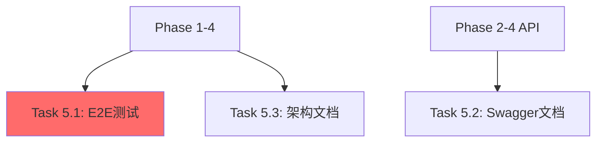
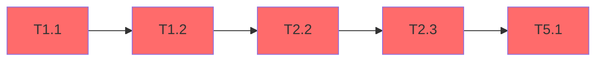

# 药材管理功能完善 - 任务分解文档

## 📋 元数据

- **Epic**: 待创建
- **设计文档**: [herbs-management-enhancement-design.md](../explanation/architecture/server/herbs-management-enhancement-design.md) v1.1
- **需求文档**: [herbs-management-enhancement-requirements.md](../explanation/architecture/server/herbs-management-enhancement-requirements.md) v1.1
- **总工作量**: 72小时（9天）
- **实施阶段**: Phase 1-5
- **技术栈**: .NET 8.0, EF Core 8.0, ASP.NET Core, FluentValidation, AutoMapper
- **创建日期**: 2025-11-09
- **最后更新**: 2025-11-09

---

## 🎯 任务清单（Task Checklist）

### Phase 1: 基础架构与数据库优化（预计16小时）

#### Task 1.1: 创建EF Core Migration添加Category字段和索引

- **工作量**: 1.5小时
- **依赖**: 无
- **类型**: Database Migration
- **优先级**: 🔴 高（关键路径）
- **文件范围**:
  - `src/Server/Migrations/{timestamp}_AddHerbsCategoryAndIndexes.cs`
- **验收标准**:
  - [ ] 编译通过：0 errors, 0 warnings
  - [ ] Migration脚本无SQL语法错误
  - [ ] Up/Down方法可逆
  - [ ] Category字段创建成功（NVARCHAR(50), NULL）
  - [ ] 三个索引创建成功：
    - `IX_Herbs_Name_Unique`（唯一索引，过滤软删除）
    - `IX_Herbs_PinYinCode`（非聚集索引）
    - `IX_Herbs_Status_IsDeleted`（覆盖索引）
- **技术要点**:
  - 使用EF Core Fluent API创建过滤索引（`filter: "[IsDeleted] = 0"`）
  - 覆盖索引使用INCLUDE子句包含常用字段（Name, Unit, Price）
  - Category字段可为NULL，不影响现有数据
  - Down方法正确移除索引和字段

---

#### Task 1.2: 完善HerbRepository实现

- **工作量**: 3小时
- **依赖**: Task 1.1
- **类型**: Repository
- **优先级**: 🔴 高（关键路径）
- **文件范围**:
  - `src/Server/Modules/LYBT.Module.Herbs/Repositories/HerbRepository.cs`
  - `src/Server/Modules/LYBT.Module.Herbs/Interfaces/IHerbRepository.cs`
- **验收标准**:
  - [ ] 编译通过：0 errors, 0 warnings
  - [ ] 实现类标记为`internal`（Epic #1600）
  - [ ] 单元测试通过（Mock DbContext）
  - [ ] 以下方法实现完整：
    - `GetByNameAsync(string name)` - 不区分大小写，过滤软删除
    - `ExistsByNameAsync(string name)` - 名称唯一性检查
    - `GetPagedAsync(int page, int pageSize, string? keyword, CommonStatus? status)` - 分页查询
    - `GetByCategoryAsync(string? category)` - 全量查询（用于导出）
    - `DeleteAsync(Guid id)` - 软删除实现
- **技术要点**:
  - 使用`EF.Functions.Like()`实现不区分大小写查询（BR-001）
  - 分页查询使用Epic #1725的`GetPagedResultAsync()`辅助方法
  - 关键词搜索支持Name和PinYinCode两个字段
  - 导出查询使用`AsNoTracking()`优化性能
  - 排序优先使用PinYinCode，其次Name

---

#### Task 1.3: 创建HerbInputDtoValidator

- **工作量**: 1小时
- **依赖**: 无（可与Task 1.1并行）
- **类型**: Validator
- **优先级**: 🟡 中
- **文件范围**:
  - `src/Shared/LYBT.Shared.Validators/Herbs/HerbInputDtoValidator.cs`
- **验收标准**:
  - [ ] 编译通过：0 errors, 0 warnings
  - [ ] 验证规则覆盖8条业务规则（BR-001至BR-008）：
    - BR-001: 药材名称唯一性（Service层验证）
    - BR-002: 拼音码可选性
    - BR-003: 单价验证（0.01-999999.99）
    - BR-008: 成本价可选性
  - [ ] 错误消息清晰易懂（中文）
  - [ ] 单元测试覆盖正常和异常场景
  - [ ] 创建/更新场景区分（Epic #1961模式）
- **技术要点**:
  - 继承`AbstractValidator<HerbInputDto>`
  - 使用FluentValidation规则链（`.NotEmpty().MaximumLength()`）
  - 条件验证使用`.When()`（如CostPrice仅在有值时验证）
  - Category字段验证：可选，最多50字符
  - 更新时Id必须提供的验证

---

#### Task 1.4: 配置HerbMappingProfile

- **工作量**: 1小时
- **依赖**: 无（可与Task 1.1并行）
- **类型**: Mapping Configuration
- **优先级**: 🟡 中
- **文件范围**:
  - `src/Server/Modules/LYBT.Module.Herbs/Mapping/HerbMappingProfile.cs`
- **验收标准**:
  - [ ] 编译通过：0 errors, 0 warnings
  - [ ] AutoMapper配置验证通过（`AssertConfigurationIsValid()`）
  - [ ] 单元测试覆盖映射规则
  - [ ] 以下映射配置正确：
    - `HerbInputDto -> Herb`（创建/更新）
    - `Herb -> HerbDto`（查询）
    - `Herb -> HerbDetailDto`（详情）
    - `PrescriptionItem -> PrescriptionReferenceDto`（引用检查，Phase 4需要）
- **技术要点**:
  - 审计字段（CreatedAt, UpdatedAt等）标记为`.Ignore()`
  - Id字段由Service层生成，标记为`.Ignore()`
  - Category字段自动映射（名称一致）
  - 嵌套对象映射（PrescriptionReferenceDto）需要`.ForMember()`指定路径

---

#### Task 1.5: 运行Migration并验证索引

- **工作量**: 1小时
- **依赖**: Task 1.1
- **类型**: Database Migration Execution
- **优先级**: 🔴 高（关键路径）
- **文件范围**:
  - 数据库Schema变更
- **验收标准**:
  - [ ] Migration执行成功（`dotnet ef database update`）
  - [ ] Category字段存在于Herbs表
  - [ ] 三个索引创建成功（查询`sys.indexes`验证）
  - [ ] 查询执行计划验证索引生效：
    - 名称唯一性查询使用`IX_Herbs_Name_Unique`
    - 拼音码搜索使用`IX_Herbs_PinYinCode`
    - 列表分页查询使用`IX_Herbs_Status_IsDeleted`
  - [ ] 现有数据不受影响（Category为NULL）
- **技术要点**:
  - 备份数据库后再执行Migration
  - 使用SQL Server Management Studio查看索引
  - 使用`SET STATISTICS IO ON`查看索引使用情况
  - 验证过滤索引正确过滤`IsDeleted = 1`的记录

---

### Phase 2: 批量导入功能（预计20小时）

#### Task 2.1: 实现HerbService.GeneratePinYinCode()

- **工作量**: 1小时
- **依赖**: Task 1.2（需要Repository可用）
- **类型**: Service
- **优先级**: 🟡 中
- **文件范围**:
  - `src/Server/Modules/LYBT.Module.Herbs/Services/HerbService.cs`
- **验收标准**:
  - [ ] 编译通过：0 errors, 0 warnings
  - [ ] 调用`LYBT.Shared.Utilities.Text.PinYinHelper.GetPinYinCode()`
  - [ ] 单元测试覆盖常见药材名称：
    - "当归" → "DG"
    - "黄芪" → "HQ"
    - "川芎" → "CX"
  - [ ] 异常处理完整（空字符串、null、特殊字符）
- **技术要点**:
  - ✅ 使用Shared层现有`PinYinHelper`，不依赖TinyPinyin.NET
  - 参考Patients模块实现（`PatientService.cs:110`）
  - 返回大写拼音码
  - PinYinHelper底层使用`hyjiacan.pinyin4net`库

---

#### Task 2.2: 实现HerbService.BatchImportAsync()核心逻辑

- **工作量**: 5小时
- **依赖**: Task 1.2, Task 1.3, Task 1.4
- **类型**: Service
- **优先级**: 🔴 高（关键路径）
- **文件范围**:
  - `src/Server/Modules/LYBT.Module.Herbs/Services/HerbService.cs`
  - `src/Server/Modules/LYBT.Module.Herbs/Interfaces/IHerbService.cs`
- **验收标准**:
  - [ ] 编译通过：0 errors, 0 warnings
  - [ ] ⚠️ 接收`List<HerbInputDto>`参数（Desktop层已解析，无需EPPlus）
  - [ ] 批量验证使用FluentValidation（HerbInputDtoValidator）
  - [ ] 重复检查实现（BR-001，调用`GetByNameAsync()`）
  - [ ] 拼音码自动生成（BR-002，调用`GeneratePinYinCode()`）
  - [ ] 重复处理策略实现（BR-004）：
    - Skip：跳过重复记录
    - Update：更新现有记录
    - Error：记录为失败项
  - [ ] 失败数据记录到`BatchImportResultDto.FailedItems`
  - [ ] BR-006验证：批量导入限制≤10000条
  - [ ] 业务逻辑单元测试通过
  - [ ] 异常处理完整，日志记录规范
- **技术要点**:
  - 参数签名：`Task<ServiceResult<BatchImportResultDto>> BatchImportAsync(List<HerbInputDto> herbs, string? fileName, DuplicateHandlingStrategy duplicateStrategy)`
  - 使用EF Core事务保证原子性（`SaveChangesAsync()`）
  - 失败记录包含行号、药材名称、错误信息、原始数据
  - 性能考虑：大批量导入时分批保存（每1000条一次`SaveChangesAsync()`）

---

#### Task 2.3: 实现HerbsController.BatchImport()

- **工作量**: 1.5小时
- **依赖**: Task 2.2
- **类型**: Controller
- **优先级**: 🔴 高（关键路径）
- **文件范围**:
  - `src/Server/Services/LYBT.WebAPI/Controllers/HerbsController.cs`
- **验收标准**:
  - [ ] 编译通过：0 errors, 0 warnings
  - [ ] Swagger文档生成正确
  - [ ] API端点：`POST /api/v1/herbs/import`
  - [ ] ⚠️ 参数验证：接收`[FromBody] List<HerbInputDto> herbs`（非IFormFile）
  - [ ] 响应格式符合`ApiResponse<BatchImportResultDto>`标准
  - [ ] 异常处理返回400 Bad Request（数据验证失败）
  - [ ] 异常处理返回500 Internal Server Error（系统错误）
- **技术要点**:
  - 继承`BaseApiController`
  - 使用`HandleServiceResult()`处理Service返回值
  - 参数为空时返回`BadRequest("导入数据不能为空")`
  - 日志记录导入操作（成功/失败计数）

---

#### Task 2.4: 批量导入单元测试

- **工作量**: 4小时
- **依赖**: Task 2.2
- **类型**: Unit Test
- **优先级**: 🟢 低（质量保证）
- **文件范围**:
  - `tests/UnitTests/Server/Modules/LYBT.Module.Herbs.Tests/Services/HerbServiceTests.cs`
- **验收标准**:
  - [ ] 编译通过：0 errors, 0 warnings
  - [ ] 所有测试用例通过
  - [ ] 测试覆盖率 > 85%
  - [ ] 测试场景覆盖：
    - 正常导入（所有记录成功）
    - 部分失败（验证失败、重复记录）
    - 重复处理策略（Skip/Update/Error）
    - BR-006验证（超过10000条）
    - 空数据处理
    - 拼音码自动生成
- **技术要点**:
  - 使用NSubstitute Mock Repository
  - 使用AAA模式（Arrange-Act-Assert）
  - 测试命名：`BatchImportAsync_WithDuplicateRecords_ShouldSkip`
  - 验证失败数据记录完整性

---

#### Task 2.5: 批量导入集成测试

- **工作量**: 2小时
- **依赖**: Task 2.3
- **类型**: Integration Test
- **优先级**: 🟢 低（质量保证）
- **文件范围**:
  - `tests/IntegrationTests/Controllers/HerbsControllerTests.cs`
- **验收标准**:
  - [ ] 编译通过：0 errors, 0 warnings
  - [ ] 所有测试用例通过
  - [ ] 端到端导入流程测试：
    - Desktop层解析Excel → 调用API → 数据库验证
  - [ ] 性能测试：1000条记录 < 10秒
  - [ ] 真实数据库环境测试
- **技术要点**:
  - 使用`WebApplicationFactory`
  - 使用真实数据库（测试数据库）
  - 测试后清理数据
  - 性能计时使用`Stopwatch`

---

### Phase 3: 导出数据查询功能（预计12小时）

#### Task 3.1: 实现HerbService.GetAllForExportAsync()

- **工作量**: 2小时
- **依赖**: Task 1.2
- **类型**: Service
- **优先级**: 🟡 中
- **文件范围**:
  - `src/Server/Modules/LYBT.Module.Herbs/Services/HerbService.cs`
  - `src/Server/Modules/LYBT.Module.Herbs/Interfaces/IHerbService.cs`
- **验收标准**:
  - [ ] 编译通过：0 errors, 0 warnings
  - [ ] ⚠️ 返回`List<HerbDto>`（Desktop层负责Excel生成）
  - [ ] 分类筛选查询（支持Category参数，可选）
  - [ ] 全量数据返回（调用`GetByCategoryAsync()`）
  - [ ] 性能优化：使用`AsNoTracking()`
  - [ ] 排序：按PinYinCode或Name排序
  - [ ] 业务逻辑单元测试通过
- **技术要点**:
  - 方法签名：`Task<ServiceResult<List<HerbDto>>> GetAllForExportAsync(string? category)`
  - Category为null时返回所有药材
  - Category不为null时筛选指定分类
  - 不分页，返回全量数据
  - 使用AutoMapper映射`Herb -> HerbDto`

---

#### Task 3.2: 实现HerbsController.GetAllForExport()

- **工作量**: 1小时
- **依赖**: Task 3.1
- **类型**: Controller
- **优先级**: 🟡 中
- **文件范围**:
  - `src/Server/Services/LYBT.WebAPI/Controllers/HerbsController.cs`
- **验收标准**:
  - [ ] 编译通过：0 errors, 0 warnings
  - [ ] Swagger文档生成正确
  - [ ] API端点：`GET /api/v1/herbs/export?category={category}`
  - [ ] 响应格式符合`ApiResponse<List<HerbDto>>`标准
  - [ ] Category参数可选（`[FromQuery] string? category`）
- **技术要点**:
  - 使用`HandleServiceResult()`处理Service返回值
  - 日志记录导出操作（记录数）
  - ⚠️ 不返回文件流，仅返回数据列表

---

#### Task 3.3: 导出功能单元测试

- **工作量**: 3小时
- **依赖**: Task 3.2
- **类型**: Unit Test
- **优先级**: 🟢 低（质量保证）
- **文件范围**:
  - `tests/UnitTests/Server/Modules/LYBT.Module.Herbs.Tests/Services/HerbServiceTests.cs`
  - `tests/IntegrationTests/Controllers/HerbsControllerTests.cs`
- **验收标准**:
  - [ ] 编译通过：0 errors, 0 warnings
  - [ ] 所有测试用例通过
  - [ ] 测试场景覆盖：
    - 全量导出（category = null）
    - 分类筛选导出（category = "解表药"）
    - 空结果处理
  - [ ] 性能测试：10000条记录 < 2秒
- **技术要点**:
  - Service单元测试：Mock Repository
  - Controller集成测试：真实数据库
  - 验证数据完整性（所有字段正确映射）

---

### Phase 4: 删除前引用检查（预计16小时）

#### Task 4.1: 扩展IPrescriptionRepository接口

- **工作量**: 2小时
- **依赖**: 无（跨模块接口，可与Phase 2/3并行）
- **类型**: Repository Interface
- **优先级**: 🟡 中
- **文件范围**:
  - `src/Server/Modules/LYBT.Module.Prescriptions/Interfaces/IPrescriptionRepository.cs`
  - `src/Server/Modules/LYBT.Module.Prescriptions/Repositories/PrescriptionRepository.cs`
- **验收标准**:
  - [ ] 编译通过：0 errors, 0 warnings
  - [ ] 新增接口方法：
    - `GetHerbReferenceCountAsync(Guid herbId)` - 返回引用次数
    - `GetRecentReferencesAsync(Guid herbId, int top)` - 返回最近引用记录（最多5条）
  - [ ] 实现类标记为`internal`（Epic #1600）
  - [ ] 单元测试通过（Mock DbContext）
- **技术要点**:
  - 查询PrescriptionItems表（JOIN Prescriptions和MedicalCases）
  - `GetHerbReferenceCountAsync`：`Count(pi => pi.HerbId == herbId && !pi.Prescription.IsDeleted)`
  - `GetRecentReferencesAsync`：按`Prescription.CreatedAt`降序，Take(top)
  - 返回DTO包含：PrescriptionNumber, PatientName, PrescribedDate, Quantity

---

#### Task 4.2: 实现HerbService引用检查方法

- **工作量**: 4小时
- **依赖**: Task 4.1, Task 1.2
- **类型**: Service
- **优先级**: 🔴 高（关键路径）
- **文件范围**:
  - `src/Server/Modules/LYBT.Module.Herbs/Services/HerbService.cs`
  - `src/Server/Modules/LYBT.Module.Herbs/Interfaces/IHerbService.cs`
- **验收标准**:
  - [ ] 编译通过：0 errors, 0 warnings
  - [ ] 实现两个方法：
    - `CheckReferenceAsync(Guid herbId)` - 单个药材引用检查
    - `BatchCheckReferenceAsync(List<Guid> herbIds)` - 批量引用检查
  - [ ] 返回`HerbReferenceCheckDto`：
    - HerbId, HerbName
    - TotalReferenceCount, PrescriptionCount
    - RecentReferences（最多5条）
    - CanDelete（BR-007：总是true，仅软删除）
    - DeleteRestriction（引用提示信息）
  - [ ] 业务逻辑单元测试通过
  - [ ] 跨模块依赖注入正确（`IPrescriptionRepository`）
- **技术要点**:
  - 构造函数注入`IPrescriptionRepository`
  - BR-007：被引用的药材仍可软删除，`CanDelete`总是返回`true`
  - DeleteRestriction消息：`"该药材被{count}个处方引用，仅可软删除"`
  - 使用AutoMapper映射`PrescriptionItem -> PrescriptionReferenceDto`

---

#### Task 4.3: 实现HerbsController引用检查端点

- **工作量**: 2小时
- **依赖**: Task 4.2
- **类型**: Controller
- **优先级**: 🟡 中
- **文件范围**:
  - `src/Server/Services/LYBT.WebAPI/Controllers/HerbsController.cs`
- **验收标准**:
  - [ ] 编译通过：0 errors, 0 warnings
  - [ ] Swagger文档生成正确
  - [ ] API端点：
    - `GET /api/v1/herbs/{id}/references` - 单个引用检查
    - `DELETE /api/v1/herbs/batch` - 批量删除（调用引用检查）
  - [ ] 批量删除验证BR-006：最多100条
  - [ ] 响应格式符合ApiResponse标准
- **技术要点**:
  - `CheckReferences`返回`ApiResponse<HerbReferenceCheckDto>`
  - `BatchDelete`先调用`BatchCheckReferenceAsync()`，然后软删除
  - 批量删除返回`BatchDeleteResultDto`（包含skippedItems）
  - 日志记录删除操作

---

#### Task 4.4: 引用检查单元测试

- **工作量**: 3小时
- **依赖**: Task 4.2
- **类型**: Unit Test
- **优先级**: 🟢 低（质量保证）
- **文件范围**:
  - `tests/UnitTests/Server/Modules/LYBT.Module.Herbs.Tests/Services/HerbServiceTests.cs`
- **验收标准**:
  - [ ] 编译通过：0 errors, 0 warnings
  - [ ] 所有测试用例通过
  - [ ] 测试场景覆盖：
    - 无引用药材（TotalReferenceCount = 0）
    - 有引用药材（TotalReferenceCount > 0）
    - 批量检查（部分有引用）
  - [ ] 验证BR-007：CanDelete总是true
- **技术要点**:
  - Mock `IPrescriptionRepository`
  - 验证DeleteRestriction消息正确性
  - 验证RecentReferences数量限制（≤5条）

---

#### Task 4.5: 引用检查集成测试

- **工作量**: 2小时
- **依赖**: Task 4.3
- **类型**: Integration Test
- **优先级**: 🟢 低（质量保证）
- **文件范围**:
  - `tests/IntegrationTests/Controllers/HerbsControllerTests.cs`
- **验收标准**:
  - [ ] 编译通过：0 errors, 0 warnings
  - [ ] 所有测试用例通过
  - [ ] 跨模块依赖验证（Herbs → Prescriptions）
  - [ ] 软删除验证（IsDeleted = true，数据仍存在）
  - [ ] 性能测试：单个引用检查 < 500ms
- **技术要点**:
  - 准备测试数据（药材 + 处方引用）
  - 验证软删除后引用检查仍能查询到历史数据
  - 测试后清理数据

---

### Phase 5: 集成测试与文档（预计8小时）

#### Task 5.1: 端到端集成测试

- **工作量**: 4小时
- **依赖**: Phase 1-4全部完成
- **类型**: Integration Test
- **优先级**: 🟢 低（质量保证）
- **文件范围**:
  - `tests/IntegrationTests/Scenarios/HerbsManagementE2ETests.cs`
- **验收标准**:
  - [ ] 编译通过：0 errors, 0 warnings
  - [ ] 所有测试用例通过
  - [ ] 完整业务流程测试：
    1. 批量导入药材（1000条）
    2. 分类筛选导出
    3. 引用检查
    4. 批量删除（包含有引用的药材）
  - [ ] 边界条件测试：
    - 最大导入量（10000条）
    - 最大删除量（100条）
    - 空数据处理
  - [ ] 并发测试（模拟多用户同时导入）
- **技术要点**:
  - 使用真实数据库环境
  - 测试数据准备脚本（Seed Data）
  - 测试后完整清理数据
  - 性能计时和断言

---

#### Task 5.2: Swagger文档完善

- **工作量**: 2小时
- **依赖**: Phase 2-4（需要所有API端点完成）
- **类型**: Documentation
- **优先级**: 🟢 低（质量保证）
- **文件范围**:
  - `src/Server/Services/LYBT.WebAPI/Controllers/HerbsController.cs`（XML注释）
  - Swagger UI
- **验收标准**:
  - [ ] 编译通过：0 errors, 0 warnings
  - [ ] 所有API端点XML注释完整：
    - 方法摘要（`<summary>`）
    - 参数说明（`<param>`）
    - 返回值说明（`<returns>`）
    - 示例数据（`<example>`）
  - [ ] Swagger UI正确显示：
    - API分组（Herbs）
    - 请求/响应示例
    - 参数验证规则
  - [ ] ProducesResponseType注解完整（200, 400, 500）
- **技术要点**:
  - 使用`///`格式XML注释
  - ProducesResponseType示例：`[ProducesResponseType(typeof(ApiResponse<BatchImportResultDto>), StatusCodes.Status200OK)]`
  - 示例数据使用JSON格式

---

#### Task 5.3: 更新架构文档

- **工作量**: 2小时
- **依赖**: Phase 1-4（需要所有功能完成）
- **类型**: Documentation
- **优先级**: 🟢 低（质量保证）
- **文件范围**:
  - `docs/explanation/architecture/server/README.md`
  - `docs/reference/api/herbs-api.md`
  - `docs/index.md`（更新导航链接）
- **验收标准**:
  - [ ] 文档内容准确反映实现：
    - Herbs模块新增功能列表
    - API端点文档更新
    - 数据库Schema变更记录
  - [ ] 文档格式符合Diátaxis框架
  - [ ] 内部链接正确（Markdown链接）
  - [ ] 代码示例更新（调用新API的示例）
- **技术要点**:
  - 同步更新Server端README.md的Herbs模块描述
  - 新增API文档包含：
    - 端点URL
    - 请求/响应示例
    - 业务规则说明
  - 更新docs/index.md的"API参考"部分

---

## 📊 任务统计

- **总任务数**: 18个
- **总工作量**: 72小时（9天）
- **Phase数量**: 5个
- **关键路径长度**: 5个任务（Task 1.1 → 1.2 → 2.2 → 2.3 → 5.1）

### Phase工作量分布

| Phase | 任务数 | 工作量（小时） | 百分比 |
|-------|-------|--------------|--------|
| Phase 1 | 5个 | 16小时 | 22% |
| Phase 2 | 5个 | 20小时 | 28% |
| Phase 3 | 3个 | 12小时 | 17% |
| Phase 4 | 5个 | 16小时 | 22% |
| Phase 5 | 3个 | 8小时 | 11% |

### 任务类型分布

| 类型 | 任务数 | 工作量（小时） |
|------|-------|--------------|
| Repository | 2个 | 5小时 |
| Service | 5个 | 14小时 |
| Controller | 3个 | 4.5小时 |
| Validator | 1个 | 1小时 |
| Mapping | 1个 | 1小时 |
| Migration | 2个 | 2.5小时 |
| Unit Test | 3个 | 10小时 |
| Integration Test | 2个 | 6小时 |
| Documentation | 2个 | 4小时 |

---

## 🔗 依赖关系图

### Phase 1依赖关系



**说明**:
- Task 1.3和Task 1.4可与Task 1.1并行开发
- Task 1.2和Task 1.5必须等Task 1.1完成

### Phase 2依赖关系



**说明**:
- Task 2.1可与Task 2.2并行开发
- Task 2.4可在Task 2.2完成后立即开始，无需等Task 2.3

### Phase 3依赖关系



**说明**:
- Phase 3可与Phase 2并行开发（都依赖Task 1.2）

### Phase 4依赖关系



**说明**:
- Task 4.1可与Phase 2/3并行开发（跨模块独立）
- Task 4.4可在Task 4.2完成后立即开始，无需等Task 4.3

### Phase 5依赖关系



**说明**:
- Phase 5必须等前4个Phase全部完成
- Task 5.2和Task 5.3可并行

### 关键路径（Critical Path）



**关键路径说明**:
1. Task 1.1: 创建Migration（1.5小时）
2. Task 1.2: 完善Repository（3小时）
3. Task 2.2: 实现BatchImportAsync（5小时）
4. Task 2.3: 实现Controller导入端点（1.5小时）
5. Task 5.1: E2E集成测试（4小时）

**关键路径总长度**: 15小时（占总工作量的21%）

---

## ⚠️ 实施建议

### 优先级排序

#### 🔴 高优先级（关键路径任务）

必须按顺序完成的任务：

1. **Task 1.1**: 创建Migration（阻塞Task 1.2和Task 1.5）
2. **Task 1.2**: 完善Repository（阻塞Phase 2、3、4）
3. **Task 2.2**: 实现BatchImportAsync（核心业务逻辑）
4. **Task 2.3**: 实现Controller导入端点（暴露核心功能）
5. **Task 4.2**: 引用检查Service（安全删除逻辑）
6. **Task 5.1**: E2E集成测试（质量保证）

#### 🟡 中优先级（支撑功能）

可在关键路径之外进行的功能开发：

- **Task 1.3**: Validator（支持验证框架）
- **Task 1.4**: Mapping（支持对象映射）
- **Task 2.1**: PinYinCode生成（支持自动生成）
- **Task 3.1-3.2**: 导出功能（独立功能模块）
- **Task 4.1**: Prescription接口扩展（跨模块依赖）
- **Task 4.3**: 删除Controller端点（删除功能入口）

#### 🟢 低优先级（质量保证与文档）

可在功能开发完成后补充：

- **Task 2.4-2.5**: 导入测试（单元测试 + 集成测试）
- **Task 3.3**: 导出测试
- **Task 4.4-4.5**: 删除测试
- **Task 5.2-5.3**: Swagger文档 + 架构文档

---

### 并行策略

#### Phase 1并行组

```
同时开始：
├─ Task 1.1 (Migration) [1.5h]
├─ Task 1.3 (Validator) [1h]
└─ Task 1.4 (Mapping) [1h]

等Task 1.1完成后：
├─ Task 1.2 (Repository) [3h]
└─ Task 1.5 (验证索引) [1h]
```

**时间优化**: 串行需7.5小时，并行仅需5.5小时（节省27%）

#### Phase 2-3-4并行组

Task 1.2完成后，以下任务可并行：

```
Phase 2:
├─ Task 2.1 (PinYinCode) [1h]
└─ Task 2.2 (BatchImportAsync) [5h] - 需等Task 1.3, 1.4完成

Phase 3:
└─ Task 3.1 (GetAllForExportAsync) [2h]

Phase 4:
└─ Task 4.1 (Prescription接口) [2h] - 完全独立
```

**时间优化**: 如果2个开发者并行，可节省2-3小时

#### 测试并行组

功能开发完成后，测试任务可并行：

```
同时开始：
├─ Task 2.4 (导入单元测试) [4h]
├─ Task 3.3 (导出单元测试) [3h]
└─ Task 4.4 (删除单元测试) [3h]

然后：
├─ Task 2.5 (导入集成测试) [2h]
├─ Task 4.5 (删除集成测试) [2h]
└─ Task 5.1 (E2E测试) [4h]
```

**时间优化**: 串行需18小时，并行仅需8小时（节省56%）

---

### 风险提示

#### 🔴 高风险

1. **Category字段数据迁移**
   - **风险**: Migration执行失败
   - **影响**: 阻塞所有后续任务
   - **缓解措施**:
     - 提前备份数据库
     - Migration脚本手动验证SQL语法
     - 先在测试环境执行
   - **回滚方案**: Down方法已正确实现

2. **跨模块依赖（IPrescriptionRepository）**
   - **风险**: Prescriptions模块接口变更
   - **影响**: Task 4.2-4.5无法完成
   - **缓解措施**:
     - 提前与Prescriptions模块负责人沟通
     - 明确接口契约
     - 使用接口隔离原则
   - **替代方案**: 如果Prescriptions模块不可用，暂时跳过Phase 4

#### 🟡 中风险

3. **Desktop-Server数据传输性能**
   - **风险**: 大批量导入（10000条）时网络传输慢
   - **影响**: 导入超时，用户体验差
   - **缓解措施**:
     - 分批处理（每批1000条）
     - 使用压缩（Gzip）
     - 进度条显示
   - **性能目标**: 10000条 < 30秒

4. **拼音码生成性能**
   - **风险**: PinYinHelper.GetPinYinCode()在大批量时慢
   - **影响**: 批量导入性能下降
   - **缓解措施**:
     - 性能测试（Task 2.5）
     - 如果慢，考虑批量生成或缓存
   - **性能目标**: 1000条拼音码生成 < 2秒

#### 🟢 低风险

5. **索引创建失败**
   - **风险**: 唯一索引创建失败（已有重复数据）
   - **影响**: Migration失败
   - **缓解措施**:
     - 先清理重复数据
     - 使用过滤索引（仅过滤IsDeleted=0）
   - **检测方法**: Task 1.5验证索引

6. **AutoMapper配置错误**
   - **风险**: 映射规则遗漏或错误
   - **影响**: 运行时异常
   - **缓解措施**:
     - Task 1.4包含`AssertConfigurationIsValid()`
     - 单元测试覆盖所有映射场景
   - **检测方法**: 编译时验证 + 单元测试

---

### 资源分配建议

#### 单人开发（推荐）

**总耗时**: 9天（72小时）

```
第1-2天: Phase 1（16h）
  → Task 1.1, 1.3, 1.4并行 → Task 1.2 → Task 1.5

第3-5天: Phase 2（20h）
  → Task 2.1, 2.2 → Task 2.3 → Task 2.4 → Task 2.5

第6天: Phase 3（12h）
  → Task 3.1 → Task 3.2 → Task 3.3

第7-8天: Phase 4（16h）
  → Task 4.1 → Task 4.2 → Task 4.3 → Task 4.4 → Task 4.5

第9天: Phase 5（8h）
  → Task 5.1, 5.2, 5.3并行
```

#### 双人并行开发（加速）

**总耗时**: 5-6天（40-48小时/人）

```
开发者A（关键路径）:
  第1天: Task 1.1, 1.2（4.5h）
  第2-3天: Task 2.2, 2.3（6.5h）
  第4天: Task 4.2, 4.3（6h）
  第5天: Task 5.1（4h）

开发者B（支撑功能）:
  第1天: Task 1.3, 1.4, 1.5（3h）
  第2天: Task 2.1, 2.4（5h）
  第3天: Task 3.1, 3.2, 3.3（6h）
  第4天: Task 4.1, 4.4（5h）
  第5天: Task 2.5, 4.5, 5.2, 5.3（8h）
```

**时间优化**: 从9天降至5天（节省44%）

---

## 🧪 测试策略

### 单元测试（Unit Tests）

**工具**: xUnit + NSubstitute + FluentAssertions

**范围**:
- Task 1.2: HerbRepository单元测试（Mock `DbContext`）
  - `GetByNameAsync()` - 不区分大小写查询
  - `ExistsByNameAsync()` - 名称唯一性检查
  - `GetPagedAsync()` - 分页查询
  - `GetByCategoryAsync()` - 分类筛选
  - `DeleteAsync()` - 软删除

- Task 2.4: HerbService单元测试（Mock `IHerbRepository`）
  - `GeneratePinYinCode()` - 拼音码生成
  - `BatchImportAsync()` - 批量导入逻辑
    - 正常导入
    - 重复处理策略（Skip/Update/Error）
    - 验证失败场景
    - 批量限制验证（BR-006）

- Task 3.3: HerbService导出单元测试（Mock `IHerbRepository`）
  - `GetAllForExportAsync()` - 全量导出
  - `GetAllForExportAsync(category)` - 分类导出

- Task 4.4: HerbService引用检查单元测试（Mock `IPrescriptionRepository`）
  - `CheckReferenceAsync()` - 单个引用检查
  - `BatchCheckReferenceAsync()` - 批量引用检查
  - BR-007验证（CanDelete总是true）

**AAA模式示例**:

```csharp
[Fact]
public async Task BatchImportAsync_WithDuplicateRecords_ShouldSkipWhenStrategyIsSkip()
{
    // Arrange
    var mockRepo = Substitute.For<IHerbRepository>();
    var service = new HerbService(mockRepo, ...);
    var herbs = new List<HerbInputDto>
    {
        new() { Name = "当归", Price = 10 },
        new() { Name = "当归", Price = 12 } // 重复
    };
    mockRepo.GetByNameAsync("当归").Returns(new Herb { Name = "当归" });

    // Act
    var result = await service.BatchImportAsync(
        herbs,
        fileName: null,
        DuplicateHandlingStrategy.Skip);

    // Assert
    result.Should().BeSuccess();
    result.Data.SuccessCount.Should().Be(1);
    result.Data.SkippedCount.Should().Be(1);
    await mockRepo.Received(1).AddAsync(Arg.Any<Herb>());
}
```

---

### 集成测试（Integration Tests）

**工具**: xUnit + WebApplicationFactory + 真实数据库

**范围**:
- Task 2.5: HerbsController批量导入集成测试
  - 端到端导入流程：Desktop解析 → API → 数据库
  - 性能测试：1000条 < 10秒

- Task 4.5: HerbsController引用检查集成测试
  - 跨模块依赖验证（Herbs → Prescriptions）
  - 软删除验证（IsDeleted = true）
  - 性能测试：单个引用检查 < 500ms

- Task 5.1: 端到端场景测试
  - 完整业务流程：导入 → 导出 → 引用检查 → 删除
  - 边界条件：最大导入量（10000条）、最大删除量（100条）
  - 并发测试（模拟多用户）

**集成测试示例**:

```csharp
[Fact]
public async Task BatchImport_ShouldImportSuccessfully()
{
    // Arrange
    var factory = new WebApplicationFactory<Program>();
    var client = factory.CreateClient();
    var herbs = new List<HerbInputDto>
    {
        new() { Name = "当归", Price = 10, Category = "补血药" },
        new() { Name = "黄芪", Price = 15, Category = "补气药" }
    };

    // Act
    var response = await client.PostAsJsonAsync("/api/v1/herbs/import", herbs);

    // Assert
    response.Should().BeSuccessful();
    var result = await response.Content.ReadFromJsonAsync<ApiResponse<BatchImportResultDto>>();
    result.Data.SuccessCount.Should().Be(2);

    // Verify database
    using var scope = factory.Services.CreateScope();
    var dbContext = scope.ServiceProvider.GetRequiredService<AppDbContext>();
    var savedHerbs = await dbContext.Herbs.Where(h => h.Name.In("当归", "黄芪")).ToListAsync();
    savedHerbs.Should().HaveCount(2);
}
```

---

### 性能测试（Performance Tests）

**工具**: BenchmarkDotNet（可选）或 Stopwatch + Assert

**性能目标**:

| 功能 | 数据量 | 目标时间 | 验证任务 |
|------|-------|---------|---------|
| 批量导入 | 1000条 | < 10秒 | Task 2.5 |
| 批量导入 | 10000条 | < 60秒 | Task 5.1 |
| 拼音码生成 | 1000条 | < 2秒 | Task 2.4 |
| 导出查询 | 10000条 | < 2秒 | Task 3.3 |
| 引用检查 | 单个 | < 500ms | Task 4.5 |
| 索引查询 | 名称唯一性 | < 5ms | Task 1.5 |

**性能测试示例**:

```csharp
[Fact]
public async Task BatchImport_With1000Records_ShouldCompleteWithin10Seconds()
{
    // Arrange
    var herbs = GenerateTestHerbs(count: 1000);
    var stopwatch = Stopwatch.StartNew();

    // Act
    var result = await _herbService.BatchImportAsync(herbs);

    // Assert
    stopwatch.Stop();
    stopwatch.Elapsed.Should().BeLessThan(TimeSpan.FromSeconds(10));
    result.Data.SuccessCount.Should().Be(1000);
}
```

---

### 测试覆盖率要求

| 层次 | 目标覆盖率 | 工具 |
|------|----------|------|
| Repository层 | > 80% | Coverlet |
| Service层 | > 85% | Coverlet |
| Controller层 | > 75% | Coverlet |
| Validator层 | > 90% | Coverlet |

**覆盖率验证**:

```bash
dotnet test /p:CollectCoverage=true /p:CoverletOutputFormat=opencover
dotnet tool run reportgenerator "-reports:coverage.opencover.xml" "-targetdir:coverage-report"
```

---

## 💡 下一步操作

### 1. 审查Task文档

- [ ] 检查任务粒度是否合理（2-4小时/任务）
- [ ] 验证依赖关系是否准确
- [ ] 调整工作量估算（根据团队实际情况）
- [ ] 确认技术要点无遗漏

### 2. 批量生成GitHub Issues

使用`lybtzyzs-issue-template` skill批量创建Issues：

```
"根据task文档批量创建Issues: docs/tasks/herbs-management-enhancement-tasks.md"
```

该Skill将：
- 读取task文档
- 为每个Task创建GitHub Issue
- 自动关联Epic（创建后）
- 设置Labels（phase-1, phase-2等）
- 设置Assignee（可选）
- 建立Issue间依赖关系（GitHub Projects）

### 3. 开始实施

按以下顺序开始开发：

```
第1步: Task 1.1 (Migration) - 创建Category字段和索引
第2步: Task 1.3, 1.4 (并行) - Validator和Mapping
第3步: Task 1.2 (Repository) - 完善Repository实现
第4步: Task 1.5 (验证) - 验证索引生效
...
```

---

**文档版本**: v1.0
**创建日期**: 2025-11-09
**维护者**: Claude Code
**反馈渠道**: GitHub Issues

---

## 📎 附录

### A. 技术决策记录（ADR）

本任务分解基于以下技术决策：

1. **ADR-001**: 使用Shared层PinYinHelper替代TinyPinyin.NET（v1.1修正）
2. **ADR-002**: Desktop层负责Excel读写，Server端仅处理业务逻辑（v1.1修正）
3. **ADR-003**: 添加Category字段支持单层级分类（v1.1修正）
4. **ADR-004**: 采用软删除策略（BR-007），被引用药材仍可软删除
5. **ADR-005**: 批量操作限制（BR-006）：导入≤10000条，删除≤100条

### B. 关键代码路径

| 功能 | 关键文件路径 |
|------|------------|
| Entity | `src/Server/Core/LYBT.Entities/Herbs/HerbModel.cs` |
| DTO | `src/Shared/LYBT.Shared.Models/Contracts/Herbs/HerbDtos.cs` |
| Validator | `src/Shared/LYBT.Shared.Validators/Herbs/HerbInputDtoValidator.cs` |
| Repository | `src/Server/Modules/LYBT.Module.Herbs/Repositories/HerbRepository.cs` |
| Service | `src/Server/Modules/LYBT.Module.Herbs/Services/HerbService.cs` |
| Controller | `src/Server/Services/LYBT.WebAPI/Controllers/HerbsController.cs` |
| Mapping | `src/Server/Modules/LYBT.Module.Herbs/Mapping/HerbMappingProfile.cs` |
| Migration | `src/Server/Migrations/{timestamp}_AddHerbsCategoryAndIndexes.cs` |

### C. 参考文档

- 设计文档: [herbs-management-enhancement-design.md](../explanation/architecture/server/herbs-management-enhancement-design.md) v1.1
- 需求文档: [herbs-management-enhancement-requirements.md](../explanation/architecture/server/herbs-management-enhancement-requirements.md) v1.1
- Server端架构: [docs/explanation/architecture/server/README.md](../explanation/architecture/server/README.md)
- Epic #1961: FluentValidation统一设计
- Epic #1934: Patients模块批量导入/导出（参考实现）
- Epic #1600: Repository内部可见性
- Epic #1725: BaseRepository辅助方法

### D. 术语表

| 术语 | 说明 |
|-----|------|
| **Category** | 药材分类（单层级，可选字段，最多50字符） |
| **PinYinHelper** | Shared层拼音码生成工具（`LYBT.Shared.Utilities.Text.PinYinHelper`） |
| **BatchImportResultDto** | 批量导入结果DTO（包含成功/失败/跳过计数） |
| **HerbReferenceCheckDto** | 药材引用检查结果DTO（包含处方引用信息） |
| **DuplicateHandlingStrategy** | 重复处理策略枚举（Skip/Update/Error） |
| **BR-001至BR-008** | 业务规则编号（需求文档定义） |
| **FR-001至FR-004** | 功能需求编号（需求文档定义） |

---

**任务分解完成！** ✅
