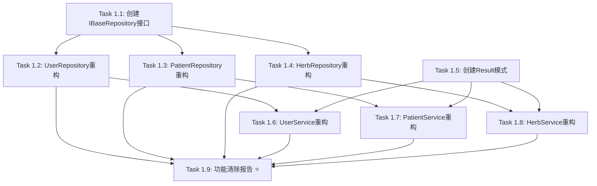
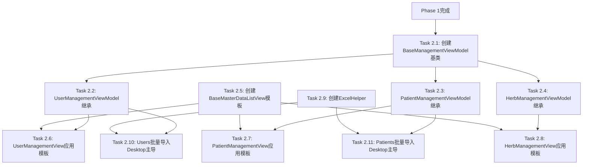
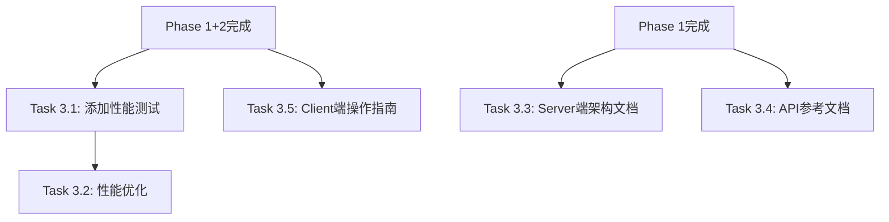

# 基础数据模块统一重构与优化 - 任务分解文档

## 📋 元数据

- **Epic**: 基础数据模块重构（Users/Patients/Herbs）
- **设计文档**: [master-data-refactoring-design.md](../explanation/architecture/shared/master-data-refactoring-design.md)
- **需求文档**: [master-data-refactoring-discussion.md](../explanation/architecture/shared/master-data-refactoring-discussion.md)
- **总工作量**: 198-264小时（约5-8周）
- **实施阶段**: Phase 1-3
- **创建日期**: 2025-11-10

## 🎯 任务清单（Task Checklist）

### Phase 1: Server端统一（预计60-80小时，2-3周）

**目标**：统一三个模块的Server端架构（Repository + Service层）

#### Task 1.1: 创建IBaseRepository<T>泛型接口

- **工作量**: 6-8小时（1天）
- **依赖**: 无（可立即开始）
- **类型**: Repository / 接口定义
- **文件范围**:
  - `src/Shared/LYBT.Shared.Models/Interfaces/IBaseRepository.cs`（新建）
- **验收标准**:
  - [ ] 编译通过：0 errors, 0 warnings
  - [ ] 定义11个标准CRUD方法（GetByIdAsync, GetAllAsync, GetPagedAsync, FindAsync, AddAsync, UpdateAsync, DeleteAsync, ExistsAsync, CountAsync, SaveChangesAsync + 1个）
  - [ ] 泛型约束正确（`where T : class`）
  - [ ] 接口文档注释完整（中文，XML文档格式）
  - [ ] 包含使用示例注释
- **技术要点**:
  - 泛型接口设计（`IBaseRepository<T>`）
  - 异步方法命名约定（`Async`后缀）
  - 分页查询参数设计（`pageIndex`, `pageSize`, `searchText`）
  - 返回类型设计（`Task<T?>`, `Task<IEnumerable<T>>`, `Task<PagedResult<T>>`）
  - 注意：不强制统一方法数量，各模块可保留特定业务方法 ⭐

---

#### Task 1.2: UserRepository实现IBaseRepository<T>

- **工作量**: 12-16小时（2天）
- **依赖**: Task 1.1（IBaseRepository<T>接口定义）
- **类型**: Repository / Server端
- **文件范围**:
  - `src/Server/Modules/LYBT.Module.Users/Repositories/UserRepository.cs`（修改）
  - `src/Server/Modules/LYBT.Module.Users/Interfaces/IUserRepository.cs`（修改）
- **验收标准**:
  - [ ] 编译通过：0 errors, 0 warnings
  - [ ] 实现IBaseRepository<UserModel>接口的11个标准方法
  - [ ] 保留特定业务方法（GetByUsernameAsync, IsUsernameExistsAsync, ResetPasswordAsync）⭐
  - [ ] 清除未使用的方法（使用find_referencing_symbols检查GetByEmailAsync, IsEmailExistsAsync, AddRangeAsync等）⭐
  - [ ] EF Core查询优化（AsNoTracking, Include关联加载）
  - [ ] 软删除逻辑正确（IsDeleted字段）
  - [ ] 单元测试覆盖率≥70%（Mock DbContext）
  - [ ] 集成测试覆盖所有CRUD方法
- **技术要点**:
  - EF Core Include关联加载（`Include(u => u.Role)`）
  - 软删除模式（`Where(u => !u.IsDeleted)`）
  - 分页查询优化（`Skip`, `Take`, `CountAsync`）
  - 搜索逻辑（用户名/真实姓名/拼音码）
  - **功能清除**：使用serena的find_referencing_symbols检查方法引用，无引用则清除

---

#### Task 1.3: PatientRepository实现IBaseRepository<T>

- **工作量**: 12-16小时（2天）
- **依赖**: Task 1.1（IBaseRepository<T>接口定义）
- **类型**: Repository / Server端
- **文件范围**:
  - `src/Server/Modules/LYBT.Module.Patients/Repositories/PatientRepository.cs`（修改）
  - `src/Server/Modules/LYBT.Module.Patients/Interfaces/IPatientRepository.cs`（修改）
- **验收标准**:
  - [ ] 编译通过：0 errors, 0 warnings
  - [ ] 实现IBaseRepository<PatientModel>接口的11个标准方法
  - [ ] 保留特定业务方法（GetByNameOrPinyinAsync等）⭐
  - [ ] 清除未使用的方法（使用find_referencing_symbols检查GetByPhoneAsync, GetByIdCardAsync等）⭐
  - [ ] EF Core查询优化（AsNoTracking, 关联加载）
  - [ ] 软删除逻辑正确
  - [ ] 单元测试覆盖率≥70%（Mock DbContext）
  - [ ] 集成测试覆盖所有CRUD方法
- **技术要点**:
  - 同Task 1.2
  - 患者特定搜索逻辑（姓名/拼音码/电话）
  - **功能清除**：检查并清除GetByPhoneAsync, GetByIdCardAsync等未使用方法

---

#### Task 1.4: HerbRepository实现IBaseRepository<T>

- **工作量**: 6-8小时（1天）
- **依赖**: Task 1.1（IBaseRepository<T>接口定义）
- **类型**: Repository / Server端
- **文件范围**:
  - `src/Server/Modules/LYBT.Module.Herbs/Repositories/HerbRepository.cs`（修改）
  - `src/Server/Modules/LYBT.Module.Herbs/Interfaces/IHerbRepository.cs`（修改）
- **验收标准**:
  - [ ] 编译通过：0 errors, 0 warnings
  - [ ] 实现IBaseRepository<HerbModel>接口的11个标准方法
  - [ ] 补充缺失的标准方法（原7个→10个）
  - [ ] 保留特定业务方法（GetByNameOrPinyinAsync等）⭐
  - [ ] 单元测试覆盖率≥70%（Mock DbContext）
  - [ ] 集成测试覆盖所有CRUD方法
- **技术要点**:
  - Herbs模块已部分精简，补充缺失方法即可
  - 药材特定搜索逻辑（名称/拼音码/类别）
  - **无需清除**：Herbs模块已精简，暂无未使用方法

---

#### Task 1.5: 创建Result<T>返回值模式

- **工作量**: 3-4小时（0.5天）
- **依赖**: 无（可与Task 1.1并行）
- **类型**: 共享 / 模式定义
- **文件范围**:
  - `src/Shared/LYBT.Shared.Models/Common/Result.cs`（新建）
- **验收标准**:
  - [ ] 编译通过：0 errors, 0 warnings
  - [ ] 定义Success/Failure静态方法
  - [ ] 支持单个错误信息和错误列表
  - [ ] 泛型类型正确（`Result<T>`）
  - [ ] 包含使用示例文档
- **技术要点**:
  - 泛型类设计（`Result<T>`）
  - 静态工厂方法（`Success`, `Failure`）
  - 错误信息封装（`ErrorMessage`, `Errors`）
  - 成功/失败状态（`IsSuccess`）

---

#### Task 1.6: UserService统一Result<T>返回值

- **工作量**: 6-8小时（1天）
- **依赖**: Task 1.2（UserRepository重构），Task 1.5（Result<T>定义）
- **类型**: Service / Server端
- **文件范围**:
  - `src/Server/Modules/LYBT.Module.Users/Services/UserService.cs`（修改）
  - `src/Server/Modules/LYBT.Module.Users/Interfaces/IUserService.cs`（修改）
- **验收标准**:
  - [ ] 编译通过：0 errors, 0 warnings
  - [ ] 所有方法返回值改为Result<T>模式
  - [ ] FluentValidation验证器配置正确
  - [ ] 业务规则验证实现（用户名唯一性等）
  - [ ] 清除未使用的方法（使用find_referencing_symbols检查GetByEmailAsync, ChangeEmailAsync等）⭐
  - [ ] 单元测试覆盖率≥80%（Mock Repository）
  - [ ] 业务规则测试覆盖成功和失败场景
- **技术要点**:
  - Result<T>返回值模式（成功/失败）
  - FluentValidation验证器注入
  - 业务规则验证（用户名唯一性、密码强度）
  - AutoMapper Entity↔DTO映射
  - **功能清除**：检查并清除Email相关的未使用方法

---

#### Task 1.7: PatientService统一Result<T>返回值

- **工作量**: 6-8小时（1天）
- **依赖**: Task 1.3（PatientRepository重构），Task 1.5（Result<T>定义）
- **类型**: Service / Server端
- **文件范围**:
  - `src/Server/Modules/LYBT.Module.Patients/Services/PatientService.cs`（修改）
  - `src/Server/Modules/LYBT.Module.Patients/Interfaces/IPatientService.cs`（修改）
- **验收标准**:
  - [ ] 编译通过：0 errors, 0 warnings
  - [ ] 所有方法返回值改为Result<T>模式
  - [ ] FluentValidation验证器配置正确
  - [ ] 业务规则验证实现
  - [ ] 清除未使用的方法（使用find_referencing_symbols检查GetStatisticsAsync等）⭐
  - [ ] 单元测试覆盖率≥80%（Mock Repository）
  - [ ] 业务规则测试覆盖成功和失败场景
- **技术要点**:
  - 同Task 1.6
  - 患者业务规则验证
  - **功能清除**：检查并清除统计相关的未使用方法

---

#### Task 1.8: HerbService统一Result<T>返回值

- **工作量**: 3-4小时（0.5天）
- **依赖**: Task 1.4（HerbRepository重构），Task 1.5（Result<T>定义）
- **类型**: Service / Server端
- **文件范围**:
  - `src/Server/Modules/LYBT.Module.Herbs/Services/HerbService.cs`（修改）
  - `src/Server/Modules/LYBT.Module.Herbs/Interfaces/IHerbService.cs`（修改）
- **验收标准**:
  - [ ] 编译通过：0 errors, 0 warnings
  - [ ] 所有方法返回值改为Result<T>模式
  - [ ] FluentValidation验证器配置正确
  - [ ] 业务规则验证实现
  - [ ] 单元测试覆盖率≥80%（Mock Repository）
- **技术要点**:
  - 同Task 1.6
  - 药材业务规则验证
  - Herbs模块已部分完成，调整返回值即可

---

#### Task 1.9: 功能清除报告生成与执行 ⭐

- **工作量**: 6-8小时（1天）
- **依赖**: Task 1.2-1.8（需要分析所有Repository和Service）
- **类型**: 功能清除 / 代码优化
- **文件范围**:
  - `docs/reports/master-data-refactoring-cleanup-report.md`（新建）
  - 所有Repository和Service文件（可能删除部分方法）
- **验收标准**:
  - [ ] 编译通过：0 errors, 0 warnings
  - [ ] 使用find_referencing_symbols检查所有方法引用
  - [ ] 清除清单已生成（包含Users/Patients模块的未使用方法列表）
  - [ ] Git备份分支已创建（feature/master-data-refactoring-backup）
  - [ ] 清除所有无引用的方法（约8-10个）
  - [ ] 清除后功能回归测试通过
  - [ ] 清除收益统计：减少代码行数约500行
- **技术要点**:
  - **BR-REFACTOR-006功能精简原则**实施
  - 使用serena工具的find_referencing_symbols检查方法引用
  - Git分支备份策略（清除前创建backup分支）
  - 清除记录文档（方法名、引用次数、清除理由）
  - **核心原则**：统一共性（IBaseRepository<T>），保持特性（各模块业务方法）⭐
  - **清除候选**：
    - Users: GetByEmailAsync, IsEmailExistsAsync, AddRangeAsync, DeleteRangeAsync
    - Patients: GetByPhoneAsync, GetByIdCardAsync, GetStatisticsAsync

---

### Phase 2: Client端统一 + 批量操作优化（预计78-104小时，2-3周）

**目标**：统一三个模块的Client端UI和批量操作模式

#### Task 2.1: 创建BaseManagementViewModel<T>泛型基类

- **工作量**: 12-16小时（2天）
- **依赖**: Phase 1完成（需要Server端API可用）
- **类型**: ViewModel / Client端
- **文件范围**:
  - `src/Client/Desktop/Core/LYBT.Desktop.Core/ViewModels/BaseManagementViewModel.cs`（新建）
- **验收标准**:
  - [ ] 编译通过：0 errors, 0 warnings
  - [ ] 封装分页属性（PageIndex, PageSize, TotalCount, TotalPages, HasNextPage, HasPreviousPage）
  - [ ] 封装搜索属性（SearchText, 500ms防抖逻辑）
  - [ ] 封装命令（RefreshCommand, PreviousPageCommand, NextPageCommand, DeleteCommand）
  - [ ] 定义抽象方法（LoadDataAsync, DeleteItemAsync）
  - [ ] IsBusy状态管理
  - [ ] 单元测试覆盖核心逻辑
- **技术要点**:
  - 泛型基类设计（`BaseManagementViewModel<TDto>`）
  - 分页属性联动（PageIndex变化触发LoadDataAsync）
  - 搜索防抖（500ms CancellationTokenSource）
  - DelegateCommand命令封装（Prism框架）
  - 异步加载状态管理（IsBusy）
  - ObservableCollection数据绑定

---

#### Task 2.2: UserManagementViewModel继承基类

- **工作量**: 6-8小时（1天）
- **依赖**: Task 2.1（BaseManagementViewModel<T>基类定义）
- **类型**: ViewModel / Client端
- **文件范围**:
  - `src/Client/Desktop/Modules/LYBT.Desktop.Users/ViewModels/UserManagementViewModel.cs`（修改）
- **验收标准**:
  - [ ] 编译通过：0 errors, 0 warnings
  - [ ] 继承BaseManagementViewModel<UserDto>
  - [ ] 实现抽象方法（LoadDataAsync, DeleteItemAsync）
  - [ ] 移除重复的分页、搜索逻辑
  - [ ] MVVM绑定测试通过
  - [ ] 单元测试覆盖ViewModel逻辑
- **技术要点**:
  - 继承泛型基类
  - 实现LoadDataAsync（调用UserRepository.GetPagedAsync）
  - 实现DeleteItemAsync（确认对话框 + 删除调用）
  - 依赖注入IUserRepository

---

#### Task 2.3: PatientManagementViewModel继承基类

- **工作量**: 6-8小时（1天）
- **依赖**: Task 2.1（BaseManagementViewModel<T>基类定义）
- **类型**: ViewModel / Client端
- **文件范围**:
  - `src/Client/Desktop/Modules/LYBT.Desktop.Patients/ViewModels/PatientManagementViewModel.cs`（修改）
- **验收标准**:
  - [ ] 编译通过：0 errors, 0 warnings
  - [ ] 继承BaseManagementViewModel<PatientDto>
  - [ ] 实现抽象方法（LoadDataAsync, DeleteItemAsync）
  - [ ] 移除重复的分页、搜索逻辑
  - [ ] MVVM绑定测试通过
  - [ ] 单元测试覆盖ViewModel逻辑
- **技术要点**:
  - 同Task 2.2
  - 依赖注入IPatientRepository

---

#### Task 2.4: HerbManagementViewModel继承基类

- **工作量**: 6-8小时（1天）
- **依赖**: Task 2.1（BaseManagementViewModel<T>基类定义）
- **类型**: ViewModel / Client端
- **文件范围**:
  - `src/Client/Desktop/Modules/LYBT.Desktop.Herbs/ViewModels/HerbManagementViewModel.cs`（修改）
- **验收标准**:
  - [ ] 编译通过：0 errors, 0 warnings
  - [ ] 继承BaseManagementViewModel<HerbDto>
  - [ ] 实现抽象方法（LoadDataAsync, DeleteItemAsync）
  - [ ] 移除重复的分页、搜索逻辑
  - [ ] MVVM绑定测试通过
  - [ ] 单元测试覆盖ViewModel逻辑
- **技术要点**:
  - 同Task 2.2
  - 依赖注入IHerbRepository

---

#### Task 2.5: 创建BaseMasterDataListView.xaml模板

- **工作量**: 12-16小时（2天）
- **依赖**: 无（可与Task 2.1并行）
- **类型**: View / XAML模板
- **文件范围**:
  - `src/Client/Desktop/Core/LYBT.Desktop.Core/Views/BaseMasterDataListView.xaml`（新建）
  - `src/Client/Desktop/Core/LYBT.Desktop.Core/Views/BaseMasterDataListView.xaml.cs`（新建）
- **验收标准**:
  - [ ] 编译通过：0 errors, 0 warnings
  - [ ] 统一布局：工具栏（Row 0）+ 数据表格（Row 1）+ 分页控件（Row 2）
  - [ ] 工具栏包含：新建、导入、导出、刷新按钮 + 搜索框
  - [ ] 分页控件包含：总计信息 + 上一页/下一页按钮 + 页码显示
  - [ ] ContentPresenter用于DataGrid列定义（由子类提供）
  - [ ] 忙碌指示器（IsBusy绑定）
  - [ ] 样式统一（#F5F5F5背景，圆角按钮）
- **技术要点**:
  - Grid行列定义（Auto-*-Auto三行布局）
  - ContentPresenter使用（允许子类自定义DataGrid列）
  - 数据绑定（SearchText UpdateSourceTrigger=PropertyChanged）
  - 搜索框水印效果（Placeholder "搜索..."）
  - 分页按钮Command绑定（PreviousPageCommand, NextPageCommand）
  - 忙碌指示器（ProgressBar + 半透明遮罩）

---

#### Task 2.6: UserManagementView应用UI模板

- **工作量**: 6-8小时（1天）
- **依赖**: Task 2.5（BaseMasterDataListView.xaml模板），Task 2.2（UserManagementViewModel）
- **类型**: View / XAML
- **文件范围**:
  - `src/Client/Desktop/Modules/LYBT.Desktop.Users/Views/UserManagementView.xaml`（修改）
- **验收标准**:
  - [ ] 编译通过：0 errors, 0 warnings
  - [ ] 应用BaseMasterDataListView模板
  - [ ] 定义DataGridContent（用户特定列：用户名、真实姓名、角色、状态、创建时间、操作）
  - [ ] 移除重复的工具栏、分页控件代码
  - [ ] UI布局正确，数据绑定生效
  - [ ] UI自动化测试通过
- **技术要点**:
  - 继承BaseMasterDataListView
  - DataGridContent定义（DataGrid.Columns）
  - 操作列模板（编辑/删除按钮）
  - RelativeSource绑定（DeleteCommand）

---

#### Task 2.7: PatientManagementView应用UI模板

- **工作量**: 6-8小时（1天）
- **依赖**: Task 2.5（BaseMasterDataListView.xaml模板），Task 2.3（PatientManagementViewModel）
- **类型**: View / XAML
- **文件范围**:
  - `src/Client/Desktop/Modules/LYBT.Desktop.Patients/Views/PatientManagementView.xaml`（修改）
- **验收标准**:
  - [ ] 编译通过：0 errors, 0 warnings
  - [ ] 应用BaseMasterDataListView模板
  - [ ] 定义DataGridContent（患者特定列：姓名、性别、年龄、电话、创建时间、操作）
  - [ ] 移除重复的工具栏、分页控件代码
  - [ ] UI布局正确，数据绑定生效
  - [ ] UI自动化测试通过
- **技术要点**:
  - 同Task 2.6
  - 患者特定列定义

---

#### Task 2.8: HerbManagementView应用UI模板

- **工作量**: 6-8小时（1天）
- **依赖**: Task 2.5（BaseMasterDataListView.xaml模板），Task 2.4（HerbManagementViewModel）
- **类型**: View / XAML
- **文件范围**:
  - `src/Client/Desktop/Modules/LYBT.Desktop.Herbs/Views/HerbManagementView.xaml`（修改）
- **验收标准**:
  - [ ] 编译通过：0 errors, 0 warnings
  - [ ] 应用BaseMasterDataListView模板
  - [ ] 定义DataGridContent（药材特定列：名称、类别、产地、价格、库存、操作）
  - [ ] 移除重复的工具栏、分页控件代码
  - [ ] UI布局正确，数据绑定生效
  - [ ] UI自动化测试通过
- **技术要点**:
  - 同Task 2.6
  - 药材特定列定义

---

#### Task 2.9: 创建ExcelHelper工具类

- **工作量**: 6-8小时（1天）
- **依赖**: 无（可立即开始）
- **类型**: 工具类 / 批量操作
- **文件范围**:
  - `src/Client/Desktop/Infrastructure/LYBT.Desktop.Infrastructure/Utilities/ExcelHelper.cs`（新建）
- **验收标准**:
  - [ ] 编译通过：0 errors, 0 warnings
  - [ ] 实现ParseAsync<T>方法（Excel解析）
  - [ ] 实现ExportAsync<T>方法（Excel导出）
  - [ ] Excel解析成功率100%（标准格式）
  - [ ] 支持泛型类型反射映射
  - [ ] 单元测试覆盖核心逻辑
- **技术要点**:
  - EPPlus库使用（ExcelPackage, Worksheet）
  - 泛型反射（typeof(T).GetProperties()）
  - 列名映射（Header行 → DTO属性）
  - 类型转换（Convert.ChangeType）
  - AutoFitColumns自动调整列宽

---

#### Task 2.10: Users批量导入改为Desktop主导

- **工作量**: 6-8小时（1天）
- **依赖**: Task 2.9（ExcelHelper工具类），Task 2.2（UserManagementViewModel）
- **类型**: 批量操作 / Client端
- **文件范围**:
  - `src/Client/Desktop/Modules/LYBT.Desktop.Users/ViewModels/UserManagementViewModel.cs`（修改，添加ImportCommand）
- **验收标准**:
  - [ ] 编译通过：0 errors, 0 warnings
  - [ ] ImportCommand实现完整流程（选择Excel → 解析 → 调用API → 显示结果 → 导出失败清单）
  - [ ] 使用ExcelHelper.ParseAsync解析Excel
  - [ ] 组装UserBatchImportRequestDto
  - [ ] 调用Server端BatchImportAsync API
  - [ ] 进度反馈实时更新（IsBusy状态）
  - [ ] 失败数据导出功能正常
  - [ ] 性能达标：1000条<10s
- **技术要点**:
  - Desktop主导批量导入模式
  - OpenFileDialog文件选择
  - ExcelHelper.ParseAsync使用
  - 批量导入DTO组装（UserBatchImportRequestDto）
  - 导入结果显示（MessageBox或自定义对话框）
  - 失败数据导出（ExcelHelper.ExportAsync）
  - 6步修复流程提示

---

#### Task 2.11: Patients批量导入改为Desktop主导

- **工作量**: 6-8小时（1天）
- **依赖**: Task 2.9（ExcelHelper工具类），Task 2.3（PatientManagementViewModel）
- **类型**: 批量操作 / Client端
- **文件范围**:
  - `src/Client/Desktop/Modules/LYBT.Desktop.Patients/ViewModels/PatientManagementViewModel.cs`（修改，添加ImportCommand）
- **验收标准**:
  - [ ] 编译通过：0 errors, 0 warnings
  - [ ] ImportCommand实现完整流程（同Task 2.10）
  - [ ] 使用ExcelHelper.ParseAsync解析Excel
  - [ ] 组装PatientBatchImportRequestDto
  - [ ] 调用Server端BatchImportAsync API
  - [ ] 进度反馈实时更新
  - [ ] 失败数据导出功能正常
  - [ ] 性能达标：1000条<10s
- **技术要点**:
  - 同Task 2.10
  - 患者批量导入DTO组装（PatientBatchImportRequestDto）

---

### Phase 3: 性能优化 + 文档完善（预计60-80小时，1-2周）

**目标**：统一性能基准、补充完整文档

#### Task 3.1: 添加性能测试

- **工作量**: 18-24小时（3天）
- **依赖**: Phase 1 + Phase 2完成（需要完整功能可测试）
- **类型**: 性能测试 / 测试
- **文件范围**:
  - `tests/PerformanceTests/`（新建项目）
  - `tests/PerformanceTests/Server/UsersPerformanceTests.cs`（新建）
  - `tests/PerformanceTests/Server/PatientsPerformanceTests.cs`（新建）
  - `tests/PerformanceTests/Server/HerbsPerformanceTests.cs`（新建）
- **验收标准**:
  - [ ] 编译通过：0 errors, 0 warnings
  - [ ] 性能测试覆盖率100%（所有关键操作）
  - [ ] Users模块性能测试（分页查询、单条创建/更新、批量导入）
  - [ ] Patients模块性能测试（分页查询、单条创建/更新、批量导入）
  - [ ] Herbs模块性能测试（分页查询、单条创建/更新、批量导入）
  - [ ] 执行性能测试，生成基线报告（Markdown格式）
  - [ ] 性能达标率≥95%
- **技术要点**:
  - BenchmarkDotNet框架使用
  - 性能基准定义（BR-REFACTOR-005）
  - 分页查询性能测试（P95 < 500ms）
  - 单条创建/更新性能测试（P95 < 300ms）
  - 批量导入性能测试（1000条 < 10s）
  - 性能报告生成（Markdown表格）

---

#### Task 3.2: 性能优化

- **工作量**: 12-16小时（2天）
- **依赖**: Task 3.1（性能测试，需要性能基线）
- **类型**: 性能优化 / Server端
- **文件范围**:
  - 所有Repository文件（可能优化查询）
  - 数据库迁移文件（可能添加索引）
- **验收标准**:
  - [ ] 编译通过：0 errors, 0 warnings
  - [ ] 识别性能瓶颈（>500ms的查询）
  - [ ] EF Core查询优化（AsNoTracking, Include优化, 分页优化）
  - [ ] 数据库索引优化（Name, PinyinCode, CreatedAt字段）
  - [ ] 添加性能监控日志（查询耗时）
  - [ ] 重新执行性能测试，验证优化效果
  - [ ] P95响应时间：分页<500ms，创建/更新<300ms
- **技术要点**:
  - EF Core查询优化（AsNoTracking, AsQueryable, Include）
  - 数据库索引设计（复合索引, 覆盖索引）
  - EF Core迁移添加索引（CreateIndex）
  - 性能监控日志（Stopwatch或ILogger）
  - 查询计划分析（SQL Profiler）

---

#### Task 3.3: 创建Server端模块架构文档

- **工作量**: 12-16小时（2天）
- **依赖**: Phase 1完成（文档反映实际Server端架构）
- **类型**: 文档 / Server端
- **文件范围**:
  - `docs/explanation/architecture/server/modules/users.md`（新建）
  - `docs/explanation/architecture/server/modules/patients.md`（新建）
  - `docs/index.md`（修改，添加导航链接）
- **验收标准**:
  - [ ] 文档结构对齐Herbs模块（docs/explanation/architecture/server/modules/herbs.md）
  - [ ] 包含章节：架构设计、组件关系、数据流、聚合根边界、Repository设计、Service设计
  - [ ] 包含Mermaid架构图（组件关系图、数据流图）
  - [ ] 包含代码示例（Repository/Service关键方法）
  - [ ] docs/index.md已更新导航链接
- **技术要点**:
  - Markdown文档编写
  - Mermaid图表语法（graph TB, sequenceDiagram）
  - 架构设计说明（三层架构）
  - 聚合根边界分析（UserModel, PatientModel）
  - 参考Herbs模块文档结构

---

#### Task 3.4: 创建API完整参考文档

- **工作量**: 12-16小时（2天）
- **依赖**: Phase 1完成（API已稳定）
- **类型**: 文档 / API参考
- **文件范围**:
  - `docs/reference/api/users-api.md`（新建）
  - `docs/reference/api/patients-api.md`（新建）
  - `docs/index.md`（修改，添加导航链接）
- **验收标准**:
  - [ ] 文档结构对齐Herbs API文档（docs/reference/api/herbs-api.md）
  - [ ] 包含所有API端点（GET/POST/PUT/DELETE）
  - [ ] 包含请求/响应DTO定义
  - [ ] 包含错误码说明
  - [ ] 包含请求示例（curl或C#）
  - [ ] docs/index.md已更新导航链接
- **技术要点**:
  - Markdown文档编写
  - API端点定义（HTTP方法、路径、参数）
  - DTO字段说明（类型、必填、验证规则）
  - 错误码定义（400/404/500等）
  - 参考Herbs API文档结构

---

#### Task 3.5: 补充Client端操作指南

- **工作量**: 6-8小时（1天）
- **依赖**: Phase 2完成（批量操作已实现）
- **类型**: 文档 / Client端
- **文件范围**:
  - `docs/how-to/client/user-management.md`（修改，补充批量操作章节）
  - `docs/how-to/client/patient-management.md`（修改，补充批量操作章节）
  - `docs/index.md`（修改，确认导航链接）
- **验收标准**:
  - [ ] 文档结构对齐Herbs操作指南（docs/how-to/client/herb-management.md）
  - [ ] 补充批量导入/导出章节
  - [ ] 补充失败恢复流程（6步修复流程）
  - [ ] 包含操作截图或步骤说明
  - [ ] docs/index.md已更新导航链接
- **技术要点**:
  - Markdown文档编写
  - 批量操作流程说明（选择Excel → 导入 → 查看结果 → 修复失败）
  - 6步修复流程（识别失败 → 导出清单 → Excel修复 → 重新导入 → 验证 → 归档）
  - 参考Herbs操作指南结构

---

## 📊 任务统计

- **总任务数**: 25个
- **总工作量**: 198-264小时（约5-8周）
- **Phase划分**: 3个阶段
- **关键路径长度**: 11个任务

### Phase统计

| Phase | 任务数 | 工作量 | 周期 |
|-------|-------|--------|------|
| Phase 1: Server端统一 | 9个 | 60-80小时 | 2-3周 |
| Phase 2: Client端统一 + 批量操作 | 11个 | 78-104小时 | 2-3周 |
| Phase 3: 性能优化 + 文档完善 | 5个 | 60-80小时 | 1-2周 |

### 任务类型统计

| 类型 | 任务数 | 工作量 |
|------|-------|--------|
| Repository | 4个 | 36-48小时 |
| Service | 4个 | 18-24小时 |
| ViewModel | 4个 | 36-48小时 |
| View | 4个 | 36-48小时 |
| 批量操作 | 3个 | 18-24小时 |
| 测试与优化 | 2个 | 30-40小时 |
| 文档 | 3个 | 30-40小时 |
| 功能清除 ⭐ | 1个 | 6-8小时 |

---

## 🔗 依赖关系图

### Phase 1依赖关系



### Phase 2依赖关系



### Phase 3依赖关系



### 跨Phase依赖

```
Phase 1完成 → Phase 2开始（Task 2.1依赖Server端API可用）
Phase 1+2完成 → Phase 3性能测试（Task 3.1）
Phase 1完成 → Phase 3文档（Task 3.3, 3.4）
Phase 2完成 → Phase 3文档（Task 3.5）
```

---

## ⚠️ 关键路径

**主线任务**（必须按顺序完成，11个任务）：

1. **Task 1.1**: 创建IBaseRepository<T>接口
2. **Task 1.2**: UserRepository实现IBaseRepository<T>
3. **Task 1.6**: UserService统一Result<T>返回值
4. **Task 1.9**: 功能清除报告生成与执行 ⭐
5. **Task 2.1**: 创建BaseManagementViewModel<T>基类
6. **Task 2.2**: UserManagementViewModel继承基类
7. **Task 2.6**: UserManagementView应用UI模板
8. **Task 2.10**: Users批量导入改为Desktop主导
9. **Task 3.1**: 添加性能测试
10. **Task 3.2**: 性能优化
11. **Task 3.5**: 补充Client端操作指南

**关键路径总工作量**: 约96-128小时（关键路径占总工作量的48%）

**并行任务**（可同时进行）：

**Phase 1并行任务**：
- Task 1.1 和 Task 1.5 可以并行（无依赖）
- Task 1.2, 1.3, 1.4 可以在Task 1.1完成后并行（都依赖Task 1.1，但互不依赖）
- Task 1.6, 1.7, 1.8 可以在对应Repository完成后并行

**Phase 2并行任务**：
- Task 2.1 和 Task 2.5 可以并行（无依赖）
- Task 2.2, 2.3, 2.4 可以在Task 2.1完成后并行
- Task 2.6, 2.7, 2.8 可以在对应ViewModel和模板完成后并行
- Task 2.10, 2.11 可以在ExcelHelper和对应ViewModel完成后并行

**Phase 3并行任务**：
- Task 3.3, 3.4 可以在Phase 1完成后并行（独立文档任务）
- Task 3.1 和文档任务可以并行

---

## 📝 实施建议

### 优先级排序

#### 🔴 高优先级（关键路径任务）

**Phase 1高优先级**（5个任务）：
1. Task 1.1: 创建IBaseRepository<T>接口
2. Task 1.2: UserRepository重构
3. Task 1.6: UserService重构
4. Task 1.9: 功能清除报告 ⭐

**Phase 2高优先级**（4个任务）：
1. Task 2.1: 创建BaseManagementViewModel<T>基类
2. Task 2.2: UserManagementViewModel继承
3. Task 2.6: UserManagementView应用模板
4. Task 2.10: Users批量导入Desktop主导

**Phase 3高优先级**（3个任务）：
1. Task 3.1: 添加性能测试
2. Task 3.2: 性能优化
3. Task 3.5: Client端操作指南

#### 🟡 中优先级（功能完善任务）

**Phase 1中优先级**（3个任务）：
1. Task 1.3: PatientRepository重构
2. Task 1.4: HerbRepository重构
3. Task 1.5: 创建Result<T>模式

**Phase 2中优先级**（4个任务）：
1. Task 2.3: PatientManagementViewModel继承
2. Task 2.4: HerbManagementViewModel继承
3. Task 2.7: PatientManagementView应用模板
4. Task 2.8: HerbManagementView应用模板

#### 🟢 低优先级（文档和优化任务）

**Phase 1低优先级**（2个任务）：
1. Task 1.7: PatientService重构
2. Task 1.8: HerbService重构

**Phase 2低优先级**（3个任务）：
1. Task 2.5: 创建BaseMasterDataListView.xaml模板（可并行）
2. Task 2.9: 创建ExcelHelper（可并行）
3. Task 2.11: Patients批量导入Desktop主导

**Phase 3低优先级**（2个任务）：
1. Task 3.3: Server端模块架构文档
2. Task 3.4: API完整参考文档

### 并行策略

#### Phase 1并行策略

**第1周**：
- 并行：Task 1.1（IBaseRepository接口）+ Task 1.5（Result<T>模式）
- 顺序：Task 1.1完成后 → 并行开始Task 1.2, 1.3, 1.4（三个Repository）

**第2周**：
- 顺序：Task 1.2完成后 → Task 1.6（UserService）
- 并行：Task 1.7, 1.8（PatientService, HerbService）可与Task 1.6并行

**第3周**：
- 顺序：Task 1.9（功能清除报告）需等待所有Repository和Service完成

#### Phase 2并行策略

**第4周**：
- 并行：Task 2.1（BaseManagementViewModel基类）+ Task 2.5（BaseMasterDataListView模板）+ Task 2.9（ExcelHelper）
- 顺序：Task 2.1完成后 → 并行开始Task 2.2, 2.3, 2.4（三个ViewModel）

**第5周**：
- 并行：Task 2.6, 2.7, 2.8（三个View应用模板）可在对应ViewModel完成后并行
- 并行：Task 2.10, 2.11（批量导入）可在ExcelHelper和ViewModel完成后并行

**第6周**：
- 收尾：Phase 2剩余任务和集成测试

#### Phase 3并行策略

**第7周**：
- 顺序：Task 3.1（性能测试）→ Task 3.2（性能优化）
- 并行：Task 3.3, 3.4（Server端文档）可与性能测试并行

**第8周**：
- 顺序：Task 3.5（Client端操作指南）需等待Phase 2完成
- 收尾：Phase 3剩余任务和最终验收

### 风险提示

#### Phase 1风险

⚠️ **Task 1.2-1.4依赖Task 1.1**
- 风险：IBaseRepository<T>接口设计不合理，导致三个Repository重构返工
- 缓解：Task 1.1完成后进行设计评审，确保接口设计合理

⚠️ **Task 1.9功能清除依赖所有Repository和Service**
- 风险：清除方法后发现有隐藏引用，导致功能回归失败
- 缓解：使用find_referencing_symbols彻底检查引用，清除前创建Git备份分支

#### Phase 2风险

⚠️ **Task 2.1依赖Phase 1完成**
- 风险：Phase 1延期导致Phase 2无法按时开始
- 缓解：Phase 1严格按进度执行，关键路径任务优先

⚠️ **Task 2.6-2.8依赖Task 2.5模板**
- 风险：BaseMasterDataListView.xaml模板设计不合理，导致三个View返工
- 缓解：Task 2.5完成后进行UI设计评审，确保模板适用所有模块

⚠️ **Task 2.10-2.11批量导入性能**
- 风险：1000条导入超过10s，不符合性能要求
- 缓解：Task 2.9 ExcelHelper实现时进行性能优化，Task 3.2统一优化

#### Phase 3风险

⚠️ **Task 3.1依赖Phase 1+2完成**
- 风险：Phase 1或Phase 2延期导致性能测试无法开始
- 缓解：提前准备性能测试框架，Phase 1+2完成后立即执行

⚠️ **Task 3.2性能优化可能引入新Bug**
- 风险：优化查询或索引后功能回归失败
- 缓解：性能优化前创建Git分支，优化后执行完整回归测试

---

## 🧪 测试策略

### 单元测试

#### Repository层单元测试（覆盖率≥70%）

**测试框架**: xUnit + NSubstitute（Mock DbContext）

**测试范围**：
- Task 1.2: UserRepository单元测试
- Task 1.3: PatientRepository单元测试
- Task 1.4: HerbRepository单元测试

**测试用例**：
- GetByIdAsync：存在/不存在/软删除
- GetPagedAsync：无搜索/有搜索/分页边界
- AddAsync：成功/验证失败
- UpdateAsync：存在/不存在
- DeleteAsync：软删除成功/不存在

#### Service层单元测试（覆盖率≥80%）

**测试框架**: xUnit + NSubstitute（Mock Repository）

**测试范围**：
- Task 1.6: UserService单元测试
- Task 1.7: PatientService单元测试
- Task 1.8: HerbService单元测试

**测试用例**：
- CreateAsync：成功/验证失败/业务规则失败（用户名重复）
- UpdateAsync：成功/不存在/业务规则失败
- DeleteAsync：成功/不存在
- GetPagedAsync：成功/空结果

#### ViewModel层单元测试

**测试框架**: xUnit + NSubstitute（Mock Repository）

**测试范围**：
- Task 2.2: UserManagementViewModel单元测试
- Task 2.3: PatientManagementViewModel单元测试
- Task 2.4: HerbManagementViewModel单元测试

**测试用例**：
- LoadDataAsync：成功加载/空结果
- DeleteItemAsync：成功删除/用户取消
- SearchText变化：500ms防抖生效
- 分页：PageIndex变化触发LoadDataAsync

### 集成测试

#### Repository层集成测试（真实数据库）

**测试框架**: xUnit + TestContainers（Docker SQL Server）

**测试范围**：
- Task 1.2-1.4：所有Repository的CRUD方法

**测试用例**：
- 完整CRUD流程：Create → GetById → Update → GetPaged → Delete
- 事务回滚测试
- 并发测试（多线程同时操作）

#### API层集成测试

**测试框架**: xUnit + WebApplicationFactory

**测试范围**：
- Task 2.10-2.11：批量导入API端点

**测试用例**：
- 批量导入：成功/部分失败/全部失败
- API认证：有效Token/无效Token
- API错误处理：400/404/500

### 性能测试（BR-REFACTOR-005）

#### 性能测试框架

**测试框架**: BenchmarkDotNet

**测试范围**：
- Task 3.1：Users/Patients/Herbs所有关键操作

**性能基准**：
- 分页查询：P95 < 500ms（≤100条）
- 单条创建/更新：P95 < 300ms
- 批量导入：1000条 < 10s
- 批量导出：10000条 < 2s

**测试用例**：
- 分页查询性能：10/20/50/100条每页
- 批量导入性能：100/500/1000/5000条
- 并发查询性能：10/50/100并发

### UI自动化测试

#### UI测试框架

**测试框架**: FlaUI（WPF自动化）

**测试范围**：
- Task 2.6-2.8：三个列表页核心操作

**测试用例**：
- 分页操作：上一页/下一页
- 搜索操作：输入搜索关键字 → 500ms后触发查询
- 删除操作：点击删除 → 确认对话框 → 列表刷新
- 批量导入：选择Excel → 导入 → 查看结果

---

## 📚 相关文档

### 设计与需求文档

- **需求文档**: [master-data-refactoring-discussion.md](../explanation/architecture/shared/master-data-refactoring-discussion.md)
- **设计文档**: [master-data-refactoring-design.md](../explanation/architecture/shared/master-data-refactoring-design.md)

### 架构文档

- **Server端架构**: [docs/explanation/architecture/server/README.md](../explanation/architecture/server/README.md)
- **Client端架构**: [docs/explanation/architecture/client/README.md](../explanation/architecture/client/README.md)
- **Shared端架构**: [docs/explanation/architecture/shared/README.md](../explanation/architecture/shared/README.md)

### 参考文档

- **Herbs模块参考**: [docs/explanation/architecture/server/modules/herbs.md](../explanation/architecture/server/modules/herbs.md)
- **Herbs API参考**: [docs/reference/api/herbs-api.md](../../reference/api/herbs-api.md)
- **批量操作模式**: [docs/how-to/patterns/batch-operations.md](../../how-to/patterns/batch-operations.md)

### 项目规范

- **代码规范**: `.claude/reference/coding-standards.md`
- **测试规范**: `.claude/guides/testing.md`
- **文档规范**: `.claude/guides/documentation.md`

---

## 🔄 后续步骤

1. ✅ 任务分解：已完成（本文档）
2. ⏳ Issue创建：使用lybtzyzs-issue-template批量创建GitHub Issues（从本文档读取任务清单）
3. ⏳ 实施跟踪：按照Phase顺序实施，Issue-Driven开发
4. ⏳ 质量把关：每个Phase完成后执行质量检查（编译、测试、性能、文档）
5. ⏳ 最终验收：Phase 3完成后执行完整验收测试

---

🤖 Generated with [Claude Code](https://claude.com/claude-code)

Co-Authored-By: Claude <noreply@anthropic.com>
