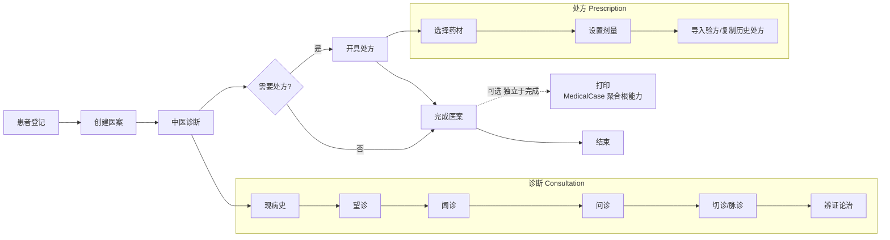
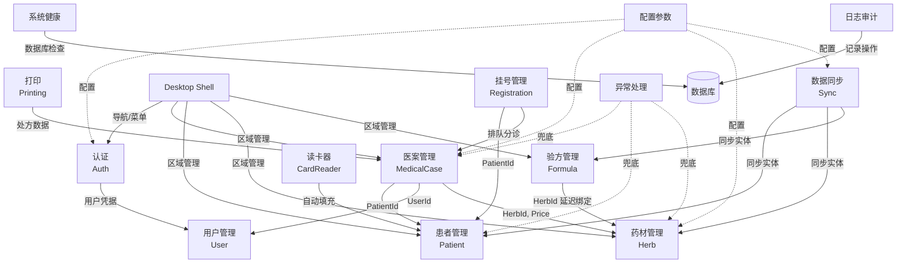

# 产品愿景与目标

## 概述

本文档定义凌隐宝堂中医诊所管理系统的产品愿景、业务目标和系统边界。

---

## 产品愿景

为中医诊所提供完整的数字化诊疗管理平台，实现从患者登记到处方开具的全流程电子化，同时保持中医诊疗的传统特色和工作习惯。

---

## 业务目标

1. **患者档案电子化** -- 建立完整的患者信息库，支持快速检索 (拼音码) 和历史诊疗记录回溯
2. **诊疗流程标准化** -- 覆盖望闻问切、辨证论治、开具处方的完整中医诊疗流程
3. **处方与验方规范化** -- 处方管理与经验方积累，支持验方复用、药材配伍管理
4. **药材库统一管理** -- 中药材的分类、价格、启用状态统一维护
5. **支持离线诊疗** -- 本地模式支持无网络环境下的完整诊疗，事后与服务端同步

---

## 核心业务流程

### 流程说明

| 步骤 | 操作 | 对应实体 |
|------|------|----------|
| 患者登记 | 创建或选择已有患者 | Patient |
| 创建医案 | 为患者创建新的诊疗记录 | MedicalCase (聚合根) |
| 中医诊断 | 填写望闻问切、辨证信息 | Consultation |
| 开具处方 | 选择药材、设置剂量，可导入验方或复制历史处方 | Prescription + PrescriptionItem |
| 完成医案 | 保存完整诊疗记录，锁定编辑 | MedicalCase 状态变更 |
| 打印 | 保存后提示打印，也可稍后从医案列表打印 (MedicalCase 聚合根能力) | MedicalCasePrintLog |

---

## 详细业务流程

> 详细的首诊、复诊、验方创建/使用、药材管理等端到端时序流程，请参阅 [clinical-workflow.md](clinical-workflow.md)。

---

## 模块依赖关系

### 模块依赖矩阵

### 依赖方向说明

| 依赖关系 | 类型 | 说明 |
|----------|------|------|
| MedicalCase -> Patient | 数据依赖 (外键) | 医案必须关联一个患者 (PatientId) |
| MedicalCase -> User | 数据依赖 (外键) | 医案必须关联创建医生 (UserId) |
| Prescription -> Herb | 数据依赖 (外键) | 处方项通过 HerbId 引用药材，记录当时价格 |
| Formula -> Herb | 延迟绑定 | 验方通过药材名称匹配，不存储外键 |
| Printing -> MedicalCase | 功能依赖 | 打印是 MedicalCase 聚合根能力，需读取医案+处方数据 |
| Sync -> Patient/Herb/Formula | 同步依赖 | v1.0 三种实体可同步 |
| Registration -> Patient | 数据依赖 (外键) | 挂号必须关联一个患者 (PatientId) |
| Registration -> MedicalCase | 功能依赖 | 挂号分诊后创建医案 |
| Auth -> User | 认证依赖 | 登录验证需要查询用户信息 |
| CardReader -> Patient | 功能集成 | 读取身份证自动填充患者信息 |

### 跨模块数据规则

| 规则 | 描述 | 实现方式 |
|------|------|---------|
| 患者引用保护 | 存在历史医案的患者不可删除 | 删除前检查 MedicalCase 引用 |
| 药材引用保护 | 被处方引用的药材不可删除，仅可禁用 | 删除前检查 PrescriptionItem 引用 |
| 药材价格快照 | 处方保存时记录当时药材价格 | PrescriptionItem 存储 UnitPrice 副本 |
| 禁用药材标记 | 历史处方中禁用药材标注"已禁用" | 展示时比对 Herb.IsEnabled 状态 |
| 聚合根事务 | MedicalCase + Consultation + Prescription 原子保存 | EF Core 事务 (SaveChangesAsync) |
| 验方延迟绑定 | 验方药材通过名称匹配而非外键 | 导入处方时按名称查找 HerbId |

---

## Desktop 端事件架构

Desktop 客户端使用 Prism IEventAggregator 实现模块间松耦合通信：

| 事件 | 载荷 | 触发场景 | 消费者 |
|------|------|---------|--------|
| ConsultationCompletedEvent | MedicalCaseId, ConsultationId, NeedsPrescription | 诊断填写完成 | 医案工作区 (切换到处方区) |
| PrescriptionCompletedEvent | PrescriptionId, TotalItems, TotalAmount, IsDraft | 处方保存完成 | 医案工作区 (更新状态) |
| WorkspaceChangedEvent | MedicalCaseFlowId, WorkspaceState | 工作区视图切换 | Shell (更新导航状态) |
| PatientCreatedEvent | PatientDetailDto | 新患者创建 | 患者列表 (刷新) |
| PatientUpdatedEvent | PatientDetailDto | 患者信息更新 | 患者详情/列表 (刷新) |
| PatientSelectedEvent | PatientSelectedPayload | 选择患者 | 医案模块 (加载患者医案) |
| TokenLifecycleStateChangedEvent | State (Active/Warning/Expired) | Token 状态变更 | Shell (显示超时警告/跳转登录) |
| LogoutCompletedEvent | LogoutCompletedPayload | 用户登出 | Shell (返回登录页) |

---

## 系统边界

### 系统包含

- 患者基本信息管理 (不含医保/费用结算)
- 中医诊断记录 (望闻问切、辨证)
- 中药处方管理 (药材选择、剂量设置)
- 经验方模板管理
- 中药材库管理
- 处方打印 (A5 模板)
- 本地/远程双模式运行
- 数据双向同步
- 基于角色的权限控制

### 系统不包含

- 西医诊断和处方
- 医保对接和费用结算
- 药房发药管理
- 库存进销存
- 排班和预约管理
- 电子病历 (EMR) 标准对接
- 移动端 (仅支持 Windows 桌面)

---

## 版本路线图

### v1.0 -- 核心诊疗流程 (当前)

**范围**: 15 个模块 / 138 个功能需求 (FR) + NFR 文档 + UI 交互规范

**核心功能**:
- 完整的中医诊疗流程 (患者登记 -> 创建医案 -> 诊断 -> 处方 -> 打印)
- 复诊流程 (复制历史处方到新医案)
- 四层角色权限体系 (SuperAdmin > Admin > Doctor > Receptionist)
- 本地/远程双模式运行 (SQL Server LocalDB / SQL Server)
- 基础数据同步 (药材/患者/验方，手动触发)
- 身份证读卡器集成 (HuaDaHD100，策略模式可扩展)
- JWT 认证 + AutoLoginToken + 重放攻击检测
- 结构化日志 + 安全审计 + 敏感数据脱敏
- 系统健康检查 + 运行时诊断

**模块清单**:
认证(13 FR) | 用户管理(12) | 患者管理(13) | 药材管理(13) | 验方管理(13) | 医案管理(18) | 挂号管理(7) | 数据同步(8) | 打印(4) | 身份证读卡器(2) | 系统健康与诊断(9) | 异常处理(8) | 日志与审计(7) | Desktop Shell(7) | 配置参数(4)

### v2.0 -- 扩展与集成 (规划中)

| 功能 | 来源 | 说明 |
|------|------|------|
| MedicalCase 数据同步 | FR-SYNC 决策#3 | 聚合根多表级联同步，需保证聚合完整性 |
| ~~PDF 处方导出~~ | ~~FR-PRINT 决策#1~~ | **Sprint 6 已实现** (QuestPDF 2025.4.0) |
| 自动同步提示 | FR-SYNC 决策#4 | NetworkStatusService + 状态栏指示器 |
| ~~诊所信息配置化~~ | ~~FR-PRINT 决策#2~~ | **Sprint 6 已实现** (clinic-settings.json + reloadOnChange 热更新) |
| User 数据同步 | FR-SYNC 决策#2 | User 实体加入同步范围 |
| LocalDB 字段级加密 | NFR-D03 | AES-256 + DPAPI 加密 IdCardNumber/PhoneNumber，基于 SQL Server LocalDB 实现 |

---

## 变更记录

| 日期 | 版本 | 变更内容 |
|------|------|----------|
| 2026-02-10 | v1.0 | 初始版本 |
| 2026-02-11 | v1.1 | 新增版本路线图 (v1.0 范围 + v2.0 规划) |
| 2026-02-17 | v2.0 | Round 2 深化: 新增详细业务流程 (首诊/复诊/验方/药材)、模块依赖矩阵、跨模块数据规则、Desktop 事件架构 |
| 2026-02-18 | v2.1 | PRD 全量闭环分析: FR 总数 120->131，模块清单计数同步更新 (PAT+1/MC+1/SYS+2/ERR+3/LOG+3/CFG+1) |
| 2026-03-09 | v2.2 | v2.0 路线图更新: PDF 处方导出 + 诊所信息配置化 已在 Sprint 6 提前实现; SQLite 字段级加密更新为 LocalDB 重新设计 |
| 2026-06-12 | v2.3 | 修正术语: SQLite → SQL Server LocalDB; 新增挂号管理模块 (7 FR) 补齐 FR 总数至 138; 移除详细时序图改为交叉引用 clinical-workflow.md |
