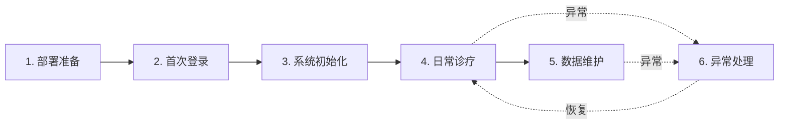

# 产品愿景与价值

> 版本: v2.0 | 日期: 2026-06-15 | 状态: 重建

## 产品愿景

凌隐宝堂中医诊所管理系统是一款为中医诊所量身定制的全流程数字化诊疗平台。系统以「医案」为核心聚合根，覆盖从患者登记、中医诊断、处方开具到打印输出的完整临床工作流。独创的双模式架构（远程 SQL Server + 本地 LocalDB）确保诊所无论在线或离线均可持续诊疗；中医专属的验方管理、药材配伍、辨证论治等功能，区别于通用诊所管理软件，真正贴合中医师的工作习惯与诊疗逻辑。

**一句话愿景**：让中医师把时间还给临床，让管理者把数据握在手中，让前台不再成为瓶颈。

---

## 问题定义

中医诊所在传统纸质流程下面临以下核心痛点：

| 痛点 | 现状描述 | 量化影响 |
|------|----------|----------|
| **病历检索低效** | 复诊患者纸质病历堆积如山，需翻找 5-10 分钟 | 日均 6-12 次复诊，每次浪费 5-10 分钟 |
| **手写处方易错** | 字迹潦草导致药房频繁电话确认药名剂量 | 日均 3-5 次确认电话，费用手算约 5% 错误率 |
| **经验方流失** | 个人验方散落于笔记或记忆中，人员离职即丢失 | 知识传承率为零 |
| **药材管理混乱** | 药材价格变动难以追溯，调价影响范围不明确 | 历史处方财务数据不可追溯 |
| **多角色协作断层** | 前台登记、医生诊疗信息不互通 | 候诊进度不可见，数据靠人工翻阅 |
| **断网即停摆** | 外出义诊或网络故障时无法工作 | 核心流程可用性受基础设施制约 |

本系统的目标是用数字化手段系统性消除上述痛点，同时保持中医诊疗的传统特色和工作习惯。

---

## 核心价值

### 医生 (Doctor) — 把时间还给临床

| 能力 | 价值 |
|------|------|
| **10 秒病史调取** | 按姓名/拼音码/手机号秒级检索，完整呈现患者全部历史医案（诊断 + 处方 + 费用） |
| **一键验方导入** | 从个人验方库一键导入经验方，自动填充药材和剂量，开方时间从 5-10 分钟缩短至 1-2 分钟 |
| **处方复制延续** | 复诊时一键复制上次处方，仅微调变更药材 |
| **自动计价** | 处方费用实时自动计算，消除手工算错风险 |
| **离线诊疗** | 本地模式支持断网环境下完整接诊（v1.0 数据孤立，同步属 v2.0） |

### 管理员 (Admin) — 数据安全可控

| 能力 | 价值 |
|------|------|
| **价格快照隔离** | 处方保存时锁定药材单价，后续调价不影响历史处方 |
| **批量药材管理** | Excel 批量导入调价，400+ 味药材从数天缩短至数小时 |
| **四级权限体系** | SuperAdmin / Admin / Doctor / Receptionist 角色精细管控，账号一键创建/禁用 |
| **操作审计日志** | 全系统关键操作留痕，满足合规与追溯需求 |

### 前台 (Receptionist) — 前台不再是瓶颈

| 能力 | 价值 |
|------|------|
| **3 秒身份证登记** | 读卡器集成，刷身份证自动填充基本信息 |
| **智能患者匹配** | 输入手机号或姓名自动检索，避免重复建档 |
| **候诊队列可视化** | 实时显示各医生接诊进度和候诊排队 |
| **一键挂号** | 老患者调出档案后一键创建就诊记录，全程 30 秒内 |

---

## 业务目标

| 编号 | 业务目标 | 成功指标 |
|------|----------|----------|
| GOAL-01 | **患者档案电子化** | 建立完整患者信息库，支持拼音码快速检索和历史回溯 |
| GOAL-02 | **诊疗流程标准化** | 覆盖望闻问切、辨证论治、开具处方的完整中医诊疗流程 |
| GOAL-03 | **处方与验方规范化** | 处方管理与经验方积累，支持验方复用与药材配伍管理 |
| GOAL-04 | **药材库统一管理** | 中药材分类、价格、启用状态统一维护 |
| GOAL-05 | **支持离线诊疗** | 本地模式支持无网络环境下的完整诊疗（v1.0 数据孤立，同步属 v2.0） |

**量化效率提升目标**：

| 环节 | 纸质流程 | 系统目标 | 提升 |
|------|---------|---------|------|
| 患者信息调阅 | 5-10 分钟 | < 10 秒 | 30-60 倍 |
| 复诊处方开具 | 10-15 分钟 | < 3 分钟 | 3-5 倍 |
| 费用计算 | 2-3 分钟（手算） | 即时自动 | 消除人工计算 |
| 处方打印 | 3-5 分钟（手写） | < 30 秒 | 6-10 倍 |
| **完整复诊流程** | **25-40 分钟** | **< 10 分钟** | **2.5-4 倍** |

---

## 核心场景

### 场景一：首诊全流程

**角色链**：前台接待（登记/挂号）→ 医生（诊疗）

**流程**：患者登记 → 挂号分诊 → 中医诊断 → 开具处方 → 保存打印

**关键价值点**：
- 身份证读卡 3 秒完成登记（消除手工填表瓶颈）
- 望闻问切、辨证论治结构化录入（替代手写 3-5 分钟）
- 药材搜索 + 验方导入，费用自动计算（开方 < 3 分钟，零计算错误）
- A5 处方规范打印（药房不再来电确认）

### 场景二：复诊高效流程

**角色**：医生

**流程**：搜索患者 → 历史回顾 → 本次诊断 → 处方延续 → 保存打印

**关键价值点**：
- 拼音码/手机号 10 秒检索患者全部历史医案
- 一键复制上次处方，仅微调变更药材
- 复诊处方从手写 10-15 分钟降至 < 3 分钟
- 日均 6-12 次复诊，每日节省 1-2 小时

### 场景三：外出义诊（离线模式）

**角色**：医生

**流程**：切换本地模式 → 完整接诊 → 网络恢复（v1.0 数据孤立，手动补录或可丢；同步属 v2.0）

**关键价值点**：
- 本地 LocalDB 支持断网环境下完整诊疗流程（含患者查询、医案创建、处方开具）
- v1.0 远程/本地数据孤立（N1 决策）；同步工作流（Checksum 差异检测、逐项解决）属 v2.0
- 义诊不再受网络限制，核心流程 100% 可用

---

## 系统边界

### v1.0 范围（当前版本）

系统包含以下 9 个模块、共 136 个用户故事（US）：

| 模块 | US 数 | 核心能力 |
|------|-------|---------|
| 认证与会话 (Auth) | 13 | JWT 认证、令牌刷新、重放攻击防护、本地简化认证 |
| 用户管理 (Users) | 12 | 四级角色、IDOR 防护、批量操作 |
| 患者管理 (Patients) | 13 | 拼音检索、敏感数据脱敏、身份证读卡集成 |
| 药材管理 (Herbs) | 13 | 记录式管理、拼音搜索、Excel 批量导入 |
| 验方管理 (Formulas) | 13 | Draft↔Validated 状态机、药材延迟绑定 |
| 医案管理 (MedicalCases) | 18 | 核心聚合根、CQRS、BR-001 单活动医案、打印保护 |
| 挂号管理 (Registration) | 7 | 候诊队列、QuickVisit 原子事务、医案联动 |
| 处方打印 (Printing) | 4 | A5/A4 模板、QuestPDF 导出、打印回写 |
| 平台基础设施 (Platform) | 43 | Shell/Config/Error/Logging/Health/CardReader（含 SHELL-010~019 中 v1.0 的 8 项） |

详细需求见 [`02-requirements/01-prd.md`](../02-requirements/01-prd.md) 及各模块文档。

### 范围外（系统边界之外，线下流程）

系统边界止于**打印处方笺**。以下属于线下流程，**不在系统范围内**：

- **收费 / 付费**：患者持打印的处方笺线下缴费；
- **发药**：由诊所药房线下完成；
- **库存管理**：药材进销存为独立业务域，不纳入本系统。

金额把控与业务异常发现由 **A7 报表（v1.0）** 承担；关键操作变更追溯由 **D1 审计日志（v1.0 补回）** 保障。

### v2.0 规划（不在当前版本）

以下功能明确推迟到 v2.0，当前版本不实现：

- **数据同步（Sync 整模块）**：v1.0 远程库与本地库数据孤立不互通（N1 决策）；5 阶段同步工作流、Checksum 冲突检测、逐项解决均延至 v2.0
- **医案/用户数据同步**：聚合根多表级联同步，需保证聚合完整性
- **自动同步提示**：NetworkStatusService + 状态栏指示器
- **用户数据同步**：User 实体加入同步范围
- **LocalDB 字段级加密**：AES-256 + DPAPI 加密敏感字段

### 永不在范围内

| 功能 | 原因 |
|------|------|
| 西医诊断和处方 | 产品定位为中医诊所专用 |
| 医保对接和费用结算 | 涉及第三方接口，复杂度高 |
| 药房发药管理 | 超出诊疗流程范围 |
| 库存进销存 | 独立业务域，后续版本考虑 |
| 排班和预约管理 | 小型诊所需求不强烈 |
| 移动端（iOS/Android） | 仅支持 Windows 桌面端 |

---

## 客户旅程

凌隐宝堂为 on-premise WPF Desktop 应用（非 SaaS），客户旅程围绕「本地部署 + 初始化 + 日常使用」展开。

| 阶段 | 时长 | 主要角色 | 关键触点 |
|------|------|---------|---------|
| 1. 部署准备 | 2-4 小时 | SuperAdmin / Admin | 安装 .NET 8、SQL Server、数据库迁移、外设连接 |
| 2. 首次登录 | 10 分钟 | Admin | SuperAdmin 创建 Admin 账号、首次登录 |
| 3. 系统初始化 | 1-2 天 | Admin + Doctor | 用户账号、药材库 Excel 导入、验方录入 |
| 4. 日常诊疗 | 持续循环 | Doctor + Receptionist | 患者登记→诊断→处方→打印 |
| 5. 数据维护 | 周期性 | Admin | 价格更新、业务数据维护 |
| 6. 异常处理 | 不定时 | 全部 | 断网切换、并发冲突、打印故障 |

### 关键时刻 (Moments of Truth)

| 时刻 | 成功回报 | 失败后果 |
|------|---------|---------|
| **验方一键导入** | 接诊效率提升 50%+，习惯养成 | 退回手工输入，系统价值大幅降低 |
| **复诊历史秒查** | 复诊准备从 5 分钟降至 10 秒 | 退回翻纸质病历 |
| **处方笺打印质量** | 医患信任度提升 | 打印格式不专业 → 信任崩塌 |
| **断网无感切换** | 业务连续性保障 | 接诊中断，患者等待 |

### 情绪低谷与高峰

情绪低谷集中在**系统初始化**（药材录入量大）和**异常处理**阶段；情绪高峰出现在**日常诊疗**中的验方导入和复诊查询。系统设计应重点优化低谷阶段的体验（如提供标准药材库 Excel 模板、断网自动切换本地模式）。

> 详细用户画像见 [`02-personas.md`](02-personas.md)。
