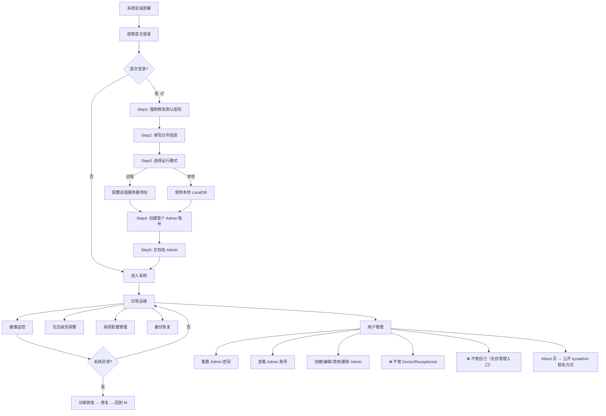
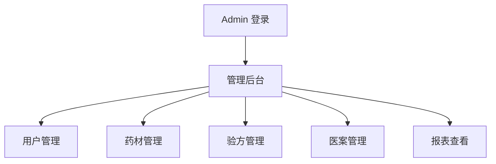
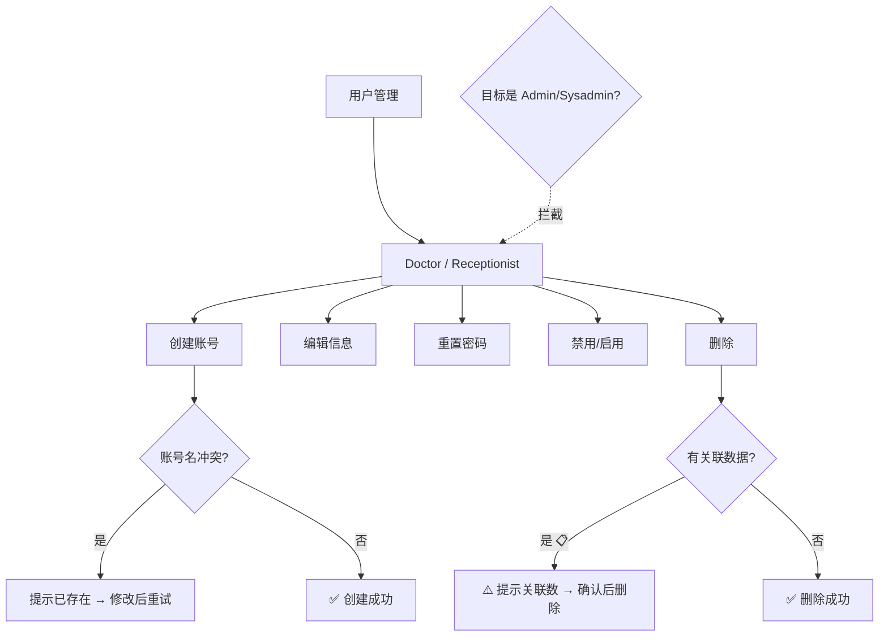
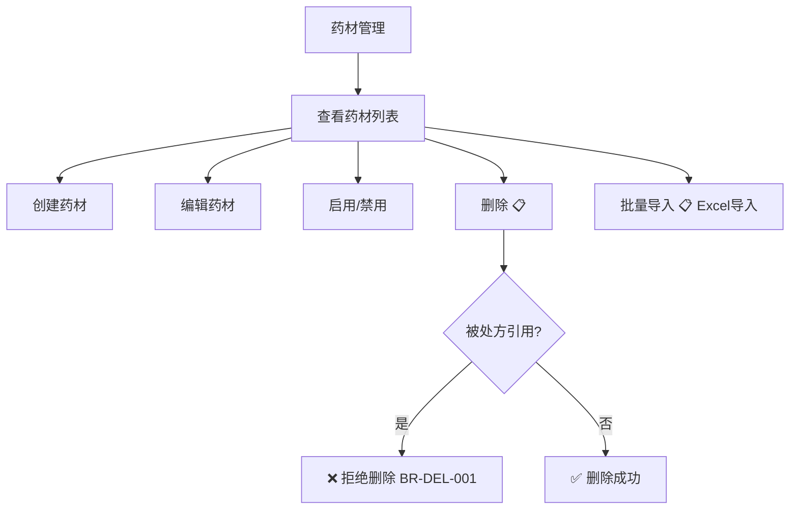
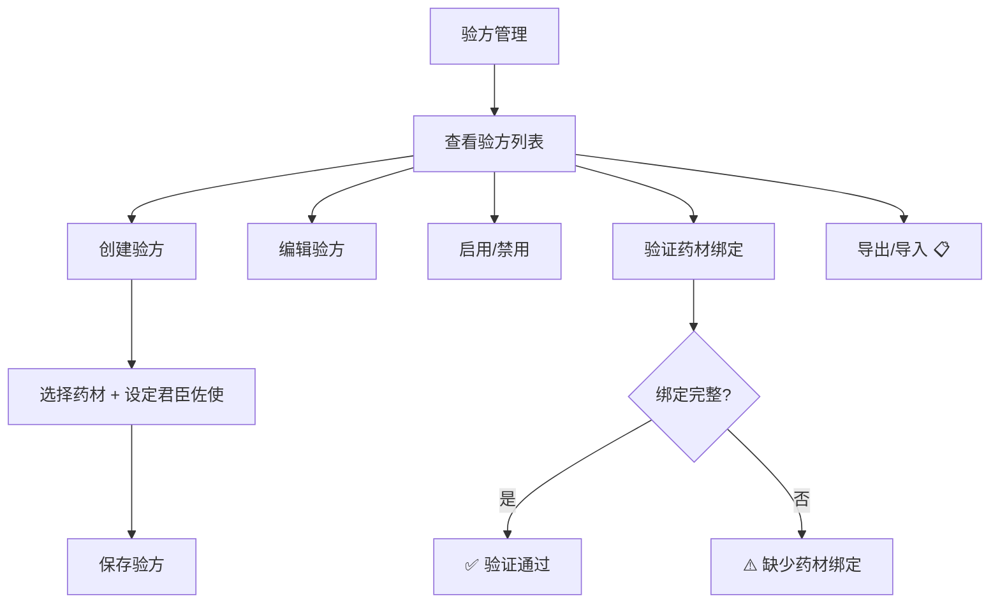
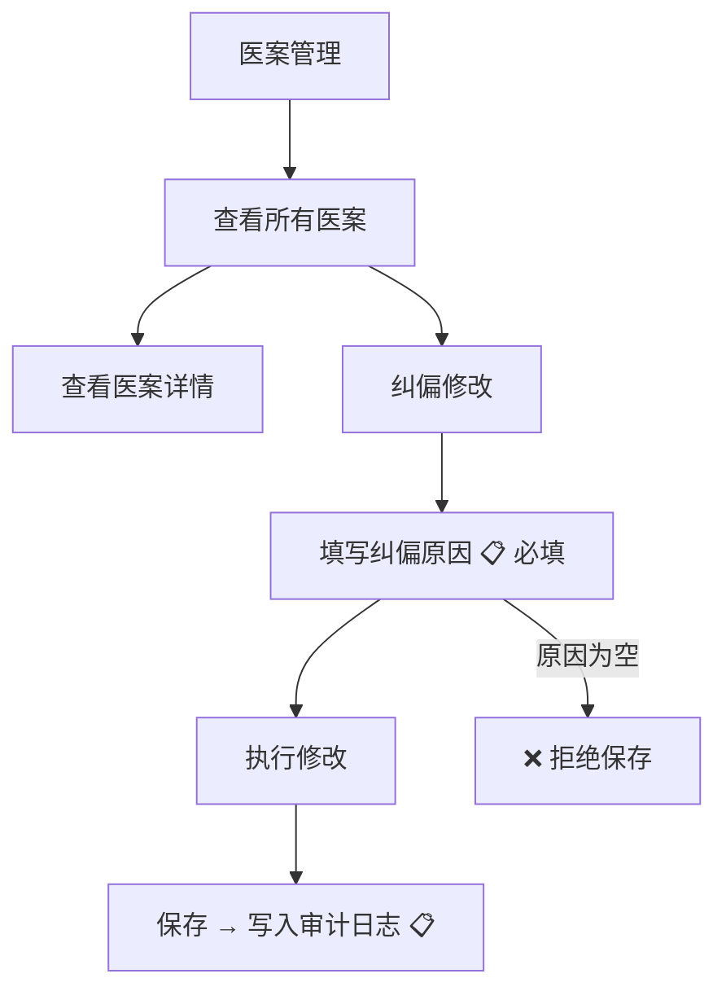
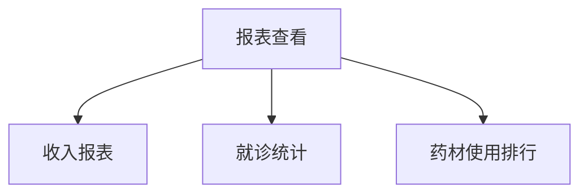
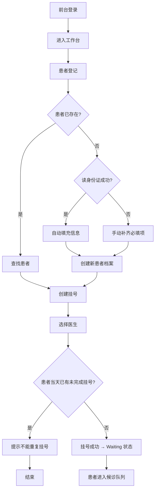
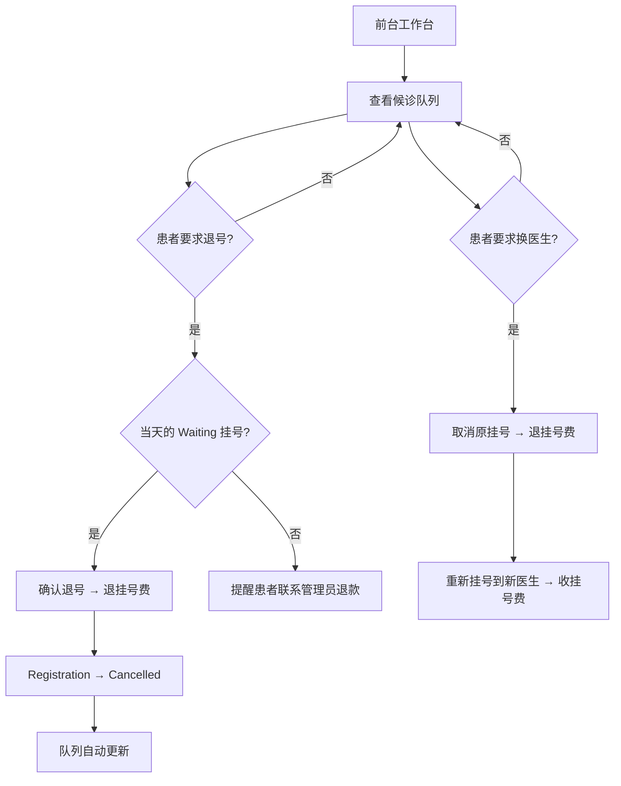

# 用户画像 (Personas)

> 版本: v4.0 | 日期: 2026-08-02 | 状态: 文档定义（设计态）

本文件定义凌隐宝堂中医诊所管理系统的四个核心角色及其工作流程。


> 权限矩阵与修复项详见 [04-permissions.md](04-permissions.md)。
> 角色交接与协同流程详见 [05-role-interactions.md](05-role-interactions.md)。

---

## 角色一：Sysadmin（系统运维 — 独立用户）

> **身份：独立用户（非角色）** | 授权：系统运维 | 使用频率低

### 定位

**sysadmin 不是一个角色，而是一个独立的系统用户。** 安装时自动创建，不可删除，独立于角色体系。负责系统全生命周期管理：部署→初始化→日常运维→安全→备份恢复→升级。

> **设计原则**：sysadmin 所有基础配置都有 UI 界面，不靠手动改 JSON。

### 核心职责

| 阶段 | 职责 |
|------|------|
| **部署** | Desktop 安装（Velopack）、WebAPI 服务器部署 |
| **初始化** | 5 步向导：改密→诊所信息→模式选择→创建首个 admin→交权 |
| **日常运维** | 系统健康监控、配置管理、日志级别/调试模式、用户管理支持 |
| **数据维护** | 数据库备份/恢复、备份状态查看、日志清理 |
| **安全管理** | 安全审计日志查看、sysadmin 不可删/禁/改保护 |
| **升级** | Desktop 自动更新（Velopack）、WebAPI 手动升级 |

### 操作流程图



### 约束

- **层级管理**：sysadmin **仅管理 Admin**，不管理 Doctor/Receptionist（由 Admin 管理）
- **不可自管**：sysadmin 无自管理入口，不可删除/禁用自己。密码遗忘使用**离线密码重置工具**（使用系统加密算法直接更新数据库）
- **不可混淆**：sysadmin 是独立用户（`IsSysAdmin=true`）；admin 是业务管理员角色用户
- **About 页公开**：sysadmin 联系方式在 About 页公开，Admin 无需进入用户管理即可联系
- **首登强制改密**：`ForceChangeOnFirstLogin=true`，sysadmin 首次登录后必须修改默认密码

### 双模式配置管理（ADR-0014）

| 模式 | 管理范围 | 面板布局 |
|------|---------|----------|
| **远程** | 服务端配置（WebAPI/SQL Server/公网）+ 客户端配置（Desktop） | ① 客户端配置（本机 7 组） ② 服务端配置（调 Configuration API） |
| **本地** | 本地全栈（LocalWebAPI + LocalDB + Desktop） | ① 本地配置（全栈） ② 备份恢复（US-SHELL-013） |

### 默认用户

| 用户 | 用户名 | 默认密码 | 角色 | IsSysAdmin | 可删除 |
|------|--------|---------|------|-----------|--------|
| 业务管理员 | `admin` | `Admin@123456` | Admin | **false** | ✅ |
| 系统运维 | `sysadmin` | `SysAdmin@2026!` | SuperAdmin | **true** | ❌ |

> ⚠️ admin 和 sysadmin 是**两个独立用户**，不可混淆。sysadmin 是信任根——创建第一个 admin，可重置 admin 密码。

---

## 角色二：Admin（业务管理员）

> **PermissionLevel = 10** | 授权策略：`DoctorOrReceptionist` + `AdminOrSuperAdmin`

### 定位

负责中医诊所业务管理的管理员。主要工作是维护业务基础数据、管理用户账号、管理药材/验方、数据维护。日均使用 1-2h。

**核心身份**：Admin 既不是纯粹的 IT 运维（那是 sysadmin），也不是业务操作者（那是 Doctor/Receptionist）。Admin 是**运营管理者**——为业务运行准备基础设施，同时在异常场景下兜底介入。

### 操作流程图

#### 总览：管理后台



> 以下每个管理模块独立展开。

#### 用户管理



#### 药材管理



#### 验方管理



#### 医案管理



#### 报表查看



### 权限边界

> Admin 权限详见 [04-permissions.md](04-permissions.md)。

---

## 角色三：Doctor（中医医生）

> **PermissionLevel = 1** | 授权策略：`DoctorOrReceptionist`

### 定位

中医内科主治医师，系统核心业务操作者——**唯一能创建医案的角色**，承担从诊断到开方到打印的完整临床链路。日均使用 6-8h，触及全部 6 个业务模块。

> **双模式工作流**：
> 1. **连接模式选择**（登录前）：远程 → 登录远程 WebAPI；本地 → 使用内嵌 LocalAPI
> 2. **远程模式**：查看待诊队列→从队列选患者→StartVisit（**接诊即建**：原子创建 MedicalCase(Active)+Registration(InProgress)，2026-08-03 决策）→看诊；急诊可用 QuickVisit 跳过排队直接接诊
> 3. **本地模式**：**直接看诊**——「来一个看一个」，选/建患者→系统自动创建 Registration(Source=Doctor, InProgress)+MedicalCase(Active)→看诊→打印，无队列、无 SignalR。医生无感，Registration 由系统自动创建以保持数据模型统一

### 操作流程图

#### 主线流程：标准看诊（单页表单）

```mermaid
flowchart TD
    A[医生打开 Desktop] --> B{选择连接模式}

    subgraph Remote["远程模式（SQL Server）"]
        C[登录远程 WebAPI] --> C1[查看待诊队列]
        C1 --> H{选择患者}
        H -->|从队列选| I[StartVisit → 原子创建\nMedicalCase(Active) + Registration(InProgress)]
        H -->|急诊/跳过排队| J[QuickVisit → 原子创建\nRegistration(InProgress) + MedicalCase(Active)]
        I --> K1[进入诊疗表单]
        J --> K1
        K1 --> L1R[填写诊断：主诉/现病史/舌诊/脉诊/辨证]
        K1 --> L2R[是否开方 Toggle，默认关闭]
        L2R -->|开启| L3R[处方区域：手选药材 / 导入验方]
        L2R -->|关闭| L4R[跳过处方]
        L1R & L3R & L4R --> MR{点击完成医案}
        MR -->|有处方| NR[保存 → 完成]
        MR -->|无处方| OR{确认弹窗：该医案未开处方}
        OR -->|确认跳过| PR[标记未开方 → 完成]
        OR -->|取消回去| L2R
        NR --> QR[打印处方（可选）]
        PR --> RR[结束]
        QR --> RR
    end

    subgraph Local["本地模式（LocalDB） 📋"]
        D[使用内嵌 LocalAPI] --> G[直接选/建患者]
        G --> G1[系统自动创建 Registration(InProgress)\n+ MedicalCase(Active) 原子创建]
        G1 --> K2[进入诊疗表单]
        K2 --> L1L[填写诊断：主诉/现病史/舌诊/脉诊/辨证]
        K2 --> L2L[是否开方 Toggle，默认关闭]
        L2L -->|开启| L3L[处方区域：手选药材 / 导入验方]
        L2L -->|关闭| L4L[跳过处方]
        L1L & L3L & L4L --> ML{点击完成医案}
        ML -->|有处方| NL[保存 → 完成]
        ML -->|无处方| OL{确认弹窗：该医案未开处方}
        OL -->|确认跳过| PL[标记未开方 → 完成]
        OL -->|取消回去| L2L
        NL --> QL[打印处方（可选）]
        PL --> RL[结束]
        QL --> RL
    end

    B -->|远程| C
    B -->|本地| D
```

#### 异常场景处理

> 异常场景处理矩阵（打印失败、中途离开、患者拒绝处方、处方开错药、复诊流程）详见 [05-role-interactions.md §三、异常场景处理矩阵](05-role-interactions.md#三异常场景处理矩阵)。

### 权限边界

> Doctor 权限详见 [04-permissions.md](04-permissions.md)。

### 诊疗表单 UI 设计（单页表单）

```
┌─────────────────────────────────────────────┐
│ 诊疗表单                                      │
│                                               │
│ ── 诊断区域 ──                                 │
│ 主诉: [________________]                      │
│ 现病史: [________________]                    │
│ 舌诊: [________________]                      │
│ 脉诊: [________________]                      │
│ 辨证: [________________]                      │
│                                               │
│ ── 处方区域 ──                                 │
│ ☐ 是否开方 [Toggle: 默认关闭]                  │
│                                               │
│ [Toggle 开启时显示]                            │
│ ┌─ 处方来源 ─────────────────────────────┐    │
│ │ ○ 手动添加  ○ 导入验方                   │    │
│ ├───────────────────────────────────────-─┤    │
│ │ 药材名称 | 剂量(g) | 煎法 | 君臣佐使    │    │
│ │ xxx      | 10     | 先煎 | 君          │    │
│ │ [添加药材]                              │    │
│ └────────────────────────────────────────┘    │
│                                               │
│ ── 操作 ──                                     │
│ [打印处方]  [保存草稿]  [完成医案]              │
└─────────────────────────────────────────────┘
```

**交互说明**：
- **Toggle 默认关闭**：大部分字段可先填诊断，再决定是否开方
- **完成时校验**：若 Toggle 关闭，弹出确认「该医案未开处方，是否确认完成？」
- **打印可选**：打印和完成是独立操作，可只保存不打印
- **处方来源**：手动添加（从药材库选药 + 剂量 + 煎法）或导入验方（选择验方自动填充）

---

## 角色四：Receptionist（前台）

> **PermissionLevel = 0** | 授权策略：`DoctorOrReceptionist`

### 定位

前台接待人员，专注患者挂号和相关信息维护。日均使用 4-6h，是诊所每天第一个开机、最后关机的角色。

> **双模式适用性**：本地模式**不使用前台账号**，医生直接从患者库查询或新建患者，系统自动创建 Registration（Source=Doctor, Status=InProgress）。远程模式下前台登录即见 Registration 模块。

### 操作流程图

#### 主线流程：挂号登记



#### 日常管理流程



### 患者查找方式

| 方式 | 说明 |
|------|------|
| **手动查询** | 多字段模糊查找（姓名、拼音码、手机号、身份证等） |
| **身份证读卡** | 读卡器主动推送，自动填充患者信息 |

### 新建患者流程

1. 打开新建患者界面
2. 用身份证一扫，读出来的信息快速自动填充（姓名、身份证号、性别、出生日期、家庭住址）
3. 没有的必填项手动补齐（联系号码）
4. 保存患者档案

### 候诊队列显示信息

| 字段 | 说明 |
|------|------|
| 挂号号码 | 挂号单上的排队号码 |
| 姓名 | 患者姓名 |
| 手机尾号 | 手机号后4位（隐私保护） |

### 挂号费规则

| 场景 | 操作人 | 挂号费处理 |
|------|--------|------------|
| 当天退号（Waiting） | 前台 | 直接退费（按医生挂号费） |
| 非当天退号（Waiting） | 管理员 | 退款（需审核） |
| 换医生 | 前台 | 先退原挂号费，再收新挂号费 |

### 前台首页设计

**多入口模式**：

| 入口 | 功能 | 跳转页面 |
|------|------|----------|
| **挂号** | 患者登记、创建挂号 | 挂号页面（查询患者→选医生→确认挂号） |
| **退号** | 取消挂号 | 退号页面（查询挂号→确认退号） |
| **候诊队列** | 查看当前排队 | 队列页面（显示所有 Waiting 挂号） |

**今日统计**：显示在首页底部，实时更新（挂号数、退号数、排队数）

### 权限边界

> Receptionist 权限详见 [04-permissions.md](04-permissions.md)。

---

## 架构层差异汇总

| 维度 | Sysadmin | Admin | Doctor | Receptionist |
|------|----------|-------|--------|-------------|
| **身份类型** | **独立用户** | 角色 | 角色 | 角色 |
| **模块数** | 5（全量） | 5 | **6** | **3** |
| **包含 RegistrationModule** | ❌ | ✅ 只读 | ✅ | ✅ |
| **包含 CatalogModule** | ✅ | ✅ | ✅ | ❌ |
| **包含 CatalogModule** | ✅ | ✅ | ✅ | ❌ |
| **包含 MedicalCaseModule** | ✅ | ✅ | ✅ | ❌ |
| **首页视图** | SysadminHome | AdminHome | ClinicalWorkspace | ReceptionistHome |
| **可删除** | ❌ | ✅ | ✅ | ✅ |
| **可禁用** | ❌ | ✅ | ✅ | ✅ |

---

## 变更日志

| 日期 | 变更 |
|------|------|
| 2026-08-03 | v4.4 医生异常场景更新（医案专题）：E2 挂起三选一（不自动保存 MC-D18）；E4 仅 Completed 可打印→Admin 纠偏+审计 |
| 2026-08-03 | v4.3 权限边界更新（四角色需求审查）：Admin 挂号只读查看 + 打印记录查看；Doctor/Receptionist 患者删除/禁用 ❌；前台不涉及药材/验方（决策确认） |
| 2026-08-03 | v4.2 医生工作流更新：「接诊即建」决策——StartVisit/QuickVisit/本地模式原子创建 MedicalCase(Active)+Registration(InProgress) |
| 2026-08-02 | v4.1 用户管理层级模型：Sysadmin→Admin→Doctor/Receptionist 层级管理；不可自管；角色不可变更；sysadmin 密码离线重置工具；About 页公开 sysadmin 联系方式 |
| 2026-06-28 | 四角色全面重写 + 交叉对比 + 二轮设计验证 |
| 2026-06-20 | v3.2 Sysadmin 改为独立用户设计 |
| 2026-06-20 | v3.1 增加代码实现列 |
| 2026-06-15 | v2.0 重建 |
