# 用户画像 (Personas)

> 版本: v4.0 | 日期: 2026-08-02 | 状态: 文档定义（设计态）

本文件定义凌隐宝堂中医诊所管理系统的四个核心角色及其工作流程。

**图例**：✅ 已实现 | 📋 已设计未实现 | 🔴 未实现/缺失

> 权限矩阵与修复项详见 [04-permissions.md](04-permissions.md)。
> 角色交接与协同流程详见 [05-role-interactions.md](05-role-interactions.md)。

---

## 角色一：Sysadmin（系统运维 — 独立用户）

> **身份：独立用户（非角色）** | 授权：系统运维 | 使用频率低

### 定位

**sysadmin 不是一个角色，而是一个独立的系统用户。** 安装时自动创建，不可删除，独立于角色体系。负责系统全生命周期管理：部署→初始化→日常运维→安全→备份恢复→升级。

> **设计原则**：sysadmin 所有基础配置都有 UI 界面，不靠手动改 JSON。

### 核心职责

| 阶段 | 职责 | 实现状态 |
|------|------|----------|
| **部署** | Desktop 安装（Velopack）、WebAPI 服务器部署 | 📋 已设计 |
| **初始化** | 5 步向导：改密→诊所信息→模式选择→创建首个 admin→交权 | 📋 已设计（当前仅连接配置，向导待扩展） |
| **日常运维** | 系统健康监控、配置管理、日志级别/调试模式、用户管理支持 | ✅ API 齐备（Health/Diagnostics/Configuration） |
| **数据维护** | 数据库备份/恢复、备份状态查看、日志清理 | ⚠️ 备份有、恢复 UI 待开发 |
| **安全管理** | 安全审计日志查看、sysadmin 不可删/禁/改保护 | ⚠️ 审计日志待补回 |
| **升级** | Desktop 自动更新（Velopack）、WebAPI 手动升级 | 📋 已设计 |

### 操作流程图

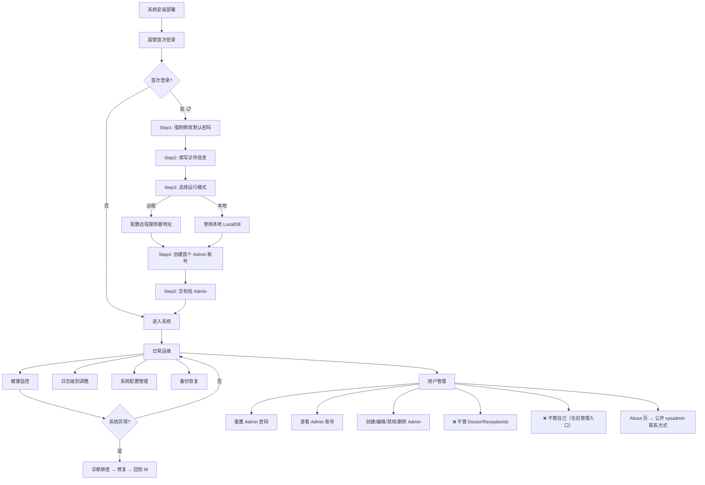

### 约束

- **层级管理**：sysadmin **仅管理 Admin**，不管理 Doctor/Receptionist（由 Admin 管理）
- **不可自管**：sysadmin 无自管理入口，不可删除/禁用自己。密码遗忘使用**离线密码重置工具**（使用系统加密算法直接更新数据库）
- **不可混淆**：sysadmin 是独立用户（`IsSysAdmin=true`）；admin 是业务管理员角色用户
- **About 页公开**：sysadmin 联系方式在 About 页公开，Admin 无需进入用户管理即可联系
- **首登强制改密**：`ForceChangeOnFirstLogin=true`，sysadmin 首次登录后必须修改默认密码

### 双模式配置管理（ADR-0014）

| 模式 | 管理范围 | 面板布局 |
|------|---------|----------|
| **远程** | 服务端配置（WebAPI/SQL Server/公网）+ 客户端配置（Desktop） | ① 客户端配置（本机 7 组） ② 服务端配置（调 Configuration API） |
| **本地** | 本地全栈（LocalWebAPI + LocalDB + Desktop） | ① 本地配置（全栈） ② 备份恢复（US-SHELL-013） |

### 默认用户

| 用户 | 用户名 | 默认密码 | 角色 | IsSysAdmin | 可删除 |
|------|--------|---------|------|-----------|--------|
| 业务管理员 | `admin` | `Admin@123456` | Admin | **false** | ✅ |
| 系统运维 | `sysadmin` | `SysAdmin@2026!` | SuperAdmin | **true** | ❌ |

> ⚠️ admin 和 sysadmin 是**两个独立用户**，不可混淆。sysadmin 是信任根——创建第一个 admin，可重置 admin 密码。

---

## 角色二：Admin（业务管理员）

> **PermissionLevel = 10** | 授权策略：`DoctorOrReceptionist` + `AdminOrSuperAdmin`

### 定位

负责中医诊所业务管理的管理员。主要工作是维护业务基础数据、管理用户账号、管理药材/验方、数据维护。日均使用 1-2h。

**核心身份**：Admin 既不是纯粹的 IT 运维（那是 sysadmin），也不是业务操作者（那是 Doctor/Receptionist）。Admin 是**运营管理者**——为业务运行准备基础设施，同时在异常场景下兜底介入。

### 操作流程图

#### 总览：管理后台

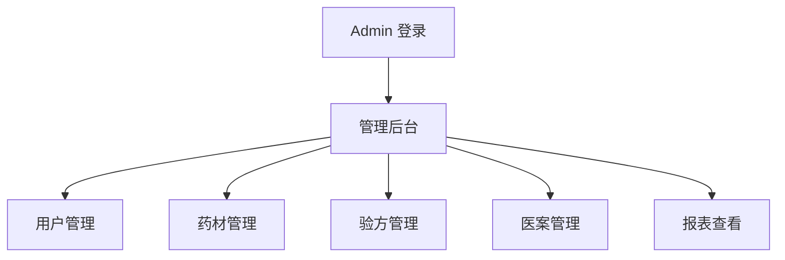

> 以下每个管理模块独立展开。

#### 用户管理

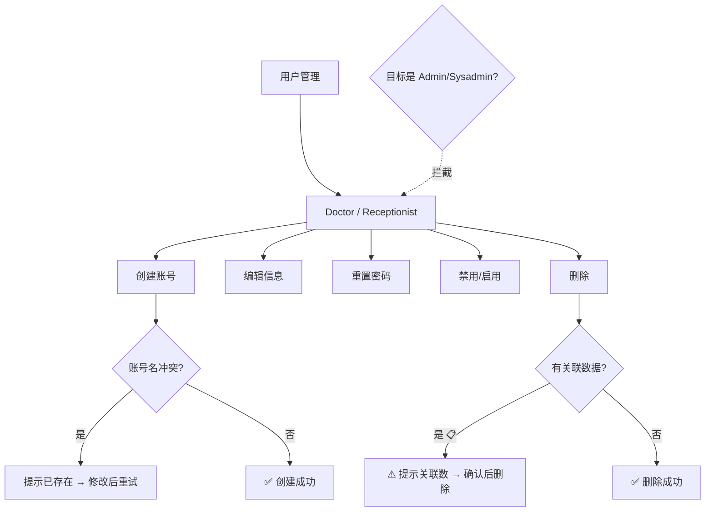

#### 药材管理

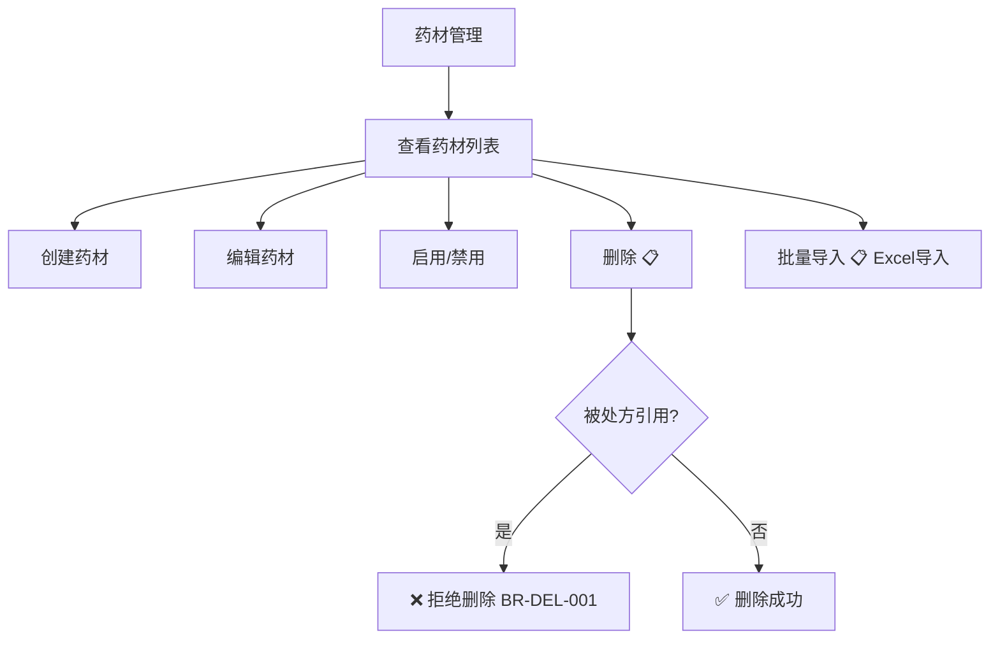

#### 验方管理

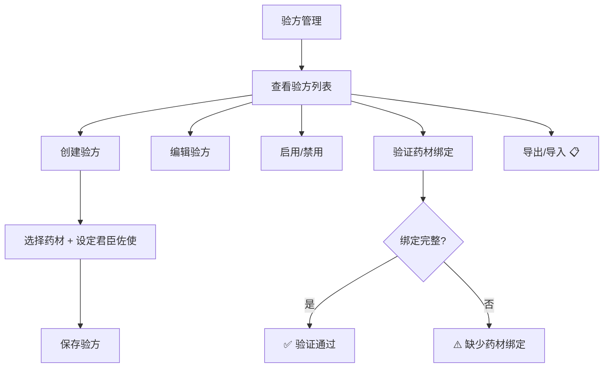

#### 医案管理

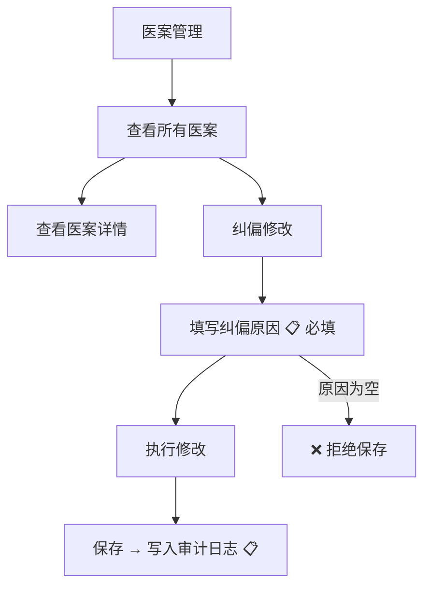

#### 报表查看

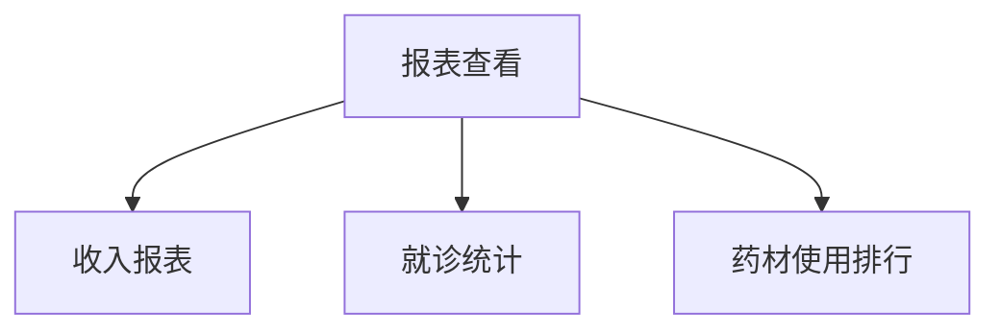

### 权限边界

| 能力 | Admin | 说明 |
|------|:-----:|------|
| 用户 CRUD | ✅（仅 Doctor/Receptionist） | 不可管理 Admin/Sysadmin |
| 重置密码 | ✅（仅 Doctor/Receptionist） | Sysadmin 重置 Admin 密码 |
| 禁用/启用/删除 | ✅（仅 Doctor/Receptionist） | Sysadmin 操作 Admin 的禁用/删除 |
| 药材 CRUD | ✅ 全部 | Admin 统一管库，Doctor 不直接操作药材 |
| 验方 CRUD | ✅ 全部 | |
| 医案创建 | ❌ | 仅 Doctor |
| 医案查看 | ✅ 全部 | |
| 医案纠偏修改 | ✅（需填原因） | 纠偏场景：医生/前台出错时 Admin 介入 |
| 挂号 | ❌ | 不参与 |
| 打印 | ❌ | 仅 Doctor |
| 报表 | ✅ | |

---

## 角色三：Doctor（中医医生）

> **PermissionLevel = 1** | 授权策略：`DoctorOrReceptionist`

### 定位

中医内科主治医师，系统核心业务操作者——**唯一能创建医案的角色**，承担从诊断到开方到打印的完整临床链路。日均使用 6-8h，触及全部 6 个业务模块。

> **双模式工作流**：
> 1. **连接模式选择**（登录前）：远程 → 登录远程 WebAPI；本地 → 使用内嵌 LocalAPI
> 2. **远程模式**：查看待诊队列→从队列选患者→StartVisit→看诊；急诊可用 QuickVisit 跳过排队直接接诊
> 3. **本地模式**：**直接看诊**——「来一个看一个」，选/建患者→系统自动创建 Registration(Source=Doctor)→开医案→看诊→打印，无队列、无 SignalR。医生无感，Registration 由系统自动创建以保持数据模型统一

### 操作流程图

#### 主线流程：标准看诊（单页表单）

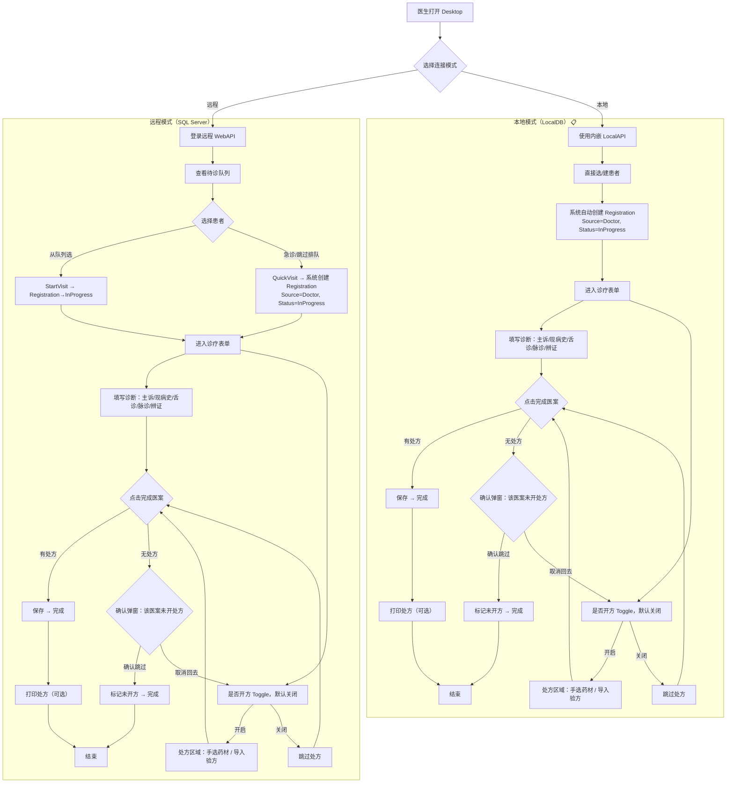

#### 异常场景处理

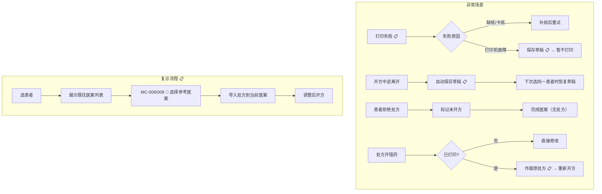

### 权限边界（Doctor 独有）

| 能力 | Doctor | 说明 |
|------|:------:|------|
| 医案创建 | ✅ **唯一** | 仅 Doctor 能创建医案 |
| 医案编辑 | ✅ 仅自己的 | |
| 处方打印 | ✅ **唯一** | |
| 历史查看 | ✅ 自己所有医案 | |
| 药材查询 | ✅ | |
| 药材写操作 | ❌ | Admin 统一管库 |
| 验方查询 | ✅ 自己 + 共享 | |
| 验方写操作 | ✅ 仅自己创建 | |
| QuickVisit | ✅ 急诊 + 本地常规 | |
| 用户管理 | ❌ | |

### 诊疗表单 UI 设计（单页表单）

```
┌─────────────────────────────────────────────┐
│ 诊疗表单                                      │
│                                               │
│ ── 诊断区域 ──                                 │
│ 主诉: [________________]                      │
│ 现病史: [________________]                    │
│ 舌诊: [________________]                      │
│ 脉诊: [________________]                      │
│ 辨证: [________________]                      │
│                                               │
│ ── 处方区域 ──                                 │
│ ☐ 是否开方 [Toggle: 默认关闭]                  │
│                                               │
│ [Toggle 开启时显示]                            │
│ ┌─ 处方来源 ─────────────────────────────┐    │
│ │ ○ 手动添加  ○ 导入验方                   │    │
│ ├───────────────────────────────────────-─┤    │
│ │ 药材名称 | 剂量(g) | 煎法 | 君臣佐使    │    │
│ │ xxx      | 10     | 先煎 | 君          │    │
│ │ [添加药材]                              │    │
│ └────────────────────────────────────────┘    │
│                                               │
│ ── 操作 ──                                     │
│ [打印处方]  [保存草稿]  [完成医案]              │
└─────────────────────────────────────────────┘
```

**交互说明**：
- **Toggle 默认关闭**：大部分字段可先填诊断，再决定是否开方
- **完成时校验**：若 Toggle 关闭，弹出确认「该医案未开处方，是否确认完成？」
- **打印可选**：打印和完成是独立操作，可只保存不打印
- **处方来源**：手动添加（从药材库选药 + 剂量 + 煎法）或导入验方（选择验方自动填充）

---

## 角色四：Receptionist（前台）

> **PermissionLevel = 0** | 授权策略：`DoctorOrReceptionist`

### 定位

前台接待人员，专注患者挂号和相关信息维护。日均使用 4-6h，是诊所每天第一个开机、最后关机的角色。

> **双模式适用性**：本地模式**由用户配置决定，不强制排除**任何角色。默认无前台用户时，医生独立「来一个看一个」；若 Admin 建了前台用户，则前台登录即见 Registration 模块。

### 操作流程图

#### 主线流程：挂号登记

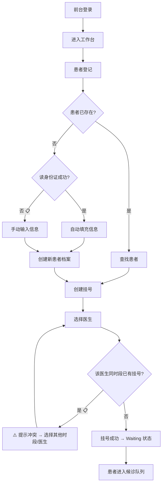

#### 日常管理流程

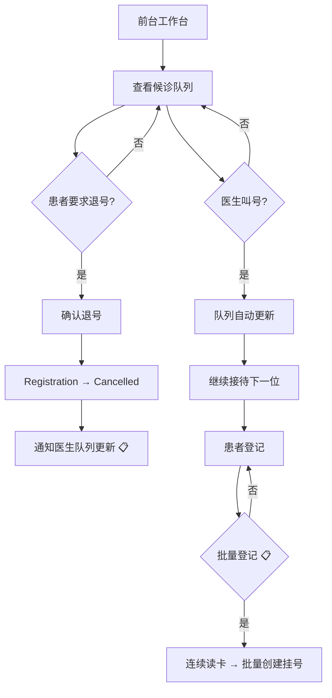

### 权限边界

| 能力 | Receptionist | 说明 |
|------|:-----------:|------|
| 挂号创建/取消 | ✅ | 核心职能 |
| 患者 CRUD | ✅ | 登记、查找、编辑 |
| 读卡登记 | ✅ | 身份证读卡 + 自动填充 |
| 药材查询 | ❌ | 前台不涉及药材 |
| 验方/医案 | ❌ | |
| 用户管理 | ❌ | |
| 打印 | ❌ | |

---

## 架构层差异汇总

| 维度 | Sysadmin | Admin | Doctor | Receptionist |
|------|----------|-------|--------|-------------|
| **身份类型** | **独立用户** | 角色 | 角色 | 角色 |
| **模块数** | 5（全量） | 5 | **6** | **3** |
| **包含 RegistrationModule** | ❌ | ❌ | ✅ | ✅ |
| **包含 HerbsModule** | ✅ | ✅ | ✅ | ❌ |
| **包含 FormulaModule** | ✅ | ✅ | ✅ | ❌ |
| **包含 MedicalCaseModule** | ✅ | ✅ | ✅ | ❌ |
| **首页视图** | SysadminHome | AdminHome | ClinicalWorkspace | ReceptionistHome |
| **可删除** | ❌ | ✅ | ✅ | ✅ |
| **可禁用** | ❌ | ✅ | ✅ | ✅ |

---

## 变更日志

| 日期 | 变更 |
|------|------|
| 2026-08-02 | v4.1 用户管理层级模型：Sysadmin→Admin→Doctor/Receptionist 层级管理；不可自管；角色不可变更；sysadmin 密码离线重置工具；About 页公开 sysadmin 联系方式 |
| 2026-06-28 | 四角色全面重写 + 交叉对比 + 二轮设计验证 |
| 2026-06-20 | v3.2 Sysadmin 改为独立用户设计 |
| 2026-06-20 | v3.1 增加代码实现列 |
| 2026-06-15 | v2.0 重建 |
