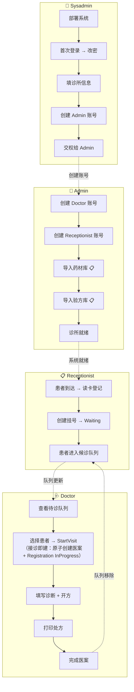
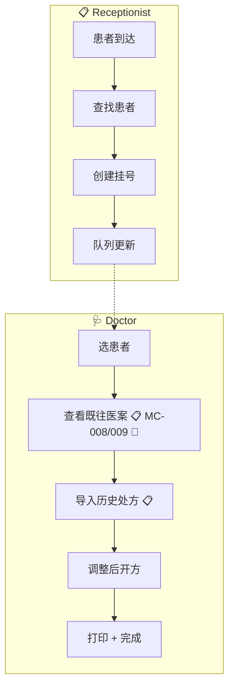
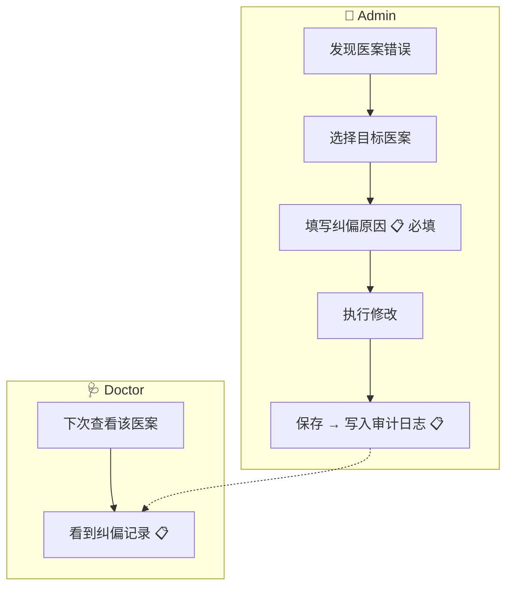
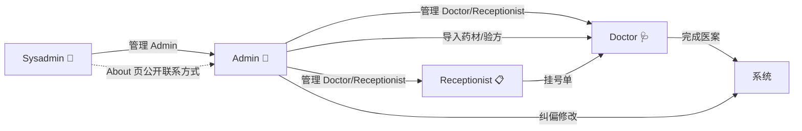

# 角色交互与协同流程 (Role Interactions)

> 版本: v4.0 | 日期: 2026-08-02 | 状态: 文档定义（设计态）

本文件定义四角色之间的交接闭环、端到端协同流程、异常场景处理矩阵。

> 角色定位与工作流程详见 [02-personas.md](02-personas.md)。
> 权限矩阵与修复项详见 [04-permissions.md](04-permissions.md)。

---

## 一、端到端协同泳道图

### 1.1 首诊完整旅程（跨 4 角色）

### 1.2 复诊旅程

### 1.3 医案纠偏旅程（Admin 介入）

---

## 二、角色交接闭环

### 2.1 交接点清单

| # | 交接 | 上游 → 下游 | 传递物 | 状态 | 关键缺口 |
|:---:|------|------------|--------|:----:|----------|
| 1 | 系统初始化 | Sysadmin → Admin | Admin 账号 + 密码 | 📋 | 向导未实现（当前仅连接配置） |
| 2 | 用户管理 | Sysadmin → Admin | 管理权（创建/编辑/禁用/删除/重置密码） | 📋 | Sysadmin 管 Admin 的 UI 待开发 |
| 3 | 用户管理 | Admin → Doctor/Receptionist | 管理权（创建/编辑/禁用/删除/重置密码） | ⚠️ | 部分功能可用，禁用/删除待完善 |
| 4 | 基础数据准备 | Admin → Doctor/Receptionist | 药材库 + 验方库 | 📋 | Excel 导入缺失 |
| 5 | 挂号登记 | Receptionist → Doctor | 挂号单（Registration，状态=Waiting） | ✅ | — |
| 6 | 开始就诊 | Doctor → 医案系统 | 医案（MedicalCase，状态=Active） | ✅ | 接诊即建（2026-08-03 决策）：StartVisit 原子创建 MedicalCase(Active) + Registration(InProgress) |
| 7 | 完成就诊 | Doctor → 系统 | 完成医案 + 打印记录 | ⚠️ | 打印回写缺失、审计日志缺失 |
| 8 | 队列更新 | Doctor → Receptionist | 候诊队列状态变更 | ✅ | 退号后队列自动更新，直接消失 |
| 9 | 纠偏修改 | Admin → 医案系统 | 修改记录 + 审计日志 | 📋 | 纠偏 UI + 审计日志未实现 |
| 10 | 密码重置 | Sysadmin → Admin（离线工具） | 重置后的密码 hash | ✅ | 离线密码重置工具 `PasswordHashGenerator`（src/Tools/），见下方 2.3 |
| 11 | 换医生 | Receptionist → Doctor | 取消原挂号 + 重新挂号 | ✅ | 先退费再收费 |
| 12 | 过期挂号提醒 | Receptionist → Patient | 提醒联系管理员退款 | ✅ | 非当天 Waiting 挂号提醒患者退款 |

### 2.2 交接物定义

### 2.3 离线密码重置方案（G-02 补写，2026-08-04）

**场景**：远程服务器不可用 / sysadmin 或 Admin 忘记密码时，绕过 WebAPI 直接重置数据库中的密码哈希。

**现状**：工具已存在 —— `src/Tools/PasswordHashGenerator/`（`dotnet run --project src/Tools/PasswordHashGenerator/`），生成哈希并输出 SQL UPDATE 语句。

**⚠️ 哈希算法约束（关键）**：
- 登录认证走 **ASP.NET Identity PBKDF2**（`UserManager`）
- `PasswordHelper`（工具依赖）生成的是 **BCrypt** 哈希
- 两者**不兼容**：直接写入 BCrypt 哈希会导致该用户无法登录（`DatabaseInitializationService.cs:193` 注释明确「避免 BCrypt/PBKDF2 哈希冲突」）
- **修复方向**：离线重置必须生成 Identity PBKDF2 兼容哈希（参考 `IdentitySeedData` 的哈希流程），或改用 `dotnet aspnet-codegenerator` / 专用重置命令。**2026-08-08 密码统一方案已落地**（删除全部 BCrypt，哈希唯一走 Identity PBKDF2，见 [05-security-password-management.md](../05-development/05-security-password-management.md)）。

**操作流程（修复后）**：
1. 运维在离线环境运行工具，输入目标用户名 + 新密码
2. 工具输出 `UPDATE AspNetUsers SET PasswordHash='<pbkdf2-hash>' WHERE UserName='<name>'`
3. 通过数据库工具（sqlcmd / SSMS）执行 UPDATE
4. 用户用新密码登录（如 `ForceChangeOnFirstLogin=true` 则首登改密）

**安全要求**：工具仅限运维使用；生产环境运行后删除明文密码痕迹；日志脱敏。

| 交接物 | 数据结构 | 说明 |
|--------|---------|------|
| Admin 账号 | `ApplicationUser` + `UserRole=Admin` | Sysadmin 创建，包含用户名+初始密码 |
| 药材库 | `Herb` 集合 | Admin 通过 Excel 导入或逐条创建 |
| 验方库 | `Formula` + `FormulaItem` 集合 | Admin 或 Doctor 创建，关联药材 |
| 挂号单 | `Registration` | 包含 PatientId, DoctorId, Status=Waiting |
| 医案 | `MedicalCase` | 包含 PatientId, DoctorId, Diagnosis, Status |
| 处方 | `Prescription` + `PrescriptionItem` | 医案关联，包含药材+剂量+煎法 |
| 审计日志 | `SecurityAuditLog` | 记录操作人、操作类型、时间、变更内容 |

---

## 三、异常场景处理矩阵

### 3.1 挂号环节

| 异常场景 | 处理策略 | 负责角色 |
|---------|---------|---------|
| 同一患者当天重复挂号 | 提示不能重复挂号（REG-BR-007） | Receptionist |
| 读身份证失败（磁条损坏） | 回退到手动输入 | Receptionist |
| 患者信息不全 | 必填项：姓名、联系号码、家庭住址、身份证 | Receptionist |
| 患者要求退号（当天） | 确认后取消挂号，退挂号费 | Receptionist |
| 患者要求退号（非当天） | 提醒患者联系管理员退款 | Receptionist |
| 患者要求换医生 | 先取消原挂号（退费），再重新挂号（收费） | Receptionist |
| 医生叫号时患者已退号 | 开始看诊时检查挂号状态，提示"患者已退号" | Doctor |
| 非当天 Waiting 挂号 | 前台可查看，提醒患者可联系管理员退款 | Receptionist |

### 3.2 诊疗环节

| 异常场景 | 处理策略 | 负责角色 |
|---------|---------|---------|
| 打印机故障/缺纸 | 补纸重试；数据不丢，可挂起/继续 | Doctor |
| 看诊中途离开 | 挂起（保存数据）→ 重新打开继续；崩溃不自动保存（MC-D18，2026-08-03 确认） | Doctor |
| 患者拒绝处方 | 标记「未开方」，完成医案 | Doctor |
| 处方开错药（未打印） | 直接修改处方 | Doctor |
| 处方开错药（已打印/已完成） | 仅 Completed 可打印 → Admin 纠偏 + EditReason + 审计（2026-08-03） | Admin |
| 复诊查看历史 | 展示既往医案列表，支持导入处方 | Doctor |
| 并发：同时编辑同一医案 | 乐观锁（RowVersion）拒绝后重试 | 系统 |
| 时区问题（MC-LOCK） | UtcNow → 本地时间 | 系统 |

### 3.3 管理环节

| 异常场景 | 处理策略 | 负责角色 |
|---------|---------|---------|
| 药材被处方引用时删除 | 引用检查 → 拒绝删除 + 提示关联处方数 | Admin |
| 患者被医案引用时删除 | 引用检查 → 拒绝删除 + 提示关联医案数 | Admin |
| 禁用正在看诊的医生 | 等当前就诊完成后生效 | Admin |
| Admin 误改医案 | 纠偏流程 + 审计日志追溯 | Admin |
| 数据库备份失败 | 重试 + 日志记录 + 通知 sysadmin | Sysadmin |

### 3.4 系统层面

| 异常场景 | 处理策略 | 负责角色 |
|---------|---------|---------|
| 远程服务器不可用 | 自动切换本地模式（SwitchingApiClient） | 系统 |
| 模式切换中数据不一致 | v1.0 不处理（v2.0 同步） | — |
| 版本升级数据迁移 | 非破坏性→MigrateAsync()；破坏性→sysadmin 手动 | Sysadmin |
| 并发操作保护 | 乐观锁（RowVersion） | 系统 |

---

## 四、角色关系图

---

## 五、无人区场景处理

| 场景 | 决策 | 说明 |
|------|------|------|
| 版本升级数据迁移 | 自动 + 手动 | 非破坏性→`MigrateAsync()`；破坏性→sysadmin 手动+文档 |
| 医疗纠纷追溯 | v1.0 审计功能全部补回 | SecurityAuditLog 恢复 + 关键操作审计 + Sysadmin 查看 UI |
| 处方打印审计 | v1.0 打印回写补回 | 恢复 PrintLog 字段/实体 |
| 患者知情同意 | 方案 A（勾选） | 医案完成时确认勾选 + 打印处方单为知情同意载体 |
| 多医生协作 | BR-001 已覆盖 | 无需额外功能 |
| 本地数据生命周期 | v1.0 不处理 | v2.0 同步处理；本地数据随 Desktop 存在 |

---

## 六、变更日志

| 日期 | 变更 |
|------|------|
| 2026-08-03 | 3.2 诊疗异常矩阵更新（医案专题）：打印失败/中途离开/拒处方 ✅；开错药（已打印）→ Admin 纠偏 |
| 2026-08-03 | 交接点 #6 + 泳道图更新：「接诊即建」决策——StartVisit 原子创建 MedicalCase(Active)+Registration(InProgress) |
| 2026-08-02 | v4.0 新建：从 02-personas.md 拆分；新增泳道图（首诊/复诊/纠偏）；新增异常场景处理矩阵（4 类 20+ 场景）；新增交接物定义；新增角色关系图 |
| 2026-06-28 | 初始交接闭环验证（含在 personas 中） |
