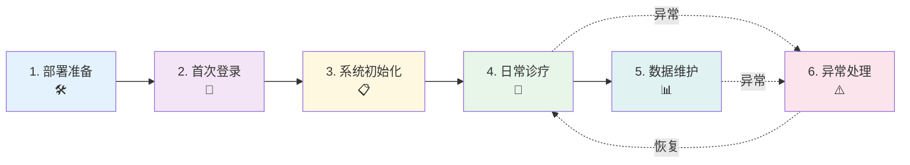
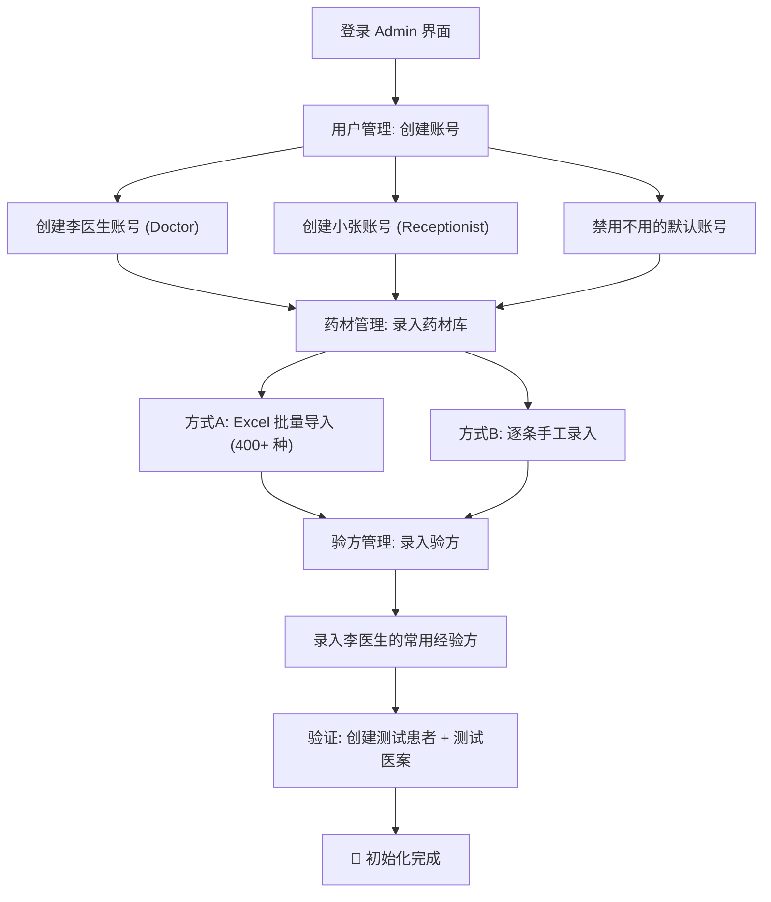
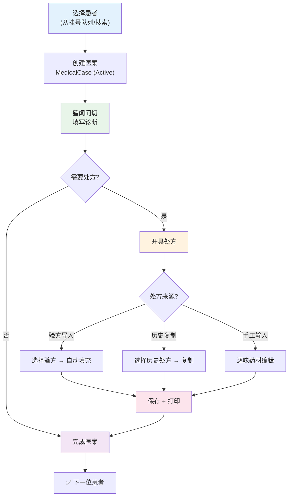
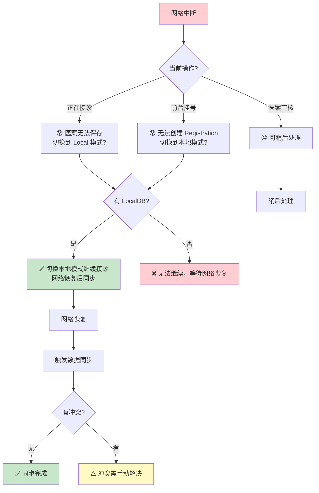

# 客户旅程图

> **版本**: v1.0
> **创建日期**: 2026-06-12
> **目的**: 从诊所视角描绘凌隐宝堂中医诊所管理系统从部署上线到日常运维的完整客户旅程，识别各阶段触点、情绪、痛点和优化机会
> **角色**: 李医生 (Doctor)、王主任 (Admin)、小张 (Receptionist)、SuperAdmin (系统运维)
> **参考文档**: [02-personas.md](02-personas.md)、[06-clinical-workflow.md](06-clinical-workflow.md)、[04-user-roles.md](04-user-roles.md)

---

## 概述

本旅程图以一家中医诊所**首次部署**凌隐宝堂系统为起点，追踪从 IT 部署准备、系统初始化、日常诊疗到异常处理的完整生命周期。系统为 **on-premise WPF Desktop 应用**，非 SaaS 产品，因此旅程阶段围绕"本地部署 + 初始化 + 日常使用"展开，而非传统的获客-激活-留存漏斗。

**核心假设**:
- 诊所规模: 1-3 名医生，1 名前台，1 名管理员
- 并发用户: ≤3 人
- 部署模式: Remote (SQL Server) 或 Local (LocalDB)，单机或局域网

**旅程周期**: 约 2-3 天完成部署初始化，此后进入日常运维循环。

---

## 旅程阶段总览



| 阶段 | 时长 | 主要角色 | 情绪曲线 | 关键触点 |
|------|------|---------|---------|---------|
| 1. 部署准备 | 2-4 小时 | SuperAdmin / 王主任 | 😐 平稳 → 😟 技术门槛 | 安装 .NET 8、SQL Server、数据库迁移 |
| 2. 首次登录 | 10 分钟 | 王主任 (Admin) | 😊 期待 → ✨ 成就感 | SuperAdmin 创建 Admin 账号、首次登录 |
| 3. 系统初始化 | 1-2 天 | 王主任 + 李医生 | 😐 繁琐 → 😫 数据量大 | 药材录入 (400+)、验方、用户账号 |
| 4. 日常诊疗 | 持续循环 | 李医生 + 小张 | 😊 顺畅 → 😌 满足 | 患者登记→诊断→处方→打印 |
| 5. 数据维护 | 周期性 | 王主任 | 😐 常规 → 😟 责任感 | 同步、价格更新、医案审核 |
| 6. 异常处理 | 不定时 | 全部 | 😰 焦虑 → 😌 恢复 | 断网、并发冲突、打印故障 |

---

## 阶段详情

### 阶段 1: 部署准备 (Deployment Preparation)

**时间**: 上线前 1-2 天 | **角色**: SuperAdmin / 外部 IT 支持

#### 触点与行为

| # | 触点 | 操作 | 系统响应 | 期望 |
|---|------|------|---------|------|
| 1.1 | 环境准备 | 安装 .NET 8 Runtime、SQL Server (或 LocalDB) | - | 环境就绪，无兼容问题 |
| 1.2 | 服务端部署 | 运行 `deploy.ps1`，配置 `appsettings.json` | WebAPI 启动，健康检查通过 | 一键部署成功 |
| 1.3 | 客户端安装 | 分发 WPF Desktop 安装包到各工位 | 启动后显示登录界面 | 各工位都能连上服务端 |
| 1.4 | 数据库初始化 | EF Core 自动迁移 (`dotnet ef database update`) | 创建表结构 + 种子数据 | 数据库 schema 正确 |
| 1.5 | 外设连接 | 身份证读卡器 USB 连接、打印机连接 | 驱动识别正常 | 读卡器和打印机就绪 |

#### 情绪与痛点

| 情绪 | 痛点 | 严重度 | 现有缓解 |
|------|------|--------|---------|
| 😟 对 .NET/SQL Server 安装不熟悉 | 缺乏一键安装脚本 | 高 | `deploy.ps1` 部署脚本 |
| 😤 配置连接字符串出错 | `appsettings.json` 手动编辑易错 | 中 | 文档指导 |
| 😰 读卡器/打印机驱动兼容 | 外设驱动问题需要逐台排查 | 中 | 文档列出推荐型号 |
| 😐 不知道数据库是否初始化成功 | 缺少可视化初始化进度 | 中 | 健康检查端点 `/api/health` |

#### 优化机会

- **[P0]** 提供一键安装包 (.exe installer)，自动检测并安装 .NET Runtime + SQL Server LocalDB
- **[P1]** 首次启动时增加初始化向导，引导配置数据库连接和基础设置
- **[P2]** 自动检测外设连接状态，在登录界面显示读卡器/打印机就绪指示

---

### 阶段 2: 首次登录 (First Login)

**时间**: 10-15 分钟 | **角色**: 王主任 (Admin)

#### 触点与行为

| # | 触点 | 操作 | 系统响应 | 期望 |
|---|------|------|---------|------|
| 2.1 | SuperAdmin 首次登录 | 使用默认 SuperAdmin 凭据登录 (localhost) | 进入 SuperAdmin 诊断界面 | 登录成功 |
| 2.2 | 创建 Admin 账号 | 输入王主任信息，分配 Admin 角色 | 账号创建成功 | 王主任获得管理权限 |
| 2.3 | Admin 首次登录 | 王主任用新账号登录 Desktop 客户端 | 加载 Admin 模块 | 看到管理功能导航 |

#### 情绪旅程

```
SuperAdmin 默认凭据登录 ──😊──> 创建 Admin 账号 ──✨──> Admin 首次进入系统 ──😌──>
  "能用！"                      "账号建好了"            "界面很清晰"
```

#### 情绪与痛点

| 情绪 | 痛点 | 严重度 | 现有缓解 |
|------|------|--------|---------|
| 😟 默认 SuperAdmin 密码是什么 | 默认凭据未在 UI 提示 | 中 | 部署文档说明 |
| 😊 创建账号流程简单 | - | - | 标准用户创建表单 |
| 😌 Admin 权限立即生效 | - | - | 角色策略即时加载 |

#### 优化机会

- **[P1]** 首次启动时弹出"系统初始化向导"，引导 SuperAdmin 修改默认密码并创建 Admin 账号
- **[P2]** 登录界面增加版本号和连接状态指示，让用户确认环境正确

---

### 阶段 3: 系统初始化 (System Initialization)

**时间**: 1-2 天 | **角色**: 王主任 (Admin) 为主，李医生协助

这是**整个旅程中最关键的阶段**——初始化数据的质量直接影响后续使用体验。

#### 3.1 王主任 (Admin) 的初始化旅程



##### 触点与行为

| # | 触点 | 操作 | 系统响应 | 期望 |
|---|------|------|---------|------|
| 3.1.1 | 创建用户账号 | 创建 Doctor、Receptionist 账号 | 账号创建成功，角色分配 | 5 分钟内完成 |
| 3.1.2 | 药材批量导入 | 上传 Excel 文件 (药材名/拼音码/分类/价格) | 导入结果报告 (成功/失败/重复) | 400+ 种药材一次导入 |
| 3.1.3 | 药材逐条补录 | 手工补充 Excel 未覆盖的药材 | 实时搜索查重 | 无重复药材 |
| 3.1.4 | 验方录入 | 创建验方 + 添加药材组成 | 验方保存 (Draft 状态) | 常用验方就绪 |
| 3.1.5 | 验方验证 | 将验方状态设为 Validated | 验方可用于处方导入 | 李医生能导入验方 |

##### 情绪旅程

```
创建账号 ──😊──> 药材导入 ──😤──> 导入报错 ──😫──> 修正重试 ──😌──> 验方录入 ──😐──> 测试验证 ──✨──>
 "很快"      "400种好多"   "格式不对"   "终于导入了"    "还行"      "真的能用了"
```

##### 情绪与痛点

| 情绪 | 痛点 | 严重度 | 现有缓解 |
|------|------|--------|---------|
| 😫 400+ 种药材逐条录入需要好几天 | 缺少标准药材库模板 | **极高** | Excel 导入功能 (FR-HERB-*) |
| 😤 Excel 导入格式错误，报错信息不清楚 | 导入校验错误信息不直观 | 高 | 导入结果报告 |
| 😟 不确定验方是否设置正确 | 缺少验方预览/测试功能 | 中 | 验方 Validated 状态控制 |
| 😐 分类标准不统一 | 药材分类缺少标准规范 | 低 | 分类字段可自定义 |

#### 3.2 李医生 (Doctor) 的初始化参与

| # | 触点 | 操作 | 期望 |
|---|------|------|------|
| 3.2.1 | 首次登录 Desktop 客户端 | 看到临床工作界面 | 界面直观、不需要培训 |
| 3.2.2 | 确认验方库 | 查看已录入的常用验方列表 | 常用 10-20 个验方已就绪 |
| 3.2.3 | 熟悉操作流程 | 模拟创建测试医案 | 5 分钟内完成一次测试流程 |

##### 情绪与痛点

| 情绪 | 痛点 | 严重度 | 现有缓解 |
|------|------|--------|---------|
| 😊 界面简洁，不需要太多培训 | - | - | Clinical 模式引导 |
| 😟 验方不全，常用的经验方没录入 | 初始化数据不完整影响使用 | 高 | Admin 可持续补充 |
| 😤 中医辨证输入需要打字太多 | 拼音输入中医术语效率低 | 中 | 可选字段设计 |

#### 优化机会

- **[P0]** 提供标准中药材库 Excel 模板 (含 400+ 常用药材)，开箱即导入
- **[P0]** 提供常见中医验方库模板 (含经典方剂 50+ 种)，加速初始化
- **[P1]** Excel 导入时提供实时校验预览 (高亮错误行)，导入前即可修正
- **[P1]** 增加"初始化进度仪表盘"，显示已完成/待完成的初始化项
- **[P2]** 首次登录时弹出"新手引导" (Guided Tour)，逐步介绍核心功能

---

### 阶段 4: 日常诊疗 (Daily Clinical Operations)

**时间**: 持续循环 (每天) | **角色**: 小张 (前台) + 李医生 (医生)

这是**系统价值核心交付阶段**，覆盖每天 8:00-17:30 的完整诊疗循环。

#### 4.1 小张 (Receptionist) 的日常旅程

```
┌─────────────────────────────────────────────────────────────────┐
│  08:00 开机准备        08:30 高峰挂号        12:00 补录    14:00 下午接待  │
│  😊 → 😌             😊 → 😤 → 😊        😐 → 😌       😊 → 😌        │
│  读卡器就绪           排队压力大             整理资料      相对轻松       │
└─────────────────────────────────────────────────────────────────┘
```

##### 触点与行为

| # | 触点 | 操作 | 系统响应 | 期望时长 |
|---|------|------|---------|---------|
| 4.1.1 | 开机登录 | 输入账号密码登录 | 加载 Receptionist 工作区 | 10 秒 |
| 4.1.2 | 读卡器准备 | 确认身份证读卡器连接 | 系统显示读卡器状态 | 30 秒 |
| 4.1.3 | 患者到达: 老患者 | 刷身份证 → 自动匹配 | 加载患者信息 (LastVisitTime, VisitCount) | 3 秒 |
| 4.1.4 | 患者到达: 新患者 | 刷身份证 → 无匹配 → 快速创建 | 自动映射身份证字段，仅需补手机号 | 30 秒 |
| 4.1.5 | 挂号 | 选择患者 → 指派医生 → 创建 Registration | Registration (Status=Waiting) | 10 秒 |
| 4.1.6 | 接待下一位 | 重复 4.1.3~4.1.5 | - | 每位 2 分钟 |
| 4.1.7 | 查看队列 | 查看今日挂号列表 | 按时间排序，显示状态 | 实时 |

##### 情绪与痛点

| 情绪 | 痛点 | 严重度 | 现有缓解 |
|------|------|--------|---------|
| 😤 高峰期每 5 分钟一位，手工登记太慢 | 身份证读卡减少手工输入 | 已解决 | FR-CARD-001 自动映射 |
| 😰 老患者说"来过"但搜不到记录 | 模糊搜索不够精准 | 中 | 拼音码 + 身份证号双重搜索 |
| 😟 不知道医生看到几号了 | 无法查看接诊进度 | **高** | Registration 状态可见 |
| 😊 刷身份证 3 秒完成登记 | - | 已解决 | FR-CARD-002 |

##### 关键时刻 (Moments of Truth)

> **身份刷卡 3 秒登记** — 如果这一步超过 10 秒，前台排队压力会急剧上升，直接影响诊所运营效率。

#### 4.2 李医生 (Doctor) 的日常旅程

```
┌──────────────────────────────────────────────────────────────────────────┐
│ 08:00 登录查诊    08:30 上午门诊 (12人)        12:00 整理    14:00 下午 (8人)   17:30 收尾  │
│ 😊 → 😌          😊→😤→😌→✨ (循环12次)     😐 → 😌     😊→😌→✨ (循环8次)   😌 → 😌     │
│ 看待诊列表        选患者→诊断→处方→打印         整理验方     同上午              确认全部完成  │
└──────────────────────────────────────────────────────────────────────────┘
```

##### 单次接诊旅程 (每位患者约 15-20 分钟)



##### 触点与行为

| # | 触点 | 操作 | 系统响应 | 期望时长 |
|---|------|------|---------|---------|
| 4.2.1 | 查看待诊列表 | 从挂号队列选择患者 | 显示患者基本信息 + 历史医案摘要 | 5 秒 |
| 4.2.2 | 创建医案 | 点击"接诊" | BR-001 碰撞检查 → 创建 MedicalCase (Active) | 2 秒 |
| 4.2.3 | 查看历史 | 查看患者上次诊断和处方 | 加载 Completed 医案详情 | 5 秒 |
| 4.2.4 | 填写诊断 | 望闻问切 → 录入辨证/舌诊/脉诊 | 保存 Consultation 数据 | 3-5 分钟 |
| 4.2.5 | 验方导入 | 选择常用验方 → 一键导入 | 药材列表自动填充 + 费用计算 | 10 秒 |
| 4.2.6 | 手工调方 | 增减药材、调整剂量 | 实时价格计算 (SingleDosePrice × DosageCount) | 2-3 分钟 |
| 4.2.7 | 保存处方 | 点击保存 | 乐观锁校验 → 聚合保存 | 2 秒 |
| 4.2.8 | 打印处方 | 打印预览 → 确认打印 | IsPrinted=true, PrintCount++ | 30 秒 |
| 4.2.9 | 完成医案 | 点击完成看诊 | BR-003 校验 → MedicalCase (Completed) | 2 秒 |

##### 情绪旅程 (单次接诊)

```
选患者 ──😊──> 创建医案 ──😊──> 查历史 ──✨──> 填诊断 ──😐──> 开处方 ──😤──> 打印 ──😊──> 完成 ──😌──>
 "开始了"    "顺利"      "上次记录很清楚" "打字多"    "验方一秒" "打印机卡纸？" "处方笺很专业" "下一个"
```

##### 情绪与痛点

| 情绪 | 痛点 | 严重度 | 现有缓解 |
|------|------|--------|---------|
| ✨ **复诊时 10 秒调出历史处方** | 无 (这是 Aha Moment) | - | 患者医案历史完整保存 |
| ✨ **验方一键导入** | 无 (这是核心价值) | - | FR-MC-016 验方导入 |
| 😤 中医辨证需要大量文字输入 | 舌诊/脉诊/辨证文字输入慢 | 高 | 可选字段设计 |
| 😰 打印机偶尔卡纸或格式偏移 | 打印故障导致患者等待 | 中 | 打印预览 + 重试机制 |
| 😐 处方费用手工心算怕算错 | 无 (已解决) | - | MC-D14 自动计算 |
| 😟 BR-001 碰撞弹窗不知道怎么选 | 碰撞处理三选一不够直观 | 中 | 弹窗提示 + 导航选项 |

##### 关键时刻 (Moments of Truth)

> **验方导入 10 秒完成处方** — 这是系统的 Aha Moment。如果验方库初始化不完整或导入流程不顺，李医生会退回手工输入模式，系统价值大幅降低。
>
> **处方笺打印质量** — 打印出的处方笺是患者和药房唯一可见的系统产出物。打印质量直接决定医生对系统的信任度。

#### 4.3 王主任 (Admin) 的日常介入

| # | 触点 | 操作 | 频率 |
|---|------|------|------|
| 4.3.1 | 医案审核 | 检查处方金额异常、诊断信息完整度 | 每日 30 分钟 |
| 4.3.2 | 紧急调价 | 个别药材价格变动 | 不定时 |
| 4.3.3 | 账号管理 | 新员工入职/离职时创建/禁用账号 | 月均 1-2 次 |

---

### 阶段 5: 数据维护 (Data Maintenance)

**时间**: 周期性 | **角色**: 王主任 (Admin) 为主

#### 触点与行为

| # | 触点 | 操作 | 频率 | 期望 |
|---|------|------|------|------|
| 5.1 | 药材批量调价 | 每月 1-2 次供应商调价，Excel 批量更新 | 月度 | 调价不影响历史处方 (实时价) |
| 5.2 | 数据同步 (Remote 模式) | 本地数据同步到远程 SQL Server | 视配置 | 断网恢复后自动同步 |
| 5.3 | 医案审核 | 查看/编辑任意医案，含锁定医案 | 每日 | 能追溯修改记录 |
| 5.4 | 报表查看 | 按时间段统计接诊量、处方量 | 周度/月度 | 数据准确 |
| 5.5 | 桌面端升级 | WebAPI 检测新版本 → Desktop 自动下载更新 | 版本发布时 | 升级不影响业务数据 |

#### 情绪与痛点

| 情绪 | 痛点 | 严重度 | 现有缓解 |
|------|------|--------|---------|
| 😌 药材调价操作简单 | - | - | Excel 导入 |
| 😟 调价后不知道是否影响已开处方 | 价格快照 vs 实时价混淆 | 中 | MC-D13 实时获取 (非快照) |
| 😐 同步状态看不到进度 | 同步过程缺乏可视化 | 中 | Sync 模块状态查看 |
| 😤 版本升级后功能变化不知道 | 升级后无 Changelog 提示 | 低 | `/api/version` 版本检查 |

#### 优化机会

- **[P1]** 增加数据同步进度可视化 (成功/失败/冲突数量)
- **[P1]** 版本升级后弹出 Changelog 弹窗，说明新功能
- **[P2]** 提供简单的数据统计仪表盘 (今日接诊数、本周趋势)

---

### 阶段 6: 异常处理 (Exception Handling)

**时间**: 不定时 | **角色**: 全部 (影响程度因角色而异)

#### 6.1 网络中断 (Remote 模式)



##### 情绪与痛点

| 情绪 | 痛点 | 严重度 | 现有缓解 |
|------|------|--------|---------|
| 😰 接诊中断网，患者还在面前 | 断网影响业务连续性 | **极高** | Dual-Mode 支持本地模式 |
| 😤 断网恢复后数据同步出冲突 | 冲突解决机制不直观 | 高 | Sync 模块冲突报告 |
| 😌 本地模式可以继续接诊 | 无 (缓解措施有效) | - | LocalDB 完整诊疗支持 |

#### 6.2 并发冲突 (Concurrent Editing)

| 场景 | 影响 | 情绪 | 现有缓解 |
|------|------|------|---------|
| 医生与管理员同时编辑同一医案 | 后保存者收到 ERR-30502 | 😤 | 乐观锁 + 3 次重试 |
| 医生编辑已打印医案 | 需要 EditReason | 😐 | 打印保护机制 (MC-D15) |

> **实际风险**: 1-3 并发用户，冲突概率极低 (NFR 约束)。

#### 6.3 打印故障

| 场景 | 影响 | 情绪 | 现有缓解 |
|------|------|------|---------|
| 打印机脱机/卡纸 | 处方笺无法打印，患者等待 | 😰 | 打印预览可确认格式 |
| A5 纸张装歪 | 打印内容偏移 | 😤 | 打印预览检查 |
| 打印机未设为默认 | 弹出打印机选择，不确定选哪个 | 😐 | 打印对话框引导 |

#### 6.4 数据异常

| 场景 | 影响 | 情绪 | 现有缓解 |
|------|------|------|---------|
| 药材价格录入错误 | 处方费用计算不准确 | 😰 | 审计日志可追溯 |
| 患者信息重复 | 搜索结果混淆 | 😤 | IdNumber 唯一约束 (PAT-D03) |
| 医案 BR-003 校验失败 | 无法完成医案 | 😤 | 明确错误码提示缺失项 |

#### 优化机会

- **[P0]** 网络中断时**自动静默切换**到本地模式，无感知地保持业务连续
- **[P1]** 同步冲突提供**可视化差异对比**界面，而非纯文本报告
- **[P1]** 打印故障时提供**故障诊断提示** (检查打印机连接、纸张、驱动)
- **[P2]** 增加"离线模式指示器"，让用户明确知道当前是本地模式还是远程模式

---

## 关键时刻

### Aha Moment (顿悟时刻)

| 时刻 | 触发条件 | 情绪 | 业务价值 |
|------|---------|------|---------|
| **验方一键导入** | 首次使用验方导入完成处方 | ✨ "这也太快了" | 接诊效率提升 50%+ |
| **复诊历史秒查** | 首次搜索到复诊患者历史记录 | ✨ "终于不用翻纸质了" | 复诊准备时间从 5 分钟降至 10 秒 |
| **处方费用自动计算** | 首次看到自动计算的总金额 | ✨ "再也不用心算了" | 消除手工计算错误 |
| **打印出专业处方笺** | 首次打印出规范排版的处方笺 | 😊 "这个拿得出手" | 医患信任度提升 |

### Moments of Truth (关键时刻)

| 关键时刻 | 失败后果 | 成功回报 |
|---------|---------|---------|
| **首次独立完成接诊** (李医生) | 如果操作卡顿 >3 次 → 回退纸笔 | 流畅完成 → 习惯养成 |
| **高峰期挂号** (小张) | 如果刷卡 >10 秒 → 排队积压 | 3 秒完成 → 效率标杆 |
| **数据同步成功** (王主任) | 如果数据丢失 → 彻底失去信任 | 无损同步 → 安心使用 |

### Churn Triggers (流失触发器)

| 触发器 | 严重度 | 预防措施 |
|--------|--------|---------|
| 数据丢失 (同步冲突导致) | **致命** | 乐观锁 + 冲突报告 + 备份机制 |
| 接诊流程比纸笔还慢 | 高 | 验方导入 + 快捷操作 + 性能优化 |
| 打印格式不专业 | 中 | A5/A4 专业排版 + 打印预览 |
| 断网后无法工作 | 高 | Dual-Mode 本地模式 |

---

## 优化建议

按优先级排序，基于旅程中各阶段的痛点严重度和优化价值：

### P0: 必须解决 (上线前)

| # | 建议 | 对应痛点 | 影响阶段 |
|---|------|---------|---------|
| 1 | 提供标准中药材库 Excel 模板 (400+ 种) | 初始化录入耗时数天 | 阶段 3 |
| 2 | 提供经典验方库模板 (50+ 常用方剂) | 验方初始化不完整 | 阶段 3 |
| 3 | 网络中断自动切换本地模式 | 断网导致业务中断 | 阶段 6 |

### P1: 应该解决 (上线后首月)

| # | 建议 | 对应痛点 | 影响阶段 |
|---|------|---------|---------|
| 4 | 首次启动初始化向导 | 部署配置复杂 | 阶段 1-2 |
| 5 | 初始化进度仪表盘 | 不知道初始化是否完成 | 阶段 3 |
| 6 | 中医辨证模板/快捷输入 | 诊断文字输入效率低 | 阶段 4 |
| 7 | 接诊进度可视化 (前台可查看) | 前台不知道医生进度 | 阶段 4 |
| 8 | 同步冲突可视化对比 | 冲突解决不直观 | 阶段 6 |
| 9 | 数据统计仪表盘 | 缺少业务数据概览 | 阶段 5 |

### P2: 可以改进 (持续优化)

| # | 建议 | 对应痛点 | 影响阶段 |
|---|------|---------|---------|
| 10 | 新手引导 (Guided Tour) | 首次使用无引导 | 阶段 2-3 |
| 11 | 版本升级 Changelog 弹窗 | 不知道新功能 | 阶段 5 |
| 12 | 离线模式状态指示器 | 不确定当前模式 | 阶段 6 |
| 13 | 外设状态检测指示 | 外设问题排查耗时 | 阶段 1 |

---

## 旅程情绪全景图

```
情绪
 😊 ┤                                              ╭──✨──╮
    │                          ╭──✨──╮           ╱      ╲
 😌 ┤     ╭──😊──╮           ╱      ╲         ╱        ╲
    │    ╱      ╲           ╱        ╲       ╱          ╰──😌──
 😐 ┤──😊        ╰──😐──╮╱          ╰──😐──╯
    │                     ╲                                   ╰──😐──
 😤 ┤                      ╰──😤──╮        ╭──😤──╮
    │                              ╰──😫──╯      ╰──😤──╮
 😰 ┤                                                    ╰──😰──
    │
    └──┬──────┬───────┬───────────┬───────┬───────┬───────┬──→ 时间
     部署    首次    系统初始化    日常诊疗   数据维护  异常处理
     准备    登录    (1-2天)      (持续)    (周期性)  (不定时)
```

**解读**: 情绪低谷集中在**系统初始化** (数据录入量大) 和**异常处理**阶段；情绪高峰出现在**日常诊疗**中的验方导入和复诊查询。

---

## 变更记录

| 日期 | 版本 | 变更内容 |
|------|------|----------|
| 2026-06-12 | v1.0 | 初始版本: 6 阶段客户旅程图，覆盖部署→初始化→日常诊疗→维护→异常处理全生命周期 |
