# 端到端临床工作流

> **版本**: v2.0
> **创建日期**: 2026-02-21
> **目的**: 串联从患者到达到离开的完整临床流程，统一展示跨模块交互
> **覆盖缺口**: GAP-FLOW-1 (docs/plans/2026-02-21-prd-design-gap-analysis.md)
> **v2.0 深化**: 补全异常路径、分支流程、子流程时序图、跨模块联动、编辑模式切换

---

## 一、流程全景

### 1.1 端到端时序图

> **v2.0 更新**: 增加两种入口模式 (前台挂号 / 医生直接) 和 Registration 挂号记录

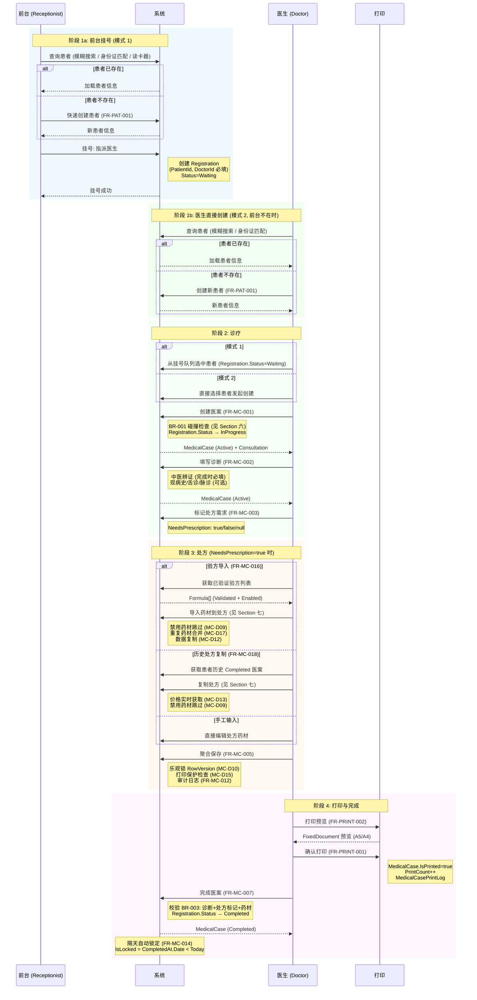

### 1.2 简化流程图

> **v2.0 更新**: 增加两种入口模式收敛点

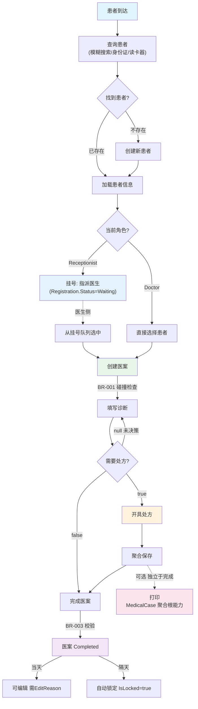

---

## 二、阶段详解

### 2.1 前台挂号 (Receptionist)

| 步骤 | 操作 | PRD | 关键约束 |
|------|------|-----|---------|
| 1 | 连接身份证读卡器 | FR-CARD-001 | CardReadResult.IsSuccess 校验 |
| 2 | 读取身份证信息 | FR-CARD-001 | 姓名/性别/民族/出生日期/身份证号/住址 |
| 3 | 按身份证号查询患者 | FR-CARD-002 | IdNumber 唯一性 (PAT-D03) |
| 4a | 已存在: 加载患者，显示 LastVisitTime + VisitCount | FR-CARD-002 | Patient.Status 检查 |
| 4b | 不存在: 快速创建 (自动映射身份证字段) | FR-PAT-001 | 手机号必填 + 唯一 (ERR-20003) |

**Receptionist 权限边界**: 患者 CRU (无删除)、读卡器使用、查看未完成医案简要提示 (仅时间+医生，无诊断/处方详情)。

### 2.2 创建医案 (Doctor)

| 步骤 | 操作 | PRD | 关键约束 |
|------|------|-----|---------|
| 1 | 选择患者，创建医案 | FR-MC-001 | 仅 Doctor 角色可创建 |
| 2 | 系统校验: 患者状态 | FR-MC-001 | Patient.Status=Enabled (ERR-30105) |
| 3 | 系统校验: 单活跃医案约束 | BR-001 | Suspended -> ERR-30104, Active -> ERR-30103 |
| 4 | 系统创建 MedicalCase (Active) + Consultation (1:1 共享主键) | FR-MC-001 | CaseNumber 自动生成: MC+yyyyMMdd+序号 |
| 5 | 冗余存储 PatientName, DoctorName | - | 读优化，患者禁用时按角色脱敏 (MC-D16) |

### 2.3 填写诊断 (Doctor)

| 步骤 | 操作 | PRD | 关键约束 |
|------|------|-----|---------|
| 1 | 填写中医辨证 (TcmDiagnosis) | FR-MC-002 | **完成时必填** |
| 2 | 填写现病史/舌诊/脉诊 | FR-MC-002 | 可选字段 |
| 3 | 保存诊断数据 | FR-MC-002 | 状态保持 Active |
| 4 | 或挂起医案 (状态转为 Suspended) | FR-MC-006 | TcmDiagnosis 可空，稍后继续 |

### 2.4 处方决策与开具 (Doctor)

**处方需求标记 (FR-MC-003)**:
- `true`: 需要处方 -> 允许创建/编辑 Prescription
- `false`: 不需要处方 -> 删除已有 Prescription
- `null`: 未决策 -> 完成时报错 ERR-30302

**三种处方来源**:

| 来源 | PRD | 关键规则 |
|------|-----|---------|
| 验方导入 | FR-MC-016, FR-FORM-* | 仅 Validated + Enabled 验方可用 (MC-D08); 禁用药材自动跳过+提示 (MC-D09); 数据复制 (MC-D12) |
| 历史处方复制 | FR-MC-018 | 仅 Completed 医案; 价格从药材库实时获取 (MC-D13); 禁用药材跳过 (MC-D09) |
| 手工输入 | FR-MC-004 | 直接编辑药材列表 |

**费用计算 (MC-D14)**:

```
Item.Amount = UnitPrice x Dosage
SingleDosePrice = SUM(Items.Amount)
TotalPrice = SingleDosePrice x DosageCount x Discount
```

### 2.5 聚合保存 (FR-MC-005)

医案采用聚合根模式，MedicalCase + Consultation + Prescription + PrescriptionItems 原子保存。

**EditReason 判断矩阵**:

| 场景 | 需要 EditReason |
|------|:---:|
| 当天本人修改 Active/Suspended | 否 |
| 修改 Completed 医案 | 是 |
| 隔天修改 | 是 |
| 非本人修改 | 是 |
| IsPrinted=true 时修改诊断/处方 | 是 (ERR-30403) |

**打印保护 (MC-D15)**:
- IsPrinted=true 且诊断/处方有变更 -> 需 EditReason
- 保存成功后: IsPrinted 重置为 false, PrintVersion++
- 需要重新打印

**并发控制**: 乐观锁 RowVersion, 3 次重试后返回 ERR-30502

### 2.6 打印 (FR-PRINT-001~004)

> 打印是 MedicalCase 聚合根的能力，v1.0 支持处方打印 (PrintType=Prescription)。IsPrinted 和 PrintVersion 均在 MedicalCase 上，打印日志通过 MedicalCasePrintLog 统一管理。

| 步骤 | 操作 | 说明 |
|------|------|------|
| 1 | 打印预览 | 左: 打印机/份数/纸张; 右: FixedDocument 预览 |
| 2 | 确认打印 | MedicalCase.IsPrinted=true, MedicalCase.PrintCount++, MedicalCase.LastPrintedAt=now |
| 3 | 生成 MedicalCasePrintLog | 记录 PrintType + 打印版本/操作人/打印机/结果 |

**排版规格**: A5 (148mm x 210mm) 默认, A4 可选; 药材 <=12 味单页, >12 味自动分页。

### 2.7 完成医案 (FR-MC-007)

**完成校验 (BR-003)**:

| 校验项 | 条件 | 错误码 |
|--------|------|--------|
| 中医辨证 | TcmDiagnosis 非空 | ERR-30301 |
| 处方需求标记 | NeedsPrescription 非 null | ERR-30302 |
| 处方存在性 | NeedsPrescription=true 时 Prescription 非 null | ERR-30303 |
| 处方药材数量 | Items.Count > 0 | ERR-30304 |
| 处方帖数 | DosageCount > 0 | ERR-30305 |

### 2.8 医案锁定 (FR-MC-014)

```
IsLocked = IsCompleted AND CompletedAt.Date < Today
```

- **计算属性**, 无后台任务，每次查询实时计算
- Doctor: 不可编辑锁定医案 (ERR-30201)
- Admin: 可编辑，需提供 EditReason

---

## 三、MedicalCase 状态机

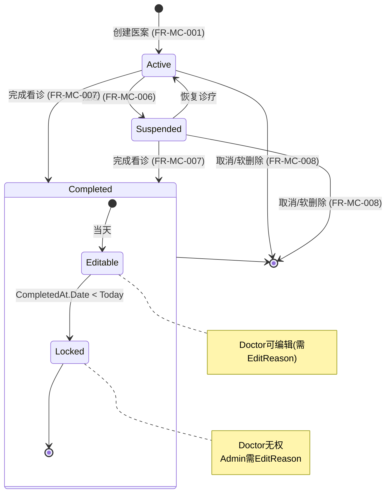

> **取消操作**: 不再有独立的 Cancelled 状态。取消医案通过 `IsDeleted=true` 软删除实现，聚合根域方法 `MedicalCase.SoftDelete()` 统一处理。已完成的医案不可取消。

---

## 四、跨模块交互矩阵

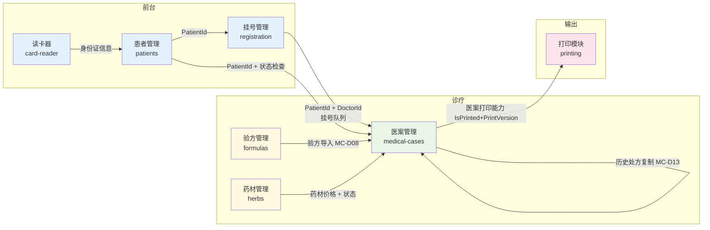

### 交互约束汇总

| 来源模块 | 目标模块 | 交互点 | 约束 | PRD |
|---------|---------|--------|------|-----|
| card-reader | patients | 身份证信息映射 | IdNumber 唯一性 | FR-CARD-002, PAT-D03 |
| patients | registration | 挂号 | PatientId + DoctorId 必填 | FR-REG-001 |
| registration | medical-cases | 从挂号队列创建医案 | Status=Waiting → InProgress | FR-REG-002 |
| patients | medical-cases | 创建医案 (医生直接) | Status=Enabled, 单活跃约束 | FR-MC-001, BR-001 |
| patients | medical-cases | 删除保护 | 有医案禁删 | MC-D04, ERR-20004 |
| patients | medical-cases | 禁用联动 | 禁止创建新医案 | MC-D16, ERR-30105 |
| formulas | medical-cases | 验方导入 | Validated + Enabled, 重复药材合并 | MC-D08, MC-D17, FR-MC-016 |
| herbs | medical-cases | 药材状态检查 | 禁用药材跳过+提示 | MC-D09 |
| herbs | medical-cases | 价格获取 | 实时价格 (非快照) | MC-D13, MC-D14 |
| medical-cases | registration | 医案完成联动 | Registration.Status → Completed | FR-REG-003 |
| medical-cases | printing | 医案打印 (v1.0: 处方打印) | MedicalCase.IsPrinted/PrintVersion + MedicalCasePrintLog | MC-D15, FR-PRINT-001 |

---

## 五、角色视角工作流

### 5.1 Receptionist 日常操作

```
登录 -> 患者管理 + 挂号管理
  ├─ 查询患者 (模糊搜索/身份证匹配/读卡器)
  │   ├─ 已存在 -> 加载患者信息
  │   └─ 不存在 -> 创建新患者 (FR-PAT-001)
  ├─ 挂号: 选择患者 + 指派医生 -> 创建 Registration (Status=Waiting)
  ├─ 患者信息编辑 (CRU, 无删除)
  └─ 查看今日挂号队列
```

### 5.2 Doctor 日常操作

```
登录 -> 首页 (挂号队列 + 进行中医案)
  ├─ 模式 1: 从挂号队列选中患者 -> 创建医案 -> 诊断 -> 处方 -> 保存 -> 打印 -> 完成
  ├─ 模式 2: 直接查询患者 -> 创建医案 (前台不在时)
  ├─ 恢复挂起的 Suspended 医案
  ├─ 查看/复制历史医案处方
  └─ 管理个人验方
```

### 5.3 Admin 日常操作

```
登录 -> 管理模块
  ├─ 药材管理 (CRUD + 导入导出)
  ├─ 验方管理 (CRUD + 共享管理)
  ├─ 医案审核 (编辑任意医案, 含锁定医案)
  ├─ 用户管理 (CRUD, 不含 SuperAdmin)
  └─ 数据同步
```

---

## 六、异常路径与分支流程

> **v2.0 新增**: 补全正常路径之外的异常分支、决策流程。

### 6.1 BR-001 碰撞处理流程

创建医案时，如果发现该患者已有 Active 或 Suspended 状态的医案，需要三选一处理。

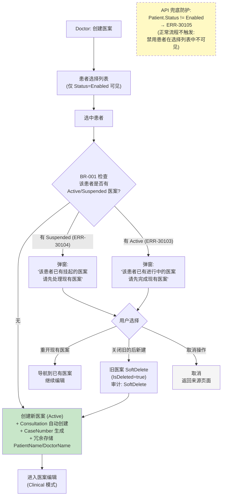

**设计要点:**
- 禁用患者在患者选择列表中已被 UI 过滤，用户选不到禁用患者
- ERR-30105 是 API 层兜底防护，正常流程不触发
- "关闭旧的后新建"触发 SoftDelete 审计记录

### 6.2 BR-002 离开界面决策流程

医生离开医案编辑界面时，根据编辑模式 (Clinical/Management) 展示不同的处置选项。

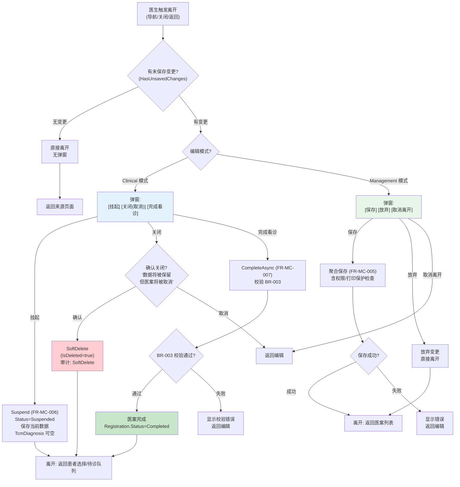

**Clinical 模式 vs Management 模式:**

| 维度 | Clinical 模式 | Management 模式 |
|------|--------------|----------------|
| 入口 | 从患者选择/待诊队列进入 | 从医案列表进入 |
| 默认状态 | Editing | ReadOnly |
| 离开选项 | 挂起 / 关闭 / 完成看诊 | 保存 / 放弃 / 取消离开 |
| 返回目标 | 患者选择/待诊队列 | 医案列表 |
| 崩溃处理 | 未保存变更丢失 | 未保存变更丢失 |

**崩溃场景**: 崩溃/断网/强制关闭统一做变更丢失处理 (无自动保存机制)。医案保持最后一次成功保存的状态。

### 6.3 并发冲突处理

两个用户同时编辑同一医案时，通过乐观锁 (RowVersion) + 3 次重试机制处理。

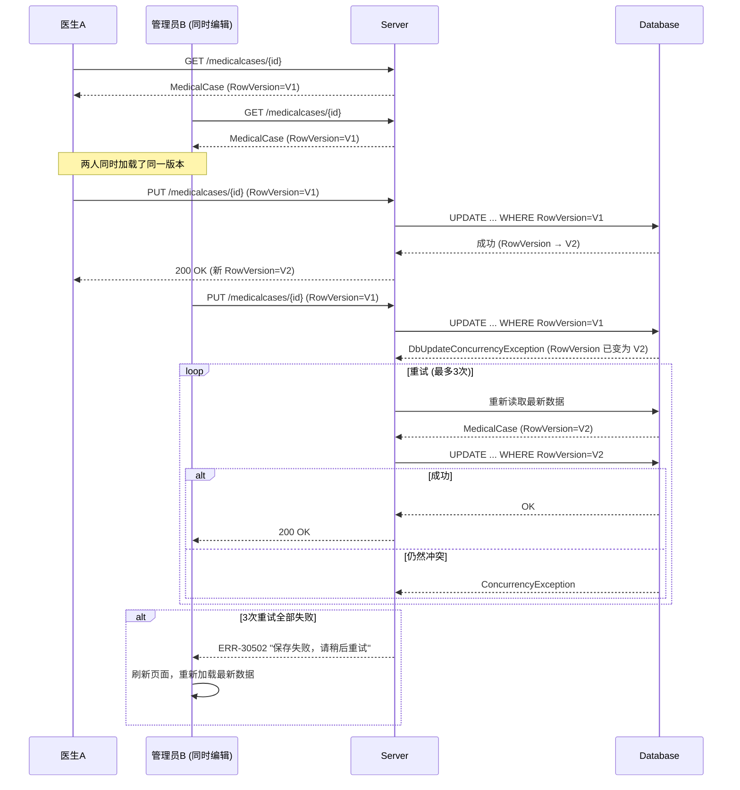

**关键规则:**
- 乐观锁通过 RowVersion (timestamp) 实现
- 3 次重试机制: 每次重试自动读取最新版本再尝试
- NFR 约束: 系统 1-3 并发用户，冲突概率极低

---

## 七、子流程详解

### 7.1 验方/历史处方导入

验方导入 (FR-MC-016) 和历史处方复制 (FR-MC-018) 共享统一的药材导入逻辑，差异仅在来源。

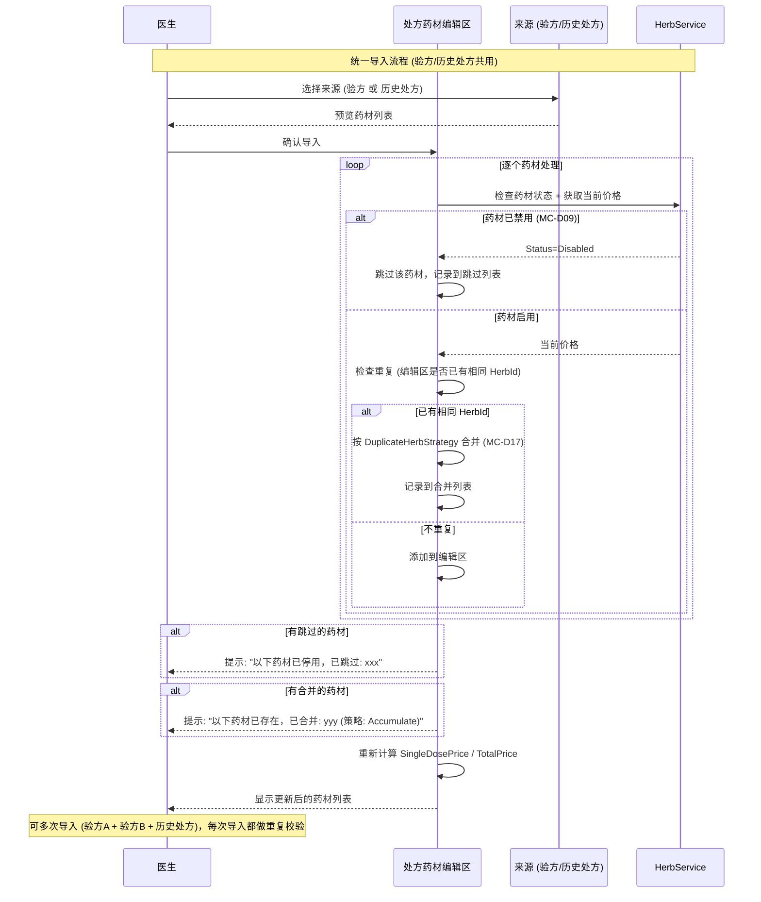

**重复药材剂量合并策略 (MC-D17):**

通过 `appsettings.json` 配置 `PrescriptionImport.DuplicateHerbStrategy`:

| 策略 | 行为 | 示例 (已有=5g, 导入=3g) |
|------|------|------|
| `Max` | 取最大剂量 | 结果=5g |
| `Min` | 取最小剂量 | 结果=3g |
| `Accumulate` | 累加 (默认) | 结果=8g |
| `Skip` | 跳过，保持原值 | 结果=5g (不变) |
| `Replace` | 替换为导入值 | 结果=3g |

合并时仅更新 Dosage，DecocteMethod 和 Unit 保持原有值不变。

**验方导入 vs 历史处方复制差异:**

| 维度 | 验方导入 (FR-MC-016) | 历史处方复制 (FR-MC-018) |
|------|---------------------|------------------------|
| 来源 | 验方库 (Validated + Enabled) | 同一患者 Completed 医案 |
| 价格 | 药材库当前价格 | 药材库当前价格 (非历史) |
| 额外字段 | 无 | DosageCount/Discount/Usage/Advice 从历史复制 |
| ReferencedFormulas | `{"type":"formula",...}` | `{"type":"history",...}` |

### 7.2 打印保护完整流程

覆盖从首次打印到修改后重新打印的完整生命周期。

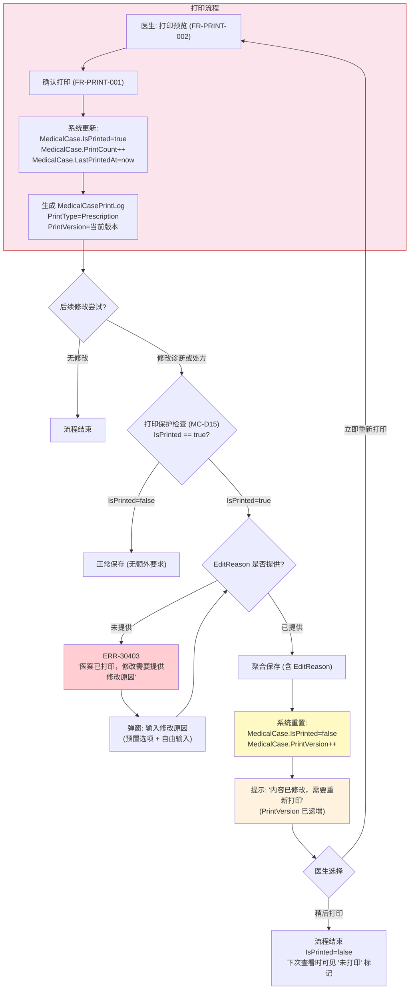

**打印版本追踪:**

```
初始:     PrintVersion=1, IsPrinted=false
首次打印: PrintVersion=1, IsPrinted=true,  PrintCount=1, PrintLog(V=1)
修改内容: PrintVersion=2, IsPrinted=false
再次打印: PrintVersion=2, IsPrinted=true,  PrintCount=2, PrintLog(V=2)
再次修改: PrintVersion=3, IsPrinted=false
```

### 7.3 编辑模式切换

Medical Case 编辑界面支持 Clinical 模式和 Management 模式两种工作方式。

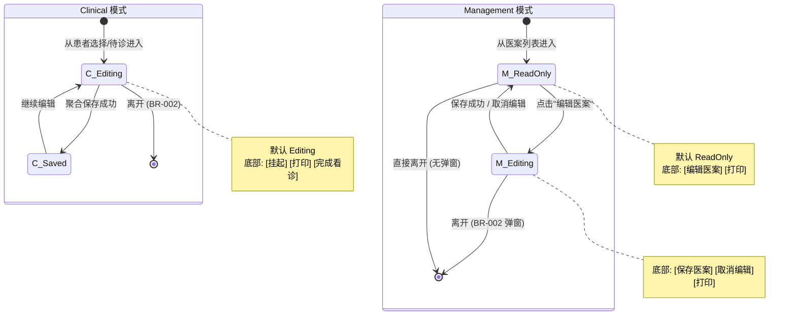

| 模式 | 状态 | 底部按钮 |
|------|------|----------|
| Clinical | Editing | [挂起医案] [打印处方笺] [完成看诊] |
| Management | ReadOnly | [编辑医案] [打印处方笺] |
| Management | Editing | [保存医案] [取消编辑] [打印处方笺] |

---

## 八、跨模块联动影响

### 8.1 药材禁用联动

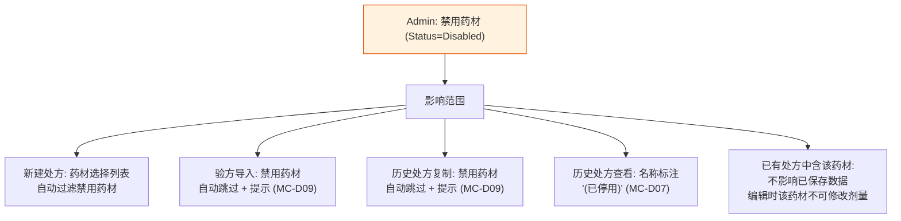

### 8.2 Registration 医案取消联动

医案取消时，Registration 根据 Source 执行不同的状态回退策略:

| 触发事件 | Source=Receptionist | Source=Doctor |
|---------|-------------------|---------------|
| 医案创建 | Status -> InProgress | (创建即 InProgress) |
| 医案 Completed | Status -> Completed | Status -> Completed |
| 医案 Cancelled | Status -> Waiting (等前台取消); MedicalCaseId 清空 | Status -> Cancelled (自动) |

**取消挂号前置校验 (REG-BR-001)**: 无关联医案 OR 关联医案状态为 Cancelled。有 Active/Suspended/Completed 医案时拒绝取消。

**设计理由**: 职责对等 -- 前台发起的流程由前台闭环 (回退 Waiting 后手动取消)；医生自动创建的由系统自动闭环 (直接 Cancelled)。

### 8.3 患者禁用联动

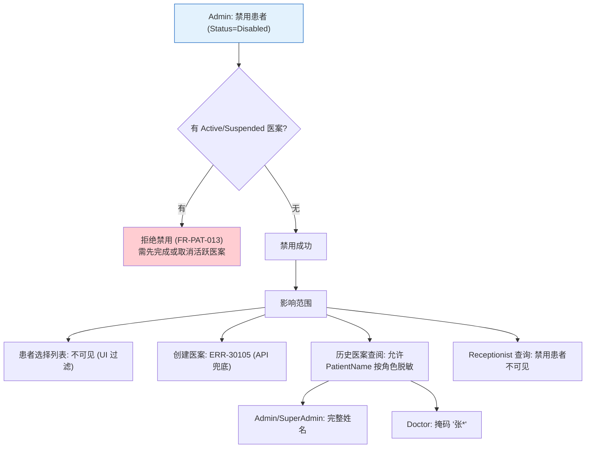

---

## 九、相关文档索引

| 文档 | 路径 | 关系 |
|------|------|------|
| 患者管理 PRD | [patients.md](../02-requirements/patients.md) | 前台挂号流程 |
| 医案管理 PRD | [medical-cases.md](../02-requirements/medical-cases.md) | 诊疗核心流程 |
| 验方管理 PRD | [formulas.md](../02-requirements/formulas.md) | 处方导入来源 |
| 药材管理 PRD | [herbs.md](../02-requirements/herbs.md) | 药材价格和状态 |
| 打印管理 PRD | [printing.md](../02-requirements/printing.md) | 打印处方笺 |
| 读卡器 PRD | [card-reader.md](../02-requirements/card-reader.md) | 身份证读卡 |
| 桌面端架构 | [desktop.md](../03-architecture/desktop.md) | UI 架构和导航 |
| 用户角色 | [user-roles.md](user-roles.md) | 角色权限定义 |
| 数据模型 | [data-model.md](../03-architecture/data-model.md) | 实体关系 |

---

## 变更记录

| 日期 | 版本 | 变更内容 |
|------|------|----------|
| 2026-02-21 | v1.0 | 初始版本，覆盖 GAP-FLOW-1 端到端临床工作流 |
| 2026-02-21 | v1.1 | 打印层级提升: Section 2.6 补充医案级打印能力说明; PrescriptionPrintLog->MedicalCasePrintLog; 交互矩阵 MC->PRINT 描述更新 |
| 2026-02-21 | v1.2 | 深度重构同步: 状态机移除 Cancelled (取消=软删除); 状态机补充 Draft->Completed 转换; 补充聚合根域方法说明 |
| 2026-02-21 | v2.0 | **设计深化**: (1) 新增两种入口模式 (前台挂号/医生直接); (2) 新增 Registration 独立挂号模块 (DoctorId 必填); (3) Section 六: 异常路径 (BR-001 碰撞处理/BR-002 离开界面/并发冲突); (4) Section 七: 子流程 (验方导入含重复药材合并策略 MC-D17/打印保护完整流程/编辑模式切换); (5) Section 八: 跨模块联动影响 (药材禁用/患者禁用); (6) 交互矩阵新增 Registration 模块 |
| 2026-02-22 | v2.1 | **Draft→Suspended (MC-D20)**: 全文 Draft 替换为 Suspended; 状态机 `[*]→Active↔Suspended→Completed`; BR-001 碰撞处理 Draft→Suspended; BR-002 离开界面 SaveDraft→Suspend; 患者禁用联动 Draft/Active→Active/Suspended; 创建医案初始状态 Active |
| 2026-03-06 | v2.2 | Section 八新增 8.2 Registration 医案取消联动 (Source 分流策略 + REG-BR-001 校验); 原 8.2 患者禁用联动重编号为 8.3 |
