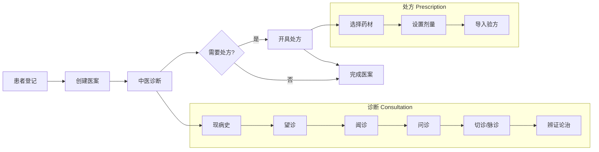

# 产品愿景与目标

## 概述

本文档定义凌隐宝堂中医诊所管理系统的产品愿景、业务目标和系统边界。

---

## 产品愿景

为中医诊所提供完整的数字化诊疗管理平台，实现从患者登记到处方开具的全流程电子化，同时保持中医诊疗的传统特色和工作习惯。

---

## 业务目标

1. **患者档案电子化** -- 建立完整的患者信息库，支持快速检索 (拼音码) 和历史诊疗记录回溯
2. **诊疗流程标准化** -- 覆盖望闻问切、辨证论治、开具处方的完整中医诊疗流程
3. **处方与验方规范化** -- 处方管理与经验方积累，支持验方复用、药材配伍管理
4. **药材库统一管理** -- 中药材的分类、价格、启用状态统一维护
5. **支持离线诊疗** -- 本地模式支持无网络环境下的完整诊疗，事后与服务端同步

---

## 核心业务流程

### 流程说明

| 步骤 | 操作 | 对应实体 |
|------|------|----------|
| 患者登记 | 创建或选择已有患者 | Patient |
| 创建医案 | 为患者创建新的诊疗记录 | MedicalCase (聚合根) |
| 中医诊断 | 填写望闻问切、辨证信息 | Consultation |
| 开具处方 | 选择药材、设置剂量，可导入验方 | Prescription + PrescriptionItem |
| 完成医案 | 保存完整诊疗记录，锁定编辑 | MedicalCase 状态变更 |

---

## 系统边界

### 系统包含

- 患者基本信息管理 (不含医保/费用结算)
- 中医诊断记录 (望闻问切、辨证)
- 中药处方管理 (药材选择、剂量设置)
- 经验方模板管理
- 中药材库管理
- 处方打印 (A5 模板)
- 本地/远程双模式运行
- 数据双向同步
- 基于角色的权限控制

### 系统不包含

- 西医诊断和处方
- 医保对接和费用结算
- 药房发药管理
- 库存进销存
- 排班和预约管理
- 电子病历 (EMR) 标准对接
- 移动端 (仅支持 Windows 桌面)

---

## 变更记录

| 日期 | 版本 | 变更内容 |
|------|------|----------|
| 2026-02-10 | v1.0 | 初始版本 |
