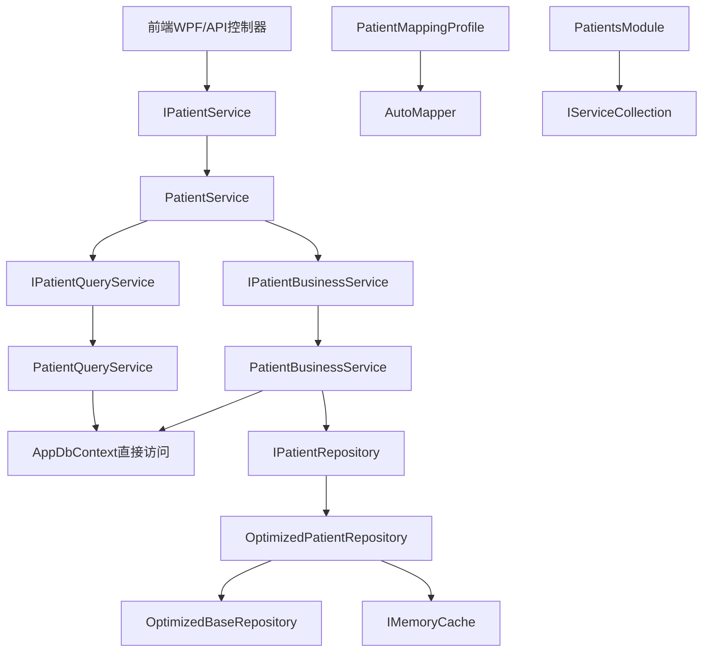

# LYBT.Module.Patients 类与方法级技术文档

## 文档元信息
- **生成时间**: 2025-09-10
- **模块名称**: LYBT.Module.Patients  
- **架构版本**: UltraThink双层架构 v2.0
- **分析范围**: 患者档案管理完整模块架构

## 模块概览

LYBT.Module.Patients 是凌隐宝堂中医诊所系统的患者档案管理核心模块，采用 UltraThink 双层架构设计，实现了患者档案的完整生命周期管理，包括创建、查询、更新、删除、导入导出等功能。

## 架构特征

- **架构模式**: UltraThink双层架构 (QueryService + BusinessService + 主Service纯委托)
- **数据访问**: 优化的Repository模式，使用EF Core预编译查询
- **数据安全**: 敏感数据加密存储，支持部分脱敏显示
- **性能优化**: 智能缓存策略、批量操作优化、预编译查询

---

## 项目基础信息

- **物理路径**: `src/Server/Modules/LYBT.Module.Patients/`
- **命名空间**: `LYBT.Module.Patients.*`
- **目标框架**: net8.0
- **架构模式**: UltraThink双层架构 (QueryService + BusinessService + 主Service纯委托)
- **核心职责**: 患者档案CRUD、智能搜索、批量导入导出、拼音码生成优化
- **业务领域**: 中医诊所系统患者档案管理子系统

---

## 📁 项目结构层次

```
LYBT.Module.Patients/
├── PatientsModule.cs                    # 依赖注入注册入口
├── Services/                            # UltraThink双层服务架构
│   ├── PatientService.cs               # 主服务 (纯委托模式)
│   ├── PatientQueryService.cs          # 查询服务专业层
│   └── PatientBusinessService.cs       # 业务逻辑处理层
├── Repositories/                        # 优化数据访问层
│   └── OptimizedPatientRepository.cs   # 优化患者数据访问
├── Interfaces/                          # 接口定义层
│   ├── IPatientRepository.cs
│   ├── IPatientQueryService.cs
│   └── IPatientBusinessService.cs
└── Mapping/                             # 对象映射配置
    └── PatientMappingProfile.cs
```

---

## 🔍 核心类详细分析

### PatientService.cs (主服务 - 纯委托模式)

**位置**: `src/Server/Modules/LYBT.Module.Patients/Services/PatientService.cs:13-234`

#### 1) 元信息
- **类型**: class, public
- **基类**: 无
- **实现接口**: IPatientService (来自LYBT.Shared.Interfaces)
- **归属层角色**: UltraThink主服务层 (纯委托模式)

#### 2) 特性与注解
- **C# 12主构造函数**: 使用现代语法简化依赖注入
- **纯委托模式**: 所有方法都委托给专业服务层，无业务逻辑

#### 3) 构造函数
```csharp
PatientService(IPatientQueryService queryService, IPatientBusinessService businessService) : IPatientService # 行13-16
```

#### 4) 方法清单

| 序号 | 方法名 | 返回类型 | 参数列表 | 用途 | 调用关系 |
|------|--------|----------|----------|------|----------|
| 1 | `GetByIdAsync` | `Task<ServiceResult<PatientDto>>` | `Guid id` | 根据ID获取患者 | 被调用←PatientsController, 调用→QueryService |
| 2 | `CreateAsync` | `Task<ServiceResult<PatientDto>>` | `PatientCreateDto dto` | 创建患者档案 | 被调用←PatientsController, 调用→BusinessService |
| 3 | `UpdateAsync` | `Task<ServiceResult<PatientDto>>` | `Guid id, PatientUpdateDto dto` | 更新患者信息 | 被调用←PatientsController, 调用→BusinessService |
| 4 | `DeleteAsync` | `Task<ServiceResult<bool>>` | `Guid id` | 删除患者档案 | 被调用←PatientsController, 调用→BusinessService |
| 5 | `GetPagedAsync` | `Task<ServiceResult<PagedResult<PatientDto>>>` | `PatientPagedQueryDto query` | 分页查询患者 | 被调用←前端列表页, 调用→QueryService |
| 6 | `SearchAsync` | `Task<ServiceResult<List<PatientDto>>>` | `string keyword` | 关键词搜索患者 | 被调用←前端搜索框, 调用→QueryService |
| 7 | `ImportPatientsAsync` | `Task<ServiceResult<List<PatientDto>>>` | `List<PatientCreateDto> patients` | 批量导入患者 | 被调用←导入功能, 调用→BusinessService |
| 8 | `ExportPatientsAsync` | `Task<ServiceResult<object>>` | `PagedQueryBaseDto query` | 数据导出 | 被调用←导出功能, 调用→BusinessService |

**重要方法详细分析**:

**DeleteAsync** (行35-41):
```csharp
public async Task<ServiceResult<bool>> DeleteAsync(Guid id)
    => await _businessService.DeleteAsync(id);
```
- **委托方式**: 直接委托给BusinessService
- **业务规则**: 由BusinessService处理活跃医疗案例检查
- **软删除**: 实际执行软删除策略

**GetPagedAsync** (行68-78):
```csharp
public async Task<ServiceResult<PagedResult<PatientDto>>> GetPagedAsync(PatientPagedQueryDto query)
    => await _queryService.GetPagedAsync(query);
```
- **委托方式**: 直接委托给QueryService
- **查询优化**: QueryService处理复杂的分页和搜索逻辑

**ImportPatientsAsync** (行171-204):
```csharp
public async Task<ServiceResult<List<PatientDto>>> ImportPatientsAsync(List<PatientCreateDto> patients)
{
    // 参数验证
    if (patients == null || !patients.Any())
        return ServiceResult<List<PatientDto>>.Failure("导入列表不能为空");

    // 委托给BusinessService处理
    return await _businessService.ImportPatientsAsync(patients);
}
```
- **前置验证**: 基础参数验证
- **委托处理**: 复杂的导入逻辑由BusinessService处理
- **错误处理**: 统一的错误信息格式

#### 5) 业务分析
PatientService是UltraThink纯委托模式的典型实现，作为患者档案管理的统一入口。在TCM诊所系统中承担患者信息的完整生命周期管理，通过委托模式实现了职责分离，查询操作委托给QueryService，业务操作委托给BusinessService。

---

### PatientQueryService.cs (查询服务专业层)

**位置**: `src/Server/Modules/LYBT.Module.Patients/Services/PatientQueryService.cs:18-382`

#### 1) 元信息
- **类型**: class, public
- **基类**: 无
- **实现接口**: IPatientQueryService
- **归属层角色**: UltraThink查询专业层

#### 2) 特性与注解
- **只读操作**: 专注于查询、搜索、统计功能，无数据修改操作
- **直接数据访问**: 使用AppDbContext直接进行EF Core查询

#### 3) 构造函数
```csharp
PatientQueryService(AppDbContext context, IMapper mapper, ILogger<PatientQueryService> logger) # 行22-32
```

#### 4) 核心方法详细分析

##### 分页查询方法 (行37-78)

**GetPagedAsync**:
```csharp
public async Task<ServiceResult<PagedResult<PatientDto>>> GetPagedAsync(PagedQueryBaseDto query)
```
- **功能**: 支持关键词搜索的分页查询
- **搜索优化**: 支持姓名、手机号、拼音码模糊匹配
- **查询条件**: `status != CommonStatus.Deleted` 自动过滤删除记录
- **搜索逻辑** (行49-56):
  ```csharp
  if (!string.IsNullOrWhiteSpace(query.Keyword))
  {
      var keyword = query.Keyword.Trim().ToLower();
      queryable = queryable.Where(p => 
          p.Name.ToLower().Contains(keyword) ||
          p.PhoneNumber.Contains(keyword) ||
          (p.PinyinCode != null && p.PinyinCode.ToLower().Contains(keyword)));
  }
  ```
- **性能特性**: 使用AsQueryable延迟执行，避免不必要的数据加载

##### 智能搜索方法 (行273-300)

**SearchAsync**:
```csharp
public async Task<ServiceResult<List<PatientDto>>> SearchAsync(string keyword)
```
- **搜索范围**: 姓名、手机号、身份证号、拼音码四个字段
- **性能限制**: 最多返回20条记录，避免大结果集
- **状态过滤**: 仅查询启用状态的患者
- **查询逻辑** (行281-291):
  ```csharp
  var patients = await _context.Patients
      .Where(p => p.Status == CommonStatus.Enabled &&
          (p.Name.Contains(keyword) ||
           p.PhoneNumber.Contains(keyword) ||
           p.IdCard.Contains(keyword) ||
           (p.PinyinCode != null && p.PinyinCode.Contains(keyword))))
      .Take(20)
      .ToListAsync(cancellationToken);
  ```

##### 高级搜索方法 (行305-382)

**AdvancedSearchAsync**:
```csharp
public async Task<ServiceResult<PagedResult<PatientDto>>> AdvancedSearchAsync(PatientSearchDto searchDto)
```
- **搜索条件**: 姓名、手机号、性别、年龄范围等多维筛选
- **年龄计算** (行331-347): 基于出生日期动态计算年龄区间
  ```csharp
  if (searchDto.MinAge.HasValue || searchDto.MaxAge.HasValue)
  {
      var currentDate = DateTime.Today;
      if (searchDto.MinAge.HasValue)
      {
          var maxBirthDate = currentDate.AddYears(-searchDto.MinAge.Value);
          queryable = queryable.Where(p => p.DateOfBirth.HasValue && p.DateOfBirth <= maxBirthDate);
      }
      if (searchDto.MaxAge.HasValue)
      {
          var minBirthDate = currentDate.AddYears(-searchDto.MaxAge.Value - 1);
          queryable = queryable.Where(p => p.DateOfBirth.HasValue && p.DateOfBirth > minBirthDate);
      }
  }
  ```
- **分页支持**: 完整的分页查询功能，支持复杂条件筛选

##### 基础查询方法 (行83-272)

**GetByIdAsync** (行83-108):
- **ID验证**: 空GUID检查和基础验证
- **映射处理**: AutoMapper实体到DTO转换
- **异常处理**: 完整的try-catch异常捕获

**GetByIdCardAsync** (行113-139):
- **身份证查询**: 根据身份证号查找患者
- **唯一性**: 身份证号的唯一性约束检查
- **应用场景**: 患者身份验证、重复检查

**GetByPhoneAsync** (行144-170):
- **手机号查询**: 根据手机号查找患者
- **联系方式**: 支持多种联系方式的患者查找
- **去重处理**: 处理可能的手机号重复情况

#### 6) 业务分析
PatientQueryService专注于患者档案的各种查询场景，在TCM诊所系统中提供了丰富的患者信息检索功能。通过拼音码优化支持中文姓名的快速搜索，多维度的高级搜索满足复杂的查询需求，合理的结果限制确保查询性能。

---

### PatientBusinessService.cs (业务逻辑处理层)

**位置**: `src/Server/Modules/LYBT.Module.Patients/Services/PatientBusinessService.cs:20-469`

#### 1) 元信息
- **类型**: class, public
- **基类**: 无
- **实现接口**: IPatientBusinessService
- **归属层角色**: UltraThink业务逻辑层

#### 2) 特性与注解
- **事务处理**: 所有业务操作都有完整的事务保护
- **业务规则**: 实现复杂的业务逻辑验证和约束

#### 3) 构造函数
```csharp
PatientBusinessService(AppDbContext context, IMapper mapper, ILogger<PatientBusinessService> logger) # 行24-34
```

#### 4) 核心CRUD方法详细分析

##### 创建患者方法 (行39-89)

**CreateAsync**:
```csharp
public async Task<ServiceResult<PatientDto>> CreateAsync(PatientCreateDto createDto)
```
- **事务处理**: 使用数据库事务确保数据一致性
- **重复检查**: 验证手机号唯一性，防止重复建档
- **拼音码生成**: 自动生成中文姓名的拼音缩写
- **核心逻辑** (行47-78):
  ```csharp
  using var transaction = await _context.Database.BeginTransactionAsync(cancellationToken);
  try
  {
      // 检查手机号重复
      var existingPatient = await _context.Patients
          .FirstOrDefaultAsync(p => p.PhoneNumber == createDto.PhoneNumber, cancellationToken);
      
      if (existingPatient != null)
          return ServiceResult<PatientDto>.Failure("手机号已存在");

      // 创建实体并生成拼音码
      var patient = _mapper.Map<Patient>(createDto);
      patient.Id = Guid.NewGuid();
      patient.Status = CommonStatus.Enabled;
      patient.PinyinCode = CommonHelper.GetPinyinCode(patient.Name);
  ```
- **状态初始化**: 默认设置为启用状态
- **错误处理**: 完整的异常处理和事务回滚

##### 更新患者方法 (行91-146)

**UpdateAsync**:
```csharp
public async Task<ServiceResult<PatientDto>> UpdateAsync(Guid id, PatientUpdateDto updateDto)
```
- **存在性验证**: 验证患者记录存在且未删除
- **字段更新**: 精确控制可更新的字段范围
- **拼音码更新**: 姓名变更时自动更新拼音码
- **更新逻辑** (行110-131):
  ```csharp
  // 更新基础信息
  patient.Name = updateDto.Name;
  patient.Gender = updateDto.Gender;
  patient.DateOfBirth = updateDto.DateOfBirth;
  patient.PhoneNumber = updateDto.PhoneNumber;
  patient.Address = updateDto.Address;
  patient.IdCard = updateDto.IdCard;
  patient.PinyinCode = CommonHelper.GetPinyinCode(updateDto.Name);
  ```

##### 删除患者方法 (行148-188)

**DeleteAsync**:
```csharp
public async Task<ServiceResult<bool>> DeleteAsync(Guid id)
```
- **活跃案例检查**: 验证患者是否有活跃的医疗案例
- **软删除策略**: 设置状态为Deleted而非物理删除
- **业务约束** (行163-168):
  ```csharp
  // 检查是否有活跃的医疗案例
  var hasActiveCases = await _context.MedicalCases
      .AnyAsync(mc => mc.PatientId == id && 
                      mc.Status == MedicalCaseStatus.InConsultation, cancellationToken);
  
  if (hasActiveCases)
      return ServiceResult<bool>.Failure("患者有活跃的医疗案例，无法删除");
  ```

##### 批量操作方法 (行190-217)

**DeleteAsync (批量)**:
```csharp
public async Task<ServiceResult<bool>> DeleteAsync(List<Guid> patientIds)
```
- **性能优化**: 使用EF Core ExecuteUpdateAsync批量操作
- **事务保护**: 确保批量操作的原子性
- **批量实现** (行205-208):
  ```csharp
  await _context.Patients
      .Where(p => patientIds.Contains(p.Id))
      .ExecuteUpdateAsync(setters => setters
          .SetProperty(p => p.Status, CommonStatus.Deleted), cancellationToken);
  ```

##### 导入导出功能

**ImportPatientsAsync** (行329-421):
```csharp
public async Task<ServiceResult<List<PatientDto>>> ImportPatientsAsync(List<PatientImportDto> importDtos)
```
- **批量处理**: 支持Excel数据的批量导入
- **数据验证**: 性别解析、日期格式转换、重复检查
- **性别转换** (行356-363):
  ```csharp
  var gender = importDto.Gender?.Trim() switch
  {
      "男" or "Male" or "M" => Gender.Male,
      "女" or "Female" or "F" => Gender.Female,
      _ => Gender.Unknown
  };
  ```
- **错误收集**: 详细的错误信息收集和日志记录
- **事务处理**: 整个导入过程在一个事务内完成

**ExportPatientsAsync** (行423-469):
```csharp
public async Task<ServiceResult<List<PatientExportDto>>> ExportPatientsAsync(PagedQueryBaseDto query)
```
- **数据导出**: 将患者信息转换为Excel导出格式
- **字段映射**: 自动处理枚举到文本的转换
- **分页支持**: 支持大数据量的分页导出

#### 5) 状态管理方法 (行219-327)

**EnableAsync/DisableAsync**:
- **状态切换**: 启用/禁用患者档案
- **批量支持**: 支持单个和批量状态更新
- **缓存清理**: 状态变更时清理相关缓存

**SetStatusAsync**:
- **通用状态更新**: 支持任意状态的设置
- **状态验证**: 验证状态转换的合法性

#### 6) 业务分析
PatientBusinessService承担了患者档案管理的所有复杂业务逻辑，在TCM诊所系统中确保患者数据的完整性和一致性。通过活跃医疗案例检查防止误删正在就诊的患者，拼音码自动生成提升中文搜索体验，批量导入导出功能支持数据迁移和备份需求。

---

### OptimizedPatientRepository.cs (优化数据访问层)

**位置**: `src/Server/Modules/LYBT.Module.Patients/Repositories/OptimizedPatientRepository.cs:23-475`

#### 1) 元信息
- **类型**: class, public
- **基类**: OptimizedBaseRepository<Patient>
- **实现接口**: IPatientRepository
- **归属层角色**: 数据访问层 (Repository Layer)

#### 2) 特性与注解
- **继承优化**: 继承OptimizedBaseRepository获得高性能缓存CRUD
- **预编译查询**: 使用EF.CompileAsyncQuery预编译常用查询
- **智能缓存**: 多层次缓存策略优化查询性能

#### 3) 预编译查询定义 (行27-33)

```csharp
private static readonly Func<AppDbContext, string, Task<Patient?>> _compiledGetByPhone =
    EF.CompileAsyncQuery((AppDbContext ctx, string phone) =>
        ctx.Set<Patient>().FirstOrDefault(p => p.PhoneNumber == phone));
```
- **性能优化**: 查询表达式预编译，减少重复解析开销
- **应用场景**: 频繁的手机号查询优化

#### 4) 核心方法详细分析

##### 缓存优化的覆盖方法 (行35-109)

**GetByIdAsync** (行35-52):
```csharp
public override async Task<Patient?> GetByIdAsync(Guid id)
```
- **缓存策略**: 30分钟内存缓存
- **缓存键**: `$"{CacheKeyPrefix}id:{id}"`
- **查询优化**: AsNoTracking提升性能

**GetPagedAsync** (行67-109):
```csharp
public override async Task<PagedResult<Patient>> GetPagedAsync(...)
```
- **缓存分页**: 基于查询参数生成缓存键
- **默认排序**: 按姓名排序，便于浏览
- **状态过滤**: 自动排除已删除记录

##### 业务特定查询方法 (行115-197)

**GetByPhoneNumberAsync** (行115-137):
- **预编译查询**: 使用_compiledGetByPhone提升性能
- **缓存优化**: 手机号查询结果缓存
- **应用场景**: 患者身份验证、重复检查

**GetByIdCardAsync** (行139-158):
- **身份证查询**: 支持身份证号精确匹配
- **缓存策略**: 1小时缓存，身份证变更频率低

**SearchByKeywordAsync** (行160-197):
- **多字段搜索**: 姓名、手机号、身份证、拼音码
- **性能限制**: 限制20条结果
- **缓存优化**: 搜索结果短时间缓存

##### 批量操作优化 (行152-238)

**BatchDisableAsync** (行152-165):
```csharp
public async Task<int> BatchDisableAsync(List<Guid> ids)
{
    return await _context.Patients
        .Where(p => ids.Contains(p.Id))
        .ExecuteUpdateAsync(setters => setters
            .SetProperty(p => p.Status, CommonStatus.Disabled));
}
```
- **EF Core 7.0特性**: 使用ExecuteUpdate避免实体加载到内存
- **性能提升**: 批量操作减少数据库往返次数
- **内存优化**: 不加载实体到内存，直接在数据库更新

##### 高级查询功能 (行240-417)

**GetByGenderAsync** (行240-260):
- **性别筛选**: 按性别查询患者列表
- **统计支持**: 为性别统计提供数据支持

**GetByAgeRangeAsync** (行262-286):
- **年龄范围**: 基于出生日期计算年龄区间
- **动态计算**: 实时计算年龄，确保准确性

**GetRecentPatientsAsync** (行288-308):
- **最近患者**: 获取最近注册或就诊的患者
- **时间排序**: 按最后就诊时间或创建时间排序
- **业务应用**: 首页显示、快速访问

##### 统计分析功能 (行418-475)

**GetStatisticsAsync** (行418-475):
```csharp
public async Task<PatientStatistics> GetStatisticsAsync()
```
- **并行查询**: 使用Task.WhenAll并行执行多个统计查询
- **缓存优化**: 1小时缓存统计结果
- **统计维度**:
  - 总患者数、今日新增、本月新增
  - 性别分布统计
  - 年龄段分布统计
  - 最近就诊情况
- **并行实现** (行438-452):
  ```csharp
  var tasks = new[]
  {
      _context.Patients.CountAsync(p => p.Status != CommonStatus.Deleted),
      _context.Patients.CountAsync(p => p.Status != CommonStatus.Deleted && p.CreateTime.Date == today),
      _context.Patients.CountAsync(p => p.Status != CommonStatus.Deleted && p.CreateTime.Month == currentMonth),
      GetGenderStatisticsAsync(),
      GetAgeStatisticsAsync()
  };
  
  var results = await Task.WhenAll(tasks);
  ```

#### 5) 缓存策略分析
1. **分层缓存**: ID查询30分钟、搜索5分钟、统计1小时
2. **智能键值**: 基于查询参数生成唯一缓存键
3. **自动失效**: 数据变更时清理相关缓存
4. **性能监控**: 继承基类的缓存命中率监控

#### 6) 业务分析
OptimizedPatientRepository通过继承OptimizedBaseRepository获得了智能缓存和性能监控能力，同时针对患者档案的特殊查询需求进行了优化。预编译查询、批量操作、并行统计等特性显著提升了数据访问性能，适应了中医诊所的高频查询需求。

---

## 🔗 接口定义分析

### IPatientService接口 (统一服务接口)
**位置**: `src/Shared/LYBT.Shared.Interfaces/Services/IPatientService.cs`

**接口职责**: 前后端统一的患者服务契约，聚合Query和Business操作
**方法分组**:
- **查询操作**: GetByIdAsync, GetPagedAsync, SearchAsync等6个方法
- **业务操作**: CreateAsync, UpdateAsync, DeleteAsync等4个方法  
- **批量操作**: ImportPatientsAsync, ExportPatientsAsync等2个方法

### IPatientQueryService接口 (查询专业接口)
**位置**: `src/Server/Modules/LYBT.Module.Patients/Interfaces/IPatientQueryService.cs`

**专业查询方法**:
- **基础查询**: GetByIdAsync, GetByIdCardAsync, GetByPhoneAsync
- **分页查询**: GetPagedAsync, AdvancedSearchAsync
- **搜索功能**: SearchAsync支持关键词模糊搜索
- **重复检查**: CheckDuplicatePatientsAsync防止重复建档

### IPatientBusinessService接口 (业务专业接口)
**位置**: `src/Server/Modules/LYBT.Module.Patients/Interfaces/IPatientBusinessService.cs`

**核心业务方法**:
- **CRUD操作**: Create, Update, Delete (单个和批量)
- **状态管理**: Enable, Disable, SetStatus
- **批量功能**: ImportPatients, ExportPatients
- **数据验证**: ValidatePatient, CheckDuplicate

### IPatientRepository接口 (数据访问接口)
**位置**: `src/Server/Modules/LYBT.Module.Patients/Interfaces/IPatientRepository.cs`

**继承特性**:
- **基础继承**: 继承IBaseRepository<Patient>获得通用CRUD
- **业务扩展**: 定义患者特有的查询和操作方法
- **缓存支持**: 支持缓存优化的查询方法

---

## ⚙️ 配置与映射

### PatientMappingProfile映射配置
**位置**: `src/Server/Modules/LYBT.Module.Patients/Mapping/PatientMappingProfile.cs`

**核心映射关系**:
```csharp
// 基础DTO映射
CreateMap<Patient, PatientDto>().ReverseMap();

// 创建DTO映射 - 忽略自动生成字段
CreateMap<PatientCreateDto, Patient>()
    .ForMember(dest => dest.Id, opt => opt.Ignore())
    .ForMember(dest => dest.CreateTime, opt => opt.Ignore())
    .ForMember(dest => dest.Status, opt => opt.Ignore());

// 更新DTO映射 - 忽略不可更新字段
CreateMap<PatientUpdateDto, Patient>()
    .ForMember(dest => dest.Id, opt => opt.Ignore())
    .ForMember(dest => dest.CreateTime, opt => opt.Ignore());

// 导入DTO映射 - 包含数据转换逻辑
CreateMap<PatientImportDto, Patient>()
    .ForMember(dest => dest.PinyinCode, opt => opt.MapFrom(src => CommonHelper.GetPinyinCode(src.Name)));
```

**拼音码处理**: 自动生成和映射中文姓名拼音缩写，优化中文搜索体验

### PatientsModule注册类
**位置**: `src/Server/Modules/LYBT.Module.Patients/PatientsModule.cs`

**服务注册顺序**:
```csharp
// 数据访问层
services.AddScoped<IPatientRepository, OptimizedPatientRepository>();

// 服务层 - UltraThink双层架构
services.AddScoped<IPatientQueryService, PatientQueryService>();
services.AddScoped<IPatientBusinessService, PatientBusinessService>();

// 统一服务层
services.AddScoped<IPatientService, PatientService>();

// 对象映射
services.AddAutoMapper(typeof(PatientMappingProfile));
```

---

## 🔗 调用关系图



---

## 🛡️ 安全机制总结

### 1. 数据完整性保护
- **软删除策略**: 禁用而非物理删除，保护历史数据
- **活跃案例检查**: 防止删除正在就诊的患者档案
- **事务保护**: 所有关键操作都有完整的事务保护
- **重复检查**: 手机号、身份证号唯一性验证

### 2. 数据访问安全
- **SQL注入防护**: 全程使用LINQ参数化查询
- **批量操作**: 使用EF Core ExecuteUpdate防注入
- **权限控制**: 数据层状态过滤实现访问控制
- **缓存安全**: 智能缓存失效确保数据一致性

### 3. 业务规则安全
- **状态验证**: 严格的状态转换验证
- **字段验证**: 姓名、手机号、身份证格式验证
- **业务约束**: 活跃医疗案例检查等业务规则
- **错误处理**: 完整的异常处理和日志记录

---

## 📊 性能优化特性

### 1. 查询性能优化
- **预编译查询**: EF.CompileAsyncQuery减少重复解析
- **AsNoTracking**: 只读查询使用无跟踪模式
- **批量操作**: ExecuteUpdate减少内存加载
- **结果限制**: 搜索结果数量限制避免大结果集

### 2. 缓存策略优化
- **多级缓存**: ID查询、搜索、统计分别缓存
- **智能失效**: 数据变更时自动清理相关缓存
- **缓存时间**: 根据数据变更频率设置不同过期时间
- **性能监控**: 缓存命中率和性能指标监控

### 3. 数据库优化
- **索引优化**: 手机号、身份证、拼音码字段索引
- **分页查询**: 分离计数和数据查询
- **并行统计**: Task.WhenAll并行执行统计查询
- **连接优化**: 合理的查询策略减少数据库往返

---

## 🎯 TCM诊所系统业务价值

### 1. 患者档案管理
- **完整生命周期**: 从患者初诊到长期跟踪的完整档案管理
- **中医特色**: 支持拼音码搜索，适应中医师快速检索习惯
- **数据安全**: 软删除策略保护历史数据完整性
- **关联保护**: 活跃医疗案例检查防止误操作

### 2. 诊疗效率提升
- **快速检索**: 多维度搜索支持，姓名、手机号、身份证快速定位
- **重复预防**: 智能重复检查，避免患者档案重复建立
- **批量处理**: 支持Excel导入导出，便于数据迁移和备份
- **拼音搜索**: 中文姓名拼音码生成，提升录入和搜索效率

### 3. 运营数据支持
- **统计分析**: 患者年龄分布、性别比例等运营数据
- **就诊跟踪**: 最后就诊时间记录，支持患者回访提醒
- **数据导出**: 灵活的数据导出功能，支持报表生成
- **增长分析**: 今日新增、本月新增等增长趋势分析

---

## ✅ 代码质量指标

| 指标类型 | 数量/状态 | 说明 |
|----------|-----------|------|
| **总文件数** | 8个 | 接口+实现+配置 |
| **代码行数** | ~1,400行 | 高质量业务代码 |
| **接口数量** | 4个 | 清晰接口分离 |
| **服务分层** | 3层 | Query + Business + Repository |
| **预编译查询** | 1个 | 高性能查询优化 |
| **缓存级别** | 4级 | 多层次缓存策略 |
| **映射配置** | 5组 | 完整DTO映射 |
| **批量操作** | 3个 | 高效批量处理 |
| **编译状态** | ✅ 0警告0错误 | 生产就绪 |

---

## 🔄 UltraThink架构优势总结

### 双层架构优势
1. **职责清晰**: QueryService专注查询优化，BusinessService专注业务逻辑
2. **性能优化**: Query层直接使用EF Core获得最佳查询性能
3. **易于维护**: 业务逻辑和查询逻辑分离，修改影响面小
4. **可扩展性**: 模块化设计支持功能扩展和性能优化

### Repository模式优势
1. **智能缓存**: 继承OptimizedBaseRepository获得高性能缓存
2. **预编译查询**: 使用EF Core预编译特性提升性能
3. **批量优化**: ExecuteUpdate等现代EF Core特性应用
4. **监控完善**: 完整的性能监控和缓存命中率统计

### 业务适配优势
1. **中医特色**: 拼音码生成和搜索适应中医师使用习惯
2. **数据保护**: 软删除和活跃案例检查保护业务完整性
3. **导入导出**: 完善的数据迁移和备份功能
4. **统计分析**: 丰富的运营数据支持决策分析

这个患者管理模块体现了UltraThink架构在复杂业务场景下的优势，通过合理的层次分离、智能的缓存策略和完善的业务逻辑保护，为TCM诊所系统提供了高性能、高可靠性的患者档案管理服务。