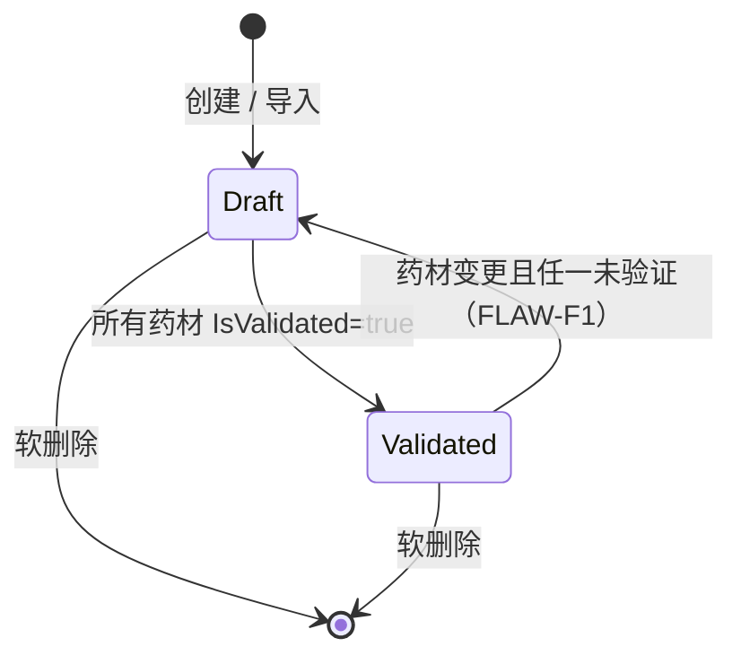

# 验方管理 (Formula Management)

> 版本: v2.0 | 日期: 2026-06-15 | 状态: 重建

## 模块概述

验方（经验方/Formula）是中医诊所在长期临床实践中积累的固定药方模板，由若干味药材按特定剂量、煎法组成。验方管理模块负责验方模板的创建、编辑、共享、验证和批量导入导出，是连接药材库与处方的关键桥梁：医生开具处方时可一键导入经验方药材组成，减少重复录入。

本模块的核心特色是**延迟绑定 + 验证工作流**——从旧系统导入的验方药材名称（自由文本）可暂不关联系统药材库，后续通过验证端点逐个绑定到系统药材（Herb）。所有药材完成验证后验方自动晋升为 `Validated` 状态；若已验证验方的药材被修改，系统会自动降级回 `Draft`，确保数据一致性（FLAW-F1 修复）。

## 业务规则

1. **所有权模型**: Doctor 仅可见自己创建的 + `IsShared=true` 的验方；Admin/SuperAdmin 可见全部。端点受 `DoctorOrReceptionist` 策略保护。
2. **验证状态机**: `Draft ↔ Validated`。新建验方默认 `Draft`；当且仅当所有 `FormulaHerbItem.IsValidated=true` 时晋升 `Validated`。
3. **药材绑定**: `OriginalHerbName`（自由文本）→ `SelectedHerbId`（系统药材）；`IsValidated` 当且仅当 `HerbId.HasValue`。
4. **FLAW-F1 修复**: 药材增删改会触发状态重新评估；若任一药材未验证，已为 `Validated` 的验方自动降级回 `Draft`。
5. **价格策略**: 经验方本身不含价格（FORM-D02）。处方导入验方时根据 `HerbId` 从药材库获取当前单价，价格计算在处方层完成。
6. **批量导入**: 导入验方默认为 `Draft`；若导入时通过拼音/名称匹配到所有系统药材，则自动晋升为 `Validated`。
7. **记录-Only 模式**: 不管理库存，仅维护药材基础信息。

### 验证状态机

### 用户角色权限

| 角色 | 列表可见范围 | CRUD 范围 | 验证/批量操作 |
|------|------------|----------|--------------|
| Receptionist (0) | 无权限 | 无权限 | 无权限 |
| Doctor (1) | 自己创建的 + IsShared=true | 仅自己创建的 | 仅自己创建的 |
| Admin (10) | 全部 | 全部 | 全部 |
| SuperAdmin (100) | 全部 | 全部 | 全部 |

## 用户故事

### US-FORM-001: 分页查询验方列表（按所有权）

**角色**: 医生、管理员
**优先级**: Must
**状态**: ✅ 已实现

**作为** 医生或管理员，**我想要** 分页浏览和搜索验方列表，**以便** 我可以快速找到需要的验方用于开方或参考。

**验收标准**:
- [ ] Doctor 查询 → 仅返回 `CreatedBy=自己` 或 `IsShared=true` 的验方
- [ ] Admin 查询 → 返回全部验方
- [ ] 支持按名称（keyword）和分类（category）筛选
- [ ] 列表项包含 HerbCount（药材数量），不显示价格
- [ ] 分页参数校验：page ≥ 1，pageSize 1-100

**业务规则**:
1. Admin 返回全部验方；Doctor 返回自己创建的 + 共享的验方
2. 支持按名称、拼音码关键词搜索
3. 列表包含药材数量，不显示价格（经验方不涉及价格）
4. 默认按 CreatedAt DESC 排序

**双模式**:
| 模式 | 行为 |
|------|------|
| 远程 | GET `/api/v1/Formulas?keyword=&category=&page=&pageSize=` |
| 本地 | 完全一致（通过统一 Service 层） |

**实现参考**: `src/Server/Services/LYBT.WebAPI/Controllers/FormulasController.cs:23`、`src/Server/Modules/LYBT.Module.Formula/Interfaces/IFormulaService.cs:11`

---

### US-FORM-002: 查看验方详情

**角色**: 医生、管理员
**优先级**: Must
**状态**: ⚠️ 无所有权检查（admin 可读他人非共享验方）

**作为** 医生，**我想要** 查看验方的完整信息和药材组成，**以便** 我可以了解验方的具体内容并决定是否用于开方。

**验收标准**:
- [ ] 有效 ID → 返回 `FormulaDetailDto` 含完整 Herbs 列表
- [ ] 每味药材返回验证状态 `IsValidated`
- [ ] Doctor 访问他人非共享验方 → 返回 403

**业务规则**:
1. 返回 FormulaDetailDto 含完整 Herbs 列表
2. 包含每味药材的验证状态（IsValidated）和绑定状态（HerbId 是否有值）
3. 共享验方对 Doctor 只读

**双模式**:
| 模式 | 行为 |
|------|------|
| 远程 | GET `/api/v1/Formulas/{id}` |
| 本地 | 完全一致（通过统一 Service 层） |

**实现参考**: `src/Server/Services/LYBT.WebAPI/Controllers/FormulasController.cs:23`

---

### US-FORM-003: 创建验方（Draft 初始状态）

**角色**: 医生、管理员
**优先级**: Must
**状态**: ✅ 已实现

**作为** 医生，**我想要** 创建新的经验方模板并录入药材组成，**以便** 我的临床经验方可以数字化保存，开方时快速复用。

**验收标准**:
- [ ] 药材列表为空 → 返回 400 验证失败
- [ ] 创建成功 → `ValidationStatus=Draft`，记录 UserId 和 CreatedBy
- [ ] 名称必填（2-200 字符）
- [ ] 药材组成至少 1 味

**业务规则**:
1. 名称必填，最大 200 字符（FORM-14：实体定义 200）
2. 功效（Effect）、用法（Usage）、主治（Indication）可选，最长 500-1000 字符
3. 药材组成至少 1 味
4. 默认类型为 Experience（经验方）
5. 初始 `ValidationStatus=Draft`
6. 记录 UserId 和 CreatedBy（用于所有权判断）

**双模式**:
| 模式 | 行为 |
|------|------|
| 远程 | POST `/api/v1/Formulas` |
| 本地 | 完全一致（通过统一 Service 层） |

**实现参考**: `src/Server/Services/LYBT.WebAPI/Controllers/FormulasController.cs:23`、`src/Server/Modules/LYBT.Module.Formula/Interfaces/IFormulaService.cs:11`

---

### US-FORM-004: 更新验方（触发状态重新评估）

**角色**: 医生、管理员
**优先级**: Must
**状态**: ✅ 已实现

**作为** 医生，**我想要** 修改自己创建的验方信息和药材组成，**以便** 验方内容可以随临床经验积累持续优化。

**验收标准**:
- [ ] Doctor 编辑 `CreatedBy≠自己` 的验方 → 返回 403
- [ ] 更新 Herbs 列表 → 原有 Herbs 全部替换为新列表
- [ ] 若变更导致任一药材未验证 → `ValidationStatus` 自动降级为 `Draft`（FLAW-F1）

**业务规则**:
1. 统一所有权检查（Doctor 只能编辑自己的；Admin 可编辑全部）
2. 药材组成采用粗粒度替换策略：完整替换 Herbs 集合
3. **FLAW-F1**：药材增删改会触发状态重新评估；若任一药材 `IsValidated=false`，已为 `Validated` 的验方自动降级回 `Draft`
4. 药材组成至少 1 味

**双模式**:
| 模式 | 行为 |
|------|------|
| 远程 | PUT `/api/v1/Formulas/{id}` |
| 本地 | 完全一致（通过统一 Service 层） |

**实现参考**: `src/Server/Services/LYBT.WebAPI/Controllers/FormulasController.cs:23`、`src/Server/Modules/LYBT.Module.Formula/Interfaces/IFormulaService.cs:11`

---

### US-FORM-005: 删除验方（软删除）

**角色**: 医生、管理员
**优先级**: Must
**状态**: ✅ 已实现

**作为** 医生，**我想要** 删除不再使用的验方，**以便** 验方列表保持整洁，只保留有价值的经验方。

**验收标准**:
- [ ] Doctor 删除 `CreatedBy≠自己` 的验方 → 返回 403
- [ ] 删除后验方不出现在默认列表查询中
- [ ] 软删除，数据保留，可恢复（US-FORM-012）

**业务规则**:
1. 统一所有权检查
2. 软删除（IsDeleted=true），数据保留
3. 验方无被引用关系（导入处方为数据复制，无强关联），可直接删除
4. 支持批量删除

**双模式**:
| 模式 | 行为 |
|------|------|
| 远程 | DELETE `/api/v1/Formulas/{id}` 或 POST `/api/v1/Formulas/batch-delete` |
| 本地 | 完全一致（通过统一 Service 层） |

**实现参考**: `src/Server/Services/LYBT.WebAPI/Controllers/FormulasController.cs:23`

---

### US-FORM-006: 批量导入验方

**角色**: 管理员
**优先级**: Must
**状态**: ✅ 已实现

**作为** 管理员，**我想要** 通过 JSON/Excel 格式批量导入验方，**以便** 旧系统的大量验方数据可以高效迁移到新系统。

**验收标准**:
- [ ] 导入完成 → 返回 successCount/failureCount/matchedCount/unmatchedCount
- [ ] 导入的验方默认 `ValidationStatus=Draft`
- [ ] 若导入时所有药材通过拼音/名称匹配到系统药材 → 自动晋升 `Validated`
- [ ] 单次导入最大 10000 条

**业务规则**:
1. 每个验方包含名称、功效、用法和药材列表
2. 导入的药材默认 `IsValidated=false`
3. 药材匹配机制：通过 `ICrossModuleService.GetHerbByNameOrPinyinAsync()` 匹配系统药材；匹配失败则 `HerbId=null`、`IsValidated=false`，保留供后续手动绑定
4. 返回成功列表和失败详情（含匹配/未匹配药材数）
5. 客户端 NPOI 本地解析 Excel，支持双模式

**双模式**:
| 模式 | 行为 |
|------|------|
| 远程 | POST `/api/v1/Formulas/batch-import`（EPPlus） |
| 本地 | 客户端 NPOI 本地解析 Excel，直接写入 LocalDbContext |

**实现参考**: `src/Server/Services/LYBT.WebAPI/Controllers/FormulasController.cs:23`、`IFormulaImportExportService`

---

### US-FORM-007: 查询待验证验方（Doctor to-do）

**角色**: 医生、管理员
**优先级**: Must
**状态**: ✅ 已实现

**作为** 管理员，**我想要** 查看所有包含未验证药材的验方列表，**以便** 我可以集中处理待验证数据，确保验方质量。

**验收标准**:
- [ ] 查询 → 仅返回 `ValidationStatus=Draft` 的验方
- [ ] 按创建时间排序
- [ ] 用于管理界面批量处理未验证数据

**业务规则**:
1. `GetPendingValidationFormulasAsync` 返回 `Draft` 状态验方
2. 用于 Doctor 的待办列表（to-do list）
3. 支持分页

**双模式**:
| 模式 | 行为 |
|------|------|
| 远程 | GET `/api/v1/Formulas/pending-validation` |
| 本地 | 完全一致（通过统一 Service 层） |

**实现参考**: `src/Server/Modules/LYBT.Module.Formula/Interfaces/IFormulaService.cs:11`（`GetPendingValidationFormulasAsync`）

---

### US-FORM-008: 验证单个药材（绑定系统药材）

**角色**: 医生、管理员
**优先级**: Must
**状态**: ✅ 已实现

**作为** 管理员，**我想要** 将导入验方中的药材名称逐个绑定到系统药材库，**以便** 验方药材数据与系统一致，导入处方时可正确关联药材信息。

**验收标准**:
- [ ] `HerbId=null` 的药材 → 显示 `OriginalHerbName`
- [ ] 提交 `selectedHerbId` 验证成功 → `IsValidated=true`、`HerbId` 填充
- [ ] 已验证药材重复验证 → 返回提示（已校验，无需重复操作）
- [ ] 跨模块查询 `SelectedHerbId` 不存在 → 返回错误

**业务规则**:
1. `FormulaHerbItem.HerbId` 可为空（未绑定状态）
2. `OriginalHerbName` 保存原始药材名称（从旧系统导入）
3. `IsValidated=false` 表示未验证
4. 手动绑定：通过 validate 端点将药材关联到系统药材库
5. 绑定后 `IsValidated=true`、`HerbId` 填充
6. `ValidateFormulaHerbAsync`：验证单个药材；当 ALL 药材验证完成，自动晋升 `Validated`（US-FORM-009）

**双模式**:
| 模式 | 行为 |
|------|------|
| 远程 | POST `/api/v1/Formulas/{formulaId}/herbs/{herbItemId}/validate`（请求体含 selectedHerbId） |
| 本地 | 完全一致（通过统一 Service 层） |

**实现参考**: `src/Server/Modules/LYBT.Module.Formula/Interfaces/IFormulaService.cs:11`（`ValidateFormulaHerbAsync`）

---

### US-FORM-009: 全部药材验证后自动晋升 Validated

**角色**: 系统
**优先级**: Must
**状态**: ✅ 已实现

**作为** 系统，**我想要** 当验方所有药材完成验证后自动晋升状态，**以便** 减少手动操作并确保状态一致。

**验收标准**:
- [ ] 验证最后一味未验证药材后 → `ValidationStatus` 自动变为 `Validated`
- [ ] 晋升后验方可用于处方导入（MC-D08 过滤条件）

**业务规则**:
1. 在 `ValidateFormulaHerbAsync` 内部：验证单味药材后检查是否全部已验证
2. 若全部 `IsValidated=true` → 自动晋升 `Validated`
3. 晋升后验方满足处方导入条件（`ValidationStatus=Validated` 且 `Status=Enabled`）

**双模式**:
| 模式 | 行为 |
|------|------|
| 远程 | 由 `IFormulaService.ValidateFormulaHerbAsync` 内部触发 |
| 本地 | 完全一致（通过统一 Service 层） |

**实现参考**: `src/Server/Modules/LYBT.Module.Formula/Interfaces/IFormulaService.cs:11`

---

### US-FORM-010: 药材变更后降级 Draft（FLAW-F1）

**角色**: 系统
**优先级**: Must
**状态**: ✅ 已实现

**作为** 系统，**我想要** 已验证验方的药材被修改时自动降级回 Draft，**以便** 防止用户使用未经验证的药材组合开具处方。

**验收标准**:
- [ ] `Validated` 验方更新后若任一药材 `IsValidated=false` → 降级为 `Draft`
- [ ] 降级后验方不再出现在处方导入列表（MC-D08）

**业务规则**:
1. **FLAW-F1 修复**：药材增删改会触发状态重新评估
2. 若任一药材未验证，已为 `Validated` 的验方自动降级回 `Draft`
3. 降级后处方导入对话框过滤掉此验方（仅展示 `Validated` 且 `Enabled`）

**双模式**:
| 模式 | 行为 |
|------|------|
| 远程 | 由 `IFormulaService.UpdateAsync` 内部触发 |
| 本地 | 完全一致（通过统一 Service 层） |

**实现参考**: `src/Server/Modules/LYBT.Module.Formula/Interfaces/IFormulaService.cs:11`

---

### US-FORM-011: 启用/禁用验方

**角色**: 管理员
**优先级**: Must
**状态**: ⚠️ 单条可用，batch-enable/batch-disable 端点缺失

**作为** 管理员，**我想要** 控制验方的启用/禁用状态，**以便** 未经审核或有问题的验方不会出现在医生的处方导入列表中。

**验收标准**:
- [ ] 验方 `Status=Disabled` → 处方导入列表不显示
- [ ] 处方导入对话框仅展示 `ValidationStatus=Validated` 且 `Status=Enabled` 的验方（MC-D08）
- [ ] 支持批量启用/禁用

**业务规则**:
1. 统一所有权检查
2. 禁用后开方时不可导入（验方导入对话框过滤 `Status=Enabled`）
3. 支持批量启用/禁用
4. **处方导入对话框仅展示 `ValidationStatus=Validated` 且 `Status=Enabled` 的验方**（MC-D08，见 [07-medical-cases.md](07-medical-cases.md)）

**双模式**:
| 模式 | 行为 |
|------|------|
| 远程 | POST `/api/v1/Formulas/{id}/toggle-status` 或 `/batch-enable`、`/batch-disable` |
| 本地 | 完全一致（通过统一 Service 层） |

**实现参考**: `src/Server/Services/LYBT.WebAPI/Controllers/FormulasController.cs:23`

---

### US-FORM-012: 恢复软删除验方

**角色**: 管理员
**优先级**: Should
**状态**: 🔴 完全未实现（Server 无端点，Desktop 返回 null）

**作为** 管理员，**我想要** 恢复误删除的验方，**以便** 重要的经验方不会因误操作而永久丢失。

**验收标准**:
- [ ] 恢复成功 → 验方重新出现在默认列表查询中
- [ ] 恢复未软删除的验方 → 返回提示（未被删除，无需恢复）

**业务规则**:
1. 使用 `IgnoreQueryFilters()` 绕过全局软删除过滤器
2. 仅 Admin/SuperAdmin 可恢复
3. 恢复后验方状态保持删除前的 ValidationStatus

**双模式**:
| 模式 | 行为 |
|------|------|
| 远程 | POST `/api/v1/Formulas/{id}/restore` |
| 本地 | 完全一致（通过统一 Service 层） |

**实现参考**: `src/Server/Services/LYBT.WebAPI/Controllers/FormulasController.cs:23`

---

### US-FORM-013: 批量操作 + 导出 + 模板

**角色**: 管理员
**优先级**: Should
**状态**: 🔴 端点缺失（Service 层 Export/Template 已实现，但 Controller 无路由暴露）

**作为** 管理员，**我想要** 批量操作验方、导出 Excel 和下载导入模板，**以便** 高效管理验方数据并备份数据。

**验收标准**:
- [ ] 批量删除/启用/禁用 → 单次 SaveChanges，返回成功/失败计数
- [ ] 导出 Excel → 每行验方包含药材组成详情
- [ ] 下载模板 → 返回标准 `.xlsx` 模板文件
- [ ] 空列表请求 → 返回 400

**业务规则**:
1. 批量操作 ID 列表为空 → 返回 400
2. 导出支持按分类筛选
3. 客户端 NPOI 本地生成 Excel
4. 模板允许匿名访问（AllowAnonymous）

**双模式**:
| 模式 | 行为 |
|------|------|
| 远程 | POST `/api/v1/Formulas/batch-delete`、GET `/export`、GET `/import-template`（EPPlus） |
| 本地 | 客户端 NPOI 本地解析/生成 Excel，直接操作 LocalDbContext |

**实现参考**: `src/Server/Services/LYBT.WebAPI/Controllers/FormulasController.cs:23`、`IFormulaImportExportService`

---

## 边界条件验收标准

### 并发编辑验方

- [ ] 两个管理员同时编辑同一验方 → 后提交者覆盖先提交者（Last Write Wins），乐观锁冲突时返回 409
- [ ] 一人正在验证药材，另一人同时更新验方药材列表 → 药材列表替换后触发状态重新评估（FLAW-F1），最终状态取决于最后一次操作

### Draft→Validated 晋升边界

- [ ] 验证最后一味药材后自动晋升为 Validated → 但若同时有药材被禁用（Status=Disabled）→ 晋升成功但导入处方时该药材被跳过（MC-D09）
- [ ] 验方已为 Validated，管理员禁用其中一味药材 → 该验方不自动降级（禁用≠未验证），但导入处方时该药材被跳过
- [ ] 验方已为 Validated，管理员删除其中一味药材 → 触发 FLAW-F1 降级回 Draft（药材数减少导致未验证）

## 交叉引用

- [医案管理 US-MC-016 验方导入到处方](07-medical-cases.md)（MC-D08 过滤条件：仅 `Validated` 且 `Enabled` 验方可导入）
- [药材管理](05-herbs.md)（跨模块查询 `ICrossModuleService.GetHerbBasicInfoAsync`）
- [术语表 Formula = 验方/经验方（NOT 公式）](../01-product/03-glossary.md)

## 变更记录

| 日期 | 变更 | 原因 |
|------|------|------|
| 2026-06-25 | 补充并发编辑、Draft→Validated 晋升边界条件验收标准 | 需求文档验收标准完善 |
