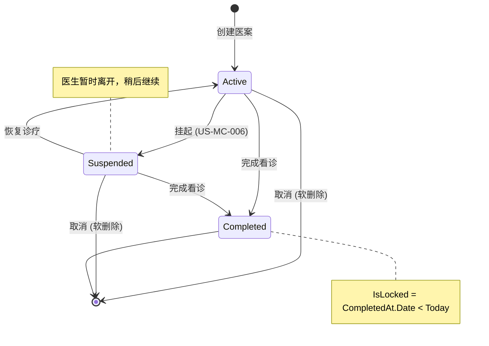

# 医案管理 产品需求文档

---

## 1. Problem Statement

### 1.1 问题描述

中医诊疗的核心产出是医案 -- 包含诊断 (四诊合参: 望闻问切) 和处方 (药材组成、剂量、煎法)。传统纸质医案存在检索困难、无法追溯修改历史、处方计算易出错、无法复用历史经验等问题。系统需要提供完整的电子化医案管理能力，覆盖从创建到完成的全生命周期，同时保障数据完整性和操作可追溯性。

### 1.2 用户痛点

| 角色 | 痛点 | 影响 |
|------|------|------|
| 医生 | 纸质医案检索耗时，复诊时难以快速回顾历史诊断和处方 | 每次复诊额外花费 5-10 分钟翻阅纸质病历 |
| 医生 | 处方价格计算手动完成，容易出错 (多味药 x 帖数 x 折扣) | 计算失误导致收费纠纷 |
| 医生 | 常用验方需反复手写，无法一键导入 | 重复劳动，日均浪费 15-30 分钟 |
| 管理员 | 无法追踪医案修改历史，出现纠纷时缺乏审计证据 | 医疗纠纷举证困难 |
| 管理员 | 纸质处方打印后修改无记录，存在篡改风险 | 打印处方与实际开方不一致的安全隐患 |
| 前台 | 无法实时了解当前待诊患者和医生接诊进度 | 患者等候时间预估不准确 |

### 1.3 证据

- 诊所日均接诊 15-30 人，每人产生一份医案，年均积累 5000-10000 份
- 复诊占比约 40%，需频繁回溯历史医案和复制处方
- 处方计算涉及 5-15 味药材的单价 x 剂量 x 帖数 x 折扣，手动计算错误率约 5%
- 医案修改审计是医疗合规基本要求

---

## 2. Target Users

| 角色 | 在本模块中的操作权限 |
|------|---------------------|
| SuperAdmin | 查看/编辑全部医案，无时间限制 |
| Admin | 查看/编辑全部医案，无时间限制 |
| Doctor | 创建医案；查看/编辑自己的未完成医案 |
| Receptionist | 查看未完成医案简要提示 (创建时间 + 主治医生，不含诊断/处方详情) |

> 创建/编辑/完成/取消等写操作受 `DoctorOrAdmin` 策略保护。创建医案仅 Doctor: `[Authorize(Roles = "Doctor")]`。Receptionist 仅可访问简要提示端点。

---

## 3. Strategic Context

### 3.1 业务目标

| 目标 | 对应 |
|------|------|
| 诊疗数字化 | 电子化医案管理，覆盖创建→诊断→处方→完成全生命周期 |
| 处方准确性 | 自动化价格计算 (单价 x 剂量 x 帖数 x 折扣)，消除手动计算错误 |
| 复诊效率 | 历史处方复制 + 验方导入，减少重复录入 |
| 操作可追溯 | 字段级变更审计 + 打印保护，满足医疗合规要求 |
| 数据安全 | 权限控制 + 锁定规则 + 编辑理由，防止未授权修改 |

### 3.2 Why Now

医案管理是诊所管理系统的核心模块，所有其他模块 (患者管理、药材管理、验方管理、打印) 都围绕医案展开。作为 DDD 唯一聚合根，MedicalCase 的设计质量直接决定系统整体架构的健壮性。

---

## 4. Solution Overview

医案管理采用 DDD 聚合根模式，MedicalCase 是系统唯一聚合根，包含 Consultation (诊断, 1:1 共享主键) 和 Prescription (处方, 1:0..1) 作为内部实体。采用 CQRS 模式分离读写操作。

**核心能力:**
- **聚合根管理**: MedicalCase 统一管理诊断和处方的创建、更新、状态流转
- **状态机**: Active (进行中) → Suspended (挂起) / Completed (已完成) / Cancelled (软删除)
- **聚合保存**: 一次性保存 MedicalCase + Consultation + Prescription + Items (粗粒度替换)
- **打印保护**: 打印后修改需提供 EditReason，自动递增 PrintVersion
- **审计追踪**: 19 个字段的自动 diff 变更记录
- **权限控制**: 基于角色 + 资源所有权 + 时间锁定的细粒度权限

**医案生命周期:**
```
创建医案 → Active (进行中)
  ├─ 填写诊断 (Consultation)
  ├─ 标记处方需求 (NeedsPrescription)
  ├─ 开具处方 (Prescription + Items)
  ├─ 挂起 → Suspended (医生暂时离开) → 恢复 → Active
  ├─ 完成 → Completed (锁定规则: 隔天自动锁定)
  └─ 取消 → Cancelled (IsDeleted=true 软删除)
```

**状态机:**


| 状态 | 值 | 说明 | 允许操作 |
|------|-----|------|----------|
| Active | 1 | 进行中 (初始状态) | 编辑、挂起、完成、取消 (软删除) |
| Suspended | 0 | 已挂起 (MC-D20: 原 Draft 已重命名为 Suspended) | 恢复、完成、取消 (软删除) |
| Completed | 2 | 已完成 | Doctor: 当天可编辑 (需 EditReason), 隔天 403; Admin/SuperAdmin: 可编辑 (需 EditReason), 不受时间限制 |

> **取消操作**: 取消医案统一通过 `IsDeleted=true` 软删除实现，审计类型为 `AuditOperationType.SoftDelete`。已完成的医案不可取消。
>
> **Draft->Suspended 重命名 (MC-D20)**: 代码枚举已完成重命名 (`MedicalCaseStatus.Suspended = 0`)。

---

## 5. Success Metrics

| 指标 | 当前 (纸质流程) | v1.0 目标 | 衡量方式 |
|------|----------------|----------|---------|
| 医案创建耗时 | 3-5 分钟 (手写) | < 1 分钟 (电子化) | 操作日志 (创建→首次保存) |
| 处方计算准确率 | ~95% (手动计算) | 100% (自动计算) | 零计算错误投诉 |
| 复诊处方录入时间 | 5-10 分钟 (手写) | < 2 分钟 (历史复制/验方导入) | 操作日志 |
| 审计覆盖率 | 0% (无记录) | 100% (19 字段 diff) | MedicalCaseAuditLog 记录数 |
| 打印保护合规率 | N/A | 100% (打印后修改必须提供理由) | ERR-30403 触发率 = 0 |

---

## 6. Epic Hypothesis

We believe that 实现以 MedicalCase 为唯一聚合根的电子化医案管理系统 (含聚合保存、状态机、处方自动计算、打印保护、字段级审计) for 诊所医生和管理员 will achieve 诊疗效率提升 (处方录入时间减半) 和数据安全合规 (100% 操作可追溯)。We'll know we're right when 处方计算零错误、复诊处方导入使用率 > 50%、且审计日志覆盖全部写操作。

---

## 7. User Stories

### 优先级汇总

| US 编号 | 名称 | Priority |
|---------|------|----------|
| US-MC-001 | 创建医案 | Must |
| US-MC-002 | 填写诊断 | Must |
| US-MC-003 | 标记处方需求 | Must |
| US-MC-004 | 开具处方 | Must |
| US-MC-005 | 聚合保存 | Must |
| US-MC-006 | 挂起医案 | Must |
| US-MC-007 | 完成医案 | Must |
| US-MC-008 | 取消医案 | Should |
| US-MC-009 | 医案列表查询 | Must |
| US-MC-010 | 跨医案搜索 | Should |
| US-MC-011 | 编辑模式 | Should |
| US-MC-012 | 审计日志 | Could |
| US-MC-013 | 权限控制 | Must |
| US-MC-014 | 锁定规则 | Should |
| US-MC-015 | 打印触发 | Should |
| US-MC-016 | 验方导入到处方 | Should |
| US-MC-017 | 待诊队列 | Should |
| US-MC-018 | 复制历史处方 | Should |

---

### US-MC-001: 创建医案

> As a 医生, I want to 为患者创建新的诊疗记录 (MedicalCase 聚合根),
> so that 我可以开始记录本次诊疗的诊断和处方信息。

**Acceptance Criteria:**
- [ ] Admin 角色调用 POST → 返回 403 (仅 Doctor 可创建)
- [ ] 创建医案成功 → Consultation 实体自动创建 (共享主键)
- [ ] 创建成功 → 自动生成医案编号 (格式: MC20260210001)
- [ ] 患者 Status=Disabled → 返回 422 (ERR-30105)
- [ ] 患者已有 Active 医案 → 返回 422 (ERR-30103)，提示用户选择: 重开/关闭旧的后新建/取消
- [ ] 患者已有 Suspended 医案 → 返回 422 (ERR-30104)，提示用户选择处理方式

**Business Rules:**
1. PatientId 必填，UserId (医生ID) 必填
2. 仅 Doctor 可创建
3. 初始状态为 Active
4. 自动创建 Consultation (1:1 共享主键)
5. 自动生成医案编号 (格式: MC20260210001)
6. 冗余存储 PatientName 和 DoctorName (读优化，创建时快照)
7. **患者状态检查**: Patient.Status 必须为 Enabled，禁用患者不可创建医案 (ERR-30105)
8. **患者选择列表过滤**: 创建医案的患者选择界面仅展示 Status=Enabled 的患者 (禁用患者不出现在候选列表中)
9. **同一患者单活跃医案约束 (BR-001)**: 同一患者在同一时间只能有一个 Active 或 Suspended 状态的医案。碰撞处理: 重开现有医案 / 关闭旧的后新建 / 取消操作。技术实现: 代码层检查 + DB 唯一索引 (Active + Suspended 状态)
10. **两种创建入口 (MC-D19)**: 模式 1 前台挂号→医生从挂号队列选中; 模式 2 医生直接查询患者创建。两种模式在 BR-001 检查后完全收敛

**Dual Mode:**
| 模式 | 行为 |
|------|------|
| 远程 | POST `/api/v1/medicalcases` |
| 本地 | DataSource 本地存储 |

### US-MC-002: 填写诊断

> As a 医生, I want to 填写中医诊断信息 (Consultation),
> so that 我可以记录本次诊疗的四诊结果和辨证分析。

**Acceptance Criteria:**
- [ ] TcmDiagnosis 为空时完成医案 → 返回 422
- [ ] 更新诊断内容 → 通过聚合保存 (PUT /{id}) 成功保存

**Business Rules:**
1. 中医辨证 (TcmDiagnosis) 必填 (完成时校验)
2. 现病史 (PresentIllness)、舌诊 (TongueDiagnosis)、脉诊 (PulseDiagnosis) 可选
3. 通过聚合保存 (PUT /{id}) 更新

**Dual Mode:**
| 模式 | 行为 |
|------|------|
| 远程 | PUT `/api/v1/medicalcases/{id}` (聚合保存，含 Consultation) |
| 本地 | 本地更新 |

### US-MC-003: 标记处方需求

> As a 医生, I want to 标记本次诊疗是否需要开具处方,
> so that 系统可以在完成医案时校验处方完整性。

**Acceptance Criteria:**
- [ ] NeedsPrescription=false → 已有 Prescription 被清除
- [ ] NeedsPrescription=true → 允许创建 Prescription
- [ ] NeedsPrescription=null 时完成医案 → 返回 422 (ERR-30302)

**Business Rules:**
1. NeedsPrescription: true (需要) / false (不需要) / null (未决策)
2. 设为 false 时，如已有处方则清除
3. 设为 true 时，允许创建/编辑处方

**Dual Mode:**
| 模式 | 行为 |
|------|------|
| 远程 | PUT `/api/v1/medicalcases/{id}/prescription-flag` |
| 本地 | 本地标记 |

### US-MC-004: 开具处方

> As a 医生, I want to 为医案创建处方并添加药材列表,
> so that 系统可以自动计算处方价格并支持后续打印。

**Acceptance Criteria:**
- [ ] 处方 Items 为空 → 返回 400 验证失败
- [ ] UnitPrice=10, Dosage=15 → Amount=150
- [ ] 3 味药 Amount 分别为 100/150/200, DosageCount=7, Discount=0.9 → SingleDosePrice=450, TotalPrice=450x7x0.9=2835
- [ ] NeedsPrescription != true 时创建处方 → 返回 422 (ERR-30401)

**Business Rules:**
1. 至少包含 1 个处方项 (PrescriptionItem)
2. DosageCount (帖数) 范围 1-100，默认 7
3. Discount (折扣) 范围 0-1，默认 1.0。语义: 1.0 = 无折扣, 0.9 = 九折, 0.85 = 八五折
4. 处方编号自动生成 (格式: RX-YYYYMMDD-NNNN)
5. 每个处方项: HerbId + HerbName + Dosage + UnitPrice + DecocteMethod
6. 小计金额 = UnitPrice x Dosage (自动计算)
7. 单剂价格 (SingleDosePrice) = SUM(所有 Items.Amount)，即一剂所有药材小计之和
8. 总价 (TotalPrice) = SingleDosePrice x DosageCount x Discount (MC-D14)

> **[Sprint 4 已实现]** 处方折扣: Discount 字段已纳入处方价格计算，TotalPrice = SingleDosePrice x DosageCount x Discount (T4-S5-11)

**Dual Mode:**
| 模式 | 行为 |
|------|------|
| 远程 | PUT `/api/v1/medicalcases/{id}` (聚合保存，含 Prescription + Items) |
| 本地 | 本地存储 |

### US-MC-005: 聚合保存

> As a 医生, I want to 一次性保存医案的诊断和处方信息,
> so that 我不必分别保存各部分数据，减少操作步骤和网络请求。

**Acceptance Criteria:**
- [ ] 编辑锁定医案未提供 EditReason → 返回 422
- [ ] 更新处方 Items → 原有 Items 全部替换为新列表
- [ ] IsPrinted=true 且修改 Consultation/Prescription 内容但未提供 EditReason → 返回 422 (ERR-30403)
- [ ] IsPrinted=true 修改成功后 → IsPrinted=false, PrintVersion++

**Business Rules:**
1. 聚合根整体保存 (MedicalCase + Consultation + Prescription + Items)
2. 权限检查: Doctor 只能保存自己的
3. 编辑已完成/隔天/非本人医案需要提供 EditReason
4. 处方药材采用粗粒度替换策略 (完整替换 Items 集合)
5. 记录审计日志
6. **打印保护**: 若 `MedicalCase.IsPrinted=true` 且请求包含 Consultation 或 Prescription 内容变更，则 EditReason 必填 (ERR-30403)。修改成功后: `MedicalCase.IsPrinted=false`、`MedicalCase.PrintVersion++` (需重新打印)

**Dual Mode:**
| 模式 | 行为 |
|------|------|
| 远程 | PUT `/api/v1/medicalcases/{id}` |
| 本地 | 本地保存 |

### US-MC-006: 挂起医案

> As a 医生, I want to 暂时挂起当前诊疗的医案,
> so that 我可以先处理紧急患者，稍后再回来继续本次诊疗。

**Acceptance Criteria:**
- [ ] 挂起成功 → 状态=Suspended，可继续编辑
- [ ] TcmDiagnosis 为空 → 挂起成功 (不验证)
- [ ] 已完成医案挂起 → 返回 422 (ERR-30304)
- [ ] 已删除医案挂起 → 返回 422 (ERR-30305)

**Business Rules:**
1. 状态设为 Suspended (MC-D20)
2. 保存当前诊断数据
3. 不要求数据完整性 (TcmDiagnosis 可空)

**Dual Mode:**
| 模式 | 行为 |
|------|------|
| 远程 | PUT `/api/v1/medicalcases/{id}/suspend` |
| 本地 | 本地挂起 |

### US-MC-007: 完成医案

> As a 医生, I want to 标记医案为已完成,
> so that 本次诊疗正式归档，触发隔天自动锁定保护。

**Acceptance Criteria:**
- [ ] 完成医案 → CompletedAt 记录当前时间
- [ ] CompletedAt.Date < Today → IsLocked=true
- [ ] TcmDiagnosis 为空 → 返回 422
- [ ] NeedsPrescription=null → 返回 422 (ERR-30302)
- [ ] NeedsPrescription=true 但无处方 → 返回 422 (ERR-30303)

**Business Rules:**
1. 状态设为 Completed，通过聚合根域方法 `MedicalCase.Complete()` 统一设置
2. 记录 CompletedAt 时间 (域方法内设置)
3. 完成后当天内可编辑，隔天锁定
4. 锁定后编辑需要 Admin 权限 + 修改原因
5. **统一入口**: 所有完成操作通过 `CompleteAsync` 统一入口 (含 `skipWorkflowValidation` 参数控制是否跳过三步流程校验)
6. **禁止通过状态更新完成**: `UpdateStatusAsync` 拒绝 `Completed` 状态，强制使用 `CompleteAsync`
7. **完成校验规则 (BR-003)**: TcmDiagnosis 非空; NeedsPrescription 非 null; NeedsPrescription=true 时 Prescription 非 null 且 Items.Count > 0 且 DosageCount > 0。校验失败返回 422 + 所有未通过项错误消息列表

> **[延期 2026-02-21]** 取消前自动保存诊断数据未实现。原因: UX 复杂度高需独立规划，取消前自动保存涉及表单脏检查和异步保存流程。计划: UX 完善 Sprint。参考: MC-16

**Dual Mode:**
| 模式 | 行为 |
|------|------|
| 远程 | PUT `/api/v1/medicalcases/{id}/close` |
| 本地 | 本地完成 |

### US-MC-008: 取消医案

> As a 医生, I want to 取消本次诊疗,
> so that 错误创建或患者临时取消的医案可以标记作废而不影响正常医案列表。

**Acceptance Criteria:**
- [ ] 取消后 → IsDeleted=true，医案不可再编辑
- [ ] 取消后 → 诊断/处方数据保留在数据库中
- [ ] 已完成医案取消 → 返回 422 (ERR-30306)
- [ ] 非当天本人取消 → 需提供审计理由

**Business Rules:**
1. 状态设为 Cancelled (通过 IsDeleted=true 软删除)
2. 取消前自动保存诊断数据
3. 保存失败不阻止取消
4. 非当天本人取消需要审计理由
5. 需要用户确认 ("确定要取消?")

**Dual Mode:**
| 模式 | 行为 |
|------|------|
| 远程 | PUT `/api/v1/medicalcases/{id}/cancel` |
| 本地 | 本地取消 |

### US-MC-009: 医案列表查询

> As a 医生/管理员, I want to 分页查看医案列表并按条件筛选,
> so that 我可以快速找到需要处理或回顾的医案。

**Acceptance Criteria:**
- [ ] Doctor 查询 → 仅返回 UserId=自己的医案
- [ ] status=Completed → 仅返回已完成医案
- [ ] Admin 查询 → 返回全部医案
- [ ] 默认排序 → CreatedAt DESC (最新优先)

**Business Rules:**
1. 支持按状态、患者、关键词筛选
2. Admin 查看全部，Doctor 仅查看自己的
3. 默认分页: page=1, pageSize=20
4. 统一查询端点支持多种 QueryType
5. 排序规则: CreatedAt DESC (最新优先) (MC-D11)

**Dual Mode:**
| 模式 | 行为 |
|------|------|
| 远程 | GET `/api/v1/medicalcases?status=&patientId=&keyword=&page=&pageSize=` 或 GET `/api/v1/medicalcases/query` |
| 本地 | 本地查询 |

### US-MC-010: 跨医案搜索

> As a 医生, I want to 按患者名/诊断关键词/日期范围全文搜索医案,
> so that 我可以在复诊时快速找到患者的历史诊疗记录。

**Acceptance Criteria:**
- [ ] diagnosisKeyword="风寒" → 返回 TcmDiagnosis 含"风寒"的医案
- [ ] 返回完整 MedicalCaseDetailDto (含嵌套数据)

**Business Rules:**
1. 支持按患者姓名搜索
2. 支持按诊断关键词搜索 (TcmDiagnosis)
3. 支持日期范围筛选
4. 返回完整 MedicalCaseDetailDto (含嵌套数据)

> **[延期 2026-02-21]** EditModeStateMachine 不存在，编辑模式状态机未实现。原因: 状态机复杂度高需独立设计，当前通过 ViewModel 属性管理编辑状态。计划: 编辑模式重构 Sprint。参考: MC-19
>
> **[延期 2026-02-21]** Clinical/Management 模式区分未完整实现。原因: 与 MC-19 同源，编辑模式状态机是模式区分的基础。计划: 编辑模式重构 Sprint。参考: MC-33

**Dual Mode:**
| 模式 | 行为 |
|------|------|
| 远程 | GET `/api/v1/medicalcases/search?patientName=&diagnosisKeyword=&startDate=&endDate=` |
| 本地 | 本地搜索 |

### US-MC-011: 编辑模式

> As a 医生, I want to 根据进入方式自动切换工作区模式 (Clinical/Management),
> so that 界面布局和操作按钮匹配我当前的工作场景。

**Acceptance Criteria:**
- [ ] Clinical 模式默认 Editing，Management 模式默认 ReadOnly
- [ ] Clinical 底部按钮: [暂存医案] [打印处方笺] [完成看诊]
- [ ] Management 底部按钮: [打印处方笺] [保存医案] 或 [编辑医案]
- [ ] Management 模式未保存修改离开 → 弹窗确认 (保存/放弃/取消)

**Business Rules:**
1. Clinical 模式: 从患者选择进入，默认 Editing，返回患者选择页
2. Management 模式: 从医案列表进入，默认 ReadOnly，返回医案列表页
3. 保存后状态切换为 ReadOnly，留在当前界面
4. Management 模式未保存修改弹窗确认 (保存/放弃/取消)
5. Clinical 模式底部按钮: [暂存医案] [打印处方笺] [完成看诊]
6. Management 模式底部按钮: [打印处方笺] [保存医案] 或 [编辑医案]

**Dual Mode:**
| 模式 | 行为 |
|------|------|
| 远程 | 客户端 UI 逻辑 |
| 本地 | 同远程模式 |

### US-MC-012: 审计日志

> As a 管理员, I want to 查看医案的完整变更历史 (含字段级 diff),
> so that 出现纠纷时可以追溯每次修改的操作人、时间、原因和具体变更内容。

**Acceptance Criteria:**
- [ ] Create → 生成 MedicalCaseAuditLog，OperationType="Create"，OldValues 为空
- [ ] Update/StatusChange → ChangedFields 仅包含实际变更的字段
- [ ] 提供 EditReason → AuditLog.Reason 字段包含该值
- [ ] 审计写入异常 → 主业务保存成功，仅记录 Error 日志

**Business Rules:**
1. 记录操作人 (ID/姓名/角色)、操作类型、变更字段、前后值
2. 操作类型: Create/Update/StatusChange/SoftDelete (取消操作统一为 SoftDelete)。OperationType 使用 int 枚举存储 (非 string)
3. 修改原因: 历史医案修改时必填
4. 支持分页查看审计日志
5. 变更字段和值以 JSON 格式存储 (CamelCase)
6. 创建操作: 仅记录 NewValues (无 OldValues)
7. 更新操作: MedicalCaseAuditService 自动比较前后值，仅记录实际变更的字段。覆盖 MedicalCase 顶层字段 + Consultation 4 字段 (PresentIllness/TongueDiagnosis/PulseDiagnosis/TcmDiagnosis) + Prescription 6 字段 + ItemCount，共计 19 个字段
8. 删除操作: 记录 IsDeleted=true 变更
9. 审计记录写入失败不影响主业务流程 (异常隔离)

> **交叉引用**: 安全审计日志 (SecurityAuditLog) 见 [logging.md](14-logging.md) US-LOG-002；日志保留策略见 [nfr.md](17-nfr.md) NFR-SEC-005。

**Dual Mode:**
| 模式 | 行为 |
|------|------|
| 远程 | GET `/api/v1/medicalcases/{id}/audit-logs?page=&pageSize=`。完整字段级审计 |
| 本地 | 不支持完整审计日志。仅保留实体级审计字段 (CreatedAt/UpdatedAt/CreatedBy/UpdatedBy) |

### US-MC-013: 权限控制

> As a 系统, I want to 基于角色和资源所有权实施细粒度权限检查,
> so that 医生只能操作自己的医案，管理员可以在提供理由后操作任意医案。

**Acceptance Criteria:**
- [ ] Doctor 编辑 UserId!=自己的医案 → 返回 403
- [ ] GET permissions → 返回 CanEdit/CanDelete/RequiresEditReason/DenialReason
- [ ] Admin 编辑已完成医案 → 提供 EditReason 后成功

**Business Rules:**
1. Doctor: 只能编辑自己创建的未完成 (Active/Suspended) 医案
2. Admin/SuperAdmin: 可编辑所有医案
3. 编辑已完成医案: 需提供修改原因
4. 隔天编辑: 需提供修改原因
5. 非本人编辑: 需提供修改原因
6. 权限查询端点返回 CanEdit/CanDelete/RequiresEditReason/DenialReason

**Dual Mode:**
| 模式 | 行为 |
|------|------|
| 远程 | GET `/api/v1/medicalcases/{id}/permissions`，返回 MedicalCasePermissionDto |
| 本地 | 本地权限检查 |

### US-MC-014: 锁定规则

> As a 管理员, I want to 已完成且非当天的医案自动锁定,
> so that 历史医案不会被随意修改，保障数据的法律效力。

**Acceptance Criteria:**
- [ ] CompletedAt.Date == Today → IsLocked=false
- [ ] CompletedAt.Date < Today → IsLocked=true, Doctor 不可编辑
- [ ] Admin 编辑锁定医案 + 提供 EditReason → 编辑成功

**Business Rules:**
1. 锁定条件: `IsLocked = IsCompleted && (CompletedAt.Date < Today)` (计算属性，0 点自动生效，无后台任务)
2. 锁定后 Doctor 不可编辑
3. 锁定后 Admin 编辑需提供修改原因
4. 无显式解锁接口，管理员直接编辑 (需 EditReason)

**Dual Mode:**
| 模式 | 行为 |
|------|------|
| 远程 | 服务端权限检查 |
| 本地 | 本地检查 |

### US-MC-015: 打印触发

> As a 医生, I want to 触发医案内容打印并自动管理打印版本,
> so that 打印后的修改可以被追踪，确保纸质处方与电子记录一致。

**Acceptance Criteria:**
- [ ] 打印操作 → MedicalCase.IsPrinted=true, MedicalCase.PrintCount += 1, MedicalCase.LastPrintedAt=now
- [ ] IsPrinted=true 时修改 Consultation → 需提供 EditReason，修改后 IsPrinted=false, MedicalCase.PrintVersion++
- [ ] IsPrinted=true 时修改 Prescription → 需提供 EditReason，修改后 IsPrinted=false, MedicalCase.PrintVersion++
- [ ] 打印操作 → 生成 MedicalCasePrintLog (PrintType=Prescription, PrintVersion=当前版本)

**Business Rules:**
1. 打印操作设置 `MedicalCase.IsPrinted=true`，`MedicalCase.PrintCount++`，`MedicalCase.LastPrintedAt=now`
2. 打印后修改任何内容 (Consultation 或 Prescription) 需提供 EditReason (MC-D15)
3. 修改成功后: `MedicalCase.IsPrinted=false`，`MedicalCase.PrintVersion++` (标记需重新打印)
4. 每次打印记录 MedicalCasePrintLog，含当前 `MedicalCase.PrintVersion` 和 PrintType
5. 打印模板为 A5 纸张，详见 [printing.md](09-printing.md)
6. v1.0 支持处方打印 (PrintType=Prescription)，打印为 MedicalCase 聚合根的能力

> **[Sprint 4 已实现]** 打印回写: IsPrinted/PrintCount/LastPrintedAt/PrintVersion 字段在打印后由 PrintService 自动更新到 MedicalCase 聚合根 (T2-X8-04~08)
>
> **[Sprint 4 已实现]** 打印日志: MedicalCasePrintLog 实体支持成功/失败日志记录，含 PrintType、PrintVersion 快照、ErrorMessage (T4-S5-01~03)
>
> **[Sprint 4 已实现]** 医师自动绑定: 打印时 DoctorName 自动从 ISessionManager.CurrentUser.RealName 获取，无需手动填写 (T4-S5-10)

**Dual Mode:**
| 模式 | 行为 |
|------|------|
| 远程 | 客户端打印 + 服务端记录日志 |
| 本地 | 本地打印 |

### US-MC-016: 验方导入到处方

> As a 医生, I want to 将经验方模板一键导入为处方药材,
> so that 常用方剂不需要逐味药手动录入，提高开方效率。

**Acceptance Criteria:**
- [ ] 验方导入列表 → 仅展示 ValidationStatus=Validated 且 Status=Enabled 的验方
- [ ] 选择验方导入 → 处方 Items 包含验方所有启用药材
- [ ] 导入时 → UnitPrice 从药材库当前价格获取
- [ ] 验方含已禁用药材 → 跳过禁用药材 + 弹出提示

**Business Rules:**
1. 从验方列表选择导入
2. **仅展示 ValidationStatus=Validated 且 Status=Enabled 的验方** (MC-D08)
3. 导入验方的药材组成到处方 Items
4. 价格从药材库实时获取
5. 记录引用的验方名称 (ReferencedFormulas)
6. **已禁用药材 (Status=Disabled) 自动跳过，提示"以下药材已停用，已跳过: xxx"** (MC-D09)
7. **导入为数据复制，修改处方中的药材不影响原验方** (MC-D12)
8. **重复药材剂量合并策略 (MC-D17)**: 通过 appsettings.json 配置 `PrescriptionImport.DuplicateHerbStrategy`。五种策略: Max(取最大)/Min(取最小)/Accumulate(累加,默认)/Skip(跳过)/Replace(替换)。合并时仅更新 Dosage，DecocteMethod 和 Unit 保持原值

**Dual Mode:**
| 模式 | 行为 |
|------|------|
| 远程 | 客户端操作，药材价格从 API 获取 |
| 本地 | 从本地药材库获取价格 |

### US-MC-017: 待诊队列

> As a 医生/前台, I want to 查看当前待看诊患者列表,
> so that 我可以了解接诊进度和患者等候情况。

**Acceptance Criteria:**
- [ ] 查询待诊队列 → 仅返回 CaseStatus=Active 或 Suspended 的医案
- [ ] 排序 → CreatedAt ASC (先到先看)
- [ ] 支持按患者 ID 过滤

**Business Rules:**
1. 筛选状态为 Active 或 Suspended 的医案
2. 排序规则: CreatedAt ASC (先到先看) (MC-D11)
3. 显示患者姓名、创建时间
4. 支持按患者 ID 过滤

**Dual Mode:**
| 模式 | 行为 |
|------|------|
| 远程 | GET `/api/v1/medicalcases/pending?doctorId=&patientId=` |
| 本地 | 本地查询 |

### US-MC-018: 复制历史处方

> As a 医生, I want to 从患者历史医案中复制处方到当前新医案,
> so that 复诊患者可以快速沿用之前的处方，仅做微调即可。

**Acceptance Criteria:**
- [ ] 历史医案列表 → 仅展示同一患者的 Completed 医案
- [ ] 选择历史医案 → 预览处方药材 (药名/剂量/煎法)
- [ ] 确认复制 → 当前处方 Items 包含历史处方所有启用药材
- [ ] 复制时 → UnitPrice 从药材库当前价格获取，非历史价格
- [ ] 历史处方含已禁用药材 → 跳过禁用药材 + 弹出提示
- [ ] 修改复制后的处方 → 不影响源历史处方

**Business Rules:**
1. 仅可从同一患者的已完成 (Completed) 医案中复制处方
2. 展示该患者的历史医案列表 (含处方摘要)，按 CreatedAt DESC 排序
3. 选择历史医案后，预览处方药材列表 (药名、剂量、煎法)
4. 确认后复制药材列表到当前医案的处方 Items
5. **价格从药材库实时获取** (与 US-MC-016 验方导入保持一致)，不使用历史快照价格 (MC-D13)
6. **已禁用药材 (Status=Disabled) 自动跳过，提示"以下药材已停用，已跳过: xxx"** (复用 MC-D09 规则)
7. **复制为数据副本，修改不影响源处方** (复用 MC-D12 规则)
8. DosageCount 和 Discount 从历史处方复制，医生可修改
9. Usage (用法) 和 Advice (医嘱) 从历史处方复制
10. 记录引用来源: ReferencedFormulas 追加 "复制自医案 {CaseNumber}"

**Dual Mode:**
| 模式 | 行为 |
|------|------|
| 远程 | 客户端操作，药材价格从 API 获取，历史医案列表通过 GET `/api/v1/medicalcases?patientId={id}&status=Completed` 查询 |
| 本地 | 从本地药材库获取价格，本地查询历史医案 |

---

## 8. Out of Scope

| 排除项 | 原因 |
|--------|------|
| 医案自动保存 (定时/崩溃恢复) | UX 复杂度高 (表单脏检查 + 异步保存)，崩溃时做变更丢失处理 (MC-D18) |
| EditModeStateMachine | 状态机复杂度高，当前通过 ViewModel 属性管理编辑状态 (MC-19) |
| Clinical/Management 模式完整实现 | 依赖 EditModeStateMachine，编辑模式重构 Sprint 实现 (MC-33) |
| 挂起医案自动清理 | v1.0 不实现，BR-001 卡点 + 用户手动处理 (MC-D05) |
| 悲观锁 (并发编辑互斥) | 乐观锁 (RowVersion) + 3 次重试已满足 1-3 并发用户场景 (MC-D10) |
| JWT 黑名单/即时踢出 | 诊所场景 30 分钟延迟可接受 (AUTH-D08) |

---

## 9. Dependencies & Risks

| 依赖/风险 | 影响 | 缓解措施 |
|-----------|------|---------|
| 患者模块 (patients.md) | 创建医案依赖患者存在且 Enabled | FR-PAT-013 阻止有活跃医案的患者禁用; ERR-30105 双重保护 |
| 药材模块 (herbs.md) | 处方 Item 依赖药材存在且价格正确 | 禁用药材自动跳过 + 提示 (MC-D09); 实时价格获取 |
| 验方模块 (formulas.md) | 验方导入依赖验方 Validated + Enabled | MC-D08 过滤; 导入为数据复制无强关联 (MC-D12) |
| 并发创建冲突 | 两人同时为同一患者创建医案 | 代码层 BR-001 + DB 唯一索引; NFR 1-3 用户，风险极低 (MC-D06) |
| 并发编辑冲突 | 两人同时编辑同一医案 | 乐观并发控制 (RowVersion) + 3 次重试 (MC-D10) |
| 患者被禁用后历史医案脱敏 | PatientName 按角色脱敏可能影响医生查阅体验 | Admin/SuperAdmin 完整显示; Doctor 仅掩码 (MC-D16) |
| 打印后修改导致版本不一致 | 纸质处方与电子记录不一致 | 打印保护 + PrintVersion + 强制 EditReason (MC-D15) |

---

## 10. Open Questions

| ID | 问题 | 状态 |
|----|------|------|
| OQ-MC-01 | 挂起医案是否需要设置最大挂起时长? (超时自动取消/提醒) | v1.0 不实现自动清理 (MC-D05)，待观察实际使用情况 |
| OQ-MC-02 | 禁用患者历史医案的 PatientName 脱敏规则 (Doctor 掩码 "张*") 是否满足合规要求? | 已确定方案 (MC-D16)，待法规确认 |
| OQ-MC-03 | 重复药材合并策略默认值 (Accumulate) 是否符合临床习惯? | 可通过 appsettings.json 配置切换 (MC-D17)，待临床反馈 |
| OQ-MC-04 | 历史处方复制时是否需要显示价格变动对比 (当前价格 vs 历史价格)? | MC-D13 已预留预览对比，UI 实现待确认 |
| OQ-MC-05 | 审计日志保留期限? (永久/按年归档) | 待运维策略确定，见 [nfr.md](17-nfr.md) NFR-SEC-005 |

---

## Business Rules

### BR-001: 同一患者单活跃医案约束

- **规则**: 同一患者在同一时间只能有一个 Active 或 Suspended 状态的医案
- **触发时机**: 创建医案 (US-MC-001)
- **碰撞处理**: 当患者已有 Active/Suspended 医案时，提示用户选择:
  1. **重开现有医案** - 导航到已有的 Active/Suspended 医案继续编辑
  2. **关闭旧的后新建** - 将已有医案软删除 (Cancelled)，然后创建新医案
  3. **取消操作** - 放弃创建
- **技术实现**: 代码层检查 + DB 唯一索引 (Active + Suspended 状态)

### BR-002: 医案离开界面操作

- **规则**: 离开医案编辑界面时，必须选择一种处置方式
- **处置选项**:
  1. **挂起** - 状态设为 Suspended，保存当前数据，稍后可继续 (US-MC-006)
  2. **关闭** - 执行软删除 (IsDeleted=true)
  3. **完成** - 状态设为 Completed，需通过完成校验 (BR-003)
- **异常状态** (崩溃/断网/强制关闭): 医案保持当前状态 (Active)，未保存变更丢失 (MC-D18)

### BR-003: 医案完成校验规则

- **规则**: 完成医案 (US-MC-007) 时必须通过以下校验
- **校验项**:

| 校验项 | 条件 | 错误消息 |
|--------|------|----------|
| 中医辨证 | TcmDiagnosis 非空 | 请填写中医辨证 |
| 处方需求标记 | NeedsPrescription 非 null | 请先标记是否需要开处方 |
| 处方存在性 | NeedsPrescription=true 时 Prescription 非 null | 已标记需要开处方，但处方不存在 |
| 处方药材 | NeedsPrescription=true 时 Items.Count > 0 | 处方至少包含一味药材 |
| 处方必填字段 | NeedsPrescription=true 时 DosageCount > 0 | 请填写帖数 |

- **校验时机**: 调用 US-MC-007 (完成医案) 时服务端统一校验
- **校验失败**: 返回 422，包含所有未通过校验项的错误消息列表

### BR-DEL-001: 统一删除策略

- **适用范围**: 全系统实体删除行为统一规范
- **规则**:
  - **有引用关系** -> 禁止删除，仅可禁用 (Status=Disabled)
  - **无引用关系** -> 允许软删除 (IsDeleted=true)
- **各模块适用**:

| 模块 | 被引用关系 | 删除行为 |
|------|-----------|----------|
| Patients | 被 MedicalCase 引用 | 有医案: 禁止删除 (422)，建议禁用; 无医案: 软删除 |
| Herbs | 被 PrescriptionItem 引用 | 有处方引用: 禁止删除，建议禁用; 无引用: 软删除 |
| Formulas | 无被引用关系 (导入为复制) | 直接软删除 |
| Users | 特殊规则 | 保持现有逻辑 (参见 [users.md](03-users.md)) |

---

## 审计理由判断

| 场景 | 需要修改原因 |
|------|-------------|
| 当天本人修改 Active/Suspended 医案 | 不需要 |
| 修改已完成 (Completed) 医案 | 需要 |
| 隔天修改 | 需要 |
| 非本人修改 | 需要 |
| 取消医案 (非当天本人) | 需要 |

预置修改原因选项: 补充遗漏信息 / 更正录入错误 / 患者要求修改 / 医嘱调整

---

## 边界条件

### 医案生命周期边界

| 场景 | 行为 | 决策编号 |
|------|------|---------|
| 患者被删除 | 有关联医案的患者禁止删除 (返回 422)，仅可禁用。见 [patients.md](04-patients.md) FR-PAT-005 | MC-D04 |
| 挂起积压 | v1.0 不实现自动清理。BR-001 阻止同一患者多个 Active/Suspended，形成天然卡点提醒 | MC-D05 |
| 并发创建冲突 | 代码层 BR-001 检查 + DB 唯一索引 (Active + Suspended)。NFR 1-3 并发用户，并发风险极低，接受现状 | MC-D06 |

### 患者状态联动

| 场景 | 行为 | 决策编号 |
|------|------|---------|
| 禁用患者创建医案 | 禁止: 患者选择列表过滤禁用患者; 接口层返回 422 (ERR-30105) 双重保护 | MC-D16 |
| 禁用患者历史医案查阅 | 允许: 医案列表/搜索 (US-MC-009/010) 包含禁用患者的医案。PatientName 按角色脱敏: Admin/SuperAdmin 完整显示，Doctor 掩码 (如 "张*") | MC-D16 |
| 有活跃医案的患者禁用 | 禁止禁用，需先完成或取消活跃医案 (见 [patients.md](04-patients.md) FR-PAT-013) | MC-D16 |

### 处方与药材联动边界

| 场景 | 行为 | 决策编号 |
|------|------|---------|
| 禁用药材在历史处方展示 | 名称后缀标注"(已停用)"，仅可查看不可修改剂量 | MC-D07 |
| 验方导入处方过滤 | 仅展示 ValidationStatus=Validated 的验方，Draft 不出现在导入列表 | MC-D08 |
| 验方含禁用药材导入 | 自动跳过禁用药材 + 弹出提示"以下药材已停用，已跳过: xxx" | MC-D09 |
| 历史处方含禁用药材复制 | 同 MC-D09: 自动跳过 + 弹出提示 | MC-D09 |
| 历史处方药材价格变动 | 使用药材库当前价格，非历史快照。预览时可对比历史价格与当前价格差异 | MC-D13 |

### 并发与锁定

| 场景 | 行为 | 决策编号 |
|------|------|---------|
| 两人同时编辑同一医案 | 乐观并发控制 (RowVersion)。后保存者触发 DbUpdateConcurrencyException，3 次重试后返回 500 | MC-D10 |
| 隔天自动锁定时间点 | 计算属性 `IsLocked = IsCompleted && CompletedAt.Date < Today`，0 点自动生效，无后台任务 | US-MC-014 |
| 管理员编辑锁定医案 | 无显式解锁接口，管理员直接编辑 (需 EditReason) | US-MC-013 |
| 打印后修改医案内容 | MedicalCase.IsPrinted=true 时修改 Consultation 或 Prescription 均需 EditReason。修改后 MedicalCase.IsPrinted=false、MedicalCase.PrintVersion++，需重新打印 | MC-D15 |

### 排序规则

| 查询场景 | 排序规则 | 决策编号 |
|----------|---------|---------|
| 医案列表 (US-MC-009) | CreatedAt DESC (最新优先) | MC-D11 |
| 待诊队列 (US-MC-017) | CreatedAt ASC (先到先看) | MC-D11 |

---

## Data Model

### MedicalCase (医案 -- 聚合根)

| 字段 | 类型 | 约束 | 说明 |
|------|------|------|------|
| Id | Guid | PK | 医案ID |
| PatientId | Guid | FK, Required | 患者ID |
| PatientName | string(50) | Required | 患者姓名 (创建时快照，后续改名不影响历史医案) |
| UserId | Guid | Required | 主治医生ID |
| DoctorName | string(50) | Required | 医生姓名 (创建时快照，后续改名不影响历史医案) |
| CaseNumber | string(50)? | - | 医案编号 |
| CaseStatus | MedicalCaseStatus | Required | 业务状态 |
| NeedsPrescription | bool? | - | 是否需要处方 |
| CompletedAt | DateTime? | - | 完成时间 |
| Remark | string(500)? | - | 备注 |
| IsPrinted | bool | Default: false | 是否已打印 (聚合根级打印保护，打印后任何内容修改需提供 EditReason) |
| PrintVersion | int | Default: 1 | 打印版本号 (内容变更时递增，用于打印溯源) |
| PrintCount | int | Default: 0 | 打印次数 (跨 PrintType 总计，per-type 统计从 MedicalCasePrintLog 聚合查询) |
| LastPrintedAt | DateTime? | - | 最后打印时间 (跨 PrintType) |
| Consultation | Consultation? | 1:1 | 诊断记录 (共享主键) |
| Prescription | Prescription? | 1:0..1 | 处方 (可选) |

> 计算属性: IsLocked, IsActive, IsCompleted, HasPrescription

### Consultation (诊断 -- 内部实体)

| 字段 | 类型 | 约束 | 说明 |
|------|------|------|------|
| Id | Guid | PK (= MedicalCase.Id) | 诊断ID (共享主键) |
| PresentIllness | string(2000)? | - | 现病史 |
| TongueDiagnosis | string(500)? | - | 舌诊 |
| PulseDiagnosis | string(500)? | - | 脉诊 |
| TcmDiagnosis | string(500)? | 完成时必填 | 中医辨证 |

### Prescription (处方 -- 内部实体)

| 字段 | 类型 | 约束 | 说明 |
|------|------|------|------|
| Id | Guid | PK | 处方ID |
| MedicalCaseId | Guid | FK | 医案ID |
| PrescriptionNumber | string(20)? | - | 处方编号 (RX-YYYYMMDD-NNNN) |
| DosageCount | int | Default: 7 | 帖数 |
| Discount | decimal(3,2) | Default: 1.0 | 折扣 (范围 0.00~1.00) |
| Usage | string(500)? | - | 用法 |
| Advice | string(500)? | - | 医嘱 |
| ReferencedFormulas | string(1000)? | - | 引用来源 (JSON 数组，见下方格式) |
| Items | ICollection | 导航 | 处方项列表 |

> **ReferencedFormulas 格式**: JSON 数组，记录处方药材的导入来源，用于审计追溯。验方/历史处方被删除后不清除记录 (导入为数据复制，无强关联)。
> ```json
> [
>   {"type": "formula", "id": "uuid-1", "name": "四君子汤", "importedAt": "2026-02-15T10:00:00"},
>   {"type": "history", "id": "uuid-2", "name": "复制自医案 MC20260210001", "importedAt": "2026-02-18T09:30:00"}
> ]
> ```

### PrescriptionItem (处方项)

| 字段 | 类型 | 约束 | 说明 |
|------|------|------|------|
| Id | Guid | PK | 项ID |
| PrescriptionId | Guid | FK | 处方ID |
| HerbId | Guid | FK | 药材ID |
| HerbName | string(100) | Required | 药材名称 |
| Dosage | int | Required | 剂量 (数值部分，单位由 Unit 指定) |
| Unit | string(16) | Required | 单位 (克/g/ml/条/粒 等) |
| DecocteMethod | DecocteMethod | Default: Normal | 煎法 (见下方枚举定义) |
| UnitPrice | decimal(18,2) | Required | 单价 (元/单位，如 元/克) |
| Usage | string(200)? | - | 特殊用法 |
| Amount | decimal(18,2) | 计算属性 | 小计 (元) = UnitPrice x Dosage |

### DecocteMethod (煎法枚举)

| 值 | 名称 | 说明 | 打印标注 |
|----|------|------|---------|
| Normal (0) | 水煎 | 默认煎法，不单独标注 | (无) |
| DecocteFirst (1) | 先煎 | 矿石/贝壳类，需先煎 20-30 分钟 | 先煎 |
| DecocteLater (2) | 后下 | 芳香类，最后 5-10 分钟下 | 后下 |
| WrapDecoction (3) | 包煎 | 细小种子/绒毛类，纱布包裹煎 | 包煎 |
| SeparateDecoction (4) | 另炖 | 贵重药材，单独炖煮 | 另炖 |
| MeltIn (5) | 烊化 | 胶类药材，热药液中融化 | 烊化 |
| TakeWithDecoction (6) | 冲服 | 粉末/液体类，药液冲服 | 冲服 |

> 打印规则: DecocteMethod=Normal 不标注；其他煎法在药材表格中追加标注列，或在处方笺备注区统一列出 "特殊煎法: 药名1(先煎)、药名2(后下)"。

### MedicalCaseAuditLog (审计日志)

| 字段 | 类型 | 约束 | 说明 |
|------|------|------|------|
| Id | Guid | PK | 主键 |
| MedicalCaseId | Guid | FK, Required | 关联医案 |
| OperatorId | Guid | Required | 操作者 ID |
| OperatorName | string | Required, MaxLength(100) | 操作者姓名 |
| OperatorRole | string | Required, MaxLength(50) | 操作者角色 |
| OperationType | string | Required, MaxLength(20) | Create/Update/Delete |
| ChangedFields | string? | JSON | 变更字段列表 `["PatientId","CaseStatus"]` |
| OldValues | string? | JSON | 变更前值 `{"PatientId":"guid1"}` |
| NewValues | string? | JSON | 变更后值 `{"PatientId":"guid2"}` |
| Reason | string? | MaxLength(500) | 操作原因 (历史医案修改时必填) |
| CreatedAt | DateTime | Default=UtcNow | 审计记录时间 |

---

## Error Codes

> MedicalCase 模块采用 CQRS + 聚合根模式。异常由全局 IExceptionHandler 统一处理。并发场景使用 3 次重试机制。错误码分区: 3xxxx，编号体系: MCCEE (M=模块3, CC=子类别, EE=序号)。

### 创建医案错误 (301xx)

| 错误码 | 枚举名 | HTTP | 用户消息 | 触发条件 |
|--------|--------|------|----------|----------|
| ERR-30101 | PatientNotFound | 404 | 患者不存在 | PatientRepository 查询失败 |
| ERR-30102 | DoctorNotFound | 404 | 医生不存在 | UserRepository 查询失败 |
| ERR-30103 | ActiveCaseExists | 422 | 该患者已有进行中的医案，请先完成现有医案 | 患者有 Active 状态医案 (BR-001) |
| ERR-30104 | SuspendedCaseExists | 422 | 该患者已有挂起的医案，请先处理现有医案（继续或关闭） | 患者有 Suspended 状态医案 (BR-001) |
| ERR-30105 | PatientDisabled | 422 | 该患者已被禁用，无法创建医案 | Patient.Status=Disabled 时创建医案 |

### 权限错误 (302xx)

| 错误码 | 枚举名 | HTTP | 用户消息 | 触发条件 |
|--------|--------|------|----------|----------|
| ERR-30201 | CannotEditCase | 403 | 无权限编辑此医案 | Doctor 编辑他人医案 / 状态不允许编辑 |
| ERR-30202 | CannotDeleteCase | 403 | 无权限删除此医案 | Doctor 删除他人医案 |
| ERR-30203 | CannotCancelCase | 403 | 无权限取消此医案 | Doctor 取消他人医案 |
| ERR-30204 | CannotDeletePrescription | 403 | 无权限删除此医案的处方 | Doctor 删除他人医案处方 |
| ERR-30205 | CannotSuspendCase | 403 | 无权限挂起此医案 | Doctor 挂起他人医案 |

### 状态转换错误 (303xx)

| 错误码 | 枚举名 | HTTP | 用户消息 | 触发条件 |
|--------|--------|------|----------|----------|
| ERR-30301 | InvalidStatusTransition | 422 | 不允许从{oldStatus}状态转换到{newStatus}状态 | 不符合状态机规则 |
| ERR-30302 | PrescriptionFlagRequired | 422 | 请先标记是否需要开处方 | Complete 时 NeedsPrescription 为 null (BR-003) |
| ERR-30303 | PrescriptionRequired | 422 | 已标记需要开处方，但处方不存在，无法完成医案 | NeedsPrescription=true 但 Prescription 为 null |
| ERR-30304 | CompletedCannotSuspend | 422 | 已完成的医案不可挂起 | Suspend 时状态为 Completed |
| ERR-30305 | DeletedCannotSuspend | 422 | 已删除的医案不可挂起 | Suspend 时 IsDeleted=true |
| ERR-30306 | CompletedCannotCancel | 422 | 已完成的医案不可取消 | Cancel 时状态为 Completed |
| ERR-30307 | AlreadyDeleted | 422 | 医案已经是删除状态 | Cancel 时 IsDeleted=true |

### 处方错误 (304xx)

| 错误码 | 枚举名 | HTTP | 用户消息 | 触发条件 |
|--------|--------|------|----------|----------|
| ERR-30401 | PrescriptionFlagNotSet | 422 | 未标记需要开处方，请先设置处方需求标记 | NeedsPrescription != true 时创建处方 |
| ERR-30402 | PrescriptionAlreadyExists | 422 | 医案已存在处方，请使用更新接口 | Prescription 已存在且未删除 |
| ERR-30403 | PrintedRequiresReason | 422 | 医案已打印，修改需要提供修改原因 | MedicalCase.IsPrinted=true 且未提供 EditReason 时修改 |
| ERR-30404 | PrintedCannotDelete | 422 | 医案已打印，不允许删除处方 | MedicalCase.IsPrinted=true 时删除处方 |
| ERR-30405 | ConsultationNotFound | 500 | (内部错误) | Consultation 为 null |

### 并发和系统错误 (305xx)

| 错误码 | 枚举名 | HTTP | 用户消息 | 触发条件 |
|--------|--------|------|----------|----------|
| ERR-30501 | PrescriptionCreateRetryFailed | 500 | 创建处方失败，请稍后重试 | DbUpdateConcurrencyException 重试 3 次仍失败 |
| ERR-30502 | SaveRetryFailed | 500 | 保存失败，请稍后重试 | SaveAsync 重试 3 次仍失败 |

### 参数验证错误 (306xx)

| 错误码 | 枚举名 | HTTP | 用户消息 | 触发条件 |
|--------|--------|------|----------|----------|
| ERR-30601 | RequestIdMismatch | 400 | (ValidationFail) | request.Id != 路由 id |
| ERR-30602 | InvalidPagination | 400 | 页码和页大小参数无效（页码>0，页大小1-100） | 分页参数校验失败 ([nfr.md](17-nfr.md) NFR-API-001) |
| ERR-30603 | BatchQueryExceeded | 400 | 单次最多查询50个医案 | batch-details ids.Count > 50 |
| ERR-30604 | BatchOperationEmpty | 400 | 请至少选择一个医案 | batch-delete ids 为空 |
| ERR-30605 | InvalidPatientId | 400 | (BadRequest) | patientId == Guid.Empty |
| ERR-30606 | InvalidCountParam | 400 | 返回数量参数无效（1-50） | count<=0 或 count>50 |
| ERR-30607 | CaseNotFound | 404 | 医案不存在 | GetByIdAsync 返回 null |

---

## Decision Log

| 编号 | 问题 | 影响范围 | 状态 |
|------|------|----------|------|
| 1 | 本地模式下审计日志的存储和同步策略 | US-MC-012 | 已确定: 仅实体级审计字段。本地模式为单用户操作，字段级变更审计价值有限 |
| 2 | 本地模式下医案编号的生成规则 | US-MC-001 | 已确定: MC+yyyyMMdd+3位序号。CaseNumber 为展示用编号 (非唯一约束)，Guid Id 为实际唯一标识。同日本地/远程可能重号，不影响数据完整性 |
| 3 | 本地模式下跨医案搜索的性能 | US-MC-010 | 已确定: 满足需求。诊所场景 (百~千级) LocalDB 性能良好，已应用 AsNoTracking + 分页优化 |
| MC-D04 | 患者删除引用检查 | US-MC-001 + patients.md FR-PAT-005 | 已确定: 有关联医案的患者禁止删除 (422)，仅可禁用 |
| MC-D05 | 挂起医案自动清理 | US-MC-006 | 已确定: v1.0 不实现。BR-001 卡点 + 用户手动处理 |
| MC-D06 | DB 唯一索引范围 | US-MC-001 | 已确定: Active + Suspended 唯一索引，接受低概率并发风险 (NFR 1-3 用户) |
| MC-D07 | 禁用药材历史处方展示 | US-MC-004 | 已确定: 名称后缀"(已停用)"，仅可查看不可修改剂量 |
| MC-D08 | 验方导入处方过滤 | US-MC-016 | 已确定: 仅展示 Validated 验方，Draft 不出现在导入列表 |
| MC-D09 | 禁用药材导入处理 | US-MC-016 | 已确定: 跳过禁用药材 + 提示 |
| MC-D10 | 并发编辑策略 | US-MC-005 | 已确定: 乐观锁 (RowVersion) + 3 次重试，不增加悲观锁 |
| MC-D11 | 排序规则 | US-MC-009 + US-MC-017 | 已确定: 列表 CreatedAt DESC，待诊队列 CreatedAt ASC |
| MC-D12 | 验方导入独立性 | US-MC-016 | 已确定: 导入为数据复制，修改处方中药材的剂量/增减不影响原验方 |
| MC-D13 | 历史处方复制价格策略 | US-MC-018 | 已确定: 价格从药材库实时获取，与验方导入 (US-MC-016) 保持一致。历史价格仅作预览参考，不作为新处方定价依据 |
| MC-D14 | 处方总价计算公式 | US-MC-004 | 已确定: SingleDosePrice = SUM(Items.Amount); TotalPrice = SingleDosePrice x DosageCount x Discount |
| MC-D15 | 打印保护策略 | US-MC-005 + US-MC-015 | 已确定: IsPrinted/PrintVersion/PrintCount/LastPrintedAt 全部在 MedicalCase 聚合根上 (Prescription 无打印字段)。打印后修改任何内容 (Consultation/Prescription) 需 EditReason，修改后 MedicalCase.IsPrinted=false + MedicalCase.PrintVersion++。打印日志从 PrescriptionPrintLog 重构为 MedicalCasePrintLog (FK=MedicalCaseId, 新增 PrintType)。per-type 统计从 MedicalCasePrintLog 聚合查询。处方删除始终禁止 (ERR-30404) |
| MC-D16 | 患者禁用与医案联动 | US-MC-001 + FR-PAT-013 | 已确定: 禁用患者 (主要场景: 已故) 禁止创建新医案 (ERR-30105); 历史医案可查阅但 PatientName 按角色脱敏 (Admin 完整/Doctor 掩码); 有活跃医案时阻止禁用 |
| MC-D17 | 重复药材剂量合并策略 | US-MC-016 + US-MC-018 | 已确定: 通过 appsettings.json 配置 `PrescriptionImport.DuplicateHerbStrategy`。五种策略: Max(取最大)/Min(取最小)/Accumulate(累加,默认)/Skip(跳过)/Replace(替换)。合并时仅更新 Dosage，DecocteMethod 和 Unit 保持原值 |
| MC-D18 | 崩溃处理策略 | BR-002 | 已确定: Clinical 和 Management 模式统一做变更丢失处理，无自动保存机制。医案保持最后一次成功保存的状态 |
| MC-D19 | 两种创建医案入口 | US-MC-001 | 已确定: 模式 1 前台挂号→医生从挂号队列选中; 模式 2 医生直接查询患者创建。两种模式在 BR-001 检查后完全收敛 |
| MC-D20 | Draft→Suspended 状态重命名 | 状态机全局 | 已确定: 移除 Draft 状态，新增 Suspended (挂起) 状态。Draft 的"保存不完整数据"语义由 UI 未保存表单替代; Suspended 承载"工作流暂停"语义 (医生暂时离开)。枚举值 0 从 Draft 重命名为 Suspended，DB 数据无需迁移。API 端点 `/draft` → `/suspend` |

### 修订历史

| 日期 | 修订项 | 原因 | 参考 |
|------|--------|------|------|
| 2026-02-21 | Draft 状态替换为 Suspended (挂起) | 初始状态为 Active，Draft 的"保存草稿"语义由 UI 未保存表单替代; Suspended 承载"挂起工作流"语义 | MC-D20 |
| 2026-02-21 | PRD 简化错误消息定义 | 代码使用统一校验框架返回错误，过度细分增加维护成本 | MC-31 |
| 2026-02-21 | OperationType 使用 int 枚举存储 | int 枚举比 string 存储更高效且类型安全 | MC-34 |
| 2026-02-21 | 延期: 取消前自动保存诊断数据 | UX 复杂度高，涉及表单脏检查和异步保存流程 | MC-16 |
| 2026-02-21 | 延期: EditModeStateMachine | 状态机复杂度高，当前通过 ViewModel 属性管理编辑状态 | MC-19 |
| 2026-02-21 | 延期: Clinical/Management 模式区分 | 依赖 EditModeStateMachine | MC-33 |
| 2026-02-28 | 状态表 Suspended 标注代码枚举已完成重命名 | PRD-Code 对齐 | PRD-10 |

---

## 变更记录
| 日期 | 版本 | 变更内容 |
|------|------|----------|
| 2026-02-10 | v1.0 | 初始版本，从 4 个 spec + MedicalCasesController + 5 个实体提取 |
| 2026-02-11 | v1.1 | 新增错误码章节，含创建 4 个 + 权限 5 个 + 状态转换 7 个 + 处方 5 个 + 并发 2 个 + 参数 6 个场景 |
| 2026-02-11 | v1.2 | 验收标准格式统一为 [场景] -> [预期结果] 格式，增加具体参数和返回值描述 |
| 2026-02-17 | v1.3 | Round 7: FR-MC-012 深化 -- 补充 MedicalCaseAuditLog 数据模型、自动字段级 diff 规则、审计异常隔离、交叉引用 |
| 2026-02-17 | v1.4 | Round 9: 边界条件补强 -- 新增边界条件章节 (生命周期/药材联动/并发锁定/排序规则)，FR-MC-016 增加 Validated 过滤 + 禁用药材跳过，FR-MC-009/017 补充排序规则，8 条新决策 (MC-D04~D11) |
| 2026-02-17 | v1.5 | Round 10: FR-MC-016 补充验方导入独立性说明 (MC-D12) |
| 2026-02-17 | v1.6 | PRD审查修复: A2-Receptionist改为简要提示, B2-FR-MC-017验收标准补充Draft, D1-新增业务规则章节(BR-001/BR-002/BR-003/BR-DEL-001) |
| 2026-02-18 | v1.7 | 新增 FR-MC-018 复制历史处方 (复诊核心流程补全); FR-MC-004 补充总价计算公式 (SingleDosePrice/TotalPrice); 新增决策 MC-D13/MC-D14; 边界条件补充禁用药材/价格变动场景 |
| 2026-02-18 | v1.8 | 数据模型修复: Prescription 补充 LastPrintedAt; PrescriptionItem.Dosage/UnitPrice/Amount 补充单位语义; 新增 DecocteMethod 枚举定义 (7 种煎法); ReferencedFormulas 改为 JSON 数组格式; DoctorName/PatientName 标注快照语义; 错误消息"病案"统一修正为"医案" |
| 2026-02-18 | v1.9 | 错误码全量分配: 6 个子类别 (301xx~306xx) 共 29 个错误码，统一 ERR-MCCEE 格式 + 枚举名 |
| 2026-02-18 | v2.0 | 打印保护策略 (MC-D15): IsPrinted 从 Prescription 提升到 MedicalCase 聚合根; FR-MC-005 增加打印保护规则; FR-MC-015 重写; ERR-30403 调整为需 EditReason; 边界条件新增打印后修改场景 |
| 2026-02-18 | v2.1 | 患者禁用联动 (MC-D16): FR-MC-001 新增患者状态检查; ERR-30105; 边界条件新增患者状态联动 (禁用创建/历史查阅脱敏/活跃医案阻止禁用) |
| 2026-02-21 | v2.2 | 打印层级提升到医案层: FR-MC-015 "处方打印"->"打印触发"; MedicalCase 新增 PrintVersion 字段; Prescription 移除 PrintVersion (保留 PrintCount/LastPrintedAt); FR-MC-005 打印保护规则 PrintVersion 引用改为 MedicalCase; MC-D15 更新打印日志重构说明; 边界条件打印场景明确 MedicalCase 前缀 |
| 2026-02-21 | v2.3 | MedicalCase 深度重构同步: 移除 Cancelled 枚举 (取消统一为 IsDeleted=true 软删除); 状态机更新为 3 状态 (Draft/Active/Completed); FR-MC-007 补充统一完成入口 (CompleteAsync+skipWorkflowValidation) 和 UpdateStatusAsync Guard; FR-MC-012 审计覆盖范围扩展到 19 字段; ERR-30305/30307 更新为软删除触发条件 |
| 2026-02-21 | v2.4 | PRD vs Code 偏差分析修订: 3 项修订, 3 项延期标注 |
| 2026-02-21 | v2.5 | 设计深化: 新增决策 MC-D17 (重复药材合并策略可配置), MC-D18 (崩溃做变更丢失), MC-D19 (两种创建医案入口) |
| 2026-02-21 | v2.6 | **Draft→Suspended 状态重命名 (MC-D20)**: 移除 Draft 状态，新增 Suspended (挂起)。状态机: Active↔Suspended→Completed; FR-MC-006 暂存草稿→挂起医案; API `/draft`→`/suspend`; BR-001/BR-002 更新; ERR-30104/30205/30304/30305 重命名; MC-D05/D06 更新; 边界条件术语统一 |
| 2026-02-22 | v2.7 | **打印字段全部提升到聚合根 (A2)**: PrintCount/LastPrintedAt 从 Prescription 迁移到 MedicalCase (与 IsPrinted/PrintVersion 统一); Prescription 数据模型移除全部打印字段; FR-MC-015 打印触发规则更新为 MedicalCase.PrintCount/LastPrintedAt; MC-D15 更新为"全部在聚合根，per-type 统计从 PrintLog 聚合" |
| 2026-02-26 | v2.8 | **Sprint 4 已实现标记**: FR-MC-015 打印回写 (T2-X8-04~08)、打印日志 (T4-S5-01~03)、医师自动绑定 (T4-S5-10); FR-MC-004 处方折扣 (T4-S5-11) |
| 2026-02-28 | v2.9 | **PRD 偏差修复**: 状态表 Suspended 修正为 Draft/Suspended，标注代码枚举仍为 Draft，待重命名 (PRD-10) |
| 2026-03-06 | v3.0 | **PRD 全面重写**: FR→US 格式迁移，新增 Problem Statement/Strategic Context/Success Metrics/Epic Hypothesis/Out of Scope/Dependencies & Risks/Open Questions 7 个章节; 修订注释迁移到 Decision Log 修订历史子表 |
